# API参考

<cite>
**本文档中引用的文件**  
- [cert_actions.py](file://modules/actions/cert_actions.py)
- [hosts_actions.py](file://modules/actions/hosts_actions.py)
- [proxy_actions.py](file://modules/actions/proxy_actions.py)
- [cert_service.py](file://modules/services/cert_service.py)
- [hosts_service.py](file://modules/services/hosts_service.py)
- [proxy_orchestration.py](file://modules/services/proxy_orchestration.py)
- [proxy_server.py](file://modules/proxy/proxy_server.py)
- [operation_result.py](file://modules/runtime/operation_result.py)
- [error_codes.py](file://modules/runtime/error_codes.py)
- [result_messages.py](file://modules/runtime/result_messages.py)
- [proxy_app.py](file://modules/proxy/proxy_app.py)
- [proxy_runtime.py](file://modules/proxy/proxy_runtime.py)
- [thread_manager.py](file://modules/runtime/thread_manager.py)
- [cert_generator.py](file://modules/cert/cert_generator.py)
- [cert_installer.py](file://modules/cert/cert_installer.py)
- [hosts_manager.py](file://modules/hosts/hosts_manager.py)
</cite>

## 目录
1. [简介](#简介)
2. [actions模块公共接口](#actions模块公共接口)
3. [services模块核心服务](#services模块核心服务)
4. [代理服务器核心API](#代理服务器核心api)
5. [OperationResult对象传递模式](#operationresult对象传递模式)
6. [跨模块调用契约](#跨模块调用契约)

## 简介
本文档详细记录了ModelRelay系统的内部API接口，涵盖actions模块的UI事件处理器、services层的核心服务类、代理服务器的核心API以及OperationResult对象的传递模式。文档说明了各层间的调用上下文、参数类型、返回值、异常情况及使用限制，为开发者提供完整的API参考。

## actions模块公共接口

### cert_actions模块
`cert_actions`模块提供证书管理相关的UI事件处理函数，所有函数均通过线程管理器异步执行，避免阻塞UI线程。

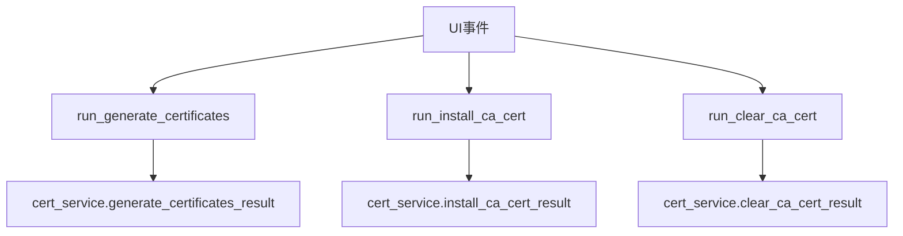

**接口说明：**

- `run_generate_certificates(*, ca_common_name: str, log_func: Callable[[str], None], thread_manager)`  
  启动证书生成任务。调用`cert_service.generate_certificates_result`执行证书生成，通过`log_func`输出日志。线程安全，可在UI线程调用。

- `run_install_ca_cert(*, log_func: Callable[[str], None], thread_manager)`  
  启动CA证书安装任务。调用`cert_service.install_ca_cert_result`执行安装，通过`log_func`输出日志。线程安全。

- `run_clear_ca_cert(*, ca_common_name: str, log_func: Callable[[str], None], thread_manager)`  
  启动CA证书清除任务。调用`cert_service.clear_ca_cert_result`执行清除，通过`log_func`输出日志。线程安全。

**实际调用示例：**
```python
# 在UI事件处理器中调用
run_generate_certificates(
    ca_common_name="MTGA_CA",
    log_func=self.log,
    thread_manager=self.thread_manager
)
```

**性能特征：**
- 所有操作均为异步执行，不会阻塞UI
- 证书生成耗时约5-10秒，取决于系统性能
- 使用线程池管理，避免创建过多线程

**使用限制：**
- 必须通过`thread_manager.run`执行后台任务
- `log_func`必须是可调用的函数
- 不支持并发执行相同类型的任务

**图源**
- [cert_actions.py](file://modules/actions/cert_actions.py#L9-L66)

**节源**
- [cert_actions.py](file://modules/actions/cert_actions.py#L9-L66)

### hosts_actions模块
`hosts_actions`模块通过`HostsTaskRunner`类提供hosts文件管理的UI事件处理，支持添加、移除、备份、还原和打开hosts文件。

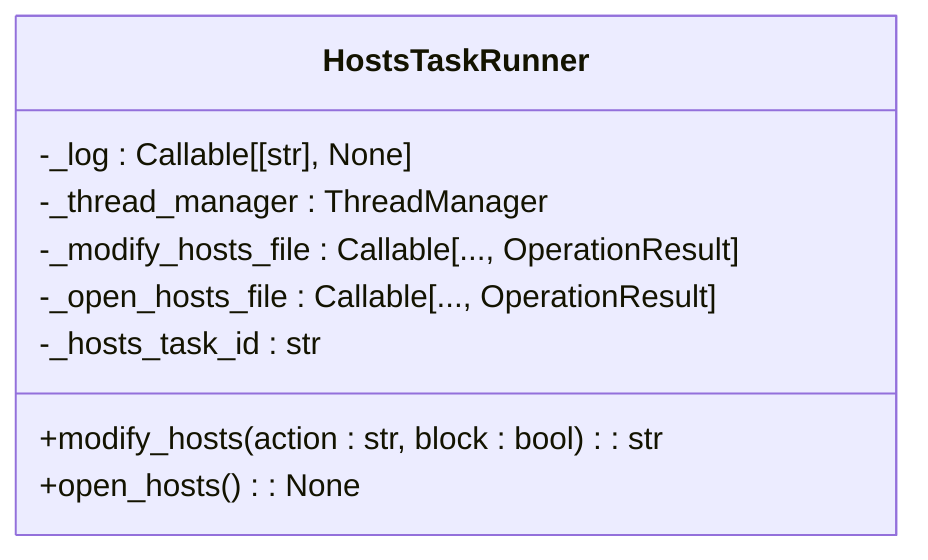

**接口说明：**

- `HostsTaskRunner.__init__(*, log_func: Callable[[str], None], thread_manager, modify_hosts_file, open_hosts_file)`  
  初始化任务运行器，注入依赖函数。`modify_hosts_file`和`open_hosts_file`为可调用函数，用于实际的文件操作。

- `modify_hosts(action: str = "add", *, block: bool = False)`  
  修改hosts文件。`action`参数支持"add"、"remove"、"backup"、"restore"。`block`参数控制是否阻塞执行。返回任务ID，可用于等待任务完成。

- `open_hosts()`  
  打开hosts文件进行编辑。根据平台选择合适的编辑器（Windows用记事本，macOS用默认文本编辑器）。

**实际调用示例：**
```python
# 创建任务运行器
runner = HostsTaskRunner(
    log_func=self.log,
    thread_manager=self.thread_manager,
    modify_hosts_file=modify_hosts_file,
    open_hosts_file=open_hosts_file
)

# 执行添加操作
task_id = runner.modify_hosts(action="add", block=False)
```

**性能特征：**
- 文件操作通过后台线程执行
- 支持任务依赖和等待机制
- 提供任务ID用于状态跟踪

**使用限制：**
- 必须注入所有依赖函数
- 不支持跨平台文件锁定
- 需要管理员权限修改hosts文件

**图源**
- [hosts_actions.py](file://modules/actions/hosts_actions.py#L8-L61)

**节源**
- [hosts_actions.py](file://modules/actions/hosts_actions.py#L8-L61)

### proxy_actions模块
`proxy_actions`模块通过`ProxyTaskRunner`类提供代理服务器管理的UI事件处理，支持启动、停止和一键启动全部服务。

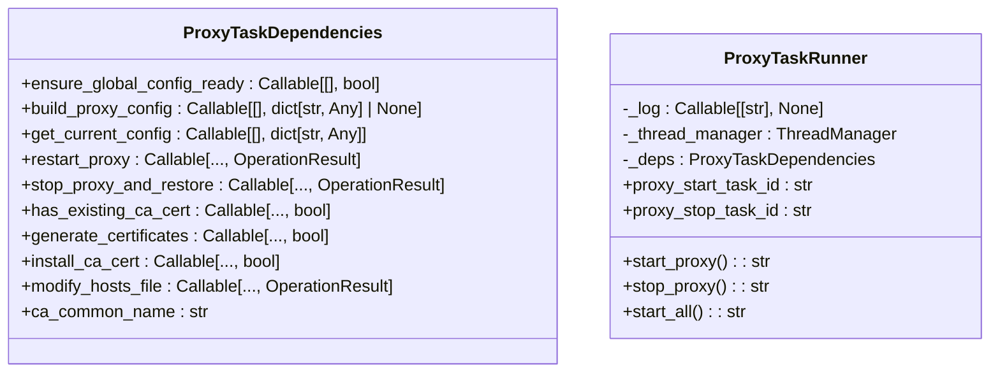

**接口说明：**

- `ProxyTaskDependencies`  
  数据类，定义代理任务所需的所有依赖函数和配置。采用依赖注入模式，提高可测试性。

- `ProxyTaskRunner.__init__(*, log_func: Callable[[str], None], thread_manager, deps: ProxyTaskDependencies)`  
  初始化代理任务运行器，注入日志函数、线程管理器和依赖对象。

- `start_proxy()`  
  启动代理服务器。先检查全局配置，然后异步执行`restart_proxy`。支持任务等待，避免重复启动。

- `stop_proxy()`  
  停止代理服务器。异步执行`stop_proxy_and_restore`，支持任务等待。

- `start_all()`  
  一键启动全部服务。按顺序执行：生成证书、安装CA证书、修改hosts文件、启动代理服务器。提供详细的进度日志。

**实际调用示例：**
```python
# 创建依赖对象
deps = ProxyTaskDependencies(
    ensure_global_config_ready=self.ensure_config_ready,
    build_proxy_config=self.build_config,
    # ... 其他依赖
)

# 创建任务运行器
runner = ProxyTaskRunner(
    log_func=self.log,
    thread_manager=self.thread_manager,
    deps=deps
)

# 一键启动全部服务
runner.start_all()
```

**性能特征：**
- 所有操作异步执行，不阻塞UI
- 提供任务ID用于状态跟踪
- 支持任务依赖和等待机制

**使用限制：**
- 必须提供完整的依赖对象
- 不支持并发执行`start_all`
- 依赖`thread_manager`的正确配置

**图源**
- [proxy_actions.py](file://modules/actions/proxy_actions.py#L11-L129)

**节源**
- [proxy_actions.py](file://modules/actions/proxy_actions.py#L11-L129)

## services模块核心服务

### cert_service模块
`cert_service`模块提供证书管理的核心服务接口，封装证书生成、安装、检查等操作。

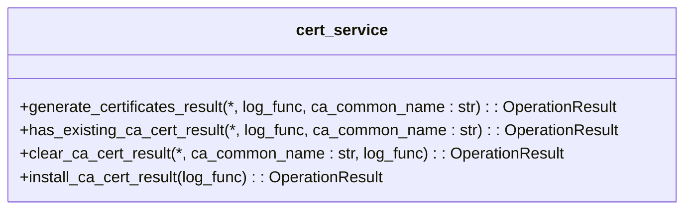

**接口说明：**

- `generate_certificates_result(*, log_func, ca_common_name: str)`  
  生成证书并返回`OperationResult`。调用`cert_generator.generate_certificates`执行实际生成。线程安全。

- `has_existing_ca_cert_result(*, log_func, ca_common_name: str)`  
  检查系统是否已存在指定CA证书。返回`OperationResult`包含检查结果。

- `clear_ca_cert_result(*, ca_common_name: str, log_func)`  
  清除CA证书。调用底层清理逻辑，返回操作结果。

- `install_ca_cert_result(log_func)`  
  安装CA证书到系统信任存储。根据平台调用相应安装逻辑。

**配置读取：**
- 通过`ResourceManager`获取证书路径
- 从配置文件读取CA证书信息
- 支持自定义CA证书名称

**状态检查：**
- 检查证书文件是否存在
- 验证证书文件完整性
- 检查系统证书存储状态

**操作执行：**
- 使用OpenSSL命令行工具生成证书
- 调用平台特定API安装证书
- 提供详细的错误信息和日志

**实际调用示例：**
```python
result = generate_certificates_result(
    log_func=print,
    ca_common_name="MTGA_CA"
)
if result.ok:
    print("证书生成成功")
else:
    print(f"证书生成失败: {result.message}")
```

**性能特征：**
- 证书生成耗时约5-10秒
- 文件I/O操作优化
- 错误处理完善

**使用限制：**
- 依赖OpenSSL工具
- 需要写入权限到证书目录
- 不支持并发证书操作

**图源**
- [cert_service.py](file://modules/services/cert_service.py#L10-L37)

**节源**
- [cert_service.py](file://modules/services/cert_service.py#L10-L37)

### hosts_service模块
`hosts_service`模块提供hosts文件管理的核心服务接口，封装文件操作的业务逻辑。

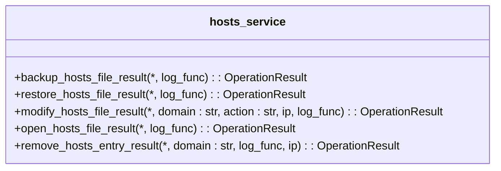

**接口说明：**

- `backup_hosts_file_result(*, log_func)`  
  备份hosts文件，返回`OperationResult`。调用`hosts_manager.backup_hosts_file`执行备份。

- `restore_hosts_file_result(*, log_func)`  
  还原hosts文件，返回`OperationResult`。调用`hosts_manager.restore_hosts_file`执行还原。

- `modify_hosts_file_result(*, domain: str, action: str, ip, log_func)`  
  修改hosts文件，支持添加、移除、备份、还原操作。返回`OperationResult`包含操作结果。

- `open_hosts_file_result(*, log_func)`  
  打开hosts文件进行编辑，返回`OperationResult`。根据平台选择合适的编辑器。

- `remove_hosts_entry_result(*, domain: str, log_func, ip)`  
  移除指定域名的hosts条目，返回`OperationResult`。

**配置读取：**
- 通过`ResourceManager`获取hosts文件路径
- 从配置文件读取默认IP地址
- 支持自定义域名和IP

**状态检查：**
- 检查文件是否存在
- 验证文件可写性
- 检测文件编码

**操作执行：**
- 原子性文件写入
- 支持备份和还原
- 提供详细的错误信息

**实际调用示例：**
```python
result = modify_hosts_file_result(
    domain="api.openai.com",
    action="add",
    log_func=print
)
if result.ok:
    print("hosts文件修改成功")
else:
    print(f"修改失败: {result.message}")
```

**性能特征：**
- 文件操作快速
- 支持大文件处理
- 错误处理完善

**使用限制：**
- 需要管理员权限
- 不支持网络文件系统
- 依赖平台特定API

**图源**
- [hosts_service.py](file://modules/services/hosts_service.py#L13-L60)

**节源**
- [hosts_service.py](file://modules/services/hosts_service.py#L13-L60)

### proxy_orchestration模块
`proxy_orchestration`模块提供代理服务器编排的核心服务，协调证书、hosts、代理服务器的启动流程。

```mermaid
classDiagram
class RestartProxyDeps {
+log : Callable[[str], None]
+stop_proxy_instance : Callable[..., OperationResult]
+start_proxy_instance : Callable[..., OperationResult]
}
class StartProxyDeps {
+log : Callable[[str], None]
+thread_manager : Any
+check_network_environment : Callable[..., Any]
+set_proxy_instance : Callable[[Any | None], None]
+modify_hosts_file : Callable[..., OperationResult]
+network_env_precheck_enabled : bool
}
class proxy_orchestration {
+ensure_global_config_ready(*, load_global_config : Callable[[], tuple[str, str]]) : GlobalConfigCheckResult
+build_proxy_config(*, get_current_config : Callable[[], dict[str, Any]], debug_mode : bool, disable_ssl_strict_mode : bool, stream_mode : str | None) : dict[str, Any] | None
+restart_proxy_result(*, config : dict[str, Any], deps : RestartProxyDeps, success_message : str, hosts_modified : bool) : OperationResult
+start_proxy_instance_result(*, config : dict[str, Any], deps : StartProxyDeps, success_message : str, hosts_modified : bool) : OperationResult
+stop_proxy_instance_result(*, get_proxy_instance : Callable[[], Any | None], set_proxy_instance : Callable[[Any | None], None], log : Callable[[str], None], reason : str, show_idle_message : bool) : OperationResult
}
```

**接口说明：**

- `ensure_global_config_ready(*, load_global_config)`  
  检查全局配置是否就绪，验证必要字段是否存在。返回`GlobalConfigCheckResult`包含检查结果。

- `build_proxy_config(*, get_current_config, debug_mode, disable_ssl_strict_mode, stream_mode)`  
  构建代理服务器配置，合并当前配置和运行时选项。返回完整的配置字典。

- `restart_proxy_result(*, config, deps, success_message, hosts_modified)`  
  重启代理服务器，先停止旧实例再启动新实例。返回`OperationResult`包含操作结果。

- `start_proxy_instance_result(*, config, deps, success_message, hosts_modified)`  
  启动代理服务器实例，执行端口检查、hosts修改等前置操作。返回`OperationResult`。

- `stop_proxy_instance_result(*, get_proxy_instance, set_proxy_instance, log, reason, show_idle_message)`  
  停止代理服务器实例，清理资源。返回`OperationResult`。

**配置读取：**
- 从UI配置获取代理设置
- 读取运行时参数
- 支持调试模式配置

**状态检查：**
- 检查端口占用情况
- 验证网络环境
- 检查证书状态

**操作执行：**
- 协调多步骤操作
- 提供详细的进度反馈
- 支持错误恢复

**实际调用示例：**
```python
deps = StartProxyDeps(
    log=print,
    thread_manager=thread_manager,
    check_network_environment=check_network,
    set_proxy_instance=set_instance,
    modify_hosts_file=modify_hosts,
    network_env_precheck_enabled=True
)

result = start_proxy_instance_result(
    config=current_config,
    deps=deps,
    success_message="代理启动成功"
)
```

**性能特征：**
- 启动时间约1-3秒
- 资源占用低
- 错误处理完善

**使用限制：**
- 依赖完整的依赖注入
- 需要正确配置`ResourceManager`
- 不支持并发启动

**图源**
- [proxy_orchestration.py](file://modules/services/proxy_orchestration.py#L36-L200)

**节源**
- [proxy_orchestration.py](file://modules/services/proxy_orchestration.py#L36-L200)

## 代理服务器核心API

### proxy_server模块
`proxy_server`模块提供代理服务器的核心API，负责服务器的启动、停止和状态管理。

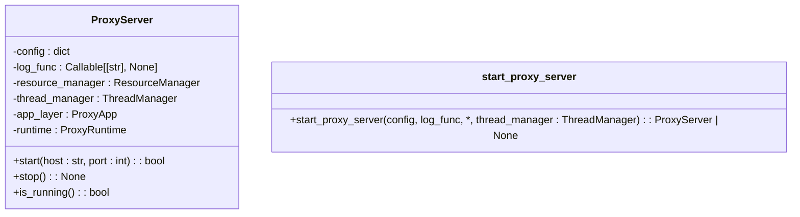

**接口说明：**

- `ProxyServer.__init__(config=None, log_func=print, *, thread_manager: ThreadManager)`  
  初始化代理服务器，装配领域逻辑（`ProxyApp`）和运行时（`ProxyRuntime`）。注入配置、日志函数和线程管理器。

- `start(host="0.0.0.0", port=443)`  
  启动代理服务器。先验证配置有效性，然后调用`runtime.start`执行实际启动。返回布尔值表示是否成功。

- `stop()`  
  停止代理服务器。调用`runtime.stop`和`app_layer.close`清理资源。

- `is_running()`  
  检查代理服务器是否正在运行。调用`runtime.is_running`获取状态。

- `start_proxy_server(config, log_func=print, *, thread_manager: ThreadManager)`  
  工厂函数，创建并启动代理服务器。成功返回`ProxyServer`实例，失败返回`None`。

**启动流程：**
1. 验证配置有效性
2. 创建`ProxyApp`处理业务逻辑
3. 创建`ProxyRuntime`管理运行时
4. 启动服务器监听
5. 返回启动结果

**停止流程：**
1. 发送停止信号
2. 等待服务器线程结束
3. 清理资源
4. 重置状态

**请求处理：**
- 使用Flask处理HTTP请求
- 支持HTTPS监听
- 提供详细的日志记录

**实际调用示例：**
```python
# 创建代理服务器
proxy = ProxyServer(
    config=config,
    log_func=print,
    thread_manager=thread_manager
)

# 启动服务器
if proxy.start():
    print("代理服务器启动成功")
else:
    print("代理服务器启动失败")

# 停止服务器
proxy.stop()
```

**性能特征：**
- 启动时间约1-2秒
- 内存占用约50-100MB
- 支持高并发连接

**使用限制：**
- 端口443需要管理员权限
- 依赖有效的证书文件
- 不支持热重启

**图源**
- [proxy_server.py](file://modules/proxy/proxy_server.py#L14-L65)

**节源**
- [proxy_server.py](file://modules/proxy/proxy_server.py#L14-L65)

### proxy_app模块
`proxy_app`模块实现代理服务的领域逻辑，包括配置解析、Flask路由和上游转发。

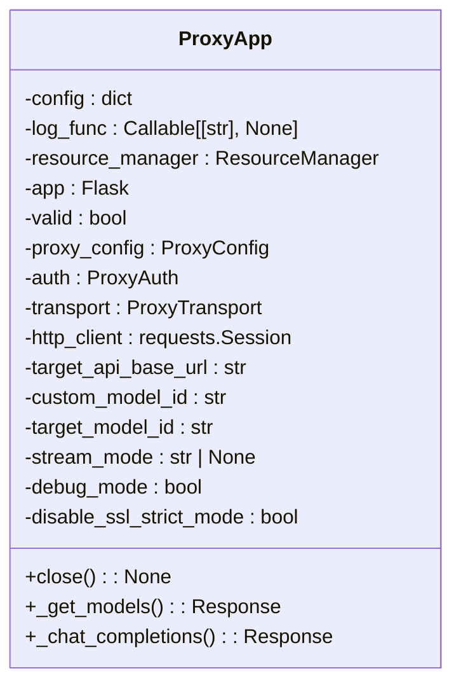

**接口说明：**

- `ProxyApp.__init__(config=None, log_func=print, *, resource_manager: ResourceManager)`  
  初始化代理应用，解析配置，创建Flask应用和相关组件。如果配置无效，`valid`属性为`False`。

- `close()`  
  关闭代理应用，清理资源，特别是HTTP客户端会话。

- `_get_models()`  
  处理模型列表请求，返回映射的模型信息。支持OpenAI API兼容的模型列表格式。

- `_chat_completions()`  
  处理聊天补全请求，执行鉴权、请求转换、上游转发和响应处理。支持流式和非流式响应。

**配置解析：**
- 从配置字典读取参数
- 支持调试模式
- 验证配置有效性

**Flask路由：**
- `/models`：返回模型列表
- `/chat/completions`：处理聊天补全
- 支持自定义中间路由

**上游转发：**
- 转换请求格式
- 添加鉴权头
- 处理流式响应
- 支持SSE日志记录

**实际调用示例：**
```python
# 通常由ProxyServer自动创建
app = ProxyApp(config=config, log_func=print, resource_manager=rm)
if app.valid:
    # 可以处理请求
    pass
else:
    # 配置无效
    pass
```

**性能特征：**
- 请求处理延迟低
- 支持流式传输
- 内存效率高

**使用限制：**
- 依赖有效的配置
- 需要网络连接到上游API
- 不支持自定义路由扩展

**图源**
- [proxy_app.py](file://modules/proxy/proxy_app.py#L18-L462)

**节源**
- [proxy_app.py](file://modules/proxy/proxy_app.py#L18-L462)

### proxy_runtime模块
`proxy_runtime`模块实现代理运行时，负责证书、监听和线程生命周期管理。

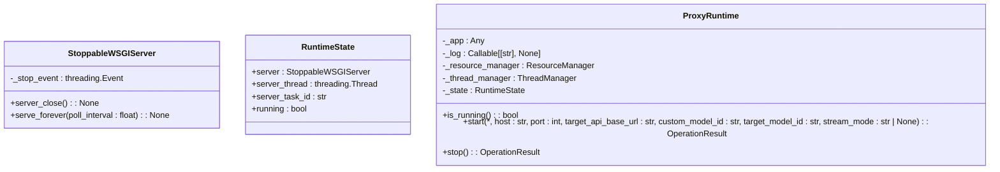

**接口说明：**

- `StoppableWSGIServer`  
  可停止的WSGI服务器，继承自`BaseWSGIServer`，添加停止事件和`serve_forever`方法。

- `RuntimeState`  
  数据类，记录运行时状态，包括服务器实例、线程、任务ID和运行状态。

- `ProxyRuntime.__init__(app, log_func, *, resource_manager: ResourceManager, thread_manager: ThreadManager)`  
  初始化代理运行时，注入Flask应用、日志函数和资源管理器。

- `is_running()`  
  检查代理是否正在运行，基于`_state.running`状态。

- `start(*, host, port, target_api_base_url, custom_model_id, target_model_id, stream_mode)`  
  启动代理服务器，执行证书检查、端口检查、服务器实例创建和线程启动。返回`OperationResult`。

- `stop()`  
  停止代理服务器，发送停止信号，等待线程结束，清理资源。返回`OperationResult`。

**生命周期管理：**
- 服务器实例创建和销毁
- 线程管理和同步
- 资源清理

**错误处理：**
- 端口占用
- 权限不足
- 证书缺失
- 启动超时

**实际调用示例：**
```python
# 通常由ProxyServer调用
runtime = ProxyRuntime(
    app=flask_app,
    log_func=print,
    resource_manager=rm,
    thread_manager=tm
)

result = runtime.start(
    host="0.0.0.0",
    port=443,
    target_api_base_url="https://api.openai.com",
    custom_model_id="gpt-3.5-turbo",
    target_model_id="gpt-3.5-turbo",
    stream_mode=None
)
```

**性能特征：**
- 启动时间约1-2秒
- 资源占用低
- 线程安全

**使用限制：**
- 依赖有效的证书文件
- 需要管理员权限监听443端口
- 不支持动态端口配置

**图源**
- [proxy_runtime.py](file://modules/proxy/proxy_runtime.py#L46-L218)

**节源**
- [proxy_runtime.py](file://modules/proxy/proxy_runtime.py#L46-L218)

## OperationResult对象传递模式

### OperationResult类
`OperationResult`类是系统中统一的结果传递对象，用于在各层间传递操作结果、消息和错误码。

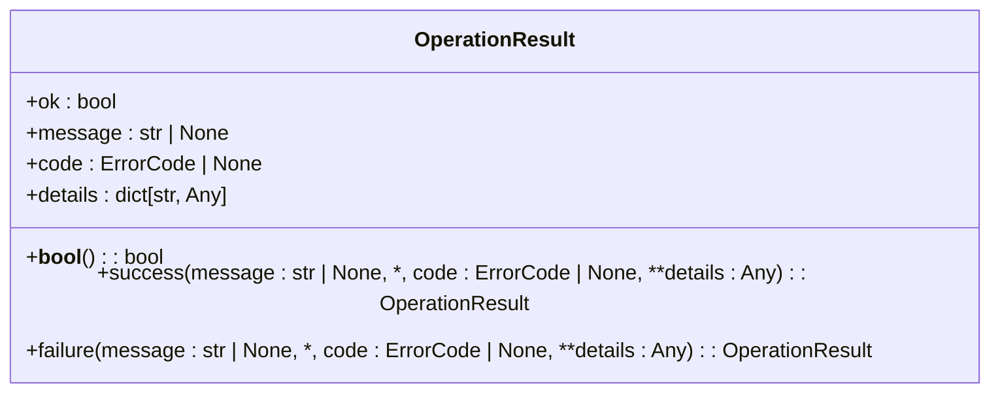

**接口说明：**

- `ok: bool`  
  操作是否成功。`True`表示成功，`False`表示失败。

- `message: str | None`  
  操作结果的描述消息。成功时可为空，失败时提供错误信息。

- `code: ErrorCode | None`  
  错误码，使用`ErrorCode`枚举。便于程序化处理错误。

- `details: dict[str, Any]`  
  附加的详细信息，可用于传递上下文数据。

- `__bool__()`  
  布尔转换方法，使`OperationResult`可以像布尔值一样使用。

- `success(message: str | None, *, code: ErrorCode | None, **details: Any)`  
  类方法，创建成功结果实例。

- `failure(message: str | None, *, code: ErrorCode | None, **details: Any)`  
  类方法，创建失败结果实例。

**传递模式：**
- 从底层服务向上层传递结果
- 保持结果的一致性
- 支持链式调用和错误传播

**实际调用示例：**
```python
# 创建成功结果
success_result = OperationResult.success(
    message="操作成功",
    code=ErrorCode.CONFIG_INVALID,
    extra_info="additional data"
)

# 创建失败结果
failure_result = OperationResult.failure(
    message="操作失败",
    code=ErrorCode.PORT_IN_USE
)

# 检查结果
if result.ok:
    print("成功:", result.message)
else:
    print("失败:", result.message, "错误码:", result.code)
```

**性能特征：**
- 轻量级，内存占用小
- 不可变对象，线程安全
- 创建开销低

**使用限制：**
- 不支持继承
- 详情字典大小有限制
- 错误码必须预定义

**图源**
- [operation_result.py](file://modules/runtime/operation_result.py#L10-L41)

**节源**
- [operation_result.py](file://modules/runtime/operation_result.py#L10-L41)

### 错误码体系
系统使用`ErrorCode`枚举定义统一的错误码体系，便于程序化处理错误。

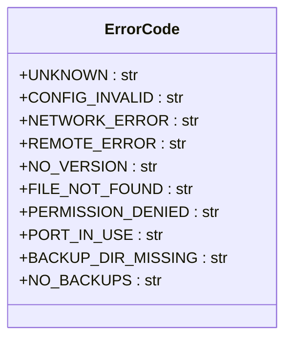

**错误码说明：**

- `UNKNOWN`：未知错误
- `CONFIG_INVALID`：配置无效
- `NETWORK_ERROR`：网络异常
- `REMOTE_ERROR`：远程服务异常
- `NO_VERSION`：未解析到版本号
- `FILE_NOT_FOUND`：文件不存在
- `PERMISSION_DENIED`：权限不足
- `PORT_IN_USE`：端口已被占用
- `BACKUP_DIR_MISSING`：未找到备份文件夹
- `NO_BACKUPS`：未找到任何备份

**错误消息映射：**
通过`result_messages.describe_result`函数将错误码转换为用户友好的中文消息。

**实际调用示例：**
```python
# 获取错误消息
message = describe_result(result, "默认错误消息")
print(message)  # 输出: "端口已被占用"
```

**性能特征：**
- 枚举查找快速
- 消息映射表小
- 内存占用低

**使用限制：**
- 错误码必须预定义
- 不支持动态添加错误码
- 消息映射固定

**图源**
- [error_codes.py](file://modules/runtime/error_codes.py#L6-L20)
- [result_messages.py](file://modules/runtime/result_messages.py#L6-L17)

**节源**
- [error_codes.py](file://modules/runtime/error_codes.py#L6-L20)
- [result_messages.py](file://modules/runtime/result_messages.py#L6-L17)

## 跨模块调用契约

### 数据传递规范
系统各模块间通过明确定义的契约进行数据传递，确保接口的稳定性和可维护性。

**调用上下文：**
- UI层调用actions模块的函数
- actions模块调用services模块的服务
- services模块调用底层模块的实现
- 底层模块返回`OperationResult`给上层

**数据流：**
1. UI事件触发actions函数
2. actions函数通过`thread_manager`异步执行
3. actions调用services服务
4. services返回`OperationResult`
5. actions根据结果更新UI日志
6. UI显示最终结果

**契约约定：**
- 所有公共接口必须返回`OperationResult`或通过`log_func`输出
- 异常必须被捕获并转换为`OperationResult`
- 配置参数必须有默认值或明确的类型提示
- 函数签名必须使用关键字参数（`*`后参数）

**线程安全性：**
- actions模块的函数线程安全
- services模块的服务线程安全
- 底层模块的实现线程安全
- 使用`thread_manager`协调并发

**性能特征：**
- 调用开销低
- 错误处理完善
- 接口稳定

**使用限制：**
- 不支持直接调用底层实现
- 必须遵循契约约定
- 不支持动态接口修改

**图源**
- [thread_manager.py](file://modules/runtime/thread_manager.py#L42-L171)

**节源**
- [thread_manager.py](file://modules/runtime/thread_manager.py#L42-L171)