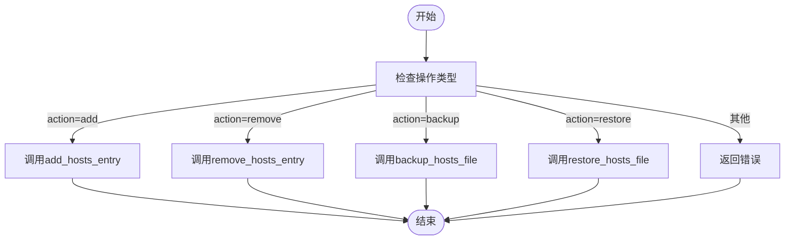
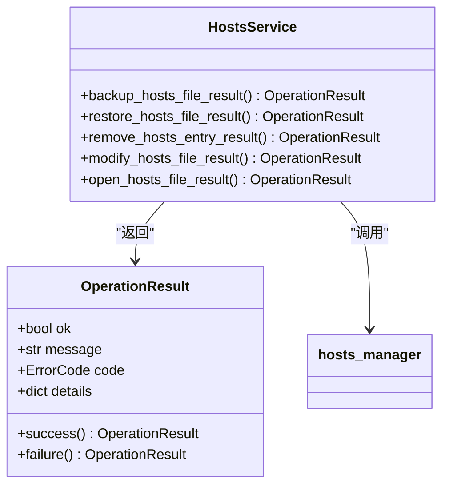
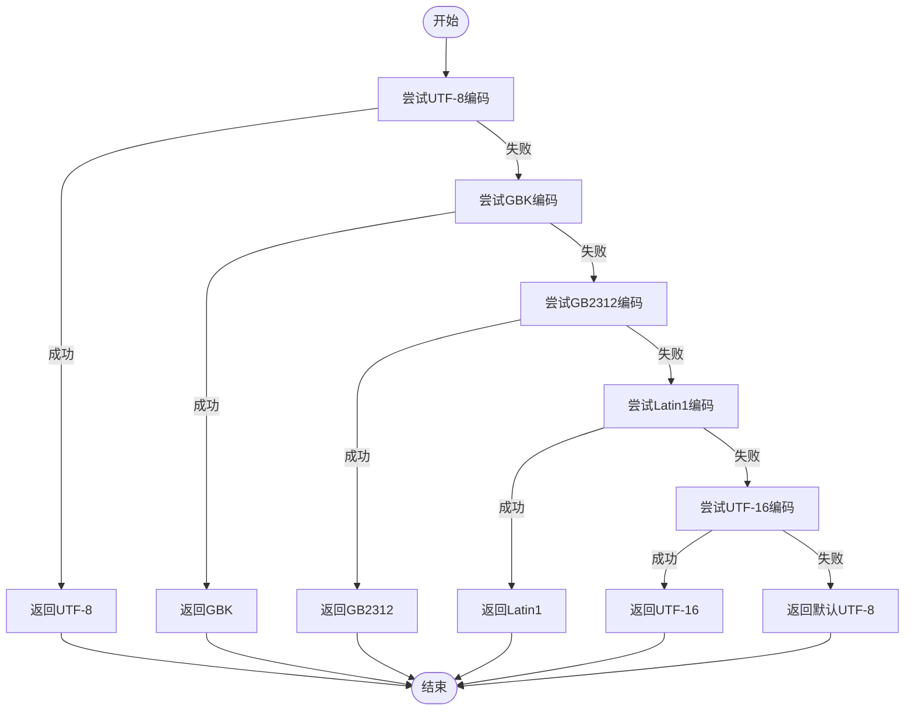
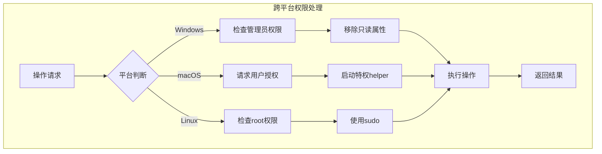
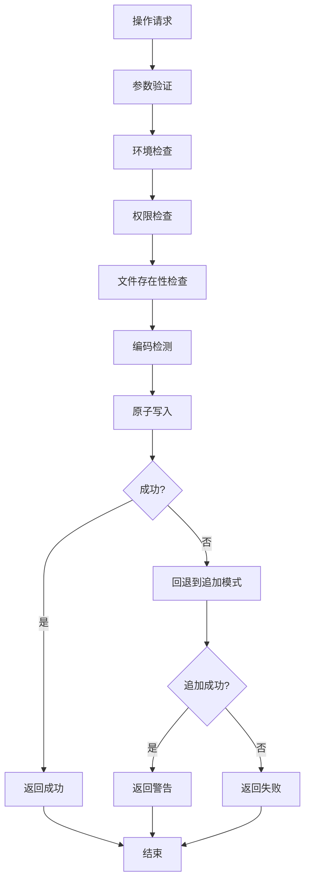

# Hosts文件操作API

<cite>
**本文档引用的文件**   
- [hosts_manager.py](file://modules/hosts/hosts_manager.py)
- [hosts_service.py](file://modules/services/hosts_service.py)
- [operation_result.py](file://modules/runtime/operation_result.py)
- [file_operability.py](file://modules/hosts/file_operability.py)
- [hosts_state.py](file://modules/hosts/hosts_state.py)
- [hosts_text.py](file://modules/hosts/hosts_text.py)
- [macos_privileged_helper.py](file://modules/platform/macos_privileged_helper.py)
- [privileges.py](file://modules/platform/privileges.py)
- [resource_manager.py](file://modules/runtime/resource_manager.py)
</cite>

## 目录
1. [简介](#简介)
2. [核心函数详解](#核心函数详解)
3. [统一入口函数分析](#统一入口函数分析)
4. [服务层封装机制](#服务层封装机制)
5. [关键技术细节](#关键技术细节)
6. [调用示例与最佳实践](#调用示例与最佳实践)
7. [错误处理与恢复策略](#错误处理与恢复策略)

## 简介
本文档详细解析了Hosts文件操作API的核心实现机制，重点分析`hosts_manager.py`模块中的`add_hosts_entry`、`remove_hosts_entry`、`backup_hosts_file`、`restore_hosts_file`和`modify_hosts_file`等核心函数的内部逻辑与调用流程。同时，文档化了`hosts_service.py`中对应的`*_result`系列函数如何将底层操作封装为标准化的`OperationResult`对象，提供统一的成功/失败反馈机制。

该API设计用于安全地管理系统的Hosts文件，支持跨平台（Windows、macOS、Linux）操作，并具备完善的权限处理、编码检测、原子写入和回退机制。系统通过分层架构将底层文件操作与上层服务调用分离，确保了代码的可维护性和可扩展性。

## 核心函数详解

### add_hosts_entry函数
`add_hosts_entry`函数用于向Hosts文件安全地添加域名解析条目。该函数实现了原子性写入、重复检测和智能回退机制。

**参数说明**：
- `domain`: 要添加的域名字符串
- `ip`: 单个IP字符串或包含多个IP的可迭代对象（默认使用`DEFAULT_HOSTS_IPS`中的`127.0.0.1`和`::1`）
- `log_func`: 日志输出函数，默认为`print`

**返回值逻辑**：
- 成功时返回`True`，表示Hosts条目已成功添加或已存在
- 失败时返回`False`，表示操作未能完成

**异常处理策略**：
函数通过多层防御机制处理各种异常情况：
1. 首先检查Hosts文件是否存在
2. 检测文件编码格式（支持utf-8、gbk、gb2312、latin1、utf-16）
3. 使用`guard_hosts_modify`检查环境是否允许修改
4. 在写入失败时自动回退到追加模式

函数采用统一的文本块格式写入，以`# Added by MTGA GUI`作为标记，便于后续识别和管理。

**Section sources**
- [hosts_manager.py](file://modules/hosts/hosts_manager.py#L264-L357)

### remove_hosts_entry函数
`remove_hosts_entry`函数用于从Hosts文件中删除指定的域名解析条目。该函数能够智能识别并移除由本系统添加的文本块。

**参数说明**：
- `domain`: 要删除的域名
- `ip`: 可选参数，指定需要删除的IP列表（默认删除模块写入的两个地址）
- `log_func`: 日志输出函数
- `ip`参数：可选，指定需要删除的IP列表

**返回值逻辑**：
- 成功时返回`True`，表示条目已成功删除或不存在
- 失败时返回`False`，表示操作失败

**异常处理策略**：
函数在执行前会进行严格的环境检查：
1. 通过`guard_hosts_modify`函数检查删除操作是否被阻断
2. 检查Hosts文件是否存在
3. 检测文件编码格式
4. 使用`remove_hosts_block_from_content`函数精确移除目标文本块

函数能够同时处理新版本的文本块格式和旧版本的逐条写入格式，确保兼容性。

**Section sources**
- [hosts_manager.py](file://modules/hosts/hosts_manager.py#L360-L406)

### backup_hosts_file函数
`backup_hosts_file`函数用于创建Hosts文件的备份副本，为可能的还原操作提供安全保障。

**参数说明**：
- `log_func`: 日志输出函数

**返回值逻辑**：
- 成功时返回`True`，表示备份已创建
- 失败时返回`False`，表示备份失败

**异常处理策略**：
1. 首先验证Hosts文件是否存在
2. 使用`shutil.copy2`进行备份，保留文件元数据
3. 备份文件存储在用户数据目录下的`hosts.backup`文件中
4. 提供详细的日志输出，包括备份路径

该函数是安全操作的前提，建议在进行任何修改前先执行备份。

**Section sources**
- [hosts_manager.py](file://modules/hosts/hosts_manager.py#L150-L175)

### restore_hosts_file函数
`restore_hosts_file`函数用于将Hosts文件从备份状态还原，恢复到之前的状态。

**参数说明**：
- `log_func`: 日志输出函数

**返回值逻辑**：
- 成功时返回`True`，表示还原成功
- 失败时返回`False`，表示还原失败

**异常处理策略**：
1. 通过`guard_hosts_modify`检查还原操作是否被阻断
2. 验证备份文件是否存在
3. 在macOS系统上使用特权会话进行还原
4. 使用`shutil.copy2`进行文件复制，确保完整性

函数在macOS上需要管理员权限，通过`get_mac_privileged_session`获取特权会话来完成操作。

**Section sources**
- [hosts_manager.py](file://modules/hosts/hosts_manager.py#L178-L214)

## 统一入口函数分析

### modify_hosts_file函数
`modify_hosts_file`作为Hosts文件操作的统一入口函数，通过调度机制处理多种操作类型，实现了操作的集中管理和统一接口。



**Diagram sources**
- [hosts_manager.py](file://modules/hosts/hosts_manager.py#L459-L491)

**参数说明**：
- `domain`: 域名，默认为"api.openai.com"
- `action`: 操作类型，支持"add"、"remove"、"backup"、"restore"
- `ip`: IP地址或列表，仅在`action="add"`时使用
- `log_func`: 日志输出函数

**调度逻辑**：
函数根据`action`参数的值，调用相应的底层函数：
- `add`: 调用`add_hosts_entry`添加条目
- `remove`: 调用`remove_hosts_entry`删除条目
- `backup`: 调用`backup_hosts_file`创建备份
- `restore`: 调用`restore_hosts_file`还原文件

**内部状态检测与回退机制**：
1. **状态检测**：通过`get_hosts_modify_block_state`获取当前修改阻断状态
2. **回退机制**：当原子写入失败时，自动回退到追加写入模式
3. **追加写入模式**：在无法保证原子性的情况下，采用追加方式写入，但会提示用户手动管理

该函数的设计体现了单一入口原则，简化了上层调用的复杂性。

**Section sources**
- [hosts_manager.py](file://modules/hosts/hosts_manager.py#L459-L491)

## 服务层封装机制

### hosts_service.py中的_result系列函数
`hosts_service.py`模块将底层的Hosts操作封装为一系列`*_result`函数，返回标准化的`OperationResult`对象，提供统一的成功/失败反馈。



**Diagram sources**
- [hosts_service.py](file://modules/services/hosts_service.py#L13-L46)
- [operation_result.py](file://modules/runtime/operation_result.py#L9-L37)

**封装模式**：
每个`*_result`函数都遵循相同的封装模式：
1. 调用底层的`hosts_manager`函数
2. 根据返回值创建`OperationResult`对象
3. 成功时调用`OperationResult.success()`
4. 失败时调用`OperationResult.failure()`并提供错误信息

这种封装方式实现了：
- **错误标准化**：所有操作返回统一的`OperationResult`对象
- **信息丰富化**：除了成功/失败状态，还包含消息、错误码和详细信息
- **调用简化**：上层代码无需关心底层实现细节

**OperationResult结构**：
`OperationResult`是一个不可变的数据类，包含：
- `ok`: 布尔值，表示操作是否成功
- `message`: 可选的描述性消息
- `code`: 可选的错误码
- `details`: 包含额外信息的字典

**Section sources**
- [hosts_service.py](file://modules/services/hosts_service.py#L13-L46)
- [operation_result.py](file://modules/runtime/operation_result.py#L9-L37)

## 关键技术细节

### 编码检测机制
系统通过`detect_file_encoding`函数实现Hosts文件的编码检测，支持多种编码格式：



**Diagram sources**
- [hosts_manager.py](file://modules/hosts/hosts_manager.py#L137-L147)

检测顺序为：utf-8 → gbk → gb2312 → latin1 → utf-16，确保能够正确处理不同系统和地区的编码差异。

### 原子写入机制
系统实现了多层次的原子写入保障：
1. **文件操作预检**：通过`check_file_operability`检查文件可写性
2. **权限管理**：在Windows上确保文件非只读，在macOS上获取管理员权限
3. **事务性操作**：先读取、修改内容，再一次性写回
4. **自动备份**：在修改前自动创建备份

当原子写入失败时，系统会自动回退到追加写入模式，确保基本功能可用。

### 跨平台文件权限处理
系统针对不同平台实现了专门的权限处理机制：

**Windows平台**：
- 使用`is_windows_admin`检查管理员权限
- 使用`ensure_windows_file_writable`移除只读属性
- 通过WinAPI探测文件访问权限

**macOS平台**：
- 使用`get_mac_privileged_session`获取管理员权限
- 通过`osascript`请求用户授权
- 使用Unix Socket与特权helper进程通信

**Linux/Unix平台**：
- 使用`is_admin`检查root权限
- 依赖系统sudo机制



**Diagram sources**
- [privileges.py](file://modules/platform/privileges.py#L13-L112)
- [macos_privileged_helper.py](file://modules/platform/macos_privileged_helper.py#L48-L357)

**Section sources**
- [hosts_manager.py](file://modules/hosts/hosts_manager.py#L217-L261)
- [file_operability.py](file://modules/hosts/file_operability.py#L117-L196)

## 调用示例与最佳实践

### 基本调用示例
```python
# 添加Hosts条目
result = modify_hosts_file_result(
    domain="api.openai.com",
    action="add",
    ip=["127.0.0.1", "::1"],
    log_func=print
)

# 删除Hosts条目
result = modify_hosts_file_result(
    domain="api.openai.com",
    action="remove",
    log_func=print
)

# 备份Hosts文件
result = backup_hosts_file_result(log_func=print)

# 还原Hosts文件
result = restore_hosts_file_result(log_func=print)
```

### 最佳实践
1. **始终先备份**：在进行任何修改前，先执行`backup_hosts_file`
2. **检查返回值**：总是检查`OperationResult.ok`属性来确定操作结果
3. **提供日志函数**：使用自定义日志函数而非默认的`print`
4. **处理权限问题**：在macOS上确保用户能够通过授权弹窗

**Section sources**
- [hosts_actions.py](file://modules/actions/hosts_actions.py#L8-L60)

## 错误处理与恢复策略

### 错误处理层级
系统实现了多层次的错误处理机制：



**Diagram sources**
- [hosts_manager.py](file://modules/hosts/hosts_manager.py#L264-L357)

### 恢复策略
当操作失败时，系统提供多种恢复途径：
1. **自动回退**：从原子写入回退到追加写入模式
2. **手动干预**：提示用户使用`open_hosts_file`手动编辑
3. **完全还原**：使用`restore_hosts_file`从备份恢复
4. **权限重试**：提示用户以管理员身份重新运行

这些策略确保了系统的健壮性和用户体验。

**Section sources**
- [hosts_manager.py](file://modules/hosts/hosts_manager.py#L73-L91)
- [hosts_state.py](file://modules/hosts/hosts_state.py#L49-L63)