# Hosts状态与权限管理API

<cite>
**本文档引用的文件**
- [hosts_manager.py](file://modules/hosts/hosts_manager.py)
- [file_operability.py](file://modules/hosts/file_operability.py)
- [hosts_state.py](file://modules/hosts/hosts_state.py)
- [macos_privileged_helper.py](file://modules/platform/macos_privileged_helper.py)
- [privileges.py](file://modules/platform/privileges.py)
- [hosts_actions.py](file://modules/actions/hosts_actions.py)
- [thread_manager.py](file://modules/runtime/thread_manager.py)
- [startup_checks.py](file://modules/services/startup_checks.py)
- [main_window_builder.py](file://modules/ui/main_window_builder.py)
</cite>

## 目录
1. [简介](#简介)
2. [项目结构](#项目结构)
3. [核心组件](#核心组件)
4. [架构概览](#架构概览)
5. [详细组件分析](#详细组件分析)
6. [依赖关系分析](#依赖关系分析)
7. [性能考虑](#性能考虑)
8. [故障排除指南](#故障排除指南)
9. [结论](#结论)

## 简介

本文档深入解析ModelRelay项目中Hosts文件状态与权限管理系统的完整API架构，重点关注`hosts_manager.py`中`check_hosts_file_operability`和`write_hosts_file_with_permission`函数的跨平台权限处理机制。该系统实现了智能的权限检测、自动降级策略和用户友好的错误处理，确保在不同操作系统环境下都能可靠地管理hosts文件。

系统采用分层设计，从底层的文件可操作性检查到高层的UI协调，形成了完整的权限管理生态系统。特别针对Windows平台的只读属性处理和macOS平台的特权助手通信进行了深入分析。

## 项目结构

Hosts权限管理系统分布在多个模块中，形成清晰的职责分离：

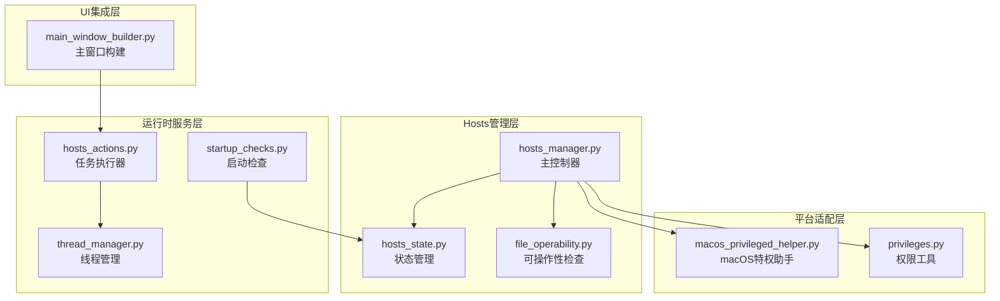

**图表来源**
- [hosts_manager.py](file://modules/hosts/hosts_manager.py#L1-L492)
- [file_operability.py](file://modules/hosts/file_operability.py#L1-L211)
- [hosts_state.py](file://modules/hosts/hosts_state.py#L1-L76)
- [macos_privileged_helper.py](file://modules/platform/macos_privileged_helper.py#L1-L487)
- [privileges.py](file://modules/platform/privileges.py#L1-L113)
- [hosts_actions.py](file://modules/actions/hosts_actions.py#L1-L61)
- [thread_manager.py](file://modules/runtime/thread_manager.py#L1-L171)
- [startup_checks.py](file://modules/services/startup_checks.py#L1-L108)

**章节来源**
- [hosts_manager.py](file://modules/hosts/hosts_manager.py#L1-L50)
- [file_operability.py](file://modules/hosts/file_operability.py#L1-L30)
- [hosts_state.py](file://modules/hosts/hosts_state.py#L1-L20)

## 核心组件

### FileOperabilityReport - 可操作性报告模型

`FileOperabilityReport`是整个权限管理系统的核心数据结构，提供了跨平台的文件可操作性评估结果：

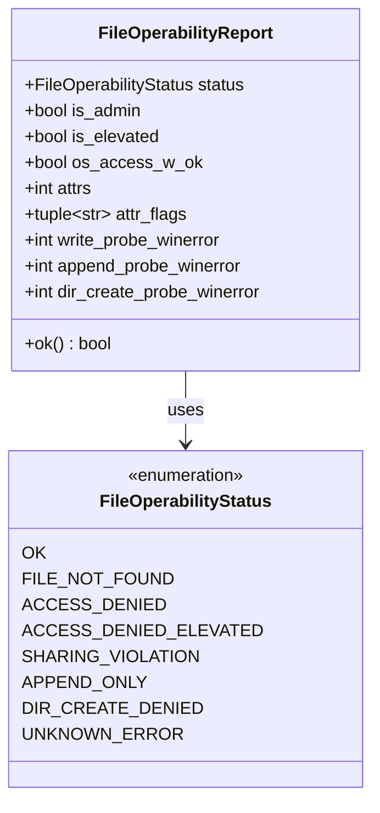

**图表来源**
- [file_operability.py](file://modules/hosts/file_operability.py#L24-L50)

该报告模型包含了以下关键信息：
- **状态码**：标准化的可操作性状态
- **权限信息**：管理员权限和提升权限状态
- **属性信息**：文件属性标志和WinAPI错误码
- **探测结果**：写入和追加权限的WinAPI探测结果

**章节来源**
- [file_operability.py](file://modules/hosts/file_operability.py#L24-L50)

### HostsModifyBlockState - 修改阻断状态

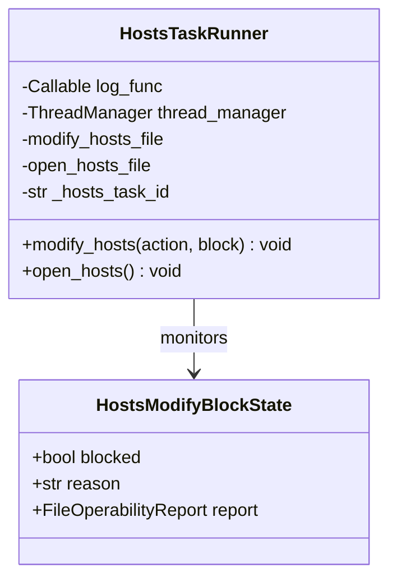

**图表来源**
- [hosts_state.py](file://modules/hosts/hosts_state.py#L10-L15)
- [hosts_actions.py](file://modules/actions/hosts_actions.py#L8-L22)

**章节来源**
- [hosts_state.py](file://modules/hosts/hosts_state.py#L10-L15)
- [hosts_actions.py](file://modules/actions/hosts_actions.py#L8-L22)

## 架构概览

Hosts权限管理系统的整体架构采用了分层设计，确保了良好的可维护性和扩展性：

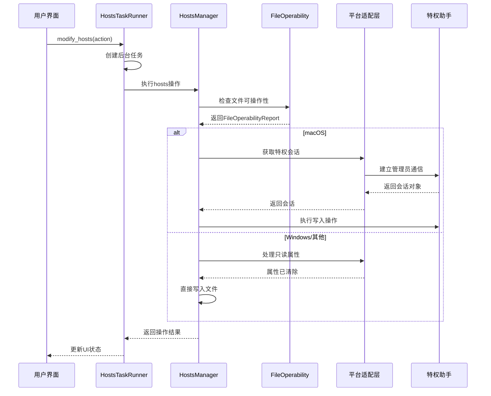

**图表来源**
- [hosts_manager.py](file://modules/hosts/hosts_manager.py#L217-L262)
- [macos_privileged_helper.py](file://modules/platform/macos_privileged_helper.py#L344-L357)
- [hosts_actions.py](file://modules/actions/hosts_actions.py#L23-L48)

## 详细组件分析

### Windows平台权限处理机制

#### check_hosts_file_operability - 可写性预检

`check_hosts_file_operability`函数提供了全面的Windows文件可操作性检查：

```mermaid
flowchart TD
Start([开始检查]) --> CheckExists{文件是否存在?}
CheckExists --> |否| ReturnNotFound[返回FILE_NOT_FOUND]
CheckExists --> |是| CheckPlatform{是否Windows?}
CheckPlatform --> |否| UnixCheck[Unix权限检查]
CheckPlatform --> |是| WinChecks[Windows专用检查]
WinChecks --> GetAdmin[获取管理员状态]
GetAdmin --> GetElevated[获取提升权限状态]
GetElevated --> GetAccess[检查os.access(W_OK)]
GetAccess --> GetAttrs[读取文件属性]
GetAttrs --> ProbeWrite[WinAPI探测写入权限]
ProbeWrite --> ProbeAppend[WinAPI探测追加权限]
ProbeAppend --> DirProbe[目录可写性探测]
DirProbe --> DetermineStatus{确定状态}
UnixCheck --> ReturnOK[返回OK]
DetermineStatus --> |写入成功| ReturnOK
DetermineStatus --> |共享冲突| ReturnSharing[返回SHARING_VIOLATION]
DetermineStatus --> |仅追加| ReturnAppendOnly[返回APPEND_ONLY]
DetermineStatus --> |目录无权限| ReturnDirDenied[返回DIR_CREATE_DENIED]
DetermineStatus --> |提升权限| ReturnElevated[返回ACCESS_DENIED_ELEVATED]
DetermineStatus --> |普通拒绝| ReturnDenied[返回ACCESS_DENIED]
DetermineStatus --> |其他| ReturnUnknown[返回UNKNOWN_ERROR]
ReturnNotFound --> End([结束])
ReturnOK --> End
ReturnSharing --> End
ReturnAppendOnly --> End
ReturnDirDenied --> End
ReturnElevated --> End
ReturnDenied --> End
ReturnUnknown --> End
```

**图表来源**
- [file_operability.py](file://modules/hosts/file_operability.py#L117-L196)

#### ensure_windows_file_writable - 只读属性处理

Windows平台的`ensure_windows_file_writable`函数专门处理只读属性问题：

**章节来源**
- [file_operability.py](file://modules/hosts/file_operability.py#L199-L211)

该函数通过调用`os.chmod(file_path, stat.S_IWRITE)`来移除文件的只读属性，这是解决Windows hosts文件写入问题的关键步骤。

### macOS平台特权助手通信

#### MacPrivilegeSession - 特权会话管理

macOS平台采用了独特的特权助手架构来处理高权限文件操作：

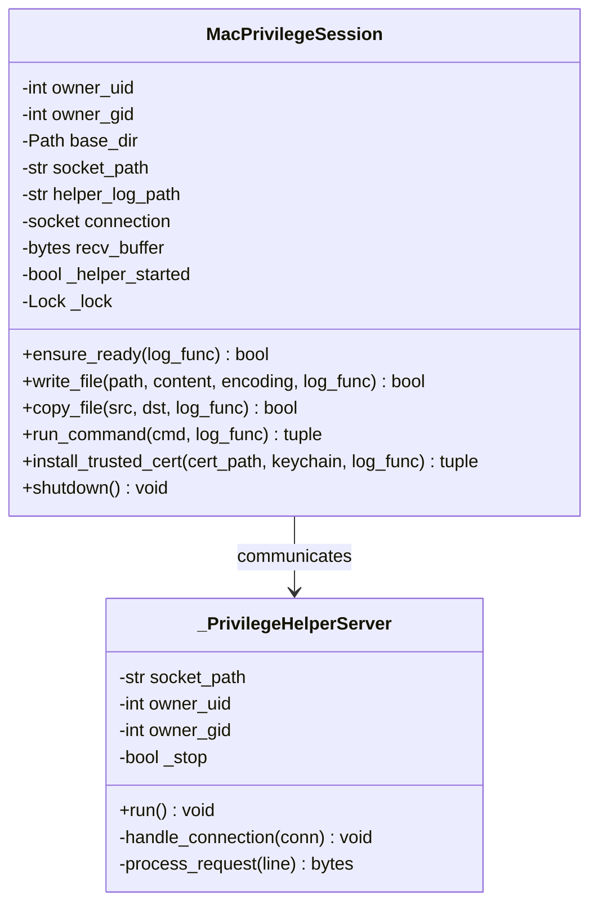

**图表来源**
- [macos_privileged_helper.py](file://modules/platform/macos_privileged_helper.py#L52-L338)

#### get_mac_privileged_session - 会话获取流程

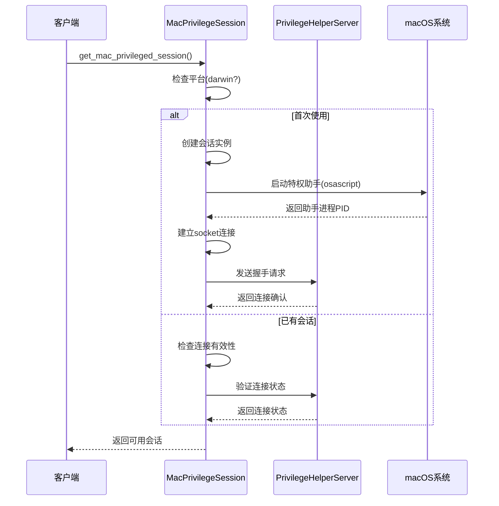

**图表来源**
- [macos_privileged_helper.py](file://modules/platform/macos_privileged_helper.py#L344-L357)

**章节来源**
- [macos_privileged_helper.py](file://modules/platform/macos_privileged_helper.py#L52-L357)

### FileOperabilityReport在可写性预检中的作用

`FileOperabilityReport`在可写性预检中扮演着核心角色，它不仅提供了静态的权限状态信息，还包含了动态的探测结果：

#### 综合判断逻辑

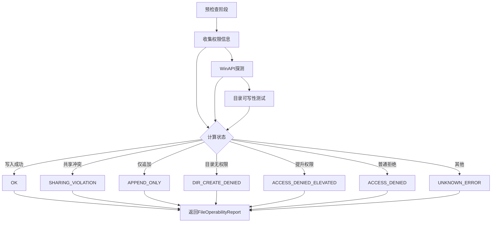

**图表来源**
- [file_operability.py](file://modules/hosts/file_operability.py#L117-L196)

**章节来源**
- [file_operability.py](file://modules/hosts/file_operability.py#L117-L196)

### guard_hosts_modify - 状态守卫机制

`guard_hosts_modify`函数实现了关键的修改操作前状态守卫：

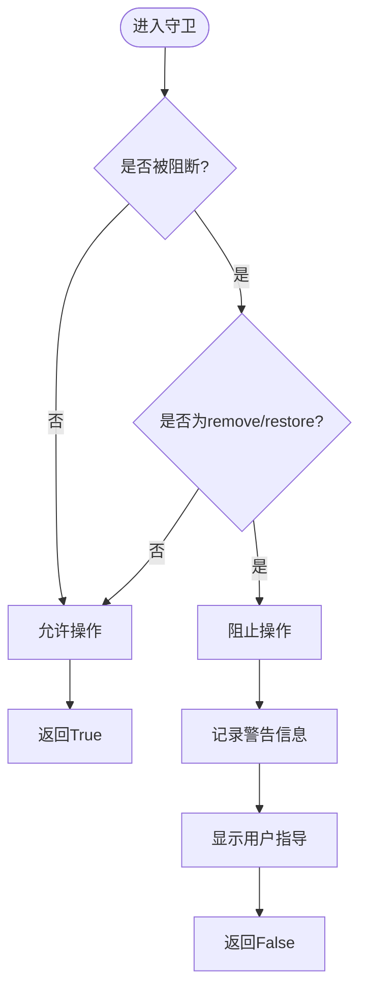

**图表来源**
- [hosts_state.py](file://modules/hosts/hosts_state.py#L49-L63)

**章节来源**
- [hosts_state.py](file://modules/hosts/hosts_state.py#L49-L63)

### 优雅回退策略

当权限不足或系统限制时，系统实现了多层次的优雅回退策略：

#### _fallback_to_append - 追加写入回退

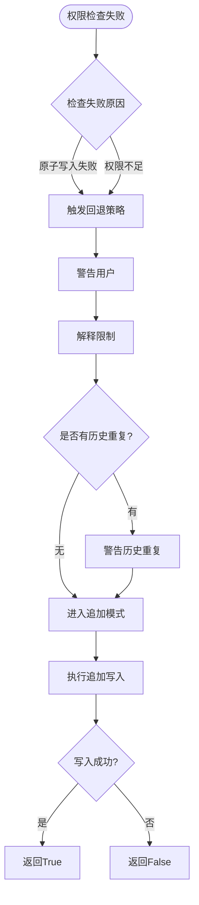

**图表来源**
- [hosts_manager.py](file://modules/hosts/hosts_manager.py#L73-L91)

**章节来源**
- [hosts_manager.py](file://modules/hosts/hosts_manager.py#L73-L91)

### HostsTaskRunner - 线程安全任务协调

`HostsTaskRunner`负责协调线程安全的任务执行，确保用户操作的可靠性和响应性：

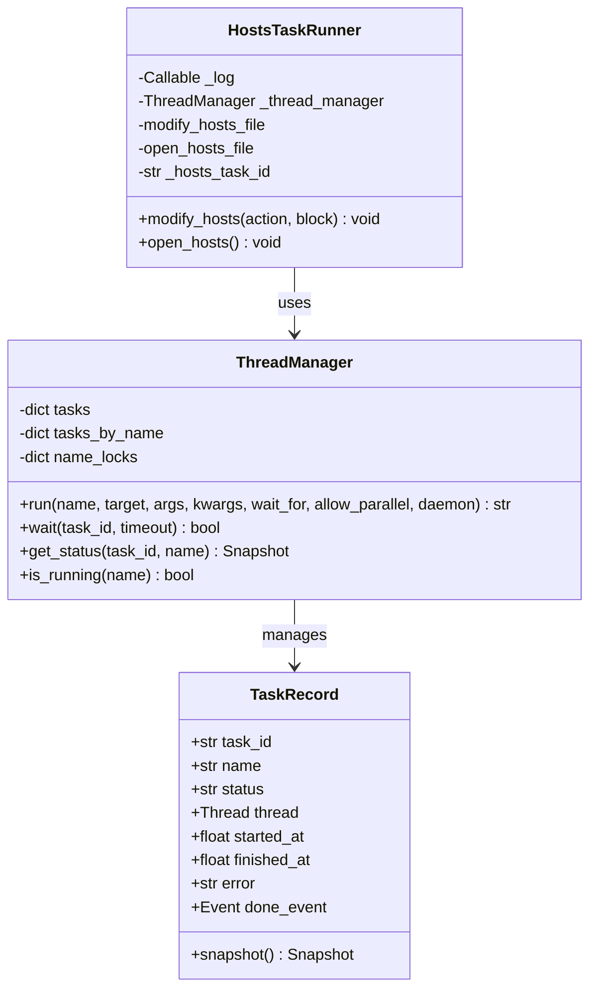

**图表来源**
- [hosts_actions.py](file://modules/actions/hosts_actions.py#L8-L61)
- [thread_manager.py](file://modules/runtime/thread_manager.py#L42-L171)

**章节来源**
- [hosts_actions.py](file://modules/actions/hosts_actions.py#L8-L61)
- [thread_manager.py](file://modules/runtime/thread_manager.py#L42-L171)

## 依赖关系分析

Hosts权限管理系统展现了清晰的依赖层次结构：

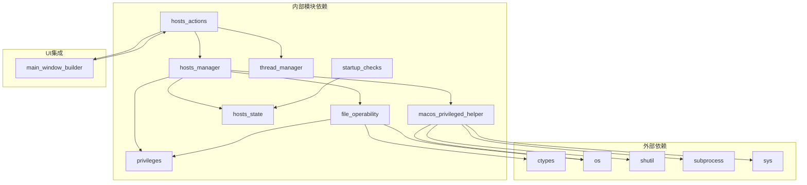

**图表来源**
- [hosts_manager.py](file://modules/hosts/hosts_manager.py#L6-L27)
- [file_operability.py](file://modules/hosts/file_operability.py#L9-L19)
- [macos_privileged_helper.py](file://modules/platform/macos_privileged_helper.py#L10-L25)

**章节来源**
- [hosts_manager.py](file://modules/hosts/hosts_manager.py#L6-L27)
- [file_operability.py](file://modules/hosts/file_operability.py#L9-L19)

## 性能考虑

### 跨平台优化策略

系统在不同平台上采用了针对性的性能优化策略：

#### Windows平台优化
- **WinAPI直连**：使用`CreateFileW`进行非破坏性权限探测，避免实际文件操作
- **属性缓存**：减少重复的文件属性读取操作
- **快速失败**：在检测到明显失败条件时立即返回

#### macOS平台优化
- **会话复用**：通过单例模式复用特权会话，避免重复的权限请求
- **连接池管理**：使用socket连接池减少建立连接的开销
- **异步通信**：采用异步socket通信提高响应速度

### 内存管理

系统采用了多种内存管理策略：
- **惰性加载**：特权助手仅在需要时启动
- **资源清理**：自动清理临时文件和连接资源
- **状态缓存**：缓存文件可操作性检查结果

## 故障排除指南

### 常见问题诊断

#### Windows权限问题

**症状**：`ACCESS_DENIED`状态
**诊断步骤**：
1. 检查`is_windows_admin()`返回值
2. 验证`ensure_windows_file_writable()`执行结果
3. 查看`write_probe_winerror`和`append_probe_winerror`

**解决方案**：
- 以管理员身份重新运行程序
- 手动移除文件只读属性
- 检查安全软件的文件锁定

#### macOS特权助手问题

**症状**：特权助手启动失败
**诊断步骤**：
1. 检查`osascript`执行权限
2. 验证socket路径可访问性
3. 查看助手日志文件

**解决方案**：
- 重新授权管理员权限
- 检查防火墙设置
- 清理残留的socket文件

#### 文件系统问题

**症状**：`SHARING_VIOLATION`或`DIR_CREATE_DENIED`
**诊断步骤**：
1. 检查文件是否被其他进程占用
2. 验证目录写入权限
3. 确认磁盘空间充足

**解决方案**：
- 关闭占用文件的其他程序
- 调整目录权限
- 清理磁盘空间

### 用户引导方案

当权限请求失败时，系统提供了清晰的用户引导：

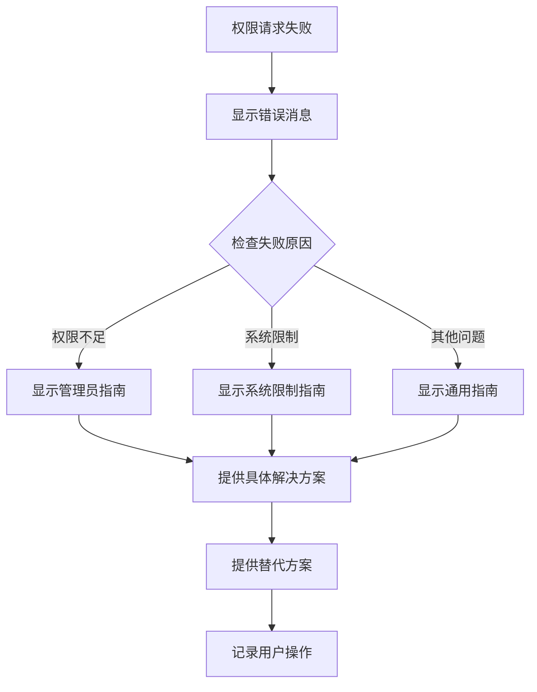

**图表来源**
- [hosts_manager.py](file://modules/hosts/hosts_manager.py#L247-L261)
- [hosts_state.py](file://modules/hosts/hosts_state.py#L58-L63)

**章节来源**
- [hosts_manager.py](file://modules/hosts/hosts_manager.py#L247-L261)
- [hosts_state.py](file://modules/hosts/hosts_state.py#L58-L63)

## 结论

ModelRelay项目的Hosts状态与权限管理API展现了一个成熟的跨平台文件权限管理系统。通过精心设计的分层架构、完善的错误处理机制和用户友好的交互设计，系统能够在各种复杂的操作系统环境中可靠地管理hosts文件。

### 主要优势

1. **跨平台兼容性**：针对Windows和macOS的不同特性提供了专门的处理方案
2. **智能降级策略**：在权限不足时能够优雅地回退到安全的操作模式
3. **状态可视化**：通过`FileOperabilityReport`提供了清晰的权限状态反馈
4. **线程安全**：通过`HostsTaskRunner`和`ThreadManager`确保了并发操作的安全性
5. **用户友好**：提供了详细的错误诊断和用户引导

### 技术亮点

- **WinAPI深度集成**：在Windows平台使用原生API进行精确的权限探测
- **特权助手架构**：在macOS平台实现了安全的特权操作机制
- **状态守卫机制**：通过`guard_hosts_modify`防止危险的系统操作
- **回退策略**：在各种失败情况下都能提供合理的替代方案

这个系统为类似的应用程序提供了一个优秀的参考实现，展示了如何在保证安全性的同时提供流畅的用户体验。