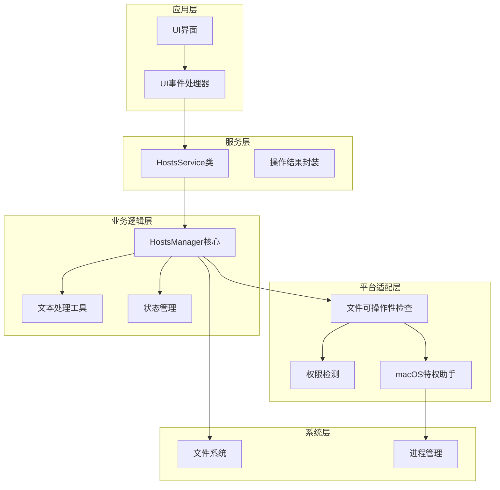
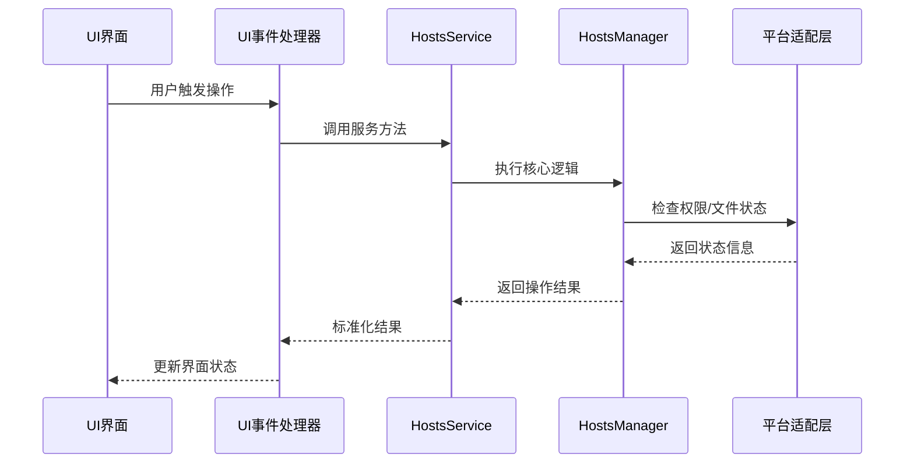
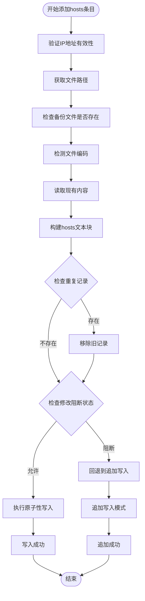
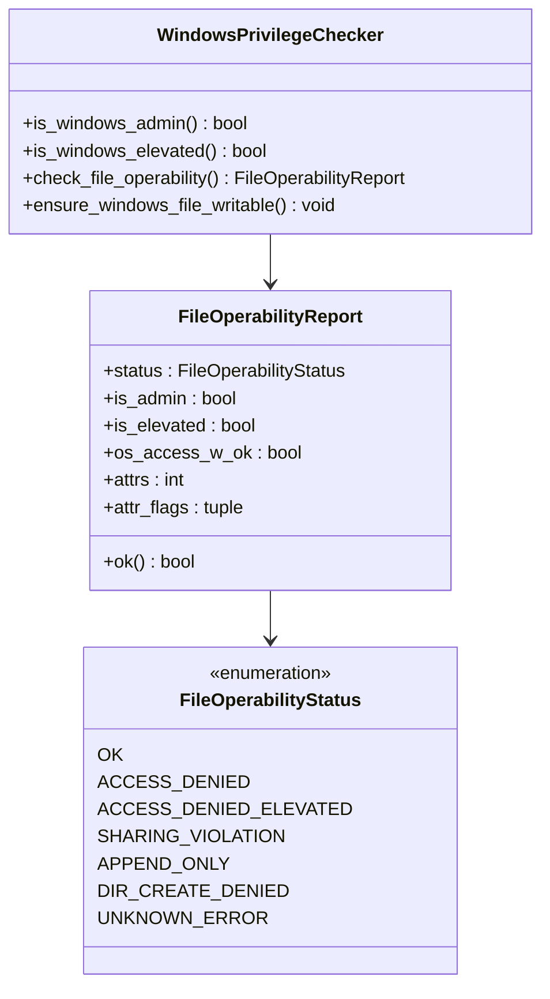
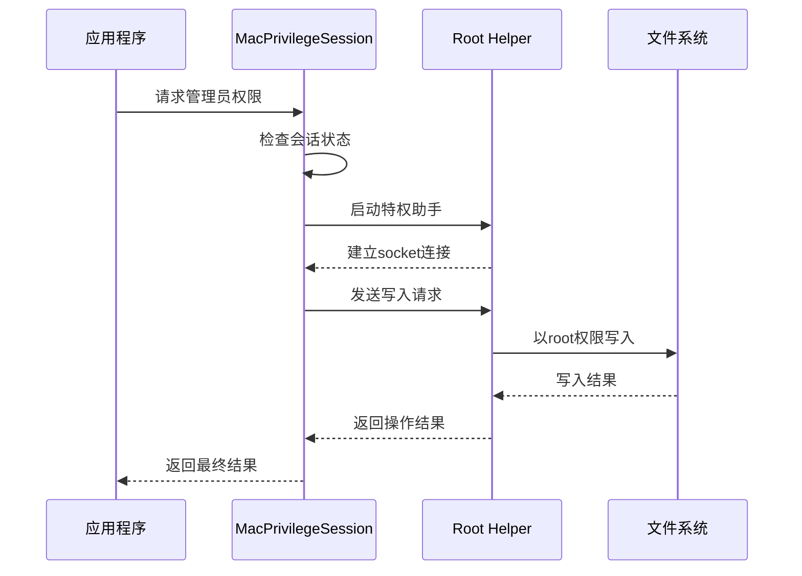
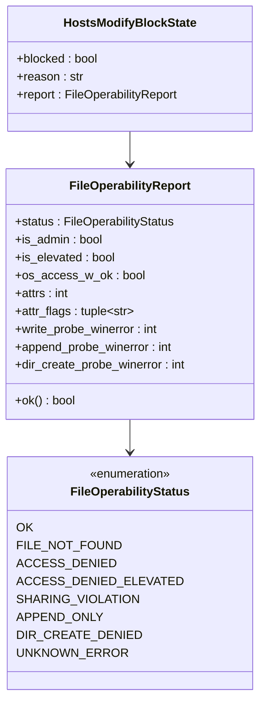
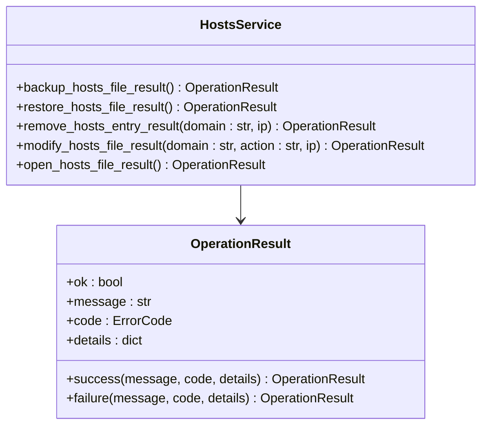
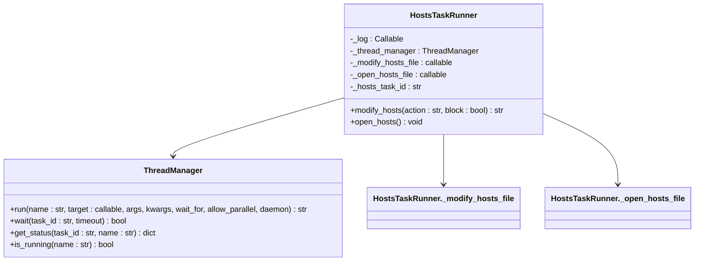
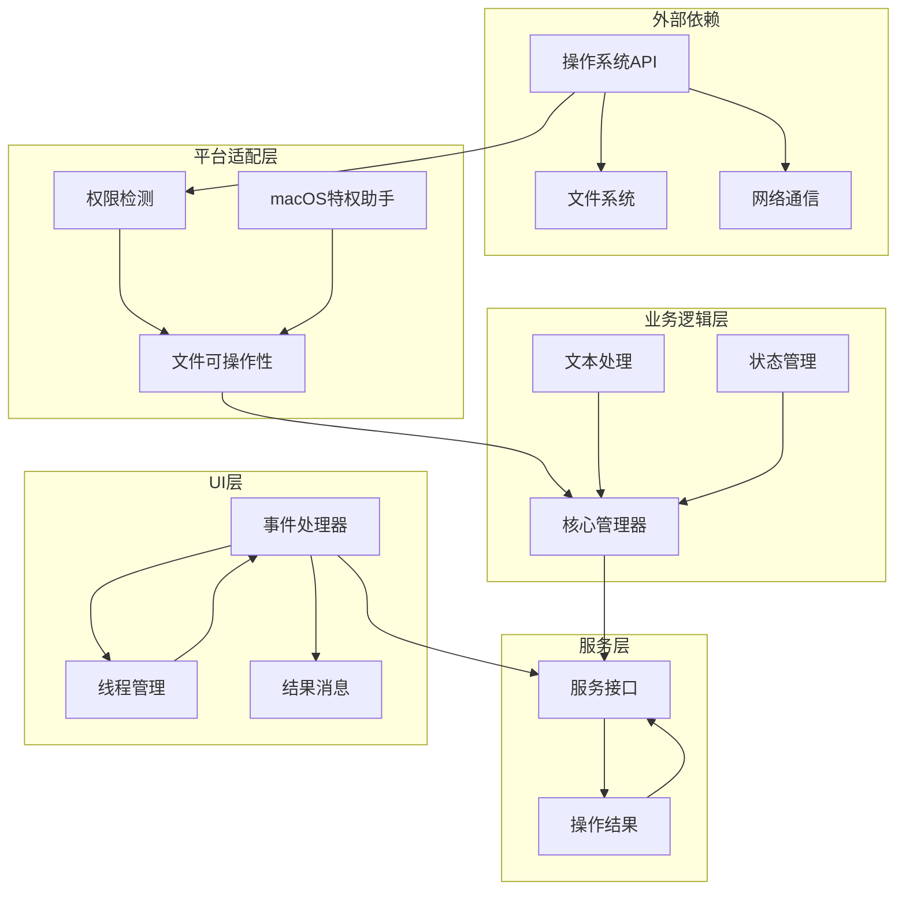

# Hosts管理API

<cite>
**本文档引用的文件**
- [hosts_manager.py](file://modules/hosts/hosts_manager.py)
- [hosts_service.py](file://modules/services/hosts_service.py)
- [hosts_actions.py](file://modules/actions/hosts_actions.py)
- [file_operability.py](file://modules/hosts/file_operability.py)
- [macos_privileged_helper.py](file://modules/platform/macos_privileged_helper.py)
- [hosts_text.py](file://modules/hosts/hosts_text.py)
- [hosts_state.py](file://modules/hosts/hosts_state.py)
- [privileges.py](file://modules/platform/privileges.py)
- [operation_result.py](file://modules/runtime/operation_result.py)
- [result_messages.py](file://modules/runtime/result_messages.py)
- [thread_manager.py](file://modules/runtime/thread_manager.py)
</cite>

## 目录
1. [简介](#简介)
2. [项目结构](#项目结构)
3. [核心组件](#核心组件)
4. [架构概览](#架构概览)
5. [详细组件分析](#详细组件分析)
6. [依赖关系分析](#依赖关系分析)
7. [性能考虑](#性能考虑)
8. [故障排除指南](#故障排除指南)
9. [结论](#结论)
10. [附录](#附录)

## 简介

Hosts管理API是一套完整的跨平台hosts文件管理系统，提供了hosts文件的备份、修改、还原等核心功能。该系统采用模块化设计，支持Windows管理员权限和macOS特权助手两种跨平台权限处理机制，确保在不同操作系统环境下都能安全可靠地管理hosts文件。

系统的主要特性包括：
- 跨平台兼容性（Windows、macOS、Linux）
- 智能权限检测与处理
- 原子性写入与回退机制
- 编码自动检测与处理
- 完整的错误处理与用户反馈
- 可配置的安全阻断机制

## 项目结构

Hosts管理功能分布在多个模块中，形成了清晰的分层架构：



**图表来源**
- [hosts_manager.py](file://modules/hosts/hosts_manager.py#L1-L492)
- [hosts_service.py](file://modules/services/hosts_service.py#L1-L60)
- [hosts_actions.py](file://modules/actions/hosts_actions.py#L1-L61)

**章节来源**
- [hosts_manager.py](file://modules/hosts/hosts_manager.py#L1-L50)
- [hosts_service.py](file://modules/services/hosts_service.py#L1-L30)
- [hosts_actions.py](file://modules/actions/hosts_actions.py#L1-L30)

## 核心组件

### HostsManager核心模块

HostsManager是整个系统的核心，负责处理hosts文件的各种操作。它提供了以下关键功能：

- **文件路径管理**：自动检测并返回正确的hosts文件路径
- **备份与还原**：完整的备份策略和安全的还原机制
- **原子性写入**：确保修改操作的完整性和一致性
- **权限处理**：跨平台的权限检测和提升机制

### HostsService服务层

HostsService提供了面向外部的统一接口，将底层实现封装为标准的操作结果：

- **标准化返回值**：使用OperationResult统一返回格式
- **错误处理**：将底层异常转换为可理解的错误消息
- **接口简化**：对外暴露简洁易用的API

### UI事件处理器

HostsActions模块负责处理用户界面的交互事件，提供异步执行和用户反馈机制。

**章节来源**
- [hosts_manager.py](file://modules/hosts/hosts_manager.py#L264-L492)
- [hosts_service.py](file://modules/services/hosts_service.py#L13-L60)
- [hosts_actions.py](file://modules/actions/hosts_actions.py#L8-L61)

## 架构概览

系统采用分层架构设计，确保各层职责明确，耦合度低：



**图表来源**
- [hosts_actions.py](file://modules/actions/hosts_actions.py#L23-L48)
- [hosts_service.py](file://modules/services/hosts_service.py#L31-L41)
- [hosts_manager.py](file://modules/hosts/hosts_manager.py#L459-L492)

## 详细组件分析

### HostsManager核心功能详解

#### add_hosts_entry - 添加hosts条目

add_hosts_entry函数实现了完整的hosts条目添加流程：



**图表来源**
- [hosts_manager.py](file://modules/hosts/hosts_manager.py#L264-L358)

**关键实现要点**：
- **原子性保证**：通过先删除旧记录再添加新记录的方式确保操作的原子性
- **智能回退**：当环境不满足原子性要求时自动降级为追加写入
- **重复检测**：自动检测并避免重复添加相同的hosts条目

#### remove_hosts_entry - 删除hosts条目

删除功能提供了精确的条目移除能力：

**章节来源**
- [hosts_manager.py](file://modules/hosts/hosts_manager.py#L360-L407)

#### modify_hosts_file - 统一操作入口

modify_hosts_file作为所有操作的统一入口，提供了灵活的参数配置：

**章节来源**
- [hosts_manager.py](file://modules/hosts/hosts_manager.py#L459-L492)

### 跨平台权限处理机制

#### Windows管理员权限处理

系统通过多重检测确保Windows环境下的权限正确性：



**图表来源**
- [privileges.py](file://modules/platform/privileges.py#L13-L63)
- [file_operability.py](file://modules/hosts/file_operability.py#L24-L50)

**关键特性**：
- **多层检测**：同时检查管理员权限和提升状态
- **详细报告**：提供完整的文件可操作性分析
- **自动修复**：自动移除只读属性等常见问题

#### macOS特权助手机制

macOS平台通过持久化的特权助手实现安全的文件操作：



**图表来源**
- [macos_privileged_helper.py](file://modules/platform/macos_privileged_helper.py#L73-L92)
- [macos_privileged_helper.py](file://modules/platform/macos_privileged_helper.py#L93-L108)

**核心机制**：
- **延迟启动**：首次需要权限时才启动特权助手
- **socket通信**：通过Unix Socket实现安全通信
- **自动清理**：GUI关闭时自动释放特权会话

**章节来源**
- [macos_privileged_helper.py](file://modules/platform/macos_privileged_helper.py#L52-L132)

### FileOperabilityReport可写性预检

FileOperabilityReport是系统的核心检测机制，提供了详细的文件可操作性分析：



**图表来源**
- [file_operability.py](file://modules/hosts/file_operability.py#L35-L50)
- [hosts_state.py](file://modules/hosts/hosts_state.py#L10-L15)

**检测流程**：
1. **文件存在性检查**：确认目标文件是否存在
2. **权限状态检测**：检查当前进程的权限级别
3. **WinAPI探测**：使用CreateFileW探测写入和追加权限
4. **目录可写性测试**：验证父目录的写入权限
5. **属性分析**：检查文件属性（只读、隐藏等）

**章节来源**
- [file_operability.py](file://modules/hosts/file_operability.py#L117-L197)

### HostsService类公共接口

HostsService提供了标准化的服务接口，将底层实现封装为统一的API：



**图表来源**
- [hosts_service.py](file://modules/services/hosts_service.py#L13-L47)
- [operation_result.py](file://modules/runtime/operation_result.py#L9-L38)

**服务特点**：
- **统一返回格式**：所有方法都返回OperationResult对象
- **错误标准化**：将底层异常转换为标准的错误消息
- **链式调用**：支持在服务层进行进一步的业务逻辑处理

**章节来源**
- [hosts_service.py](file://modules/services/hosts_service.py#L1-L60)

### UI事件响应函数

UI事件处理器提供了异步执行和用户反馈机制：



**图表来源**
- [hosts_actions.py](file://modules/actions/hosts_actions.py#L8-L22)
- [thread_manager.py](file://modules/runtime/thread_manager.py#L42-L101)

**异步执行机制**：
- **任务队列管理**：通过ThreadManager管理后台任务
- **依赖等待**：支持任务间的依赖关系和等待机制
- **状态监控**：实时监控任务执行状态
- **用户反馈**：通过日志函数提供实时进度反馈

**章节来源**
- [hosts_actions.py](file://modules/actions/hosts_actions.py#L1-L61)

## 依赖关系分析

系统各模块之间的依赖关系清晰明确，遵循单一职责原则：



**图表来源**
- [hosts_manager.py](file://modules/hosts/hosts_manager.py#L12-L27)
- [hosts_service.py](file://modules/services/hosts_service.py#L3-L9)
- [hosts_actions.py](file://modules/actions/hosts_actions.py#L3-L6)

**依赖特点**：
- **向下依赖**：上层模块依赖下层模块的具体实现
- **向上抽象**：下层模块不依赖上层模块
- **横向解耦**：同级模块间尽量减少直接依赖

**章节来源**
- [hosts_manager.py](file://modules/hosts/hosts_manager.py#L1-L30)
- [hosts_service.py](file://modules/services/hosts_service.py#L1-L11)
- [hosts_actions.py](file://modules/actions/hosts_actions.py#L1-L7)

## 性能考虑

### 文件操作优化

系统在文件操作方面采用了多项优化措施：

1. **编码检测缓存**：避免重复的编码检测开销
2. **原子性写入**：减少文件锁定时间
3. **增量备份**：只在必要时创建备份文件
4. **异步执行**：UI操作不阻塞主线程

### 内存使用优化

- **流式读取**：大文件读取采用流式处理
- **按需分配**：只在需要时分配内存
- **及时释放**：确保文件句柄和资源及时释放

### 网络通信优化

macOS特权助手采用高效的socket通信机制：
- **连接复用**：同一会话内复用连接
- **批量操作**：支持批量文件操作
- **超时控制**：合理的超时和重试机制

## 故障排除指南

### 常见问题及解决方案

#### Windows权限问题

**症状**：写入hosts文件时报权限错误
**原因**：进程没有管理员权限或文件被其他进程占用
**解决方案**：
1. 以管理员身份运行应用程序
2. 关闭可能占用hosts文件的其他程序
3. 检查文件属性，移除只读标记

#### macOS特权助手问题

**症状**：无法获取管理员权限或通信失败
**原因**：特权助手启动失败或socket连接异常
**解决方案**：
1. 检查系统安全设置，允许特权助手运行
2. 重启应用程序重新建立连接
3. 查看助手日志文件了解具体错误

#### 文件编码问题

**症状**：hosts文件显示乱码或修改后格式异常
**原因**：文件编码检测不准确
**解决方案**：
1. 手动指定正确的文件编码
2. 检查文件是否包含BOM标记
3. 使用文本编辑器转换为UTF-8编码

### 调试技巧

1. **启用详细日志**：通过log_func参数获取详细的操作日志
2. **检查FileOperabilityReport**：分析文件可操作性报告
3. **验证权限状态**：确认当前进程的权限级别
4. **监控系统资源**：检查磁盘空间和文件句柄使用情况

**章节来源**
- [hosts_manager.py](file://modules/hosts/hosts_manager.py#L257-L261)
- [file_operability.py](file://modules/hosts/file_operability.py#L171-L184)

## 结论

Hosts管理API是一个设计精良的跨平台系统，具有以下突出特点：

1. **高度可靠性**：通过原子性写入和回退机制确保操作安全
2. **良好的用户体验**：提供完整的用户反馈和错误处理
3. **强大的跨平台支持**：针对不同平台提供最优的解决方案
4. **清晰的架构设计**：模块化设计便于维护和扩展

该系统为hosts文件管理提供了企业级的解决方案，既保证了安全性，又提供了良好的用户体验。

## 附录

### 实际调用示例

#### 备份hosts文件
```python
# 使用HostsService进行备份
result = hosts_service.backup_hosts_file_result()
if result.ok:
    print("备份成功")
else:
    print(f"备份失败: {result.message}")
```

#### 添加hosts条目
```python
# 添加API域名映射
result = hosts_service.modify_hosts_file_result(
    domain="api.openai.com",
    action="add",
    ip=("127.0.0.1", "::1")
)
```

#### 还原hosts文件
```python
# 从备份还原
result = hosts_service.restore_hosts_file_result()
```

#### 删除hosts条目
```python
# 删除特定域名
result = hosts_service.remove_hosts_entry_result(
    domain="test.example.com"
)
```

### 关键设计决策说明

1. **FileOperabilityReport的作用**：在实际写入前进行预检，避免不必要的错误
2. **编码检测机制**：自动识别文件编码，确保修改的正确性
3. **原子写入与回退**：优先保证原子性，失败时自动降级为追加写入
4. **跨平台权限处理**：针对不同平台提供最优的权限解决方案
5. **异步执行机制**：避免UI阻塞，提供更好的用户体验

这些设计决策确保了系统的稳定性、安全性和易用性，为用户提供了一套完整的hosts文件管理解决方案。