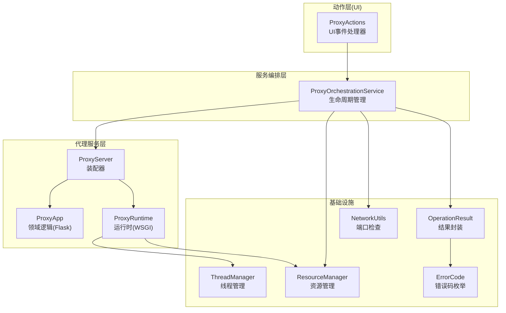
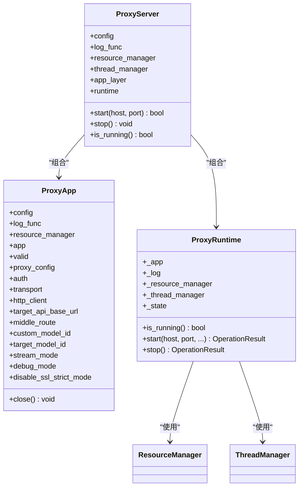
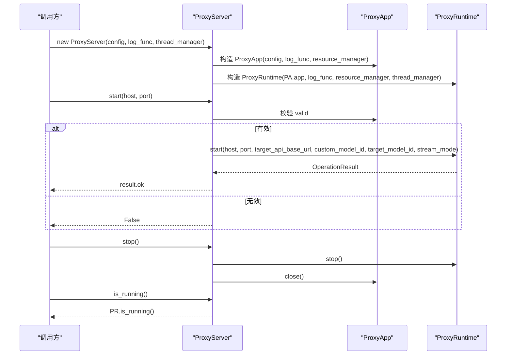
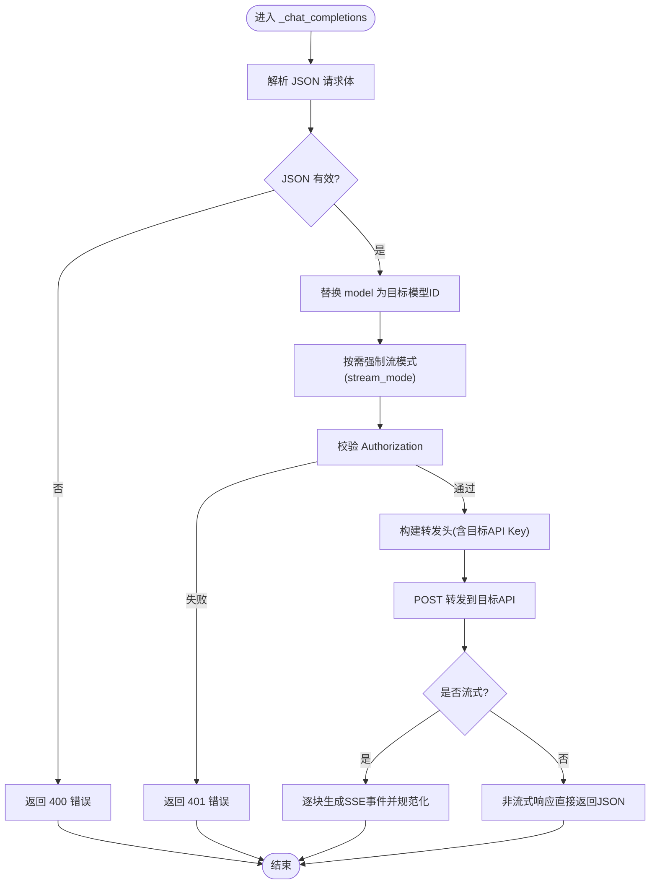
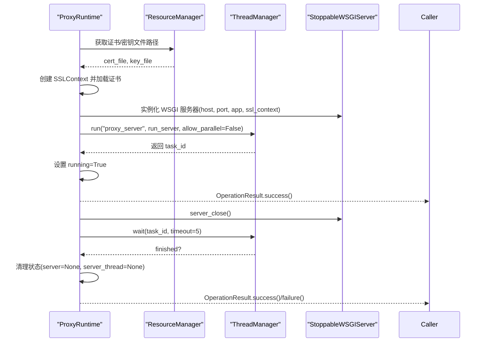
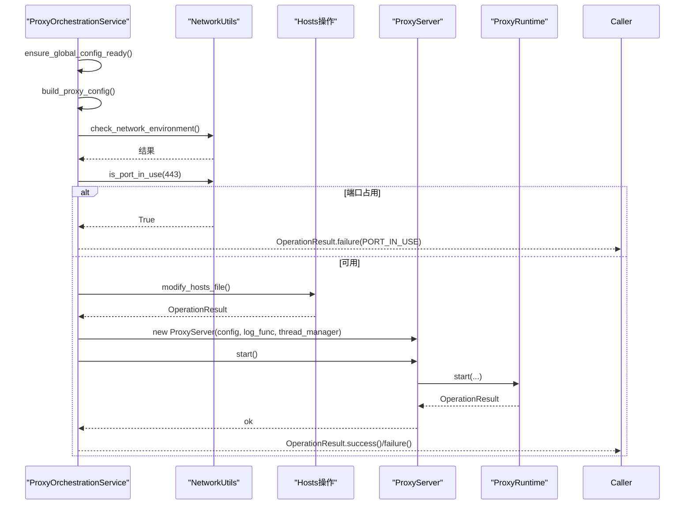
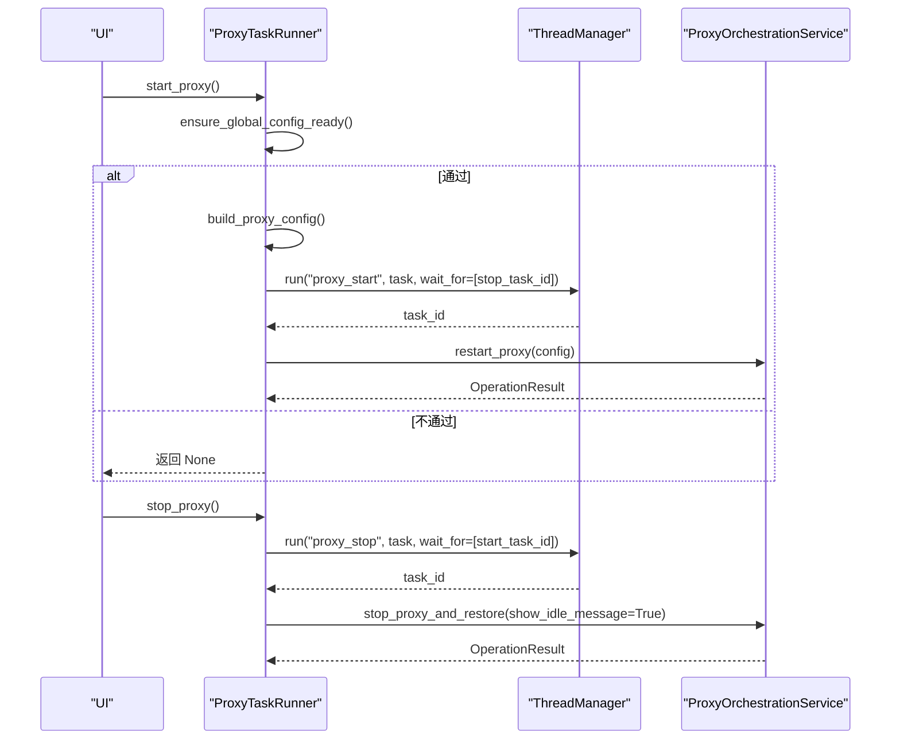
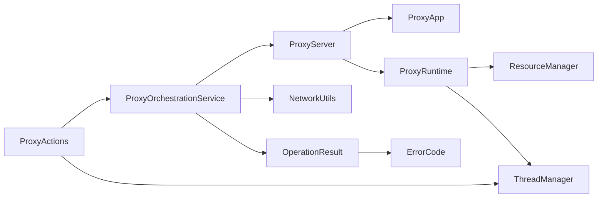

# 代理服务API

<cite>
**本文引用的文件**
- [modules/proxy/proxy_server.py](file://modules/proxy/proxy_server.py)
- [modules/proxy/proxy_app.py](file://modules/proxy/proxy_app.py)
- [modules/proxy/proxy_runtime.py](file://modules/proxy/proxy_runtime.py)
- [modules/proxy/proxy_config.py](file://modules/proxy/proxy_config.py)
- [modules/services/proxy_orchestration.py](file://modules/services/proxy_orchestration.py)
- [modules/actions/proxy_actions.py](file://modules/actions/proxy_actions.py)
- [modules/runtime/operation_result.py](file://modules/runtime/operation_result.py)
- [modules/runtime/thread_manager.py](file://modules/runtime/thread_manager.py)
- [modules/runtime/resource_manager.py](file://modules/runtime/resource_manager.py)
- [modules/runtime/error_codes.py](file://modules/runtime/error_codes.py)
- [modules/network/network_utils.py](file://modules/network/network_utils.py)
</cite>

## 目录
1. [简介](#简介)
2. [项目结构](#项目结构)
3. [核心组件](#核心组件)
4. [架构总览](#架构总览)
5. [详细组件分析](#详细组件分析)
6. [依赖关系分析](#依赖关系分析)
7. [性能考量](#性能考量)
8. [故障排查指南](#故障排查指南)
9. [结论](#结论)
10. [附录](#附录)

## 简介
本文件面向代理服务API的技术文档，聚焦以下目标：
- 深入解析 ProxyServer 类的初始化流程与职责边界
- 解释 start/stop/is_running 等核心方法的实现原理与控制流
- 描述 ProxyServer 如何与 ProxyApp 和 ProxyRuntime 协同工作
- 文档化 ProxyOrchestrationService 的生命周期管理接口：启动前检查、配置加载与运行时协调
- 描述 handle_start_proxy/handle_stop_proxy 等 UI 事件处理器的调用链与错误传播机制
- 提供代理服务器启动配置的完整示例（含 host、port、target_api_base_url 等），说明 OperationResult 在状态变更中的应用
- 分析线程安全模型与资源释放策略

## 项目结构
代理服务相关代码主要分布在 modules/proxy、modules/services、modules/actions、modules/runtime、modules/network 等子模块中。核心关系如下：
- ProxyServer 作为装配器，组合 ProxyApp（领域逻辑）与 ProxyRuntime（运行时）
- ProxyOrchestrationService 负责生命周期管理与协调（启动前检查、配置构建、运行时协调）
- ProxyActions 提供 UI 事件处理器（如启动/停止代理），通过线程管理器异步执行
- OperationResult/ErrorCodes 作为统一的结果与错误语义载体
- ThreadManager/ResourceManager 提供线程与资源管理能力

图表来源
- [modules/proxy/proxy_server.py](file://modules/proxy/proxy_server.py#L14-L65)
- [modules/proxy/proxy_app.py](file://modules/proxy/proxy_app.py#L18-L66)
- [modules/proxy/proxy_runtime.py](file://modules/proxy/proxy_runtime.py#L46-L218)
- [modules/services/proxy_orchestration.py](file://modules/services/proxy_orchestration.py#L1-L200)
- [modules/actions/proxy_actions.py](file://modules/actions/proxy_actions.py#L1-L129)
- [modules/runtime/thread_manager.py](file://modules/runtime/thread_manager.py#L42-L171)
- [modules/runtime/resource_manager.py](file://modules/runtime/resource_manager.py#L201-L294)
- [modules/runtime/operation_result.py](file://modules/runtime/operation_result.py#L9-L41)
- [modules/runtime/error_codes.py](file://modules/runtime/error_codes.py#L6-L17)
- [modules/network/network_utils.py](file://modules/network/network_utils.py#L6-L20)

章节来源
- [modules/proxy/proxy_server.py](file://modules/proxy/proxy_server.py#L1-L65)
- [modules/services/proxy_orchestration.py](file://modules/services/proxy_orchestration.py#L1-L200)
- [modules/actions/proxy_actions.py](file://modules/actions/proxy_actions.py#L1-L129)

## 核心组件
- ProxyServer：装配器，负责组合 ProxyApp 与 ProxyRuntime，并提供 start/stop/is_running 接口
- ProxyApp：领域逻辑层，负责配置解析、Flask 路由注册、上游转发、认证与流式处理
- ProxyRuntime：运行时层，负责证书加载、HTTPS 监听、线程生命周期管理、停止与清理
- ProxyOrchestrationService：服务编排层，提供启动前检查、配置构建、运行时协调与错误传播
- ProxyActions：UI 动作层，封装启动/停止代理的事件处理器，基于线程管理器异步执行
- OperationResult/ErrorCode：统一结果与错误语义
- ThreadManager/ResourceManager：线程与资源管理

章节来源
- [modules/proxy/proxy_server.py](file://modules/proxy/proxy_server.py#L14-L65)
- [modules/proxy/proxy_app.py](file://modules/proxy/proxy_app.py#L18-L66)
- [modules/proxy/proxy_runtime.py](file://modules/proxy/proxy_runtime.py#L46-L218)
- [modules/services/proxy_orchestration.py](file://modules/services/proxy_orchestration.py#L1-L200)
- [modules/actions/proxy_actions.py](file://modules/actions/proxy_actions.py#L1-L129)
- [modules/runtime/operation_result.py](file://modules/runtime/operation_result.py#L9-L41)
- [modules/runtime/error_codes.py](file://modules/runtime/error_codes.py#L6-L17)
- [modules/runtime/thread_manager.py](file://modules/runtime/thread_manager.py#L42-L171)
- [modules/runtime/resource_manager.py](file://modules/runtime/resource_manager.py#L201-L294)

## 架构总览
代理服务采用“装配器 + 领域逻辑 + 运行时”的分层设计：
- ProxyServer 将 ProxyApp 与 ProxyRuntime 组合，对外暴露统一的启动/停止/状态查询接口
- ProxyApp 负责业务逻辑（路由、认证、上游转发、流式处理）
- ProxyRuntime 负责运行时细节（证书、线程、WSGI 服务器、停止与清理）

图表来源
- [modules/proxy/proxy_server.py](file://modules/proxy/proxy_server.py#L14-L65)
- [modules/proxy/proxy_app.py](file://modules/proxy/proxy_app.py#L18-L66)
- [modules/proxy/proxy_runtime.py](file://modules/proxy/proxy_runtime.py#L46-L218)
- [modules/runtime/resource_manager.py](file://modules/runtime/resource_manager.py#L201-L294)
- [modules/runtime/thread_manager.py](file://modules/runtime/thread_manager.py#L42-L171)

## 详细组件分析

### ProxyServer 初始化与生命周期
- 初始化阶段：构造 ResourceManager、ThreadManager；创建 ProxyApp（传入配置与资源管理器）；创建 ProxyRuntime（传入 ProxyApp.app、日志函数、资源管理器、线程管理器）
- start(host, port)：先校验 ProxyApp 是否有效，再调用 ProxyRuntime.start 并将关键参数透传（目标 API 基地址、模型映射、流模式等），最终返回 OperationResult.ok
- stop()：先停止 ProxyRuntime，再关闭 ProxyApp
- is_running()：委托 ProxyRuntime 判断运行状态

图表来源
- [modules/proxy/proxy_server.py](file://modules/proxy/proxy_server.py#L17-L54)
- [modules/proxy/proxy_runtime.py](file://modules/proxy/proxy_runtime.py#L66-L171)
- [modules/proxy/proxy_app.py](file://modules/proxy/proxy_app.py#L21-L66)

章节来源
- [modules/proxy/proxy_server.py](file://modules/proxy/proxy_server.py#L14-L65)

### ProxyApp 领域逻辑
- 职责：解析配置、注册路由（/models、/chat/completions）、鉴权、上游转发、流式处理
- 关键点：
  - 构造时通过 build_proxy_config 从原始配置与全局配置中解析出 ProxyConfig，并据此初始化 auth、transport、http_client
  - 路由层：/_inbound/models 与 /_inbound/chat/completions，其中 inbound_route 可配置
  - 鉴权：使用 ProxyAuth 校验 Authorization
  - 上游转发：将请求体中的 model 替换为目标模型 ID，按需强制流模式，转发至 target_api_base_url + middle_route
  - 流式处理：支持 SSE 事件提取、规范化、以及非流式到流式的模拟
  - 调试模式：打印请求/响应详情（调试模式下）

图表来源
- [modules/proxy/proxy_app.py](file://modules/proxy/proxy_app.py#L164-L461)

章节来源
- [modules/proxy/proxy_app.py](file://modules/proxy/proxy_app.py#L18-L462)

### ProxyRuntime 运行时
- 职责：证书加载、HTTPS 监听、线程生命周期管理、优雅停止
- 关键点：
  - StoppableWSGIServer：继承 BaseWSGIServer，增加 _stop_event 与 serve_forever 循环
  - start：校验证书存在性与有效性，创建 SSLContext，实例化 StoppableWSGIServer，启动后台线程，等待就绪事件
  - stop：触发 server_close，等待线程结束，清理状态
  - is_running：返回内部运行标志

图表来源
- [modules/proxy/proxy_runtime.py](file://modules/proxy/proxy_runtime.py#L46-L218)
- [modules/runtime/resource_manager.py](file://modules/runtime/resource_manager.py#L227-L242)
- [modules/runtime/thread_manager.py](file://modules/runtime/thread_manager.py#L61-L101)

章节来源
- [modules/proxy/proxy_runtime.py](file://modules/proxy/proxy_runtime.py#L46-L218)

### ProxyOrchestrationService 生命周期管理
- 启动前检查：检查全局配置完整性（映射模型ID、MTGA鉴权Key），构建运行时配置（debug_mode、disable_ssl_strict_mode、stream_mode）
- 启动协调：前置网络环境检查（可选），端口占用检查（443），hosts 文件修改（可选），创建 ProxyServer 并启动
- 停止协调：停止运行中的实例，记录日志，清理实例引用
- 重启协调：先停止旧实例，再启动新实例，返回 OperationResult

图表来源
- [modules/services/proxy_orchestration.py](file://modules/services/proxy_orchestration.py#L36-L200)
- [modules/network/network_utils.py](file://modules/network/network_utils.py#L6-L20)

章节来源
- [modules/services/proxy_orchestration.py](file://modules/services/proxy_orchestration.py#L1-L200)

### UI 事件处理器与调用链
- ProxyTaskRunner：封装启动/停止代理的异步任务，基于 ThreadManager 串行执行
- 调用链：
  - start_proxy：校验全局配置，构建运行时配置，调用 restart_proxy
  - stop_proxy：调用 stop_proxy_and_restore，等待已有任务完成
  - start_all：串行执行证书生成/安装、hosts 修改、启动代理，最终输出统一结果

图表来源
- [modules/actions/proxy_actions.py](file://modules/actions/proxy_actions.py#L25-L129)
- [modules/services/proxy_orchestration.py](file://modules/services/proxy_orchestration.py#L70-L151)

章节来源
- [modules/actions/proxy_actions.py](file://modules/actions/proxy_actions.py#L1-L129)

## 依赖关系分析
- 组件耦合与内聚：
  - ProxyServer 对 ProxyApp/ProxyRuntime 的依赖清晰，职责分离良好
  - ProxyRuntime 依赖 ResourceManager（证书/密钥）与 ThreadManager（线程调度）
  - ProxyOrchestrationService 依赖 NetworkUtils（端口检查）、ProxyServer（实例化与启动）、OperationResult/ErrorCodes（结果与错误）
  - ProxyActions 依赖 ThreadManager 与 ProxyOrchestrationService 的回调
- 外部依赖：
  - Flask/Werkzeug（WSGI 服务器）
  - requests（HTTP 客户端）
  - platformdirs/tempfile/os（资源路径与临时目录）
  - yaml/socket（配置与端口检查）

图表来源
- [modules/proxy/proxy_server.py](file://modules/proxy/proxy_server.py#L17-L33)
- [modules/proxy/proxy_runtime.py](file://modules/proxy/proxy_runtime.py#L49-L61)
- [modules/services/proxy_orchestration.py](file://modules/services/proxy_orchestration.py#L7-L11)
- [modules/actions/proxy_actions.py](file://modules/actions/proxy_actions.py#L1-L23)

章节来源
- [modules/proxy/proxy_server.py](file://modules/proxy/proxy_server.py#L1-L65)
- [modules/proxy/proxy_runtime.py](file://modules/proxy/proxy_runtime.py#L1-L218)
- [modules/services/proxy_orchestration.py](file://modules/services/proxy_orchestration.py#L1-L200)
- [modules/actions/proxy_actions.py](file://modules/actions/proxy_actions.py#L1-L129)

## 性能考量
- 流式处理：SSE 事件逐块生成与规范化，避免一次性缓冲大响应，降低内存峰值
- 线程模型：运行时线程串行执行，避免并发冲突；线程等待与超时控制保证稳定性
- 资源复用：ResourceManager 统一管理证书与配置路径，减少 IO 与路径解析开销
- 端口占用检查：启动前检查 443 端口占用，避免启动失败重试成本

[本节为通用性能讨论，不直接分析具体文件]

## 故障排查指南
- 启动失败常见原因：
  - 证书缺失或不可用：检查 ResourceManager 获取的证书/密钥路径是否存在
  - 端口占用：443 被占用时返回端口占用错误码
  - 权限不足：监听端口需要管理员权限
  - Flask 应用未初始化：ProxyApp 未成功构建配置
- 停止失败：
  - 线程未能在超时内退出：返回未完全停止提示
  - 服务器实例为空：记录未检测到可停止实例
- 结果与错误传播：
  - 所有操作返回 OperationResult，包含 ok/message/code/details
  - 错误码使用 ErrorCode 枚举，便于 UI 与日志统一处理

章节来源
- [modules/proxy/proxy_runtime.py](file://modules/proxy/proxy_runtime.py#L159-L171)
- [modules/proxy/proxy_runtime.py](file://modules/proxy/proxy_runtime.py#L172-L215)
- [modules/runtime/operation_result.py](file://modules/runtime/operation_result.py#L9-L41)
- [modules/runtime/error_codes.py](file://modules/runtime/error_codes.py#L6-L17)

## 结论
本代理服务API通过清晰的分层与职责划分，实现了从配置解析、领域逻辑、运行时到编排与 UI 的完整闭环。ProxyServer 作为装配器，将 ProxyApp 与 ProxyRuntime 有机结合；ProxyOrchestrationService 提供了完善的启动前检查与运行时协调；ProxyActions 通过线程管理器实现 UI 事件的异步与串行化处理。OperationResult 与 ErrorCode 统一了错误语义，配合 ResourceManager 与 ThreadManager 提供了稳健的资源与线程管理。

[本节为总结性内容，不直接分析具体文件]

## 附录

### 启动配置示例（字段说明）
- api_url：目标上游 API 的基础地址（必填，否则返回配置无效）
- middle_route：中间路由（默认 /v1，自动标准化）
- model_id：目标模型 ID（可选，未提供时回退为 custom_model_id）
- mapped_model_id：自定义模型 ID（全局配置优先，其次来自配置组）
- stream_mode：强制流模式（'true'/'false'/None）
- debug_mode：调试模式（开启后打印请求/响应详情）
- disable_ssl_strict_mode：禁用严格 SSL 校验（可选）
- api_key：目标 API 密钥（可选）
- mtga_auth_key：MTGA 鉴权密钥（全局配置）

章节来源
- [modules/proxy/proxy_config.py](file://modules/proxy/proxy_config.py#L62-L96)

### OperationResult 在状态变更中的应用
- 成功：使用 success(message, code, **details) 返回
- 失败：使用 failure(message, code, **details) 返回
- 二值化：支持 bool(result) 便捷判断
- 错误码：统一使用 ErrorCode 枚举，便于 UI 与日志识别

章节来源
- [modules/runtime/operation_result.py](file://modules/runtime/operation_result.py#L9-L41)
- [modules/runtime/error_codes.py](file://modules/runtime/error_codes.py#L6-L17)

### 线程安全模型与资源释放策略
- 线程安全：
  - ThreadManager 使用锁与任务记录，保证任务并发控制与状态一致性
  - ProxyRuntime 使用 Event 控制服务器停止，避免竞态
- 资源释放：
  - ProxyRuntime.stop 会调用 server_close 并等待线程结束，清理 server/server_thread/task_id
  - ProxyApp.close 会关闭 Transport，释放底层 HTTP 会话
  - ResourceManager 在初始化时复制模板文件，确保资源可用

章节来源
- [modules/runtime/thread_manager.py](file://modules/runtime/thread_manager.py#L42-L171)
- [modules/proxy/proxy_runtime.py](file://modules/proxy/proxy_runtime.py#L172-L215)
- [modules/proxy/proxy_app.py](file://modules/proxy/proxy_app.py#L67-L70)
- [modules/runtime/resource_manager.py](file://modules/runtime/resource_manager.py#L215-L221)