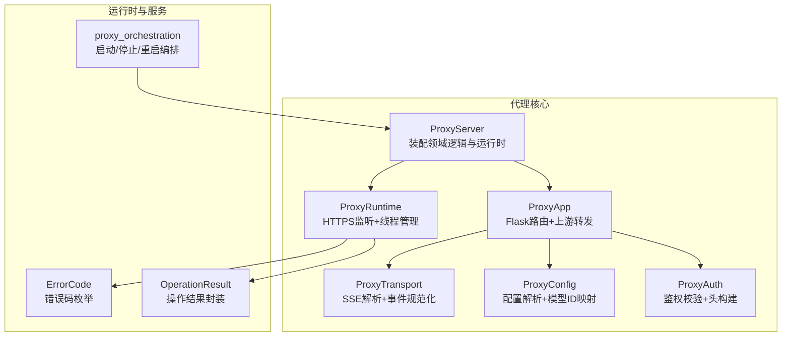
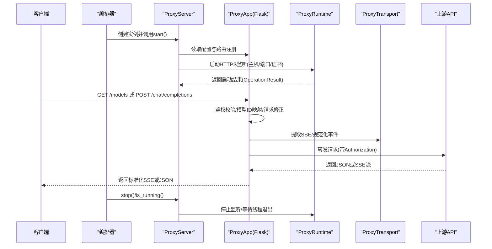
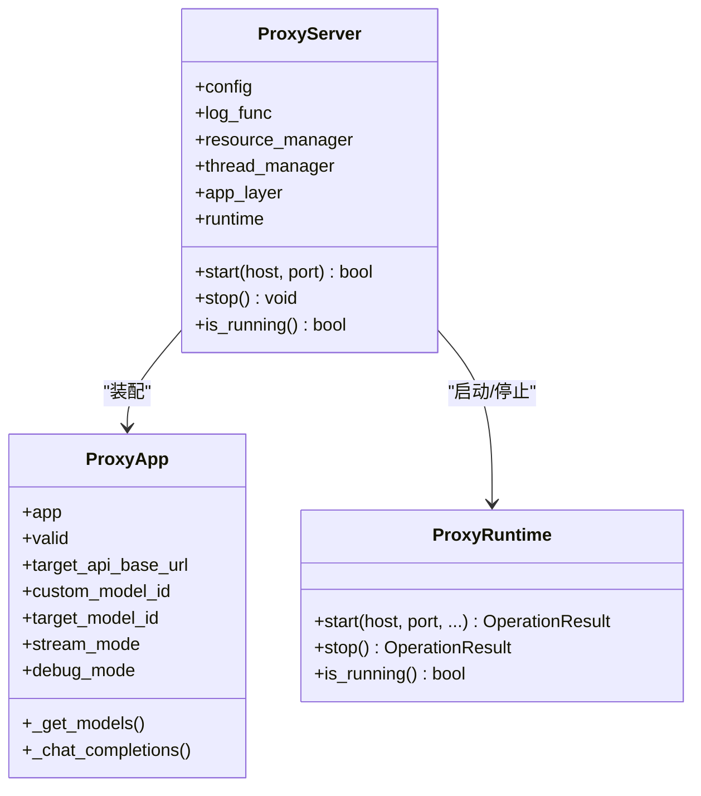
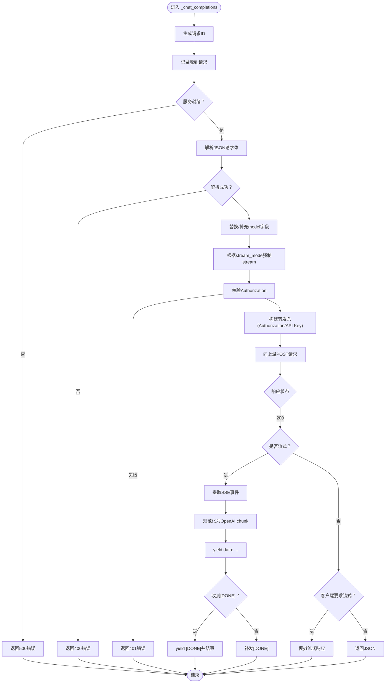
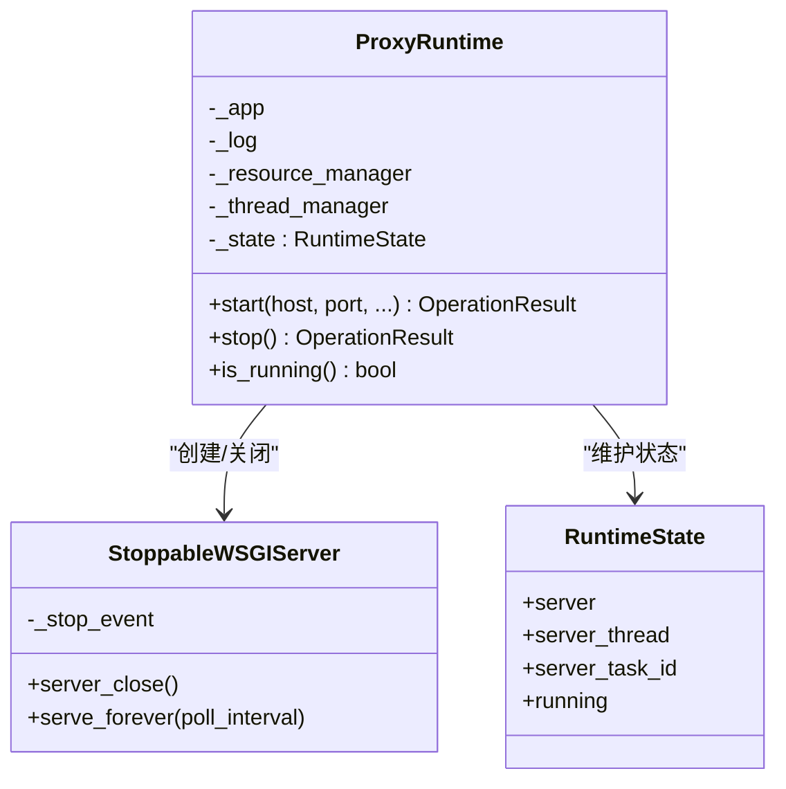
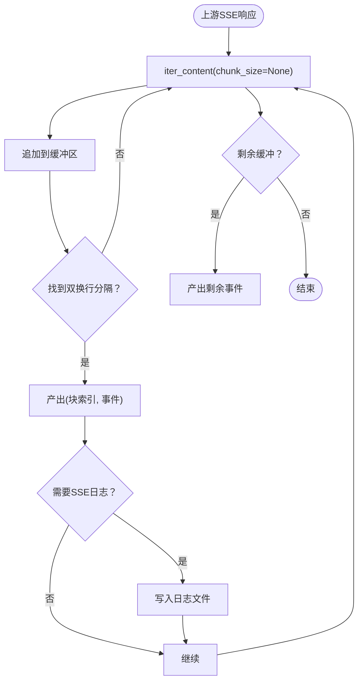
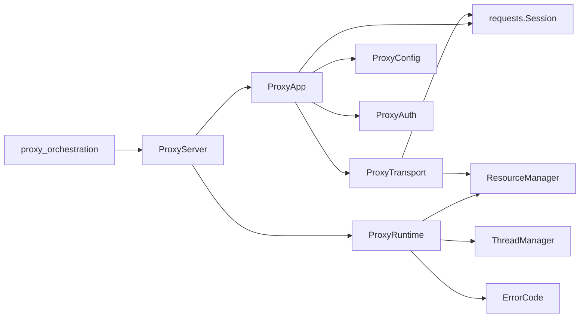

# 代理服务器核心API

<cite>
**本文引用的文件**
- [modules/proxy/proxy_server.py](file://modules/proxy/proxy_server.py)
- [modules/proxy/proxy_app.py](file://modules/proxy/proxy_app.py)
- [modules/proxy/proxy_runtime.py](file://modules/proxy/proxy_runtime.py)
- [modules/proxy/proxy_config.py](file://modules/proxy/proxy_config.py)
- [modules/proxy/proxy_transport.py](file://modules/proxy/proxy_transport.py)
- [modules/proxy/proxy_auth.py](file://modules/proxy/proxy_auth.py)
- [modules/services/proxy_orchestration.py](file://modules/services/proxy_orchestration.py)
- [modules/runtime/error_codes.py](file://modules/runtime/error_codes.py)
- [modules/runtime/operation_result.py](file://modules/runtime/operation_result.py)
</cite>

## 目录
1. [简介](#简介)
2. [项目结构](#项目结构)
3. [核心组件](#核心组件)
4. [架构总览](#架构总览)
5. [详细组件分析](#详细组件分析)
6. [依赖关系分析](#依赖关系分析)
7. [性能考量](#性能考量)
8. [故障排查指南](#故障排查指南)
9. [结论](#结论)
10. [附录](#附录)

## 简介
本技术文档聚焦于代理服务器核心API，系统性解析ProxyServer类与ProxyApp类的协同工作机制，阐述其如何通过“领域逻辑（ProxyApp）与运行时（ProxyRuntime）”的分层设计实现职责分离；详细说明ProxyServer的start、stop、is_running方法如何与ProxyApp的Flask路由系统（_get_models、_chat_completions）集成；文档化模型ID映射机制、请求转发流程以及流式响应处理逻辑（含SSE事件提取、规范化与模拟流式响应）；提供完整的配置参数说明（target_api_base_url、custom_model_id、stream_mode等），并结合代码路径示例展示请求拦截与转发的具体实现；最后解释调试模式下的日志输出机制与错误处理策略。

## 项目结构
代理服务器相关代码位于modules/proxy目录，配合运行时与服务编排模块共同构成完整的代理系统：
- 领域逻辑：ProxyApp（Flask应用、路由、鉴权、上游转发）
- 运行时：ProxyRuntime（证书加载、HTTPS监听、线程管理、生命周期控制）
- 配置：ProxyConfig（配置解析、模型ID映射、中间路由）
- 传输：ProxyTransport（SSE事件提取、OpenAI事件规范化、HTTP会话）
- 鉴权：ProxyAuth（Bearer密钥校验、转发头构建）
- 编排：proxy_orchestration（启动/停止/重启代理实例，网络环境检查）

图表来源
- [modules/proxy/proxy_server.py](file://modules/proxy/proxy_server.py#L14-L54)
- [modules/proxy/proxy_app.py](file://modules/proxy/proxy_app.py#L18-L66)
- [modules/proxy/proxy_runtime.py](file://modules/proxy/proxy_runtime.py#L46-L64)
- [modules/proxy/proxy_transport.py](file://modules/proxy/proxy_transport.py#L33-L49)
- [modules/proxy/proxy_config.py](file://modules/proxy/proxy_config.py#L14-L25)
- [modules/proxy/proxy_auth.py](file://modules/proxy/proxy_auth.py#L6-L32)
- [modules/services/proxy_orchestration.py](file://modules/services/proxy_orchestration.py#L13-L28)

章节来源
- [modules/proxy/proxy_server.py](file://modules/proxy/proxy_server.py#L1-L65)
- [modules/proxy/proxy_app.py](file://modules/proxy/proxy_app.py#L1-L462)
- [modules/proxy/proxy_runtime.py](file://modules/proxy/proxy_runtime.py#L1-L218)
- [modules/proxy/proxy_config.py](file://modules/proxy/proxy_config.py#L1-L107)
- [modules/proxy/proxy_transport.py](file://modules/proxy/proxy_transport.py#L1-L163)
- [modules/proxy/proxy_auth.py](file://modules/proxy/proxy_auth.py#L1-L36)
- [modules/services/proxy_orchestration.py](file://modules/services/proxy_orchestration.py#L1-L200)

## 核心组件
- ProxyServer：负责装配ProxyApp与ProxyRuntime，协调启动、停止与运行状态查询；将配置参数传递给运行时以启动HTTPS监听。
- ProxyApp：承载Flask应用，定义/models与/chat/completions路由；执行鉴权、模型ID映射、请求体修正、上游转发与响应处理（含SSE与非流式）。
- ProxyRuntime：负责证书加载、HTTPS服务器创建、线程生命周期管理、运行状态维护与优雅停止。
- ProxyTransport：封装HTTP会话、SSE事件提取、OpenAI事件规范化、可选的SSL严格模式调整。
- ProxyConfig：解析用户配置，计算模型ID映射、中间路由、流模式、调试模式等。
- ProxyAuth：校验Authorization头，构建转发头（透传或使用配置API Key）。
- proxy_orchestration：对外提供启动/停止/重启代理实例的高层接口，包含网络环境检查与hosts文件修改。

章节来源
- [modules/proxy/proxy_server.py](file://modules/proxy/proxy_server.py#L14-L54)
- [modules/proxy/proxy_app.py](file://modules/proxy/proxy_app.py#L18-L66)
- [modules/proxy/proxy_runtime.py](file://modules/proxy/proxy_runtime.py#L46-L64)
- [modules/proxy/proxy_transport.py](file://modules/proxy/proxy_transport.py#L33-L49)
- [modules/proxy/proxy_config.py](file://modules/proxy/proxy_config.py#L14-L25)
- [modules/proxy/proxy_auth.py](file://modules/proxy/proxy_auth.py#L6-L32)
- [modules/services/proxy_orchestration.py](file://modules/services/proxy_orchestration.py#L13-L28)

## 架构总览
ProxyServer作为装配者，将领域逻辑（ProxyApp）与运行时（ProxyRuntime）解耦。ProxyApp负责业务路由与转发，ProxyRuntime负责网络监听与线程管理。两者通过配置参数与资源管理器协作，形成清晰的职责边界。

图表来源
- [modules/proxy/proxy_server.py](file://modules/proxy/proxy_server.py#L35-L54)
- [modules/proxy/proxy_app.py](file://modules/proxy/proxy_app.py#L96-L112)
- [modules/proxy/proxy_runtime.py](file://modules/proxy/proxy_runtime.py#L66-L157)
- [modules/proxy/proxy_transport.py](file://modules/proxy/proxy_transport.py#L81-L107)
- [modules/services/proxy_orchestration.py](file://modules/services/proxy_orchestration.py#L153-L184)

## 详细组件分析

### ProxyServer：装配与生命周期
- 组成：持有app_layer（ProxyApp）、runtime（ProxyRuntime）、资源管理器与线程管理器。
- start(host, port)：先校验ProxyApp是否有效，再调用ProxyRuntime启动HTTPS监听，并将target_api_base_url、custom_model_id、target_model_id、stream_mode等参数传递给运行时。
- stop()：先停止运行时，再关闭ProxyApp的传输层。
- is_running()：委托运行时查询当前运行状态。

图表来源
- [modules/proxy/proxy_server.py](file://modules/proxy/proxy_server.py#L14-L54)

章节来源
- [modules/proxy/proxy_server.py](file://modules/proxy/proxy_server.py#L14-L54)

### ProxyApp：领域逻辑与路由系统
- 初始化：解析配置（build_proxy_config），设置目标API地址、中间路由、模型ID映射、流模式、调试模式；创建Flask应用并注册/models与/chat/completions路由。
- 鉴权：通过ProxyAuth校验Authorization头，支持透传或使用配置API Key。
- 模型ID映射：_get_mapped_model_id返回custom_model_id，/_models返回该映射后的模型信息。
- 请求转发：_chat_completions中对请求体进行修正（model字段替换、stream强制），构造转发头，调用requests.Session发起POST请求。
- 流式响应：当上游返回SSE时，使用ProxyTransport.extract_sse_events逐事件提取，再通过normalize_openai_event规范化为标准OpenAI chunk格式；若上游非流式且客户端要求流式，则模拟流式响应。
- 调试模式：打印请求头、请求体、上游响应状态与内容类型等信息。

图表来源
- [modules/proxy/proxy_app.py](file://modules/proxy/proxy_app.py#L164-L458)

章节来源
- [modules/proxy/proxy_app.py](file://modules/proxy/proxy_app.py#L18-L66)
- [modules/proxy/proxy_app.py](file://modules/proxy/proxy_app.py#L114-L162)
- [modules/proxy/proxy_app.py](file://modules/proxy/proxy_app.py#L164-L458)

### ProxyRuntime：运行时与生命周期
- 启动：加载证书文件，创建StoppableWSGIServer，启动线程执行serve_forever；记录启动日志与状态；处理权限、端口占用、证书缺失等错误并返回OperationResult。
- 停止：触发server_close，等待线程退出，清理状态；返回OperationResult。
- 状态：维护running标志、server实例、线程句柄与任务ID。

图表来源
- [modules/proxy/proxy_runtime.py](file://modules/proxy/proxy_runtime.py#L16-L44)
- [modules/proxy/proxy_runtime.py](file://modules/proxy/proxy_runtime.py#L46-L64)
- [modules/proxy/proxy_runtime.py](file://modules/proxy/proxy_runtime.py#L66-L171)
- [modules/proxy/proxy_runtime.py](file://modules/proxy/proxy_runtime.py#L172-L214)

章节来源
- [modules/proxy/proxy_runtime.py](file://modules/proxy/proxy_runtime.py#L46-L214)

### ProxyTransport：SSE与事件规范化
- HTTP会话：支持在禁用SSL严格模式时使用自定义SSLContextAdapter。
- SSE事件提取：按块读取上游响应，拼接缓冲区，按双换行符分割事件，逐事件产出。
- OpenAI事件规范化：将上游事件解析为JSON，抽取delta/message内容，补齐role、finish_reason等字段，输出标准OpenAI chunk格式。
- SSE日志：可选将原始SSE数据写入logs目录下的日志文件，便于调试。

图表来源
- [modules/proxy/proxy_transport.py](file://modules/proxy/proxy_transport.py#L81-L107)
- [modules/proxy/proxy_transport.py](file://modules/proxy/proxy_transport.py#L113-L159)

章节来源
- [modules/proxy/proxy_transport.py](file://modules/proxy/proxy_transport.py#L33-L163)

### ProxyConfig：配置解析与模型ID映射
- 关键字段：target_api_base_url、middle_route、custom_model_id、target_model_id、stream_mode、debug_mode、disable_ssl_strict_mode、api_key、mtga_auth_key。
- 中间路由规范化：确保以斜杠开头、末尾去除多余斜杠，空值回退至默认值。
- 模型ID映射：
  - custom_model_id优先取全局配置中的mapped_model_id，否则取配置组中的mapped_model_id，否则使用默认值。
  - target_model_id优先取配置组中的model_id，否则回退到custom_model_id。
- 构建配置：build_proxy_config整合全局与本地配置，返回ProxyConfig对象。

章节来源
- [modules/proxy/proxy_config.py](file://modules/proxy/proxy_config.py#L14-L25)
- [modules/proxy/proxy_config.py](file://modules/proxy/proxy_config.py#L38-L46)
- [modules/proxy/proxy_config.py](file://modules/proxy/proxy_config.py#L49-L59)
- [modules/proxy/proxy_config.py](file://modules/proxy/proxy_config.py#L62-L96)

### ProxyAuth：鉴权与转发头构建
- 鉴权：支持无密钥（直接放行）与Bearer密钥校验；支持透传原始Authorization。
- 转发头：若配置了API Key则使用Bearer API Key；否则透传原始Authorization。

章节来源
- [modules/proxy/proxy_auth.py](file://modules/proxy/proxy_auth.py#L6-L32)

### 编排与外部集成
- proxy_orchestration提供高层接口：构建配置（注入debug_mode、disable_ssl_strict_mode、stream_mode）、启动/停止/重启代理实例、网络环境检查、hosts文件修改。
- 与ProxyServer集成：通过start_proxy_instance_result创建ProxyServer实例并启动，记录日志与返回OperationResult。

章节来源
- [modules/services/proxy_orchestration.py](file://modules/services/proxy_orchestration.py#L53-L67)
- [modules/services/proxy_orchestration.py](file://modules/services/proxy_orchestration.py#L153-L184)

## 依赖关系分析
- ProxyServer依赖ProxyApp与ProxyRuntime，通过线程管理器与资源管理器协调。
- ProxyApp依赖ProxyConfig、ProxyAuth、ProxyTransport与requests.Session。
- ProxyRuntime依赖资源管理器、线程管理器与错误码枚举。
- ProxyTransport依赖资源管理器与requests.Session。
- proxy_orchestration依赖ProxyServer与网络工具、hosts修改能力。

图表来源
- [modules/proxy/proxy_server.py](file://modules/proxy/proxy_server.py#L17-L33)
- [modules/proxy/proxy_app.py](file://modules/proxy/proxy_app.py#L40-L63)
- [modules/proxy/proxy_runtime.py](file://modules/proxy/proxy_runtime.py#L49-L61)
- [modules/proxy/proxy_transport.py](file://modules/proxy/proxy_transport.py#L36-L45)
- [modules/services/proxy_orchestration.py](file://modules/services/proxy_orchestration.py#L177-L178)

章节来源
- [modules/proxy/proxy_server.py](file://modules/proxy/proxy_server.py#L17-L33)
- [modules/proxy/proxy_app.py](file://modules/proxy/proxy_app.py#L40-L63)
- [modules/proxy/proxy_runtime.py](file://modules/proxy/proxy_runtime.py#L49-L61)
- [modules/proxy/proxy_transport.py](file://modules/proxy/proxy_transport.py#L36-L45)
- [modules/services/proxy_orchestration.py](file://modules/services/proxy_orchestration.py#L177-L178)

## 性能考量
- 流式处理：SSE事件按块迭代读取，避免一次性加载大响应；事件规范化在内存中进行，注意上游事件大小与下游消费速率匹配。
- 线程模型：运行时使用独立线程承载WSGI服务循环，避免阻塞主线程；停止时等待线程退出，保证资源回收。
- SSL上下文：在禁用严格模式时使用自定义SSLContextAdapter，可能影响握手性能，建议仅在必要时开启。
- 日志开销：调试模式下会记录请求头、请求体与上游响应，建议在生产环境关闭以降低IO开销。

[本节为通用性能建议，不直接分析具体文件]

## 故障排查指南
- 启动失败
  - 证书问题：检查证书文件是否存在与可读；查看运行时日志中的“证书路径为空/证书文件不存在”提示。
  - 权限问题：端口443需管理员权限；查看“权限不足”提示。
  - 端口占用：443被占用时启动失败；查看“端口已被占用”提示。
- 鉴权失败
  - Authorization头缺失或不匹配；确认mtga_auth_key配置正确，或移除鉴权以允许透传。
- 流式响应异常
  - 上游未返回SSE：若stream_mode为true而上游不支持流式，将返回非流式JSON；如需模拟流式，可在客户端侧设置stream_mode为false并让服务端将非流式响应转换为SSE。
  - SSE日志：可通过调试模式生成logs目录下的SSE日志文件，定位事件边界与内容。
- 错误码与返回
  - 运行时统一使用OperationResult封装结果与错误码；常见错误码包括CONFIG_INVALID、FILE_NOT_FOUND、PERMISSION_DENIED、PORT_IN_USE等。

章节来源
- [modules/proxy/proxy_runtime.py](file://modules/proxy/proxy_runtime.py#L95-L170)
- [modules/proxy/proxy_app.py](file://modules/proxy/proxy_app.py#L445-L458)
- [modules/runtime/error_codes.py](file://modules/runtime/error_codes.py#L6-L17)
- [modules/runtime/operation_result.py](file://modules/runtime/operation_result.py#L9-L38)

## 结论
本代理服务器通过ProxyServer与ProxyApp的职责分离，结合ProxyRuntime的运行时能力，实现了从配置解析、路由处理、鉴权校验、上游转发到SSE事件规范化的完整链路。其设计强调可扩展性与可观测性：通过调试模式与SSE日志辅助定位问题；通过流模式与模拟流式响应满足不同客户端需求；通过编排模块实现一键启动/停止/重启与网络环境预检。建议在生产环境中谨慎开启调试模式与禁用SSL严格模式，并确保证书与端口配置正确。

[本节为总结性内容，不直接分析具体文件]

## 附录

### 配置参数说明
- target_api_base_url：上游API的基础URL，必须正确配置。
- middle_route：中间路由前缀，默认“/v1”，将被规范化为以斜杠开头、末尾无多余斜杠的形式。
- custom_model_id：映射后的模型ID，优先取全局配置中的mapped_model_id，否则取配置组中的mapped_model_id，否则使用默认值。
- target_model_id：实际使用的模型ID，优先取配置组中的model_id，否则回退到custom_model_id。
- stream_mode：流模式开关，可为None、"true"、"false"；当为None时不强制；当为"true"时强制客户端与上游均为流式；当为"false"时若上游非流式则模拟流式响应。
- debug_mode：调试模式，开启后记录请求头、请求体、上游响应状态与内容类型等信息。
- disable_ssl_strict_mode：禁用SSL严格模式，使用自定义SSL上下文；仅在必要时启用。
- api_key：用于转发到上游的API Key；若未配置则透传客户端Authorization。
- mtga_auth_key：代理鉴权密钥，用于校验客户端Authorization。

章节来源
- [modules/proxy/proxy_config.py](file://modules/proxy/proxy_config.py#L14-L25)
- [modules/proxy/proxy_config.py](file://modules/proxy/proxy_config.py#L38-L46)
- [modules/proxy/proxy_config.py](file://modules/proxy/proxy_config.py#L49-L59)
- [modules/proxy/proxy_config.py](file://modules/proxy/proxy_config.py#L62-L96)
- [modules/proxy/proxy_app.py](file://modules/proxy/proxy_app.py#L31-L56)
- [modules/proxy/proxy_auth.py](file://modules/proxy/proxy_auth.py#L18-L32)

### 请求拦截与转发示例（代码路径）
- 模型列表请求拦截与返回：见路径
  - [modules/proxy/proxy_app.py](file://modules/proxy/proxy_app.py#L114-L162)
- 聊天补全请求拦截、鉴权与转发：见路径
  - [modules/proxy/proxy_app.py](file://modules/proxy/proxy_app.py#L164-L266)
- 流式SSE事件提取与规范化：见路径
  - [modules/proxy/proxy_app.py](file://modules/proxy/proxy_app.py#L286-L379)
  - [modules/proxy/proxy_transport.py](file://modules/proxy/proxy_transport.py#L81-L107)
  - [modules/proxy/proxy_transport.py](file://modules/proxy/proxy_transport.py#L113-L159)
- 非流式响应模拟为流式：见路径
  - [modules/proxy/proxy_app.py](file://modules/proxy/proxy_app.py#L383-L433)

### 调试模式日志与错误处理
- 调试模式日志：在ProxyApp中打印请求头、请求体、上游响应状态与内容类型；在ProxyTransport中可选记录SSE原始数据到logs目录。
- 错误处理：统一使用OperationResult封装，错误码来自ErrorCode枚举；运行时对证书、权限、端口占用等场景进行分类处理并返回相应错误码。

章节来源
- [modules/proxy/proxy_app.py](file://modules/proxy/proxy_app.py#L99-L101)
- [modules/proxy/proxy_app.py](file://modules/proxy/proxy_app.py#L179-L195)
- [modules/proxy/proxy_app.py](file://modules/proxy/proxy_app.py#L267-L284)
- [modules/proxy/proxy_transport.py](file://modules/proxy/proxy_transport.py#L69-L79)
- [modules/proxy/proxy_runtime.py](file://modules/proxy/proxy_runtime.py#L95-L170)
- [modules/runtime/error_codes.py](file://modules/runtime/error_codes.py#L6-L17)
- [modules/runtime/operation_result.py](file://modules/runtime/operation_result.py#L9-L38)