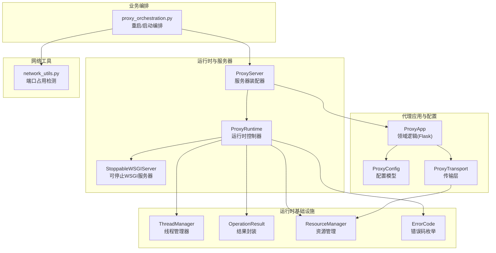
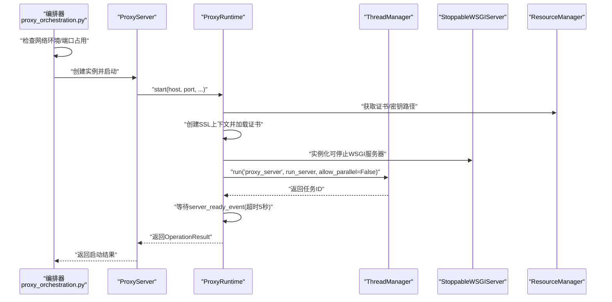
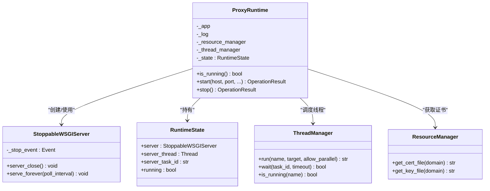
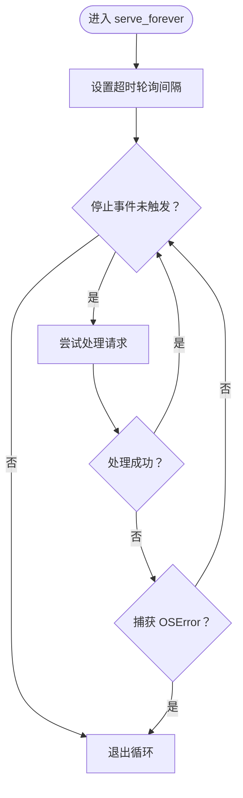
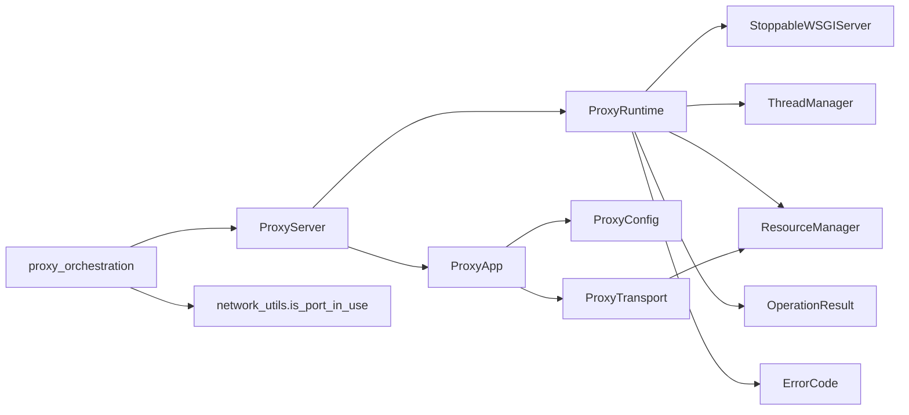

# 代理运行时API

<cite>
**本文档引用的文件**
- [proxy_runtime.py](file://modules/proxy/proxy_runtime.py)
- [proxy_server.py](file://modules/proxy/proxy_server.py)
- [proxy_orchestration.py](file://modules/services/proxy_orchestration.py)
- [operation_result.py](file://modules/runtime/operation_result.py)
- [thread_manager.py](file://modules/runtime/thread_manager.py)
- [resource_manager.py](file://modules/runtime/resource_manager.py)
- [proxy_app.py](file://modules/proxy/proxy_app.py)
- [proxy_config.py](file://modules/proxy/proxy_config.py)
- [proxy_transport.py](file://modules/proxy/proxy_transport.py)
- [network_utils.py](file://modules/network/network_utils.py)
- [error_codes.py](file://modules/runtime/error_codes.py)
</cite>

## 目录
1. [简介](#简介)
2. [项目结构](#项目结构)
3. [核心组件](#核心组件)
4. [架构总览](#架构总览)
5. [详细组件分析](#详细组件分析)
6. [依赖关系分析](#依赖关系分析)
7. [性能考量](#性能考量)
8. [故障排查指南](#故障排查指南)
9. [结论](#结论)

## 简介
本文件面向代理运行时API，系统性解析以下关键主题：
- ProxyRuntime类的线程安全模型与生命周期管理
- StoppableWSGIServer如何实现可中断的服务器运行
- RuntimeState数据类如何跟踪服务器状态
- start方法中证书加载、SSL上下文创建、端口占用检测与多线程启动的完整流程，以及对PermissionError、OSError等异常的处理策略
- stop方法中的优雅关闭机制，包括服务器实例关闭、线程等待与资源清理
- 与proxy_orchestration.py中的restart_proxy、start_proxy_instance等函数协作，说明高层业务逻辑如何协调运行时操作，并涵盖OperationResult在状态变更中的错误传播机制

## 项目结构
围绕代理运行时API的关键模块分布如下：
- 运行时与服务器：modules/proxy/proxy_runtime.py、modules/proxy/proxy_server.py
- 业务编排：modules/services/proxy_orchestration.py
- 运行时基础设施：modules/runtime/thread_manager.py、modules/runtime/operation_result.py、modules/runtime/resource_manager.py、modules/runtime/error_codes.py
- 代理应用与配置：modules/proxy/proxy_app.py、modules/proxy/proxy_config.py、modules/proxy/proxy_transport.py
- 网络工具：modules/network/network_utils.py

图表来源
- [proxy_runtime.py](file://modules/proxy/proxy_runtime.py#L1-L218)
- [proxy_server.py](file://modules/proxy/proxy_server.py#L1-L65)
- [proxy_orchestration.py](file://modules/services/proxy_orchestration.py#L1-L200)
- [thread_manager.py](file://modules/runtime/thread_manager.py#L1-L171)
- [operation_result.py](file://modules/runtime/operation_result.py#L1-L41)
- [resource_manager.py](file://modules/runtime/resource_manager.py#L1-L294)
- [proxy_app.py](file://modules/proxy/proxy_app.py#L1-L462)
- [proxy_config.py](file://modules/proxy/proxy_config.py#L1-L107)
- [proxy_transport.py](file://modules/proxy/proxy_transport.py#L1-L163)
- [network_utils.py](file://modules/network/network_utils.py#L1-L20)

章节来源
- [proxy_runtime.py](file://modules/proxy/proxy_runtime.py#L1-L218)
- [proxy_server.py](file://modules/proxy/proxy_server.py#L1-L65)
- [proxy_orchestration.py](file://modules/services/proxy_orchestration.py#L1-L200)
- [thread_manager.py](file://modules/runtime/thread_manager.py#L1-L171)
- [operation_result.py](file://modules/runtime/operation_result.py#L1-L41)
- [resource_manager.py](file://modules/runtime/resource_manager.py#L1-L294)
- [proxy_app.py](file://modules/proxy/proxy_app.py#L1-L462)
- [proxy_config.py](file://modules/proxy/proxy_config.py#L1-L107)
- [proxy_transport.py](file://modules/proxy/proxy_transport.py#L1-L163)
- [network_utils.py](file://modules/network/network_utils.py#L1-L20)

## 核心组件
- ProxyRuntime：负责证书/监听/线程生命周期管理，提供start/stop接口与运行状态跟踪
- StoppableWSGIServer：基于Werkzeug的可停止WSGI服务器，通过事件标志实现可中断的serve_forever循环
- RuntimeState：轻量数据类，保存服务器实例、线程、任务ID与运行标志
- ProxyServer：装配ProxyApp与ProxyRuntime，对外暴露start/stop/is_running
- ThreadManager：统一后台线程管理，支持串行/并行控制、等待与状态快照
- OperationResult：统一的结果封装，携带ok/message/code/details，用于错误传播
- ResourceManager：证书/密钥/配置等资源路径管理
- proxy_orchestration：高层业务编排，协调重启、启动、端口占用检测与hosts修改

章节来源
- [proxy_runtime.py](file://modules/proxy/proxy_runtime.py#L46-L218)
- [proxy_server.py](file://modules/proxy/proxy_server.py#L14-L65)
- [thread_manager.py](file://modules/runtime/thread_manager.py#L42-L171)
- [operation_result.py](file://modules/runtime/operation_result.py#L9-L41)
- [resource_manager.py](file://modules/runtime/resource_manager.py#L201-L294)
- [proxy_orchestration.py](file://modules/services/proxy_orchestration.py#L1-L200)

## 架构总览
代理运行时API采用“装配器+运行时”的分层设计：
- ProxyServer作为装配器，组合ProxyApp（领域逻辑）与ProxyRuntime（运行时）
- ProxyRuntime负责证书加载、SSL上下文创建、服务器实例化、线程调度与优雅关闭
- ThreadManager提供线程生命周期与并发控制
- OperationResult贯穿于各层，统一错误传播
- proxy_orchestration协调高层业务（如重启、启动），并在启动前进行端口占用检测与hosts修改

图表来源
- [proxy_orchestration.py](file://modules/services/proxy_orchestration.py#L153-L184)
- [proxy_server.py](file://modules/proxy/proxy_server.py#L35-L47)
- [proxy_runtime.py](file://modules/proxy/proxy_runtime.py#L66-L171)
- [thread_manager.py](file://modules/runtime/thread_manager.py#L61-L101)
- [resource_manager.py](file://modules/runtime/resource_manager.py#L227-L241)

## 详细组件分析

### ProxyRuntime：线程安全模型与生命周期管理
- 线程安全模型
  - 使用RuntimeState保存服务器实例、线程对象、任务ID与running标志，所有状态更新在单线程上下文中进行（通过ThreadManager调度run_server）
  - 通过Event对象（server_ready_event）与ThreadManager的wait机制实现启动阶段的同步与超时控制
  - stop方法中先设置running=False，再调用server_close触发停止事件，最后等待线程结束，确保状态一致性
- 生命周期管理
  - start：证书校验→SSL上下文创建→服务器实例化→线程启动→等待就绪→返回结果
  - stop：标记停止→调用server_close→等待线程结束→清理状态→返回结果
- 异常处理策略
  - PermissionError：权限不足，返回PERMISSION_DENIED
  - OSError：区分“地址已被占用”与其它OS错误，分别返回PORT_IN_USE与UNKNOWN
  - 其他异常：统一包装为UNKNOWN

图表来源
- [proxy_runtime.py](file://modules/proxy/proxy_runtime.py#L46-L218)
- [thread_manager.py](file://modules/runtime/thread_manager.py#L42-L171)
- [resource_manager.py](file://modules/runtime/resource_manager.py#L227-L241)

章节来源
- [proxy_runtime.py](file://modules/proxy/proxy_runtime.py#L46-L218)

### StoppableWSGIServer：可中断的服务器运行
- 基于BaseWSGIServer扩展，增加_stop_event事件
- server_close：设置停止事件并调用父类关闭
- serve_forever：轮询_stop_event，每次循环处理一次请求；捕获OSError后退出循环，实现可中断的事件循环

图表来源
- [proxy_runtime.py](file://modules/proxy/proxy_runtime.py#L29-L36)

章节来源
- [proxy_runtime.py](file://modules/proxy/proxy_runtime.py#L16-L36)

### RuntimeState：服务器状态跟踪
- 字段：server、server_thread、server_task_id、running
- 作用：在ProxyRuntime内部统一维护服务器实例与运行状态，供start/stop使用

章节来源
- [proxy_runtime.py](file://modules/proxy/proxy_runtime.py#L38-L44)

### ProxyServer：装配器与对外接口
- 组合ProxyApp与ProxyRuntime，提供start/stop/is_running
- 将ProxyApp的配置参数传递给ProxyRuntime.start

章节来源
- [proxy_server.py](file://modules/proxy/proxy_server.py#L14-L65)

### ThreadManager：线程调度与并发控制
- run：创建线程，支持依赖等待、串行锁（allow_parallel=False时按名称加锁）、守护线程
- wait：等待任务完成，支持超时
- is_running：查询某名称的活动任务
- 为ProxyRuntime提供稳定的线程生命周期管理

章节来源
- [thread_manager.py](file://modules/runtime/thread_manager.py#L42-L171)

### OperationResult：统一结果封装与错误传播
- 字段：ok、message、code、details
- 提供success/failure类方法，用于上层编排与UI层判断

章节来源
- [operation_result.py](file://modules/runtime/operation_result.py#L9-L41)

### ResourceManager：证书与资源路径管理
- 提供get_cert_file/get_key_file等方法，从用户数据目录读取证书与密钥
- 在start中用于证书存在性与有效性校验

章节来源
- [resource_manager.py](file://modules/runtime/resource_manager.py#L227-L241)

### proxy_orchestration：高层业务编排
- restart_proxy/restart_proxy_result：先停止旧实例，再启动新实例
- start_proxy_instance/start_proxy_instance_result：网络环境预检、端口占用检测、hosts修改、创建ProxyServer并启动
- Stop/Start流程均使用OperationResult进行错误传播

章节来源
- [proxy_orchestration.py](file://modules/services/proxy_orchestration.py#L94-L200)

## 依赖关系分析

图表来源
- [proxy_runtime.py](file://modules/proxy/proxy_runtime.py#L1-L218)
- [proxy_server.py](file://modules/proxy/proxy_server.py#L1-L65)
- [proxy_orchestration.py](file://modules/services/proxy_orchestration.py#L1-L200)
- [proxy_app.py](file://modules/proxy/proxy_app.py#L1-L462)
- [proxy_config.py](file://modules/proxy/proxy_config.py#L1-L107)
- [proxy_transport.py](file://modules/proxy/proxy_transport.py#L1-L163)
- [network_utils.py](file://modules/network/network_utils.py#L1-L20)

章节来源
- [proxy_runtime.py](file://modules/proxy/proxy_runtime.py#L1-L218)
- [proxy_server.py](file://modules/proxy/proxy_server.py#L1-L65)
- [proxy_orchestration.py](file://modules/services/proxy_orchestration.py#L1-L200)
- [proxy_app.py](file://modules/proxy/proxy_app.py#L1-L462)
- [proxy_config.py](file://modules/proxy/proxy_config.py#L1-L107)
- [proxy_transport.py](file://modules/proxy/proxy_transport.py#L1-L163)
- [network_utils.py](file://modules/network/network_utils.py#L1-L20)

## 性能考量
- 线程模型：通过ThreadManager的串行锁（allow_parallel=False）避免重复启动，降低资源竞争
- 事件循环：StoppableWSGIServer使用轮询与超时，减少阻塞时间，提升响应性
- SSL上下文：仅在start中创建一次，避免重复开销
- 端口占用检测：在编排层进行快速检测，避免无效启动尝试
- 日志与调试：Debug模式下会输出大量请求/响应细节，生产环境建议关闭以降低IO开销

## 故障排查指南
- 启动失败（证书相关）
  - 现象：返回CONFIG_INVALID或FILE_NOT_FOUND
  - 排查：确认ResourceManager返回的证书/密钥路径存在且有效
- 启动失败（权限相关）
  - 现象：返回PERMISSION_DENIED
  - 排查：以管理员权限运行或更换非特权端口
- 启动失败（端口占用）
  - 现象：返回PORT_IN_USE
  - 排查：使用network_utils.is_port_in_use检测端口占用，释放占用进程或更换端口
- 启动超时
  - 现象：server_ready_event等待超时
  - 排查：检查线程调度、证书加载与服务器实例化过程的日志
- 优雅关闭失败
  - 现象：线程未能在5秒内停止
  - 排查：查看ThreadManager.wait返回值与日志，确认server_close是否被调用

章节来源
- [proxy_runtime.py](file://modules/proxy/proxy_runtime.py#L159-L171)
- [proxy_orchestration.py](file://modules/services/proxy_orchestration.py#L160-L166)
- [thread_manager.py](file://modules/runtime/thread_manager.py#L124-L132)

## 结论
本代理运行时API通过清晰的分层与强一致的状态管理，实现了可中断、可重启、可监控的代理服务器运行时。ProxyRuntime以RuntimeState为核心，结合StoppableWSGIServer与ThreadManager，提供了可靠的线程安全模型与优雅关闭机制；proxy_orchestration在高层业务层面协调启动/停止流程，并通过OperationResult统一错误传播，确保系统行为可预期、可观测、可恢复。