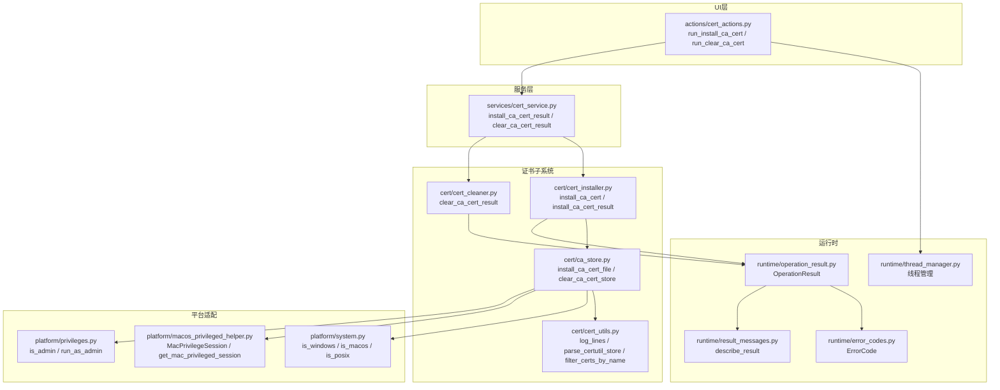
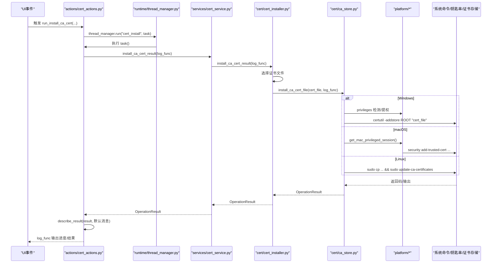
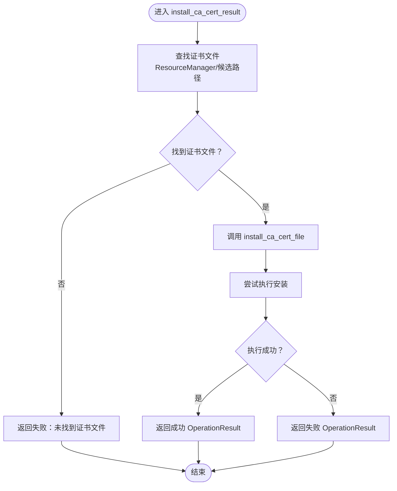
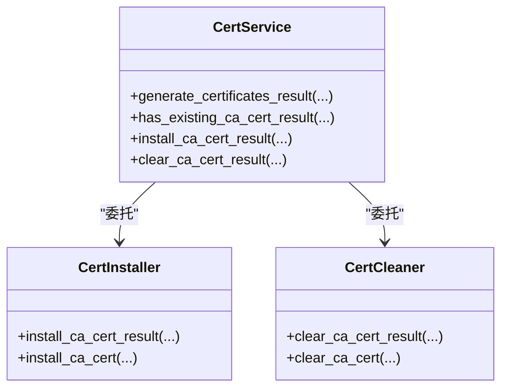
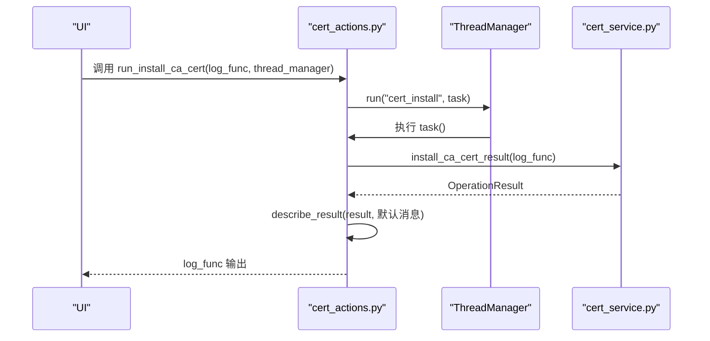
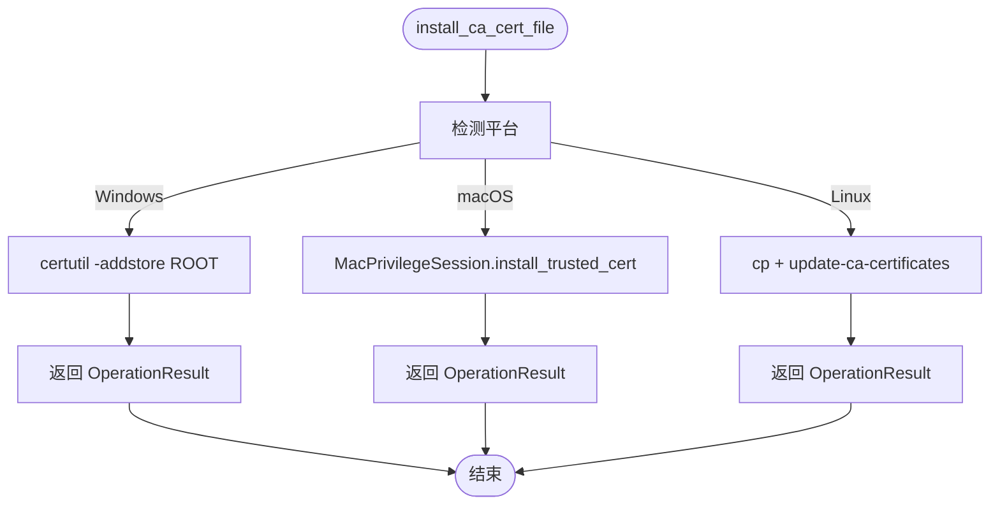
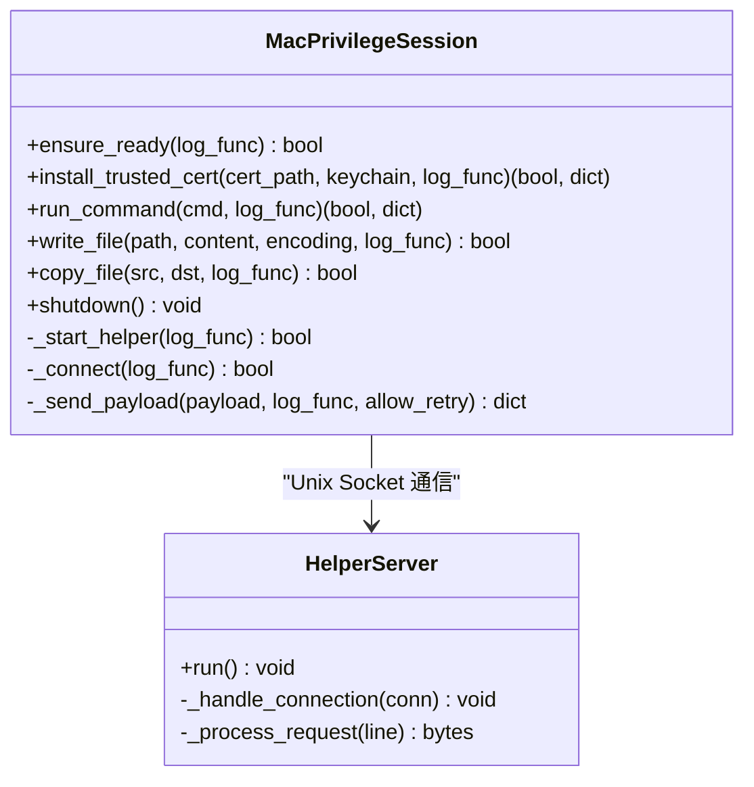
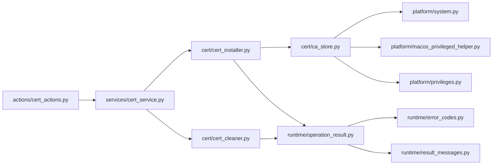

# 证书安装与管理API

<cite>
**本文引用的文件**
- [modules/cert/cert_installer.py](file://modules/cert/cert_installer.py)
- [modules/services/cert_service.py](file://modules/services/cert_service.py)
- [modules/actions/cert_actions.py](file://modules/actions/cert_actions.py)
- [modules/runtime/thread_manager.py](file://modules/runtime/thread_manager.py)
- [modules/runtime/operation_result.py](file://modules/runtime/operation_result.py)
- [modules/runtime/result_messages.py](file://modules/runtime/result_messages.py)
- [modules/runtime/error_codes.py](file://modules/runtime/error_codes.py)
- [modules/cert/ca_store.py](file://modules/cert/ca_store.py)
- [modules/cert/cert_cleaner.py](file://modules/cert/cert_cleaner.py)
- [modules/cert/cert_utils.py](file://modules/cert/cert_utils.py)
- [modules/platform/macos_privileged_helper.py](file://modules/platform/macos_privileged_helper.py)
- [modules/platform/privileges.py](file://modules/platform/privileges.py)
- [modules/platform/system.py](file://modules/platform/system.py)
</cite>

## 目录
1. [简介](#简介)
2. [项目结构](#项目结构)
3. [核心组件](#核心组件)
4. [架构总览](#架构总览)
5. [详细组件分析](#详细组件分析)
6. [依赖关系分析](#依赖关系分析)
7. [性能考量](#性能考量)
8. [故障排查指南](#故障排查指南)
9. [结论](#结论)
10. [附录：调用示例与最佳实践](#附录调用示例与最佳实践)

## 简介
本文件系统性地文档化了证书安装与管理API，重点覆盖以下方面：
- cert_installer.py 中 install_ca_cert 的实现细节，包括 Windows 证书存储集成、macOS 钥匙串访问与权限处理机制
- cert_service.py 中 install_ca_cert_result 与 clear_ca_cert_result 如何将底层操作封装为 OperationResult 对象
- actions 层 run_install_ca_cert 与 run_clear_ca_cert 如何作为 UI 事件处理器，在独立线程中执行证书安装/清除任务，并通过 log_func 反馈进度
- 线程安全设计与 thread_manager 在防止 GUI 冻结中的作用
- 错误处理策略（证书已存在、权限不足等）与 describe_result 将错误码转换为用户可读消息的机制
- 完整调用链示例，从 UI 触发到服务执行

## 项目结构
围绕证书安装与管理的关键模块分布如下：
- 证书安装入口与封装：modules/cert/cert_installer.py
- 服务层封装：modules/services/cert_service.py
- UI 事件处理器：modules/actions/cert_actions.py
- 线程管理：modules/runtime/thread_manager.py
- 结果模型与消息映射：modules/runtime/operation_result.py、modules/runtime/result_messages.py、modules/runtime/error_codes.py
- 平台适配与系统命令：modules/cert/ca_store.py、modules/cert/cert_utils.py、modules/platform/system.py
- macOS 权限与钥匙串交互：modules/platform/macos_privileged_helper.py
- Windows 权限与提权：modules/platform/privileges.py
- 清理流程：modules/cert/cert_cleaner.py

图表来源
- [modules/actions/cert_actions.py](file://modules/actions/cert_actions.py#L30-L66)
- [modules/services/cert_service.py](file://modules/services/cert_service.py#L1-L38)
- [modules/cert/cert_installer.py](file://modules/cert/cert_installer.py#L15-L51)
- [modules/cert/ca_store.py](file://modules/cert/ca_store.py#L28-L53)
- [modules/cert/cert_cleaner.py](file://modules/cert/cert_cleaner.py#L12-L23)
- [modules/runtime/thread_manager.py](file://modules/runtime/thread_manager.py#L42-L171)
- [modules/runtime/operation_result.py](file://modules/runtime/operation_result.py#L9-L41)
- [modules/runtime/result_messages.py](file://modules/runtime/result_messages.py#L20-L29)
- [modules/runtime/error_codes.py](file://modules/runtime/error_codes.py#L6-L20)
- [modules/cert/cert_utils.py](file://modules/cert/cert_utils.py#L11-L72)
- [modules/platform/system.py](file://modules/platform/system.py#L7-L34)
- [modules/platform/macos_privileged_helper.py](file://modules/platform/macos_privileged_helper.py#L52-L358)
- [modules/platform/privileges.py](file://modules/platform/privileges.py#L13-L113)

章节来源
- [modules/actions/cert_actions.py](file://modules/actions/cert_actions.py#L1-L66)
- [modules/services/cert_service.py](file://modules/services/cert_service.py#L1-L38)
- [modules/cert/cert_installer.py](file://modules/cert/cert_installer.py#L1-L51)
- [modules/cert/ca_store.py](file://modules/cert/ca_store.py#L1-L304)
- [modules/cert/cert_cleaner.py](file://modules/cert/cert_cleaner.py#L1-L23)
- [modules/runtime/thread_manager.py](file://modules/runtime/thread_manager.py#L1-L171)
- [modules/runtime/operation_result.py](file://modules/runtime/operation_result.py#L1-L41)
- [modules/runtime/result_messages.py](file://modules/runtime/result_messages.py#L1-L29)
- [modules/runtime/error_codes.py](file://modules/runtime/error_codes.py#L1-L20)
- [modules/cert/cert_utils.py](file://modules/cert/cert_utils.py#L1-L72)
- [modules/platform/system.py](file://modules/platform/system.py#L1-L34)
- [modules/platform/macos_privileged_helper.py](file://modules/platform/macos_privileged_helper.py#L1-L487)
- [modules/platform/privileges.py](file://modules/platform/privileges.py#L1-L113)

## 核心组件
- install_ca_cert / install_ca_cert_result：面向 UI 的安装入口，负责选择证书文件并委托平台适配层执行安装，最终以 OperationResult 返回结果。
- install_ca_cert_file：跨平台安装入口，按平台分派至 Windows/macOS/Linux 的具体实现。
- clear_ca_cert_result / clear_ca_cert：清理入口，委托 ca_store 清理系统信任存储中的 CA。
- OperationResult：统一的结果载体，包含 ok、message、code、details 字段，支持 success/failure 类方法。
- describe_result：将 OperationResult 的 code 映射为用户可读消息，默认回退到自定义默认消息。
- ThreadManager：线程池式后台任务管理器，保证 UI 不被阻塞，支持并发控制、依赖等待、状态查询与错误记录。
- macOS 权限会话：MacPrivilegeSession 通过 osascript 启动 root helper，建立 Unix Socket 通信，实现安全的管理员权限调用。
- Windows 权限：privileges 模块提供 is_admin/is_windows_elevated/run_as_admin 等能力，用于检测与请求提权。

章节来源
- [modules/cert/cert_installer.py](file://modules/cert/cert_installer.py#L15-L51)
- [modules/cert/ca_store.py](file://modules/cert/ca_store.py#L28-L53)
- [modules/cert/cert_cleaner.py](file://modules/cert/cert_cleaner.py#L12-L23)
- [modules/runtime/operation_result.py](file://modules/runtime/operation_result.py#L9-L41)
- [modules/runtime/result_messages.py](file://modules/runtime/result_messages.py#L20-L29)
- [modules/runtime/thread_manager.py](file://modules/runtime/thread_manager.py#L42-L171)
- [modules/platform/macos_privileged_helper.py](file://modules/platform/macos_privileged_helper.py#L52-L358)
- [modules/platform/privileges.py](file://modules/platform/privileges.py#L13-L113)

## 架构总览
下图展示了从 UI 事件到系统命令执行的完整调用链，以及线程与结果封装的关系。

图表来源
- [modules/actions/cert_actions.py](file://modules/actions/cert_actions.py#L30-L66)
- [modules/runtime/thread_manager.py](file://modules/runtime/thread_manager.py#L61-L101)
- [modules/services/cert_service.py](file://modules/services/cert_service.py#L1-L38)
- [modules/cert/cert_installer.py](file://modules/cert/cert_installer.py#L15-L51)
- [modules/cert/ca_store.py](file://modules/cert/ca_store.py#L28-L53)
- [modules/platform/macos_privileged_helper.py](file://modules/platform/macos_privileged_helper.py#L133-L166)
- [modules/platform/privileges.py](file://modules/platform/privileges.py#L84-L103)

## 详细组件分析

### 组件A：证书安装入口与封装（cert_installer.py）
- install_ca_cert_result
  - 通过 ResourceManager 获取 CA 证书候选路径，按顺序查找存在的证书文件
  - 若未找到证书文件，返回失败的 OperationResult
  - 调用 install_ca_cert_file 执行安装，捕获异常并返回失败的 OperationResult
- install_ca_cert
  - 直接返回 install_ca_cert_result 的布尔结果

图表来源
- [modules/cert/cert_installer.py](file://modules/cert/cert_installer.py#L15-L51)

章节来源
- [modules/cert/cert_installer.py](file://modules/cert/cert_installer.py#L15-L51)

### 组件B：服务层封装（cert_service.py）
- generate_certificates_result / has_existing_ca_cert_result：对生成与检查流程进行封装，统一返回 OperationResult
- install_ca_cert_result / clear_ca_cert_result：对外暴露的服务入口，内部委托 cert_installer 与 cert_cleaner，返回 OperationResult

图表来源
- [modules/services/cert_service.py](file://modules/services/cert_service.py#L10-L37)
- [modules/cert/cert_installer.py](file://modules/cert/cert_installer.py#L15-L51)
- [modules/cert/cert_cleaner.py](file://modules/cert/cert_cleaner.py#L12-L23)

章节来源
- [modules/services/cert_service.py](file://modules/services/cert_service.py#L1-L38)
- [modules/cert/cert_cleaner.py](file://modules/cert/cert_cleaner.py#L12-L23)

### 组件C：UI事件处理器（actions/cert_actions.py）
- run_install_ca_cert / run_clear_ca_cert
  - 在独立线程中执行任务，使用 thread_manager.run(name, task)
  - 任务内调用 cert_service 的 result 方法，根据 result.ok 输出成功或失败消息
  - 使用 describe_result 将错误码映射为用户可读消息

图表来源
- [modules/actions/cert_actions.py](file://modules/actions/cert_actions.py#L30-L66)
- [modules/runtime/thread_manager.py](file://modules/runtime/thread_manager.py#L61-L101)
- [modules/runtime/result_messages.py](file://modules/runtime/result_messages.py#L20-L29)

章节来源
- [modules/actions/cert_actions.py](file://modules/actions/cert_actions.py#L30-L66)

### 组件D：跨平台安装与清理（ca_store.py）
- install_ca_cert_file
  - Windows：使用 certutil -addstore ROOT 添加到受信任根
  - macOS：通过 MacPrivilegeSession 调用 security add-trusted-cert，写入系统钥匙串并设为信任
  - Linux：复制到 /usr/local/share/ca-certificates 并执行 update-ca-certificates
- clear_ca_cert_store
  - Windows：列出 Root 存储，按 thumbprint 删除匹配证书
  - macOS：通过 MacPrivilegeSession 执行 security delete-certificate

图表来源
- [modules/cert/ca_store.py](file://modules/cert/ca_store.py#L28-L53)
- [modules/platform/macos_privileged_helper.py](file://modules/platform/macos_privileged_helper.py#L133-L166)
- [modules/platform/system.py](file://modules/platform/system.py#L7-L34)

章节来源
- [modules/cert/ca_store.py](file://modules/cert/ca_store.py#L28-L53)
- [modules/platform/macos_privileged_helper.py](file://modules/platform/macos_privileged_helper.py#L133-L166)
- [modules/platform/system.py](file://modules/platform/system.py#L7-L34)

### 组件E：macOS 权限与钥匙串访问
- MacPrivilegeSession
  - 通过 osascript 请求管理员权限，启动 root helper，建立 Unix Socket 通信
  - 提供 install_trusted_cert、run_command、write_file、copy_file 等能力
  - 支持环境变量 SECURITYSESSIONID 传递，确保在登录会话中正确执行
- get_mac_privileged_session
  - 单例获取可用的 MacPrivilegeSession，若不可用返回 None

图表来源
- [modules/platform/macos_privileged_helper.py](file://modules/platform/macos_privileged_helper.py#L52-L358)

章节来源
- [modules/platform/macos_privileged_helper.py](file://modules/platform/macos_privileged_helper.py#L52-L358)

### 组件F：Windows 权限与提权
- is_admin / is_windows_admin / is_windows_elevated：检测当前进程是否具有管理员权限
- run_as_admin：在 Windows 上请求提权并重启进程

章节来源
- [modules/platform/privileges.py](file://modules/platform/privileges.py#L13-L113)

### 组件G：结果模型与消息映射（operation_result.py / result_messages.py / error_codes.py）
- OperationResult
  - 字段：ok、message、code、details
  - 类方法：success(...)、failure(...)，便于统一构造
- describe_result
  - 优先返回 result.message，否则根据 result.code 查表映射，最后回退到默认消息
- ErrorCode
  - 定义通用错误码枚举，如 PERMISSION_DENIED、FILE_NOT_FOUND 等

章节来源
- [modules/runtime/operation_result.py](file://modules/runtime/operation_result.py#L9-L41)
- [modules/runtime/result_messages.py](file://modules/runtime/result_messages.py#L20-L29)
- [modules/runtime/error_codes.py](file://modules/runtime/error_codes.py#L6-L20)

## 依赖关系分析
- 低耦合高内聚
  - actions 层仅负责线程调度与 UI 反馈，不直接操作平台命令
  - services 层负责业务封装，统一返回 OperationResult
  - runtime 层提供线程管理与结果模型，跨模块复用
  - platform 与 cert 子系统各自职责清晰，通过函数接口解耦
- 关键依赖链
  - actions -> services -> cert_installer -> ca_store -> platform/system
  - services -> cert_cleaner -> ca_store
  - runtime/result_messages -> error_codes/operation_result

图表来源
- [modules/actions/cert_actions.py](file://modules/actions/cert_actions.py#L30-L66)
- [modules/services/cert_service.py](file://modules/services/cert_service.py#L1-L38)
- [modules/cert/cert_installer.py](file://modules/cert/cert_installer.py#L15-L51)
- [modules/cert/ca_store.py](file://modules/cert/ca_store.py#L28-L53)
- [modules/cert/cert_cleaner.py](file://modules/cert/cert_cleaner.py#L12-L23)
- [modules/platform/system.py](file://modules/platform/system.py#L7-L34)
- [modules/platform/macos_privileged_helper.py](file://modules/platform/macos_privileged_helper.py#L52-L358)
- [modules/platform/privileges.py](file://modules/platform/privileges.py#L13-L113)
- [modules/runtime/operation_result.py](file://modules/runtime/operation_result.py#L9-L41)
- [modules/runtime/error_codes.py](file://modules/runtime/error_codes.py#L6-L20)
- [modules/runtime/result_messages.py](file://modules/runtime/result_messages.py#L20-L29)

章节来源
- [modules/actions/cert_actions.py](file://modules/actions/cert_actions.py#L30-L66)
- [modules/services/cert_service.py](file://modules/services/cert_service.py#L1-L38)
- [modules/cert/cert_installer.py](file://modules/cert/cert_installer.py#L15-L51)
- [modules/cert/ca_store.py](file://modules/cert/ca_store.py#L28-L53)
- [modules/cert/cert_cleaner.py](file://modules/cert/cert_cleaner.py#L12-L23)
- [modules/platform/system.py](file://modules/platform/system.py#L7-L34)
- [modules/platform/macos_privileged_helper.py](file://modules/platform/macos_privileged_helper.py#L52-L358)
- [modules/platform/privileges.py](file://modules/platform/privileges.py#L13-L113)
- [modules/runtime/operation_result.py](file://modules/runtime/operation_result.py#L9-L41)
- [modules/runtime/error_codes.py](file://modules/runtime/error_codes.py#L6-L20)
- [modules/runtime/result_messages.py](file://modules/runtime/result_messages.py#L20-L29)

## 性能考量
- 线程隔离：通过 ThreadManager 在独立线程中执行耗时任务，避免阻塞 UI 主循环
- 并发控制：同一任务名（如 "cert_install"）默认互斥，避免重复安装导致的资源竞争
- I/O 与命令执行：Windows/macOS/Linux 的证书安装/清理涉及系统命令调用，建议在 UI 中提供进度反馈与取消机制（当前实现未提供取消，可在上层扩展）
- 日志输出：使用 log_lines 逐行输出，减少 UI 刷新压力

[本节为通用指导，无需特定文件来源]

## 故障排查指南
- 证书未找到
  - 现象：install_ca_cert_result 返回“未找到 CA 证书文件”
  - 排查：确认 ResourceManager 与候选路径是否存在证书文件
- Windows 安装失败
  - 现象：返回码非零，stderr/stdout 包含错误信息
  - 排查：确认当前进程具备管理员权限；检查 certutil 命令可用性
- macOS 权限不足
  - 现象：get_mac_privileged_session 返回 None 或安装失败
  - 排查：确认已通过 osascript 成功授权；检查 SECURITYSESSIONID 传递；查看 helper 日志路径
- Linux 安装失败
  - 现象：复制或 update-ca-certificates 返回码非零
  - 排查：确认 sudo 权限；检查目标目录权限
- describe_result 显示未知错误
  - 现象：result.message 为空且 code 未在默认映射表中
  - 排查：在上层传入自定义 message，或扩展 _DEFAULT_MESSAGES

章节来源
- [modules/cert/cert_installer.py](file://modules/cert/cert_installer.py#L34-L42)
- [modules/cert/ca_store.py](file://modules/cert/ca_store.py#L120-L139)
- [modules/platform/macos_privileged_helper.py](file://modules/platform/macos_privileged_helper.py#L214-L228)
- [modules/runtime/result_messages.py](file://modules/runtime/result_messages.py#L20-L29)

## 结论
本 API 通过清晰的分层设计实现了跨平台证书安装与管理：
- UI 事件处理器在独立线程中执行，避免阻塞
- 服务层统一返回 OperationResult，便于上层进行错误处理与消息映射
- 平台适配层将系统命令与权限处理抽象为可复用的函数
- macOS 采用持久化管理员会话，Windows 采用权限检测与提权，Linux 采用 sudo 与系统更新流程
- 错误处理与用户消息映射完善，便于维护与扩展

[本节为总结，无需特定文件来源]

## 附录：调用示例与最佳实践

### 实际调用示例：从 UI 触发到服务执行
- UI 触发
  - 调用 actions.run_install_ca_cert(log_func=..., thread_manager=...)
- 线程执行
  - ThreadManager.run("cert_install", task) 启动后台任务
- 服务封装
  - cert_service.install_ca_cert_result(...) 返回 OperationResult
- 平台安装
  - cert_installer.install_ca_cert_result(...) 选择证书文件并调用 ca_store.install_ca_cert_file(...)
  - Windows：certutil -addstore ROOT
  - macOS：MacPrivilegeSession.install_trusted_cert
  - Linux：复制到 /usr/local/share/ca-certificates 并 update-ca-certificates
- 结果反馈
  - actions 根据 result.ok 输出成功/失败消息
  - describe_result 将错误码映射为用户可读消息

章节来源
- [modules/actions/cert_actions.py](file://modules/actions/cert_actions.py#L30-L66)
- [modules/runtime/thread_manager.py](file://modules/runtime/thread_manager.py#L61-L101)
- [modules/services/cert_service.py](file://modules/services/cert_service.py#L1-L38)
- [modules/cert/cert_installer.py](file://modules/cert/cert_installer.py#L15-L51)
- [modules/cert/ca_store.py](file://modules/cert/ca_store.py#L28-L53)
- [modules/runtime/result_messages.py](file://modules/runtime/result_messages.py#L20-L29)

### 最佳实践
- UI 层
  - 使用 thread_manager.run(name, task) 执行长耗时任务，name 建议唯一且语义明确
  - 通过 log_func 实时反馈进度，避免一次性大量输出
- 服务层
  - 统一返回 OperationResult，便于上层一致处理
  - 对于可选功能（如 macOS 权限），在失败时提供清晰的回退提示
- 平台层
  - Windows：优先检测管理员权限，必要时引导用户以管理员身份运行
  - macOS：确保 osascript 可用，注意 SECURITYSESSIONID 传递
  - Linux：确保 sudo 配置正确，避免交互式密码输入

[本节为通用指导，无需特定文件来源]