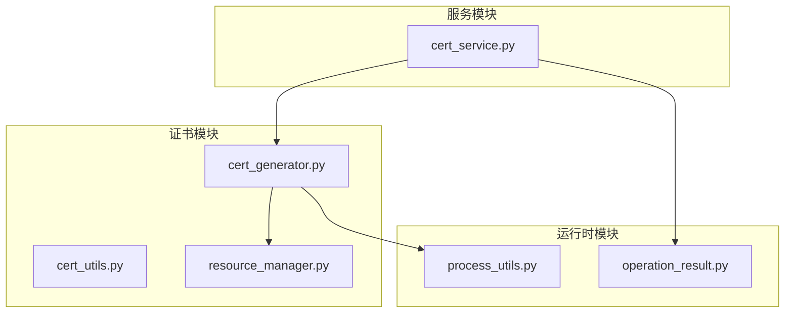
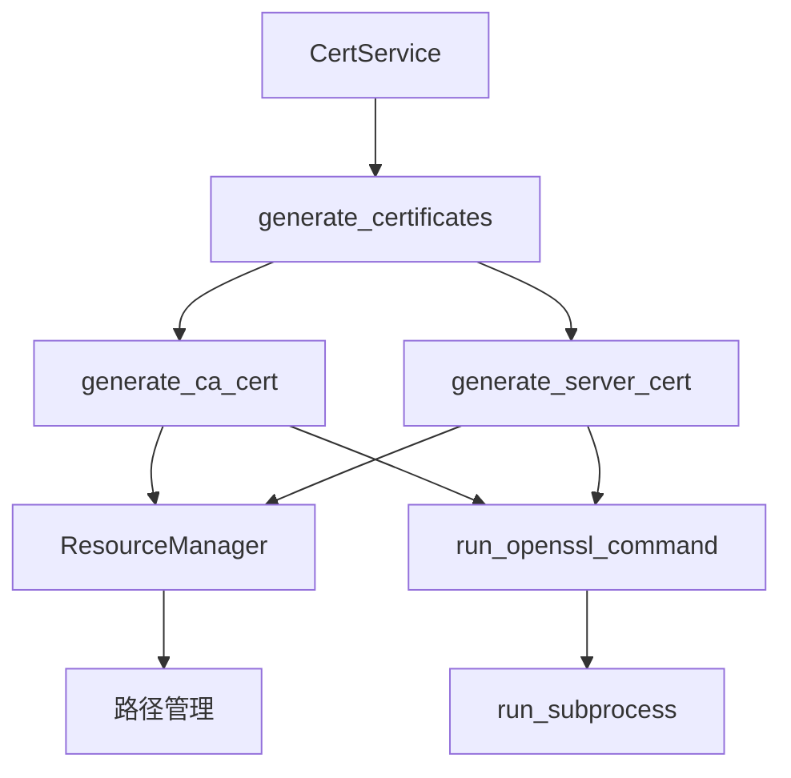
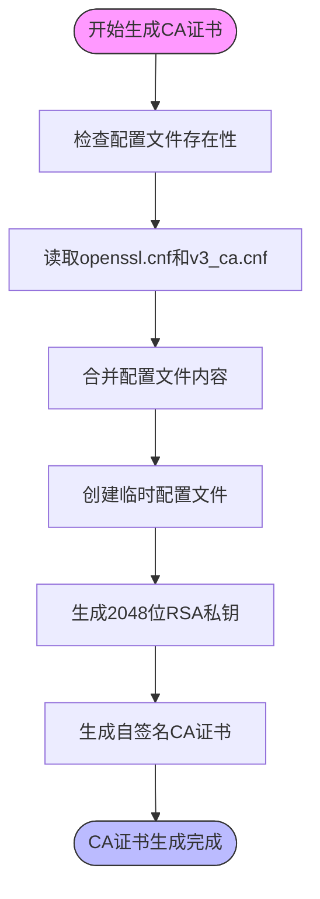
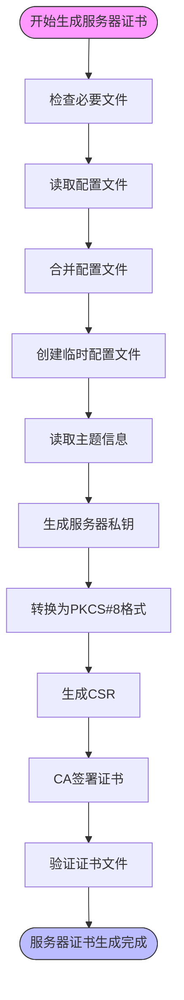
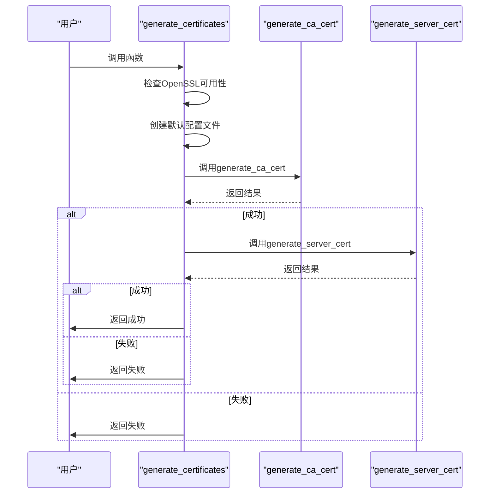
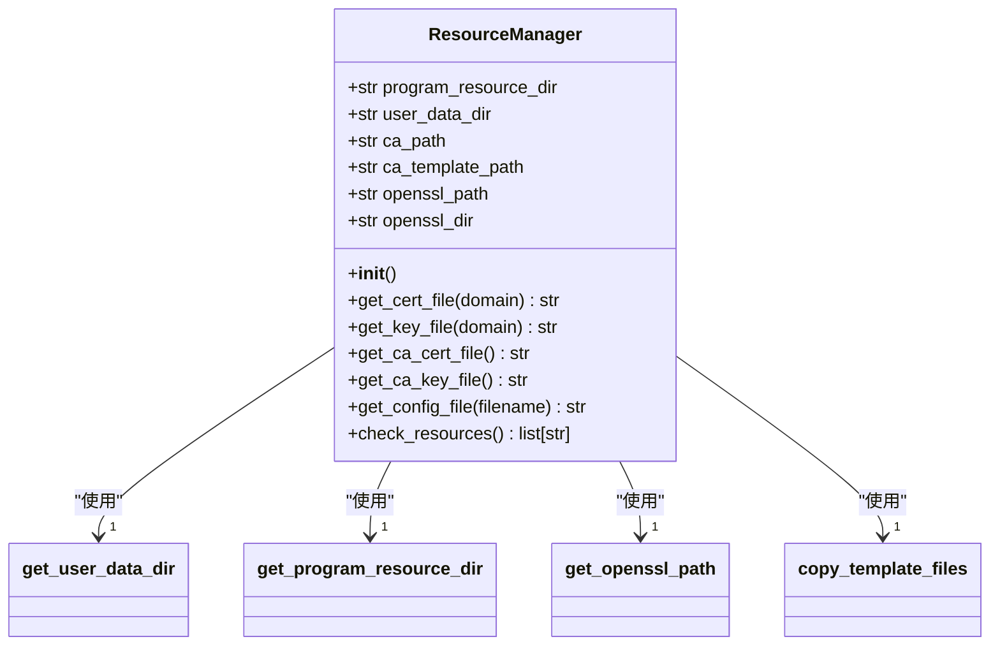
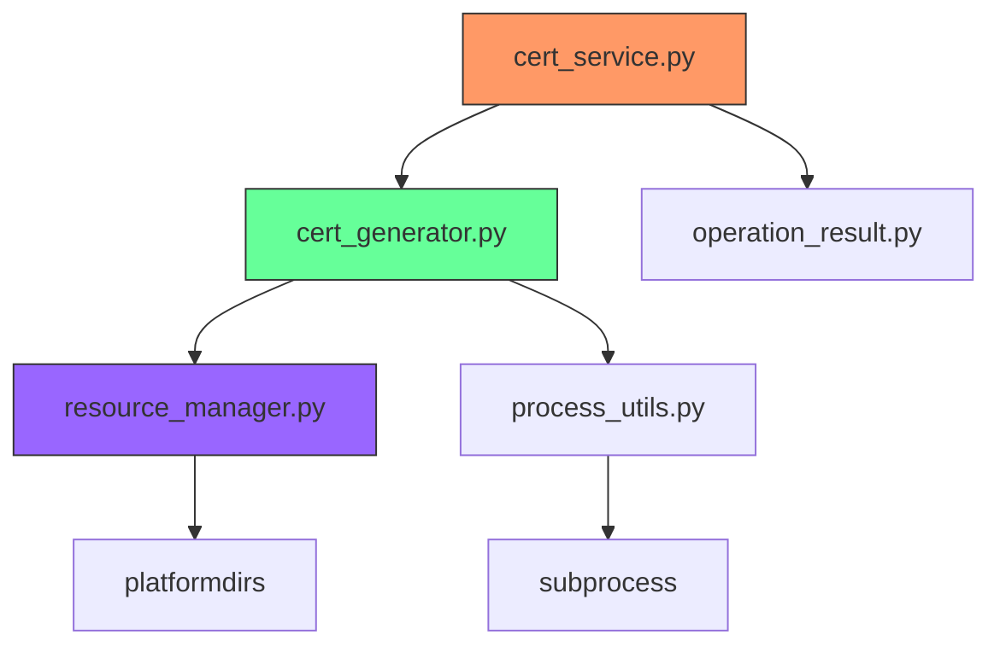
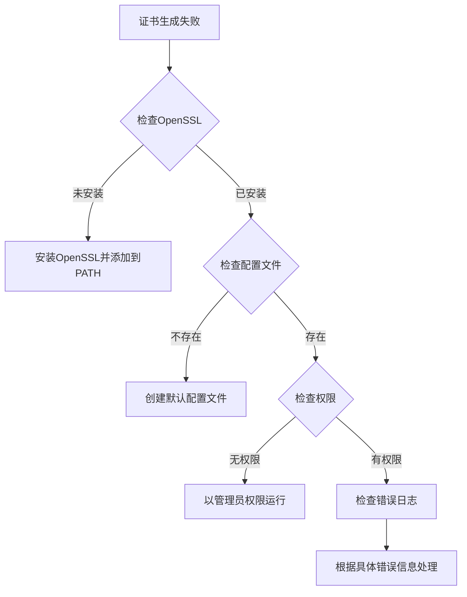

# 证书生成API

<cite>
**本文档引用的文件**  
- [cert_generator.py](file://modules/cert/cert_generator.py)
- [resource_manager.py](file://modules/runtime/resource_manager.py)
- [cert_service.py](file://modules/services/cert_service.py)
- [operation_result.py](file://modules/runtime/operation_result.py)
- [process_utils.py](file://modules/runtime/process_utils.py)
- [openssl.cnf](file://ca/openssl.cnf)
- [v3_ca.cnf](file://ca/v3_ca.cnf)
- [v3_req.cnf](file://ca/v3_req.cnf)
- [api.openai.com.cnf](file://ca/api.openai.com.cnf)
- [api.openai.com.subj](file://ca/api.openai.com.subj)
- [genca.sh](file://ca/genca.sh)
- [gencrt.sh](file://ca/gencrt.sh)
</cite>

## 目录
1. [简介](#简介)
2. [项目结构](#项目结构)
3. [核心组件](#核心组件)
4. [架构概述](#架构概述)
5. [详细组件分析](#详细组件分析)
6. [依赖分析](#依赖分析)
7. [性能考虑](#性能考虑)
8. [故障排除指南](#故障排除指南)
9. [结论](#结论)

## 简介
本文档详细说明了证书生成API的技术实现，重点介绍`cert_generator.py`模块中的`generate_ca_cert`、`generate_server_cert`和`generate_certificates`函数。文档涵盖了从OpenSSL命令执行到证书路径管理的完整技术细节，包括配置文件合并、私钥生成、证书签名请求流程以及跨平台兼容性处理。

## 项目结构
证书生成功能分布在多个模块中，核心逻辑位于`modules/cert`目录下，资源管理由`modules/runtime`提供支持，服务封装在`modules/services`中。

**图示来源**  
- [cert_generator.py](file://modules/cert/cert_generator.py#L1-L446)
- [resource_manager.py](file://modules/runtime/resource_manager.py#L1-L294)
- [cert_service.py](file://modules/services/cert_service.py#L1-L38)

## 核心组件
证书生成系统由三个核心函数构成：`generate_ca_cert`用于生成自签名CA证书，`generate_server_cert`为指定域名生成服务器证书，`generate_certificates`提供一键生成流程。这些函数通过`ResourceManager`管理证书路径，并使用`OperationResult`封装执行结果。

**章节来源**  
- [cert_generator.py](file://modules/cert/cert_generator.py#L125-L446)
- [cert_service.py](file://modules/services/cert_service.py#L10-L17)

## 架构概述
系统采用分层架构设计，上层服务通过封装调用底层证书生成函数，中间层资源管理器处理路径和环境问题，底层工具函数负责具体的OpenSSL命令执行和结果处理。

**图示来源**  
- [cert_service.py](file://modules/services/cert_service.py#L10-L17)
- [cert_generator.py](file://modules/cert/cert_generator.py#L386-L446)
- [resource_manager.py](file://modules/runtime/resource_manager.py#L201-L294)

## 详细组件分析

### generate_ca_cert函数分析
`generate_ca_cert`函数通过OpenSSL生成自签名CA证书，包含配置文件合并、私钥生成和证书请求三个主要步骤。

**图示来源**  
- [cert_generator.py](file://modules/cert/cert_generator.py#L125-L203)
- [openssl.cnf](file://ca/openssl.cnf#L1-L24)
- [v3_ca.cnf](file://ca/v3_ca.cnf#L1-L7)

### generate_server_cert函数分析
`generate_server_cert`函数为指定域名生成服务器证书，涵盖CSR创建、PKCS#8私钥转换、CA签名及文件验证等完整流程。

**图示来源**  
- [cert_generator.py](file://modules/cert/cert_generator.py#L206-L384)
- [gencrt.sh](file://ca/gencrt.sh#L1-L104)
- [api.openai.com.cnf](file://ca/api.openai.com.cnf#L1-L3)

### generate_certificates函数分析
`generate_certificates`函数实现一键生成流程，按照特定顺序调用CA证书和服务器证书生成函数，并处理错误传播。

**图示来源**  
- [cert_generator.py](file://modules/cert/cert_generator.py#L386-L446)
- [generate_certs.py](file://archive/generate_certs.py#L327-L366)

### Resource Manager分析
`ResourceManager`在证书路径管理中起核心作用，处理开发环境和打包环境的资源路径问题，并支持单文件模式的用户数据持久化。

**图示来源**  
- [resource_manager.py](file://modules/runtime/resource_manager.py#L201-L294)
- [cert_generator.py](file://modules/cert/cert_generator.py#L125-L446)

## 依赖分析
证书生成系统依赖多个模块协同工作，形成清晰的依赖链。

**图示来源**  
- [cert_service.py](file://modules/services/cert_service.py#L3-L7)
- [cert_generator.py](file://modules/cert/cert_generator.py#L10-L11)
- [resource_manager.py](file://modules/runtime/resource_manager.py#L12)
- [process_utils.py](file://modules/runtime/process_utils.py#L11)

**章节来源**  
- [cert_service.py](file://modules/services/cert_service.py#L1-L38)
- [cert_generator.py](file://modules/cert/cert_generator.py#L1-L446)
- [resource_manager.py](file://modules/runtime/resource_manager.py#L1-L294)

## 性能考虑
证书生成操作主要受OpenSSL命令执行性能影响，系统通过以下方式优化性能：
- 使用临时文件减少磁盘I/O
- 合并配置文件减少文件操作次数
- 并行处理证书生成步骤
- 缓存资源路径信息

## 故障排除指南
常见问题及解决方案：

**章节来源**  
- [cert_generator.py](file://modules/cert/cert_generator.py#L404-L417)
- [resource_manager.py](file://modules/runtime/resource_manager.py#L259-L294)

## 结论
证书生成API提供了一套完整的解决方案，通过模块化设计实现了CA证书和服务器证书的自动化生成。系统具有良好的跨平台兼容性，支持Windows、macOS和Linux环境，并通过`ResourceManager`有效管理资源路径。`OperationResult`封装模式提供了统一的错误处理机制，使调用者能够方便地处理各种执行结果。