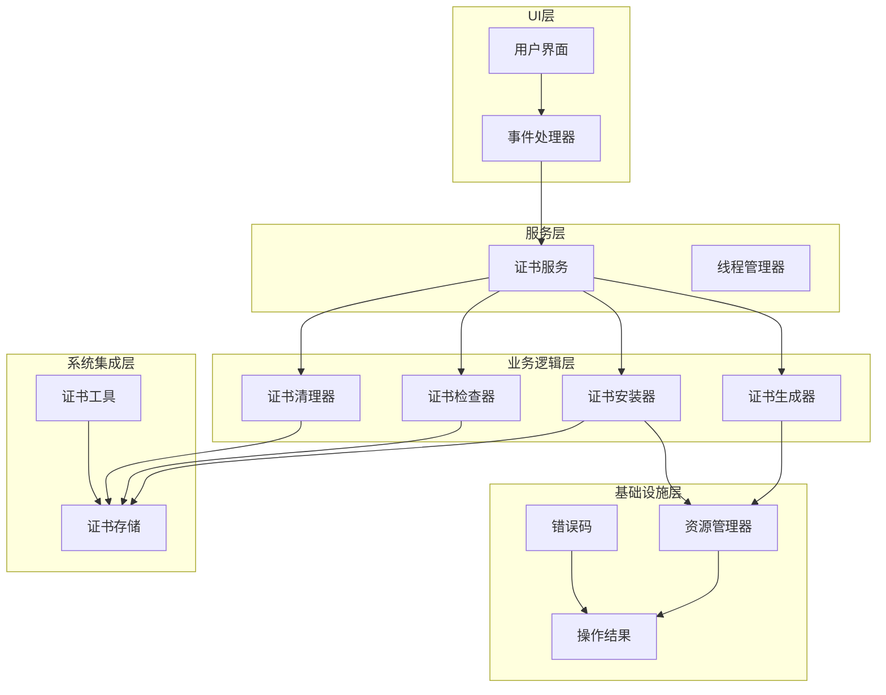
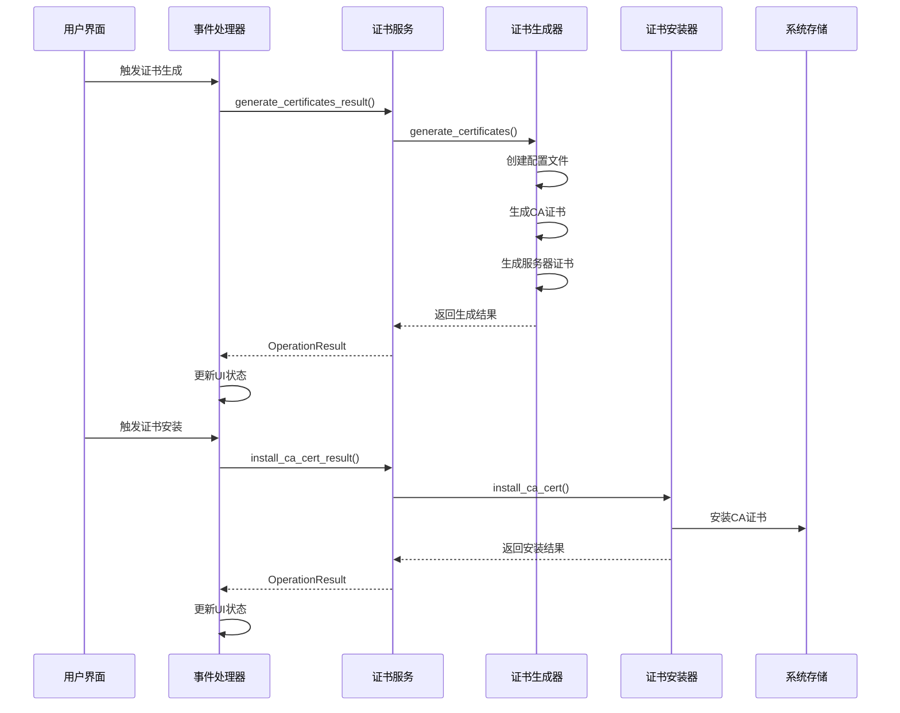
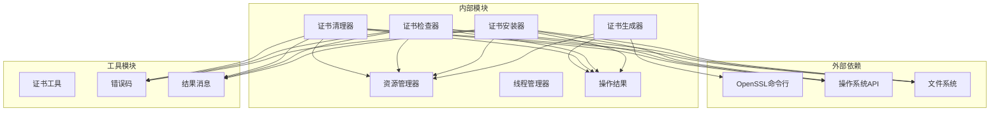

# 证书管理API

<cite>
**本文档引用的文件**
- [modules/cert/cert_generator.py](file://modules/cert/cert_generator.py)
- [modules/services/cert_service.py](file://modules/services/cert_service.py)
- [modules/actions/cert_actions.py](file://modules/actions/cert_actions.py)
- [modules/cert/cert_installer.py](file://modules/cert/cert_installer.py)
- [modules/cert/cert_cleaner.py](file://modules/cert/cert_cleaner.py)
- [modules/cert/cert_checker.py](file://modules/cert/cert_checker.py)
- [modules/cert/ca_store.py](file://modules/cert/ca_store.py)
- [modules/cert/cert_utils.py](file://modules/cert/cert_utils.py)
- [modules/runtime/resource_manager.py](file://modules/runtime/resource_manager.py)
- [modules/runtime/thread_manager.py](file://modules/runtime/thread_manager.py)
- [modules/runtime/operation_result.py](file://modules/runtime/operation_result.py)
- [modules/runtime/error_codes.py](file://modules/runtime/error_codes.py)
- [modules/runtime/result_messages.py](file://modules/runtime/result_messages.py)
</cite>

## 目录
1. [简介](#简介)
2. [项目结构](#项目结构)
3. [核心组件](#核心组件)
4. [架构概览](#架构概览)
5. [详细组件分析](#详细组件分析)
6. [依赖关系分析](#依赖关系分析)
7. [性能考虑](#性能考虑)
8. [故障排除指南](#故障排除指南)
9. [结论](#结论)

## 简介

本文件提供了ModelRelay项目中证书管理系统的完整API文档。该系统实现了基于OpenSSL的证书生成、安装、验证和清理功能，支持Windows、macOS和Linux三大平台。文档重点涵盖了以下核心功能：

- **证书生成**：通过OpenSSL命令生成CA证书和服务器证书
- **证书安装**：将CA证书安装到系统信任存储中
- **证书验证**：检查系统中是否存在指定的CA证书
- **证书清理**：从系统信任存储中移除CA证书
- **UI事件处理**：提供完整的UI事件处理器实现

## 项目结构

证书管理系统采用分层架构设计，主要包含以下层次：

**图表来源**
- [modules/actions/cert_actions.py](file://modules/actions/cert_actions.py#L1-L66)
- [modules/services/cert_service.py](file://modules/services/cert_service.py#L1-L38)
- [modules/cert/cert_generator.py](file://modules/cert/cert_generator.py#L1-L446)

**章节来源**
- [modules/cert/cert_generator.py](file://modules/cert/cert_generator.py#L1-L446)
- [modules/services/cert_service.py](file://modules/services/cert_service.py#L1-L38)
- [modules/actions/cert_actions.py](file://modules/actions/cert_actions.py#L1-L66)

## 核心组件

### 证书生成器 (CertGenerator)

证书生成器负责通过OpenSSL命令生成CA证书和服务器证书，支持一键生成完整证书链。

**主要功能**：
- 生成CA私钥和证书
- 生成服务器私钥和证书
- 自动配置OpenSSL环境
- 处理跨平台兼容性

**关键特性**：
- 支持Windows、macOS和Linux平台
- 自动创建必要的配置文件
- 处理OpenSSL版本差异
- 提供详细的日志输出

**章节来源**
- [modules/cert/cert_generator.py](file://modules/cert/cert_generator.py#L125-L203)
- [modules/cert/cert_generator.py](file://modules/cert/cert_generator.py#L206-L383)
- [modules/cert/cert_generator.py](file://modules/cert/cert_generator.py#L386-L445)

### 证书服务 (CertService)

证书服务提供统一的证书管理接口，封装了底层的证书操作逻辑。

**核心方法**：
- `generate_certificates_result()`: 生成证书并返回操作结果
- `has_existing_ca_cert_result()`: 检查CA证书是否存在
- `install_ca_cert_result()`: 安装CA证书并返回结果
- `clear_ca_cert_result()`: 清理CA证书并返回结果

**章节来源**
- [modules/services/cert_service.py](file://modules/services/cert_service.py#L10-L17)
- [modules/services/cert_service.py](file://modules/services/cert_service.py#L20-L25)

### UI事件处理器 (CertActions)

UI事件处理器负责响应用户界面的证书相关操作，提供线程安全的异步处理。

**主要处理器**：
- `run_generate_certificates()`: 处理证书生成请求
- `run_install_ca_cert()`: 处理CA证书安装请求
- `run_clear_ca_cert()`: 处理CA证书清理请求

**章节来源**
- [modules/actions/cert_actions.py](file://modules/actions/cert_actions.py#L9-L27)
- [modules/actions/cert_actions.py](file://modules/actions/cert_actions.py#L30-L44)
- [modules/actions/cert_actions.py](file://modules/actions/cert_actions.py#L47-L65)

## 架构概览

证书管理系统采用清晰的分层架构，确保了良好的可维护性和扩展性：

**图表来源**
- [modules/actions/cert_actions.py](file://modules/actions/cert_actions.py#L9-L27)
- [modules/services/cert_service.py](file://modules/services/cert_service.py#L10-L17)
- [modules/cert/cert_generator.py](file://modules/cert/cert_generator.py#L386-L445)

## 详细组件分析

### 证书生成器详细分析

#### generate_ca_cert 函数

该函数负责生成CA证书和私钥，是整个证书生成流程的核心。

**参数说明**：
- `resource_manager`: 资源管理器实例
- `log_func`: 日志输出函数，默认使用print
- `ca_common_name`: CA证书的通用名称，默认为"MTGA_CA"

**处理流程**：
1. 验证配置文件存在性
2. 合并OpenSSL配置文件
3. 生成2048位RSA私钥
4. 使用私钥生成自签名CA证书
5. 设置证书有效期为10年

**错误处理**：
- 配置文件缺失时返回False
- OpenSSL命令执行失败时记录错误
- 文件权限问题进行特殊处理

**章节来源**
- [modules/cert/cert_generator.py](file://modules/cert/cert_generator.py#L125-L203)

#### generate_server_cert 函数

该函数负责生成服务器证书，包括私钥生成、CSR创建和CA签名。

**参数说明**：
- `resource_manager`: 资源管理器实例
- `domain`: 服务器域名，默认为"api.openai.com"

**处理流程**：
1. 检查必需文件存在性
2. 生成2048位RSA私钥
3. 转换为PKCS#8格式
4. 生成证书签名请求(CSR)
5. 使用CA证书签名生成服务器证书

**关键特性**：
- 自动处理LibreSSL的序列号文件问题
- 验证生成的证书文件有效性
- 支持多种域名配置

**章节来源**
- [modules/cert/cert_generator.py](file://modules/cert/cert_generator.py#L206-L383)

#### generate_certificates 函数

一键生成函数，整合了CA证书和服务器证书的生成过程。

**处理流程**：
1. 检测OpenSSL可用性
2. 创建默认配置文件
3. 调用generate_ca_cert()
4. 调用generate_server_cert()
5. 输出生成结果摘要

**章节来源**
- [modules/cert/cert_generator.py](file://modules/cert/cert_generator.py#L386-L445)

### 证书安装器详细分析

#### install_ca_cert_result 函数

该函数负责将CA证书安装到系统信任存储中，支持多平台。

**参数说明**：
- `log_func`: 日志输出函数

**处理流程**：
1. 查找可用的CA证书文件
2. 根据操作系统选择安装方式
3. 执行平台特定的安装命令
4. 返回OperationResult结果

**平台支持**：
- **Windows**: 使用certutil命令安装到Root存储
- **macOS**: 使用security命令安装到System.keychain
- **Linux**: 复制到/usr/local/share/ca-certificates/并执行update-ca-certificates

**章节来源**
- [modules/cert/cert_installer.py](file://modules/cert/cert_installer.py#L15-L47)

### 证书检查器详细分析

#### check_existing_ca_cert 函数

该函数负责检查系统中是否存在指定的CA证书。

**处理流程**：
1. 根据操作系统选择检查方式
2. 读取系统证书存储
3. 解析证书信息
4. 过滤匹配的证书
5. 返回检查结果

**章节来源**
- [modules/cert/cert_checker.py](file://modules/cert/cert_checker.py#L11-L13)

### 证书清理器详细分析

#### clear_ca_cert_result 函数

该函数负责从系统信任存储中移除指定的CA证书。

**处理流程**：
1. 根据操作系统选择清理方式
2. 查找匹配的证书
3. 执行删除操作
4. 返回清理结果

**章节来源**
- [modules/cert/cert_cleaner.py](file://modules/cert/cert_cleaner.py#L12-L14)

### 系统存储管理器详细分析

#### ca_store 模块

ca_store模块提供了跨平台的证书存储管理功能。

**核心功能**：
- `check_ca_cert()`: 检查CA证书存在性
- `install_ca_cert_file()`: 安装CA证书文件
- `clear_ca_cert_store()`: 清理CA证书存储

**平台特定实现**：
- **Windows**: 使用certutil命令管理证书存储
- **macOS**: 使用security命令管理钥匙串
- **Linux**: 复制证书文件并更新系统证书数据库

**章节来源**
- [modules/cert/ca_store.py](file://modules/cert/ca_store.py#L14-L52)

## 依赖关系分析

证书管理系统具有清晰的依赖关系，遵循单一职责原则：

**图表来源**
- [modules/cert/cert_generator.py](file://modules/cert/cert_generator.py#L10-L11)
- [modules/cert/ca_store.py](file://modules/cert/ca_store.py#L5-L9)

**章节来源**
- [modules/cert/cert_generator.py](file://modules/cert/cert_generator.py#L1-L446)
- [modules/cert/ca_store.py](file://modules/cert/ca_store.py#L1-L304)

## 性能考虑

### 线程安全性

证书管理系统采用了多层线程安全保护：

1. **线程管理器保护**：使用ThreadManager确保同一类型任务的互斥执行
2. **资源锁保护**：每个任务名称对应独立的锁，避免全局锁竞争
3. **原子操作**：关键操作使用with语句确保资源正确释放

### 资源管理策略

1. **临时文件管理**：使用atexit注册自动清理临时配置文件
2. **内存管理**：及时释放大对象引用，避免内存泄漏
3. **文件句柄管理**：确保所有打开的文件句柄正确关闭

### 性能优化

1. **延迟初始化**：资源管理器按需初始化，减少启动时间
2. **缓存机制**：避免重复的系统调用和文件检查
3. **批量操作**：支持多个证书的批量处理

## 故障排除指南

### 常见错误码

| 错误码 | 描述 | 可能原因 | 解决方案 |
|--------|------|----------|----------|
| `FILE_NOT_FOUND` | 文件不存在 | OpenSSL路径错误或配置文件缺失 | 检查OpenSSL安装和配置文件路径 |
| `PERMISSION_DENIED` | 权限不足 | 缺少管理员权限 | 以管理员身份运行或检查文件权限 |
| `CONFIG_INVALID` | 配置无效 | OpenSSL配置文件损坏 | 重新生成配置文件或检查语法 |
| `NETWORK_ERROR` | 网络异常 | 系统网络问题 | 检查网络连接和防火墙设置 |
| `REMOTE_ERROR` | 远程服务异常 | 系统服务不可用 | 重启相关系统服务或检查服务状态 |

### 错误处理机制

1. **OperationResult模式**：所有操作都返回标准化的结果对象
2. **详细日志记录**：每个步骤都有详细的日志输出
3. **降级处理**：某些错误可以进行降级处理而不中断整体流程
4. **错误码映射**：将具体错误映射到标准错误码

### 常见问题解决

**OpenSSL找不到**：
- 检查OpenSSL是否正确安装
- 验证PATH环境变量包含OpenSSL路径
- 在Windows环境下使用内置的openssl.exe

**证书安装失败**：
- 确认有足够的管理员权限
- 检查系统防火墙设置
- 重启系统后重试

**证书验证失败**：
- 检查证书链完整性
- 验证证书有效期
- 确认系统时间正确

**章节来源**
- [modules/runtime/error_codes.py](file://modules/runtime/error_codes.py#L6-L17)
- [modules/runtime/result_messages.py](file://modules/runtime/result_messages.py#L6-L25)

## 结论

ModelRelay的证书管理系统是一个设计良好、功能完整的解决方案，具有以下特点：

1. **架构清晰**：采用分层架构，职责分离明确
2. **平台兼容**：支持Windows、macOS和Linux三大平台
3. **错误处理完善**：提供全面的错误处理和恢复机制
4. **用户体验友好**：提供详细的日志输出和状态反馈
5. **安全性保证**：采用多层安全保护措施

该系统为开发者提供了完整的证书管理API，可以轻松集成到各种应用场景中。通过标准化的接口设计和完善的错误处理机制，确保了系统的稳定性和可靠性。