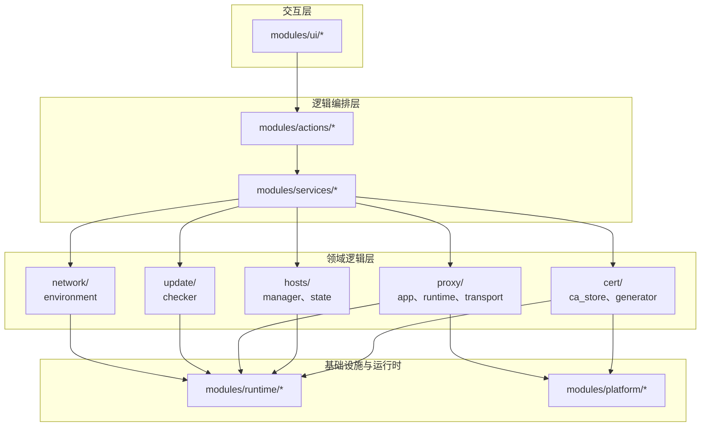
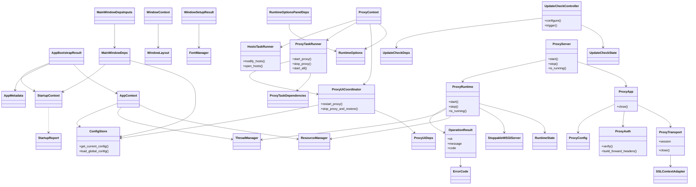
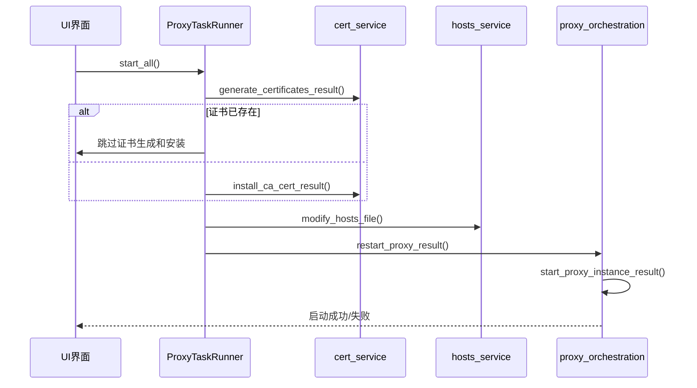
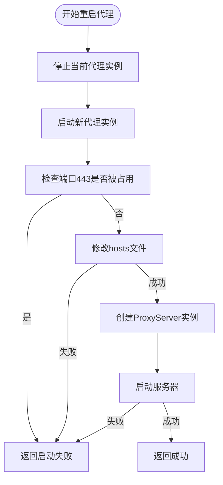
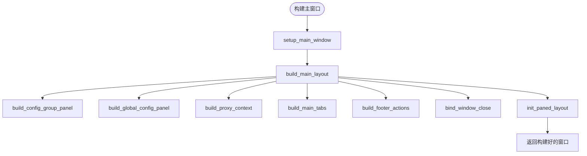
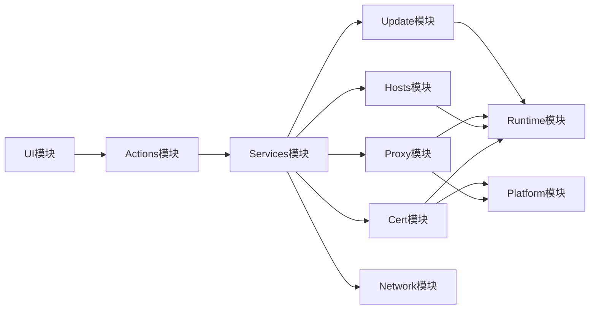

# 开发者指南

<cite>
**本文档引用的文件**  
- [mtga_gui.py](file://mtga_gui.py)
- [proxy_actions.py](file://modules/actions/proxy_actions.py)
- [cert_actions.py](file://modules/actions/cert_actions.py)
- [hosts_actions.py](file://modules/actions/hosts_actions.py)
- [proxy_ui_coordinator.py](file://modules/actions/proxy_ui_coordinator.py)
- [proxy_orchestration.py](file://modules/services/proxy_orchestration.py)
- [cert_service.py](file://modules/services/cert_service.py)
- [hosts_service.py](file://modules/services/hosts_service.py)
- [main_window_builder.py](file://modules/ui/main_window_builder.py)
- [macos_theme.py](file://modules/ui/macos_theme.py)
- [layout_builders.py](file://modules/ui/layout_builders.py)
- [window_setup.py](file://modules/ui/window_setup.py)
- [tk_fonts.py](file://modules/ui/tk_fonts.py)
- [AGENTS.md](file://AGENTS.md)
- [CLAUDE.md](file://CLAUDE.md)
</cite>

## 目录
1. [简介](#简介)
2. [项目结构](#项目结构)
3. [核心组件](#核心组件)
4. [架构概述](#架构概述)
5. [详细组件分析](#详细组件分析)
6. [依赖分析](#依赖分析)
7. [性能考虑](#性能考虑)
8. [故障排除指南](#故障排除指南)
9. [结论](#结论)
10. [附录](#附录)（如有必要）

## 简介
本指南为希望贡献代码或进行二次开发的用户提供深入的技术指导。文档将解析 `actions` 模块如何响应 UI 事件并协调多个服务调用，说明典型动作链（如“启动代理”动作触发证书检查→Hosts修改→代理启动）的执行流程。阐述 `services` 模块作为业务逻辑中枢的角色，解释服务间依赖关系和生命周期管理。分析 `ui` 模块的窗口构建机制、主题适配（如macOS深色模式）和Tkinter组件封装模式。指导如何添加新的服务商支持（如新增DeepSeek配置模板），包括创建.cnf/.subj文件、扩展证书生成逻辑和更新UI选项。说明测试策略和代码风格规范，并引用AGENTS.md和CLAUDE.md中的AI代理协作实践。

## 项目结构
本项目采用分层领域驱动架构，严格遵循依赖约束规则。主要模块包括 `actions`、`services`、`cert`、`hosts`、`proxy`、`ui` 等，各模块职责清晰，耦合度低。

**图示来源**
- [ARCHITECTURE.md](file://docs/ARCHITECTURE.md)

**本节来源**
- [README.md](file://README.md)
- [docs/ARCHITECTURE.md](file://docs/ARCHITECTURE.md)

## 核心组件
本项目的核心组件包括 `actions`、`services` 和 `ui` 模块。`actions` 模块负责响应 UI 事件并协调服务调用；`services` 模块封装核心业务逻辑，作为系统中枢；`ui` 模块负责构建用户界面，提供良好的用户体验。

**本节来源**
- [modules/actions/__init__.py](file://modules/actions/__init__.py)
- [modules/services/__init__.py](file://modules/services/__init__.py)
- [modules/ui/__init__.py](file://modules/ui/__init__.py)

## 架构概述
系统采用分层架构，从上至下分为交互层、逻辑编排层、领域逻辑层和基础设施层。UI 层通过 actions 模块与 services 模块交互，services 模块再调用领域模块完成具体业务逻辑。

**图示来源**
- [docs/ARCHITECTURE.md](file://docs/ARCHITECTURE.md)

## 详细组件分析
本节将深入分析 `actions`、`services` 和 `ui` 模块的关键组件，揭示其内部实现机制和协作方式。

### actions模块分析
`actions` 模块负责响应 UI 事件并协调服务调用。`proxy_actions.py` 文件中的 `ProxyTaskRunner` 类实现了“一键启动全部服务”的核心逻辑，按顺序执行证书生成、CA证书安装、hosts文件修改和代理服务器启动等操作。

**图示来源**
- [modules/actions/proxy_actions.py](file://modules/actions/proxy_actions.py)
- [modules/services/cert_service.py](file://modules/services/cert_service.py)
- [modules/services/hosts_service.py](file://modules/services/hosts_service.py)
- [modules/services/proxy_orchestration.py](file://modules/services/proxy_orchestration.py)

**本节来源**
- [modules/actions/proxy_actions.py](file://modules/actions/proxy_actions.py)
- [modules/actions/cert_actions.py](file://modules/actions/cert_actions.py)
- [modules/actions/hosts_actions.py](file://modules/actions/hosts_actions.py)
- [modules/actions/proxy_ui_coordinator.py](file://modules/actions/proxy_ui_coordinator.py)

### services模块分析
`services` 模块是系统的业务逻辑中枢，封装了核心功能。`proxy_orchestration.py` 文件中的 `restart_proxy_result` 函数协调了代理服务器的重启流程，包括停止旧实例和启动新实例。

**图示来源**
- [modules/services/proxy_orchestration.py](file://modules/services/proxy_orchestration.py)

**本节来源**
- [modules/services/proxy_orchestration.py](file://modules/services/proxy_orchestration.py)
- [modules/services/cert_service.py](file://modules/services/cert_service.py)
- [modules/services/hosts_service.py](file://modules/services/hosts_service.py)

### ui模块分析
`ui` 模块负责构建用户界面，采用模块化设计。`main_window_builder.py` 文件中的 `build_main_window` 函数负责组装主窗口，调用各个子模块构建不同区域。

**图示来源**
- [modules/ui/main_window_builder.py](file://modules/ui/main_window_builder.py)

**本节来源**
- [modules/ui/main_window_builder.py](file://modules/ui/main_window_builder.py)
- [modules/ui/macos_theme.py](file://modules/ui/macos_theme.py)
- [modules/ui/layout_builders.py](file://modules/ui/layout_builders.py)
- [modules/ui/window_setup.py](file://modules/ui/window_setup.py)
- [modules/ui/tk_fonts.py](file://modules/ui/tk_fonts.py)

## 依赖分析
系统各模块之间存在明确的依赖关系，遵循从上至下的单向依赖原则。UI 层只依赖 actions 层，actions 层依赖 services 层，services 层依赖领域模块。

**图示来源**
- [docs/ARCHITECTURE.md](file://docs/ARCHITECTURE.md)

**本节来源**
- [docs/ARCHITECTURE.md](file://docs/ARCHITECTURE.md)
- [README.md](file://README.md)

## 性能考虑
系统在设计时考虑了性能因素，如使用线程管理器处理耗时操作，避免阻塞UI线程。证书生成、hosts文件修改等操作均在后台线程执行，确保界面响应流畅。

## 故障排除指南
当遇到问题时，可参考以下步骤进行排查：
1. 检查日志输出，定位错误信息
2. 确认端口443未被其他程序占用
3. 检查hosts文件是否正确修改
4. 确认CA证书已正确安装并受信任

**本节来源**
- [README.md](file://README.md)
- [modules/runtime/result_messages.py](file://modules/runtime/result_messages.py)

## 结论
本项目采用清晰的分层架构，各模块职责明确，易于维护和扩展。通过深入理解 `actions`、`services` 和 `ui` 模块的协作机制，开发者可以高效地进行二次开发和功能扩展。

## 附录
- [AGENTS.md](file://AGENTS.md)：AI代理协作实践
- [CLAUDE.md](file://CLAUDE.md)：Claude模型集成指南