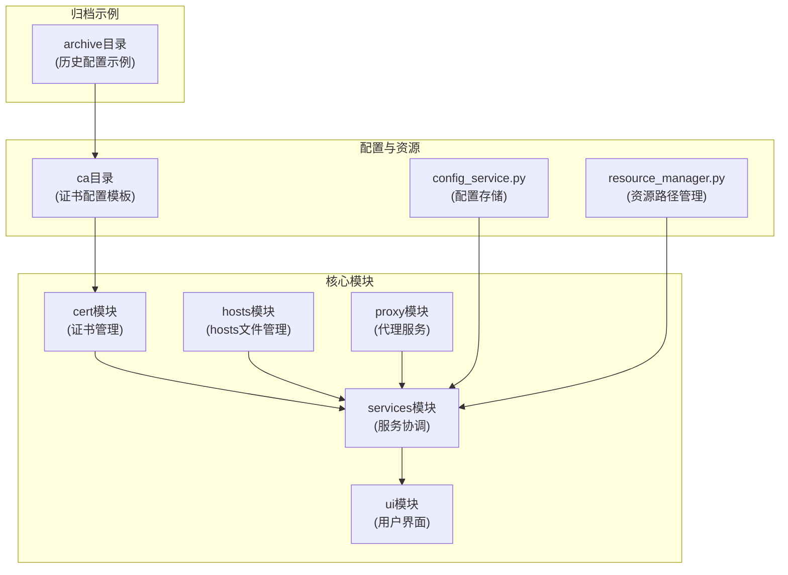
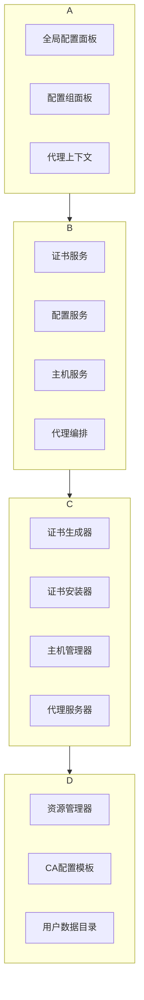
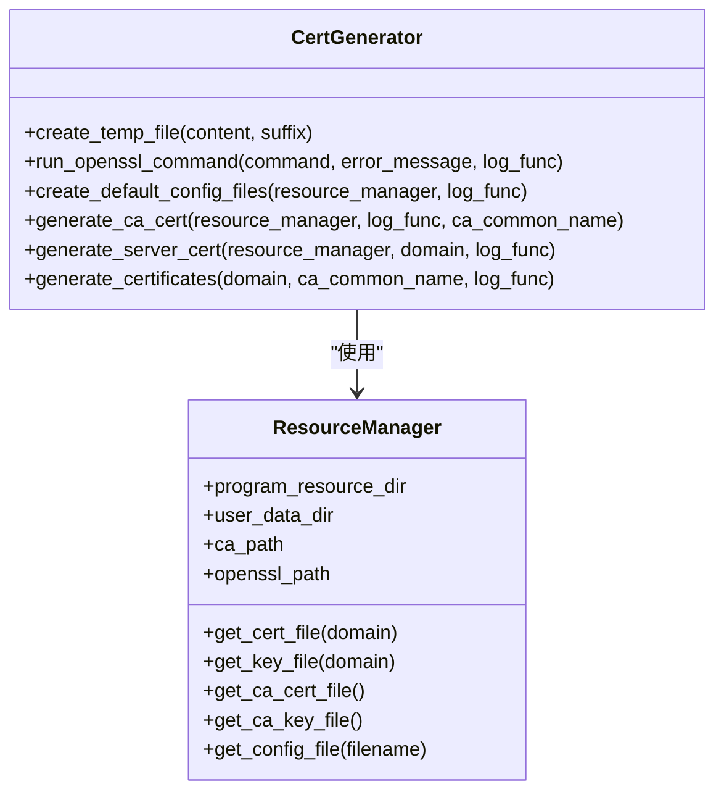
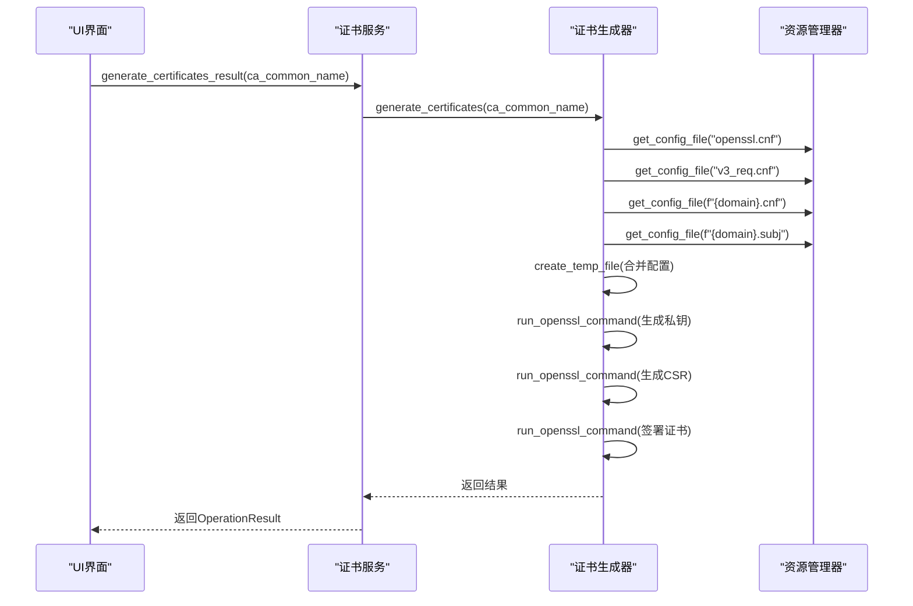
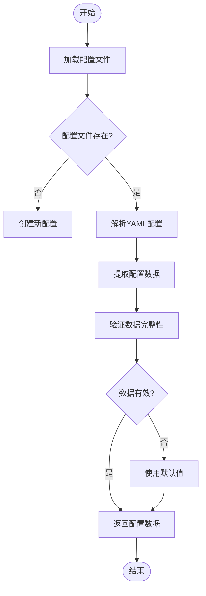
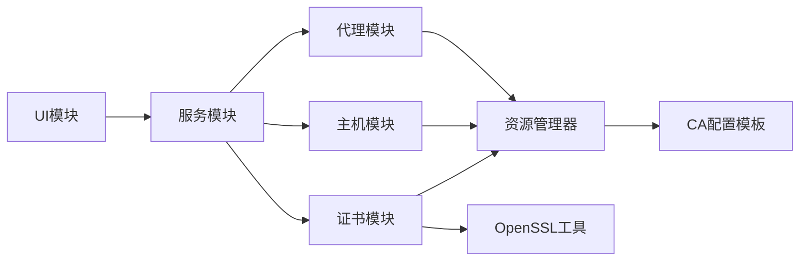

# 扩展开发

<cite>
**本文档引用的文件**   
- [cert_generator.py](file://modules/cert/cert_generator.py)
- [cert_service.py](file://modules/services/cert_service.py)
- [resource_manager.py](file://modules/runtime/resource_manager.py)
- [global_config_panel.py](file://modules/ui/global_config_panel.py)
- [config_service.py](file://modules/services/config_service.py)
- [ca](file://ca)
- [api.deepseek.com.cnf](file://archive/api.deepseek.com.cnf)
- [api.deepseek.com.subj](file://archive/api.deepseek.com.subj)
</cite>

## 目录
1. [简介](#简介)
2. [项目结构](#项目结构)
3. [核心组件](#核心组件)
4. [架构概述](#架构概述)
5. [详细组件分析](#详细组件分析)
6. [依赖分析](#依赖分析)
7. [性能考虑](#性能考虑)
8. [故障排除指南](#故障排除指南)
9. [结论](#结论)
10. [附录](#附录)（如有必要）

## 简介
本文档旨在指导开发者如何为新AI服务商添加支持。详细说明了扩展流程，包括在ca/目录下创建新的.cnf和.subj配置文件，定义目标域名的证书生成参数；修改cert_generator.py中的证书生成逻辑以包含新服务商；更新cert_service.py中的证书管理策略；在UI配置面板中添加新的服务商选项。通过DeepSeek（api.deepseek.com）作为具体示例，展示从配置文件创建到UI集成的完整过程。同时，说明了扩展时需要考虑的兼容性问题，如证书主题字段格式、域名解析规则、HTTPS协议版本支持等，并强调了安全实践，避免私钥泄露和配置错误。最后，提供了验证新服务商集成的测试方法和调试技巧。

## 项目结构
本项目采用模块化设计，主要分为以下几个部分：archive、ca、docs、mac、modules、tests等。其中，ca目录存放了所有与证书生成相关的配置文件和脚本，是扩展新AI服务商的关键所在。modules目录包含了应用程序的核心功能模块，如cert、hosts、network、proxy等，每个模块都有其特定的功能和职责。



**图示来源**
- [ca](file://ca)
- [cert_generator.py](file://modules/cert/cert_generator.py)
- [resource_manager.py](file://modules/runtime/resource_manager.py)

**本节来源**
- [ca](file://ca)
- [modules](file://modules)

## 核心组件
系统的核心组件包括证书生成器（cert_generator.py）、证书服务（cert_service.py）、资源管理器（resource_manager.py）和UI配置面板（global_config_panel.py）。这些组件协同工作，实现了从证书生成到UI展示的完整流程。证书生成器负责根据配置文件生成自签名证书，证书服务封装了证书生成和管理的业务逻辑，资源管理器统一管理程序资源和用户数据的路径，而UI配置面板则提供了用户友好的界面来配置和管理这些设置。

**本节来源**
- [cert_generator.py](file://modules/cert/cert_generator.py)
- [cert_service.py](file://modules/services/cert_service.py)
- [resource_manager.py](file://modules/runtime/resource_manager.py)
- [global_config_panel.py](file://modules/ui/global_config_panel.py)

## 架构概述
系统的整体架构遵循分层设计原则，从底层的资源管理到上层的用户界面，各层之间通过明确定义的接口进行通信。最底层是资源管理层，负责处理开发环境和打包环境的资源路径问题；中间层是服务协调层，整合了证书、hosts、代理等核心功能；最上层是用户界面层，提供直观的操作界面。这种分层架构确保了系统的可维护性和可扩展性。



**图示来源**
- [cert_service.py](file://modules/services/cert_service.py)
- [config_service.py](file://modules/services/config_service.py)
- [cert_generator.py](file://modules/cert/cert_generator.py)
- [resource_manager.py](file://modules/runtime/resource_manager.py)

## 详细组件分析
### 证书生成器分析
证书生成器模块（cert_generator.py）是整个系统的核心，负责生成自签名CA证书和服务器证书。它通过读取配置文件，调用OpenSSL命令行工具来完成证书的生成。该模块的关键在于其灵活性和可扩展性，允许通过简单的配置文件添加对新服务商的支持。

#### 类图


**图示来源**
- [cert_generator.py](file://modules/cert/cert_generator.py)
- [resource_manager.py](file://modules/runtime/resource_manager.py)

### 证书服务分析
证书服务模块（cert_service.py）封装了证书生成和管理的业务逻辑，为上层应用提供了简洁的API。它依赖于证书生成器模块来执行具体的证书生成任务，并通过OperationResult对象返回操作结果，便于上层进行错误处理和状态展示。

#### 序列图


**图示来源**
- [cert_service.py](file://modules/services/cert_service.py)
- [cert_generator.py](file://modules/cert/cert_generator.py)
- [resource_manager.py](file://modules/runtime/resource_manager.py)

### 配置服务分析
配置服务模块（config_service.py）负责管理应用程序的持久化配置数据。它使用YAML格式存储配置，并提供了加载和保存配置的方法。该模块的设计考虑到了向后兼容性，能够处理不同版本的配置文件结构。

#### 流程图


**图示来源**
- [config_service.py](file://modules/services/config_service.py)

**本节来源**
- [cert_generator.py](file://modules/cert/cert_generator.py)
- [cert_service.py](file://modules/services/cert_service.py)
- [resource_manager.py](file://modules/runtime/resource_manager.py)
- [config_service.py](file://modules/services/config_service.py)

## 依赖分析
系统各组件之间的依赖关系清晰明确。UI层依赖于服务层提供的API，服务层依赖于核心功能模块和资源管理器，而核心功能模块又依赖于底层的系统工具（如OpenSSL）。这种单向依赖关系确保了系统的松耦合和高内聚。



**图示来源**
- [main_window_builder.py](file://modules/ui/main_window_builder.py)
- [cert_service.py](file://modules/services/cert_service.py)
- [resource_manager.py](file://modules/runtime/resource_manager.py)

**本节来源**
- [modules](file://modules)

## 性能考虑
在扩展新AI服务商时，性能主要体现在证书生成的速度和资源消耗上。由于证书生成是一个I/O密集型操作，建议在后台线程中执行，避免阻塞UI。此外，合理缓存已生成的证书可以显著提高系统响应速度。对于大规模部署，可以考虑预生成证书或使用更高效的加密算法。

## 故障排除指南
当集成新服务商时，常见的问题包括配置文件路径错误、OpenSSL命令执行失败、证书主题信息不匹配等。调试时应首先检查日志输出，确认关键路径是否正确，然后验证配置文件的内容和格式。使用`openssl`命令行工具手动测试证书生成流程也是有效的调试方法。

**本节来源**
- [cert_generator.py](file://modules/cert/cert_generator.py)
- [cert_utils.py](file://modules/cert/cert_utils.py)

## 结论
通过遵循本文档的指导，开发者可以轻松地为系统添加对新AI服务商的支持。关键步骤包括创建适当的配置文件、确保证书生成逻辑的正确性、更新服务层的管理策略以及在UI中提供相应的配置选项。在整个过程中，应始终关注安全性，避免私钥泄露和配置错误，确保系统的稳定运行。

## 附录
### DeepSeek集成示例
以DeepSeek（api.deepseek.com）为例，扩展流程如下：
1. 在ca/目录下创建`api.deepseek.com.cnf`文件，内容为：
```
[ alt_names ]
DNS.1 = api.deepseek.com
```
2. 在ca/目录下创建`api.deepseek.com.subj`文件，内容为：
```
/C=CN/ST=Zhejiang/L=Hangzhou/O=DeepSeek/OU=DeepSeek/CN=api.deepseek.com
```
3. 确保cert_generator.py能够正确读取这些配置文件并生成证书。
4. 在UI配置面板中添加DeepSeek作为可选服务商。

**本节来源**
- [api.deepseek.com.cnf](file://archive/api.deepseek.com.cnf)
- [api.deepseek.com.subj](file://archive/api.deepseek.com.subj)