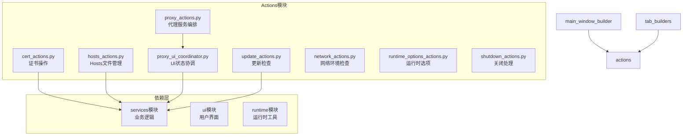
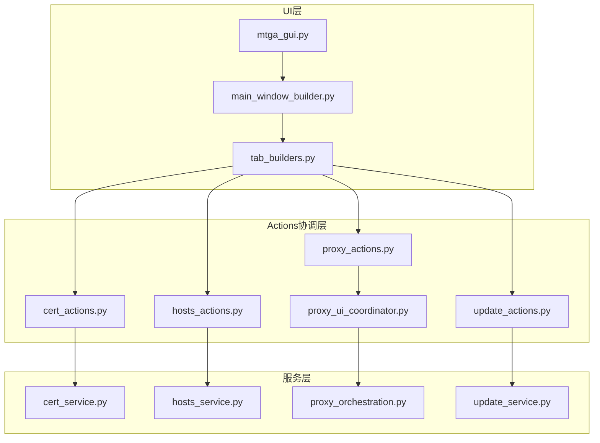
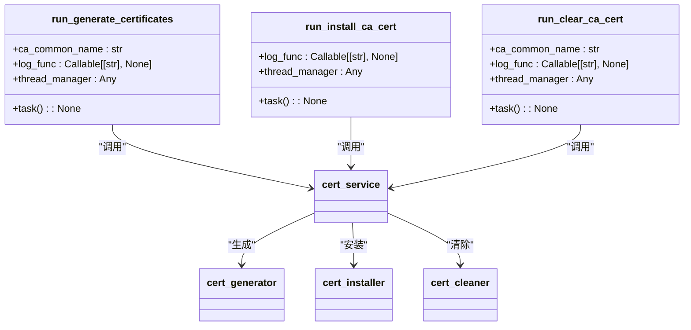
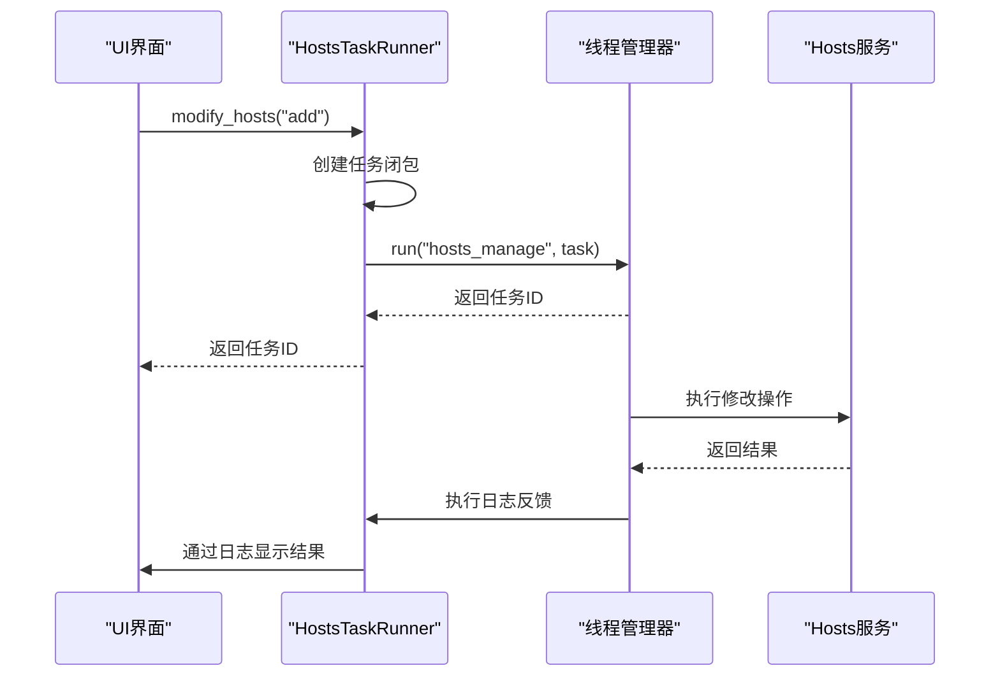
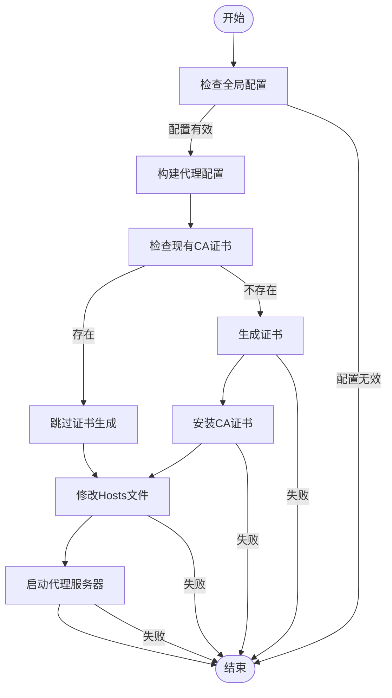
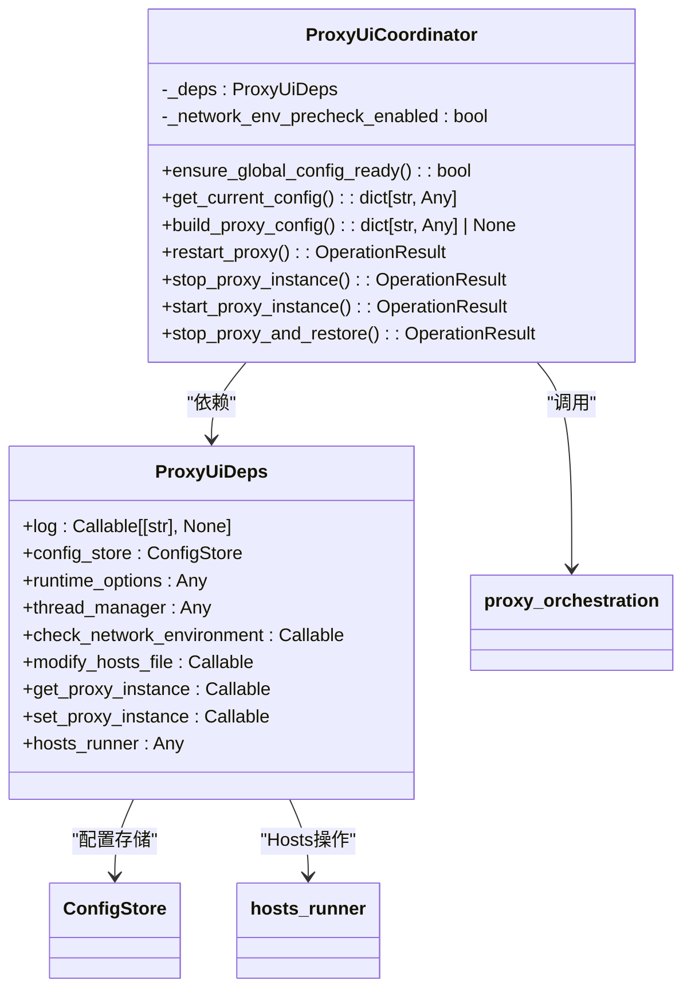
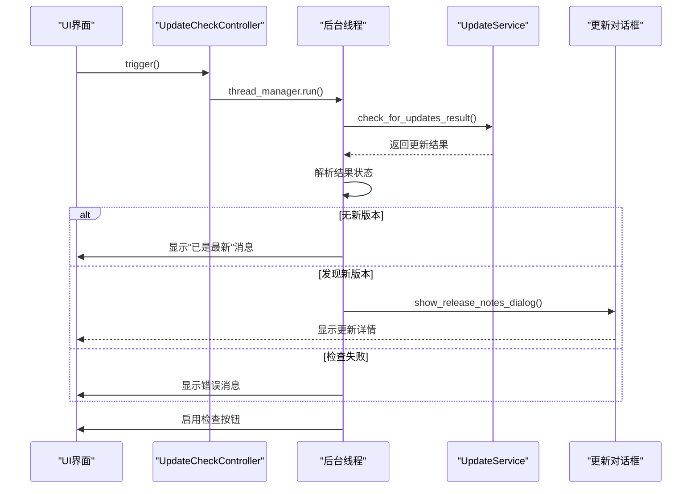
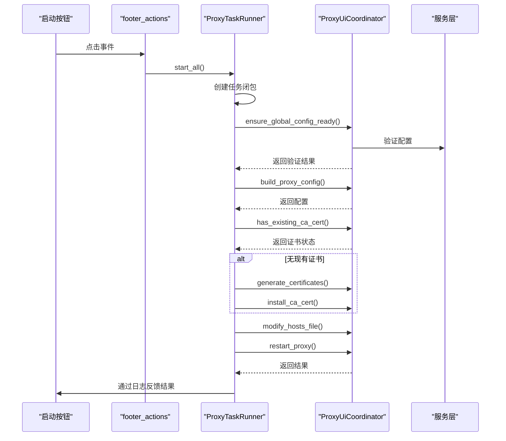
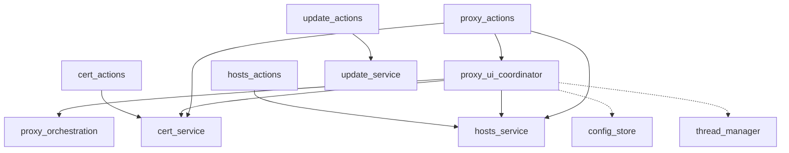

# Actions模块

<cite>
**本文档中引用的文件**   
- [cert_actions.py](file://modules/actions/cert_actions.py)
- [hosts_actions.py](file://modules/actions/hosts_actions.py)
- [proxy_actions.py](file://modules/actions/proxy_actions.py)
- [proxy_ui_coordinator.py](file://modules/actions/proxy_ui_coordinator.py)
- [update_actions.py](file://modules/actions/update_actions.py)
- [mtga_gui.py](file://mtga_gui.py)
- [main_window_builder.py](file://modules/ui/main_window_builder.py)
- [proxy_context.py](file://modules/ui/proxy_context.py)
- [tab_builders.py](file://modules/ui/tab_builders.py)
</cite>

## 目录
1. [简介](#简介)
2. [项目结构](#项目结构)
3. [核心组件](#核心组件)
4. [架构概述](#架构概述)
5. [详细组件分析](#详细组件分析)
6. [依赖分析](#依赖分析)
7. [性能考虑](#性能考虑)
8. [故障排除指南](#故障排除指南)
9. [结论](#结论)

## 简介
Actions模块作为UI与业务逻辑之间的协调层，负责处理用户操作请求、调度后台任务、管理线程执行以及协调状态同步。该模块通过封装复杂的业务流程，为UI层提供简洁的调用接口，同时确保操作的原子性、可追溯性和用户反馈的及时性。本文档将深入解析cert_actions.py、hosts_actions.py、proxy_actions.py、proxy_ui_coordinator.py和update_actions.py的设计与实现，并结合mtga_gui.py中的事件绑定机制，展示从用户交互到action执行的完整路径。

## 项目结构
Actions模块位于`modules/actions/`目录下，采用功能划分的组织方式，每个文件负责特定领域的用户操作。模块通过依赖注入模式与服务层（services）和UI层进行解耦，确保了高内聚低耦合的设计原则。

**Diagram sources**
- [cert_actions.py](file://modules/actions/cert_actions.py)
- [hosts_actions.py](file://modules/actions/hosts_actions.py)
- [proxy_actions.py](file://modules/actions/proxy_actions.py)
- [proxy_ui_coordinator.py](file://modules/actions/proxy_ui_coordinator.py)
- [update_actions.py](file://modules/actions/update_actions.py)

**Section sources**
- [cert_actions.py](file://modules/actions/cert_actions.py)
- [hosts_actions.py](file://modules/actions/hosts_actions.py)
- [proxy_actions.py](file://modules/actions/proxy_actions.py)
- [proxy_ui_coordinator.py](file://modules/actions/proxy_ui_coordinator.py)
- [update_actions.py](file://modules/actions/update_actions.py)

## 核心组件
Actions模块的核心组件包括证书管理、Hosts文件操作、代理服务编排、UI状态协调和自动更新五大功能域。每个组件都遵循一致的设计模式：接收UI层的调用，通过线程管理器执行后台任务，调用服务层完成具体业务逻辑，并将结果通过日志函数反馈给用户界面。

**Section sources**
- [cert_actions.py](file://modules/actions/cert_actions.py#L1-L66)
- [hosts_actions.py](file://modules/actions/hosts_actions.py#L1-L61)
- [proxy_actions.py](file://modules/actions/proxy_actions.py#L1-L129)
- [proxy_ui_coordinator.py](file://modules/actions/proxy_ui_coordinator.py#L1-L123)
- [update_actions.py](file://modules/actions/update_actions.py#L1-L127)

## 架构概述
Actions模块采用分层架构设计，上层为UI提供操作接口，下层调用服务模块实现业务逻辑，中间通过线程管理器确保长时任务的异步执行。proxy_ui_coordinator.py作为核心协调者，封装了代理服务相关的状态检查、配置构建和实例管理，为proxy_actions.py提供统一的调用入口。

**Diagram sources**
- [mtga_gui.py](file://mtga_gui.py#L1-L145)
- [main_window_builder.py](file://modules/ui/main_window_builder.py#L1-L200)
- [tab_builders.py](file://modules/ui/tab_builders.py#L1-L200)
- [proxy_context.py](file://modules/ui/proxy_context.py#L1-L84)

## 详细组件分析

### 证书操作分析
cert_actions.py模块提供证书生成、安装和清除三个核心操作。每个操作都封装为独立函数，接收日志函数、线程管理器和CA通用名称作为参数，通过闭包创建后台任务，并交由线程管理器执行。

#### 证书操作类图

**Diagram sources**
- [cert_actions.py](file://modules/actions/cert_actions.py#L9-L66)
- [cert_service.py](file://modules/services/cert_service.py)

**Section sources**
- [cert_actions.py](file://modules/actions/cert_actions.py#L1-L66)

### Hosts文件操作分析
hosts_actions.py模块通过HostsTaskRunner类管理所有Hosts文件相关操作。该类采用任务ID机制跟踪异步操作状态，支持阻塞和非阻塞两种执行模式，并通过wait_for参数实现任务间的依赖关系。

#### Hosts操作序列图

**Diagram sources**
- [hosts_actions.py](file://modules/actions/hosts_actions.py#L8-L61)
- [hosts_service.py](file://modules/services/hosts_service.py)

**Section sources**
- [hosts_actions.py](file://modules/actions/hosts_actions.py#L1-L61)

### 代理服务操作分析
proxy_actions.py模块通过ProxyTaskRunner类编排代理服务的启动与停止流程。该类接收ProxyTaskDependencies作为依赖注入，包含配置检查、证书管理、Hosts修改和代理实例控制等关键操作的引用。

#### 代理操作流程图

**Diagram sources**
- [proxy_actions.py](file://modules/actions/proxy_actions.py#L25-L129)
- [proxy_ui_coordinator.py](file://modules/actions/proxy_ui_coordinator.py#L25-L123)

**Section sources**
- [proxy_actions.py](file://modules/actions/proxy_actions.py#L1-L129)

### UI协调机制分析
proxy_ui_coordinator.py模块是UI与代理服务之间的核心协调者。它通过ProxyUiCoordinator类封装所有与代理状态相关的检查和操作，包括配置验证、网络环境预检、代理实例生命周期管理等。

#### UI协调类图

**Diagram sources**
- [proxy_ui_coordinator.py](file://modules/actions/proxy_ui_coordinator.py#L25-L123)
- [proxy_orchestration.py](file://modules/services/proxy_orchestration.py)

**Section sources**
- [proxy_ui_coordinator.py](file://modules/actions/proxy_ui_coordinator.py#L1-L123)

### 自动更新集成分析
update_actions.py模块实现自动更新检查功能，通过UpdateCheckController和UpdateCheckDeps分离控制逻辑与依赖，确保更新检查操作的可测试性和可配置性。

#### 更新检查序列图

**Diagram sources**
- [update_actions.py](file://modules/actions/update_actions.py#L1-L127)
- [update_service.py](file://modules/services/update_service.py)
- [update_dialog.py](file://modules/ui/update_dialog.py)

**Section sources**
- [update_actions.py](file://modules/actions/update_actions.py#L1-L127)

### 事件绑定路径分析
从按钮点击到action调用的完整路径展示了UI与Actions模块的集成方式。以"一键启动"按钮为例，事件绑定发生在footer_actions.py中，最终调用proxy_runner.start_all()方法。

#### 事件绑定序列图

**Diagram sources**
- [mtga_gui.py](file://mtga_gui.py#L1-L145)
- [main_window_builder.py](file://modules/ui/main_window_builder.py#L1-L200)
- [footer_actions.py](file://modules/ui/footer_actions.py)

**Section sources**
- [mtga_gui.py](file://mtga_gui.py#L1-L145)
- [main_window_builder.py](file://modules/ui/main_window_builder.py#L1-L200)

## 依赖分析
Actions模块内部各组件之间存在明确的依赖关系，通过依赖注入模式实现松耦合。proxy_actions.py依赖proxy_ui_coordinator.py提供的协调功能，而proxy_ui_coordinator.py又依赖于底层服务模块。

**Diagram sources**
- [proxy_actions.py](file://modules/actions/proxy_actions.py#L11-L23)
- [proxy_ui_coordinator.py](file://modules/actions/proxy_ui_coordinator.py#L13-L23)

**Section sources**
- [proxy_actions.py](file://modules/actions/proxy_actions.py#L1-L129)
- [proxy_ui_coordinator.py](file://modules/actions/proxy_ui_coordinator.py#L1-L123)

## 性能考虑
Actions模块通过线程管理器实现所有长时操作的异步执行，避免阻塞UI主线程。任务调度采用wait_for机制确保操作的顺序性，如停止代理任务会等待启动任务完成后才执行。对于一键启动等复合操作，采用串行执行模式确保事务的完整性，但牺牲了一定的并行性能。

## 故障排除指南
当Actions模块操作失败时，应首先检查日志输出中的错误代码和消息描述。常见问题包括：配置缺失（通过ensure_global_config_ready检查）、权限不足（证书安装需要管理员权限）、网络环境不满足（网络预检失败）和资源冲突（代理端口被占用）。调试时可启用调试模式获取更详细的执行日志。

**Section sources**
- [runtime/result_messages.py](file://modules/runtime/result_messages.py)
- [runtime/error_codes.py](file://modules/runtime/error_codes.py)

## 结论
Actions模块作为UI与业务逻辑之间的关键协调层，通过清晰的职责划分和一致的设计模式，实现了用户操作的高效处理和状态同步。其基于依赖注入和任务编排的设计，不仅提高了代码的可维护性和可测试性，还为开发者提供了清晰的扩展接口。新增自定义action时，应遵循相同的模式：定义清晰的参数签名、使用线程管理器执行后台任务、通过日志函数反馈结果，并妥善处理异常情况。