# Hosts文件管理

<cite>
**本文档引用的文件**
- [hosts_actions.py](file://modules/actions/hosts_actions.py)
- [hosts_manager.py](file://modules/hosts/hosts_manager.py)
- [hosts_service.py](file://modules/services/hosts_service.py)
- [file_operability.py](file://modules/hosts/file_operability.py)
- [hosts_state.py](file://modules/hosts/hosts_state.py)
- [hosts_text.py](file://modules/hosts/hosts_text.py)
- [macos_privileged_helper.py](file://modules/platform/macos_privileged_helper.py)
- [privileges.py](file://modules/platform/privileges.py)
- [system.py](file://modules/platform/system.py)
- [startup_checks.py](file://modules/services/startup_checks.py)
- [startup_context.py](file://modules/services/startup_context.py)
- [main_window_builder.py](file://modules/ui/main_window_builder.py)
</cite>

## 目录
1. [简介](#简介)
2. [核心组件分析](#核心组件分析)
3. [Hosts操作实现逻辑](#hosts操作实现逻辑)
4. [与HostsManager的交互机制](#与hostsmanager的交互机制)
5. [跨平台权限处理策略](#跨平台权限处理策略)
6. [启动流程与自动注入](#启动流程与自动注入)
7. [常见问题与解决方案](#常见问题与解决方案)
8. [典型使用场景](#典型使用场景)
9. [协同工作机制](#协同工作机制)

## 简介
本模块负责管理Hosts文件的修改操作，包括启用、禁用和恢复默认Hosts条目。通过与HostsManager的协作，实现了跨平台的Hosts文件管理功能，并在不同操作系统下处理权限问题。模块在启动时自动注入OpenAI域名映射，并与代理服务和证书管理协同工作，确保网络流量正确重定向。

## 核心组件分析

### HostsTaskRunner类
HostsTaskRunner是处理Hosts文件操作的核心类，负责在独立线程中执行Hosts文件的修改和打开操作。

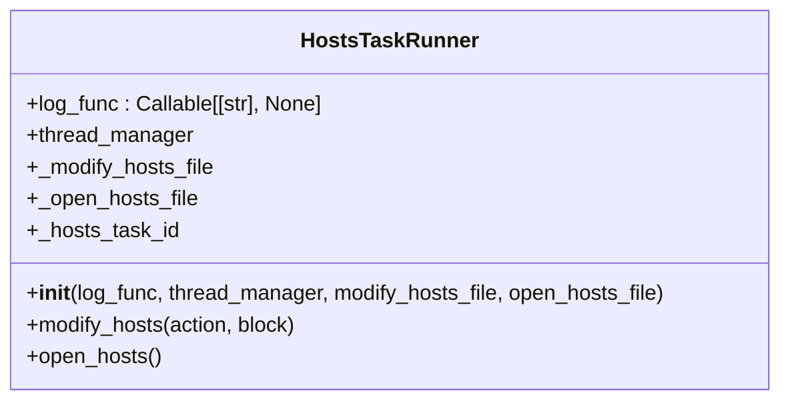

**图示来源**
- [hosts_actions.py](file://modules/actions/hosts_actions.py#L8-L61)

**本节来源**
- [hosts_actions.py](file://modules/actions/hosts_actions.py#L8-L61)

## Hosts操作实现逻辑

### 启用Hosts条目
enable_hosts_entry操作通过HostsTaskRunner的modify_hosts方法实现，将指定域名映射到本地IP地址。

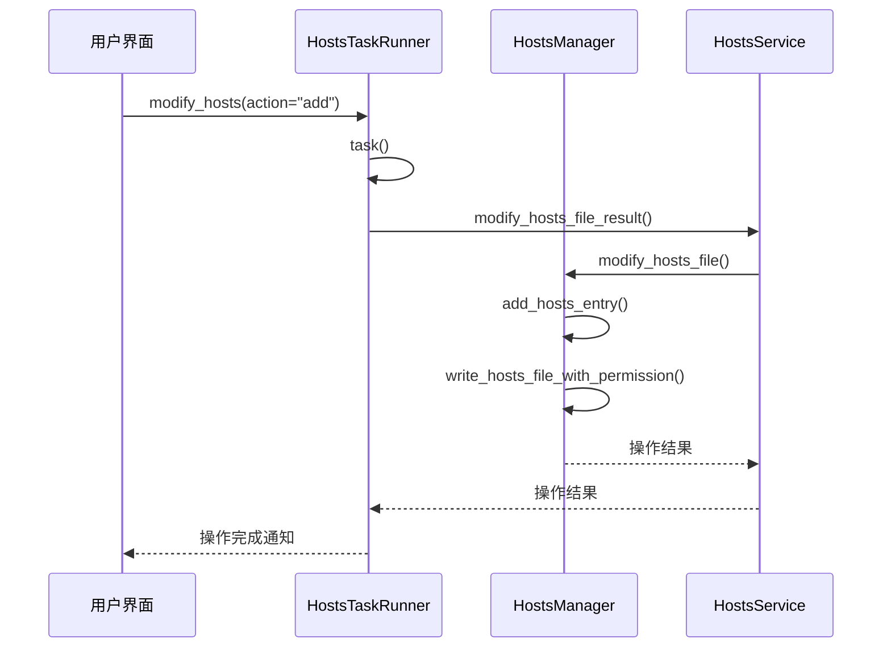

**图示来源**
- [hosts_actions.py](file://modules/actions/hosts_actions.py#L23-L48)
- [hosts_service.py](file://modules/services/hosts_service.py#L31-L40)
- [hosts_manager.py](file://modules/hosts/hosts_manager.py#L459-L492)

**本节来源**
- [hosts_actions.py](file://modules/actions/hosts_actions.py#L23-L48)
- [hosts_service.py](file://modules/services/hosts_service.py#L31-L40)
- [hosts_manager.py](file://modules/hosts/hosts_manager.py#L264-L358)

### 禁用Hosts条目
disable_hosts_entry操作通过remove_hosts_entry函数实现，从Hosts文件中移除指定域名的映射。

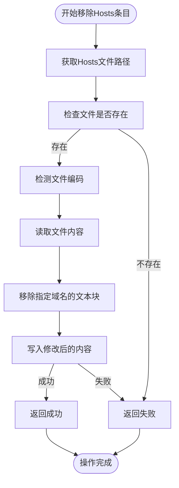

**图示来源**
- [hosts_manager.py](file://modules/hosts/hosts_manager.py#L360-L407)

**本节来源**
- [hosts_manager.py](file://modules/hosts/hosts_manager.py#L360-L407)

### 恢复默认Hosts
restore_default_hosts操作通过restore_hosts_file函数实现，将Hosts文件恢复到备份状态。

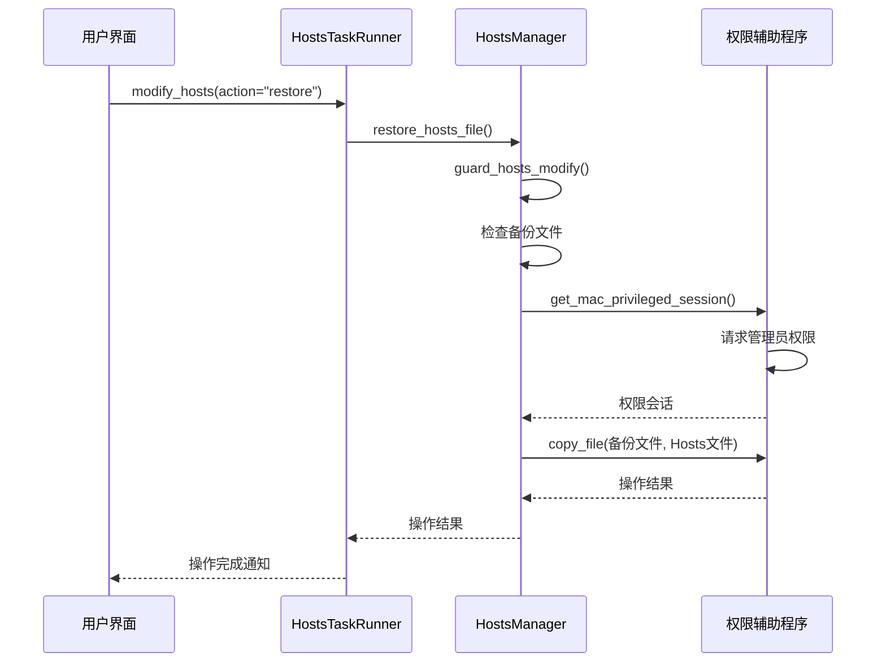

**图示来源**
- [hosts_manager.py](file://modules/hosts/hosts_manager.py#L178-L214)
- [macos_privileged_helper.py](file://modules/platform/macos_privileged_helper.py#L344-L357)

**本节来源**
- [hosts_manager.py](file://modules/hosts/hosts_manager.py#L178-L214)

## 与HostsManager的交互机制
HostsActions模块通过依赖注入的方式与HostsManager进行交互，实现了关注点分离的设计模式。

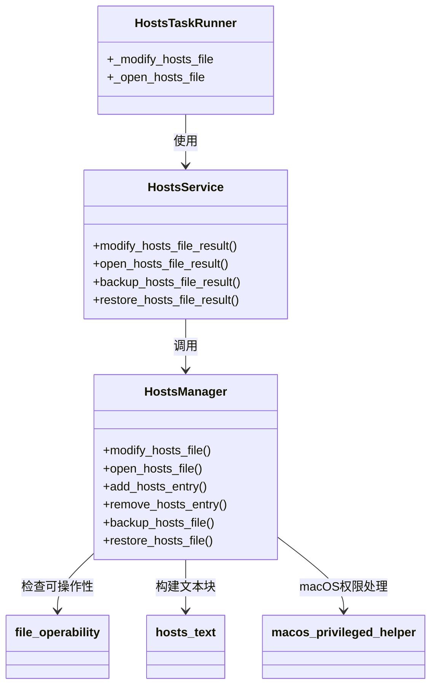

**图示来源**
- [hosts_actions.py](file://modules/actions/hosts_actions.py#L8-L61)
- [hosts_service.py](file://modules/services/hosts_service.py#L3-L59)
- [hosts_manager.py](file://modules/hosts/hosts_manager.py#L6-L492)

**本节来源**
- [hosts_actions.py](file://modules/actions/hosts_actions.py#L8-L61)
- [hosts_service.py](file://modules/services/hosts_service.py#L3-L59)
- [hosts_manager.py](file://modules/hosts/hosts_manager.py#L6-L492)

## 跨平台权限处理策略
模块针对不同操作系统实现了相应的权限处理策略，确保Hosts文件操作的顺利进行。

### Windows权限处理
在Windows系统中，通过检查管理员权限和文件属性来处理权限问题。

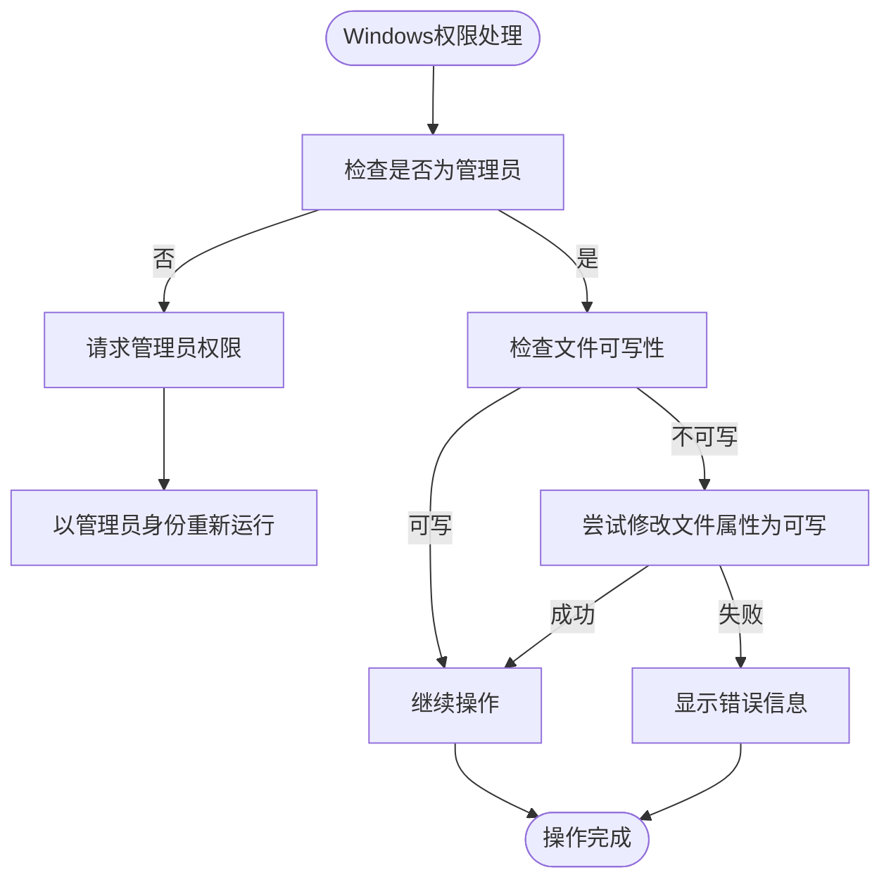

**图示来源**
- [privileges.py](file://modules/platform/privileges.py#L13-L112)
- [file_operability.py](file://modules/hosts/file_operability.py#L199-L211)

**本节来源**
- [privileges.py](file://modules/platform/privileges.py#L13-L112)
- [file_operability.py](file://modules/hosts/file_operability.py#L199-L211)

### macOS权限处理
在macOS系统中，通过持久化提权辅助程序来处理权限问题。

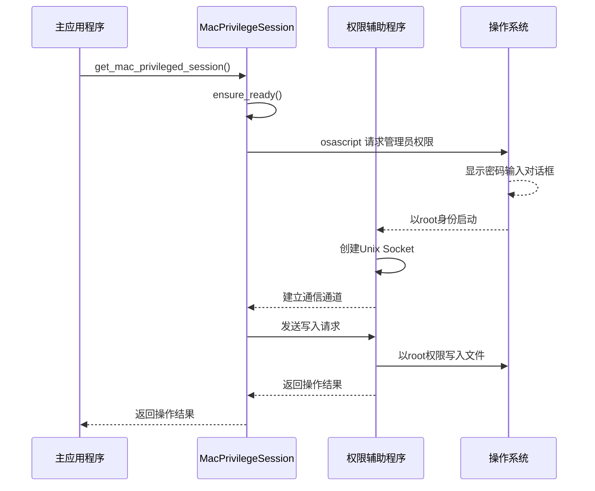

**图示来源**
- [macos_privileged_helper.py](file://modules/platform/macos_privileged_helper.py#L48-L338)
- [hosts_manager.py](file://modules/hosts/hosts_manager.py#L230-L237)

**本节来源**
- [macos_privileged_helper.py](file://modules/platform/macos_privileged_helper.py#L48-L338)

## 启动流程与自动注入
模块在应用程序启动时执行预检并自动注入OpenAI域名映射。

### 启动预检流程
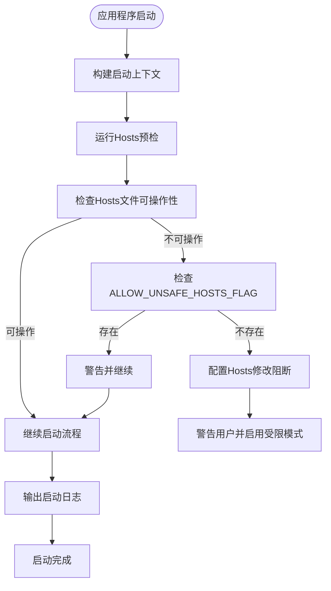

**图示来源**
- [startup_checks.py](file://modules/services/startup_checks.py#L25-L54)
- [startup_context.py](file://modules/services/startup_context.py#L30-L34)

**本节来源**
- [startup_checks.py](file://modules/services/startup_checks.py#L25-L54)
- [startup_context.py](file://modules/services/startup_context.py#L30-L34)

### 自动注入条件
自动注入OpenAI域名映射的时机和条件如下：

1. **时机**：在用户点击"一键启动全部服务"或手动启动代理服务时
2. **条件**：
   - Hosts文件可写
   - 未启用Hosts修改阻断
   - 用户配置中启用了Hosts注入功能
   - 目标域名未被手动修改过

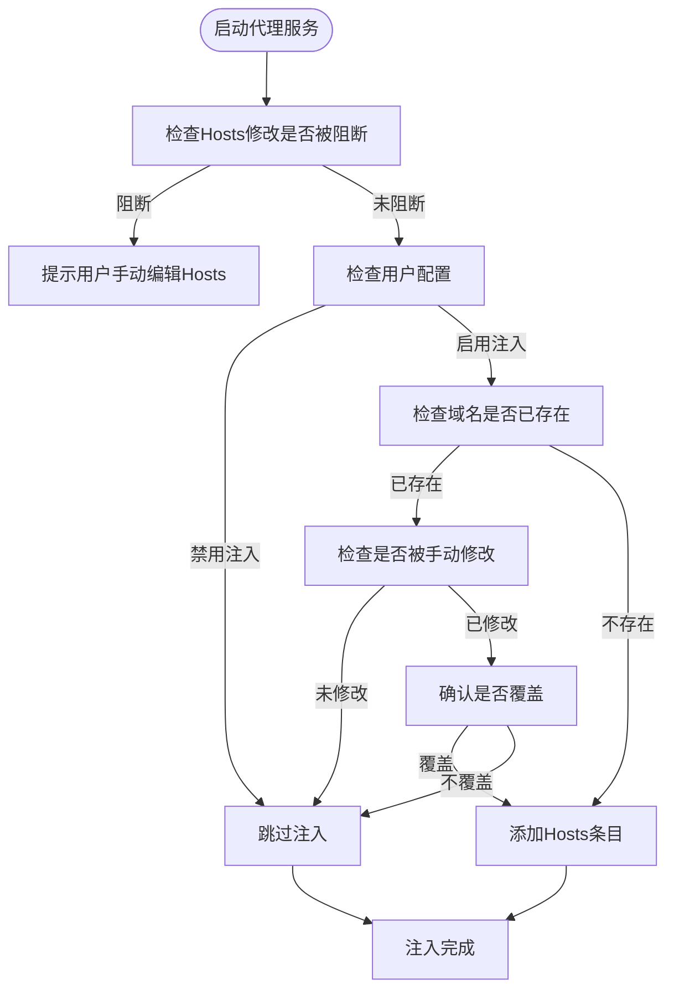

**本节来源**
- [main_window_builder.py](file://modules/ui/main_window_builder.py#L78-L83)
- [proxy_context.py](file://modules/ui/proxy_context.py#L126-L129)

## 常见问题与解决方案

### Hosts文件写入失败
当Hosts文件写入失败时，系统会尝试以下回退策略：

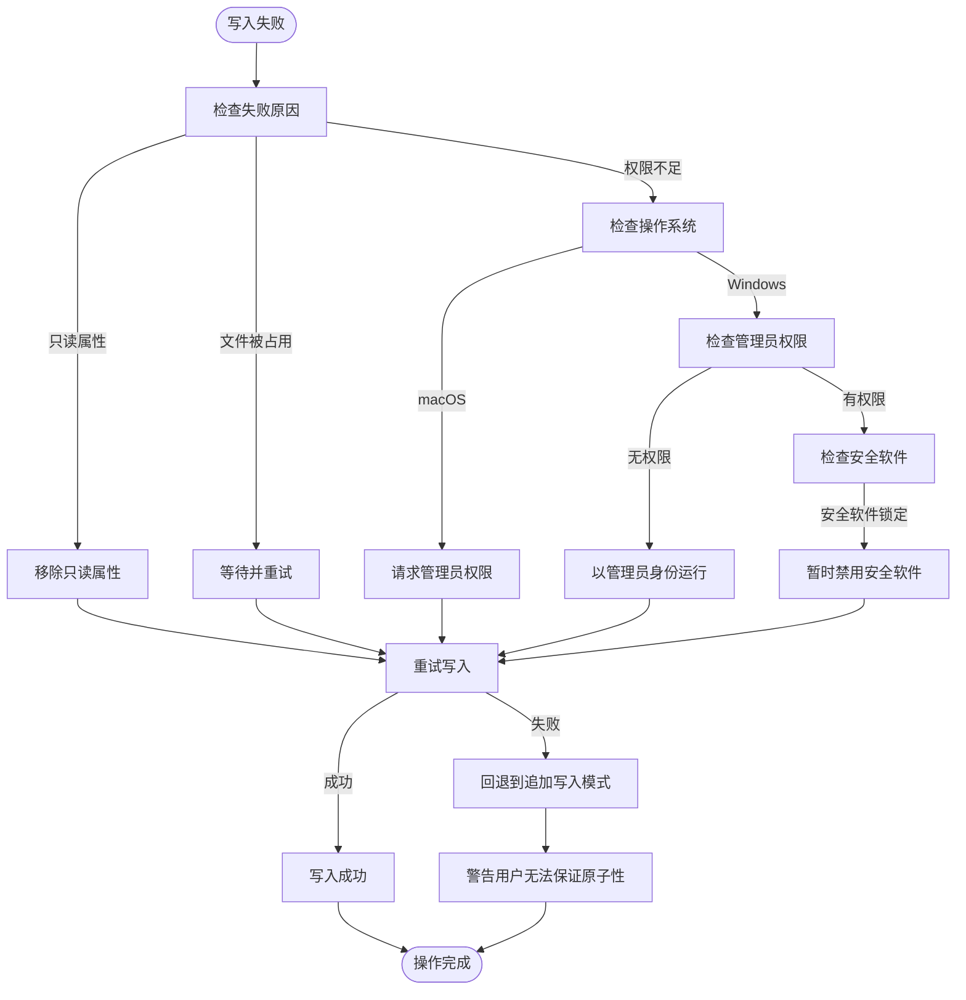

**本节来源**
- [hosts_manager.py](file://modules/hosts/hosts_manager.py#L343-L351)
- [file_operability.py](file://modules/hosts/file_operability.py#L117-L196)

### 权限拒绝问题
针对不同操作系统的权限拒绝问题，提供以下解决方案：

| 操作系统 | 问题原因 | 解决方案 |
|---------|--------|--------|
| Windows | 非管理员运行 | 以管理员身份运行程序 |
| Windows | 安全软件锁定 | 暂时禁用安全软件或添加例外 |
| Windows | 文件只读属性 | 移除只读属性 |
| macOS | 未授权 | 在弹窗中输入管理员密码 |
| Linux | 未使用sudo | 使用sudo运行程序 |

**本节来源**
- [hosts_manager.py](file://modules/hosts/hosts_manager.py#L247-L258)
- [privileges.py](file://modules/platform/privileges.py#L84-L103)

## 典型使用场景

### 启用Hosts条目
```python
# 创建Hosts任务运行器
hosts_runner = HostsTaskRunner(
    log_func=log,
    thread_manager=thread_manager,
    modify_hosts_file=modify_hosts_file,
    open_hosts_file=open_hosts_file
)

# 异步启用Hosts条目
task_id = hosts_runner.modify_hosts(action="add", block=False)

# 或同步启用Hosts条目
hosts_runner.modify_hosts(action="add", block=True)
```

**本节来源**
- [hosts_actions.py](file://modules/actions/hosts_actions.py#L23-L48)

### 禁用Hosts条目
```python
# 禁用特定域名的Hosts条目
hosts_runner.modify_hosts(action="remove", block=True)

# 或使用服务层API
result = modify_hosts_file_result(
    domain="api.openai.com",
    action="remove",
    log_func=log
)
if result.ok:
    log("Hosts条目已成功移除")
else:
    log(f"移除失败: {result.message}")
```

**本节来源**
- [hosts_service.py](file://modules/services/hosts_service.py#L25-L28)

### 恢复默认Hosts
```python
# 恢复Hosts文件到默认状态
hosts_runner.modify_hosts(action="restore", block=True)

# 或使用服务层API
result = restore_hosts_file_result(log_func=log)
if result.ok:
    log("Hosts文件已成功恢复")
else:
    log(f"恢复失败: {result.message}")
```

**本节来源**
- [hosts_service.py](file://modules/services/hosts_service.py#L19-L22)

## 协同工作机制
Hosts管理模块与代理服务和证书管理模块协同工作，确保网络流量正确重定向。

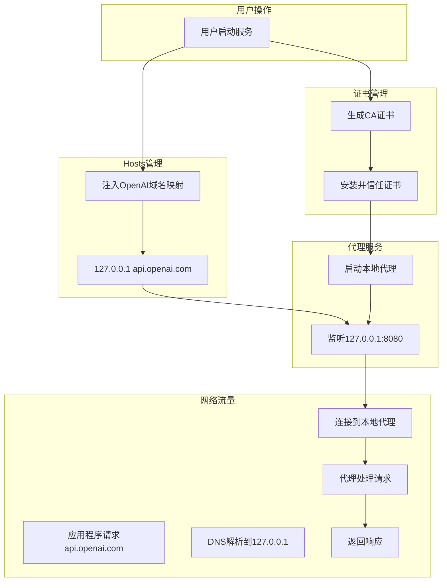

**本节来源**
- [main_window_builder.py](file://modules/ui/main_window_builder.py#L118-L134)
- [proxy_context.py](file://modules/ui/proxy_context.py#L119-L134)