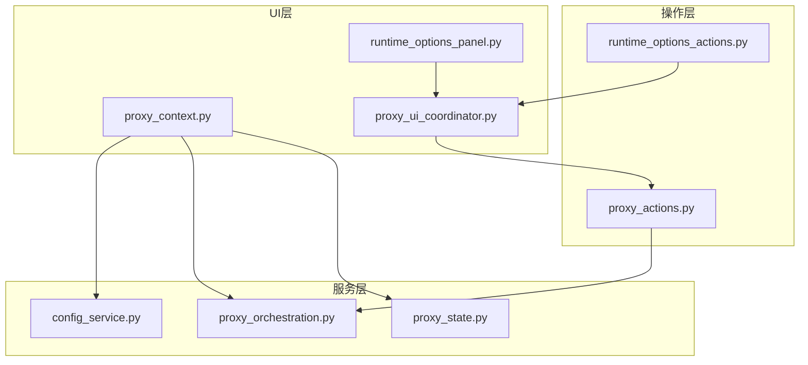
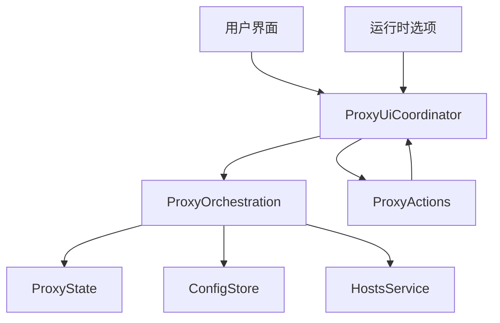
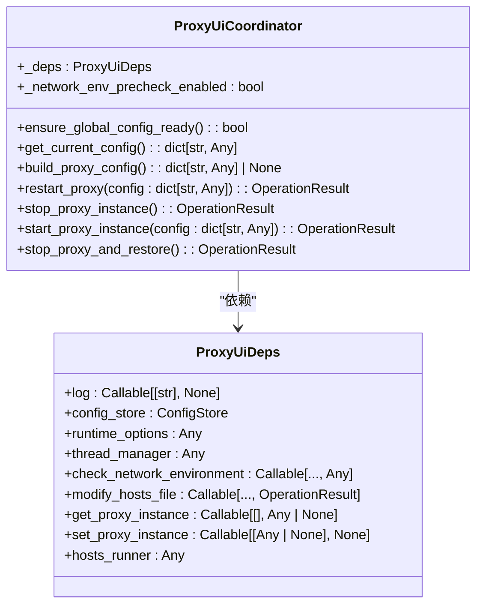
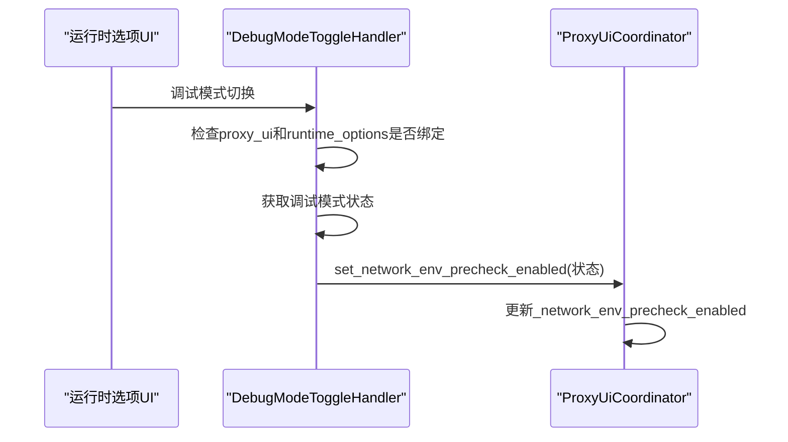
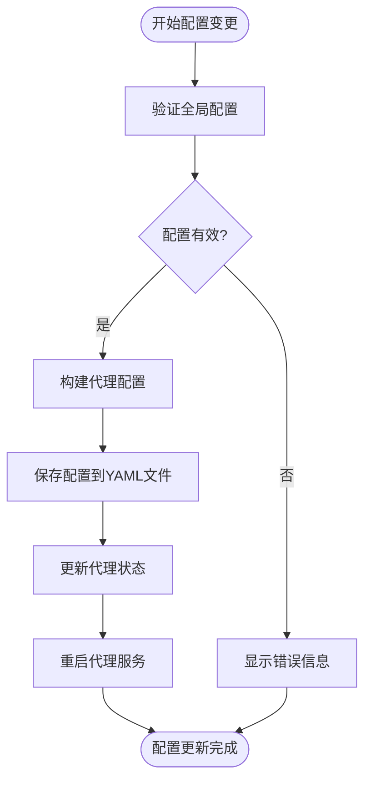
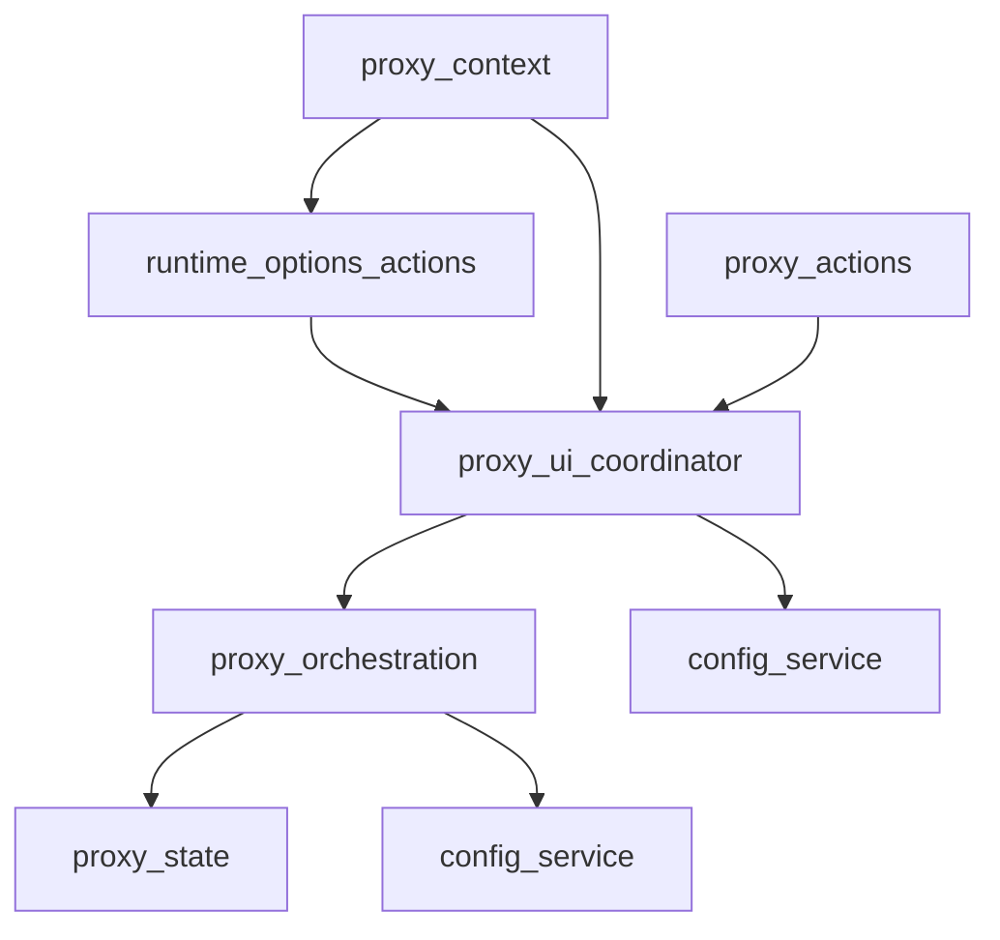

# UI协调与运行时选项

<cite>
**本文档引用的文件**
- [proxy_ui_coordinator.py](file://modules/actions/proxy_ui_coordinator.py)
- [runtime_options_actions.py](file://modules/actions/runtime_options_actions.py)
- [proxy_context.py](file://modules/ui/proxy_context.py)
- [runtime_options_panel.py](file://modules/ui/runtime_options_panel.py)
- [config_service.py](file://modules/services/config_service.py)
- [proxy_orchestration.py](file://modules/services/proxy_orchestration.py)
- [proxy_state.py](file://modules/services/proxy_state.py)
- [proxy_actions.py](file://modules/actions/proxy_actions.py)
- [thread_manager.py](file://modules/runtime/thread_manager.py)
</cite>

## 目录
1. [引言](#引言)
2. [项目结构](#项目结构)
3. [核心组件](#核心组件)
4. [架构概述](#架构概述)
5. [详细组件分析](#详细组件分析)
6. [依赖分析](#依赖分析)
7. [性能考虑](#性能考虑)
8. [故障排除指南](#故障排除指南)
9. [结论](#结论)

## 引言
本文档深入剖析了ModelRelay应用中UI与后台服务之间的状态一致性维护机制，重点关注代理运行状态、证书信任状态和Hosts配置状态的监听与更新。文档详细说明了用户运行时配置变更（如日志级别、监听端口、模型映射规则）的响应逻辑，以及配置变更如何通过事件总线通知相关模块并持久化存储。通过分析核心组件的交互，展示了动态配置热更新的实现案例和多窗口状态同步的最佳实践。

## 项目结构
ModelRelay项目的结构遵循模块化设计原则，将功能划分为清晰的模块。核心功能位于`modules`目录下，包括`actions`（操作执行）、`services`（业务服务）、`ui`（用户界面）等子模块。这种分层架构使得UI协调和运行时选项管理的实现更加清晰和可维护。

**图示来源**
- [proxy_context.py](file://modules/ui/proxy_context.py)
- [config_service.py](file://modules/services/config_service.py)
- [proxy_orchestration.py](file://modules/services/proxy_orchestration.py)

**本节来源**
- [proxy_context.py](file://modules/ui/proxy_context.py)
- [config_service.py](file://modules/services/config_service.py)

## 核心组件
本节分析维护UI与后台服务状态一致性的核心组件。`proxy_ui_coordinator.py`作为UI与代理服务之间的协调器，负责处理代理的启动、停止和配置更新。`runtime_options_actions.py`则专门处理用户运行时配置变更的响应逻辑。这些组件通过依赖注入模式与配置服务、代理状态管理器等其他服务进行交互，确保状态变更能够正确传播。

**本节来源**
- [proxy_ui_coordinator.py](file://modules/actions/proxy_ui_coordinator.py#L25-L123)
- [runtime_options_actions.py](file://modules/actions/runtime_options_actions.py#L1-L21)

## 架构概述
系统采用分层架构，UI层通过协调器与服务层交互，服务层负责核心业务逻辑和状态管理。运行时选项的变更通过事件驱动的方式通知相关组件，确保状态一致性。配置的持久化通过`config_service.py`实现，使用YAML格式存储配置数据。

**图示来源**
- [proxy_ui_coordinator.py](file://modules/actions/proxy_ui_coordinator.py)
- [proxy_orchestration.py](file://modules/services/proxy_orchestration.py)
- [proxy_state.py](file://modules/services/proxy_state.py)

## 详细组件分析

### ProxyUiCoordinator分析
`ProxyUiCoordinator`是UI与代理服务之间的核心协调组件，负责维护代理运行状态、证书信任状态和Hosts配置状态的一致性。

#### 类图

**图示来源**
- [proxy_ui_coordinator.py](file://modules/actions/proxy_ui_coordinator.py#L25-L123)

**本节来源**
- [proxy_ui_coordinator.py](file://modules/actions/proxy_ui_coordinator.py#L25-L123)

### RuntimeOptionsActions分析
`runtime_options_actions.py`中的`DebugModeToggleHandler`负责处理用户运行时配置变更的响应逻辑，特别是调试模式的切换。

#### 序列图

**图示来源**
- [runtime_options_actions.py](file://modules/actions/runtime_options_actions.py#L1-L21)
- [proxy_ui_coordinator.py](file://modules/actions/proxy_ui_coordinator.py#L30-L32)

**本节来源**
- [runtime_options_actions.py](file://modules/actions/runtime_options_actions.py#L1-L21)

### 配置管理分析
配置的持久化和状态同步通过`config_service.py`和`proxy_state.py`实现，确保配置变更能够正确存储并在应用重启后恢复。

#### 流程图

**图示来源**
- [config_service.py](file://modules/services/config_service.py#L40-L74)
- [proxy_orchestration.py](file://modules/services/proxy_orchestration.py#L70-L91)

**本节来源**
- [config_service.py](file://modules/services/config_service.py#L40-L81)
- [proxy_orchestration.py](file://modules/services/proxy_orchestration.py#L70-L91)

## 依赖分析
系统各组件之间通过清晰的依赖关系进行交互。UI组件依赖于服务层组件来执行业务逻辑，服务层组件又依赖于底层的工具和状态管理器。这种依赖关系确保了关注点的分离和代码的可测试性。

**图示来源**
- [proxy_ui_coordinator.py](file://modules/actions/proxy_ui_coordinator.py)
- [runtime_options_actions.py](file://modules/actions/runtime_options_actions.py)
- [proxy_context.py](file://modules/ui/proxy_context.py)

**本节来源**
- [proxy_ui_coordinator.py](file://modules/actions/proxy_ui_coordinator.py)
- [runtime_options_actions.py](file://modules/actions/runtime_options_actions.py)

## 性能考虑
系统的性能主要受配置读写、代理启动和线程管理的影响。`config_service.py`使用YAML格式进行配置持久化，虽然可读性好，但在频繁读写时可能成为性能瓶颈。`thread_manager.py`提供了统一的后台线程管理，避免了线程创建和状态混乱的问题，提高了系统的稳定性和性能。

## 故障排除指南
当遇到UI与后台服务状态不一致的问题时，应首先检查`proxy_ui_coordinator.py`中的状态同步逻辑，确保所有状态变更都通过正确的路径传播。对于配置持久化问题，应检查`config_service.py`的文件读写权限和YAML格式的正确性。

**本节来源**
- [proxy_ui_coordinator.py](file://modules/actions/proxy_ui_coordinator.py#L33-L43)
- [config_service.py](file://modules/services/config_service.py#L14-L25)

## 结论
ModelRelay应用通过`proxy_ui_coordinator.py`和`runtime_options_actions.py`等组件实现了UI与后台服务之间的状态一致性维护。系统采用分层架构和依赖注入模式，确保了代码的可维护性和可扩展性。配置的持久化和状态同步机制设计合理，能够有效支持动态配置热更新和多窗口状态同步的需求。