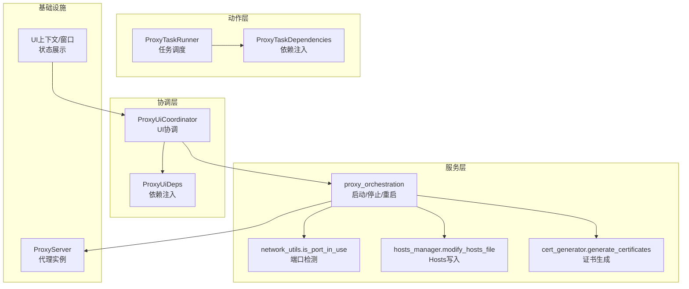
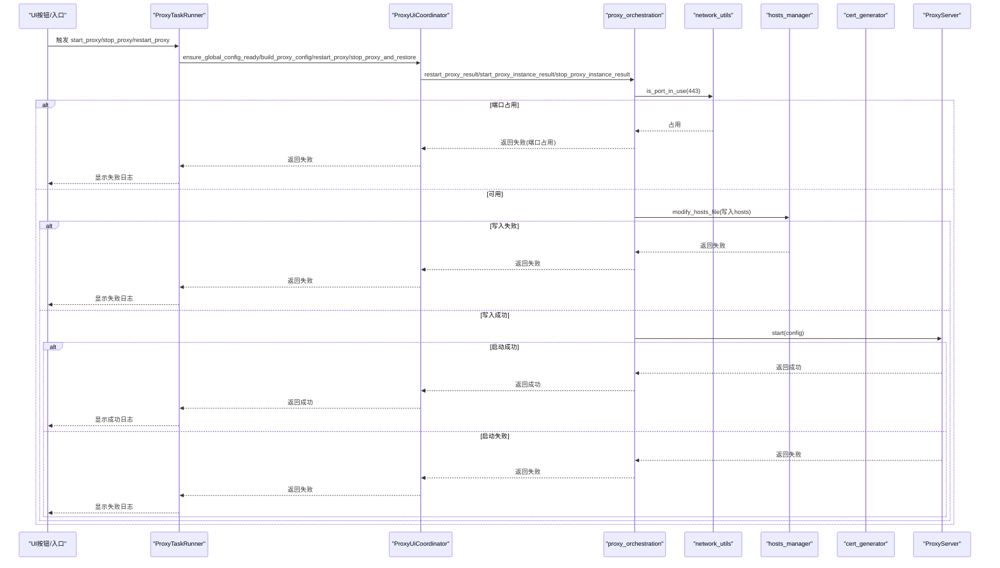
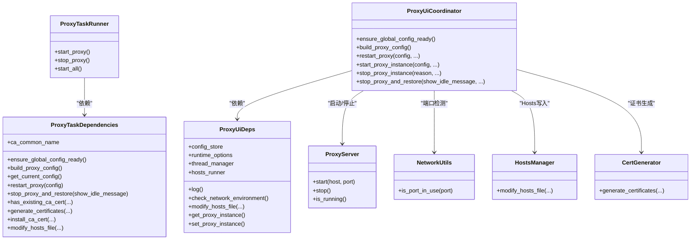

# 代理服务控制

<cite>
**本文引用的文件列表**
- [modules/actions/proxy_actions.py](file://modules/actions/proxy_actions.py)
- [modules/actions/proxy_ui_coordinator.py](file://modules/actions/proxy_ui_coordinator.py)
- [modules/services/proxy_orchestration.py](file://modules/services/proxy_orchestration.py)
- [modules/services/startup_checks.py](file://modules/services/startup_checks.py)
- [modules/proxy/proxy_server.py](file://modules/proxy/proxy_server.py)
- [modules/network/network_utils.py](file://modules/network/network_utils.py)
- [modules/hosts/hosts_manager.py](file://modules/hosts/hosts_manager.py)
- [modules/cert/cert_generator.py](file://modules/cert/cert_generator.py)
- [modules/ui/proxy_context.py](file://modules/ui/proxy_context.py)
- [modules/ui/main_window_builder.py](file://modules/ui/main_window_builder.py)
</cite>

## 目录
1. [简介](#简介)
2. [项目结构](#项目结构)
3. [核心组件](#核心组件)
4. [架构总览](#架构总览)
5. [详细组件分析](#详细组件分析)
6. [依赖关系分析](#依赖关系分析)
7. [性能考虑](#性能考虑)
8. [故障排查指南](#故障排查指南)
9. [结论](#结论)

## 简介
本文围绕代理服务的启动、停止与状态管理展开，重点解析以下内容：
- start_proxy、stop_proxy、restart_proxy 的执行流程与关键步骤（端口检测、配置加载、子进程/线程管理）
- 代理状态如何同步至UI界面并实时反馈
- 代理启动前的预检机制（证书、Hosts、端口占用）及其错误传播策略
- 高并发场景下的性能调优建议与常见故障（端口冲突、SSL握手失败）的诊断方法

## 项目结构
本节聚焦与代理控制相关的关键模块与职责划分：
- 动作层（actions）：封装代理任务的调度与编排，负责线程等待与任务链路组织
- 协调层（ui协调器）：桥接UI与业务服务，负责配置构建、重启与停止等操作的封装
- 服务层（orchestration）：实现代理启动/停止/重启的业务逻辑，含端口检测、Hosts写入、实例生命周期管理
- 基础设施层：网络工具（端口检测）、Hosts管理、证书生成与安装、UI上下文与窗口构建

图表来源
- [modules/actions/proxy_actions.py](file://modules/actions/proxy_actions.py#L25-L129)
- [modules/actions/proxy_ui_coordinator.py](file://modules/actions/proxy_ui_coordinator.py#L25-L123)
- [modules/services/proxy_orchestration.py](file://modules/services/proxy_orchestration.py#L13-L200)
- [modules/network/network_utils.py](file://modules/network/network_utils.py#L6-L20)
- [modules/hosts/hosts_manager.py](file://modules/hosts/hosts_manager.py#L459-L492)
- [modules/cert/cert_generator.py](file://modules/cert/cert_generator.py#L386-L446)
- [modules/proxy/proxy_server.py](file://modules/proxy/proxy_server.py#L14-L65)
- [modules/ui/proxy_context.py](file://modules/ui/proxy_context.py#L31-L84)
- [modules/ui/main_window_builder.py](file://modules/ui/main_window_builder.py#L59-L208)

章节来源
- [modules/actions/proxy_actions.py](file://modules/actions/proxy_actions.py#L1-L129)
- [modules/actions/proxy_ui_coordinator.py](file://modules/actions/proxy_ui_coordinator.py#L1-L123)
- [modules/services/proxy_orchestration.py](file://modules/services/proxy_orchestration.py#L1-L200)
- [modules/network/network_utils.py](file://modules/network/network_utils.py#L1-L20)
- [modules/hosts/hosts_manager.py](file://modules/hosts/hosts_manager.py#L1-L492)
- [modules/cert/cert_generator.py](file://modules/cert/cert_generator.py#L1-L446)
- [modules/proxy/proxy_server.py](file://modules/proxy/proxy_server.py#L1-L65)
- [modules/ui/proxy_context.py](file://modules/ui/proxy_context.py#L1-L84)
- [modules/ui/main_window_builder.py](file://modules/ui/main_window_builder.py#L1-L208)

## 核心组件
- ProxyTaskRunner：负责代理启动/停止任务的线程化调度，支持任务间等待与链式执行
- ProxyUiCoordinator：封装配置构建、重启/停止代理、Hosts写入、实例生命周期管理
- proxy_orchestration：实现端口检测、Hosts写入、代理实例启动/停止、重启组合逻辑
- ProxyServer：代理实例封装，负责装配领域逻辑与运行时，并对外暴露start/stop/is_running
- Hosts管理：提供原子写入、回退追加写入、备份/还原、权限处理等能力
- 证书生成：基于OpenSSL生成CA与服务器证书，支持配置文件与主题信息管理
- UI上下文：将动作层与协调层注入到窗口构建流程，实现状态同步与实时反馈

章节来源
- [modules/actions/proxy_actions.py](file://modules/actions/proxy_actions.py#L25-L129)
- [modules/actions/proxy_ui_coordinator.py](file://modules/actions/proxy_ui_coordinator.py#L25-L123)
- [modules/services/proxy_orchestration.py](file://modules/services/proxy_orchestration.py#L13-L200)
- [modules/proxy/proxy_server.py](file://modules/proxy/proxy_server.py#L14-L65)
- [modules/hosts/hosts_manager.py](file://modules/hosts/hosts_manager.py#L264-L492)
- [modules/cert/cert_generator.py](file://modules/cert/cert_generator.py#L386-L446)
- [modules/ui/proxy_context.py](file://modules/ui/proxy_context.py#L31-L84)
- [modules/ui/main_window_builder.py](file://modules/ui/main_window_builder.py#L118-L139)

## 架构总览
下图展示了从UI触发到代理实例启动/停止的完整调用链，以及状态如何回传至UI界面。

图表来源
- [modules/actions/proxy_actions.py](file://modules/actions/proxy_actions.py#L39-L129)
- [modules/actions/proxy_ui_coordinator.py](file://modules/actions/proxy_ui_coordinator.py#L64-L123)
- [modules/services/proxy_orchestration.py](file://modules/services/proxy_orchestration.py#L70-L185)
- [modules/network/network_utils.py](file://modules/network/network_utils.py#L6-L20)
- [modules/hosts/hosts_manager.py](file://modules/hosts/hosts_manager.py#L459-L492)
- [modules/proxy/proxy_server.py](file://modules/proxy/proxy_server.py#L35-L54)

## 详细组件分析

### ProxyTaskRunner：任务调度与链式等待
- 责任边界：封装代理启动/停止任务的线程化执行，支持任务间等待与链式执行，避免并发冲突
- 关键点：
  - start_proxy：校验全局配置后，构建配置并调用重启逻辑
  - stop_proxy：先等待启动任务结束，再执行停止与恢复
  - start_all：按步骤执行（证书生成/安装、Hosts写入、代理重启），并携带成功/失败消息
- 并发控制：通过线程管理器的等待参数，确保启动与停止的有序执行

章节来源
- [modules/actions/proxy_actions.py](file://modules/actions/proxy_actions.py#L25-L129)

### ProxyUiCoordinator：配置构建与操作封装
- 责任边界：桥接UI与服务层，提供配置构建、重启/停止代理、Hosts写入、实例生命周期管理
- 关键点：
  - ensure_global_config_ready：校验全局配置字段，缺失时向UI日志输出提示
  - build_proxy_config：从配置存储读取当前配置并注入调试/SSL/流模式等运行时选项
  - restart_proxy：组合停止旧实例与启动新实例，支持成功消息与Hosts变更标记
  - start_proxy_instance：执行网络环境预检、端口占用检测、Hosts写入、实例启动
  - stop_proxy_instance：停止实例并清空实例引用
  - stop_proxy_and_restore：停止实例后执行Hosts清理

章节来源
- [modules/actions/proxy_ui_coordinator.py](file://modules/actions/proxy_ui_coordinator.py#L25-L123)

### proxy_orchestration：启动/停止/重启的业务实现
- 责任边界：实现代理启动/停止/重启的完整流程，包含端口检测、Hosts写入、实例生命周期管理
- 关键点：
  - ensure_global_config_ready：校验映射模型ID与鉴权Key
  - build_proxy_config：复制当前配置并注入调试/SSL/流模式
  - restart_proxy_result：先停止旧实例，再启动新实例，失败时携带错误码与消息
  - start_proxy_instance_result：
    - 可选网络环境预检
    - 端口443占用检测（失败返回端口占用错误）
    - Hosts写入（失败返回写入失败错误）
    - 实例启动，成功/失败分别记录日志并设置实例引用
  - stop_proxy_instance_result：停止实例并清空引用，异常时记录日志

章节来源
- [modules/services/proxy_orchestration.py](file://modules/services/proxy_orchestration.py#L36-L200)

### 端口检测与预检
- 端口检测：is_port_in_use 对IPv4/IPv6分别探测，超时短、快速返回
- 程序启动预检：startup_checks 提供Hosts可写性预检与网络环境预检，必要时启用受限Hosts模式并发出警告

章节来源
- [modules/network/network_utils.py](file://modules/network/network_utils.py#L6-L20)
- [modules/services/startup_checks.py](file://modules/services/startup_checks.py#L25-L108)

### Hosts写入与回退策略
- 原子写入：移除旧记录、追加新块、保持空行，确保一致性
- 回退策略：当受限或写入失败时，回退为追加写入，不保证原子性，给出明确警告
- 备份/还原：自动备份并在需要时还原，支持跨平台权限处理

章节来源
- [modules/hosts/hosts_manager.py](file://modules/hosts/hosts_manager.py#L264-L492)

### 证书生成与安装
- 证书生成：基于OpenSSL生成CA与服务器证书，合并配置文件，处理序列号文件权限问题
- 安装与导入：通过系统工具或平台特定会话完成证书导入（macOS特权会话）

章节来源
- [modules/cert/cert_generator.py](file://modules/cert/cert_generator.py#L386-L446)

### 代理实例生命周期
- ProxyServer：装配领域逻辑与运行时，对外暴露start/stop/is_running
- 实例引用：通过UI协调器的get/set代理实例回调维护当前实例引用，确保停止/重启时正确释放

章节来源
- [modules/proxy/proxy_server.py](file://modules/proxy/proxy_server.py#L14-L65)
- [modules/actions/proxy_ui_coordinator.py](file://modules/actions/proxy_ui_coordinator.py#L82-L112)

### UI状态同步与实时反馈
- UI上下文：在窗口构建时注入ProxyContext，包含proxy_ui与proxy_runner
- 状态展示：所有日志通过统一log回调输出到UI，配合footer动作与标签页展示当前状态
- 关闭流程：窗口关闭时触发stop_proxy_and_restore，确保Hosts清理与实例停止

章节来源
- [modules/ui/proxy_context.py](file://modules/ui/proxy_context.py#L31-L84)
- [modules/ui/main_window_builder.py](file://modules/ui/main_window_builder.py#L118-L199)

## 依赖关系分析

图表来源
- [modules/actions/proxy_actions.py](file://modules/actions/proxy_actions.py#L11-L55)
- [modules/actions/proxy_ui_coordinator.py](file://modules/actions/proxy_ui_coordinator.py#L12-L123)
- [modules/proxy/proxy_server.py](file://modules/proxy/proxy_server.py#L14-L65)
- [modules/network/network_utils.py](file://modules/network/network_utils.py#L6-L20)
- [modules/hosts/hosts_manager.py](file://modules/hosts/hosts_manager.py#L459-L492)
- [modules/cert/cert_generator.py](file://modules/cert/cert_generator.py#L386-L446)

## 性能考虑
- 端口检测：is_port_in_use采用短超时与双栈探测，适合快速预检，避免阻塞启动流程
- Hosts写入：优先原子写入，失败回退追加写入，减少多次IO与文件损坏风险
- 证书生成：OpenSSL命令异步执行，生成完成后统一返回结果，避免长时间阻塞UI线程
- 线程化执行：ProxyTaskRunner通过线程管理器组织任务，避免UI卡顿
- 并发控制：stop任务等待start任务结束，防止实例状态竞争

章节来源
- [modules/network/network_utils.py](file://modules/network/network_utils.py#L6-L20)
- [modules/hosts/hosts_manager.py](file://modules/hosts/hosts_manager.py#L318-L354)
- [modules/cert/cert_generator.py](file://modules/cert/cert_generator.py#L24-L43)
- [modules/actions/proxy_actions.py](file://modules/actions/proxy_actions.py#L39-L129)

## 故障排查指南

### 端口冲突（443被占用）
- 现象：启动失败并提示端口已被占用
- 排查步骤：
  - 使用系统工具查看占用进程（Windows：netstat/tcp；Linux/macOS：lsof/ps）
  - 释放占用进程或调整代理端口
- 预防措施：启动前执行端口检测，避免冲突

章节来源
- [modules/services/proxy_orchestration.py](file://modules/services/proxy_orchestration.py#L163-L165)

### SSL握手失败
- 现象：客户端连接失败，日志显示SSL错误
- 排查步骤：
  - 确认CA证书已正确生成并安装到系统/浏览器信任存储
  - 检查服务器证书与域名匹配、有效期正常
  - 关闭系统代理或切换TUN/VPN，避免显式代理绕过Hosts导流
- 预防措施：启动前执行网络环境预检，必要时启用受限Hosts模式

章节来源
- [modules/services/startup_checks.py](file://modules/services/startup_checks.py#L57-L107)
- [modules/cert/cert_generator.py](file://modules/cert/cert_generator.py#L386-L446)

### Hosts写入失败
- 现象：写入失败或权限不足
- 排查步骤：
  - 确认以管理员身份运行（Windows）
  - 检查安全软件/只读属性锁定
  - 使用回退追加写入模式，注意不保证原子性
  - 手动备份/还原Hosts文件
- 预防措施：启动前执行Hosts可写性预检，必要时启用受限模式

章节来源
- [modules/hosts/hosts_manager.py](file://modules/hosts/hosts_manager.py#L217-L261)
- [modules/services/startup_checks.py](file://modules/services/startup_checks.py#L25-L54)

### 代理实例未停止或状态不一致
- 现象：停止后实例仍在运行或状态未更新
- 排查步骤：
  - 检查stop_proxy_instance调用是否成功
  - 确认set_proxy_instance回调是否被调用清空实例引用
  - 查看异常日志定位具体原因
- 预防措施：统一通过ProxyUiCoordinator.stop_proxy_instance管理实例生命周期

章节来源
- [modules/actions/proxy_ui_coordinator.py](file://modules/actions/proxy_ui_coordinator.py#L109-L134)
- [modules/services/proxy_orchestration.py](file://modules/services/proxy_orchestration.py#L109-L150)

## 结论
本文从任务调度、配置构建、端口检测、Hosts写入、证书生成到代理实例生命周期管理，系统梳理了代理服务控制的全链路实现。通过线程化任务与严格的预检机制，确保启动过程稳定可靠；通过UI日志与实例引用管理，实现状态的实时同步与反馈。针对高并发场景，建议优化端口检测与Hosts写入策略，增强异常处理与重试机制，以进一步提升稳定性与用户体验。