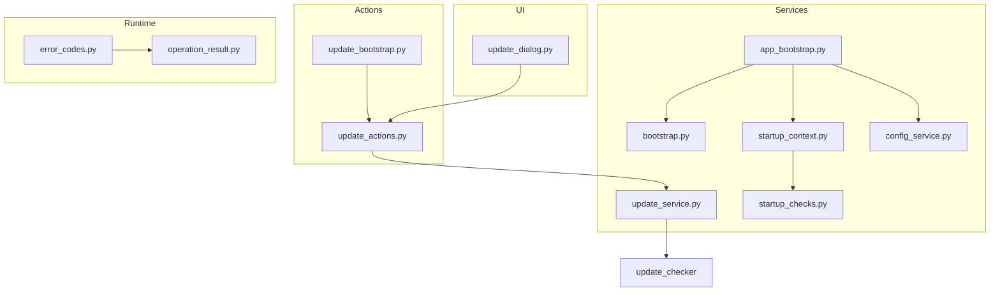
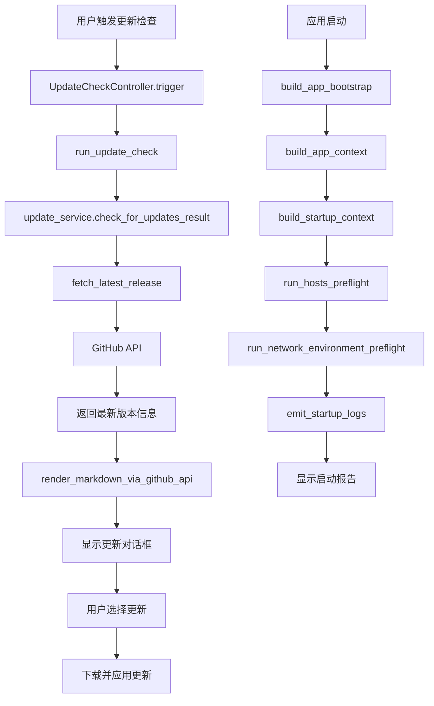
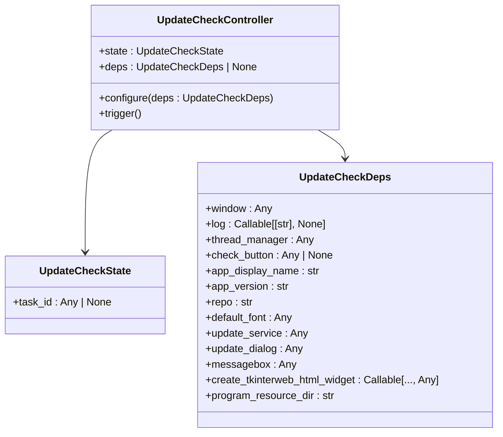
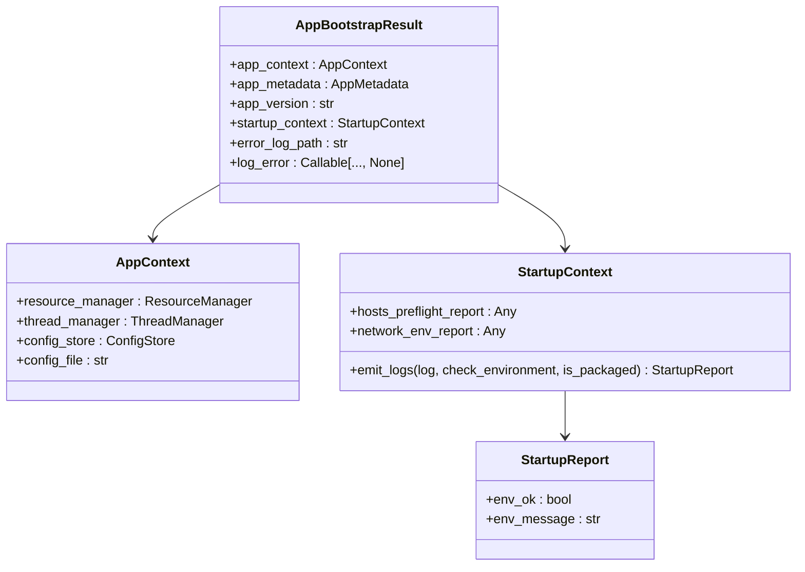
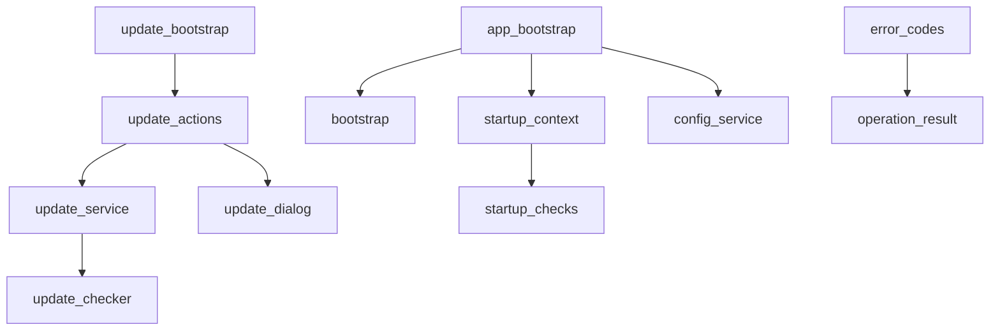

# 更新与启动引导

<cite>
**本文档引用的文件**
- [update_actions.py](file://modules/actions/update_actions.py)
- [update_bootstrap.py](file://modules/actions/update_bootstrap.py)
- [update_service.py](file://modules/services/update_service.py)
- [update_checker.py](file://modules/update/update_checker.py)
- [app_bootstrap.py](file://modules/services/app_bootstrap.py)
- [bootstrap.py](file://modules/services/bootstrap.py)
- [startup_checks.py](file://modules/services/startup_checks.py)
- [startup_context.py](file://modules/services/startup_context.py)
- [config_service.py](file://modules/services/config_service.py)
- [update_dialog.py](file://modules/ui/update_dialog.py)
- [error_codes.py](file://modules/runtime/error_codes.py)
- [operation_result.py](file://modules/runtime/operation_result.py)
</cite>

## 目录
1. [简介](#简介)
2. [项目结构](#项目结构)
3. [核心组件](#核心组件)
4. [架构概述](#架构概述)
5. [详细组件分析](#详细组件分析)
6. [依赖分析](#依赖分析)
7. [性能考虑](#性能考虑)
8. [故障排除指南](#故障排除指南)
9. [结论](#结论)

## 简介
本文档系统讲解 `update_actions.py` 与 `update_bootstrap.py` 在应用自动更新和初始化引导中的作用。说明 `check_for_updates`、`download_update`、`apply_update` 等操作的实现机制及其与后端服务的通信协议。分析应用首次启动或版本升级时的引导流程，包括配置迁移、环境检测与默认设置初始化。解释更新过程中 UI 状态同步、进度反馈与回滚策略。为开发者集成自定义更新源或扩展启动检查项提供开发指引。

## 项目结构
项目结构清晰地组织了各个功能模块，其中与更新和启动引导相关的模块主要位于 `modules/actions` 和 `modules/services` 目录下。`update_actions.py` 和 `update_bootstrap.py` 文件位于 `modules/actions` 目录，负责处理更新操作的逻辑和引导流程的初始化。

**图源**
- [update_actions.py](file://modules/actions/update_actions.py)
- [update_bootstrap.py](file://modules/actions/update_bootstrap.py)
- [update_service.py](file://modules/services/update_service.py)
- [app_bootstrap.py](file://modules/services/app_bootstrap.py)
- [bootstrap.py](file://modules/services/bootstrap.py)
- [startup_checks.py](file://modules/services/startup_checks.py)
- [startup_context.py](file://modules/services/startup_context.py)
- [config_service.py](file://modules/services/config_service.py)
- [update_dialog.py](file://modules/ui/update_dialog.py)
- [error_codes.py](file://modules/runtime/error_codes.py)
- [operation_result.py](file://modules/runtime/operation_result.py)

**节源**
- [update_actions.py](file://modules/actions/update_actions.py)
- [update_bootstrap.py](file://modules/actions/update_bootstrap.py)
- [update_service.py](file://modules/services/update_service.py)
- [app_bootstrap.py](file://modules/services/app_bootstrap.py)

## 核心组件
`update_actions.py` 和 `update_bootstrap.py` 是实现应用自动更新和启动引导的核心组件。`update_actions.py` 定义了更新检查的状态和控制器，以及执行更新检查的函数。`update_bootstrap.py` 则负责构建和配置更新控制器，确保其依赖项正确设置。

**节源**
- [update_actions.py](file://modules/actions/update_actions.py#L1-L127)
- [update_bootstrap.py](file://modules/actions/update_bootstrap.py#L1-L53)

## 架构概述
系统的更新与启动引导架构由多个组件协同工作。`update_actions.py` 中的 `UpdateCheckController` 负责触发更新检查，`update_service.py` 提供了与后端服务通信的接口，`update_checker.py` 封装了 GitHub 最新版本查询与版本号比较逻辑。`app_bootstrap.py` 和 `startup_context.py` 负责应用启动时的初始化和环境检测。

**图源**
- [update_actions.py](file://modules/actions/update_actions.py#L24-L27)
- [update_service.py](file://modules/services/update_service.py#L87-L128)
- [update_checker.py](file://modules/update/update_checker.py#L284-L320)
- [app_bootstrap.py](file://modules/services/app_bootstrap.py#L19-L38)
- [startup_context.py](file://modules/services/startup_context.py#L30-L35)
- [startup_checks.py](file://modules/services/startup_checks.py#L25-L55)

**节源**
- [update_actions.py](file://modules/actions/update_actions.py#L24-L27)
- [update_service.py](file://modules/services/update_service.py#L87-L128)
- [update_checker.py](file://modules/update/update_checker.py#L284-L320)
- [app_bootstrap.py](file://modules/services/app_bootstrap.py#L19-L38)
- [startup_context.py](file://modules/services/startup_context.py#L30-L35)
- [startup_checks.py](file://modules/services/startup_checks.py#L25-L55)

## 详细组件分析
### 更新操作分析
`update_actions.py` 中的 `UpdateCheckController` 类负责管理更新检查的状态和依赖项。`run_update_check` 函数执行实际的更新检查，通过 `update_service.check_for_updates_result` 调用后端服务获取最新版本信息，并根据结果更新 UI。

**图源**
- [update_actions.py](file://modules/actions/update_actions.py#L11-L45)

**节源**
- [update_actions.py](file://modules/actions/update_actions.py#L11-L45)

### 启动引导分析
`app_bootstrap.py` 中的 `build_app_bootstrap` 函数负责构建应用的启动上下文，包括 `AppContext`、`AppMetadata`、`AppVersion` 和 `StartupContext`。`StartupContext` 包含了主机预检报告和网络环境报告，用于在启动时进行环境检测。

**图源**
- [app_bootstrap.py](file://modules/services/app_bootstrap.py#L9-L38)
- [bootstrap.py](file://modules/services/bootstrap.py#L10-L29)
- [startup_context.py](file://modules/services/startup_context.py#L9-L35)
- [startup_checks.py](file://modules/services/startup_checks.py#L19-L24)

**节源**
- [app_bootstrap.py](file://modules/services/app_bootstrap.py#L9-L38)
- [bootstrap.py](file://modules/services/bootstrap.py#L10-L29)
- [startup_context.py](file://modules/services/startup_context.py#L9-L35)
- [startup_checks.py](file://modules/services/startup_checks.py#L19-L24)

## 依赖分析
系统中的各个组件通过明确的依赖关系协同工作。`update_actions.py` 依赖于 `update_service.py` 和 `update_dialog.py`，`update_bootstrap.py` 依赖于 `update_actions.py`。`app_bootstrap.py` 依赖于 `bootstrap.py`、`startup_context.py` 和 `config_service.py`。

**图源**
- [update_actions.py](file://modules/actions/update_actions.py)
- [update_bootstrap.py](file://modules/actions/update_bootstrap.py)
- [update_service.py](file://modules/services/update_service.py)
- [app_bootstrap.py](file://modules/services/app_bootstrap.py)
- [bootstrap.py](file://modules/services/bootstrap.py)
- [startup_context.py](file://modules/services/startup_context.py)
- [config_service.py](file://modules/services/config_service.py)
- [update_dialog.py](file://modules/ui/update_dialog.py)
- [error_codes.py](file://modules/runtime/error_codes.py)
- [operation_result.py](file://modules/runtime/operation_result.py)

**节源**
- [update_actions.py](file://modules/actions/update_actions.py)
- [update_bootstrap.py](file://modules/actions/update_bootstrap.py)
- [update_service.py](file://modules/services/update_service.py)
- [app_bootstrap.py](file://modules/services/app_bootstrap.py)
- [bootstrap.py](file://modules/services/bootstrap.py)
- [startup_context.py](file://modules/services/startup_context.py)
- [config_service.py](file://modules/services/config_service.py)
- [update_dialog.py](file://modules/ui/update_dialog.py)
- [error_codes.py](file://modules/runtime/error_codes.py)
- [operation_result.py](file://modules/runtime/operation_result.py)

## 性能考虑
在更新和启动引导过程中，性能是一个重要的考虑因素。`run_update_check` 函数使用多线程来避免阻塞 UI，`fetch_latest_release` 函数设置了超时时间以防止长时间等待。`build_app_bootstrap` 函数在启动时执行必要的初始化操作，确保应用能够快速响应用户。

## 故障排除指南
如果更新检查失败，系统会根据错误代码显示相应的错误消息。常见的错误包括网络错误、远程错误和未解析到版本号。启动时的环境检测也会报告问题，如主机文件写入受限或检测到显式代理配置。

**节源**
- [update_actions.py](file://modules/actions/update_actions.py#L79-L90)
- [startup_checks.py](file://modules/services/startup_checks.py#L25-L55)

## 结论
`update_actions.py` 和 `update_bootstrap.py` 在应用的自动更新和启动引导中扮演着关键角色。通过清晰的架构和组件依赖关系，系统能够有效地管理更新流程和启动初始化。开发者可以基于这些组件集成自定义更新源或扩展启动检查项，以满足特定需求。