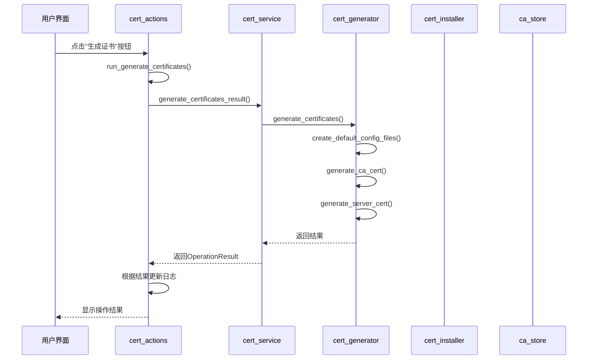
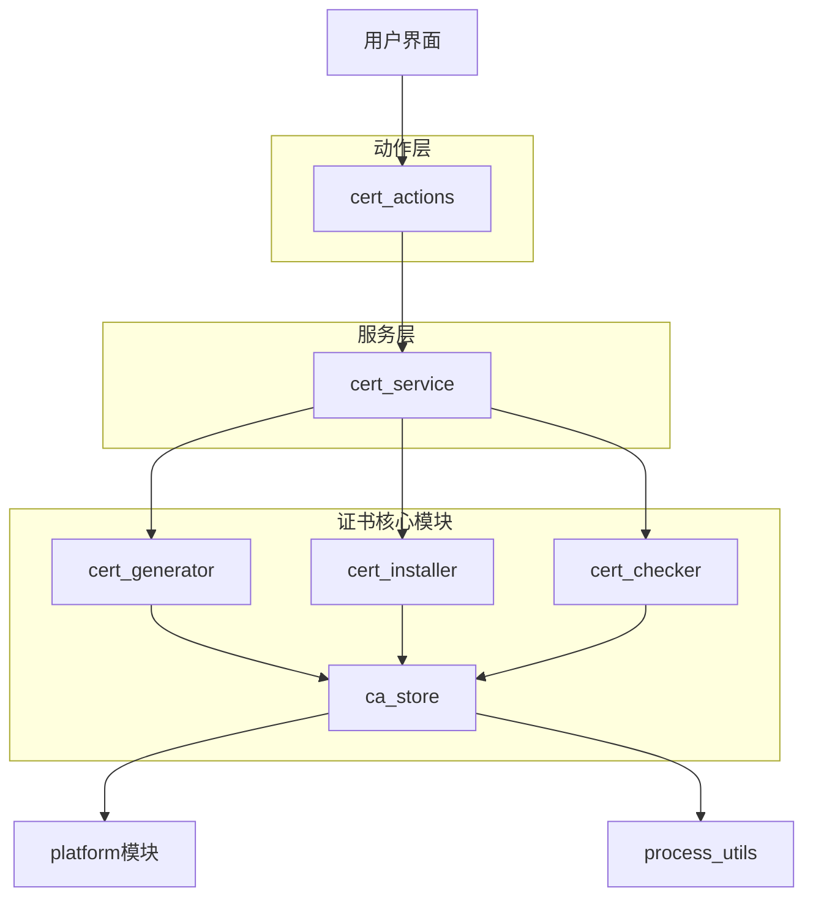

# 证书操作

<cite>
**本文档引用的文件**
- [cert_actions.py](file://modules/actions/cert_actions.py)
- [cert_generator.py](file://modules/cert/cert_generator.py)
- [cert_installer.py](file://modules/cert/cert_installer.py)
- [cert_checker.py](file://modules/cert/cert_checker.py)
- [ca_store.py](file://modules/cert/ca_store.py)
- [cert_service.py](file://modules/services/cert_service.py)
- [operation_result.py](file://modules/runtime/operation_result.py)
- [main_window_builder.py](file://modules/ui/main_window_builder.py)
- [proxy_orchestration.py](file://modules/services/proxy_orchestration.py)
- [startup_checks.py](file://modules/services/startup_checks.py)
</cite>

## 目录
1. [简介](#简介)
2. [核心功能实现](#核心功能实现)
3. [用户交互与后端调用链路](#用户交互与后端调用链路)
4. [模块依赖关系](#模块依赖关系)
5. [启动前证书校验编排逻辑](#启动前证书校验编排逻辑)
6. [常见问题排查](#常见问题排查)
7. [扩展开发指南](#扩展开发指南)

## 简介
本项目通过`cert_actions.py`模块实现了完整的证书生命周期管理功能，包括证书生成、安装、清除等核心操作。系统采用分层架构设计，将证书操作分为UI交互层、业务逻辑层和底层实现层，确保功能的可维护性和可扩展性。证书管理是代理服务正常运行的基础，通过自签名CA证书实现对目标API的HTTPS流量解密和转发。

## 核心功能实现

### generate_ca_certificate功能实现
`generate_ca_certificate`功能通过`run_generate_certificates`函数实现，该函数封装了证书生成的完整流程。函数接收CA证书通用名称、日志输出函数和线程管理器作为参数，通过`cert_service.generate_certificates_result`调用底层服务。实现中使用OpenSSL命令行工具生成2048位RSA密钥对，并创建有效期为100年的CA证书。配置文件采用模块化设计，支持自定义证书扩展属性。

**Section sources**
- [cert_actions.py](file://modules/actions/cert_actions.py#L9-L27)
- [cert_service.py](file://modules/services/cert_service.py#L10-L17)
- [cert_generator.py](file://modules/cert/cert_generator.py#L386-L445)

### install_certificate功能实现
`install_certificate`功能由`run_install_ca_cert`函数实现，负责将生成的CA证书安装到系统信任存储中。该功能通过`cert_service.install_ca_cert_result`调用底层安装逻辑，支持Windows、macOS和Linux三大平台。在Windows系统中使用`certutil`命令将证书添加到"受信任的根证书颁发机构"存储；在macOS中通过特权辅助进程将证书安装到系统钥匙串并设置为完全信任；在Linux系统中则复制证书到`/usr/local/share/ca-certificates/`目录并执行`update-ca-certificates`命令。

**Section sources**
- [cert_actions.py](file://modules/actions/cert_actions.py#L30-L45)
- [cert_service.py](file://modules/services/cert_service.py#L35-L36)
- [cert_installer.py](file://modules/cert/cert_installer.py#L15-L43)
- [ca_store.py](file://modules/cert/ca_store.py#L28-L41)

### check_certificate_trust功能实现
`check_certificate_trust`功能通过`has_existing_ca_cert`函数实现证书信任状态检查。该功能首先调用`check_existing_ca_cert`获取检查结果，然后解析结果中的`exists`标志位。在Windows平台通过`certutil -store Root`命令列出所有受信任的根证书，并解析输出以查找匹配的证书；在macOS平台使用`security find-certificate`命令在系统钥匙串中搜索指定通用名称的CA证书。

**Section sources**
- [cert_checker.py](file://modules/cert/cert_checker.py#L11-L21)
- [ca_store.py](file://modules/cert/ca_store.py#L14-L25)

## 用户交互与后端调用链路

**Diagram sources**
- [main_window_builder.py](file://modules/ui/main_window_builder.py#L50-L52)
- [cert_actions.py](file://modules/actions/cert_actions.py#L9-L27)
- [cert_service.py](file://modules/services/cert_service.py#L10-L17)
- [cert_generator.py](file://modules/cert/cert_generator.py#L386-L445)

## 模块依赖关系

**Diagram sources**
- [cert_actions.py](file://modules/actions/cert_actions.py)
- [cert_service.py](file://modules/services/cert_service.py)
- [cert_generator.py](file://modules/cert/cert_generator.py)
- [cert_installer.py](file://modules/cert/cert_installer.py)
- [cert_checker.py](file://modules/cert/cert_checker.py)
- [ca_store.py](file://modules/cert/ca_store.py)

## 启动前证书校验编排逻辑
系统在启动代理服务前会自动触发证书校验流程，该逻辑由`proxy_orchestration.py`中的`start_proxy_instance_result`函数实现。当用户尝试启动代理时，系统首先检查网络环境，然后验证443端口是否被占用，接着尝试修改hosts文件。在整个流程中，虽然没有直接调用证书检查函数，但证书的正确安装是代理服务正常运行的前提条件。如果证书未正确安装，代理服务器将无法建立HTTPS连接。

**Section sources**
- [proxy_orchestration.py](file://modules/services/proxy_orchestration.py#L153-L184)
- [startup_checks.py](file://modules/services/startup_checks.py)

## 常见问题排查

### 证书生成失败
证书生成失败可能由以下原因导致：
1. OpenSSL未正确安装或不在系统PATH中
2. CA目录权限不足，无法创建配置文件
3. 临时文件创建失败
4. OpenSSL命令执行失败

错误码说明：
- `FILE_NOT_FOUND`: 无法找到必需的配置文件或OpenSSL可执行文件
- `PERMISSION_DENIED`: 无权访问证书目录或创建文件
- `UNKNOWN`: 未预期的异常情况

### 安装权限不足
在macOS系统中安装证书时需要管理员权限。如果用户拒绝权限请求，系统将返回"无法获取管理员权限"的错误。解决方案是重新尝试安装操作，并在弹出的权限请求对话框中输入管理员密码。

**Section sources**
- [cert_generator.py](file://modules/cert/cert_generator.py#L405-L416)
- [ca_store.py](file://modules/cert/ca_store.py#L142-L147)
- [operation_result.py](file://modules/runtime/operation_result.py#L6-L17)

## 扩展开发指南
开发者如需扩展新的证书类型或集成第三方CA，应遵循以下指南：

1. **事务边界控制**: 所有证书操作都应封装在`OperationResult`对象中，确保结果的一致性和可预测性。成功操作返回`OperationResult.success()`，失败操作返回`OperationResult.failure()`并附带详细的错误信息。

2. **用户反馈集成**: 通过`log_func`参数接收日志回调函数，所有操作进度和结果都应通过该函数输出，确保UI层能够实时更新状态。

3. **新证书类型支持**: 在`ca`目录下创建新的`.cnf`和`.subj`配置文件，然后在`generate_server_cert`函数中添加对新域名的支持。

4. **第三方CA集成**: 实现新的证书获取方式，可以替换`generate_ca_cert`函数的逻辑，从第三方CA获取证书而非自签名。

**Section sources**
- [operation_result.py](file://modules/runtime/operation_result.py)
- [cert_generator.py](file://modules/cert/cert_generator.py)
- [cert_actions.py](file://modules/actions/cert_actions.py)