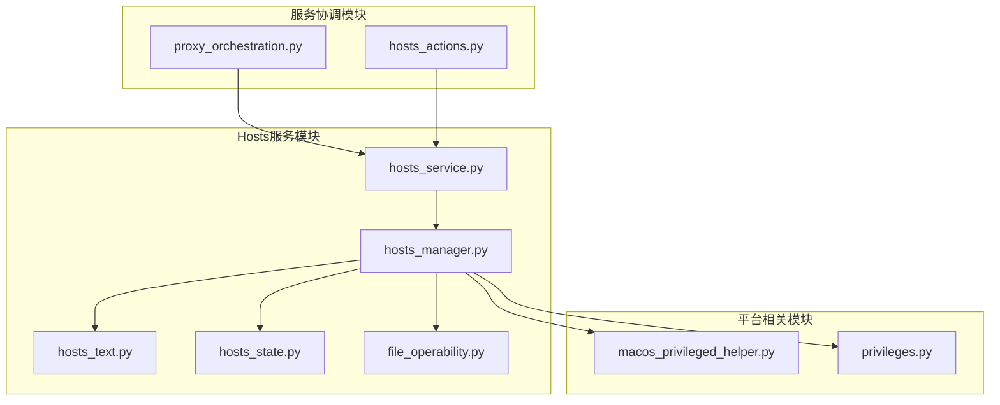
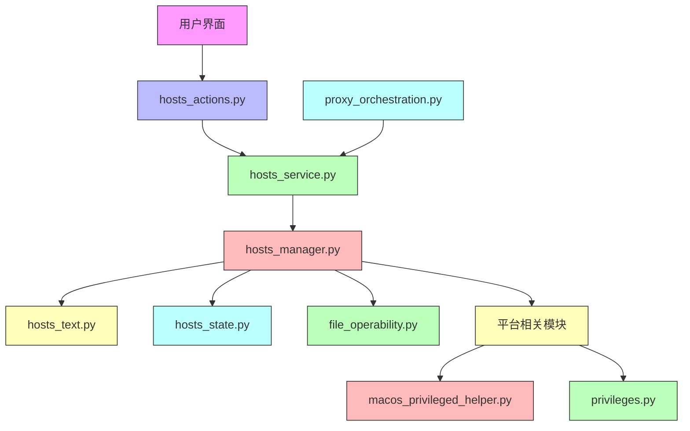
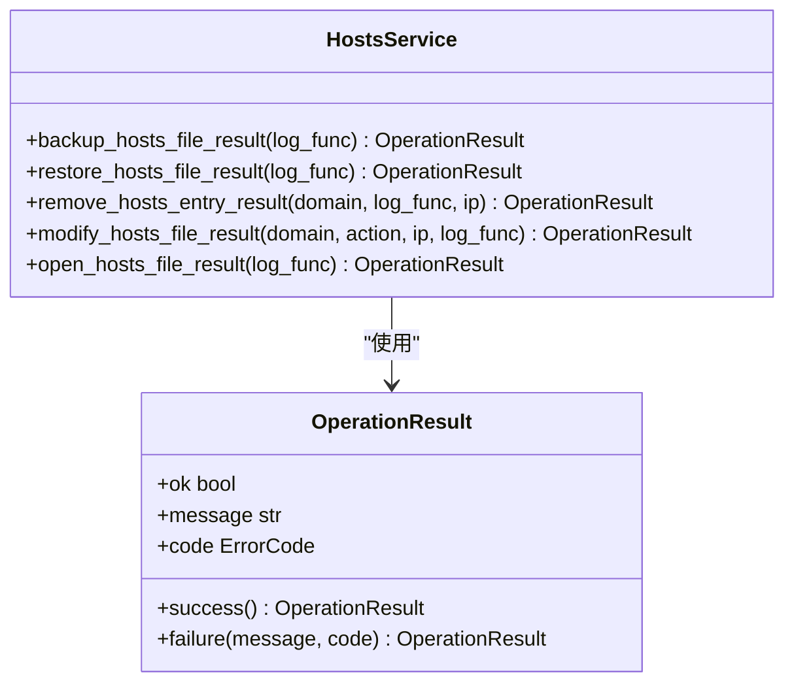
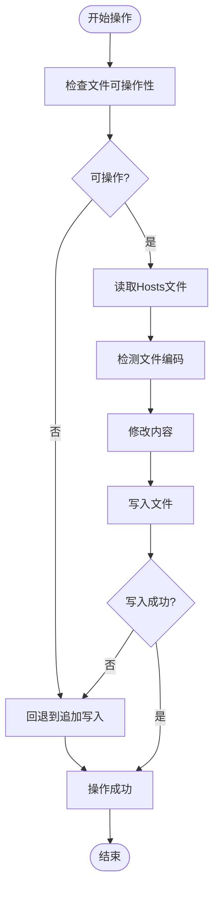
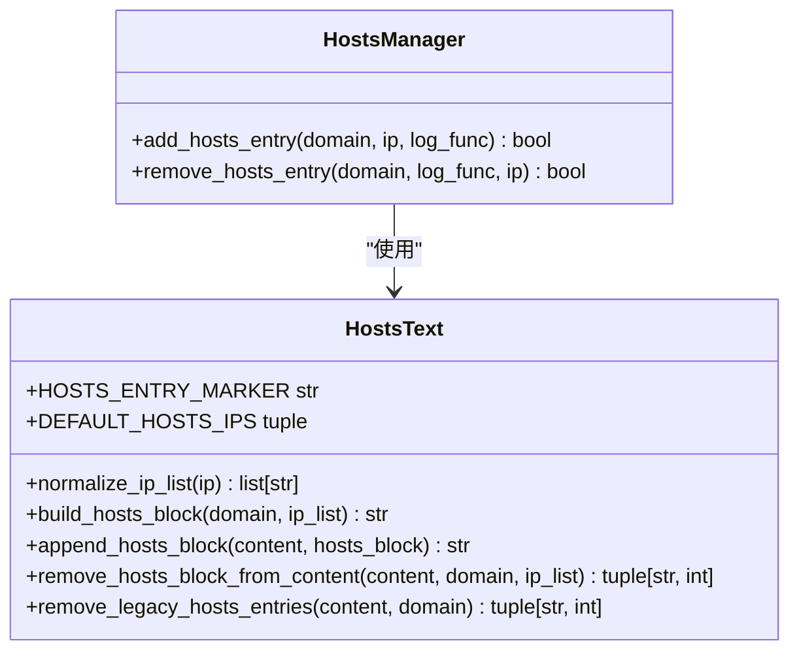
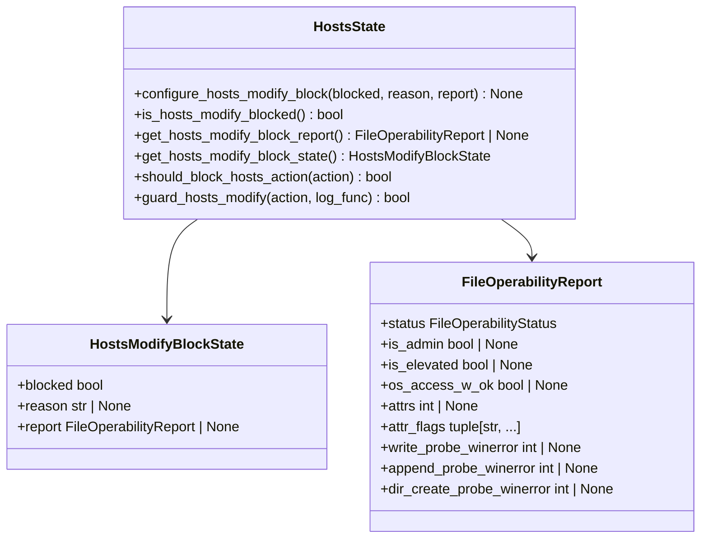
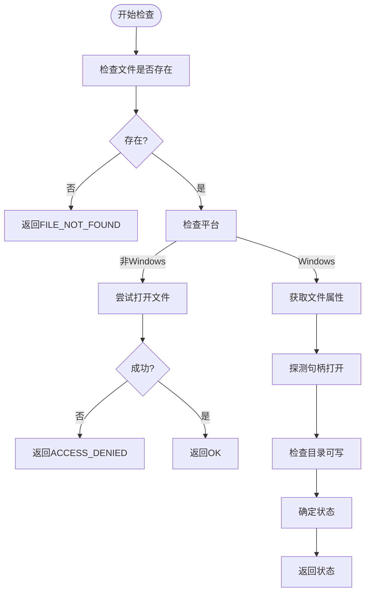
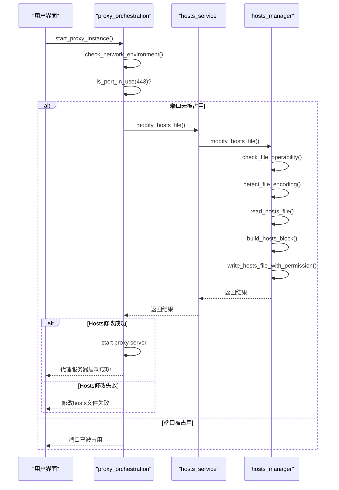
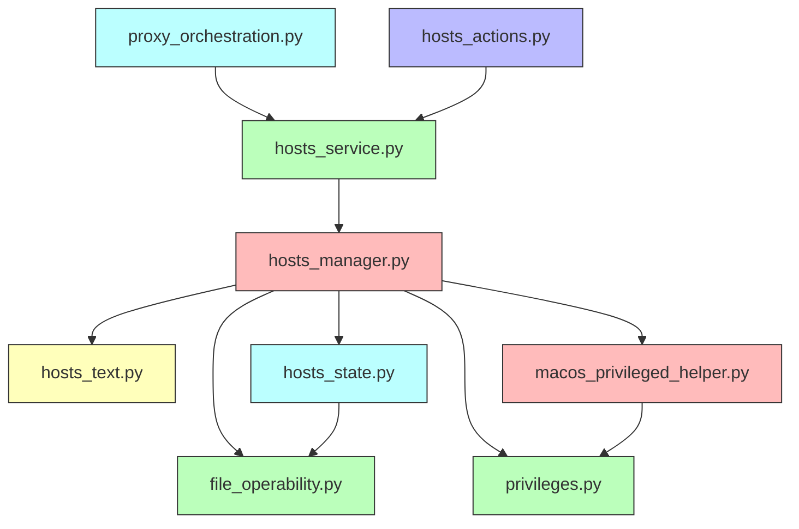

# Hosts服务

<cite>
**本文档引用的文件**
- [hosts_service.py](file://modules/services/hosts_service.py)
- [hosts_manager.py](file://modules/hosts/hosts_manager.py)
- [hosts_text.py](file://modules/hosts/hosts_text.py)
- [hosts_state.py](file://modules/hosts/hosts_state.py)
- [file_operability.py](file://modules/hosts/file_operability.py)
- [proxy_orchestration.py](file://modules/services/proxy_orchestration.py)
- [hosts_actions.py](file://modules/actions/hosts_actions.py)
- [macos_privileged_helper.py](file://modules/platform/macos_privileged_helper.py)
- [privileges.py](file://modules/platform/privileges.py)
</cite>

## 目录
1. [简介](#简介)
2. [项目结构](#项目结构)
3. [核心组件](#核心组件)
4. [架构概述](#架构概述)
5. [详细组件分析](#详细组件分析)
6. [依赖分析](#依赖分析)
7. [性能考虑](#性能考虑)
8. [故障排除指南](#故障排除指南)
9. [结论](#结论)

## 简介
Hosts服务是ModelRelay系统中的关键组件，负责管理系统的Hosts文件操作。该服务提供了一套完整的接口来抽象Hosts文件的操作，包括添加、移除和查询特定域名映射的功能。服务设计考虑了跨平台兼容性，支持Windows、macOS和Linux系统，并实现了安全的读写机制，处理权限提升请求，同时保证原有内容不被破坏。Hosts服务与代理启动流程紧密协同，在启动代理实例时自动触发Hosts修改，确保网络流量正确路由。服务还提供了完善的冲突检测、备份机制和恢复策略，以应对各种可能的故障情况。

## 项目结构
Hosts服务相关的代码主要分布在`modules/hosts`和`modules/services`目录下，形成了清晰的分层架构。`modules/hosts`目录包含Hosts文件操作的核心实现，而`modules/services`目录则提供了更高层次的服务接口。

**Diagram sources**
- [hosts_service.py](file://modules/services/hosts_service.py)
- [hosts_manager.py](file://modules/hosts/hosts_manager.py)
- [hosts_text.py](file://modules/hosts/hosts_text.py)
- [hosts_state.py](file://modules/hosts/hosts_state.py)
- [file_operability.py](file://modules/hosts/file_operability.py)
- [macos_privileged_helper.py](file://modules/platform/macos_privileged_helper.py)
- [privileges.py](file://modules/platform/privileges.py)
- [proxy_orchestration.py](file://modules/services/proxy_orchestration.py)
- [hosts_actions.py](file://modules/actions/hosts_actions.py)

**Section sources**
- [hosts_service.py](file://modules/services/hosts_service.py)
- [hosts_manager.py](file://modules/hosts/hosts_manager.py)
- [hosts_text.py](file://modules/hosts/hosts_text.py)
- [hosts_state.py](file://modules/hosts/hosts_state.py)
- [file_operability.py](file://modules/hosts/file_operability.py)
- [macos_privileged_helper.py](file://modules/platform/macos_privileged_helper.py)
- [privileges.py](file://modules/platform/privileges.py)
- [proxy_orchestration.py](file://modules/services/proxy_orchestration.py)
- [hosts_actions.py](file://modules/actions/hosts_actions.py)

## 核心组件
Hosts服务由多个核心组件构成，每个组件负责特定的功能。`hosts_service.py`提供了高层服务接口，`hosts_manager.py`实现了Hosts文件的安全读写，`hosts_text.py`处理域名条目的解析和生成，`hosts_state.py`管理Hosts修改的状态和阻断机制，`file_operability.py`负责文件可操作性检查。

**Section sources**
- [hosts_service.py](file://modules/services/hosts_service.py#L1-L60)
- [hosts_manager.py](file://modules/hosts/hosts_manager.py#L1-L492)
- [hosts_text.py](file://modules/hosts/hosts_text.py#L1-L110)
- [hosts_state.py](file://modules/hosts/hosts_state.py#L1-L76)
- [file_operability.py](file://modules/hosts/file_operability.py#L1-L211)

## 架构概述
Hosts服务采用分层架构设计，将功能划分为不同的层次，每个层次只与相邻的层次交互。这种设计提高了代码的可维护性和可测试性。

**Diagram sources**
- [hosts_service.py](file://modules/services/hosts_service.py)
- [hosts_manager.py](file://modules/hosts/hosts_manager.py)
- [hosts_text.py](file://modules/hosts/hosts_text.py)
- [hosts_state.py](file://modules/hosts/hosts_state.py)
- [file_operability.py](file://modules/hosts/file_operability.py)
- [macos_privileged_helper.py](file://modules/platform/macos_privileged_helper.py)
- [privileges.py](file://modules/platform/privileges.py)
- [proxy_orchestration.py](file://modules/services/proxy_orchestration.py)
- [hosts_actions.py](file://modules/actions/hosts_actions.py)

## 详细组件分析

### Hosts服务接口分析
`hosts_service.py`模块提供了Hosts服务的高层接口，将底层复杂的文件操作抽象为简单的函数调用。这些接口使用`OperationResult`对象返回操作结果，提供了统一的错误处理机制。

**Diagram sources**
- [hosts_service.py](file://modules/services/hosts_service.py#L13-L47)
- [runtime/operation_result.py](file://modules/runtime/operation_result.py)

**Section sources**
- [hosts_service.py](file://modules/services/hosts_service.py#L1-L60)

### Hosts管理器分析
`hosts_manager.py`是Hosts服务的核心实现，负责安全地读写系统Hosts文件。该模块实现了备份、还原、添加、删除等操作，并处理了跨平台的权限问题。

**Diagram sources**
- [hosts_manager.py](file://modules/hosts/hosts_manager.py#L1-L492)

**Section sources**
- [hosts_manager.py](file://modules/hosts/hosts_manager.py#L1-L492)

### Hosts文本处理分析
`hosts_text.py`模块负责Hosts文件中域名条目的解析和生成逻辑。该模块支持多服务商的规则生成，通过统一的文本块格式管理Hosts条目。

**Diagram sources**
- [hosts_text.py](file://modules/hosts/hosts_text.py#L1-L110)
- [hosts_manager.py](file://modules/hosts/hosts_manager.py)

**Section sources**
- [hosts_text.py](file://modules/hosts/hosts_text.py#L1-L110)

### Hosts状态管理分析
`hosts_state.py`模块管理Hosts修改的状态和阻断机制，防止在不安全的环境下进行Hosts文件修改。

**Diagram sources**
- [hosts_state.py](file://modules/hosts/hosts_state.py#L1-L76)
- [file_operability.py](file://modules/hosts/file_operability.py)

**Section sources**
- [hosts_state.py](file://modules/hosts/hosts_state.py#L1-L76)

### 文件可操作性检查分析
`file_operability.py`模块提供了跨平台的文件可操作性检查功能，用于在实际写入前判断目标文件是否能被当前进程写入。

**Diagram sources**
- [file_operability.py](file://modules/hosts/file_operability.py#L1-L211)

**Section sources**
- [file_operability.py](file://modules/hosts/file_operability.py#L1-L211)

### 代理协同流程分析
Hosts服务与代理启动流程协同工作，在启动代理实例时自动触发Hosts修改。

**Diagram sources**
- [proxy_orchestration.py](file://modules/services/proxy_orchestration.py#L153-L184)
- [hosts_service.py](file://modules/services/hosts_service.py)
- [hosts_manager.py](file://modules/hosts/hosts_manager.py)

**Section sources**
- [proxy_orchestration.py](file://modules/services/proxy_orchestration.py#L153-L184)

## 依赖分析
Hosts服务依赖于多个模块和系统功能，形成了复杂的依赖关系网络。

**Diagram sources**
- [hosts_service.py](file://modules/services/hosts_service.py)
- [hosts_manager.py](file://modules/hosts/hosts_manager.py)
- [hosts_text.py](file://modules/hosts/hosts_text.py)
- [hosts_state.py](file://modules/hosts/hosts_state.py)
- [file_operability.py](file://modules/hosts/file_operability.py)
- [macos_privileged_helper.py](file://modules/platform/macos_privileged_helper.py)
- [privileges.py](file://modules/platform/privileges.py)
- [proxy_orchestration.py](file://modules/services/proxy_orchestration.py)
- [hosts_actions.py](file://modules/actions/hosts_actions.py)

**Section sources**
- [hosts_service.py](file://modules/services/hosts_service.py)
- [hosts_manager.py](file://modules/hosts/hosts_manager.py)
- [hosts_text.py](file://modules/hosts/hosts_text.py)
- [hosts_state.py](file://modules/hosts/hosts_state.py)
- [file_operability.py](file://modules/hosts/file_operability.py)
- [macos_privileged_helper.py](file://modules/platform/macos_privileged_helper.py)
- [privileges.py](file://modules/platform/privileges.py)
- [proxy_orchestration.py](file://modules/services/proxy_orchestration.py)
- [hosts_actions.py](file://modules/actions/hosts_actions.py)

## 性能考虑
Hosts服务在设计时考虑了性能因素，通过多种机制优化操作效率。服务使用原子性操作来减少文件读写次数，避免了多次I/O操作带来的性能开销。对于大型Hosts文件，服务采用流式处理方式，避免一次性加载整个文件到内存中。在跨平台权限处理方面，服务实现了持久化的管理员权限会话，避免了每次操作都需要重新请求权限的开销。

## 故障排除指南
Hosts服务提供了完善的错误处理和日志记录机制，帮助用户诊断和解决常见问题。

**Section sources**
- [hosts_manager.py](file://modules/hosts/hosts_manager.py)
- [hosts_service.py](file://modules/services/hosts_service.py)
- [runtime/result_messages.py](file://modules/runtime/result_messages.py)

### 常见问题及解决方案
1. **权限不足问题**
   - 现象：操作失败，提示"权限不足"
   - 解决方案：以管理员身份运行程序，或在macOS上授权管理员权限

2. **Hosts文件未生效**
   - 现象：修改后域名解析未按预期工作
   - 解决方案：清除DNS缓存，重启网络服务，或重启系统

3. **文件编码问题**
   - 现象：读取或写入Hosts文件时出现乱码
   - 解决方案：服务会自动检测文件编码，如仍出现问题，可手动备份并重新创建Hosts文件

4. **安全软件拦截**
   - 现象：操作失败，提示"安全软件或只读属性锁定了hosts"
   - 解决方案：暂时禁用安全软件的Hosts文件保护功能，或手动解除文件只读属性

5. **备份文件丢失**
   - 现象：无法还原Hosts文件
   - 解决方案：检查用户数据目录中的备份文件，如无备份，可从系统默认备份中恢复

## 结论
Hosts服务是ModelRelay系统中一个功能完整、设计精良的组件。通过分层架构和模块化设计，服务实现了Hosts文件操作的抽象化，提供了安全、可靠的跨平台Hosts管理功能。服务与代理启动流程紧密集成，确保了网络流量的正确路由。完善的备份、恢复和错误处理机制保证了系统的稳定性和可靠性。未来可以考虑增加更多高级功能，如Hosts规则的版本管理、冲突自动解决、以及更精细的权限控制策略。