# Services模块

<cite>
**本文档中引用的文件**  
- [cert_service.py](file://modules/services/cert_service.py)
- [hosts_service.py](file://modules/services/hosts_service.py)
- [proxy_orchestration.py](file://modules/services/proxy_orchestration.py)
- [config_service.py](file://modules/services/config_service.py)
- [logging_service.py](file://modules/services/logging_service.py)
- [privilege_service.py](file://modules/services/privilege_service.py)
- [bootstrap.py](file://modules/services/bootstrap.py)
- [app_bootstrap.py](file://modules/services/app_bootstrap.py)
- [startup_context.py](file://modules/services/startup_context.py)
- [startup_checks.py](file://modules/services/startup_checks.py)
- [privileges.py](file://modules/platform/privileges.py)
- [macos_privileged_helper.py](file://modules/platform/macos_privileged_helper.py)
- [operation_result.py](file://modules/runtime/operation_result.py)
- [error_codes.py](file://modules/runtime/error_codes.py)
</cite>

## 目录
1. [简介](#简介)
2. [项目结构](#项目结构)
3. [核心组件](#核心组件)
4. [架构概述](#架构概述)
5. [详细组件分析](#详细组件分析)
6. [依赖分析](#依赖分析)
7. [性能考虑](#性能考虑)
8. [故障排除指南](#故障排除指南)
9. [结论](#结论)

## 简介
Services模块是ModelRelay应用的核心业务逻辑中枢，负责协调证书管理、代理服务编排、配置持久化、权限提升等关键功能。该模块通过清晰的职责划分和依赖注入机制，实现了高内聚、低耦合的架构设计。作为副作用管理的边界，Services模块封装了所有与外部系统（文件系统、网络、操作系统权限）的交互，为上层UI和控制逻辑提供稳定、安全的接口契约。

## 项目结构

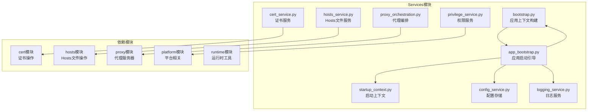

**图示来源**
- [bootstrap.py](file://modules/services/bootstrap.py)
- [app_bootstrap.py](file://modules/services/app_bootstrap.py)
- [startup_context.py](file://modules/services/startup_context.py)
- [config_service.py](file://modules/services/config_service.py)
- [logging_service.py](file://modules/services/logging_service.py)

## 核心组件

Services模块的核心组件包括`cert_service.py`、`hosts_service.py`、`proxy_orchestration.py`、`config_service.py`、`logging_service.py`和`privilege_service.py`。这些服务分别封装了证书生命周期管理、Hosts文件操作、代理服务协调、配置持久化、日志记录和权限提升等关键业务逻辑。`bootstrap.py`和`app_bootstrap.py`共同构成了应用的启动引导流程，负责初始化环境、检查依赖并恢复应用状态。`startup_context.py`中的上下文对象为服务间依赖注入提供了基础。

**本节来源**
- [cert_service.py](file://modules/services/cert_service.py)
- [hosts_service.py](file://modules/services/hosts_service.py)
- [proxy_orchestration.py](file://modules/services/proxy_orchestration.py)
- [config_service.py](file://modules/services/config_service.py)
- [logging_service.py](file://modules/services/logging_service.py)
- [privilege_service.py](file://modules/services/privilege_service.py)
- [bootstrap.py](file://modules/services/bootstrap.py)
- [app_bootstrap.py](file://modules/services/app_bootstrap.py)
- [startup_context.py](file://modules/services/startup_context.py)

## 架构概述

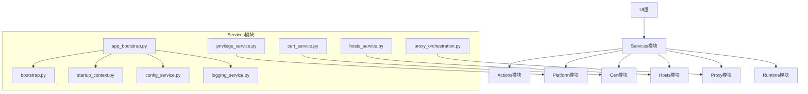

**图示来源**
- [app_bootstrap.py](file://modules/services/app_bootstrap.py)
- [bootstrap.py](file://modules/services/bootstrap.py)
- [startup_context.py](file://modules/services/startup_context.py)
- [config_service.py](file://modules/services/config_service.py)
- [logging_service.py](file://modules/services/logging_service.py)
- [cert_service.py](file://modules/services/cert_service.py)
- [hosts_service.py](file://modules/services/hosts_service.py)
- [proxy_orchestration.py](file://modules/services/proxy_orchestration.py)
- [privilege_service.py](file://modules/services/privilege_service.py)

## 详细组件分析

### 证书服务分析

`cert_service.py`模块封装了证书生命周期管理的所有操作，包括证书生成、安装、检查和清理。该服务通过调用底层`modules.cert`包中的具体实现，为上层提供了统一的接口。所有操作均返回`OperationResult`对象，确保了错误处理的一致性。

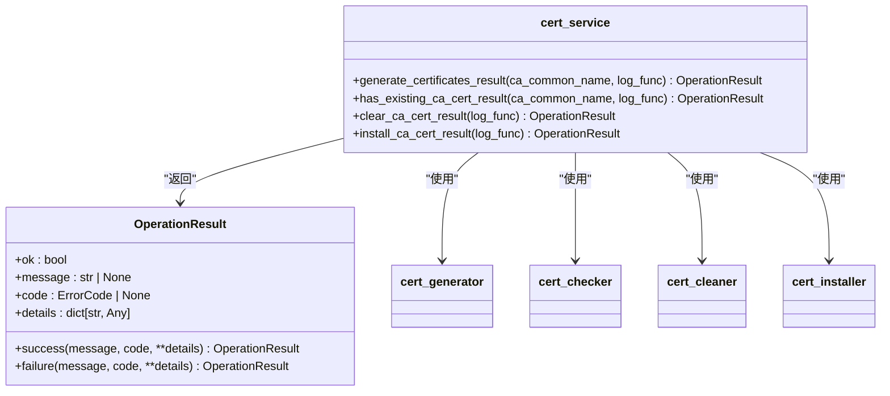

**图示来源**
- [cert_service.py](file://modules/services/cert_service.py)
- [operation_result.py](file://modules/runtime/operation_result.py)

**本节来源**
- [cert_service.py](file://modules/services/cert_service.py)

### Hosts文件服务分析

`hosts_service.py`模块抽象了对系统Hosts文件的所有操作，包括备份、还原、修改和打开。该服务通过`modules.hosts`包实现具体功能，并为UI层提供了带有结果封装的接口。服务设计考虑了不同操作系统的兼容性，并通过`OperationResult`对象返回操作状态。

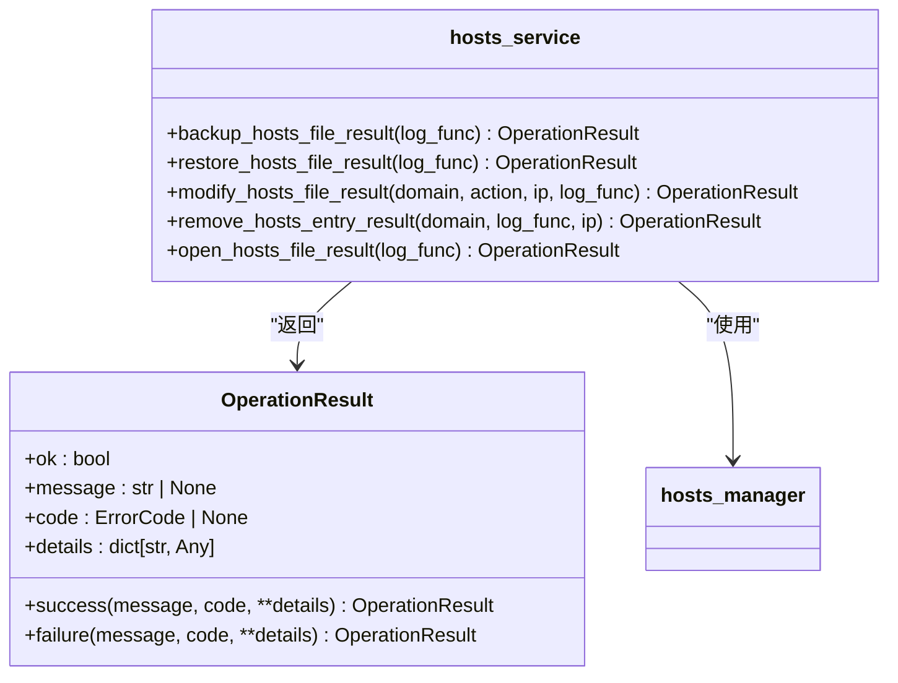

**图示来源**
- [hosts_service.py](file://modules/services/hosts_service.py)
- [operation_result.py](file://modules/runtime/operation_result.py)

**本节来源**
- [hosts_service.py](file://modules/services/hosts_service.py)

### 代理编排服务分析

`proxy_orchestration.py`模块是代理服务的核心协调者，负责代理服务器的启动、停止和重启。该服务通过依赖注入的方式接收所需组件，实现了高内聚、低耦合的设计。服务包含了端口检查、Hosts文件修改、网络环境预检等关键逻辑，确保代理服务能够正确启动。

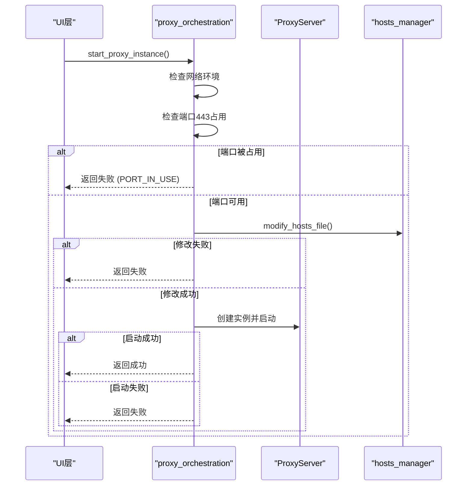

**图示来源**
- [proxy_orchestration.py](file://modules/services/proxy_orchestration.py)
- [proxy_server.py](file://modules/proxy/proxy_server.py)
- [hosts_manager.py](file://modules/hosts/hosts_manager.py)

**本节来源**
- [proxy_orchestration.py](file://modules/services/proxy_orchestration.py)

### 配置服务分析

`config_service.py`模块提供了配置的持久化机制和热加载能力。通过`ConfigStore`类，服务实现了对YAML配置文件的读写操作，支持配置组、全局配置和当前配置的管理。服务设计考虑了文件操作的异常处理，确保了数据的完整性和可靠性。

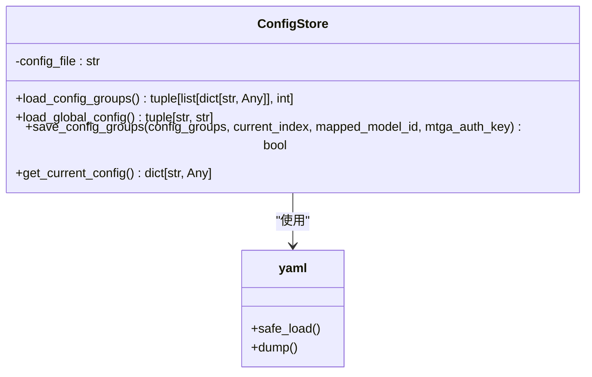

**图示来源**
- [config_service.py](file://modules/services/config_service.py)

**本节来源**
- [config_service.py](file://modules/services/config_service.py)

### 日志服务分析

`logging_service.py`模块定义了统一的日志记录策略，包括错误日志的文件输出和全局异常捕获。服务通过`setup_error_logging`函数配置日志处理器，将ERROR级别以上的日志写入用户数据目录。`install_global_exception_hook`函数确保了未捕获的异常也能被记录，便于问题排查。

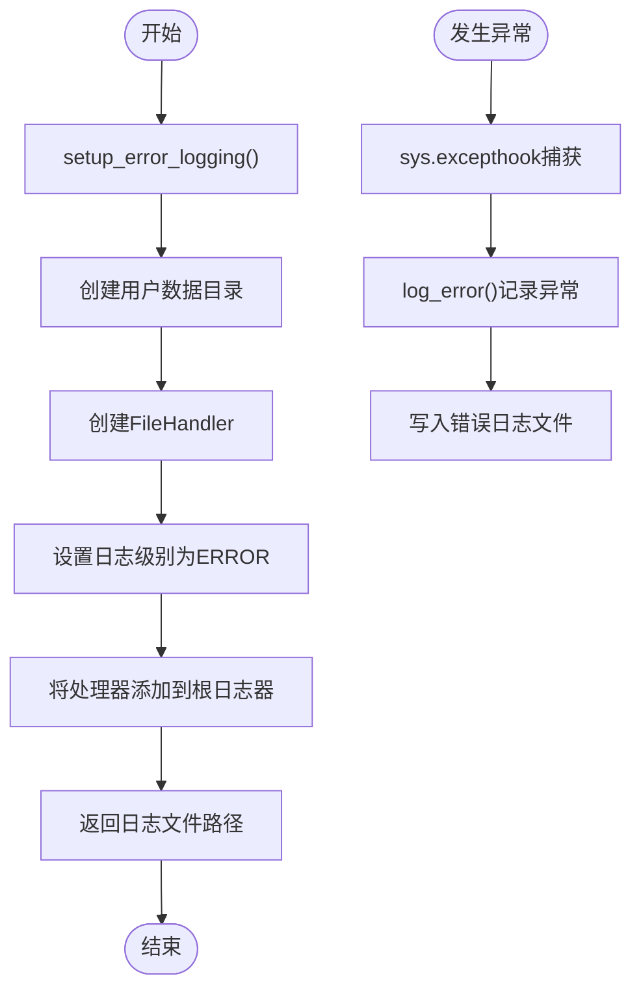

**图示来源**
- [logging_service.py](file://modules/services/logging_service.py)

**本节来源**
- [logging_service.py](file://modules/services/logging_service.py)

### 权限服务分析

`privilege_service.py`模块封装了在Windows和macOS上提升权限的实现差异。服务通过`check_is_admin`检查当前进程是否具有管理员权限，并通过`run_as_admin`请求提权。在macOS上，服务利用`macos_privileged_helper.py`实现持久化的管理员权限，通过Unix Socket与root进程通信。

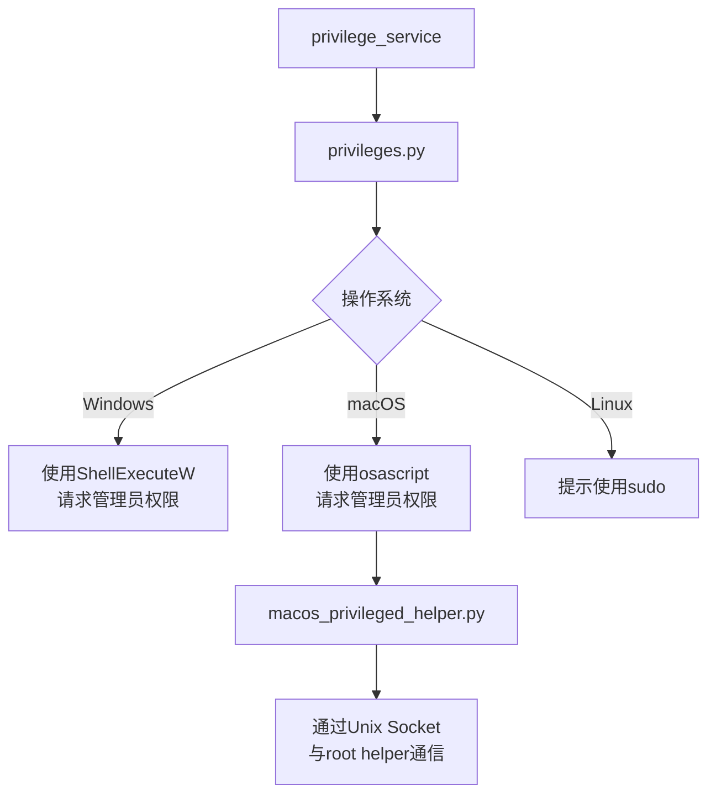

**图示来源**
- [privilege_service.py](file://modules/services/privilege_service.py)
- [privileges.py](file://modules/platform/privileges.py)
- [macos_privileged_helper.py](file://modules/platform/macos_privileged_helper.py)

**本节来源**
- [privilege_service.py](file://modules/services/privilege_service.py)
- [privileges.py](file://modules/platform/privileges.py)
- [macos_privileged_helper.py](file://modules/platform/macos_privileged_helper.py)

### 启动引导流程分析

`bootstrap.py`和`app_bootstrap.py`共同构成了应用的启动引导流程。`bootstrap.py`定义了`AppContext`数据类和`build_app_context`函数，负责创建应用的核心上下文。`app_bootstrap.py`则通过`build_app_bootstrap`函数协调日志、配置、元数据等服务的初始化，完成应用的启动准备。

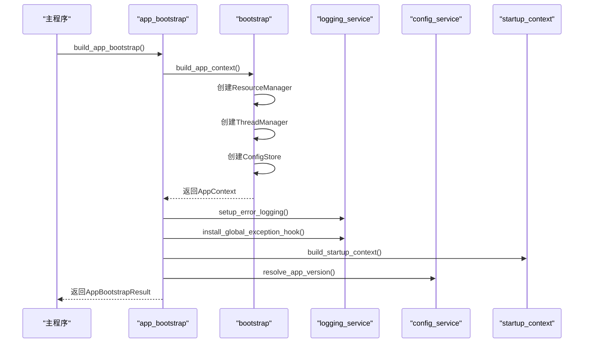

**图示来源**
- [app_bootstrap.py](file://modules/services/app_bootstrap.py)
- [bootstrap.py](file://modules/services/bootstrap.py)
- [logging_service.py](file://modules/services/logging_service.py)
- [startup_context.py](file://modules/services/startup_context.py)

**本节来源**
- [app_bootstrap.py](file://modules/services/app_bootstrap.py)
- [bootstrap.py](file://modules/services/bootstrap.py)

### 服务接口契约规范

Services模块的所有服务接口遵循统一的契约规范：
1. **输入验证**：所有函数参数均通过类型注解明确指定，关键参数在函数内部进行有效性检查。
2. **错误码返回**：所有操作结果通过`OperationResult`对象返回，包含`ok`标志、`message`描述和`code`错误码。
3. **线程安全保证**：对于可能被多线程调用的服务，通过`threading.Lock`等机制确保线程安全。
4. **依赖注入**：服务间依赖通过函数参数显式传递，避免全局状态，提高可测试性。

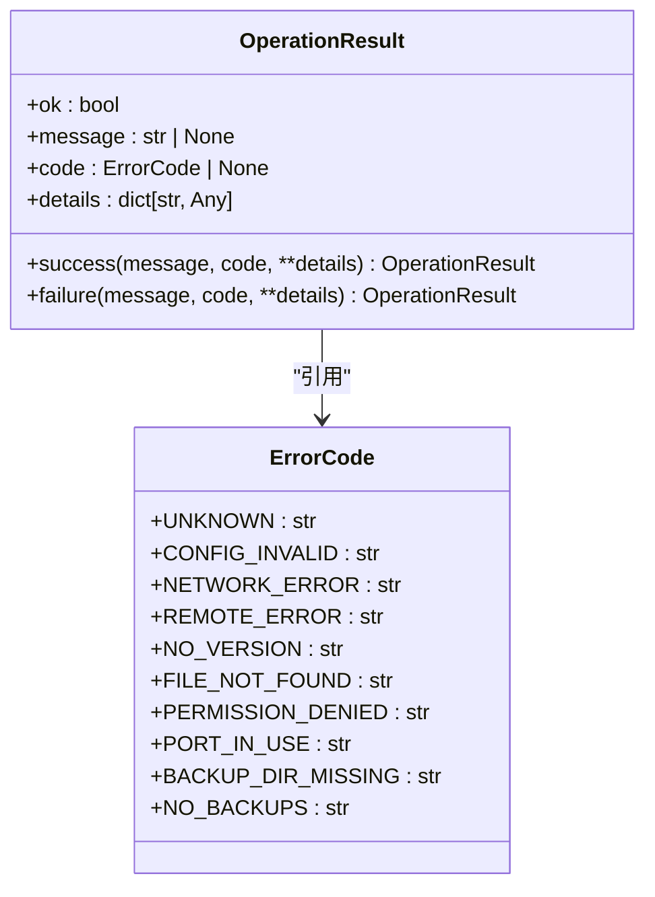

**图示来源**
- [operation_result.py](file://modules/runtime/operation_result.py)
- [error_codes.py](file://modules/runtime/error_codes.py)

**本节来源**
- [operation_result.py](file://modules/runtime/operation_result.py)
- [error_codes.py](file://modules/runtime/error_codes.py)

## 依赖分析

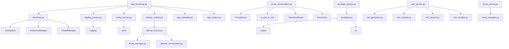

**图示来源**
- [app_bootstrap.py](file://modules/services/app_bootstrap.py)
- [bootstrap.py](file://modules/services/bootstrap.py)
- [logging_service.py](file://modules/services/logging_service.py)
- [config_service.py](file://modules/services/config_service.py)
- [startup_context.py](file://modules/services/startup_context.py)
- [proxy_orchestration.py](file://modules/services/proxy_orchestration.py)
- [privilege_service.py](file://modules/services/privilege_service.py)
- [cert_service.py](file://modules/services/cert_service.py)
- [hosts_service.py](file://modules/services/hosts_service.py)

**本节来源**
- [app_bootstrap.py](file://modules/services/app_bootstrap.py)
- [bootstrap.py](file://modules/services/bootstrap.py)
- [logging_service.py](file://modules/services/logging_service.py)
- [config_service.py](file://modules/services/config_service.py)
- [startup_context.py](file://modules/services/startup_context.py)
- [proxy_orchestration.py](file://modules/services/proxy_orchestration.py)
- [privilege_service.py](file://modules/services/privilege_service.py)
- [cert_service.py](file://modules/services/cert_service.py)
- [hosts_service.py](file://modules/services/hosts_service.py)

## 性能考虑
Services模块在设计时考虑了性能因素。通过`ThreadManager`管理后台线程，避免阻塞UI主线程。`ConfigStore`的配置加载和保存操作使用了异常处理，防止因文件I/O问题导致应用崩溃。代理服务启动前进行端口检查，避免了无效的启动尝试。日志服务采用异步写入，减少对主流程的影响。

## 故障排除指南

当Services模块出现问题时，可参考以下步骤进行排查：
1. 检查错误日志文件，路径由`setup_error_logging`返回。
2. 验证配置文件是否存在且格式正确。
3. 确认端口443未被其他进程占用。
4. 检查Hosts文件是否具有读写权限。
5. 在macOS上，确认`macos_privileged_helper.py`能够正常启动root helper。

**本节来源**
- [logging_service.py](file://modules/services/logging_service.py)
- [config_service.py](file://modules/services/config_service.py)
- [proxy_orchestration.py](file://modules/services/proxy_orchestration.py)
- [hosts_service.py](file://modules/services/hosts_service.py)
- [privilege_service.py](file://modules/services/privilege_service.py)

## 结论
Services模块作为ModelRelay应用的业务逻辑中枢，成功地将复杂的系统操作封装为清晰、可靠的服务接口。通过依赖注入和统一的错误处理机制，模块实现了高内聚、低耦合的设计目标。启动引导流程确保了应用环境的正确初始化，而详细的日志记录和错误码体系则为故障排查提供了有力支持。该模块的设计为未来功能扩展提供了良好的基础。