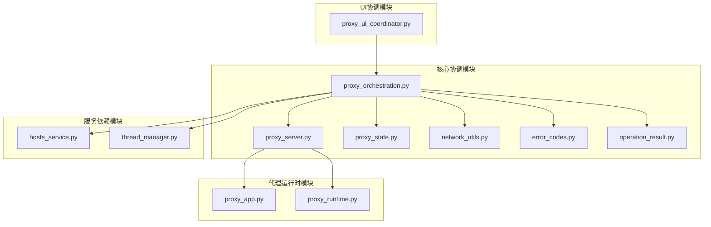
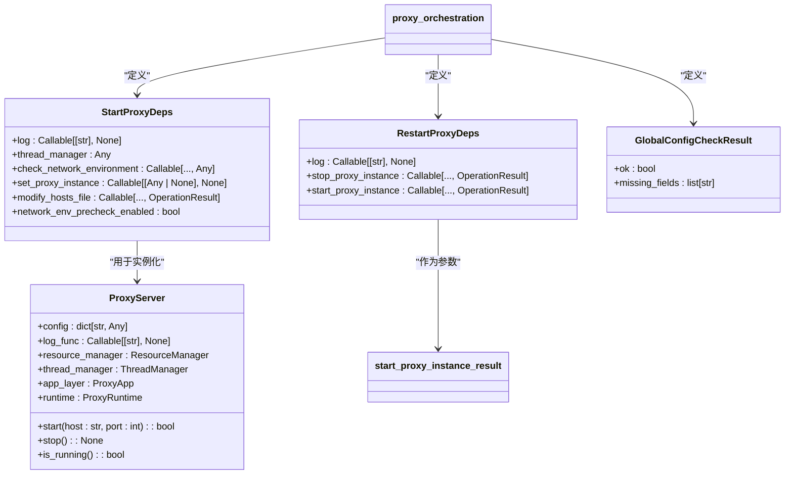
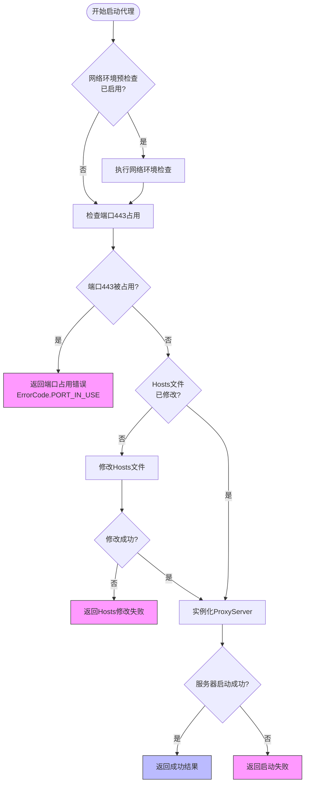
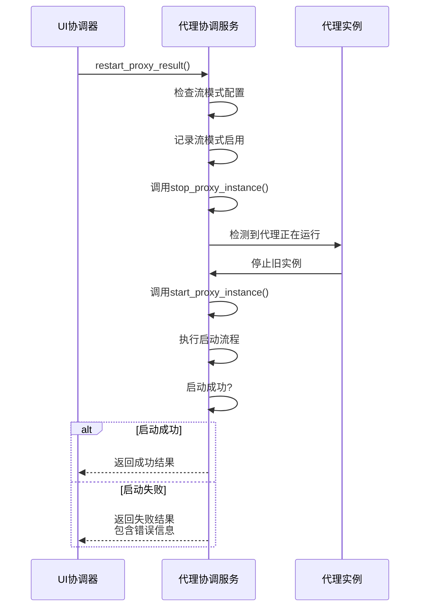
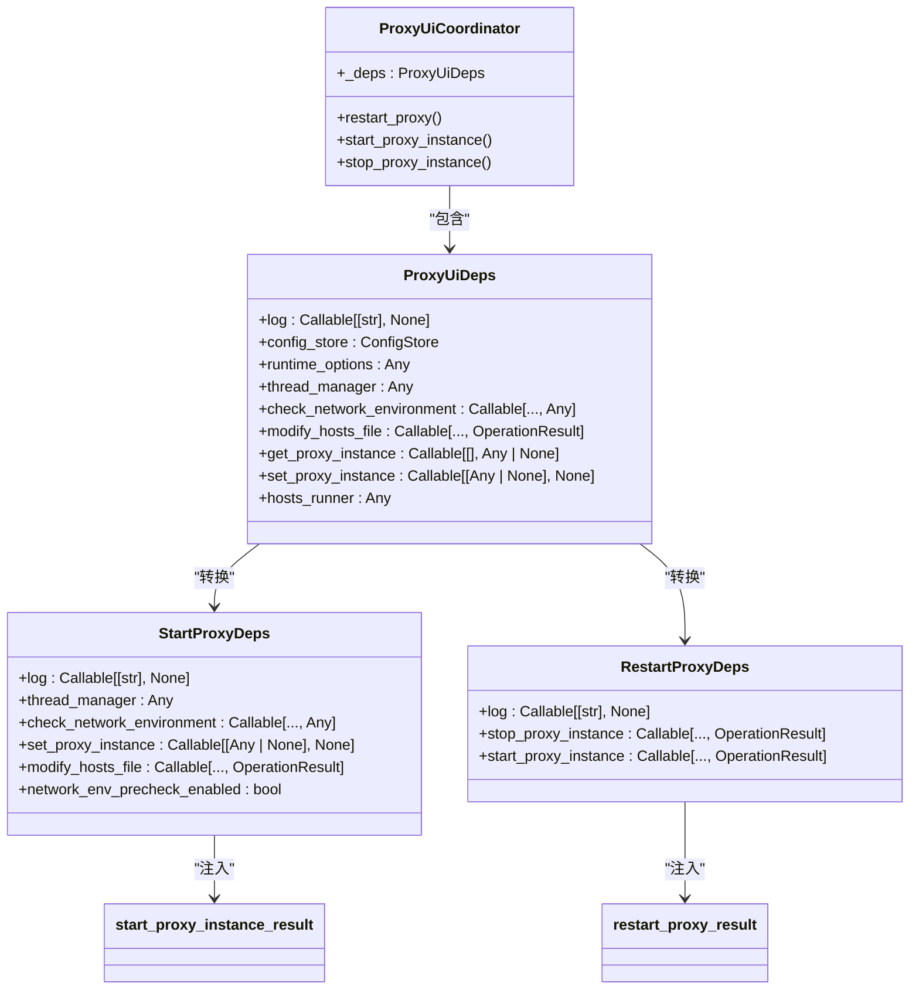
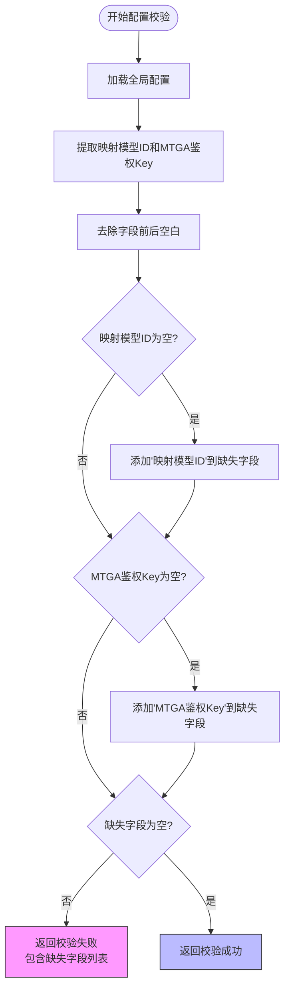
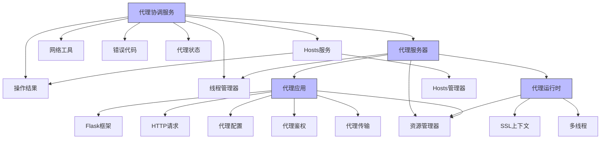

# 代理协调服务

<cite>
**本文档引用的文件**
- [proxy_orchestration.py](file://modules/services/proxy_orchestration.py)
- [proxy_server.py](file://modules/proxy/proxy_server.py)
- [proxy_state.py](file://modules/services/proxy_state.py)
- [proxy_runtime.py](file://modules/proxy/proxy_runtime.py)
- [proxy_app.py](file://modules/proxy/proxy_app.py)
- [network_utils.py](file://modules/network/network_utils.py)
- [error_codes.py](file://modules/runtime/error_codes.py)
- [operation_result.py](file://modules/runtime/operation_result.py)
- [hosts_service.py](file://modules/services/hosts_service.py)
- [thread_manager.py](file://modules/runtime/thread_manager.py)
- [proxy_ui_coordinator.py](file://modules/actions/proxy_ui_coordinator.py)
- [app_bootstrap.py](file://modules/services/app_bootstrap.py)
</cite>

## 目录
1. [引言](#引言)
2. [项目结构](#项目结构)
3. [核心组件](#核心组件)
4. [架构概述](#架构概述)
5. [详细组件分析](#详细组件分析)
6. [依赖分析](#依赖分析)
7. [性能考虑](#性能考虑)
8. [故障排除指南](#故障排除指南)
9. [结论](#结论)

## 引言
本文档深入分析了代理协调服务的完整生命周期管理机制，重点阐述了`proxy_orchestration.py`模块如何协调代理服务的启动、停止与重启全流程。文档详细说明了`start_proxy_instance`函数如何集成端口占用检查、Hosts文件修改和`ProxyServer`实例化等关键步骤，解释了`restart_proxy_result`中对异常情况的处理策略，并描述了`StartProxyDeps`和`RestartProxyDeps`依赖注入模式如何解耦业务逻辑与具体实现。

**Section sources**
- [proxy_orchestration.py](file://modules/services/proxy_orchestration.py#L1-L200)

## 项目结构
代理协调服务位于`modules/services/`目录下，其核心文件`proxy_orchestration.py`与其他模块紧密协作，形成了一个完整的代理服务管理系统。该系统通过清晰的模块化设计，将代理服务的协调逻辑、运行时管理、网络配置和状态管理分离到不同的模块中。

**Diagram sources**
- [proxy_orchestration.py](file://modules/services/proxy_orchestration.py#L1-L200)
- [proxy_server.py](file://modules/proxy/proxy_server.py#L1-L65)

**Section sources**
- [proxy_orchestration.py](file://modules/services/proxy_orchestration.py#L1-L200)
- [proxy_server.py](file://modules/proxy/proxy_server.py#L1-L65)

## 核心组件
代理协调服务的核心组件包括`StartProxyDeps`和`RestartProxyDeps`两个依赖注入数据类，以及`ensure_global_config_ready`、`start_proxy_instance_result`、`restart_proxy_result`等关键函数。这些组件共同实现了代理服务生命周期的完整管理。

**Section sources**
- [proxy_orchestration.py](file://modules/services/proxy_orchestration.py#L14-L200)

## 架构概述
代理协调服务采用依赖注入模式，将业务逻辑与具体实现解耦。通过`StartProxyDeps`和`RestartProxyDeps`数据类，将日志记录、线程管理、网络环境检查、Hosts文件修改等依赖项注入到核心协调函数中，实现了高度的模块化和可测试性。

**Diagram sources**
- [proxy_orchestration.py](file://modules/services/proxy_orchestration.py#L14-L51)
- [proxy_server.py](file://modules/proxy/proxy_server.py#L14-L35)

## 详细组件分析

### 启动流程分析
`start_proxy_instance_result`函数是代理服务启动的核心，它按照严格的顺序执行多个关键步骤，确保代理服务能够正确启动。

**Diagram sources**
- [proxy_orchestration.py](file://modules/services/proxy_orchestration.py#L153-L184)
- [network_utils.py](file://modules/network/network_utils.py#L6-L20)

**Section sources**
- [proxy_orchestration.py](file://modules/services/proxy_orchestration.py#L153-L184)

### 重启流程分析
`restart_proxy_result`函数负责代理服务的重启流程，它首先停止现有实例，然后启动新的实例，实现了无缝的代理服务更新。

**Diagram sources**
- [proxy_orchestration.py](file://modules/services/proxy_orchestration.py#L70-L91)
- [proxy_ui_coordinator.py](file://modules/actions/proxy_ui_coordinator.py#L64-L80)

**Section sources**
- [proxy_orchestration.py](file://modules/services/proxy_orchestration.py#L70-L106)

### 依赖注入模式分析
`StartProxyDeps`和`RestartProxyDeps`数据类体现了依赖注入设计模式，将服务依赖项作为不可变对象传递，实现了业务逻辑与具体实现的解耦。

**Diagram sources**
- [proxy_orchestration.py](file://modules/services/proxy_orchestration.py#L13-L28)
- [proxy_ui_coordinator.py](file://modules/actions/proxy_ui_coordinator.py#L12-L23)

**Section sources**
- [proxy_orchestration.py](file://modules/services/proxy_orchestration.py#L13-L28)

### 配置校验机制分析
`ensure_global_config_ready`函数实现了启动前的配置完整性校验机制，确保代理服务在启动前具备必要的配置信息。

**Diagram sources**
- [proxy_orchestration.py](file://modules/services/proxy_orchestration.py#L36-L50)

**Section sources**
- [proxy_orchestration.py](file://modules/services/proxy_orchestration.py#L36-L50)

## 依赖分析
代理协调服务与其他模块形成了复杂的依赖关系网络，这些依赖关系通过依赖注入模式进行管理，确保了系统的模块化和可维护性。

**Diagram sources**
- [proxy_orchestration.py](file://modules/services/proxy_orchestration.py#L7-L11)
- [proxy_server.py](file://modules/proxy/proxy_server.py#L8-L9)
- [proxy_runtime.py](file://modules/proxy/proxy_runtime.py#L10-L13)
- [proxy_app.py](file://modules/proxy/proxy_app.py#L12-L14)

**Section sources**
- [proxy_orchestration.py](file://modules/services/proxy_orchestration.py#L7-L11)
- [proxy_server.py](file://modules/proxy/proxy_server.py#L8-L9)

## 性能考虑
代理协调服务在设计时考虑了多项性能优化策略，包括线程管理、资源管理和异常处理等。

1. **线程管理优化**：通过`ThreadManager`类集中管理后台线程，避免了线程的重复创建和状态混乱，确保了线程资源的有效利用。

2. **资源管理优化**：使用`ResourceManager`类统一管理证书、密钥等资源文件，避免了资源的重复加载和内存浪费。

3. **异常处理优化**：采用细粒度的错误码系统（`ErrorCode`），能够精确地定位和报告错误，便于问题的快速诊断和修复。

4. **启动流程优化**：在启动代理服务前进行端口占用检查和Hosts文件修改，避免了无效的启动尝试，提高了系统响应速度。

5. **日志记录优化**：通过依赖注入的方式传递日志函数，实现了日志记录的灵活性和可配置性，同时避免了全局状态的使用。

**Section sources**
- [thread_manager.py](file://modules/runtime/thread_manager.py#L42-L170)
- [resource_manager.py](file://modules/runtime/resource_manager.py)
- [error_codes.py](file://modules/runtime/error_codes.py#L6-L17)

## 故障排除指南
当代理服务出现问题时，可以按照以下步骤进行排查：

1. **检查端口占用**：如果代理服务无法启动，首先检查443端口是否被其他进程占用。可以通过系统命令`netstat -ano | findstr :443`（Windows）或`lsof -i :443`（macOS/Linux）来查看端口占用情况。

2. **检查配置完整性**：确保"映射模型ID"和"MTGA鉴权Key"等必要配置字段已正确填写。可以在UI界面的"全局配置"部分进行检查和修改。

3. **检查证书文件**：确认证书文件（.crt）和密钥文件（.key）存在于正确的路径，并且文件可读。证书文件通常位于用户数据目录下的`certs`子目录中。

4. **检查Hosts文件权限**：修改Hosts文件需要管理员权限。如果Hosts文件修改失败，请确保应用程序以管理员身份运行。

5. **查看日志信息**：检查错误日志文件（通常位于用户数据目录下），获取详细的错误信息和堆栈跟踪，有助于定位问题根源。

6. **检查网络环境**：如果启用了网络环境预检查，确保网络连接正常，能够访问必要的外部服务。

**Section sources**
- [proxy_orchestration.py](file://modules/services/proxy_orchestration.py#L163-L165)
- [proxy_runtime.py](file://modules/proxy/proxy_runtime.py#L159-L167)
- [proxy_ui_coordinator.py](file://modules/actions/proxy_ui_coordinator.py#L33-L43)

## 结论
代理协调服务通过精心设计的架构和清晰的职责划分，实现了代理服务生命周期的完整管理。其核心优势在于：

1. **模块化设计**：将代理服务的不同功能模块分离到独立的文件和类中，提高了代码的可维护性和可测试性。

2. **依赖注入模式**：通过`StartProxyDeps`和`RestartProxyDeps`数据类，实现了业务逻辑与具体实现的解耦，使得系统更加灵活和可扩展。

3. **健壮的错误处理**：采用细粒度的错误码系统和全面的异常处理机制，确保了系统的稳定性和可靠性。

4. **用户友好的交互**：通过UI协调器将复杂的后端逻辑转化为用户友好的操作界面，降低了用户的使用门槛。

5. **性能优化**：在线程管理、资源管理和启动流程等方面进行了多项优化，确保了系统的高效运行。

该代理协调服务的设计模式和实现方法为类似的系统提供了有价值的参考，特别是在需要管理复杂服务生命周期的应用场景中。