# 代理状态管理

<cite>
**本文档引用的文件**
- [proxy_state.py](file://modules/services/proxy_state.py)
- [proxy_orchestration.py](file://modules/services/proxy_orchestration.py)
- [proxy_server.py](file://modules/proxy/proxy_server.py)
- [proxy_app.py](file://modules/proxy/proxy_app.py)
- [proxy_runtime.py](file://modules/proxy/proxy_runtime.py)
- [thread_manager.py](file://modules/runtime/thread_manager.py)
- [proxy_ui_coordinator.py](file://modules/actions/proxy_ui_coordinator.py)
- [main_window_deps.py](file://modules/ui/main_window_deps.py)
- [proxy_actions.py](file://modules/actions/proxy_actions.py)
</cite>

## 目录
1. [简介](#简介)
2. [项目结构](#项目结构)
3. [核心组件](#核心组件)
4. [架构概览](#架构概览)
5. [详细组件分析](#详细组件分析)
6. [依赖关系分析](#依赖关系分析)
7. [性能考虑](#性能考虑)
8. [故障排除指南](#故障排除指南)
9. [结论](#结论)

## 简介

本文档深入分析了ModelRelay项目中代理状态管理机制的设计原理和实现细节。重点阐述了`proxy_state.py`模块如何通过单例模式维护全局代理实例状态，以及该状态对象如何在代理生命周期管理中发挥关键作用。

该系统采用简洁而高效的状态管理模式，通过一个全局的`ProxyState`对象来跟踪当前的代理实例引用，为整个应用提供了统一的状态管理中心。这种设计确保了代理服务的启动、停止、重启等操作能够在多组件协作环境中保持一致性和可靠性。

## 项目结构

ModelRelay项目采用分层架构设计，代理状态管理位于服务层的核心位置，为上层UI组件和业务逻辑提供统一的状态访问接口。

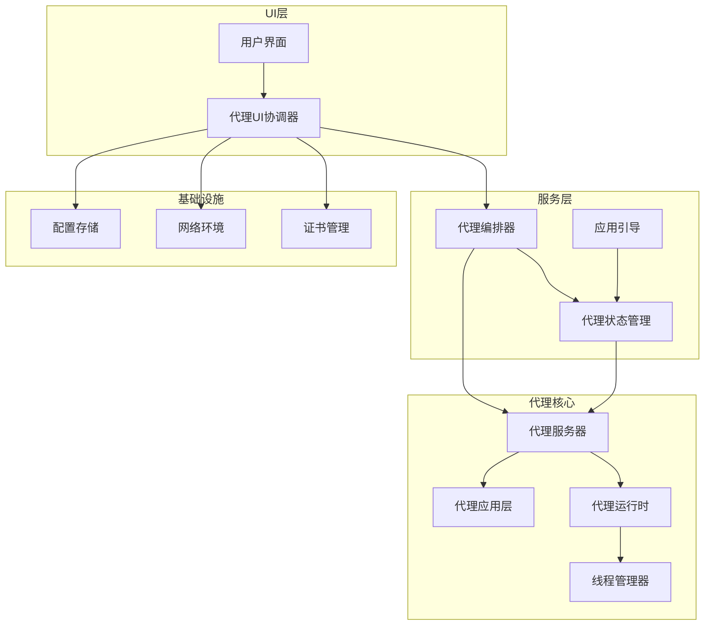

**图表来源**
- [proxy_state.py](file://modules/services/proxy_state.py#L1-L23)
- [proxy_orchestration.py](file://modules/services/proxy_orchestration.py#L1-L200)
- [proxy_server.py](file://modules/proxy/proxy_server.py#L1-L65)

**章节来源**
- [proxy_state.py](file://modules/services/proxy_state.py#L1-L23)
- [proxy_orchestration.py](file://modules/services/proxy_orchestration.py#L1-L200)

## 核心组件

### ProxyState类设计

`ProxyState`类是整个代理状态管理系统的核心，采用了极简的数据类设计模式：

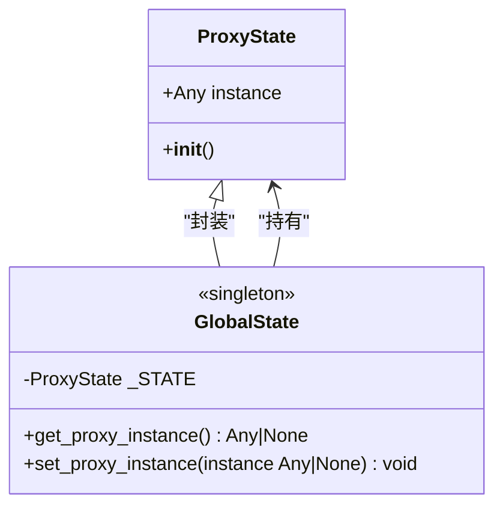

**图表来源**
- [proxy_state.py](file://modules/services/proxy_state.py#L7-L23)

该设计具有以下特点：
- **单例模式**：通过全局变量`_STATE`实现单例，确保在整个应用生命周期内只有一个状态实例
- **简单性**：仅包含一个`instance`属性，避免了复杂的继承层次
- **类型安全**：使用`Any | None`类型注解，支持任意类型的代理实例引用

### 状态访问接口

系统提供了两个核心的访问接口：

1. **get_proxy_instance()**：获取当前代理实例的引用
2. **set_proxy_instance()**：设置新的代理实例引用

这些接口为上层组件提供了统一的状态访问入口，简化了代理生命周期管理的复杂度。

**章节来源**
- [proxy_state.py](file://modules/services/proxy_state.py#L7-L23)

## 架构概览

代理状态管理系统在整个架构中扮演着"中枢神经"的角色，连接着UI层、服务层和代理核心组件。

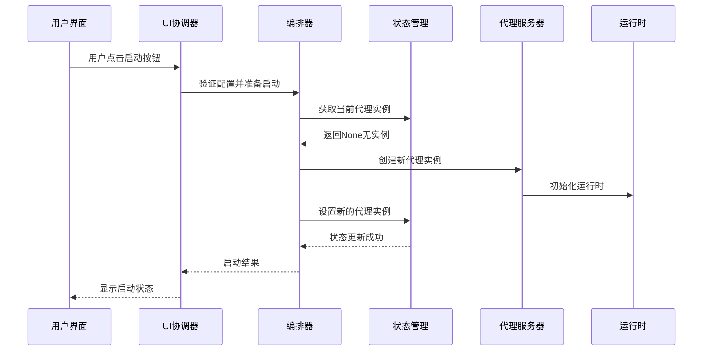

**图表来源**
- [proxy_ui_coordinator.py](file://modules/actions/proxy_ui_coordinator.py#L64-L80)
- [proxy_orchestration.py](file://modules/services/proxy_orchestration.py#L153-L184)
- [proxy_state.py](file://modules/services/proxy_state.py#L15-L22)

## 详细组件分析

### 代理状态管理器

#### ProxyState类实现

`ProxyState`类采用Python的`@dataclass`装饰器，实现了轻量级的状态容器：

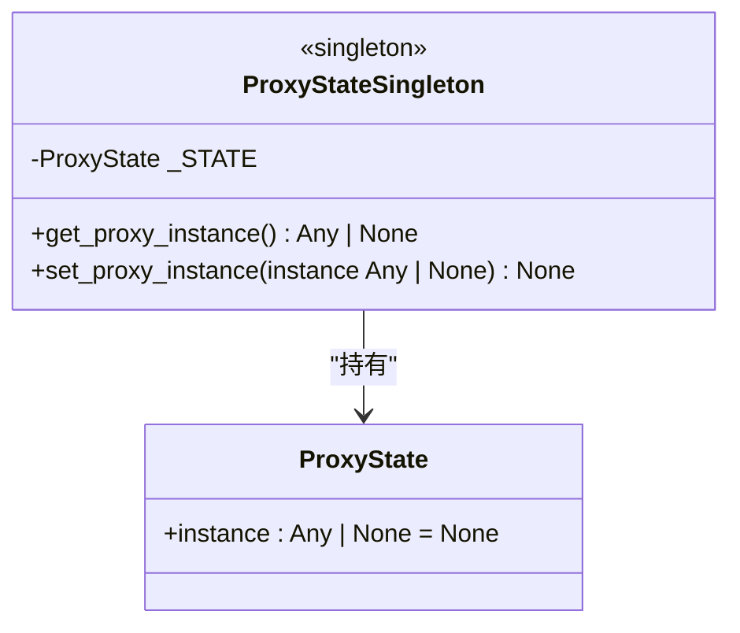

**图表来源**
- [proxy_state.py](file://modules/services/proxy_state.py#L7-L23)

#### 线程安全性分析

当前的代理状态管理在设计上具有以下特性：

1. **原子性操作**：单个属性的读写操作在CPython解释器中是原子的
2. **无锁设计**：由于操作简单且原子，不需要额外的锁机制
3. **状态一致性**：通过统一的访问接口确保状态的一致性

然而，这种设计也存在潜在的风险：
- **竞态条件**：在多线程环境下，可能存在短暂的不一致状态
- **内存可见性**：不同线程可能看到不同的状态值

### 代理编排器集成

#### 状态检查流程

代理编排器在执行任何操作前都会检查当前的代理状态：

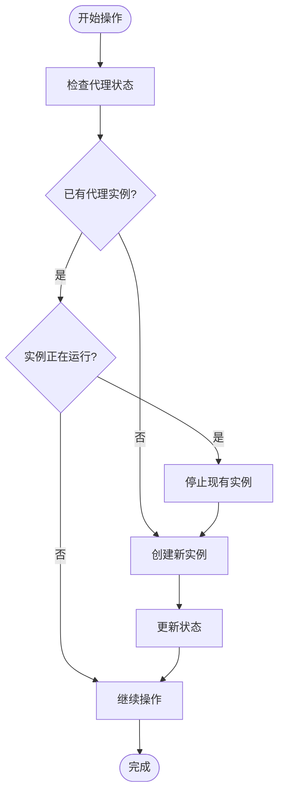

**图表来源**
- [proxy_orchestration.py](file://modules/services/proxy_orchestration.py#L109-L150)

#### 生命周期管理

代理实例的完整生命周期包括以下阶段：

1. **创建阶段**：初始化`ProxyServer`实例
2. **启动阶段**：配置网络环境和证书
3. **运行阶段**：处理HTTP请求
4. **停止阶段**：优雅关闭服务器
5. **清理阶段**：释放资源和清理状态

**章节来源**
- [proxy_orchestration.py](file://modules/services/proxy_orchestration.py#L153-L184)
- [proxy_server.py](file://modules/proxy/proxy_server.py#L35-L54)

### 代理服务器架构

#### ProxyServer类设计

代理服务器采用分层架构，将业务逻辑与运行时分离：

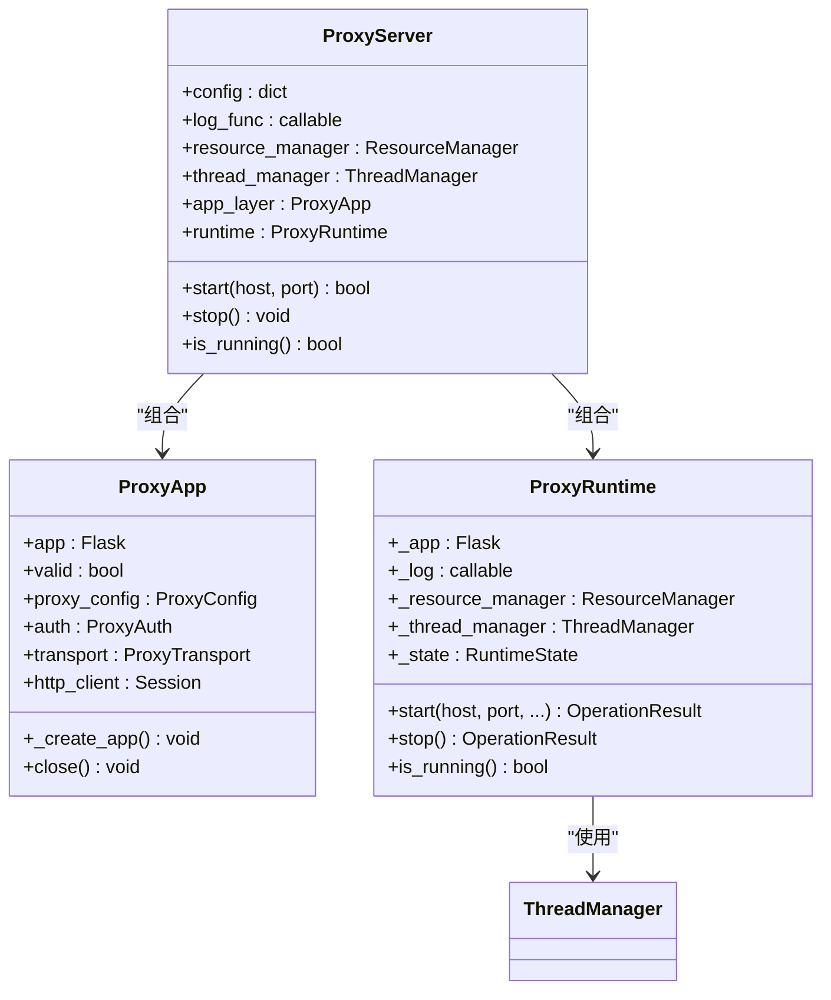

**图表来源**
- [proxy_server.py](file://modules/proxy/proxy_server.py#L14-L54)
- [proxy_app.py](file://modules/proxy/proxy_app.py#L18-L66)
- [proxy_runtime.py](file://modules/proxy/proxy_runtime.py#L46-L61)

#### 线程管理集成

代理运行时通过`ThreadManager`实现线程安全的服务器管理：

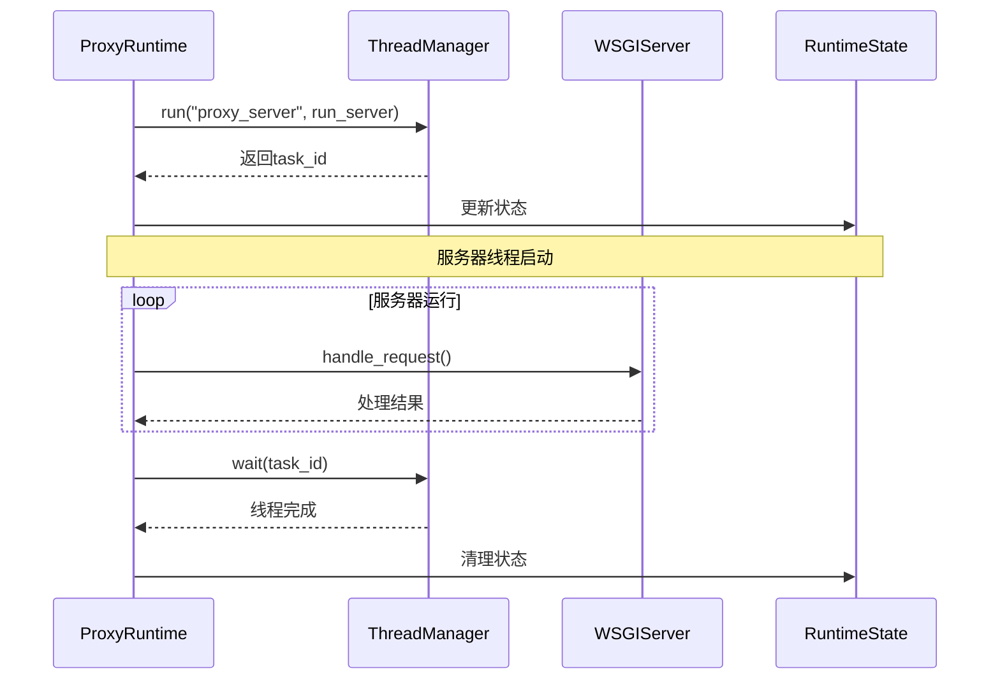

**图表来源**
- [proxy_runtime.py](file://modules/proxy/proxy_runtime.py#L141-L157)
- [thread_manager.py](file://modules/runtime/thread_manager.py#L61-L101)

**章节来源**
- [proxy_server.py](file://modules/proxy/proxy_server.py#L14-L54)
- [proxy_runtime.py](file://modules/proxy/proxy_runtime.py#L46-L218)
- [thread_manager.py](file://modules/runtime/thread_manager.py#L42-L171)

### UI集成与状态同步

#### 主窗口依赖注入

主窗口通过依赖注入的方式获取状态访问接口：

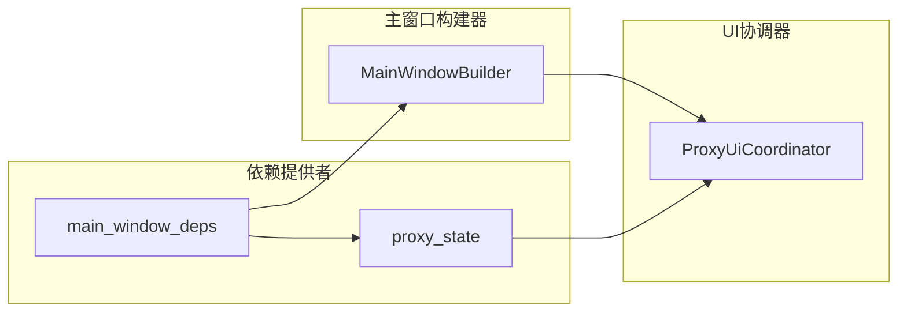

**图表来源**
- [main_window_deps.py](file://modules/ui/main_window_deps.py#L30-L57)
- [proxy_ui_coordinator.py](file://modules/actions/proxy_ui_coordinator.py#L25-L28)

#### 任务协调机制

UI协调器通过任务管理器实现异步操作的协调：

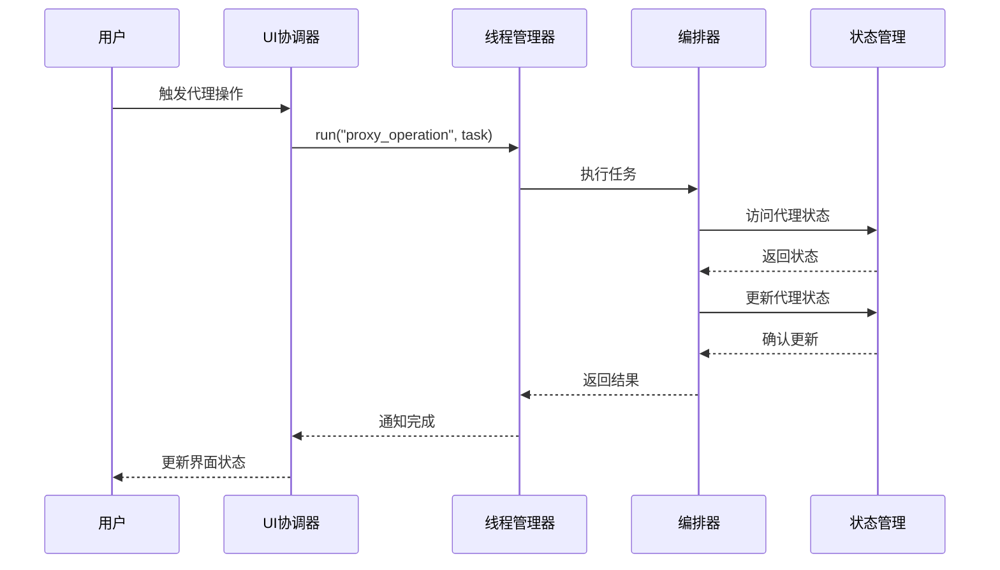

**图表来源**
- [proxy_ui_coordinator.py](file://modules/actions/proxy_ui_coordinator.py#L25-L123)
- [proxy_actions.py](file://modules/actions/proxy_actions.py#L25-L129)

**章节来源**
- [main_window_deps.py](file://modules/ui/main_window_deps.py#L30-L57)
- [proxy_ui_coordinator.py](file://modules/actions/proxy_ui_coordinator.py#L25-L123)
- [proxy_actions.py](file://modules/actions/proxy_actions.py#L25-L129)

## 依赖关系分析

代理状态管理系统与其他组件之间的依赖关系体现了清晰的分层架构：

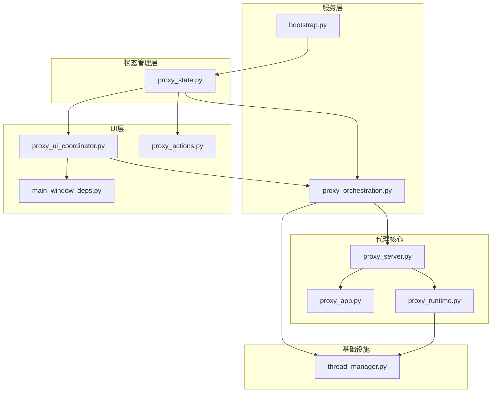

**图表来源**
- [proxy_state.py](file://modules/services/proxy_state.py#L1-L23)
- [proxy_orchestration.py](file://modules/services/proxy_orchestration.py#L1-L200)
- [proxy_server.py](file://modules/proxy/proxy_server.py#L1-L65)

### 关键依赖点

1. **状态访问依赖**：所有需要访问代理状态的组件都依赖于`proxy_state`模块
2. **编排器依赖**：代理编排器同时依赖状态管理和代理服务器
3. **UI协调依赖**：UI协调器依赖编排器和状态管理
4. **运行时依赖**：代理运行时依赖线程管理器进行线程控制

**章节来源**
- [proxy_state.py](file://modules/services/proxy_state.py#L1-L23)
- [proxy_orchestration.py](file://modules/services/proxy_orchestration.py#L1-L200)
- [proxy_server.py](file://modules/proxy/proxy_server.py#L1-L65)

## 性能考虑

### 状态访问性能

代理状态管理采用简单的属性访问模式，具有以下性能特征：

- **时间复杂度**：O(1) - 直接属性访问
- **空间复杂度**：O(1) - 单一状态对象
- **内存开销**：极小，仅包含一个引用属性

### 并发访问优化

虽然当前实现没有显式的锁机制，但通过以下设计保证了线程安全：

1. **原子操作**：Python的属性赋值在CPython中是原子的
2. **不可变性**：状态对象本身是不可变的，只有引用可以改变
3. **简单性**：避免了复杂的并发控制逻辑

### 可扩展性建议

如果未来需要支持更复杂的并发场景，可以考虑以下改进：

1. **读写锁**：为频繁读取的场景提供更好的并发性能
2. **队列机制**：使用线程安全的队列处理状态变更
3. **版本控制**：引入状态版本号避免竞态条件

## 故障排除指南

### 常见问题诊断

#### 空指针访问问题

当代理实例尚未创建时，`get_proxy_instance()`会返回`None`：

```python
# 正确的检查方式
instance = get_proxy_instance()
if instance and instance.is_running():
    # 安全地使用代理实例
    pass
else:
    # 处理未运行状态
    pass
```

#### 状态不一致问题

在多线程环境下可能出现的状态不一致情况：

1. **竞态条件**：多个线程同时检查和设置状态
2. **内存可见性**：不同线程看到不同的状态值
3. **部分更新**：状态更新过程中被其他线程读取

#### 解决方案

1. **状态检查**：始终先检查状态再执行操作
2. **异常处理**：对可能的异常情况进行捕获和处理
3. **日志记录**：详细记录状态变化以便调试

### 资源清理策略

代理实例的正确清理对于系统的稳定性至关重要：

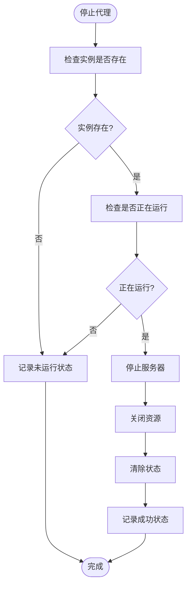

**图表来源**
- [proxy_orchestration.py](file://modules/services/proxy_orchestration.py#L109-L150)

**章节来源**
- [proxy_orchestration.py](file://modules/services/proxy_orchestration.py#L109-L150)

## 结论

ModelRelay项目的代理状态管理系统展现了优秀的软件工程实践：

### 设计优势

1. **简洁性**：通过单例模式实现了简单而有效的状态管理
2. **一致性**：统一的访问接口确保了状态的一致性
3. **可维护性**：清晰的职责分离和模块化设计
4. **可扩展性**：为未来的功能扩展预留了空间

### 关键贡献

- **状态中枢**：为整个应用提供了统一的状态管理中心
- **生命周期管理**：完整的代理实例生命周期控制
- **并发安全**：通过设计模式实现了基本的并发安全保障
- **UI集成**：无缝集成到UI组件中，提供良好的用户体验

### 改进建议

1. **增强并发控制**：在未来版本中考虑添加更完善的并发控制机制
2. **监控集成**：增加状态监控和告警机制
3. **持久化支持**：考虑将关键状态持久化到磁盘
4. **测试覆盖**：增加针对状态管理的单元测试和集成测试

这个代理状态管理系统为ModelRelay项目提供了一个稳定可靠的基础，确保了代理服务在各种使用场景下的正常运行。