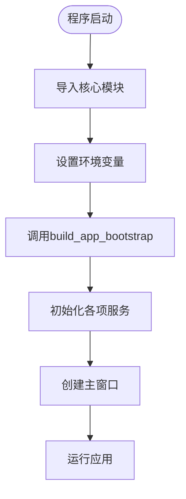
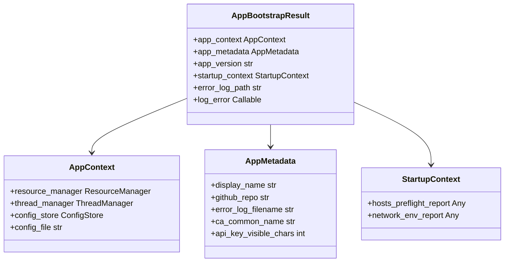
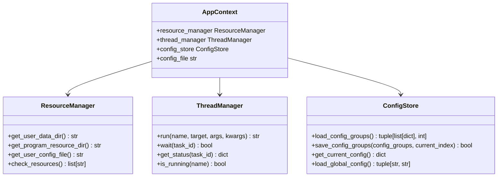
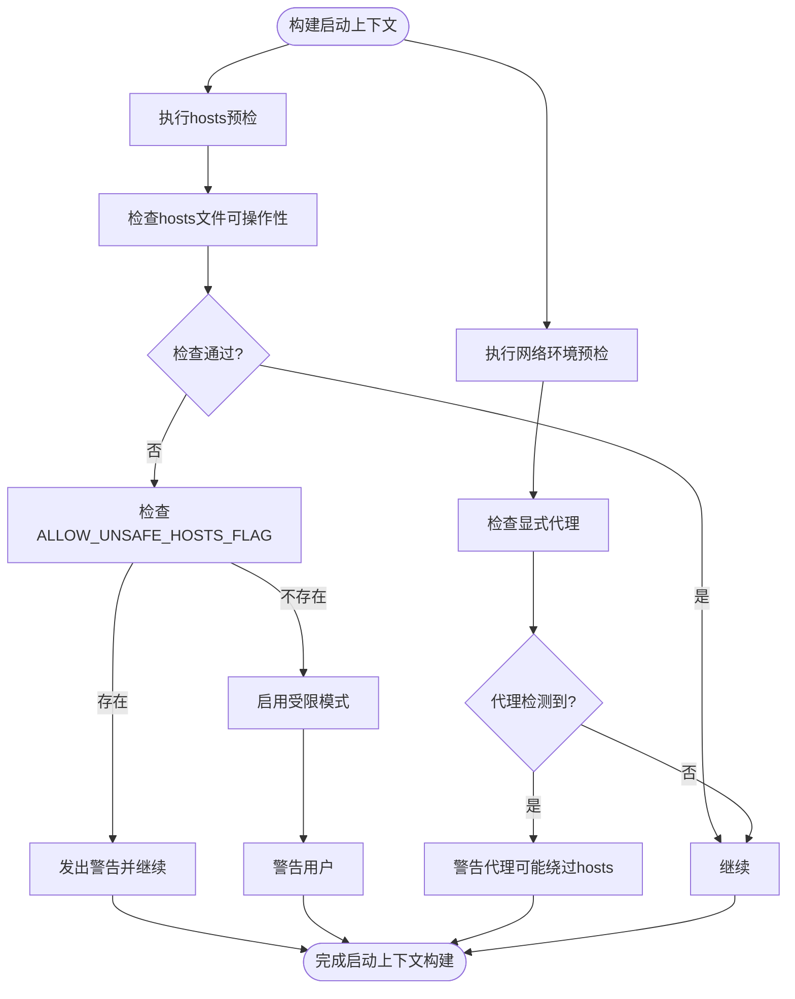
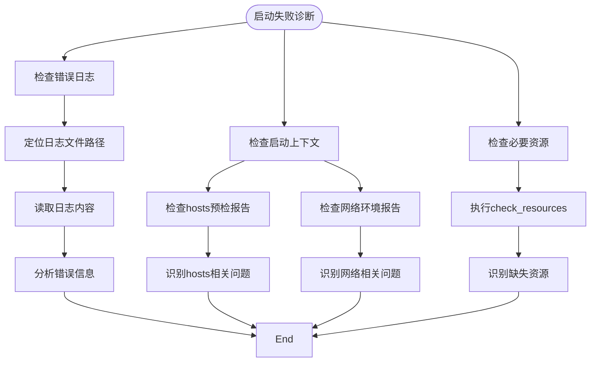
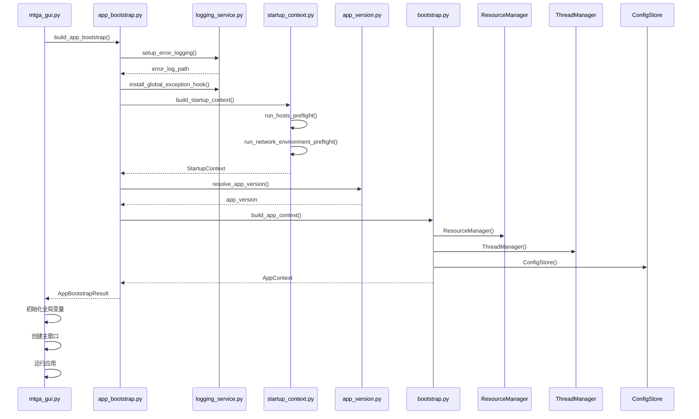

# 启动引导流程

<cite>
**本文档引用的文件**   
- [mtga_gui.py](file://mtga_gui.py)
- [app_bootstrap.py](file://modules/services/app_bootstrap.py)
- [bootstrap.py](file://modules/services/bootstrap.py)
- [logging_service.py](file://modules/services/logging_service.py)
- [startup_context.py](file://modules/services/startup_context.py)
- [startup_checks.py](file://modules/services/startup_checks.py)
- [app_metadata.py](file://modules/services/app_metadata.py)
- [app_version.py](file://modules/services/app_version.py)
- [resource_manager.py](file://modules/runtime/resource_manager.py)
- [thread_manager.py](file://modules/runtime/thread_manager.py)
- [config_service.py](file://modules/services/config_service.py)
</cite>

## 目录
1. [启动引导流程概述](#启动引导流程概述)
2. [入口点分析](#入口点分析)
3. [AppBootstrapResult结构解析](#appbootstrapresult结构解析)
4. [依赖注入与上下文构建](#依赖注入与上下文构建)
5. [前置检查与环境验证](#前置检查与环境验证)
6. [启动失败诊断路径](#启动失败诊断路径)
7. [启动流程时序图](#启动流程时序图)

## 启动引导流程概述

本系统采用模块化的启动引导架构，从`mtga_gui.py`文件的入口开始，通过`build_app_bootstrap`函数协调多个服务组件完成应用的初始化。整个启动流程设计为分层结构，确保各组件按正确顺序初始化并建立依赖关系。

启动流程的核心是`AppBootstrapResult`对象，它聚合了应用运行所需的所有上下文信息，包括应用上下文、元数据、版本信息和启动上下文。这种设计模式实现了关注点分离，使得主应用逻辑可以专注于业务功能，而不需要关心复杂的初始化过程。

**Section sources**
- [mtga_gui.py](file://mtga_gui.py#L69-L81)
- [app_bootstrap.py](file://modules/services/app_bootstrap.py#L19-L37)

## 入口点分析

应用的启动入口位于`mtga_gui.py`文件中，当脚本作为主程序运行时，会立即执行`build_app_bootstrap`函数。这个函数是整个启动流程的起点，它接收项目根目录和用户数据目录获取函数作为参数，协调各个服务组件的初始化。

入口点代码首先导入必要的模块和服务，然后立即调用`app_bootstrap.build_app_bootstrap`函数，传入项目根目录和获取用户数据目录的函数。这个调用发生在任何GUI组件创建之前，确保在用户界面显示之前，所有必要的服务和上下文都已经正确初始化。

**Diagram sources**
- [mtga_gui.py](file://mtga_gui.py#L69-L73)

**Section sources**
- [mtga_gui.py](file://mtga_gui.py#L69-L73)

## AppBootstrapResult结构解析

`AppBootstrapResult`是一个不可变的数据类，用于聚合启动过程中创建的所有关键组件和信息。这个设计模式确保了启动结果的完整性和一致性，防止在应用运行过程中意外修改启动配置。

该结构包含以下核心字段：
- `app_context`: 应用上下文，包含资源管理器、线程管理器和配置存储
- `app_metadata`: 应用元数据，包括显示名称、GitHub仓库等静态信息
- `app_version`: 解析得到的应用版本号
- `startup_context`: 启动上下文，包含前置检查结果
- `error_log_path`: 错误日志文件路径
- `log_error`: 统一的错误日志记录函数

这种聚合设计使得主应用可以通过单一对象访问所有必要的服务和配置，简化了依赖管理。

**Diagram sources**
- [app_bootstrap.py](file://modules/services/app_bootstrap.py#L9-L17)

**Section sources**
- [app_bootstrap.py](file://modules/services/app_bootstrap.py#L9-L17)

## 依赖注入与上下文构建

启动流程中的依赖注入主要通过`build_app_context`函数实现，该函数创建并配置了应用运行所需的核心服务组件。这些组件包括资源管理器、线程管理器和配置存储，它们共同构成了应用的运行时环境。

资源管理器(`ResourceManager`)负责处理开发环境和打包环境的资源路径问题，支持单文件模式的用户数据持久化。它提供了统一的接口来访问程序资源和用户数据，确保在不同部署模式下的一致性。

线程管理器(`ThreadManager`)集中管理后台线程，避免重复创建和状态混乱。它提供了任务调度、状态查询和错误处理功能，确保异步操作的可靠执行。

配置存储(`ConfigStore`)封装了配置文件的读写操作，提供类型安全的访问接口。它使用YAML格式存储配置，支持配置组和全局配置的管理。

**Diagram sources**
- [bootstrap.py](file://modules/services/bootstrap.py#L10-L29)
- [resource_manager.py](file://modules/runtime/resource_manager.py#L201-L294)
- [thread_manager.py](file://modules/runtime/thread_manager.py#L42-L171)
- [config_service.py](file://modules/services/config_service.py#L10-L81)

**Section sources**
- [bootstrap.py](file://modules/services/bootstrap.py#L18-L29)

## 前置检查与环境验证

启动上下文(`startup_context.py`)负责执行一系列前置检查，确保系统满足运行条件。这些检查分为两个主要部分：hosts文件预检和网络环境预检。

hosts文件预检通过`run_hosts_preflight`函数执行，检查系统hosts文件的可操作性。如果检测到写入权限问题，系统会自动启用受限hosts模式，调整后续操作策略。这种设计确保了在权限受限的环境下应用仍能部分运行。

网络环境预检通过`run_network_environment_preflight`函数执行，检查是否存在显式代理配置。如果检测到代理，系统会发出警告，因为这可能导致hosts导流被绕过。这种检查有助于用户理解潜在的网络问题。

所有检查结果通过`emit_logs`方法输出到日志系统，提供详细的启动诊断信息。这种设计使得用户和开发者能够快速了解启动过程中的任何问题。

**Diagram sources**
- [startup_context.py](file://modules/services/startup_context.py#L30-L35)
- [startup_checks.py](file://modules/services/startup_checks.py#L25-L108)

**Section sources**
- [startup_context.py](file://modules/services/startup_context.py#L30-L35)
- [startup_checks.py](file://modules/services/startup_checks.py#L25-L108)

## 启动失败诊断路径

当启动过程出现问题时，系统提供了多层次的诊断路径。首先，错误日志系统会记录详细的错误信息，包括异常堆栈跟踪。日志文件存储在用户数据目录中，路径由`error_log_path`字段指定。

其次，启动上下文包含了前置检查的详细结果，可以通过检查`hosts_preflight_report`和`network_env_report`来诊断环境问题。这些报告提供了关于hosts文件权限和网络配置的具体信息。

最后，资源管理器的`check_resources`方法可以用来验证必要资源的存在性，包括CA目录和OpenSSL可执行文件。这个检查可以帮助诊断打包环境中的资源缺失问题。

**Diagram sources**
- [logging_service.py](file://modules/services/logging_service.py#L10-L58)
- [startup_context.py](file://modules/services/startup_context.py#L10-L13)
- [resource_manager.py](file://modules/runtime/resource_manager.py#L259-L294)

**Section sources**
- [logging_service.py](file://modules/services/logging_service.py#L10-L58)
- [startup_context.py](file://modules/services/startup_context.py#L10-L13)
- [resource_manager.py](file://modules/runtime/resource_manager.py#L259-L294)

## 启动流程时序图

以下是整个启动流程的时序图，展示了从入口点到应用运行的完整过程：

**Diagram sources**
- [mtga_gui.py](file://mtga_gui.py#L69-L81)
- [app_bootstrap.py](file://modules/services/app_bootstrap.py#L19-L37)
- [logging_service.py](file://modules/services/logging_service.py#L10-L58)
- [startup_context.py](file://modules/services/startup_context.py#L30-L35)
- [app_version.py](file://modules/services/app_version.py#L12-L53)
- [bootstrap.py](file://modules/services/bootstrap.py#L18-L29)

**Section sources**
- [mtga_gui.py](file://mtga_gui.py#L69-L81)
- [app_bootstrap.py](file://modules/services/app_bootstrap.py#L19-L37)