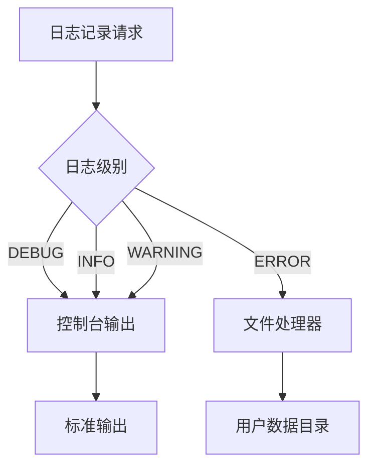
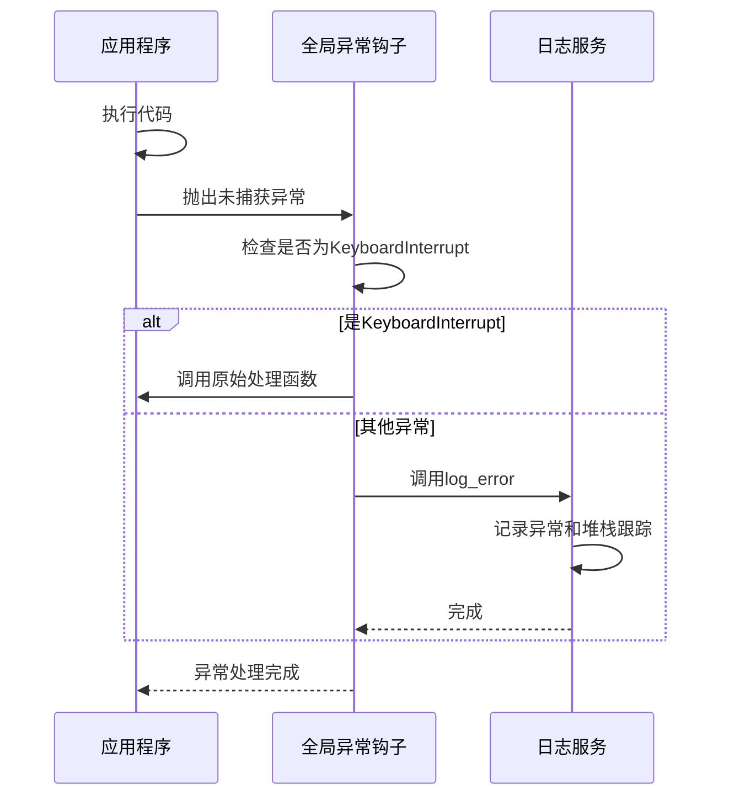

# 日志服务

<cite>
**本文档引用的文件**  
- [logging_service.py](file://modules/services/logging_service.py)
- [user_data_service.py](file://modules/services/user_data_service.py)
- [app_bootstrap.py](file://modules/services/app_bootstrap.py)
- [app_metadata.py](file://modules/services/app_metadata.py)
- [startup_checks.py](file://modules/services/startup_checks.py)
- [thread_manager.py](file://modules/runtime/thread_manager.py)
- [mtga_gui.py](file://mtga_gui.py)
- [ui_helpers.py](file://modules/ui/ui_helpers.py)
</cite>

## 目录
1. [简介](#简介)
2. [日志分级策略](#日志分级策略)
3. [错误日志持久化配置](#错误日志持久化配置)
4. [错误日志封装机制](#错误日志封装机制)
5. [全局异常捕获机制](#全局异常捕获机制)
6. [日志轮转与敏感信息处理](#日志轮转与敏感信息处理)
7. [性能影响评估](#性能影响评估)
8. [扩展自定义日志输出目标](#扩展自定义日志输出目标)
9. [结论](#结论)

## 简介
本项目通过`logging_service.py`模块实现了一套完整的日志管理机制，专注于错误日志的捕获、记录和持久化。系统采用Python标准库`logging`模块作为基础，结合应用上下文，构建了从日志级别控制到异常捕获的完整链条。日志系统在应用启动阶段初始化，确保关键错误能够被记录到用户数据目录中，便于故障排查和系统维护。

**Section sources**
- [logging_service.py](file://modules/services/logging_service.py#L1-L58)
- [app_bootstrap.py](file://modules/services/app_bootstrap.py#L1-L38)

## 日志分级策略
系统实现了标准的日志分级策略，主要使用`DEBUG`、`INFO`、`WARNING`、`ERROR`四个级别：

- **DEBUG**：用于开发调试，记录详细的执行流程和变量状态，如`thread_manager.py`中记录后台任务的堆栈信息
- **INFO**：记录系统正常运行的关键事件，如启动状态、环境检测结果等
- **WARNING**：记录潜在问题或非致命异常，如`startup_checks.py`中检测到hosts文件写入受限
- **ERROR**：记录系统错误和异常，所有关键异常都会通过`log_error`函数记录

根日志记录器的级别设置为`INFO`，确保所有信息级别及以上的日志都会被处理。错误日志处理器专门捕获`ERROR`级别日志，并将其写入持久化文件。

**Diagram sources**
- [logging_service.py](file://modules/services/logging_service.py#L30)
- [thread_manager.py](file://modules/runtime/thread_manager.py#L117-L118)

**Section sources**
- [logging_service.py](file://modules/services/logging_service.py#L21-L37)
- [thread_manager.py](file://modules/runtime/thread_manager.py#L117-L118)
- [startup_checks.py](file://modules/services/startup_checks.py#L30)

## 错误日志持久化配置
`setup_error_logging`函数负责配置错误日志的持久化存储。该函数接收用户数据目录获取函数和错误日志文件名作为参数，创建文件处理器并将`ERROR`级别日志写入指定文件。

函数首先通过`get_user_data_dir`获取用户数据目录，然后在该目录下创建日志文件路径。使用`os.makedirs`确保目录存在。日志格式包含时间戳、日志级别、记录器名称和消息内容，便于后续分析。

为避免重复添加处理器，函数会检查根日志记录器是否已存在指向相同文件的`FileHandler`。只有在不存在时才添加新的处理器，防止日志重复记录。

**Section sources**
- [logging_service.py](file://modules/services/logging_service.py#L10-L40)
- [app_bootstrap.py](file://modules/services/app_bootstrap.py#L22-L25)

## 错误日志封装机制
`log_error`函数提供了统一的错误日志入口，封装了`logging`模块的底层调用。该函数接受消息字符串和可选的异常信息参数，使用预定义的`mtga_gui`记录器记录错误。

通过封装，开发者无需直接访问`logging`模块，降低了使用复杂度。函数支持`exc_info`参数，当设置为`True`或传递异常元组时，会自动记录完整的堆栈跟踪信息，极大提高了故障排查效率。

该函数在多个关键位置被调用，如GUI初始化失败时记录错误信息，确保任何关键异常都不会被遗漏。

**Section sources**
- [logging_service.py](file://modules/services/logging_service.py#L43-L45)
- [mtga_gui.py](file://mtga_gui.py#L122-L129)

## 全局异常捕获机制
`install_global_exception_hook`函数实现了全局异常捕获机制，通过替换`sys.excepthook`来捕获未处理的异常。当程序中出现未被捕获的异常时，该钩子函数会被调用。

钩子函数会检查异常类型，如果是`KeyboardInterrupt`（如Ctrl+C），则调用原始的异常处理函数，确保程序可以正常中断。对于其他所有异常，都会通过`log_error`函数记录为"Uncaught exception"，并附带完整的异常信息和堆栈跟踪。

此机制有效防止了应用静默崩溃，确保即使在最严重的错误情况下，也能留下足够的诊断信息。

**Diagram sources**
- [logging_service.py](file://modules/services/logging_service.py#L48-L57)
- [ui_helpers.py](file://modules/ui/ui_helpers.py#L13)

**Section sources**
- [logging_service.py](file://modules/services/logging_service.py#L48-L57)
- [app_bootstrap.py](file://modules/services/app_bootstrap.py#L27)

## 日志轮转与敏感信息处理
目前代码库中未实现显式的日志轮转策略。错误日志文件会持续增长，直到被手动清理或覆盖。系统通过`user_data_service.py`提供了用户数据备份和清理功能，间接实现了日志文件的管理。

关于敏感信息过滤，当前实现中没有专门的过滤机制。日志记录直接输出消息内容和异常信息，可能包含敏感数据。建议在记录日志前对敏感信息进行脱敏处理，或在日志输出前添加过滤器。

未来可扩展日志轮转功能，使用`logging.handlers.RotatingFileHandler`或`TimedRotatingFileHandler`来自动管理日志文件大小和生命周期。

**Section sources**
- [user_data_service.py](file://modules/services/user_data_service.py#L60-L87)
- [logging_service.py](file://modules/services/logging_service.py#L25)

## 性能影响评估
日志系统的性能影响主要体现在以下几个方面：

1. **I/O开销**：错误日志写入磁盘会产生I/O操作，但在`ERROR`级别下，日志量通常较小，对性能影响有限
2. **异常处理开销**：记录异常时的堆栈跟踪生成会消耗CPU资源，但仅在错误发生时触发
3. **内存占用**：日志记录器和处理器会占用少量内存，属于常驻开销

系统设计合理，将高频率的`INFO`和`DEBUG`日志保留在内存中，只将低频率的`ERROR`日志持久化，有效平衡了诊断需求和性能开销。`thread_manager.py`中的`DEBUG`级别日志仅在任务失败时记录堆栈，避免了频繁的高开销操作。

**Section sources**
- [logging_service.py](file://modules/services/logging_service.py#L26)
- [thread_manager.py](file://modules/runtime/thread_manager.py#L118)

## 扩展自定义日志输出目标
系统设计支持扩展自定义日志输出目标。开发者可以通过以下方式扩展：

1. **添加新的处理器**：在`setup_error_logging`函数中添加其他类型的处理器，如`StreamHandler`输出到网络套接字，或`SMTPHandler`发送邮件
2. **自定义格式化器**：创建新的`Formatter`子类，实现特定的日志格式
3. **添加过滤器**：实现`Filter`类，对日志记录进行预处理或过滤

例如，可以添加一个HTTP处理器，将关键错误实时发送到远程监控服务。或者添加一个敏感信息过滤器，在日志输出前自动脱敏API密钥等敏感数据。

**Section sources**
- [logging_service.py](file://modules/services/logging_service.py#L21-L27)
- [app_bootstrap.py](file://modules/services/app_bootstrap.py#L22-L25)

## 结论
本项目的日志服务实现了完整的错误日志管理机制，通过`setup_error_logging`、`log_error`和`install_global_exception_hook`三个核心函数，构建了从配置、记录到异常捕获的完整链条。系统合理使用日志分级策略，将`ERROR`级别日志持久化到用户数据目录，确保关键异常可追溯。

虽然当前缺少日志轮转和敏感信息过滤机制，但整体架构清晰，易于扩展。通过标准的`logging`模块接口，开发者可以方便地添加自定义日志输出目标，满足不同的监控和诊断需求。