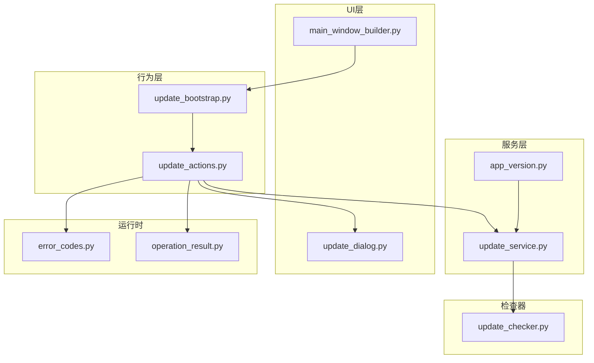
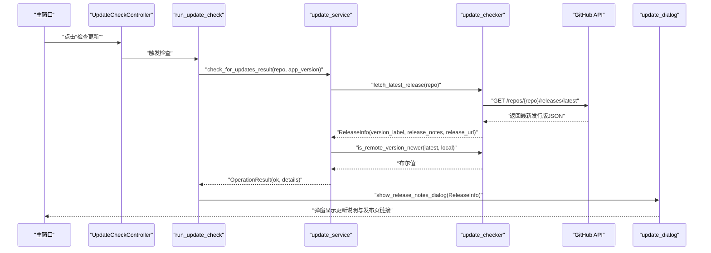
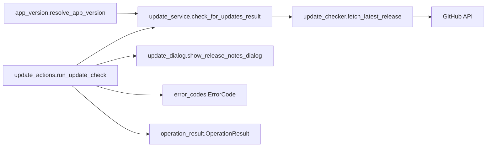

# 更新服务

<cite>
**本文引用的文件**
- [modules/services/update_service.py](file://modules/services/update_service.py)
- [modules/update/update_checker.py](file://modules/update/update_checker.py)
- [modules/services/app_version.py](file://modules/services/app_version.py)
- [modules/actions/update_actions.py](file://modules/actions/update_actions.py)
- [modules/ui/update_dialog.py](file://modules/ui/update_dialog.py)
- [modules/actions/update_bootstrap.py](file://modules/actions/update_bootstrap.py)
- [modules/ui/main_window_builder.py](file://modules/ui/main_window_builder.py)
- [modules/runtime/error_codes.py](file://modules/runtime/error_codes.py)
- [modules/runtime/operation_result.py](file://modules/runtime/operation_result.py)
</cite>

## 目录
1. [简介](#简介)
2. [项目结构](#项目结构)
3. [核心组件](#核心组件)
4. [架构总览](#架构总览)
5. [详细组件分析](#详细组件分析)
6. [依赖关系分析](#依赖关系分析)
7. [性能考量](#性能考量)
8. [故障排查指南](#故障排查指南)
9. [结论](#结论)

## 简介
本文件系统性解析更新服务模块如何实现“应用自动更新”的全流程：从检查新版本、从远程服务器获取最新版本元数据、版本比对、到用户界面反馈与交互。文档特别关注以下要点：
- 与 update_checker 的协作机制，如何通过 GitHub API 获取最新版本元数据
- 版本比对逻辑，基于 app_version.resolve_app_version 获取当前版本号
- 用户界面反馈机制：弹窗展示更新说明、打开发布页链接、以及按钮状态控制
- 失败场景的错误码映射、网络超时处理与错误提示
- 当前代码库中未包含的“下载更新包”和“启动安装程序”的实现，将在后续扩展中补充

## 项目结构
更新服务相关模块分布于以下目录：
- 服务层：modules/services/update_service.py（对外接口）、modules/services/app_version.py（版本解析）
- 检查器：modules/update/update_checker.py（远程版本抓取与版本比对）
- 行为层：modules/actions/update_actions.py（触发检查、线程调度、UI 反馈）
- UI 层：modules/ui/update_dialog.py（更新说明弹窗）
- 引导装配：modules/actions/update_bootstrap.py、modules/ui/main_window_builder.py（控制器装配与入口）

图表来源
- [modules/ui/main_window_builder.py](file://modules/ui/main_window_builder.py#L140-L182)
- [modules/actions/update_bootstrap.py](file://modules/actions/update_bootstrap.py#L26-L52)
- [modules/actions/update_actions.py](file://modules/actions/update_actions.py#L47-L126)
- [modules/services/update_service.py](file://modules/services/update_service.py#L37-L127)
- [modules/update/update_checker.py](file://modules/update/update_checker.py#L284-L319)
- [modules/services/app_version.py](file://modules/services/app_version.py#L12-L52)
- [modules/ui/update_dialog.py](file://modules/ui/update_dialog.py#L25-L84)
- [modules/runtime/error_codes.py](file://modules/runtime/error_codes.py#L6-L17)
- [modules/runtime/operation_result.py](file://modules/runtime/operation_result.py#L9-L38)

章节来源
- [modules/ui/main_window_builder.py](file://modules/ui/main_window_builder.py#L140-L182)
- [modules/actions/update_bootstrap.py](file://modules/actions/update_bootstrap.py#L26-L52)
- [modules/actions/update_actions.py](file://modules/actions/update_actions.py#L47-L126)
- [modules/services/update_service.py](file://modules/services/update_service.py#L37-L127)
- [modules/update/update_checker.py](file://modules/update/update_checker.py#L284-L319)
- [modules/services/app_version.py](file://modules/services/app_version.py#L12-L52)
- [modules/ui/update_dialog.py](file://modules/ui/update_dialog.py#L25-L84)
- [modules/runtime/error_codes.py](file://modules/runtime/error_codes.py#L6-L17)
- [modules/runtime/operation_result.py](file://modules/runtime/operation_result.py#L9-L38)

## 核心组件
- 更新服务接口：提供检查更新的高层 API，负责网络异常、远程异常、无版本等错误分类与结果封装
- 远程版本检查器：封装 GitHub API 调用、Markdown 渲染、版本号提取与比较
- 版本解析器：从环境变量、构建注入或 pyproject.toml 中解析当前应用版本
- 更新动作控制器：在后台线程执行检查，处理 UI 反馈与错误提示
- 更新对话框：展示更新说明 HTML、打开发布页链接
- 错误码与操作结果：统一错误分类与返回结构

章节来源
- [modules/services/update_service.py](file://modules/services/update_service.py#L37-L127)
- [modules/update/update_checker.py](file://modules/update/update_checker.py#L284-L319)
- [modules/services/app_version.py](file://modules/services/app_version.py#L12-L52)
- [modules/actions/update_actions.py](file://modules/actions/update_actions.py#L47-L126)
- [modules/ui/update_dialog.py](file://modules/ui/update_dialog.py#L25-L84)
- [modules/runtime/error_codes.py](file://modules/runtime/error_codes.py#L6-L17)
- [modules/runtime/operation_result.py](file://modules/runtime/operation_result.py#L9-L38)

## 架构总览
更新流程由 UI 触发，经由动作控制器在后台线程执行检查，服务层调用检查器获取远程版本元数据，进行版本比对后，将结果通过 UI 对话框反馈给用户。

图表来源
- [modules/ui/main_window_builder.py](file://modules/ui/main_window_builder.py#L140-L182)
- [modules/actions/update_actions.py](file://modules/actions/update_actions.py#L47-L126)
- [modules/services/update_service.py](file://modules/services/update_service.py#L37-L127)
- [modules/update/update_checker.py](file://modules/update/update_checker.py#L284-L319)
- [modules/ui/update_dialog.py](file://modules/ui/update_dialog.py#L25-L84)

## 详细组件分析

### 更新服务接口（update_service.py）
职责与流程
- 输入参数：仓库地址、应用版本、超时时间、User-Agent、字体选项
- 调用检查器获取最新发行版信息
- 捕获网络异常与远程异常，返回对应状态
- 版本比对：若远程版本不新于本地，返回“已是最新”
- 成功路径：返回“有新版本”，附带版本号、更新说明与发布页链接

关键点
- 状态枚举与结果封装：UpdateStatus、UpdateCheckResult
- 错误映射：网络错误、远程错误、无版本号、已是最新、有新版本
- 结果包装：check_for_updates_result 将状态封装为 OperationResult，便于上层统一处理

章节来源
- [modules/services/update_service.py](file://modules/services/update_service.py#L12-L28)
- [modules/services/update_service.py](file://modules/services/update_service.py#L37-L84)
- [modules/services/update_service.py](file://modules/services/update_service.py#L87-L127)
- [modules/runtime/error_codes.py](file://modules/runtime/error_codes.py#L6-L17)
- [modules/runtime/operation_result.py](file://modules/runtime/operation_result.py#L9-L38)

### 远程版本检查器（update_checker.py）
职责与流程
- fetch_latest_release：调用 GitHub Releases API 获取最新发行版 JSON，解析版本标签、更新说明与发布页链接
- render_markdown_via_github_api：将 Markdown 渲染为 HTML，支持字体注入与回退策略
- 版本号提取与比较：extract_version_label 提取形如 vX.Y.Z 的标签；is_remote_version_newer 比较主版本与次版本
- 缓存与容错：emoji 映射缓存，渲染失败时降级为纯文本

版本比对逻辑
- 先将版本字符串标准化为数字元组，再逐段比较
- 主版本不同则按主版本判断；主版本相同时按完整元组比较

章节来源
- [modules/update/update_checker.py](file://modules/update/update_checker.py#L284-L319)
- [modules/update/update_checker.py](file://modules/update/update_checker.py#L37-L121)
- [modules/update/update_checker.py](file://modules/update/update_checker.py#L256-L282)
- [modules/update/update_checker.py](file://modules/update/update_checker.py#L217-L236)

### 版本解析器（app_version.py）
职责与流程
- 优先从环境变量 MTGA_VERSION 获取版本
- 若未提供，则尝试读取构建期注入的版本常量
- 否则从 pyproject.toml 中读取 project.version，并规范化为以 v 开头的形式
- 默认返回 v0.0.0

章节来源
- [modules/services/app_version.py](file://modules/services/app_version.py#L12-L52)

### 更新动作控制器（update_actions.py）
职责与流程
- 在后台线程执行检查，禁用按钮，完成后恢复
- 统一错误处理：根据 OperationResult.code 或状态映射错误消息
- UI 反馈：根据状态分别弹出“已是最新”、“无版本号”或“新版本”对话框
- “新版本”路径：调用 update_dialog 展示更新说明 HTML 与发布页链接

章节来源
- [modules/actions/update_actions.py](file://modules/actions/update_actions.py#L47-L126)
- [modules/ui/update_dialog.py](file://modules/ui/update_dialog.py#L25-L84)

### 更新对话框（update_dialog.py）
职责与流程
- 创建模态弹窗，显示版本号与“前往发布页”按钮
- 使用可注入的 HTML 渲染控件加载更新说明 HTML
- 自定义链接点击行为：外链走浏览器，内链走默认处理
- 关闭时销毁窗口并居中显示

章节来源
- [modules/ui/update_dialog.py](file://modules/ui/update_dialog.py#L25-L84)

### 控制器装配与入口（update_bootstrap.py、main_window_builder.py）
职责与流程
- main_window_builder 构建主窗口时创建 UpdateCheckController，并将其与 UI 事件绑定
- update_bootstrap 将运行时依赖注入到控制器，包括线程管理、日志、消息框、字体、资源目录等
- 应用启动后延时触发一次检查更新，提升用户体验

章节来源
- [modules/ui/main_window_builder.py](file://modules/ui/main_window_builder.py#L140-L182)
- [modules/actions/update_bootstrap.py](file://modules/actions/update_bootstrap.py#L26-L52)

## 依赖关系分析
- update_service 依赖 update_checker 完成远程版本抓取与版本比较
- update_actions 依赖 update_service 执行检查，并依赖 update_dialog 展示结果
- app_version 为 update_service 提供当前版本号
- 错误码与操作结果为 update_actions 提供统一的错误处理与返回结构

图表来源
- [modules/services/app_version.py](file://modules/services/app_version.py#L12-L52)
- [modules/services/update_service.py](file://modules/services/update_service.py#L37-L127)
- [modules/update/update_checker.py](file://modules/update/update_checker.py#L284-L319)
- [modules/actions/update_actions.py](file://modules/actions/update_actions.py#L47-L126)
- [modules/ui/update_dialog.py](file://modules/ui/update_dialog.py#L25-L84)
- [modules/runtime/error_codes.py](file://modules/runtime/error_codes.py#L6-L17)
- [modules/runtime/operation_result.py](file://modules/runtime/operation_result.py#L9-L38)

## 性能考量
- 网络请求超时：默认 10 秒，可通过参数传入
- Markdown 渲染：GitHub API 渲染失败时降级为纯文本，保证可用性
- Emoji 映射缓存：LRU 缓存减少重复请求
- UI 线程安全：后台线程执行检查，完成后再主线程更新 UI 状态与弹窗

章节来源
- [modules/services/update_service.py](file://modules/services/update_service.py#L37-L44)
- [modules/update/update_checker.py](file://modules/update/update_checker.py#L37-L121)
- [modules/update/update_checker.py](file://modules/update/update_checker.py#L217-L236)
- [modules/actions/update_actions.py](file://modules/actions/update_actions.py#L47-L58)

## 故障排查指南
常见问题与处理
- 网络异常：状态为 network_error，错误码为 NETWORK_ERROR；建议检查网络连通性与代理设置
- 远程异常：状态为 remote_error，错误码为 REMOTE_ERROR；建议稍后重试或检查仓库访问权限
- 无版本号：状态为 no_version，错误码为 NO_VERSION；建议确认仓库最新发行版是否包含有效版本标签
- 已是最新：状态为 up_to_date；无需进一步操作
- 新版本：状态为 new_version；通过 update_dialog 展示更新说明与发布页链接

章节来源
- [modules/services/update_service.py](file://modules/services/update_service.py#L103-L127)
- [modules/runtime/error_codes.py](file://modules/runtime/error_codes.py#L6-L17)
- [modules/runtime/operation_result.py](file://modules/runtime/operation_result.py#L9-L38)

## 结论
本更新服务模块实现了从远程获取最新版本元数据、版本比对与 UI 反馈的完整闭环。其设计遵循分层解耦原则：服务层负责检查与结果封装，检查器专注远程数据抓取与版本比较，动作层负责线程调度与 UI 交互，错误码与操作结果提供统一的错误处理模型。当前代码库尚未包含“下载更新包”和“启动安装程序”的实现，后续可在现有架构基础上扩展下载与安装流程，并补充进度条与完整性校验等能力。