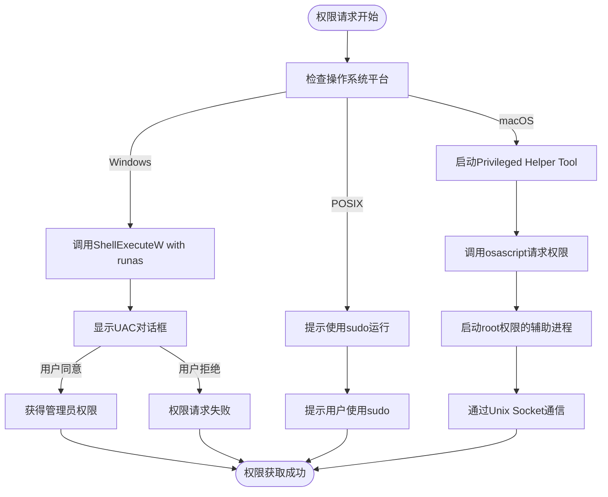
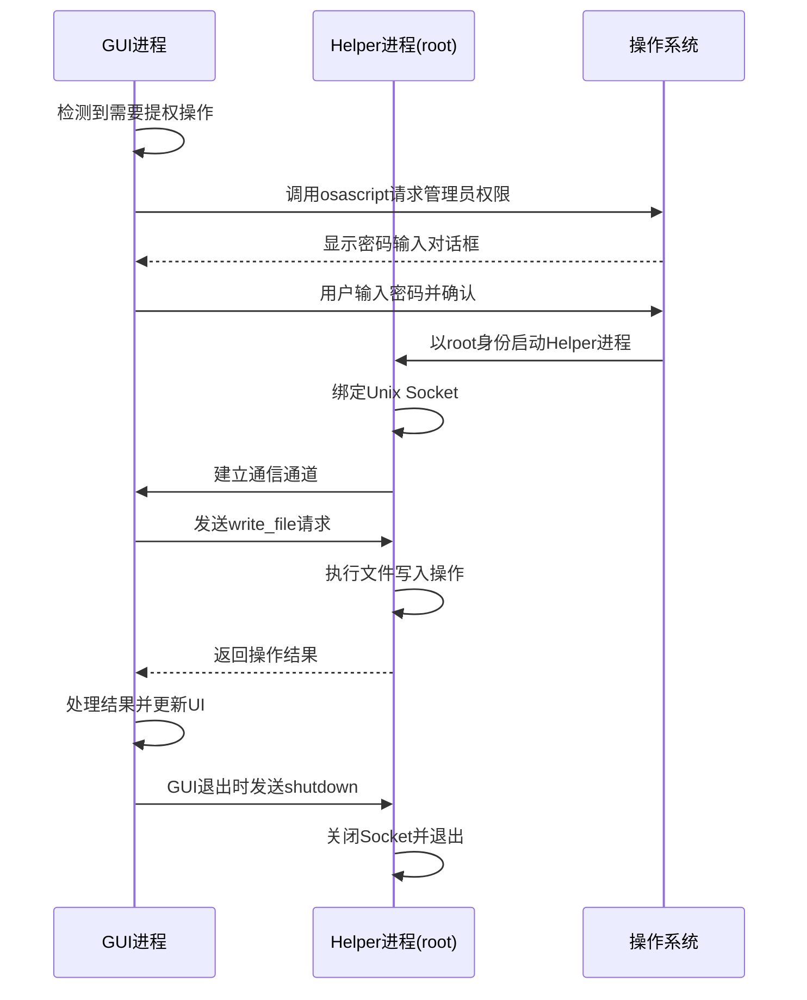
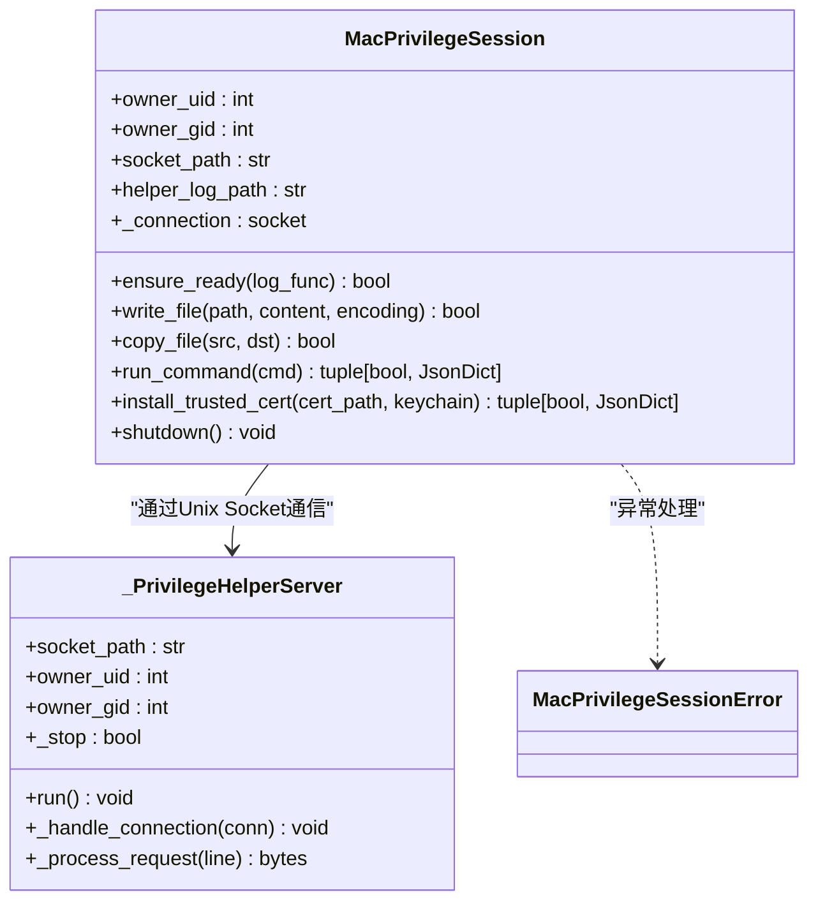
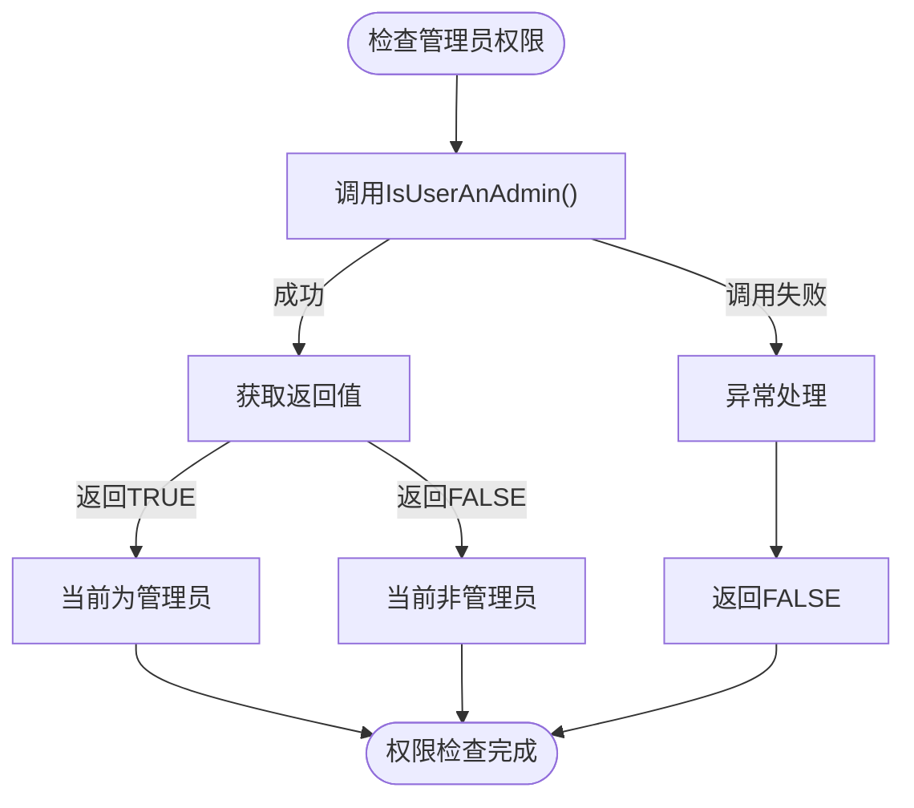
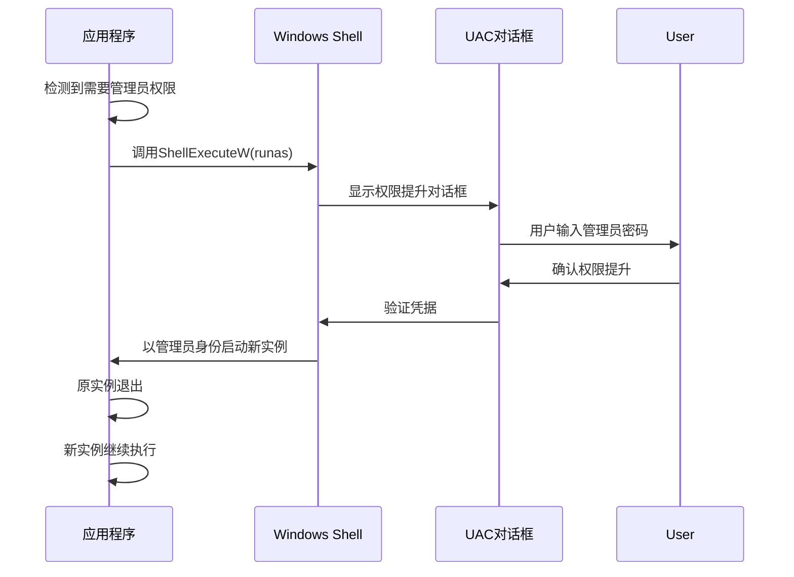
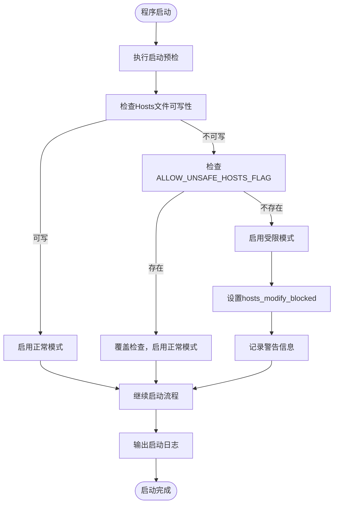
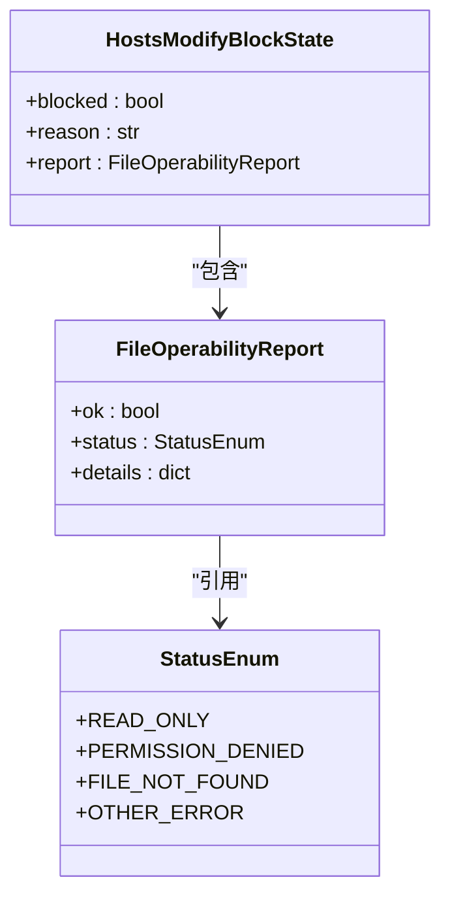
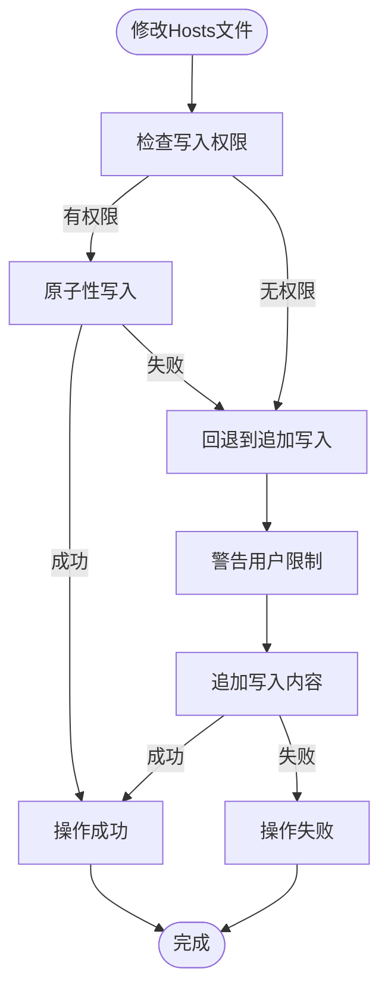
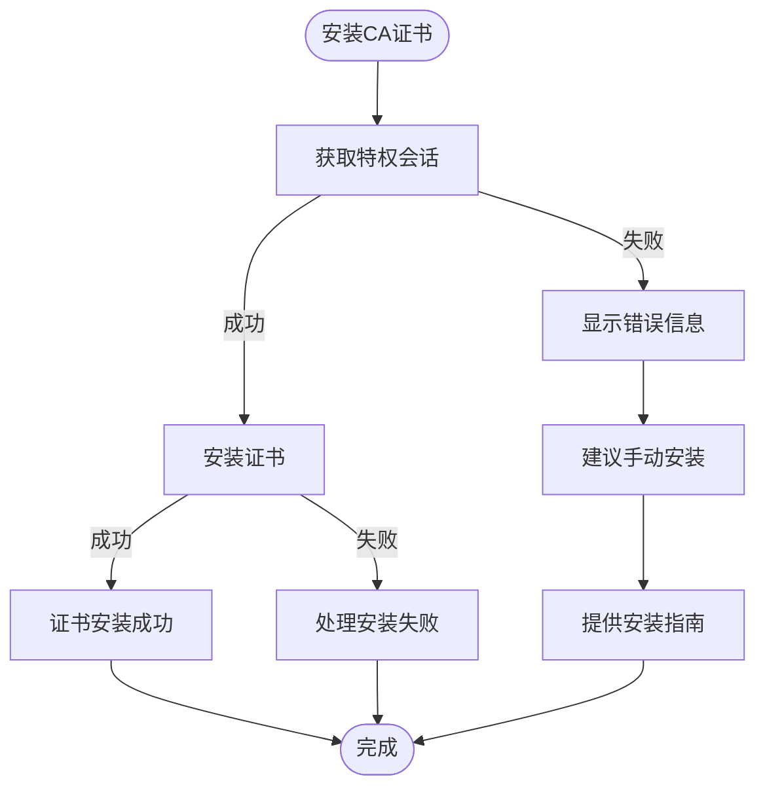

# 权限服务

<cite>
**本文档引用的文件**
- [privilege_service.py](file://modules/services/privilege_service.py)
- [privileges.py](file://modules/platform/privileges.py)
- [macos_privileged_helper.py](file://modules/platform/macos_privileged_helper.py)
- [hosts_manager.py](file://modules/hosts/hosts_manager.py)
- [ca_store.py](file://modules/cert/ca_store.py)
- [system.py](file://modules/platform/system.py)
</cite>

## 目录
1. [权限服务概述](#权限服务概述)
2. [跨平台权限请求机制](#跨平台权限请求机制)
3. [macOS特权辅助工具通信机制](#macos特权辅助工具通信机制)
4. [Windows提权实现方式](#windows提权实现方式)
5. [权限检查与缓存状态流程](#权限检查与缓存状态流程)
6. [用户拒绝授权的降级处理](#用户拒绝授权的降级处理)
7. [权限配置清单与最佳实践](#权限配置清单与最佳实践)

## 权限服务概述

权限服务模块负责处理应用程序在不同操作系统上执行敏感操作所需的权限管理。该服务主要针对修改Hosts文件和安装证书这两类需要管理员权限的操作，提供了一套完整的权限请求、验证和降级处理机制。

系统通过分层架构设计，将权限服务分为平台无关的接口层和平台特定的实现层。`privilege_service.py`作为服务入口，封装了统一的权限检查和请求接口，而具体的平台实现则由`privileges.py`和`macos_privileged_helper.py`等平台特定模块完成。

**Section sources**
- [privilege_service.py](file://modules/services/privilege_service.py#L1-L6)
- [privileges.py](file://modules/platform/privileges.py#L1-L113)

## 跨平台权限请求机制

系统实现了针对不同操作系统的权限请求机制，确保在Windows、macOS和Linux平台上都能正确获取必要的管理员权限。

在Windows平台上，系统通过调用`ShellExecuteW`函数并指定"runas"动词来请求管理员权限。这种方法会触发UAC（用户账户控制）对话框，让用户确认是否授予管理员权限。如果用户拒绝或系统不支持，程序将无法执行需要提权的操作。

在POSIX系统（包括macOS和Linux）上，系统采用不同的策略。对于常规提权请求，会提示用户使用`sudo`命令重新运行程序。而在macOS上，系统实现了更复杂的持久化提权机制，通过创建一个以root身份运行的辅助进程来持续处理需要管理员权限的操作。

**Diagram sources**
- [privileges.py](file://modules/platform/privileges.py#L84-L103)
- [system.py](file://modules/platform/system.py#L7-L12)

**Section sources**
- [privileges.py](file://modules/platform/privileges.py#L84-L103)
- [system.py](file://modules/platform/system.py#L7-L12)

## macOS特权辅助工具通信机制

macOS平台通过`macos_privileged_helper.py`模块实现了Privileged Helper Tool通信机制，这是一种持久化的提权解决方案，避免了每次操作都需要重新请求权限。

### XPC服务注册与调用流程

系统采用基于Unix Socket的通信机制来实现主程序与特权辅助进程之间的交互。当需要执行提权操作时，主程序会通过`osascript`启动一个以root身份运行的Python辅助进程，该进程绑定到一个Unix Socket上等待连接。

**Diagram sources**
- [macos_privileged_helper.py](file://modules/platform/macos_privileged_helper.py#L73-L91)
- [macos_privileged_helper.py](file://modules/platform/macos_privileged_helper.py#L360-L397)

### 通信协议与安全设计

系统实现了安全的通信协议，确保只有合法的主程序能够与特权辅助进程通信。每个会话都基于进程ID和UUID生成唯一的Socket路径，防止其他进程的干扰。

**Diagram sources**
- [macos_privileged_helper.py](file://modules/platform/macos_privileged_helper.py#L52-L179)
- [macos_privileged_helper.py](file://modules/platform/macos_privileged_helper.py#L360-L456)

**Section sources**
- [macos_privileged_helper.py](file://modules/platform/macos_privileged_helper.py#L1-L487)

## Windows提权实现方式

Windows平台的提权实现相对直接，主要依赖于Windows API提供的标准提权机制。

### 管理员权限检查

系统通过调用`IsUserAnAdmin`函数来检查当前进程是否具有管理员权限。这个函数是Windows Shell API的一部分，能够准确判断当前用户的权限级别。

**Diagram sources**
- [privileges.py](file://modules/platform/privileges.py#L13-L19)

### 提权请求流程

当需要提权时，系统使用`ShellExecuteW`函数以"runas"动词执行当前程序。这会触发Windows的UAC机制，显示标准的权限提升对话框。

**Diagram sources**
- [privileges.py](file://modules/platform/privileges.py#L89-L96)

**Section sources**
- [privileges.py](file://modules/platform/privileges.py#L84-L103)

## 权限检查与缓存状态流程

系统实现了完整的权限检查与状态缓存机制，确保权限状态的一致性和性能优化。

### 权限检查流程

权限检查流程从应用启动时就开始执行，通过一系列预检确保系统环境的准备就绪。对于Hosts文件操作，系统会预先检查文件的可写性，并根据检查结果决定是否启用受限模式。

**Diagram sources**
- [startup_checks.py](file://modules/services/startup_checks.py#L25-L54)
- [startup_checks.py](file://modules/services/startup_checks.py#L67-L107)

### 状态缓存机制

系统通过内存中的状态变量来缓存权限检查结果，避免重复的系统调用。这种设计既保证了性能，又确保了状态的一致性。

**Diagram sources**
- [hosts_state.py](file://modules/hosts/hosts_state.py)
- [file_operability.py](file://modules/hosts/file_operability.py)

**Section sources**
- [startup_checks.py](file://modules/services/startup_checks.py#L1-L108)
- [hosts_state.py](file://modules/hosts/hosts_state.py)

## 用户拒绝授权的降级处理

当用户拒绝授权或权限请求失败时，系统提供了一套完整的降级处理策略，确保应用仍能以有限功能运行。

### Hosts文件操作的降级策略

对于Hosts文件操作，系统实现了多级降级机制。当无法获得完全的写入权限时，系统会回退到追加写入模式，虽然这种模式无法保证原子性操作和去重，但至少允许用户添加必要的记录。

**Diagram sources**
- [hosts_manager.py](file://modules/hosts/hosts_manager.py#L32-L91)
- [hosts_manager.py](file://modules/hosts/hosts_manager.py#L338-L352)

### 证书安装的降级处理

对于证书安装操作，系统在无法获得管理员权限时会明确提示用户，并建议手动安装证书。这种设计既保证了安全性，又提供了清晰的用户指引。

**Diagram sources**
- [ca_store.py](file://modules/cert/ca_store.py#L142-L178)
- [ca_store.py](file://modules/cert/ca_store.py#L269-L297)

**Section sources**
- [hosts_manager.py](file://modules/hosts/hosts_manager.py#L32-L91)
- [ca_store.py](file://modules/cert/ca_store.py#L142-L178)

## 权限配置清单与最佳实践

### 权限配置清单

| 操作类型 | 所需权限 | Windows实现 | macOS实现 | Linux实现 |
|---------|---------|------------|----------|----------|
| 修改Hosts文件 | 管理员/root权限 | UAC提权 | Privileged Helper Tool | sudo |
| 安装证书 | 管理员/root权限 | certutil命令 | security命令 | update-ca-certificates |
| 备份Hosts文件 | 读取权限 | 直接读取 | 直接读取 | 直接读取 |
| 还原Hosts文件 | 管理员/root权限 | UAC提权 | Privileged Helper Tool | sudo |

### 安全沙箱兼容性

系统设计充分考虑了安全沙箱环境的兼容性：

1. **macOS应用沙箱**：通过Privileged Helper Tool机制，主程序可以在沙箱内运行，而特权操作由外部辅助进程处理
2. **Windows UAC**：遵循最小权限原则，只在必要时请求提权
3. **Linux安全模块**：兼容SELinux和AppArmor等安全框架

### 用户提示文案最佳实践

系统采用清晰、友好的用户提示文案，确保用户理解权限请求的必要性和操作后果：

- **权限请求提示**："🔐 正在请求管理员权限，请在弹窗中输入密码..."
- **成功提示**："✅ 管理员权限已授权，正在建立通信通道..."
- **失败提示**："❌ 无法获取管理员权限，请检查密码或联系系统管理员"
- **降级提示**："⚠️ 当前环境hosts写入受限，将回退为追加写入模式"

这些文案设计遵循了以下原则：
- 使用emoji增强可读性
- 明确说明操作目的
- 提供清晰的成功/失败反馈
- 在降级情况下告知用户限制

**Section sources**
- [macos_privileged_helper.py](file://modules/platform/macos_privileged_helper.py#L214-L227)
- [ca_store.py](file://modules/cert/ca_store.py#L149-L150)
- [hosts_manager.py](file://modules/hosts/hosts_manager.py#L82-L85)