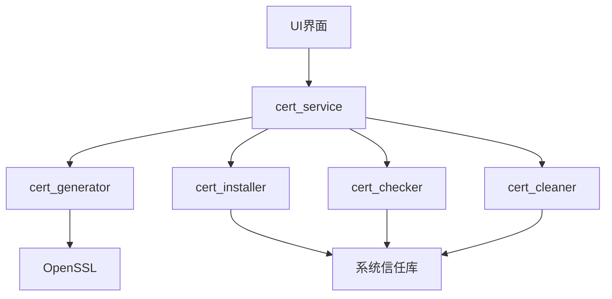
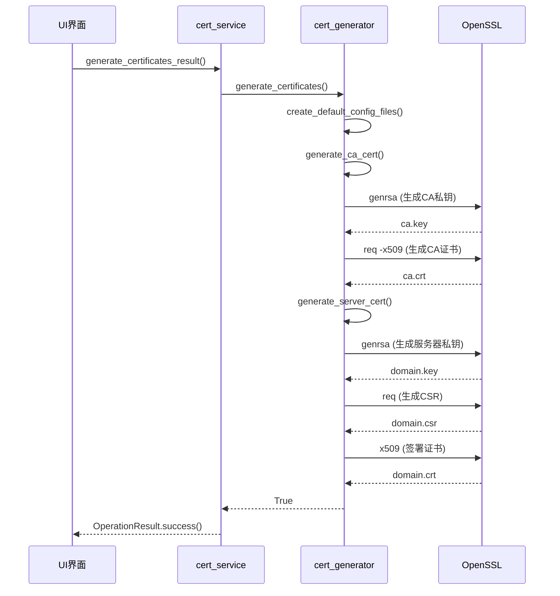
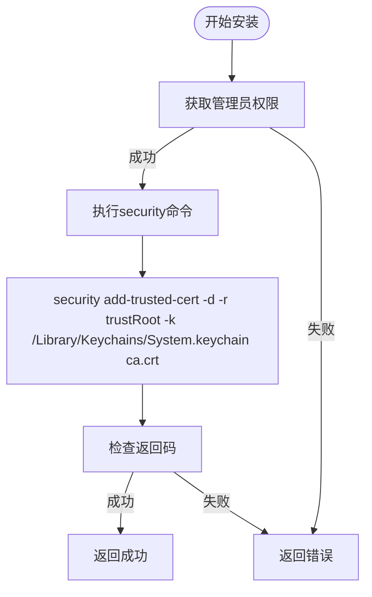
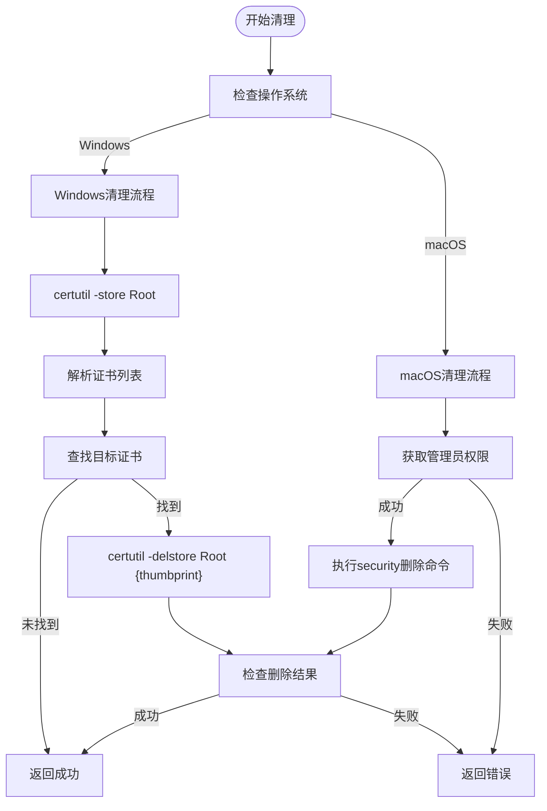
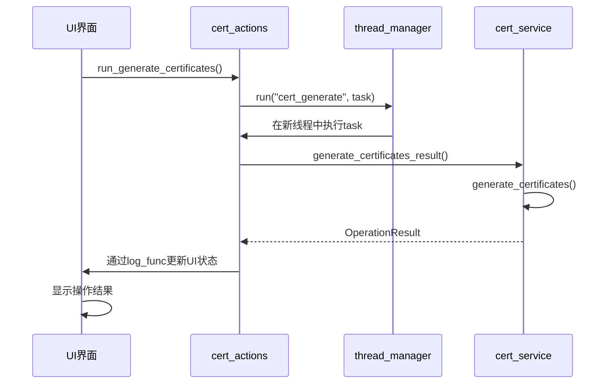

# 证书服务

<cite>
**本文档引用的文件**   
- [cert_service.py](file://modules/services/cert_service.py)
- [cert_generator.py](file://modules/cert/cert_generator.py)
- [cert_installer.py](file://modules/cert/cert_installer.py)
- [cert_checker.py](file://modules/cert/cert_checker.py)
- [cert_cleaner.py](file://modules/cert/cert_cleaner.py)
- [ca_store.py](file://modules/cert/ca_store.py)
- [operation_result.py](file://modules/runtime/operation_result.py)
- [resource_manager.py](file://modules/runtime/resource_manager.py)
- [v3_ca.cnf](file://ca/v3_ca.cnf)
- [v3_req.cnf](file://ca/v3_req.cnf)
- [openssl.cnf](file://ca/openssl.cnf)
</cite>

## 目录
1. [简介](#简介)
2. [证书生命周期管理](#证书生命周期管理)
3. [证书生成流程](#证书生成流程)
4. [跨平台证书安装](#跨平台证书安装)
5. [证书校验机制](#证书校验机制)
6. [证书清理策略](#证书清理策略)
7. [UI操作流程集成](#ui操作流程集成)
8. [技术参数说明](#技术参数说明)

## 简介
本系统提供完整的证书生命周期管理功能，包括证书生成、安装、校验和清理。通过模块化设计，实现了跨平台的证书管理能力，支持Windows和macOS系统。系统使用OpenSSL作为底层加密工具，通过Python封装提供安全可靠的证书管理服务。

## 证书生命周期管理
证书服务模块（cert_service）作为核心协调组件，封装了证书的完整生命周期管理功能。该服务通过调用底层模块实现证书的生成、安装、校验和清理操作，并通过OperationResult返回结构化结果。



**图表来源**
- [cert_service.py](file://modules/services/cert_service.py#L1-L38)
- [cert_generator.py](file://modules/cert/cert_generator.py#L1-L446)
- [cert_installer.py](file://modules/cert/cert_installer.py#L1-L51)

## 证书生成流程
证书生成服务通过调用cert_generator.py模块实现根CA和服务器证书的完整生成流程。该流程遵循标准的PKI体系结构，确保生成的证书符合行业标准。

### 生成流程步骤
1. 检查OpenSSL可用性
2. 创建必要的配置文件
3. 生成CA证书和私钥
4. 生成服务器证书和私钥
5. 使用CA签署服务器证书



**图表来源**
- [cert_generator.py](file://modules/cert/cert_generator.py#L386-L446)
- [cert_service.py](file://modules/services/cert_service.py#L10-L17)

**本节来源**
- [cert_generator.py](file://modules/cert/cert_generator.py#L1-L446)
- [cert_service.py](file://modules/services/cert_service.py#L10-L17)

## 跨平台证书安装
证书安装过程在Windows和macOS平台有不同的实现方式，主要体现在与系统信任库的交互方式上。

### Windows平台实现
在Windows系统中，使用certutil命令行工具将CA证书添加到"受信任的根证书颁发机构"存储中。

```mermaid
flowchart TD
Start([开始安装]) --> CheckFile["检查证书文件存在"]
CheckFile --> |存在| RunCertUtil["执行certutil命令"]
CheckFile --> |不存在| ReturnError["返回错误"]
RunCertUtil --> Command["certutil -addstore -f \"ROOT\" \"ca.crt\""]
Command --> CheckResult["检查返回码"]
CheckResult --> |成功| ReturnSuccess["返回成功"]
CheckResult --> |失败| ReturnError
```

### macOS平台实现
在macOS系统中，需要获取管理员权限后，使用security命令将证书安装到系统钥匙串并设为信任。



**图表来源**
- [ca_store.py](file://modules/cert/ca_store.py#L120-L179)
- [macos_privileged_helper.py](file://modules/platform/macos_privileged_helper.py#L133-L166)

**本节来源**
- [cert_installer.py](file://modules/cert/cert_installer.py#L1-L51)
- [ca_store.py](file://modules/cert/ca_store.py#L28-L42)

## 证书校验机制
证书校验机制通过检查系统信任存储中是否存在指定Common Name的CA证书来检测现有证书的有效性与信任状态。

### 校验流程
```mermaid
sequenceDiagram
participant UI as UI界面
participant CertService as cert_service
participant CertChecker as cert_checker
participant CaStore as ca_store
UI->>CertService : has_existing_ca_cert_result()
CertService->>CertChecker : check_existing_ca_cert()
CertChecker->>CaStore : check_ca_cert()
CaStore->>CaStore : is_macos()/is_windows()
condition Windows系统
CaStore->>System : certutil -store Root
System-->>CaStore : 证书列表
CaStore->>CaStore : parse_certutil_store()
CaStore->>CaStore : filter_certs_by_name()
end
condition macOS系统
CaStore->>System : security find-certificate
System-->>CaStore : 证书信息
end
CaStore-->>CertChecker : OperationResult
CertChecker-->>CertService : OperationResult
CertService-->>UI : OperationResult
```

**图表来源**
- [cert_checker.py](file://modules/cert/cert_checker.py#L11-L22)
- [ca_store.py](file://modules/cert/ca_store.py#L14-L80)

**本节来源**
- [cert_checker.py](file://modules/cert/cert_checker.py#L1-L25)
- [ca_store.py](file://modules/cert/ca_store.py#L14-L118)

## 证书清理策略
证书清理策略确保在卸载时彻底移除所有相关凭据，防止残留证书影响系统安全。

### 清理流程


**图表来源**
- [cert_cleaner.py](file://modules/cert/cert_cleaner.py#L12-L20)
- [ca_store.py](file://modules/cert/ca_store.py#L44-L267)

**本节来源**
- [cert_cleaner.py](file://modules/cert/cert_cleaner.py#L1-L23)
- [ca_store.py](file://modules/cert/ca_store.py#L44-L304)

## UI操作流程集成
服务通过响应"一键生成证书"请求，与UI操作流程紧密集成，并通过OperationResult返回结构化结果。

### 操作流程


**图表来源**
- [cert_actions.py](file://modules/actions/cert_actions.py#L9-L27)
- [cert_service.py](file://modules/services/cert_service.py#L10-L17)

**本节来源**
- [cert_actions.py](file://modules/actions/cert_actions.py#L1-L66)
- [cert_service.py](file://modules/services/cert_service.py#L10-L17)

## 技术参数说明
系统使用标准的加密算法和证书配置，确保生成的证书具有足够的安全性和兼容性。

### 证书格式与加密算法
| 参数 | 值 | 说明 |
|------|-----|------|
| 密钥长度 | 2048位 | RSA密钥长度 |
| 哈希算法 | SHA-256 | 数字签名哈希算法 |
| CA证书有效期 | 36500天 | 约100年 |
| 服务器证书有效期 | 365天 | 1年 |
| 私钥格式 | PKCS#8 | 标准私钥格式 |
| 证书格式 | X.509 | 标准证书格式 |

### 配置文件参数
**v3_ca.cnf (CA证书扩展配置)**
```
[ v3_ca ]
subjectKeyIdentifier=hash
authorityKeyIdentifier=keyid:always,issuer
basicConstraints = critical, CA:TRUE, pathlen:3
keyUsage = critical, cRLSign, keyCertSign
nsCertType = sslCA, emailCA
```

**v3_req.cnf (服务器证书扩展配置)**
```
[ v3_req ]
basicConstraints = CA:FALSE
keyUsage = nonRepudiation, digitalSignature, keyEncipherment
subjectAltName = @alt_names
```

**openssl.cnf (基础配置)**
```
[ req ]
default_bits		= 2048
default_md		= sha256
distinguished_name	= req_distinguished_name
attributes		= req_attributes
```

**本节来源**
- [v3_ca.cnf](file://ca/v3_ca.cnf#L1-L7)
- [v3_req.cnf](file://ca/v3_req.cnf#L1-L5)
- [openssl.cnf](file://ca/openssl.cnf#L1-L24)
- [cert_generator.py](file://modules/cert/cert_generator.py#L125-L203)