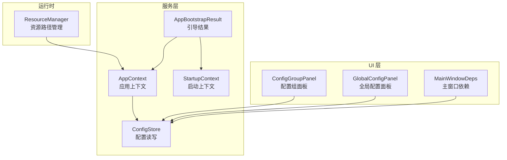
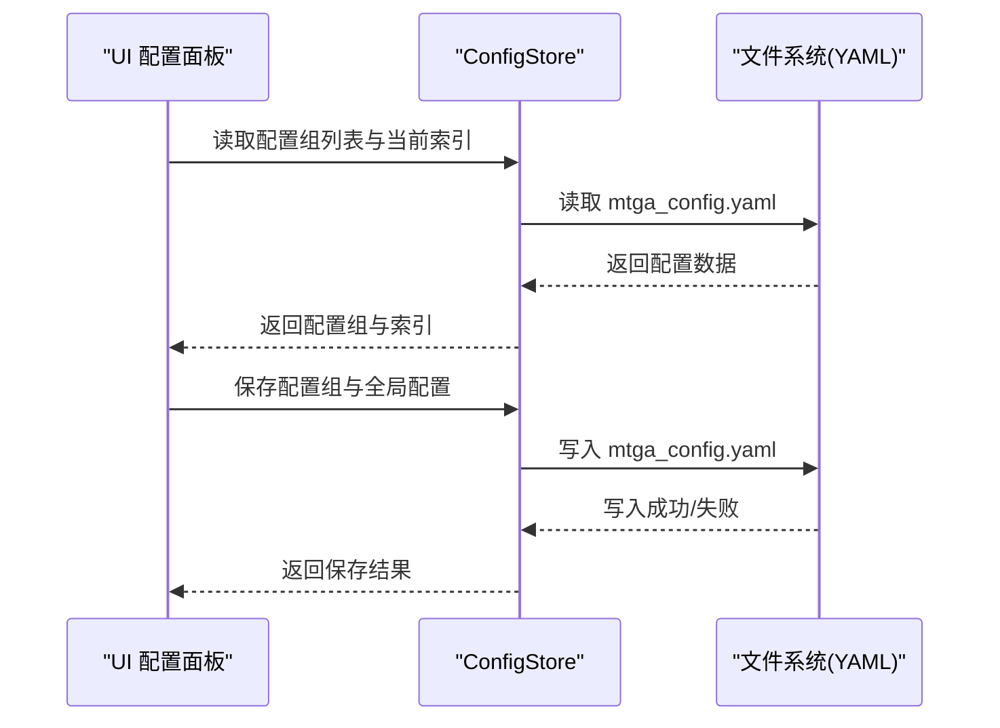
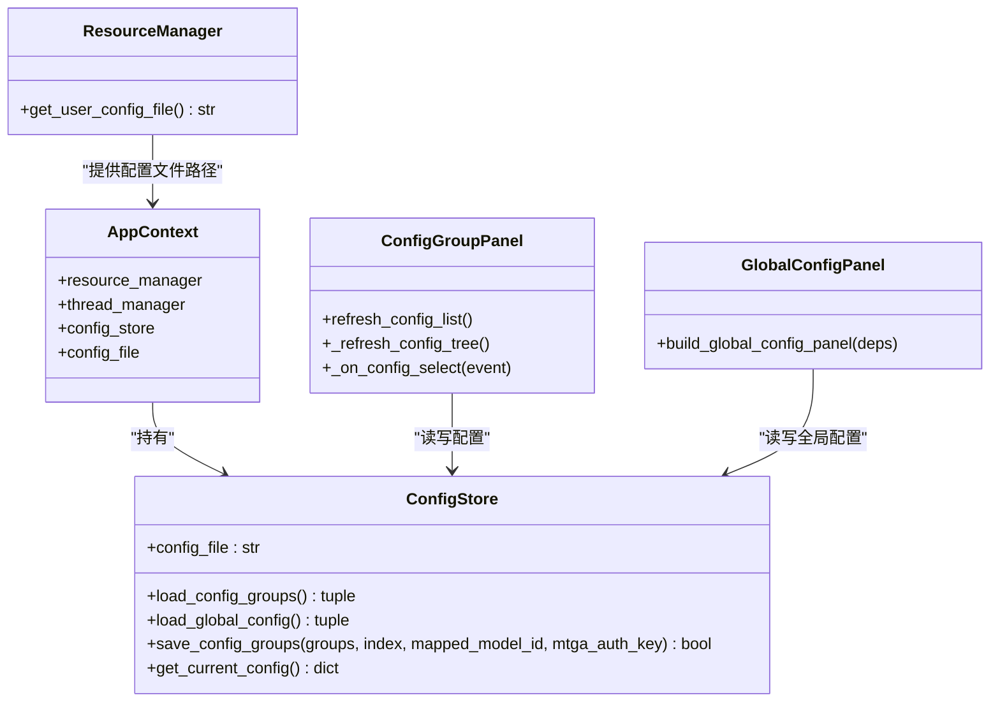

# 配置服务

<cite>
**本文引用的文件**
- [config_service.py](file://modules/services/config_service.py)
- [bootstrap.py](file://modules/services/bootstrap.py)
- [app_bootstrap.py](file://modules/services/app_bootstrap.py)
- [startup_context.py](file://modules/services/startup_context.py)
- [resource_manager.py](file://modules/runtime/resource_manager.py)
- [config_group_panel.py](file://modules/ui/config_group_panel.py)
- [global_config_panel.py](file://modules/ui/global_config_panel.py)
- [main_window_deps.py](file://modules/ui/main_window_deps.py)
- [startup_checks.py](file://modules/services/startup_checks.py)
</cite>

## 目录
1. [简介](#简介)
2. [项目结构](#项目结构)
3. [核心组件](#核心组件)
4. [架构总览](#架构总览)
5. [详细组件分析](#详细组件分析)
6. [依赖关系分析](#依赖关系分析)
7. [性能考量](#性能考量)
8. [故障排查指南](#故障排查指南)
9. [结论](#结论)
10. [附录](#附录)

## 简介
本文件围绕配置服务的实现进行深入解析，重点覆盖以下方面：
- ConfigStore 类如何管理 YAML 格式的用户配置文件读写与序列化
- 配置项结构设计（全局模型映射、API 密钥、代理端口等字段的存储方式）
- 配置热加载能力的实现原理及 UI 状态同步机制
- 应用启动时的初始化流程（build_app_context 函数）与默认值填充策略
- 配置文件路径管理、数据验证规则与异常处理机制
- 常见配置错误及其修复方法

## 项目结构
配置服务位于 modules/services 目录，配合资源管理模块与 UI 层共同完成配置的持久化与展示。关键文件如下：
- 配置服务：modules/services/config_service.py
- 应用上下文构建：modules/services/bootstrap.py
- 应用引导装配：modules/services/app_bootstrap.py
- 启动上下文：modules/services/startup_context.py
- 资源路径管理：modules/runtime/resource_manager.py
- UI 配置面板：modules/ui/config_group_panel.py、modules/ui/global_config_panel.py
- UI 依赖装配：modules/ui/main_window_deps.py
- 启动检查：modules/services/startup_checks.py

图表来源
- [config_service.py](file://modules/services/config_service.py#L10-L81)
- [bootstrap.py](file://modules/services/bootstrap.py#L10-L29)
- [app_bootstrap.py](file://modules/services/app_bootstrap.py#L19-L38)
- [startup_context.py](file://modules/services/startup_context.py#L9-L35)
- [resource_manager.py](file://modules/runtime/resource_manager.py#L201-L254)
- [config_group_panel.py](file://modules/ui/config_group_panel.py#L28-L514)
- [global_config_panel.py](file://modules/ui/global_config_panel.py#L19-L88)
- [main_window_deps.py](file://modules/ui/main_window_deps.py#L30-L58)

章节来源
- [config_service.py](file://modules/services/config_service.py#L1-L81)
- [bootstrap.py](file://modules/services/bootstrap.py#L1-L29)
- [app_bootstrap.py](file://modules/services/app_bootstrap.py#L1-L38)
- [startup_context.py](file://modules/services/startup_context.py#L1-L35)
- [resource_manager.py](file://modules/runtime/resource_manager.py#L1-L294)
- [config_group_panel.py](file://modules/ui/config_group_panel.py#L1-L514)
- [global_config_panel.py](file://modules/ui/global_config_panel.py#L1-L88)
- [main_window_deps.py](file://modules/ui/main_window_deps.py#L1-L58)

## 核心组件
- ConfigStore：负责配置文件的读取、写入与序列化，提供配置组列表与当前索引、全局配置（映射模型 ID、MTGA 鉴权 Key）的读取与保存。
- AppContext：应用上下文，聚合资源管理器、线程管理器与 ConfigStore，并暴露配置文件路径。
- ResourceManager：提供用户数据目录与配置文件路径（mtga_config.yaml），并负责模板文件复制与资源检查。
- UI 配置面板：ConfigGroupPanel 与 GlobalConfigPanel 通过 ConfigStore 与 UI 进行双向交互，实现配置组列表的增删改、排序与全局配置的保存。

章节来源
- [config_service.py](file://modules/services/config_service.py#L10-L81)
- [bootstrap.py](file://modules/services/bootstrap.py#L10-L29)
- [resource_manager.py](file://modules/runtime/resource_manager.py#L201-L254)
- [config_group_panel.py](file://modules/ui/config_group_panel.py#L28-L514)
- [global_config_panel.py](file://modules/ui/global_config_panel.py#L19-L88)

## 架构总览
配置服务采用“服务层 + 运行时 + UI 层”的分层架构：
- 服务层：ConfigStore 提供配置读写能力；AppContext 聚合服务与资源；AppBootstrapResult 负责引导装配。
- 运行时：ResourceManager 提供用户数据目录与配置文件路径，确保路径正确且模板文件就绪。
- UI 层：ConfigGroupPanel 与 GlobalConfigPanel 通过 ConfigStore 与 UI 状态同步，实现配置的可视化编辑与持久化。

图表来源
- [config_service.py](file://modules/services/config_service.py#L14-L81)
- [config_group_panel.py](file://modules/ui/config_group_panel.py#L155-L206)
- [global_config_panel.py](file://modules/ui/global_config_panel.py#L52-L77)

## 详细组件分析

### ConfigStore 类与配置持久化机制
ConfigStore 以 YAML 为配置文件格式，提供以下能力：
- 加载配置组列表与当前索引：load_config_groups
- 加载全局配置（映射模型 ID、MTGA 鉴权 Key）：load_global_config
- 保存配置组列表、当前索引与全局配置：save_config_groups
- 获取当前配置组：get_current_config

配置文件结构要点：
- config_groups：配置组数组，每个元素包含 API URL、实际模型 ID、API Key、可选的中间路由等字段。
- current_config_index：当前生效的配置组索引。
- mapped_model_id：全局映射模型 ID。
- mtga_auth_key：全局 MTGA 鉴权 Key。

读写流程与默认值：
- 读取：若文件存在且包含 config_groups 字段，则返回配置组与 current_config_index；否则返回空列表与默认索引 0。全局配置字段缺失时返回空字符串。
- 写入：若原文件存在则先读取合并，再写入新的 config_groups、current_config_index 与可选的 mapped_model_id、mtga_auth_key。写入前确保目录存在，使用 UTF-8 编码与缩进格式化输出。

异常处理：
- 读取与写入均包裹在异常捕获中，失败时返回空结果或 False，避免影响 UI 与启动流程。

章节来源
- [config_service.py](file://modules/services/config_service.py#L10-L81)

### 配置热加载与 UI 状态同步
- 刷新配置组列表：ConfigGroupPanel 在界面初始化与“刷新”按钮触发时调用 ConfigStore.load_config_groups，从磁盘重新读取配置组与当前索引，并更新 Treeview。
- 选择切换与保存：当用户在 Treeview 中选择某一行时，面板调用 ConfigStore.save_config_groups 保存当前索引，实现“热切换”当前配置组。
- 全局配置保存：GlobalConfigPanel 读取并校验输入后，调用 ConfigStore.save_config_groups 将全局配置写入文件，同时保持配置组不变。

事件通知机制：
- UI 通过直接调用 ConfigStore 方法实现状态同步，无需显式事件订阅。每次保存都会落盘，UI 通过重新加载实现热更新。

章节来源
- [config_group_panel.py](file://modules/ui/config_group_panel.py#L36-L206)
- [global_config_panel.py](file://modules/ui/global_config_panel.py#L52-L77)

### 应用启动时的初始化流程与默认值填充
- 构建应用上下文：build_app_context 从 ResourceManager 获取用户配置文件路径（mtga_config.yaml），并创建 ConfigStore 实例，随后返回 AppContext。
- 引导装配：build_app_bootstrap 调用 build_app_context 获取 AppContext，同时构建 StartupContext 并设置错误日志与异常钩子。
- 默认值填充策略：
  - 配置组为空时返回空列表与索引 0。
  - 全局配置字段缺失时返回空字符串。
  - UI 在首次加载时会读取这些默认值并渲染界面。

章节来源
- [bootstrap.py](file://modules/services/bootstrap.py#L18-L29)
- [app_bootstrap.py](file://modules/services/app_bootstrap.py#L19-L38)
- [resource_manager.py](file://modules/runtime/resource_manager.py#L243-L254)
- [config_service.py](file://modules/services/config_service.py#L14-L38)

### 配置文件路径管理
- 用户数据目录：get_user_data_dir 根据平台与历史兼容性选择目录，并确保存在。
- 配置文件路径：get_user_config_file 返回 mtga_config.yaml 的绝对路径，位于用户数据目录下的 ca 子目录。
- 资源复制：ResourceManager 初始化时会将模板文件复制到用户目录，确保首次运行具备必要的配置模板。

章节来源
- [resource_manager.py](file://modules/runtime/resource_manager.py#L32-L44)
- [resource_manager.py](file://modules/runtime/resource_manager.py#L243-L254)
- [resource_manager.py](file://modules/runtime/resource_manager.py#L159-L198)

### 数据验证规则与异常处理
- 配置组字段校验（UI 层）：
  - API URL、实际模型 ID、API Key 为必填项；中间路由可选。
  - UI 对 API Key 进行遮罩显示，仅在保存时传入真实值。
- 全局配置校验（UI 层）：
  - 映射模型 ID 与 MTGA 鉴权 Key 为必填项。
- 异常处理（服务层）：
  - 读取与写入均捕获异常，失败时返回空结果或 False，避免抛出异常影响启动与 UI。
- 启动检查（环境层面）：
  - startup_checks 提供主机文件可写性与网络环境检查，辅助定位配置相关问题。

章节来源
- [config_group_panel.py](file://modules/ui/config_group_panel.py#L223-L226)
- [global_config_panel.py](file://modules/ui/global_config_panel.py#L61-L63)
- [config_service.py](file://modules/services/config_service.py#L14-L38)
- [startup_checks.py](file://modules/services/startup_checks.py#L25-L107)

## 依赖关系分析
- ConfigStore 依赖于文件系统与 YAML 序列化库，不依赖 UI 层，保证了服务层的独立性。
- AppContext 由 ResourceManager 提供配置文件路径，ConfigStore 依赖该路径进行读写。
- UI 配置面板通过 MainWindowDeps 注入 ConfigStore，实现 UI 与服务层的解耦。
- AppBootstrapResult 负责装配 AppContext 与 StartupContext，确保启动阶段的上下文完整。

图表来源
- [config_service.py](file://modules/services/config_service.py#L10-L81)
- [bootstrap.py](file://modules/services/bootstrap.py#L10-L29)
- [resource_manager.py](file://modules/runtime/resource_manager.py#L201-L254)
- [config_group_panel.py](file://modules/ui/config_group_panel.py#L28-L514)
- [global_config_panel.py](file://modules/ui/global_config_panel.py#L19-L88)

章节来源
- [config_service.py](file://modules/services/config_service.py#L10-L81)
- [bootstrap.py](file://modules/services/bootstrap.py#L10-L29)
- [resource_manager.py](file://modules/runtime/resource_manager.py#L201-L254)
- [config_group_panel.py](file://modules/ui/config_group_panel.py#L28-L514)
- [global_config_panel.py](file://modules/ui/global_config_panel.py#L19-L88)

## 性能考量
- YAML 读写：ConfigStore 使用安全加载与缩进格式化，适合小规模配置文件；若配置组数量增长，建议在 UI 层做增量更新与批量保存，减少频繁 IO。
- 目录创建：写入前确保目录存在，避免多次创建开销。
- UI 刷新：Treeview 刷新时重建节点，建议在大量配置组场景下优化渲染逻辑（例如按需刷新）。

## 故障排查指南
- 配置文件未生成或为空
  - 检查用户数据目录是否存在与可写；确认 ResourceManager 已完成模板复制。
  - 章节来源
    - [resource_manager.py](file://modules/runtime/resource_manager.py#L215-L221)
- 保存失败
  - 查看异常捕获返回值；确认磁盘空间与文件权限；检查 YAML 语法（缩进、键名大小写）。
  - 章节来源
    - [config_service.py](file://modules/services/config_service.py#L46-L74)
- UI 不显示配置组
  - 确认配置文件包含 config_groups 字段；点击“刷新”按钮重新加载。
  - 章节来源
    - [config_group_panel.py](file://modules/ui/config_group_panel.py#L155-L190)
- 全局配置未生效
  - 确认映射模型 ID 与 MTGA 鉴权 Key 均非空；保存后检查文件内容。
  - 章节来源
    - [global_config_panel.py](file://modules/ui/global_config_panel.py#L57-L77)
- 启动环境问题
  - 使用 startup_checks 输出的诊断信息定位 hosts 文件可写性与网络代理问题。
  - 章节来源
    - [startup_checks.py](file://modules/services/startup_checks.py#L67-L107)

## 结论
配置服务通过 ConfigStore 提供简洁可靠的 YAML 配置读写能力，结合 AppContext 与 ResourceManager 实现清晰的启动流程与路径管理。UI 层通过直接调用 ConfigStore 实现配置的热加载与状态同步，整体架构解耦良好、易于扩展。建议在大规模配置场景下进一步优化 UI 渲染与服务层批量写入策略，以提升性能与用户体验。

## 附录
- 配置文件字段说明
  - config_groups：配置组数组，每项包含 API URL、实际模型 ID、API Key、可选中间路由等。
  - current_config_index：当前生效配置组索引。
  - mapped_model_id：全局映射模型 ID。
  - mtga_auth_key：全局 MTGA 鉴权 Key。
- 常见错误与修复
  - 字段缺失：确保配置文件包含 config_groups 与必要字段；若缺失，服务层返回默认值。
  - 权限不足：确保用户数据目录可写；必要时以管理员身份运行。
  - YAML 语法错误：检查缩进与键名大小写；使用缩进格式化输出避免手写错误。
  - 章节来源
    - [config_service.py](file://modules/services/config_service.py#L14-L38)
    - [config_group_panel.py](file://modules/ui/config_group_panel.py#L223-L226)
    - [global_config_panel.py](file://modules/ui/global_config_panel.py#L61-L63)