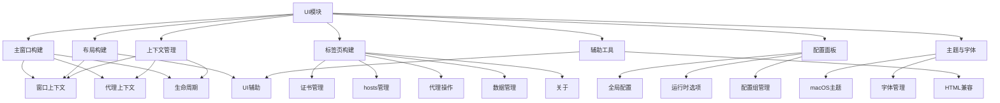
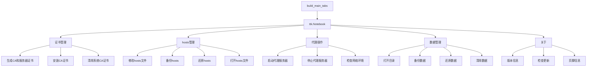
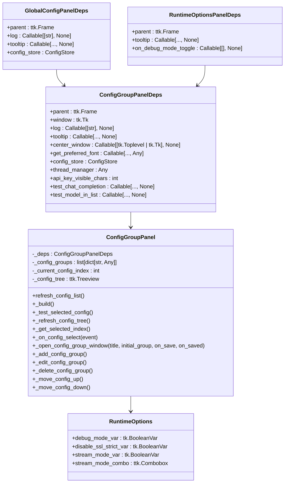
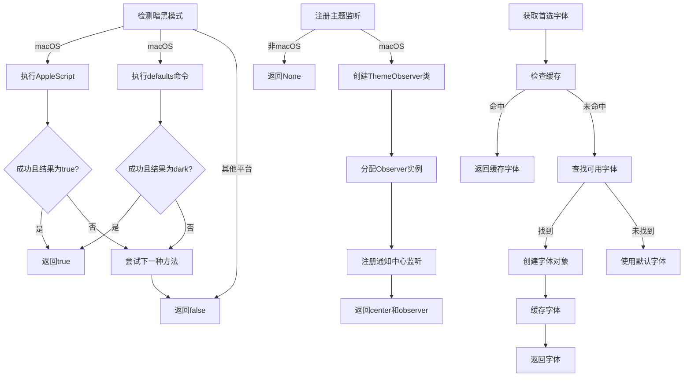
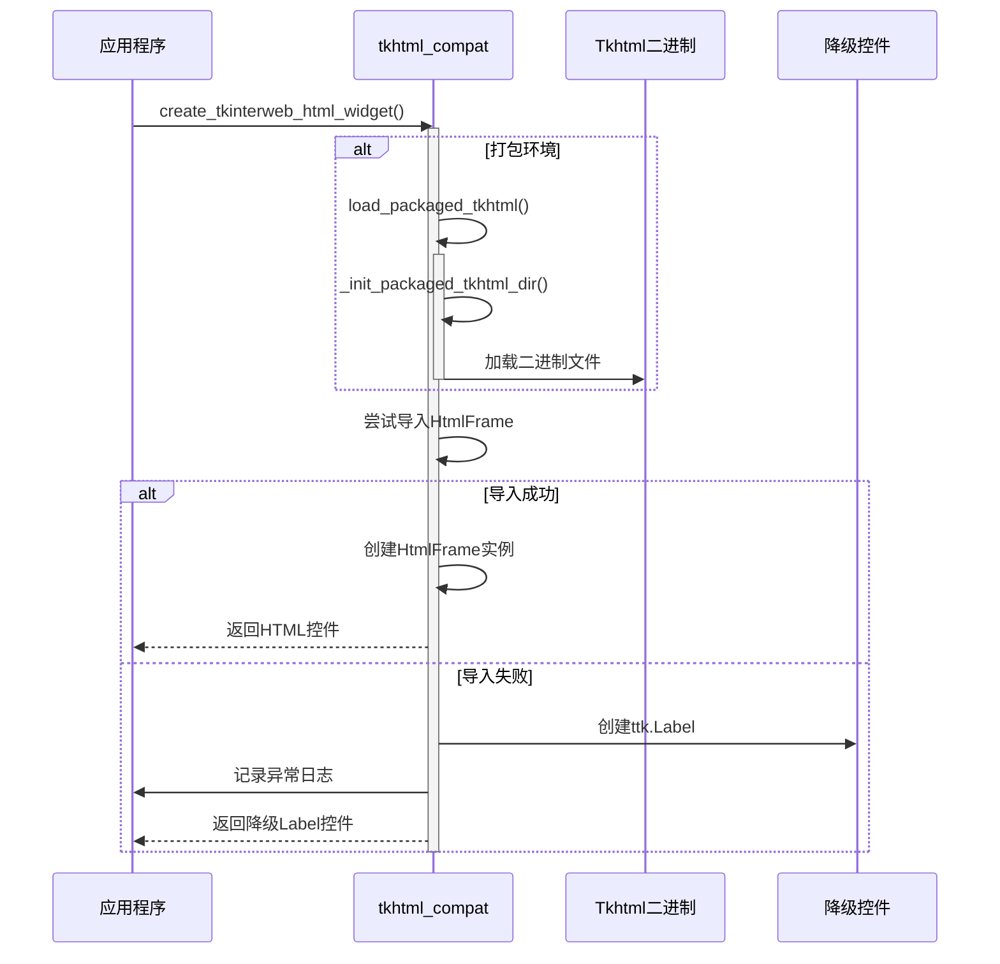
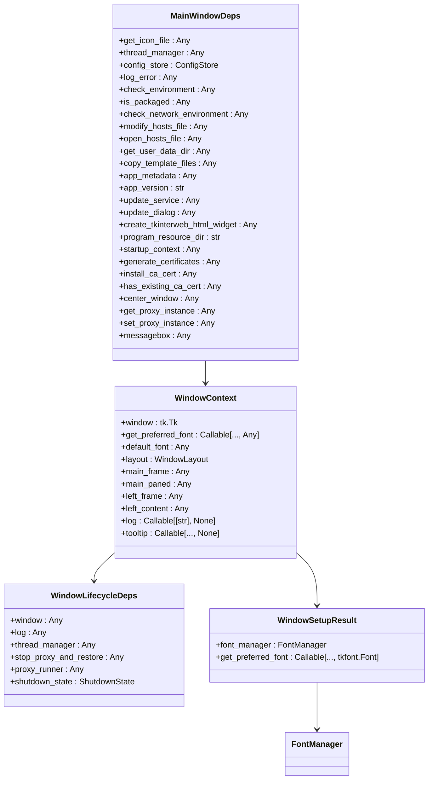
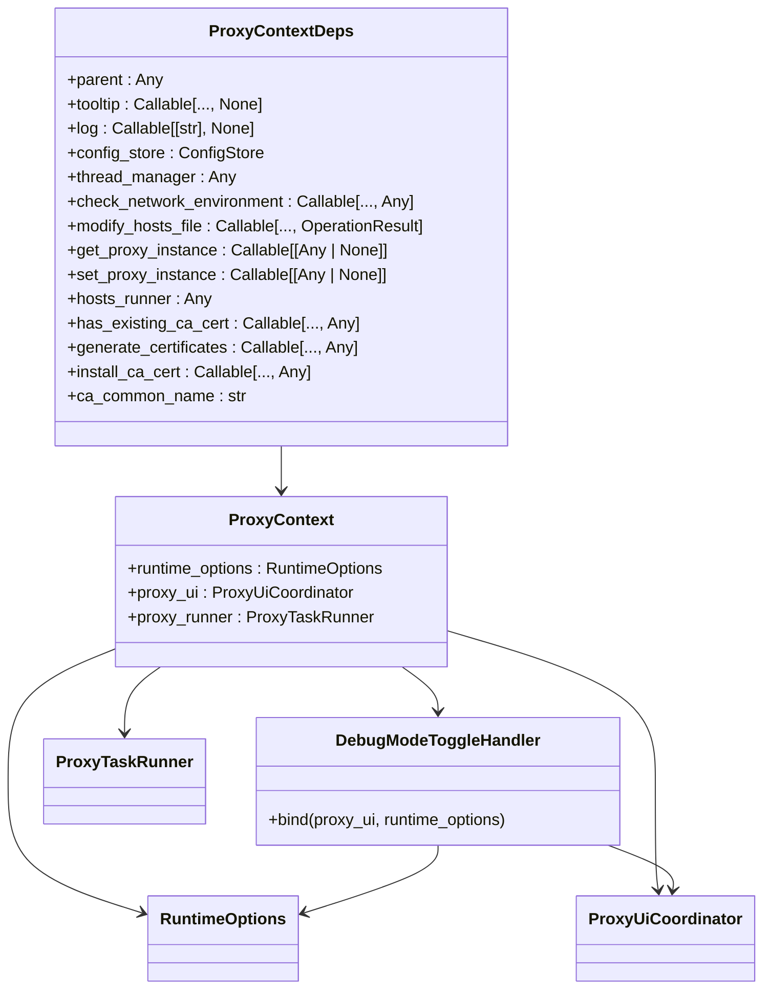

# UI模块

<cite>
**本文档引用文件**  
- [main_window_builder.py](file://modules/ui/main_window_builder.py)
- [layout_builders.py](file://modules/ui/layout_builders.py)
- [tab_builders.py](file://modules/ui/tab_builders.py)
- [global_config_panel.py](file://modules/ui/global_config_panel.py)
- [runtime_options_panel.py](file://modules/ui/runtime_options_panel.py)
- [macos_theme.py](file://modules/ui/macos_theme.py)
- [tk_fonts.py](file://modules/ui/tk_fonts.py)
- [tkhtml_compat.py](file://modules/ui/tkhtml_compat.py)
- [window_lifecycle.py](file://modules/ui/window_lifecycle.py)
- [window_context.py](file://modules/ui/window_context.py)
- [proxy_context.py](file://modules/ui/proxy_context.py)
- [config_group_panel.py](file://modules/ui/config_group_panel.py)
- [footer_actions.py](file://modules/ui/footer_actions.py)
- [ui_helpers.py](file://modules/ui/ui_helpers.py)
- [window_setup.py](file://modules/ui/window_setup.py)
</cite>

## 目录
1. [项目结构](#项目结构)
2. [主窗口构建体系](#主窗口构建体系)
3. [布局与标签页组织](#布局与标签页组织)
4. [配置表单实现机制](#配置表单实现机制)
5. [视觉风格与字体管理](#视觉风格与字体管理)
6. [HTML内容兼容性渲染](#html内容兼容性渲染)
7. [窗口生命周期与状态上下文](#窗口生命周期与状态上下文)
8. [代理状态与UI联动](#代理状态与ui联动)
9. [开发指南与最佳实践](#开发指南与最佳实践)

## 项目结构

**图示来源**  
- [main_window_builder.py](file://modules/ui/main_window_builder.py)
- [layout_builders.py](file://modules/ui/layout_builders.py)
- [tab_builders.py](file://modules/ui/tab_builders.py)
- [global_config_panel.py](file://modules/ui/global_config_panel.py)
- [runtime_options_panel.py](file://modules/ui/runtime_options_panel.py)
- [macos_theme.py](file://modules/ui/macos_theme.py)
- [tk_fonts.py](file://modules/ui/tk_fonts.py)
- [tkhtml_compat.py](file://modules/ui/tkhtml_compat.py)
- [window_lifecycle.py](file://modules/ui/window_lifecycle.py)
- [window_context.py](file://modules/ui/window_context.py)
- [proxy_context.py](file://modules/ui/proxy_context.py)

## 主窗口构建体系

主窗口的构建通过 `main_window_builder.py` 实现，采用依赖注入模式组织UI组件。`build_main_window` 函数接收 `MainWindowDeps` 数据类作为依赖容器，协调多个UI组件的初始化与集成。

构建流程遵循严格的初始化顺序：
1. 创建窗口上下文（`window_context`）
2. 初始化配置面板（`config_group_panel`, `global_config_panel`）
3. 构建代理上下文（`proxy_context`）
4. 创建主标签页（`tab_builders.build_main_tabs`）
5. 配置更新控制器（`update_bootstrap`）
6. 构建底部操作按钮（`footer_actions`）
7. 绑定窗口关闭生命周期（`window_lifecycle`）
8. 初始化主布局（`layout_builders.init_paned_layout`）

这种分层构建模式确保了组件间的松耦合和高内聚，便于维护和扩展。

**本节来源**  
- [main_window_builder.py](file://modules/ui/main_window_builder.py#L59-L207)
- [window_context.py](file://modules/ui/window_context.py#L28-L69)

## 布局与标签页组织

### 布局构建

`layout_builders.py` 负责创建主窗口的基础布局结构。`build_main_layout` 函数返回 `WindowLayout` 数据类，包含以下核心组件：
- `main_frame`: 主容器框架
- `main_paned`: 水平分割窗格
- `left_frame` 和 `right_frame`: 左右两个面板
- `log_text`: 日志显示区域
- `log`: 日志记录函数

布局采用响应式设计，通过 `init_paned_layout` 函数在窗口首次渲染时自动调整分割位置，确保左右面板宽度相等。

### 标签页构建

`tab_builders.py` 实现了标签页系统的动态生成。`build_main_tabs` 函数根据传入的依赖创建包含多个功能标签页的笔记本控件（`ttk.Notebook`），包括：

- **证书管理**: 提供生成、安装和清除CA证书的功能
- **hosts文件管理**: 支持修改、备份、还原和打开hosts文件
- **代理服务器操作**: 包含启动/停止代理和检查网络环境
- **用户数据管理**: 在打包版本中提供数据备份、还原和清除功能
- **关于**: 显示应用信息和检查更新按钮

标签页构建采用依赖注入模式，每个标签页都有对应的依赖数据类（如 `CertTabDeps`, `HostsTabDeps` 等），确保功能独立且可测试。

**图示来源**  
- [layout_builders.py](file://modules/ui/layout_builders.py#L23-L71)
- [tab_builders.py](file://modules/ui/tab_builders.py#L475-L561)

**本节来源**  
- [layout_builders.py](file://modules/ui/layout_builders.py)
- [tab_builders.py](file://modules/ui/tab_builders.py)

## 配置表单实现机制

### 全局配置面板

`global_config_panel.py` 实现了全局配置表单，包含两个必填字段：
- **映射模型ID**: 用于Trae端填写的模型名
- **MTGA鉴权Key**: 作为代理服务的全局密钥

该面板通过 `ConfigStore` 服务实现状态持久化，提供加载和保存功能。输入验证在保存时执行，确保两个字段均不为空。

### 运行时选项面板

`runtime_options_panel.py` 创建了运行时选项控件，包含：
- **调试模式**: 开启后输出详细日志并检查系统代理配置
- **关闭SSL严格模式**: 禁用SSL证书严格验证
- **强制流模式**: 控制流式传输行为，组合框在复选框选中时启用

该面板返回 `RuntimeOptions` 数据类，包含所有UI控件的变量引用，便于外部组件访问和控制。

### 配置组管理面板

`config_group_panel.py` 实现了复杂的配置组管理功能，包含：
- **配置组列表**: 使用 `ttk.Treeview` 显示所有配置
- **增删改查**: 支持新增、修改、删除配置组
- **排序**: 支持上移和下移配置组
- **测活功能**: 测试选中配置的实际对话功能

配置组表单包含智能输入处理，如中间路由的占位符管理和API Key的掩码显示。

**图示来源**  
- [global_config_panel.py](file://modules/ui/global_config_panel.py#L11-L17)
- [runtime_options_panel.py](file://modules/ui/runtime_options_panel.py#L9-L22)
- [config_group_panel.py](file://modules/ui/config_group_panel.py#L13-L26)

**本节来源**  
- [global_config_panel.py](file://modules/ui/global_config_panel.py)
- [runtime_options_panel.py](file://modules/ui/runtime_options_panel.py)
- [config_group_panel.py](file://modules/ui/config_group_panel.py)

## 视觉风格与字体管理

### macOS主题适配

`macos_theme.py` 实现了macOS原生视觉风格适配，主要功能包括：

- **暗黑模式检测**: 通过AppleScript和系统命令检测当前是否为暗黑模式
- **主题变更监听**: 使用Objective-C桥接注册系统主题变更通知

`detect_macos_dark_mode` 函数尝试多种方法检测暗黑模式状态，包括：
1. 执行AppleScript查询系统偏好设置
2. 读取系统默认设置中的界面风格

`register_macos_theme_observer` 函数在macOS平台上注册主题变更监听器，当用户切换系统主题时触发回调函数。

### 字体管理策略

`tk_fonts.py` 实现了跨平台字体管理，核心组件为 `FontManager` 类：

- **字体候选列表**: 定义了多种中文字体的优先级顺序
- **字体缓存**: 使用字典缓存已创建的字体对象，避免重复创建
- **平台适配**: 在macOS上自动调整字体大小以适应高DPI显示

`get_preferred_font` 方法根据平台和需求返回合适的字体对象，优先使用候选列表中的字体，若不可用则回退到系统默认字体。

`apply_global_font` 函数通过 `option_add` 和 `Style.configure` 确保所有ttk控件使用指定字体，解决ttk控件可能忽略全局字体设置的问题。

**图示来源**  
- [macos_theme.py](file://modules/ui/macos_theme.py#L30-L93)
- [tk_fonts.py](file://modules/ui/tk_fonts.py#L24-L66)

**本节来源**  
- [macos_theme.py](file://modules/ui/macos_theme.py)
- [tk_fonts.py](file://modules/ui/tk_fonts.py)

## HTML内容兼容性渲染

`tkhtml_compat.py` 模块为打包环境下的HTML内容渲染提供兼容性支持，主要解决tkinterweb/Tkhtml在打包后的导入问题。

核心功能包括：

- **打包环境初始化**: `_init_packaged_tkhtml_dir` 函数在打包资源目录中初始化Tkhtml解压目录
- **DLL路径设置**: 将Tkhtml二进制文件目录添加到系统PATH中，确保Windows平台能正确加载
- **模块伪造**: 创建伪 `tkinterweb_tkhtml` 模块，强制指向解压目录
- **安全降级**: `create_tkinterweb_html_widget` 函数在HTML渲染失败时自动降级为普通Label控件

该模块采用防御性编程，所有可能失败的操作都包含异常处理，确保即使HTML渲染功能不可用，主应用仍能正常运行。

**图示来源**  
- [tkhtml_compat.py](file://modules/ui/tkhtml_compat.py#L85-L120)

**本节来源**  
- [tkhtml_compat.py](file://modules/ui/tkhtml_compat.py)

## 窗口生命周期与状态上下文

### 窗口生命周期

`window_lifecycle.py` 模块定义了窗口关闭的生命周期钩子。`bind_window_close` 函数将窗口关闭协议（WM_DELETE_WINDOW）绑定到关闭处理函数，确保在用户尝试关闭窗口时执行必要的清理操作。

该模块与 `actions.shutdown_actions` 模块协同工作，处理代理停止、资源释放等清理任务，防止应用异常退出。

### 窗口状态上下文

`window_context.py` 模块维护UI状态上下文，通过 `build_window_context` 函数创建 `WindowContext` 对象，集中管理以下状态：

- **窗口实例**: Tk根窗口
- **字体管理**: 首选字体获取函数
- **布局结构**: 主要UI组件的引用
- **日志功能**: 日志记录函数
- **工具提示**: 工具提示创建函数

`window_context` 依赖 `window_setup.py` 进行窗口的初始设置，包括标题、尺寸、图标和全局字体应用。

**图示来源**  
- [main_window_builder.py](file://modules/ui/main_window_builder.py#L30-L57)
- [window_context.py](file://modules/ui/window_context.py#L14-L26)
- [window_lifecycle.py](file://modules/ui/window_lifecycle.py#L9-L16)
- [window_setup.py](file://modules/ui/window_setup.py#L14-L17)

**本节来源**  
- [window_lifecycle.py](file://modules/ui/window_lifecycle.py)
- [window_context.py](file://modules/ui/window_context.py)
- [window_setup.py](file://modules/ui/window_setup.py)

## 代理状态与UI联动

`proxy_context.py` 模块是UI与代理功能的核心桥梁，通过 `build_proxy_context` 函数创建 `ProxyContext` 对象，实现代理状态与UI元素的联动。

该模块整合了多个功能组件：
- **运行时选项**: 通过 `runtime_options_panel` 创建运行时选项控件
- **UI协调器**: `proxy_ui_coordinator.ProxyUiCoordinator` 管理代理相关的UI状态
- **任务运行器**: `proxy_actions.ProxyTaskRunner` 执行代理相关任务

`build_proxy_context` 函数建立以下联动关系：
1. 调试模式切换时更新网络环境预检查状态
2. 运行时选项与UI协调器的绑定
3. 代理任务运行器与各种依赖的注入

这种设计模式实现了关注点分离，UI状态管理、用户交互和后台任务执行各司其职，通过清晰的接口进行通信。

**图示来源**  
- [proxy_context.py](file://modules/ui/proxy_context.py#L13-L29)
- [proxy_context.py](file://modules/ui/proxy_context.py#L31-L35)

**本节来源**  
- [proxy_context.py](file://modules/ui/proxy_context.py)

## 开发指南与最佳实践

### 组件复用模式

UI模块采用高度模块化的组件复用模式：
- **功能组件化**: 每个UI功能（如配置面板、标签页）都封装为独立模块
- **依赖注入**: 通过数据类传递依赖，提高组件的可测试性和可复用性
- **工厂模式**: 使用 `build_*` 函数创建组件实例，隐藏复杂初始化逻辑

### 事件绑定规范

事件绑定遵循以下规范：
- **Lambda包装**: 简单的事件处理使用lambda表达式
- **方法绑定**: 复杂逻辑封装为类方法
- **依赖传递**: 通过闭包或类属性传递必要的依赖

### 无障碍访问支持

UI模块提供基本的无障碍访问支持：
- **工具提示**: 所有重要控件都配有详细的工具提示
- **键盘导航**: 使用标准的ttk控件确保基本的键盘导航支持
- **语义化标签**: 使用有意义的控件标签和描述

### 扩展建议

为界面扩展提供以下建议：
1. **遵循现有模式**: 新功能应采用与现有代码相同的架构模式
2. **依赖注入**: 使用数据类传递依赖，避免全局状态
3. **错误处理**: 所有UI操作都应包含适当的错误处理和用户反馈
4. **国际化**: 考虑未来可能的多语言支持，将用户可见文本集中管理

**本节来源**  
- [ui_helpers.py](file://modules/ui/ui_helpers.py)
- [main_window_builder.py](file://modules/ui/main_window_builder.py)
- [tab_builders.py](file://modules/ui/tab_builders.py)
- [config_group_panel.py](file://modules/ui/config_group_panel.py)