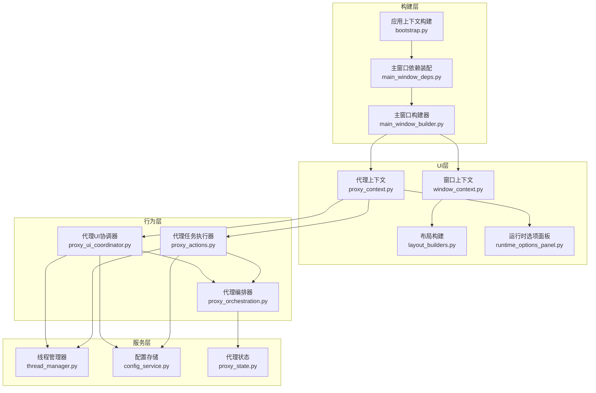
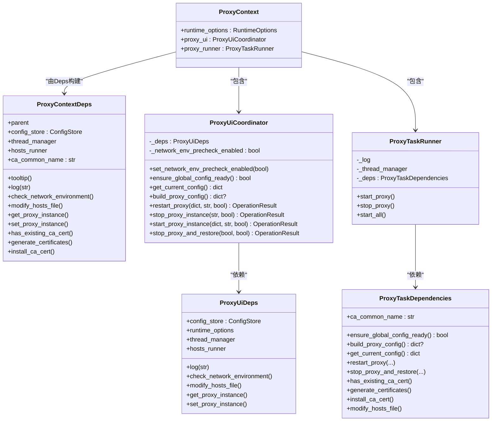
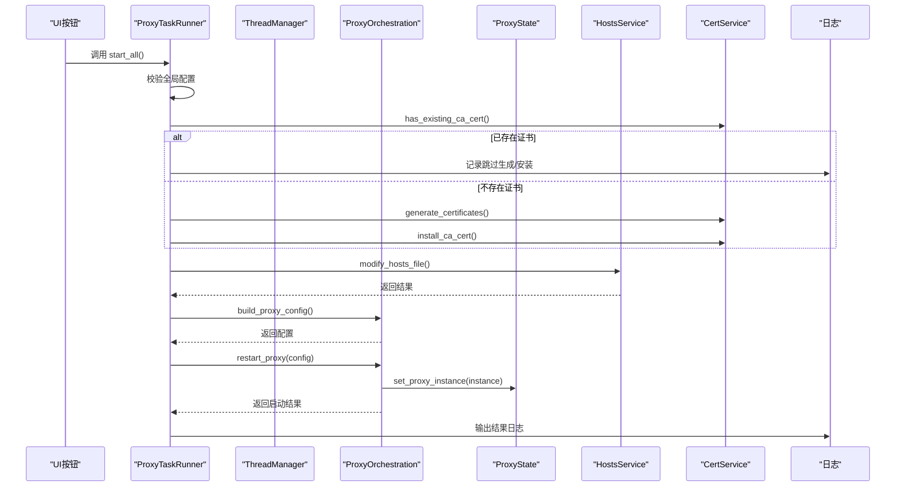
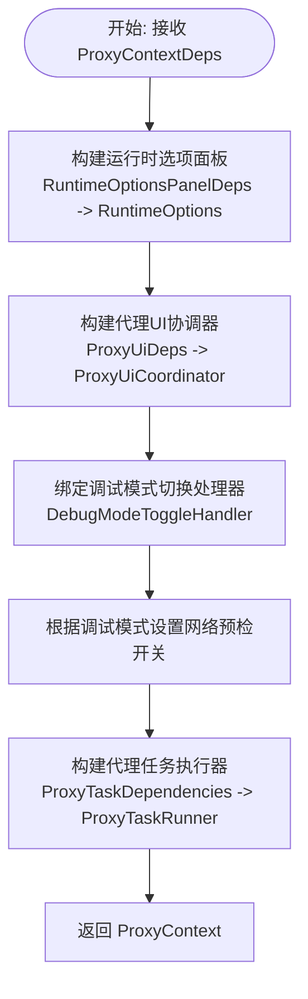
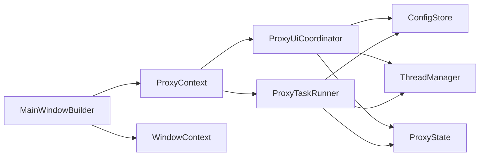

# 上下文管理

<cite>
**本文引用的文件列表**
- [modules/ui/proxy_context.py](file://modules/ui/proxy_context.py)
- [modules/ui/window_context.py](file://modules/ui/window_context.py)
- [modules/actions/proxy_ui_coordinator.py](file://modules/actions/proxy_ui_coordinator.py)
- [modules/actions/proxy_actions.py](file://modules/actions/proxy_actions.py)
- [modules/services/proxy_orchestration.py](file://modules/services/proxy_orchestration.py)
- [modules/services/proxy_state.py](file://modules/services/proxy_state.py)
- [modules/services/config_service.py](file://modules/services/config_service.py)
- [modules/runtime/thread_manager.py](file://modules/runtime/thread_manager.py)
- [modules/ui/runtime_options_panel.py](file://modules/ui/runtime_options_panel.py)
- [modules/ui/main_window_builder.py](file://modules/ui/main_window_builder.py)
- [modules/ui/main_window_deps.py](file://modules/ui/main_window_deps.py)
- [modules/ui/layout_builders.py](file://modules/ui/layout_builders.py)
- [modules/services/bootstrap.py](file://modules/services/bootstrap.py)
</cite>

## 目录
1. [引言](#引言)
2. [项目结构](#项目结构)
3. [核心组件](#核心组件)
4. [架构总览](#架构总览)
5. [详细组件分析](#详细组件分析)
6. [依赖关系分析](#依赖关系分析)
7. [性能考量](#性能考量)
8. [故障排查指南](#故障排查指南)
9. [结论](#结论)
10. [附录：上下文扩展开发指南](#附录上下文扩展开发指南)

## 引言
本文件聚焦于UI上下文与代理状态的协同管理机制，围绕以下目标展开：
- 解析ProxyContext数据类如何封装运行时选项、代理UI协调器和任务执行器
- 分析ProxyContextDeps依赖对象的构建与注入过程
- 阐述build_proxy_context函数如何整合日志、配置存储、线程管理等服务，实现代理功能的集中控制
- 解释window_context.py中窗口上下文的状态维护策略，包括组件引用管理和跨模块通信机制
- 提供上下文扩展开发指南，说明如何安全地添加新的状态字段和服务依赖，确保线程安全与数据一致性

## 项目结构
本项目的UI与代理控制采用“上下文+依赖注入”的分层设计：
- UI层：负责窗口布局、组件装配、事件绑定与日志展示
- 行为层：负责代理UI协调、任务编排与网络/证书/hosts等外部操作
- 服务层：负责配置持久化、线程管理、代理状态存取等基础设施
- 构建层：负责组装上下文、注入依赖、建立跨模块通信

图表来源
- [modules/ui/main_window_builder.py](file://modules/ui/main_window_builder.py#L59-L207)
- [modules/ui/main_window_deps.py](file://modules/ui/main_window_deps.py#L30-L57)
- [modules/services/bootstrap.py](file://modules/services/bootstrap.py#L18-L28)
- [modules/ui/window_context.py](file://modules/ui/window_context.py#L28-L69)
- [modules/ui/layout_builders.py](file://modules/ui/layout_builders.py#L23-L71)
- [modules/ui/runtime_options_panel.py](file://modules/ui/runtime_options_panel.py#L24-L76)
- [modules/ui/proxy_context.py](file://modules/ui/proxy_context.py#L38-L83)
- [modules/actions/proxy_ui_coordinator.py](file://modules/actions/proxy_ui_coordinator.py#L25-L122)
- [modules/actions/proxy_actions.py](file://modules/actions/proxy_actions.py#L25-L128)
- [modules/services/proxy_orchestration.py](file://modules/services/proxy_orchestration.py#L36-L199)
- [modules/services/config_service.py](file://modules/services/config_service.py#L10-L80)
- [modules/runtime/thread_manager.py](file://modules/runtime/thread_manager.py#L42-L167)
- [modules/services/proxy_state.py](file://modules/services/proxy_state.py#L7-L22)

章节来源
- [modules/ui/main_window_builder.py](file://modules/ui/main_window_builder.py#L59-L207)
- [modules/ui/main_window_deps.py](file://modules/ui/main_window_deps.py#L30-L57)
- [modules/services/bootstrap.py](file://modules/services/bootstrap.py#L18-L28)

## 核心组件
本节从数据结构与职责角度，梳理关键组件及其关系。

图表来源
- [modules/ui/proxy_context.py](file://modules/ui/proxy_context.py#L13-L83)
- [modules/actions/proxy_ui_coordinator.py](file://modules/actions/proxy_ui_coordinator.py#L12-L122)
- [modules/actions/proxy_actions.py](file://modules/actions/proxy_actions.py#L11-L128)

章节来源
- [modules/ui/proxy_context.py](file://modules/ui/proxy_context.py#L13-L83)
- [modules/actions/proxy_ui_coordinator.py](file://modules/actions/proxy_ui_coordinator.py#L12-L122)
- [modules/actions/proxy_actions.py](file://modules/actions/proxy_actions.py#L11-L128)

## 架构总览
本节以序列图展示“一键启动全部服务”的典型流程，体现上下文与各组件间的协作。

图表来源
- [modules/actions/proxy_actions.py](file://modules/actions/proxy_actions.py#L69-L128)
- [modules/services/proxy_orchestration.py](file://modules/services/proxy_orchestration.py#L70-L199)
- [modules/services/proxy_state.py](file://modules/services/proxy_state.py#L15-L22)

章节来源
- [modules/actions/proxy_actions.py](file://modules/actions/proxy_actions.py#L69-L128)
- [modules/services/proxy_orchestration.py](file://modules/services/proxy_orchestration.py#L70-L199)
- [modules/services/proxy_state.py](file://modules/services/proxy_state.py#L15-L22)

## 详细组件分析

### ProxyContext与ProxyContextDeps：代理上下文的封装与注入
- 数据类职责
  - ProxyContextDeps：集中声明代理功能所需的所有外部依赖，包括日志、配置存储、线程管理、网络环境检查、hosts操作、证书生成/安装、代理实例存取、UI协调器等。通过冻结数据类保证依赖注入的不可变性，降低误用风险。
  - ProxyContext：聚合运行时选项面板、代理UI协调器、代理任务执行器，作为UI侧对代理功能的统一入口。
- 构建流程
  - build_proxy_context接收ProxyContextDeps，内部：
    - 使用RuntimeOptionsPanelDeps构建运行时选项面板，并绑定调试模式切换处理器
    - 使用ProxyUiDeps构建ProxyUiCoordinator，注入日志、配置、线程管理、网络检查、hosts操作、代理实例存取、hosts任务执行器等
    - 使用ProxyTaskDependencies构建ProxyTaskRunner，注入ensure_global_config_ready、build_proxy_config、get_current_config、restart_proxy、stop_proxy_and_restore、证书相关、hosts修改等回调
    - 返回ProxyContext，供上层窗口构建器使用

图表来源
- [modules/ui/proxy_context.py](file://modules/ui/proxy_context.py#L38-L83)
- [modules/ui/runtime_options_panel.py](file://modules/ui/runtime_options_panel.py#L24-L76)
- [modules/actions/proxy_ui_coordinator.py](file://modules/actions/proxy_ui_coordinator.py#L25-L122)
- [modules/actions/proxy_actions.py](file://modules/actions/proxy_actions.py#L25-L128)

章节来源
- [modules/ui/proxy_context.py](file://modules/ui/proxy_context.py#L13-L83)
- [modules/ui/runtime_options_panel.py](file://modules/ui/runtime_options_panel.py#L24-L76)
- [modules/actions/proxy_ui_coordinator.py](file://modules/actions/proxy_ui_coordinator.py#L25-L122)
- [modules/actions/proxy_actions.py](file://modules/actions/proxy_actions.py#L11-L128)

### ProxyUiCoordinator：UI与业务的桥梁
- 关键职责
  - 全局配置校验：确保映射模型ID与MTGA鉴权Key等必要字段就绪
  - 配置构建：基于当前配置与运行时选项（调试模式、SSL严格模式、流模式）生成最终代理配置
  - 代理生命周期管理：重启代理（先停止再启动）、启动/停止代理实例、停止并恢复（清理hosts）
  - 网络环境预检：在调试模式下进行网络环境检查
- 线程与日志
  - 通过依赖注入的线程管理器与日志回调，确保UI与后台任务解耦，避免阻塞主线程

章节来源
- [modules/actions/proxy_ui_coordinator.py](file://modules/actions/proxy_ui_coordinator.py#L25-L122)
- [modules/services/proxy_orchestration.py](file://modules/services/proxy_orchestration.py#L36-L199)

### ProxyTaskRunner：任务编排与依赖注入
- 关键职责
  - 启动代理：串行等待停止任务完成，构建配置并重启代理
  - 停止代理：串行等待启动任务完成，执行停止并恢复
  - 一键启动全部服务：按步骤执行证书生成/安装、hosts修改、代理启动，并记录详细日志
- 依赖注入
  - 通过ProxyTaskDependencies注入全局配置校验、配置构建、代理启动/停止、证书与hosts操作等回调，形成清晰的职责边界

章节来源
- [modules/actions/proxy_actions.py](file://modules/actions/proxy_actions.py#L25-L128)

### WindowContext：窗口上下文的状态维护与组件引用
- 状态字段
  - window：主窗口实例
  - 字体与布局：get_preferred_font、default_font、layout、main_frame、main_paned、left_frame、left_content
  - 日志与提示：log、tooltip
- 组件引用管理
  - 通过build_window_context集中初始化窗口、布局、字体、日志与提示，形成稳定的组件引用集合，便于跨模块共享
- 跨模块通信
  - 将log与tooltip传递给各子模块，实现统一的日志与提示策略

章节来源
- [modules/ui/window_context.py](file://modules/ui/window_context.py#L14-L69)
- [modules/ui/layout_builders.py](file://modules/ui/layout_builders.py#L23-L71)

### 主窗口构建链路：从依赖装配到上下文注入
- 依赖装配
  - build_app_context：创建资源管理器、线程管理器、配置存储
  - build_main_window_deps：将AppContext与平台/服务层能力组合为MainWindowDeps
- 上下文构建
  - build_main_window：创建WindowContext，构建配置面板、全局配置面板、代理上下文，装配标签页与底部动作，绑定窗口关闭事件
- 注入与联动
  - 代理上下文通过ProxyContextDeps注入日志、配置、线程、网络检查、hosts、证书、代理实例存取等能力
  - 运行时选项面板与代理UI协调器联动，调试模式影响网络预检开关

章节来源
- [modules/services/bootstrap.py](file://modules/services/bootstrap.py#L18-L28)
- [modules/ui/main_window_deps.py](file://modules/ui/main_window_deps.py#L30-L57)
- [modules/ui/main_window_builder.py](file://modules/ui/main_window_builder.py#L59-L207)

## 依赖关系分析
- 组件耦合
  - ProxyContextDeps与ProxyContext形成“依赖注入+聚合”的组合，降低直接耦合
  - ProxyUiCoordinator与ProxyTaskRunner均依赖ProxyTaskDependencies，职责清晰且可替换
- 外部依赖
  - 线程管理：ThreadManager提供任务调度、并发控制与状态查询
  - 配置存储：ConfigStore提供配置加载/保存与当前配置读取
  - 代理状态：ProxyState提供全局代理实例的读写
- 循环依赖
  - 通过依赖注入避免循环导入；ProxyContextDeps在构建阶段一次性注入，运行期不改变

图表来源
- [modules/ui/proxy_context.py](file://modules/ui/proxy_context.py#L38-L83)
- [modules/actions/proxy_ui_coordinator.py](file://modules/actions/proxy_ui_coordinator.py#L25-L122)
- [modules/actions/proxy_actions.py](file://modules/actions/proxy_actions.py#L25-L128)
- [modules/services/config_service.py](file://modules/services/config_service.py#L10-L80)
- [modules/runtime/thread_manager.py](file://modules/runtime/thread_manager.py#L42-L167)
- [modules/services/proxy_state.py](file://modules/services/proxy_state.py#L7-L22)
- [modules/ui/main_window_builder.py](file://modules/ui/main_window_builder.py#L118-L135)

章节来源
- [modules/ui/proxy_context.py](file://modules/ui/proxy_context.py#L38-L83)
- [modules/actions/proxy_ui_coordinator.py](file://modules/actions/proxy_ui_coordinator.py#L25-L122)
- [modules/actions/proxy_actions.py](file://modules/actions/proxy_actions.py#L25-L128)
- [modules/services/config_service.py](file://modules/services/config_service.py#L10-L80)
- [modules/runtime/thread_manager.py](file://modules/runtime/thread_manager.py#L42-L167)
- [modules/services/proxy_state.py](file://modules/services/proxy_state.py#L7-L22)
- [modules/ui/main_window_builder.py](file://modules/ui/main_window_builder.py#L118-L135)

## 性能考量
- 线程管理
  - ThreadManager通过命名锁与任务快照，避免重复任务与竞态条件；支持按名称串行与并行控制，便于UI与后台任务解耦
- 任务依赖
  - ProxyTaskRunner在启动/停止任务间设置等待依赖，减少冲突与资源竞争
- I/O与网络
  - 证书生成/安装、hosts修改、网络检查等耗时操作通过线程执行，避免阻塞UI
- 配置访问
  - ConfigStore对配置文件的读写采用原子化处理，减少异常导致的数据损坏

章节来源
- [modules/runtime/thread_manager.py](file://modules/runtime/thread_manager.py#L42-L167)
- [modules/actions/proxy_actions.py](file://modules/actions/proxy_actions.py#L39-L67)
- [modules/services/config_service.py](file://modules/services/config_service.py#L40-L74)

## 故障排查指南
- 代理启动失败
  - 检查端口占用：网络编排器会在443被占用时拒绝启动
  - 查看日志：确认hosts修改、证书生成/安装、代理启动的每一步结果
  - 网络预检：调试模式下可启用网络环境预检，定位系统代理等干扰因素
- 配置缺失
  - 全局配置校验失败时，需在“全局配置”面板补齐映射模型ID与MTGA鉴权Key
- 线程卡顿
  - 使用ThreadManager查询活跃任务与错误快照，定位阻塞点
- 代理实例泄漏
  - 确保每次停止代理后调用set_proxy_instance(None)，避免旧实例残留

章节来源
- [modules/services/proxy_orchestration.py](file://modules/services/proxy_orchestration.py#L153-L184)
- [modules/services/proxy_orchestration.py](file://modules/services/proxy_orchestration.py#L36-L50)
- [modules/runtime/thread_manager.py](file://modules/runtime/thread_manager.py#L133-L167)
- [modules/services/proxy_state.py](file://modules/services/proxy_state.py#L15-L22)

## 结论
本项目通过“上下文+依赖注入”的架构，实现了UI与代理控制的高内聚、低耦合：
- ProxyContextDeps集中声明代理所需依赖，build_proxy_context统一装配运行时选项、UI协调器与任务执行器
- ProxyUiCoordinator与ProxyTaskRunner分别承担UI与任务编排职责，通过ProxyTaskDependencies解耦具体实现
- WindowContext提供稳定的组件引用与日志/提示通道，保障跨模块通信一致
- ThreadManager、ConfigStore、ProxyState等服务层组件提供线程、配置与状态的基础设施支撑

## 附录：上下文扩展开发指南
- 新增状态字段
  - 在对应数据类中添加字段（如ProxyContextDeps、ProxyUiDeps、ProxyTaskDependencies），保持冻结数据类的不可变特性
  - 在构建函数中注入新依赖，并在使用处通过依赖对象访问
- 新增服务依赖
  - 在服务层新增接口或实现，通过依赖注入暴露给UI或行为层
  - 遵循单一职责：每个依赖对象只承载一组相关能力
- 线程安全与数据一致性
  - 使用ThreadManager统一调度后台任务，避免直接操作UI线程
  - 对共享状态（如代理实例）使用ProxyState提供的get/set方法，避免竞态
  - 对配置变更使用ConfigStore的保存接口，确保原子性
- 可测试性与可观测性
  - 通过依赖注入便于Mock测试；为关键路径增加日志与状态快照
  - 对耗时操作提供进度反馈与取消机制

章节来源
- [modules/ui/proxy_context.py](file://modules/ui/proxy_context.py#L13-L36)
- [modules/actions/proxy_ui_coordinator.py](file://modules/actions/proxy_ui_coordinator.py#L12-L23)
- [modules/actions/proxy_actions.py](file://modules/actions/proxy_actions.py#L11-L23)
- [modules/runtime/thread_manager.py](file://modules/runtime/thread_manager.py#L42-L167)
- [modules/services/proxy_state.py](file://modules/services/proxy_state.py#L7-L22)
- [modules/services/config_service.py](file://modules/services/config_service.py#L10-L80)