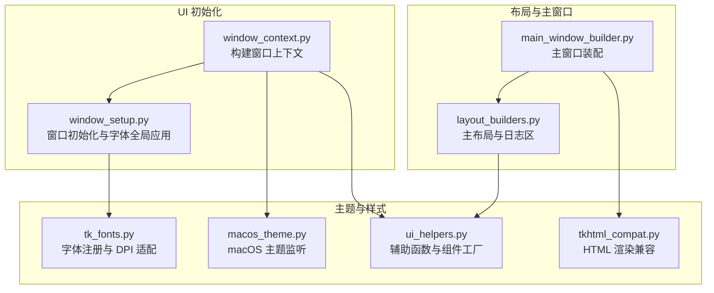
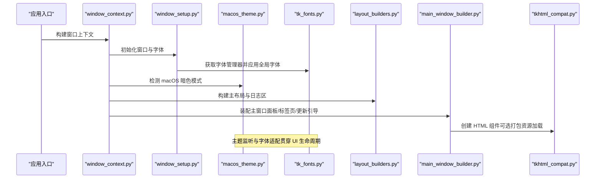
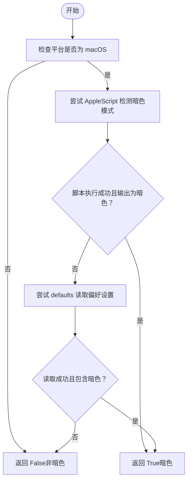
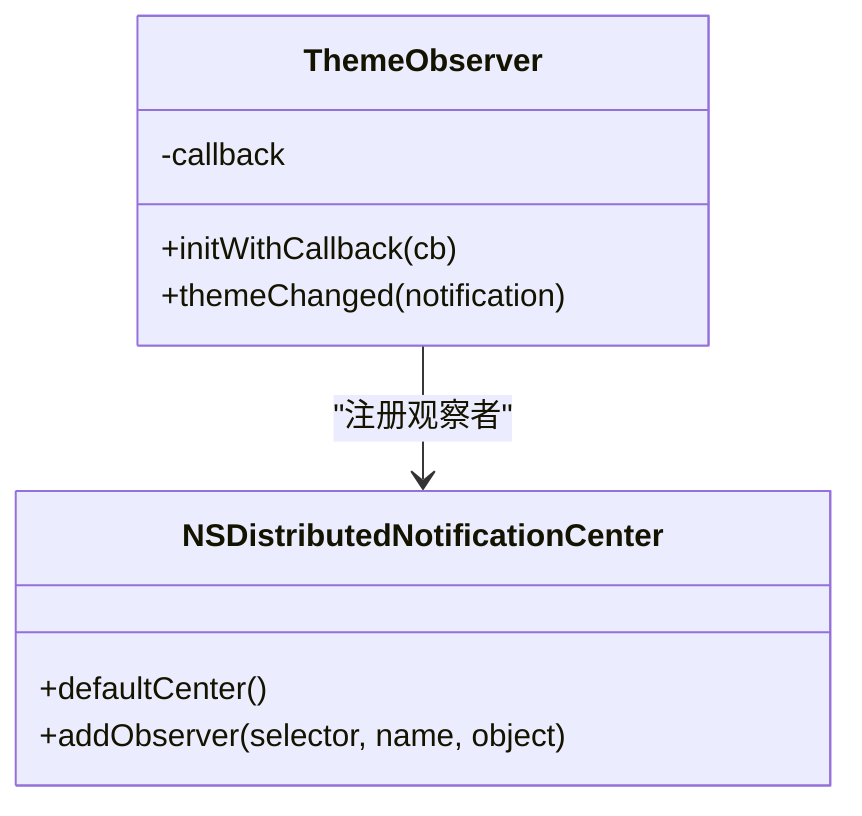
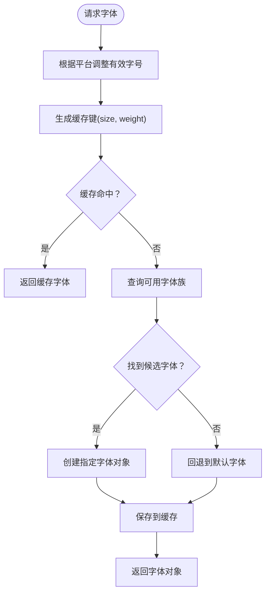
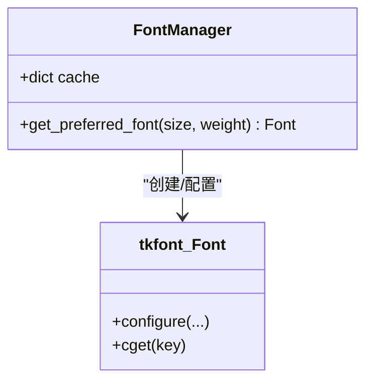
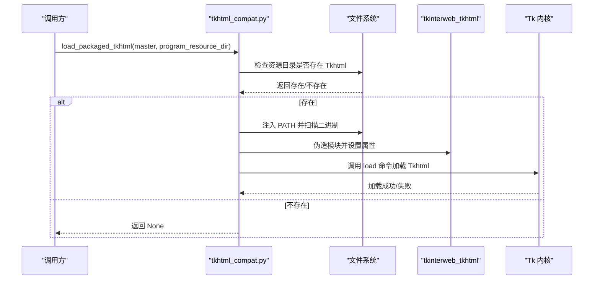
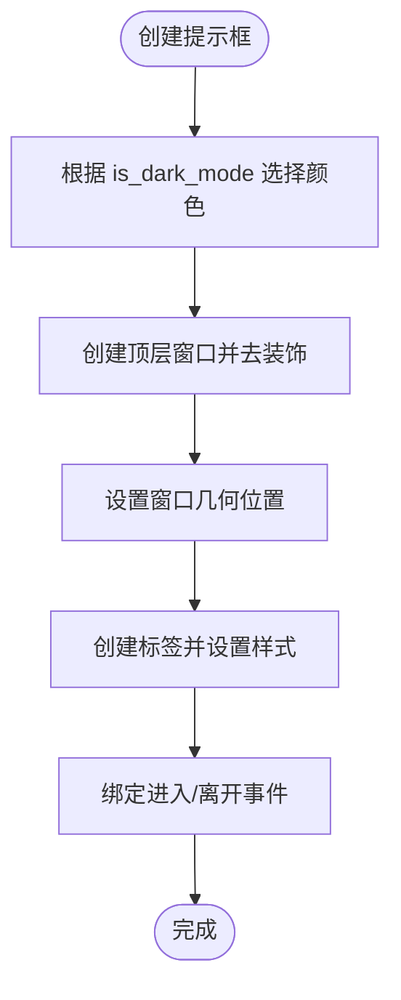
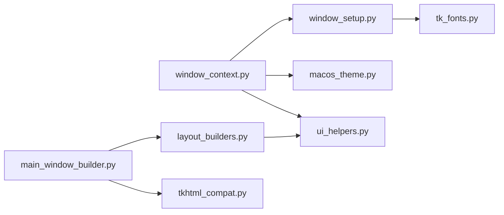

# 主题与样式

<cite>
**本文引用的文件**
- [macos_theme.py](file://modules/ui/macos_theme.py)
- [tk_fonts.py](file://modules/ui/tk_fonts.py)
- [tkhtml_compat.py](file://modules/ui/tkhtml_compat.py)
- [ui_helpers.py](file://modules/ui/ui_helpers.py)
- [window_context.py](file://modules/ui/window_context.py)
- [window_setup.py](file://modules/ui/window_setup.py)
- [layout_builders.py](file://modules/ui/layout_builders.py)
- [main_window_builder.py](file://modules/ui/main_window_builder.py)
</cite>

## 目录
1. [简介](#简介)
2. [项目结构](#项目结构)
3. [核心组件](#核心组件)
4. [架构总览](#架构总览)
5. [详细组件分析](#详细组件分析)
6. [依赖关系分析](#依赖关系分析)
7. [性能考量](#性能考量)
8. [故障排查指南](#故障排查指南)
9. [结论](#结论)
10. [附录：主题扩展指南](#附录主题扩展指南)

## 简介
本文件系统性阐述本项目的跨平台主题适配与视觉样式管理方案，重点围绕以下四个模块展开：
- macOS 主题监听与暗色/亮色模式动态切换
- 跨平台字体注册与 DPI 适配策略
- HTML 片段渲染兼容性处理（富文本提示信息等）
- UI 辅助函数（颜色常量管理、间距规范、组件工厂模式）

同时给出主题扩展指南，帮助新增平台主题支持与自定义样式注入。

## 项目结构
UI 子系统采用“分层+职责分离”的组织方式：
- 窗口上下文与初始化：负责窗口创建、字体全局应用、macOS 主题检测与提示框绑定
- 字体管理：统一字体候选、缓存与全局覆盖
- 主题监听：在 macOS 上监听系统主题变化并触发回调
- HTML 兼容：在打包环境中修复 tkinterweb/Tkhtml 的加载问题并提供降级方案
- 布局与主窗口构建：组织面板、标签页、日志区等布局，并注入字体与主题能力

图表来源
- [window_context.py](file://modules/ui/window_context.py#L28-L69)
- [window_setup.py](file://modules/ui/window_setup.py#L20-L59)
- [macos_theme.py](file://modules/ui/macos_theme.py#L30-L49)
- [tk_fonts.py](file://modules/ui/tk_fonts.py#L20-L75)
- [tkhtml_compat.py](file://modules/ui/tkhtml_compat.py#L85-L121)
- [ui_helpers.py](file://modules/ui/ui_helpers.py#L40-L76)
- [layout_builders.py](file://modules/ui/layout_builders.py#L23-L71)
- [main_window_builder.py](file://modules/ui/main_window_builder.py#L59-L207)

章节来源
- [window_context.py](file://modules/ui/window_context.py#L28-L69)
- [window_setup.py](file://modules/ui/window_setup.py#L20-L59)
- [layout_builders.py](file://modules/ui/layout_builders.py#L23-L71)
- [main_window_builder.py](file://modules/ui/main_window_builder.py#L59-L207)

## 核心组件
- macOS 主题监听与切换：通过系统通知中心监听主题变化，提供即时回调以驱动界面重绘或样式切换
- 跨平台字体管理：统一字体候选列表、缓存机制、全局字体覆盖，针对 macOS 进行字号放大适配
- HTML 渲染兼容：在打包环境下修复 tkinterweb/Tkhtml 加载路径与二进制注入，失败时降级为纯文本标签
- UI 辅助与工厂：提供错误处理器、文本日志器、提示框工厂、窗口居中等通用能力

章节来源
- [macos_theme.py](file://modules/ui/macos_theme.py#L30-L93)
- [tk_fonts.py](file://modules/ui/tk_fonts.py#L20-L75)
- [tkhtml_compat.py](file://modules/ui/tkhtml_compat.py#L14-L121)
- [ui_helpers.py](file://modules/ui/ui_helpers.py#L9-L87)

## 架构总览
下图展示了从窗口初始化到主题监听、字体应用、HTML 渲染与布局装配的整体流程。

图表来源
- [window_context.py](file://modules/ui/window_context.py#L28-L69)
- [window_setup.py](file://modules/ui/window_setup.py#L20-L59)
- [macos_theme.py](file://modules/ui/macos_theme.py#L30-L93)
- [tk_fonts.py](file://modules/ui/tk_fonts.py#L20-L75)
- [layout_builders.py](file://modules/ui/layout_builders.py#L23-L71)
- [main_window_builder.py](file://modules/ui/main_window_builder.py#L59-L207)
- [tkhtml_compat.py](file://modules/ui/tkhtml_compat.py#L85-L121)

## 详细组件分析

### macOS 主题监听与暗色/亮色模式切换
- 功能概述
  - 在 macOS 平台上，通过系统脚本与偏好设置读取当前主题状态
  - 注册分布式通知观察者，监听系统主题变化事件
  - 提供回调接口，便于上层在主题切换时刷新 UI 样式
- 关键点
  - 多种检测路径并行尝试，提升可靠性
  - 观察者类按需延迟创建并复用，减少内存开销
  - 回调签名与通知名称严格匹配系统 API
- 流程图

图表来源
- [macos_theme.py](file://modules/ui/macos_theme.py#L30-L49)

- 类图（主题观察者）

图表来源
- [macos_theme.py](file://modules/ui/macos_theme.py#L66-L93)

章节来源
- [macos_theme.py](file://modules/ui/macos_theme.py#L30-L93)
- [window_context.py](file://modules/ui/window_context.py#L51-L56)

### 跨平台字体注册与 DPI 适配
- 功能概述
  - 统一字体候选列表，优先选择高可读性字体
  - 针对 macOS 进行字号放大适配，保证在高 DPI 下的可读性
  - 缓存已生成的字体对象，避免重复创建
  - 全局应用默认字体，确保所有控件使用一致字体
- 关键点
  - 字体候选顺序兼顾多语言与平台特性
  - macOS 下有效字号计算公式确保视觉一致性
  - 缓存键由尺寸与粗细组合构成，避免误命中
- 流程图

图表来源
- [tk_fonts.py](file://modules/ui/tk_fonts.py#L24-L66)

- 类图（字体管理）

图表来源
- [tk_fonts.py](file://modules/ui/tk_fonts.py#L20-L75)

章节来源
- [tk_fonts.py](file://modules/ui/tk_fonts.py#L20-L75)
- [window_setup.py](file://modules/ui/window_setup.py#L37-L46)

### HTML 渲染兼容性处理（富文本提示信息）
- 功能概述
  - 在打包环境中修复 tkinterweb/Tkhtml 的加载路径与二进制注入
  - 将 Tkhtml 解压目录注入 PATH，伪造模块以便 Tk 调用加载
  - 失败时自动降级为纯文本标签，保证功能可用
- 关键点
  - 仅在提供资源目录时尝试初始化与加载
  - 通过环境变量与模块注入确保 Tkhtml 正确加载
  - 异常捕获与日志记录，便于定位问题
- 序列图

图表来源
- [tkhtml_compat.py](file://modules/ui/tkhtml_compat.py#L14-L82)

章节来源
- [tkhtml_compat.py](file://modules/ui/tkhtml_compat.py#L14-L121)

### UI 辅助函数与组件工厂模式
- 错误处理器工厂
  - 将 Tkinter 回调异常转换为结构化日志，便于调试
- 文本日志器
  - 自动滚动至末尾、处理编码问题、支持外部打印函数
- 提示框工厂
  - 根据 is_dark_mode 自动选择背景/前景色
  - 支持传入字体获取器与换行宽度
- 窗口居中
  - 计算屏幕尺寸与窗口需求尺寸，生成居中几何

图表来源
- [ui_helpers.py](file://modules/ui/ui_helpers.py#L40-L76)

章节来源
- [ui_helpers.py](file://modules/ui/ui_helpers.py#L9-L87)
- [window_context.py](file://modules/ui/window_context.py#L52-L56)

## 依赖关系分析
- 窗口上下文依赖字体管理与主题检测，用于初始化默认字体与提示框颜色
- 主窗口构建依赖布局构建器与 HTML 兼容模块，用于装配面板、标签页与富文本展示
- 字体管理被窗口初始化与布局构建器共同使用，形成稳定的字体供应链

图表来源
- [window_context.py](file://modules/ui/window_context.py#L28-L69)
- [window_setup.py](file://modules/ui/window_setup.py#L20-L59)
- [layout_builders.py](file://modules/ui/layout_builders.py#L23-L71)
- [main_window_builder.py](file://modules/ui/main_window_builder.py#L59-L207)
- [tk_fonts.py](file://modules/ui/tk_fonts.py#L20-L75)
- [tkhtml_compat.py](file://modules/ui/tkhtml_compat.py#L85-L121)
- [ui_helpers.py](file://modules/ui/ui_helpers.py#L40-L76)

章节来源
- [window_context.py](file://modules/ui/window_context.py#L28-L69)
- [window_setup.py](file://modules/ui/window_setup.py#L20-L59)
- [layout_builders.py](file://modules/ui/layout_builders.py#L23-L71)
- [main_window_builder.py](file://modules/ui/main_window_builder.py#L59-L207)

## 性能考量
- 字体缓存
  - 通过字典缓存已生成字体，避免重复创建与查询开销
  - 缓存键包含尺寸与粗细，确保不同变体独立缓存
- macOS DPI 适配
  - 通过窗口像素密度计算设置 Tk 缩放因子，减少缩放带来的重排成本
- HTML 加载优化
  - 仅在资源目录存在时进行初始化，避免无效 IO
  - 失败时快速降级，减少异常处理开销

章节来源
- [tk_fonts.py](file://modules/ui/tk_fonts.py#L22-L66)
- [window_setup.py](file://modules/ui/window_setup.py#L29-L35)
- [tkhtml_compat.py](file://modules/ui/tkhtml_compat.py#L14-L82)

## 故障排查指南
- macOS 主题监听无效
  - 确认运行平台为 macOS，且系统通知中心可用
  - 检查回调是否正确注册，观察者类是否成功创建
- 字体显示异常
  - 确保在根窗口创建后再调用字体获取函数
  - 检查候选字体是否存在于系统字体列表
- HTML 渲染失败
  - 确认打包资源目录包含 Tkhtml 文件夹与二进制
  - 检查 PATH 注入是否生效，模块伪造是否成功
- 提示框颜色不正确
  - 确认 is_dark_mode 参数与实际主题状态一致
  - 检查颜色常量是否符合预期

章节来源
- [macos_theme.py](file://modules/ui/macos_theme.py#L52-L93)
- [tk_fonts.py](file://modules/ui/tk_fonts.py#L30-L66)
- [tkhtml_compat.py](file://modules/ui/tkhtml_compat.py#L85-L121)
- [ui_helpers.py](file://modules/ui/ui_helpers.py#L40-L76)

## 结论
本项目通过模块化的 UI 子系统实现了跨平台的主题适配与视觉样式管理：
- 在 macOS 上通过系统通知实现主题动态切换
- 通过字体管理器统一字体注册与 DPI 适配
- 通过 HTML 兼容层保障富文本渲染的稳定性
- 通过 UI 辅助函数与工厂模式提升开发效率与一致性

## 附录：主题扩展指南
- 新增平台主题支持
  - 在平台检测模块中添加新的检测逻辑与回调注册
  - 定义平台特定的颜色常量与样式映射
  - 在 UI 组件中通过 is_dark_mode 或平台标志切换样式
- 自定义样式注入
  - 通过全局字体覆盖与 ttk 样式配置实现一致的视觉风格
  - 对于 HTML 内容，建议在模板中内联样式或引入轻量 CSS
  - 对于第三方渲染组件，遵循其提供的主题接口或样式注入方法

章节来源
- [ui_helpers.py](file://modules/ui/ui_helpers.py#L40-L76)
- [window_setup.py](file://modules/ui/window_setup.py#L69-L75)
- [tkhtml_compat.py](file://modules/ui/tkhtml_compat.py#L85-L121)