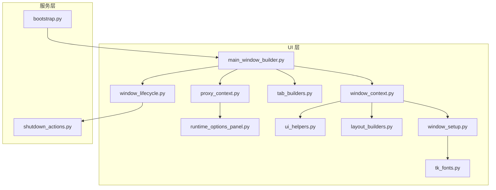
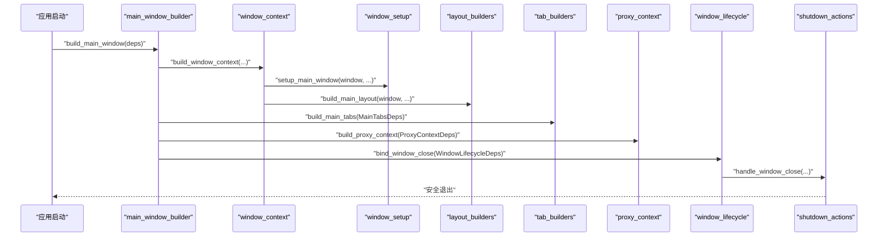
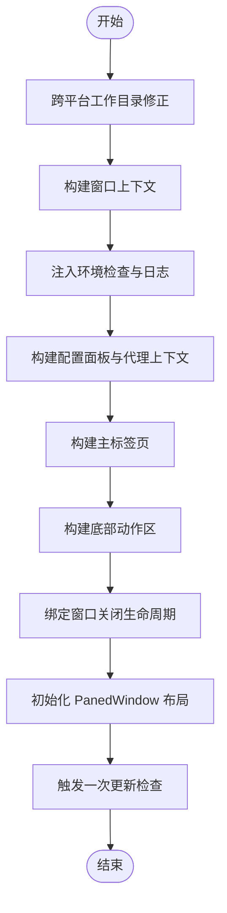
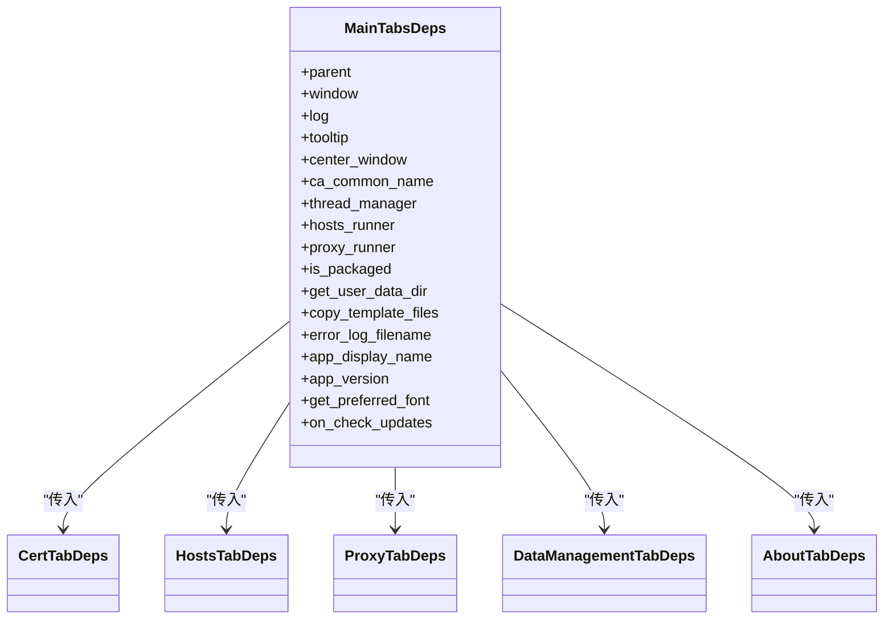
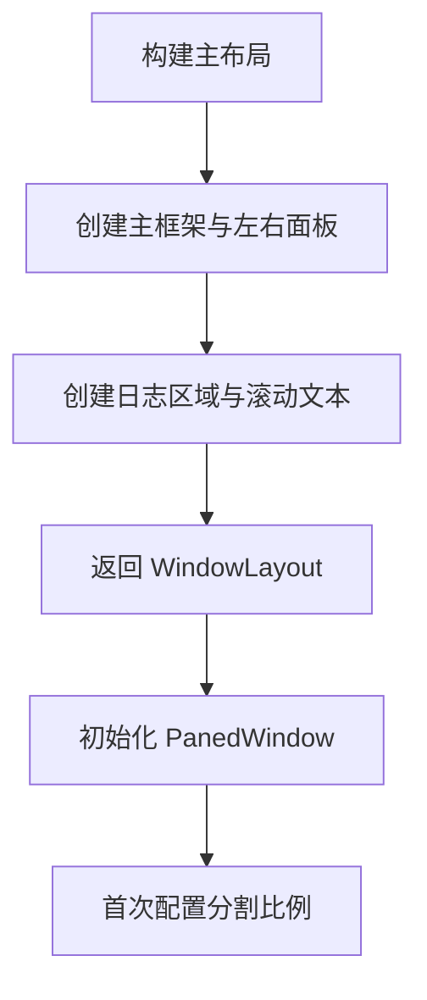
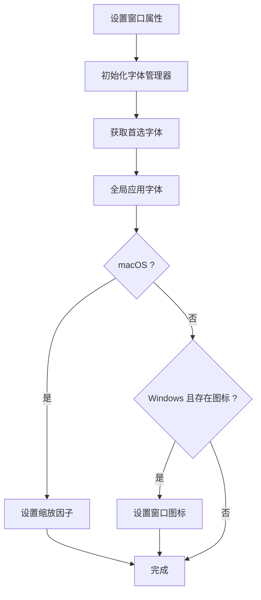
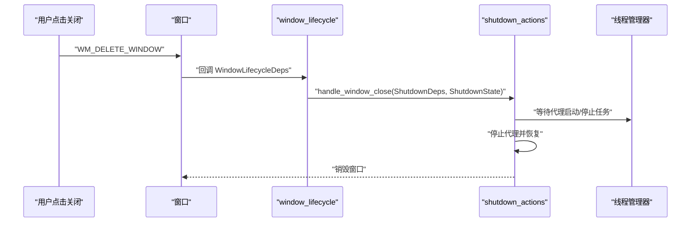
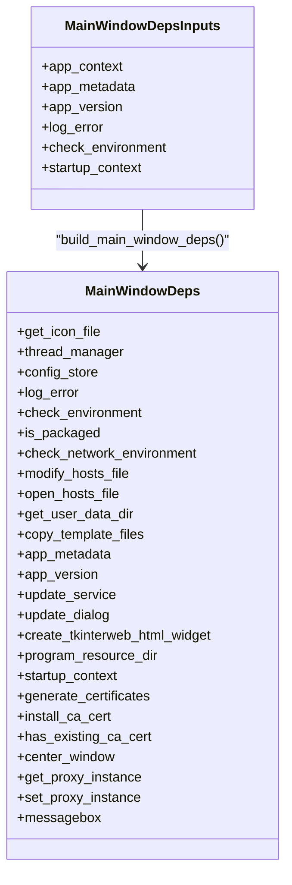
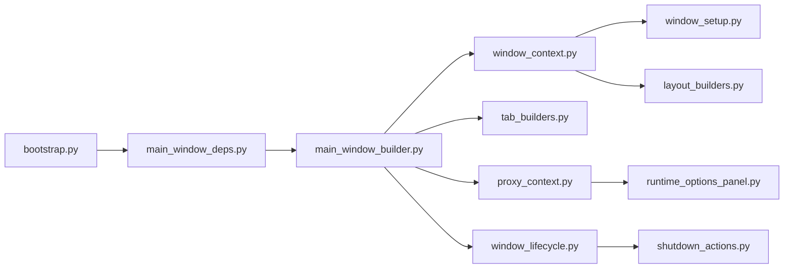

# 窗口体系

<cite>
**本文引用的文件列表**
- [main_window_builder.py](file://modules/ui/main_window_builder.py)
- [tab_builders.py](file://modules/ui/tab_builders.py)
- [layout_builders.py](file://modules/ui/layout_builders.py)
- [window_setup.py](file://modules/ui/window_setup.py)
- [window_lifecycle.py](file://modules/ui/window_lifecycle.py)
- [main_window_deps.py](file://modules/ui/main_window_deps.py)
- [window_context.py](file://modules/ui/window_context.py)
- [proxy_context.py](file://modules/ui/proxy_context.py)
- [bootstrap.py](file://modules/services/bootstrap.py)
- [shutdown_actions.py](file://modules/actions/shutdown_actions.py)
- [runtime_options_panel.py](file://modules/ui/runtime_options_panel.py)
- [tk_fonts.py](file://modules/ui/tk_fonts.py)
- [ui_helpers.py](file://modules/ui/ui_helpers.py)
</cite>

## 目录
1. [简介](#简介)
2. [项目结构](#项目结构)
3. [核心组件](#核心组件)
4. [架构总览](#架构总览)
5. [组件详解](#组件详解)
6. [依赖关系分析](#依赖关系分析)
7. [性能考量](#性能考量)
8. [故障排查指南](#故障排查指南)
9. [结论](#结论)
10. [附录：扩展开发指南](#附录扩展开发指南)

## 简介
本文件深入解析主窗口构建体系与生命周期管理机制，围绕以下目标展开：
- 解释 main_window_builder.py 如何通过组合 tab_builders.py 和 layout_builders.py 实现动态标签页布局与响应式界面堆叠，涵盖窗口初始化、组件注入与事件绑定流程。
- 分析 window_setup.py 的窗口配置逻辑与跨平台 UI 初始化策略。
- 阐述 window_lifecycle.py 定义的关闭钩子、资源清理与代理服务终止流程。
- 结合 main_window_deps.py 展示依赖注入模式在窗口构建中的应用，说明如何通过依赖对象传递日志、线程管理器与配置服务。
- 提供窗口扩展开发指南，包括新增标签页的实现步骤、布局调整技巧与生命周期事件监听方法。

## 项目结构
本项目采用“模块化 UI + 服务层”分层设计，窗口体系位于 modules/ui 子目录，关键文件职责如下：
- main_window_builder.py：主窗口装配入口，负责组织布局、标签页、代理上下文与生命周期绑定。
- tab_builders.py：按功能拆分的标签页构建器集合，统一以数据类依赖注入的方式创建各标签页。
- layout_builders.py：构建主框架、左右面板与日志区域，并初始化 PanedWindow 布局。
- window_setup.py：窗口标题、尺寸、可缩放性、图标与字体初始化，包含跨平台适配（如 macOS 缩放）。
- window_lifecycle.py：将关闭协议 WM_DELETE_WINDOW 绑定到统一的关闭处理流程。
- main_window_deps.py：集中构建 MainWindowDeps，作为主窗口装配的唯一依赖源。
- window_context.py：封装窗口上下文（窗口实例、布局、日志、工具函数等），为上层装配提供统一入口。
- proxy_context.py：代理运行时 UI 与任务执行器的协调者，负责调试选项、网络环境预检与代理启停。
- bootstrap.py：应用上下文 AppContext，提供资源管理、线程管理与配置存储。
- shutdown_actions.py：统一的关闭流程，确保代理服务安全停止与线程等待。
- 其他辅助模块：runtime_options_panel.py（运行时选项面板）、tk_fonts.py（跨平台字体管理）、ui_helpers.py（错误处理、日志、提示框等）。

图表来源
- [main_window_builder.py](file://modules/ui/main_window_builder.py#L59-L207)
- [tab_builders.py](file://modules/ui/tab_builders.py#L475-L561)
- [layout_builders.py](file://modules/ui/layout_builders.py#L23-L87)
- [window_setup.py](file://modules/ui/window_setup.py#L20-L59)
- [window_lifecycle.py](file://modules/ui/window_lifecycle.py#L19-L32)
- [window_context.py](file://modules/ui/window_context.py#L28-L69)
- [proxy_context.py](file://modules/ui/proxy_context.py#L38-L83)
- [bootstrap.py](file://modules/services/bootstrap.py#L18-L28)
- [shutdown_actions.py](file://modules/actions/shutdown_actions.py#L24-L50)
- [runtime_options_panel.py](file://modules/ui/runtime_options_panel.py#L24-L76)
- [tk_fonts.py](file://modules/ui/tk_fonts.py#L20-L75)
- [ui_helpers.py](file://modules/ui/ui_helpers.py#L9-L86)

章节来源
- [main_window_builder.py](file://modules/ui/main_window_builder.py#L59-L207)
- [window_context.py](file://modules/ui/window_context.py#L28-L69)
- [layout_builders.py](file://modules/ui/layout_builders.py#L23-L87)
- [window_setup.py](file://modules/ui/window_setup.py#L20-L59)

## 核心组件
- 主窗口装配器：负责窗口初始化、布局构建、标签页装配、代理上下文与生命周期绑定。
- 标签页构建器：按功能拆分（证书、hosts、代理、数据管理、关于），统一以依赖注入方式创建。
- 布局构建器：构建主框架、左右面板与日志区域，初始化 PanedWindow 并设置初始分割比例。
- 窗口配置器：设置标题、尺寸、可缩放性、图标与字体，处理跨平台差异。
- 生命周期管理器：将关闭协议绑定到统一的关闭处理流程，确保代理服务安全停止与线程等待。
- 依赖注入容器：集中构建 MainWindowDeps，向上层装配提供统一依赖源。
- 窗口上下文：封装窗口实例、布局、日志、工具函数等，为装配提供统一入口。
- 代理上下文：协调运行时选项面板、UI 协调器与任务执行器，负责调试模式与网络环境预检。

章节来源
- [main_window_builder.py](file://modules/ui/main_window_builder.py#L59-L207)
- [tab_builders.py](file://modules/ui/tab_builders.py#L475-L561)
- [layout_builders.py](file://modules/ui/layout_builders.py#L23-L87)
- [window_setup.py](file://modules/ui/window_setup.py#L20-L59)
- [window_lifecycle.py](file://modules/ui/window_lifecycle.py#L19-L32)
- [main_window_deps.py](file://modules/ui/main_window_deps.py#L30-L57)
- [window_context.py](file://modules/ui/window_context.py#L28-L69)
- [proxy_context.py](file://modules/ui/proxy_context.py#L38-L83)

## 架构总览
主窗口构建体系采用“依赖注入 + 组合装配”的架构模式：
- 顶层装配器 main_window_builder 负责组织窗口生命周期与组件装配。
- window_context 统一构建窗口上下文，提供布局、日志与工具函数。
- layout_builders 负责主框架与日志区域的构建与 PanedWindow 初始化。
- tab_builders 负责动态标签页的构建，按功能拆分，统一以依赖注入方式创建。
- proxy_context 负责代理运行时 UI 与任务执行器的协调。
- window_lifecycle 将关闭协议绑定到统一的关闭处理流程。
- main_window_deps 集中构建 MainWindowDeps，向上层装配提供统一依赖源。

图表来源
- [main_window_builder.py](file://modules/ui/main_window_builder.py#L59-L207)
- [window_context.py](file://modules/ui/window_context.py#L28-L69)
- [window_setup.py](file://modules/ui/window_setup.py#L20-L59)
- [layout_builders.py](file://modules/ui/layout_builders.py#L23-L87)
- [tab_builders.py](file://modules/ui/tab_builders.py#L475-L561)
- [proxy_context.py](file://modules/ui/proxy_context.py#L38-L83)
- [window_lifecycle.py](file://modules/ui/window_lifecycle.py#L19-L32)
- [shutdown_actions.py](file://modules/actions/shutdown_actions.py#L24-L50)

## 组件详解

### 主窗口装配器：main_window_builder
- 职责
  - 跨平台工作目录修正（macOS）。
  - 构建窗口上下文（窗口、布局、日志、工具函数）。
  - 注入 hosts 任务运行器与关闭状态。
  - 发射启动日志与环境检查。
  - 构建配置组面板、全局配置面板与代理上下文。
  - 构建主标签页（证书、hosts、代理、数据管理、关于）。
  - 配置更新控制器与引导。
  - 构建底部动作区（启动全部代理）。
  - 绑定窗口关闭生命周期。
  - 初始化 PanedWindow 布局。
  - 触发一次更新检查。
- 关键流程
  - 通过 window_context.build_window_context 获取窗口、布局与日志。
  - 通过 tab_builders.build_main_tabs 创建标签页并返回“检查更新”按钮。
  - 通过 proxy_context.build_proxy_context 获取代理 UI 协调器与任务运行器。
  - 通过 window_lifecycle.bind_window_close 绑定关闭协议。
  - 通过 layout_builders.init_paned_layout 初始化分割布局。

图表来源
- [main_window_builder.py](file://modules/ui/main_window_builder.py#L59-L207)

章节来源
- [main_window_builder.py](file://modules/ui/main_window_builder.py#L59-L207)

### 标签页构建器：tab_builders
- 功能拆分
  - 证书管理标签：生成/安装/清除 CA 证书，支持跨平台提示与确认对话框。
  - hosts 文件管理标签：修改、备份、还原 hosts，打开 hosts 文件。
  - 代理服务器操作标签：启动/停止代理服务器，检查网络环境。
  - 用户数据管理标签：打开目录、备份、还原、清除数据，模板文件复制。
  - 关于标签：显示版本信息与“检查更新”按钮。
- 设计要点
  - 每个标签页均以数据类依赖注入方式接收 notebook、window、log、tooltip、thread_manager 等。
  - macOS 特殊处理：Notebook 切换时同步焦点，避免重绘延迟。
  - 条件构建：仅在打包环境下显示“用户数据管理”标签。
- 扩展建议
  - 新增标签页时，遵循“数据类依赖 + 无副作用构建”的模式，避免在构建函数内直接访问全局状态。

图表来源
- [tab_builders.py](file://modules/ui/tab_builders.py#L26-L561)

章节来源
- [tab_builders.py](file://modules/ui/tab_builders.py#L475-L561)

### 布局构建器：layout_builders
- 职责
  - 构建主框架、标题、左右面板与日志区域。
  - 初始化 PanedWindow，并在首次配置时设置初始分割比例。
- 关键点
  - 日志区域使用 ScrolledText，配合 ui_helpers 的文本日志器。
  - PanedWindow 首次配置时根据窗口宽度设置 sash 位置，避免初始空白。

图表来源
- [layout_builders.py](file://modules/ui/layout_builders.py#L23-L87)

章节来源
- [layout_builders.py](file://modules/ui/layout_builders.py#L23-L87)

### 窗口配置器：window_setup
- 职责
  - 设置窗口标题、默认尺寸与可缩放性。
  - 跨平台字体初始化与全局字体覆盖。
  - macOS 缩放适配（根据 DPI 计算缩放因子）。
  - Windows 图标设置（若存在）。
- 关键点
  - FontManager 提供跨平台首选字体与缓存。
  - apply_global_font 对 ttk 控件进行全局字体覆盖。

图表来源
- [window_setup.py](file://modules/ui/window_setup.py#L20-L59)
- [tk_fonts.py](file://modules/ui/tk_fonts.py#L20-L75)

章节来源
- [window_setup.py](file://modules/ui/window_setup.py#L20-L59)
- [tk_fonts.py](file://modules/ui/tk_fonts.py#L20-L75)

### 生命周期管理器：window_lifecycle
- 职责
  - 将窗口关闭协议 WM_DELETE_WINDOW 绑定到统一的关闭处理流程。
  - 通过 shutdown_actions.handle_window_close 安全停止代理并等待线程。
- 关键点
  - 使用 ShutdownState 防止重复触发关闭流程。
  - 在后台线程中执行清理，避免阻塞 UI。

图表来源
- [window_lifecycle.py](file://modules/ui/window_lifecycle.py#L19-L32)
- [shutdown_actions.py](file://modules/actions/shutdown_actions.py#L24-L50)

章节来源
- [window_lifecycle.py](file://modules/ui/window_lifecycle.py#L19-L32)
- [shutdown_actions.py](file://modules/actions/shutdown_actions.py#L24-L50)

### 依赖注入容器：main_window_deps
- 职责
  - 将 AppContext、AppMetadata、AppVersion、日志、环境检查、启动上下文等聚合为 MainWindowDeps。
  - 为 main_window_builder 提供统一依赖源，避免直接依赖具体实现。
- 关键点
  - 依赖来源包括资源管理器、线程管理器、配置存储、证书服务、主机文件服务、代理状态、更新服务、对话框等。
  - 通过中心化构建，降低耦合度，便于测试与替换。

图表来源
- [main_window_deps.py](file://modules/ui/main_window_deps.py#L20-L57)

章节来源
- [main_window_deps.py](file://modules/ui/main_window_deps.py#L30-L57)
- [bootstrap.py](file://modules/services/bootstrap.py#L18-L28)

### 窗口上下文：window_context
- 职责
  - 统一构建窗口上下文，包含窗口实例、首选字体、默认字体、布局、主框架、PanedWindow、左右面板、日志与工具函数。
  - 集成 macOS 深色模式检测与 Tooltip 工厂。
- 关键点
  - 将 Tkinter 异常转为日志，提升稳定性。
  - 通过 partial 包装 Tooltip，注入字体与深色模式参数。

章节来源
- [window_context.py](file://modules/ui/window_context.py#L28-L69)
- [ui_helpers.py](file://modules/ui/ui_helpers.py#L9-L86)

### 代理上下文：proxy_context
- 职责
  - 构建运行时选项面板（调试模式、SSL 严格模式、流模式）。
  - 创建代理 UI 协调器与任务执行器，协调配置、网络环境检查、证书与 hosts 操作。
  - 将调试模式切换事件绑定到 UI 协调器，动态启用网络环境预检。
- 关键点
  - 通过 ProxyContext 返回 runtime_options、proxy_ui、proxy_runner，供上层使用。
  - 与 runtime_options_panel 协作，实现运行时选项的可视化与联动。

章节来源
- [proxy_context.py](file://modules/ui/proxy_context.py#L38-L83)
- [runtime_options_panel.py](file://modules/ui/runtime_options_panel.py#L24-L76)

## 依赖关系分析
- 组件耦合
  - main_window_builder 依赖 window_context、layout_builders、tab_builders、proxy_context、window_lifecycle。
  - window_context 依赖 window_setup、layout_builders、ui_helpers、macOS 主题检测。
  - tab_builders 依赖 actions、runtime、services，按功能模块解耦。
  - proxy_context 依赖 runtime_options_panel、proxy_actions、proxy_ui_coordinator、config_service。
  - main_window_deps 依赖 bootstrap、services、ui_helpers、tkhtml_compat。
- 外部依赖
  - Tkinter、ttk、platformdirs、types、collections.abc 等标准库。
  - 第三方库：platformdirs（用户数据目录）。
- 循环依赖
  - 未发现循环依赖，装配顺序清晰：bootstrap → main_window_deps → window_context → layout_builders → tab_builders → proxy_context → window_lifecycle。

图表来源
- [bootstrap.py](file://modules/services/bootstrap.py#L18-L28)
- [main_window_deps.py](file://modules/ui/main_window_deps.py#L30-L57)
- [main_window_builder.py](file://modules/ui/main_window_builder.py#L59-L207)
- [window_context.py](file://modules/ui/window_context.py#L28-L69)
- [window_setup.py](file://modules/ui/window_setup.py#L20-L59)
- [layout_builders.py](file://modules/ui/layout_builders.py#L23-L87)
- [tab_builders.py](file://modules/ui/tab_builders.py#L475-L561)
- [proxy_context.py](file://modules/ui/proxy_context.py#L38-L83)
- [runtime_options_panel.py](file://modules/ui/runtime_options_panel.py#L24-L76)
- [window_lifecycle.py](file://modules/ui/window_lifecycle.py#L19-L32)
- [shutdown_actions.py](file://modules/actions/shutdown_actions.py#L24-L50)

章节来源
- [main_window_builder.py](file://modules/ui/main_window_builder.py#L59-L207)
- [window_context.py](file://modules/ui/window_context.py#L28-L69)
- [layout_builders.py](file://modules/ui/layout_builders.py#L23-L87)
- [tab_builders.py](file://modules/ui/tab_builders.py#L475-L561)
- [proxy_context.py](file://modules/ui/proxy_context.py#L38-L83)
- [window_lifecycle.py](file://modules/ui/window_lifecycle.py#L19-L32)
- [main_window_deps.py](file://modules/ui/main_window_deps.py#L30-L57)
- [bootstrap.py](file://modules/services/bootstrap.py#L18-L28)

## 性能考量
- 字体与渲染
  - FontManager 缓存字体对象，减少重复创建开销；macOS 上根据 DPI 调整字号，保证显示一致性。
- 布局初始化
  - PanedWindow 首次配置时设置 sash 位置，避免初始空白与二次重绘。
- 线程与异步
  - 关闭流程在后台线程执行，避免阻塞 UI；通过线程管理器等待代理启动/停止任务，控制超时。
- 日志与 UI 更新
  - 文本日志器在插入新行后立即滚动到底部并更新，保证实时性；同时尝试打印到控制台，兼容不同输出环境。

[本节为通用指导，不直接分析具体文件，故无章节来源]

## 故障排查指南
- 窗口异常崩溃
  - window_context 将 Tkinter 回调异常转为日志，便于定位问题；检查日志输出与异常栈。
- 关闭卡顿或无法退出
  - 检查 shutdown_actions 的关闭状态与线程等待超时；确认代理启动/停止任务 ID 是否被正确等待。
- 字体显示异常
  - 确认 FontManager 的首选字体候选列表与缓存；macOS 上检查缩放因子设置。
- macOS 标签页焦点问题
  - tab_builders 在 macOS 下绑定 Notebook 切换事件，同步焦点到可聚焦控件；若仍有问题，检查控件的 takefocus 属性。

章节来源
- [ui_helpers.py](file://modules/ui/ui_helpers.py#L9-L16)
- [shutdown_actions.py](file://modules/actions/shutdown_actions.py#L24-L50)
- [tk_fonts.py](file://modules/ui/tk_fonts.py#L20-L75)
- [tab_builders.py](file://modules/ui/tab_builders.py#L478-L512)

## 结论
本窗口体系通过“依赖注入 + 组合装配”的设计，实现了主窗口的高内聚、低耦合与可扩展性：
- main_window_builder 以统一装配入口串联布局、标签页、代理上下文与生命周期。
- window_context 与 layout_builders 提供稳定的窗口上下文与响应式布局。
- tab_builders 以数据类依赖注入实现功能模块化与可测试性。
- window_lifecycle 与 shutdown_actions 确保关闭流程的安全与可控。
- main_window_deps 将服务层能力集中注入，便于替换与扩展。

[本节为总结性内容，不直接分析具体文件，故无章节来源]

## 附录：扩展开发指南

### 新增标签页的实现步骤
- 定义依赖数据类
  - 参考现有标签页的数据类（如 CertTabDeps、HostsTabDeps、ProxyTabDeps、DataManagementTabDeps、AboutTabDeps），在数据类中声明所需依赖（notebook、window、log、tooltip、thread_manager 等）。
- 实现标签页构建函数
  - 在 tab_builders 中新增构建函数，接收上述数据类依赖，创建 ttk.Frame 并向 notebook 添加标签页。
  - 在函数内部实现按钮与交互逻辑，必要时调用 actions 或 services。
- 注册到主标签页装配
  - 在 build_main_tabs 中调用新增的标签页构建函数，并根据条件（如 is_packaged）决定是否显示。
- 依赖注入
  - 在 main_window_builder 中构造对应的数据类依赖对象，传入 tab_builders 的构建函数。

章节来源
- [tab_builders.py](file://modules/ui/tab_builders.py#L26-L561)
- [main_window_builder.py](file://modules/ui/main_window_builder.py#L143-L163)

### 布局调整技巧
- 使用 PanedWindow
  - 通过 layout_builders.init_paned_layout 在首次配置时设置分割比例，避免初始空白。
- 响应式布局
  - 左右面板使用 grid_rowconfigure/grid_columnconfigure 与 sticky="nsew" 实现自适应。
- 日志区域
  - 使用 ScrolledText 与 ui_helpers 的文本日志器，确保日志滚动与刷新及时。
- macOS 特性
  - 在 macOS 下为 Notebook 绑定切换事件，同步焦点到可聚焦控件，避免重绘延迟。

章节来源
- [layout_builders.py](file://modules/ui/layout_builders.py#L74-L87)
- [tab_builders.py](file://modules/ui/tab_builders.py#L478-L512)
- [ui_helpers.py](file://modules/ui/ui_helpers.py#L19-L37)

### 生命周期事件监听方法
- 关闭钩子
  - 使用 window_lifecycle.bind_window_close 绑定 WM_DELETE_WINDOW，交由 shutdown_actions.handle_window_close 统一处理。
- 关闭流程
  - 在 handle_window_close 中等待代理启动/停止任务，停止代理并恢复，最后销毁窗口。
- 线程管理
  - 通过线程管理器在后台线程执行清理逻辑，避免阻塞 UI。

章节来源
- [window_lifecycle.py](file://modules/ui/window_lifecycle.py#L19-L32)
- [shutdown_actions.py](file://modules/actions/shutdown_actions.py#L24-L50)