# 模块说明

<cite>
**本文档引用的文件**
- [proxy_actions.py](file://modules/actions/proxy_actions.py)
- [cert_actions.py](file://modules/actions/cert_actions.py)
- [hosts_actions.py](file://modules/actions/hosts_actions.py)
- [app_bootstrap.py](file://modules/services/app_bootstrap.py)
- [bootstrap.py](file://modules/services/bootstrap.py)
- [cert_service.py](file://modules/services/cert_service.py)
- [config_service.py](file://modules/services/config_service.py)
- [proxy_orchestration.py](file://modules/services/proxy_orchestration.py)
- [main_window_builder.py](file://modules/ui/main_window_builder.py)
- [tab_builders.py](file://modules/ui/tab_builders.py)
- [macos_theme.py](file://modules/ui/macos_theme.py)
- [proxy_context.py](file://modules/ui/proxy_context.py)
- [AGENTS.md](file://AGENTS.md)
- [ca_store.py](file://modules/cert/ca_store.py)
- [cert_generator.py](file://modules/cert/cert_generator.py)
- [cert_installer.py](file://modules/cert/cert_installer.py)
- [hosts_manager.py](file://modules/hosts/hosts_manager.py)
- [proxy_server.py](file://modules/proxy/proxy_server.py)
- [platform.py](file://modules/platform/__init__.py)
- [runtime.py](file://modules/runtime/__init__.py)
</cite>

## 目录
1. [引言](#引言)
2. [项目结构](#项目结构)
3. [核心组件](#核心组件)
4. [架构概述](#架构概述)
5. [详细组件分析](#详细组件分析)
6. [依赖分析](#依赖分析)
7. [性能考虑](#性能考虑)
8. [故障排除指南](#故障排除指南)
9. [结论](#结论)

## 引言
本项目是一个代理管理工具，旨在为用户提供一个图形化界面来管理本地代理服务、证书和hosts文件。系统采用分层架构设计，将UI、业务逻辑和副作用处理分离，确保代码的可维护性和可扩展性。核心模块包括actions（动作协调层）、services（业务逻辑中枢）、ui（界面构建）、cert（证书管理）、hosts（hosts文件管理）、proxy（代理服务）、runtime（运行时支持）和platform（平台适配）等。

## 项目结构

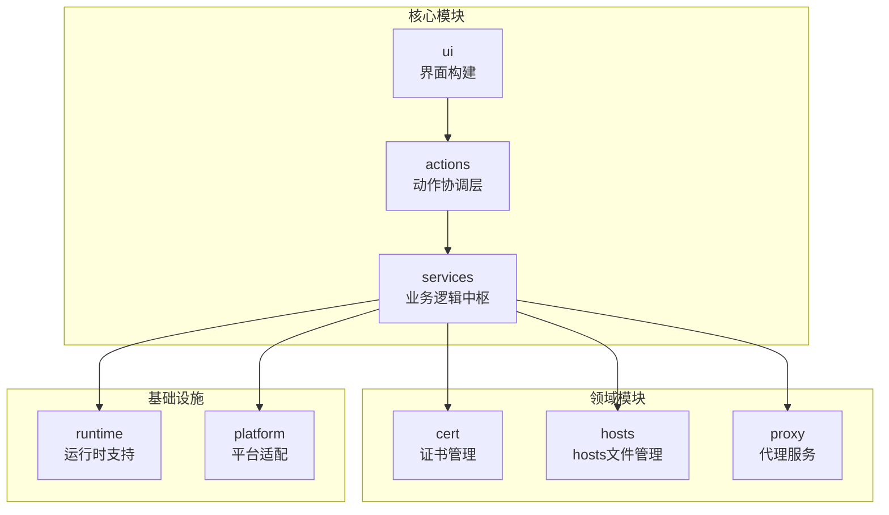

**模块来源**
- [actions](file://modules/actions/__init__.py)
- [services](file://modules/services/__init__.py)
- [ui](file://modules/ui/__init__.py)
- [cert](file://modules/cert/__init__.py)
- [hosts](file://modules/hosts/__init__.py)
- [proxy](file://modules/proxy/__init__.py)
- [runtime](file://modules/runtime/__init__.py)
- [platform](file://modules/platform/__init__.py)

## 核心组件

系统采用分层架构，各核心组件职责明确：
- **actions模块**：作为UI与业务逻辑的协调层，处理用户操作事件并编排跨服务调用流程
- **services模块**：作为副作用边界和业务逻辑中枢，提供依赖注入机制和生命周期管理
- **ui模块**：负责窗口构建、布局生成和主题适配
- **cert、hosts、proxy模块**：分别处理证书管理、hosts文件修改和代理服务等特定领域功能
- **runtime和platform模块**：提供基础运行时支持和跨平台适配能力

**组件来源**
- [actions/__init__.py](file://modules/actions/__init__.py#L1-L4)
- [services/__init__.py](file://modules/services/__init__.py#L1-L4)
- [ui/__init__.py](file://modules/ui/__init__.py#L1-L4)

## 架构概述

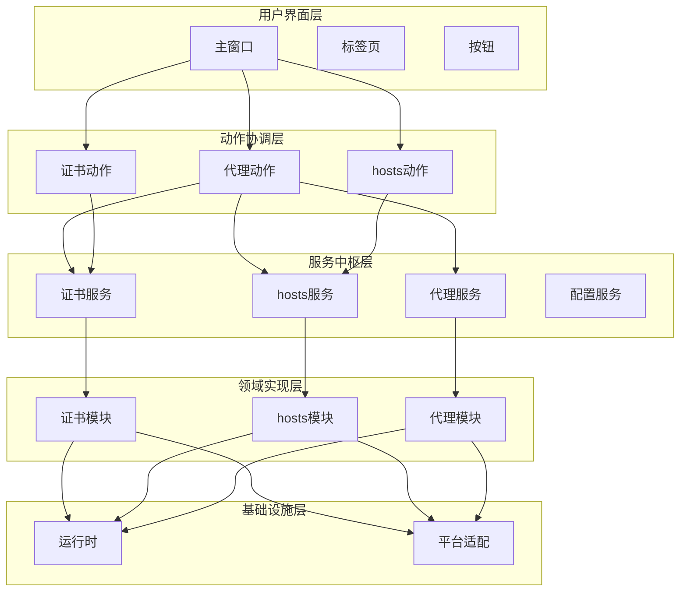

**架构来源**
- [AGENTS.md](file://AGENTS.md)
- [app_bootstrap.py](file://modules/services/app_bootstrap.py)
- [bootstrap.py](file://modules/services/bootstrap.py)

## 详细组件分析

### actions模块分析

actions模块作为UI与业务逻辑的协调层，负责处理用户操作事件并编排跨服务调用流程。该模块通过依赖注入方式接收服务层功能，并在独立线程中执行耗时操作，避免阻塞UI线程。

#### 代理动作协调器
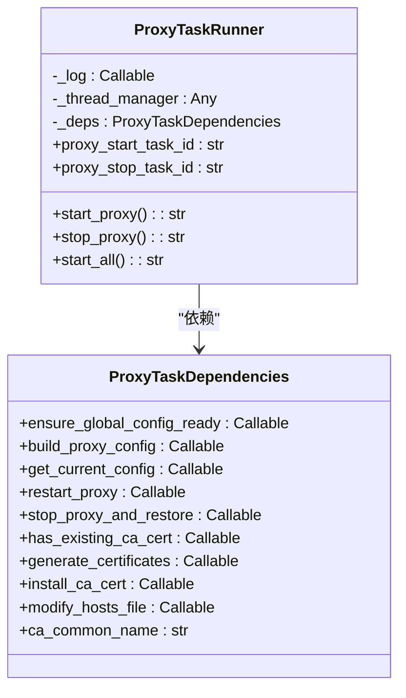

**类图来源**
- [proxy_actions.py](file://modules/actions/proxy_actions.py#L11-L128)

#### 证书动作处理器
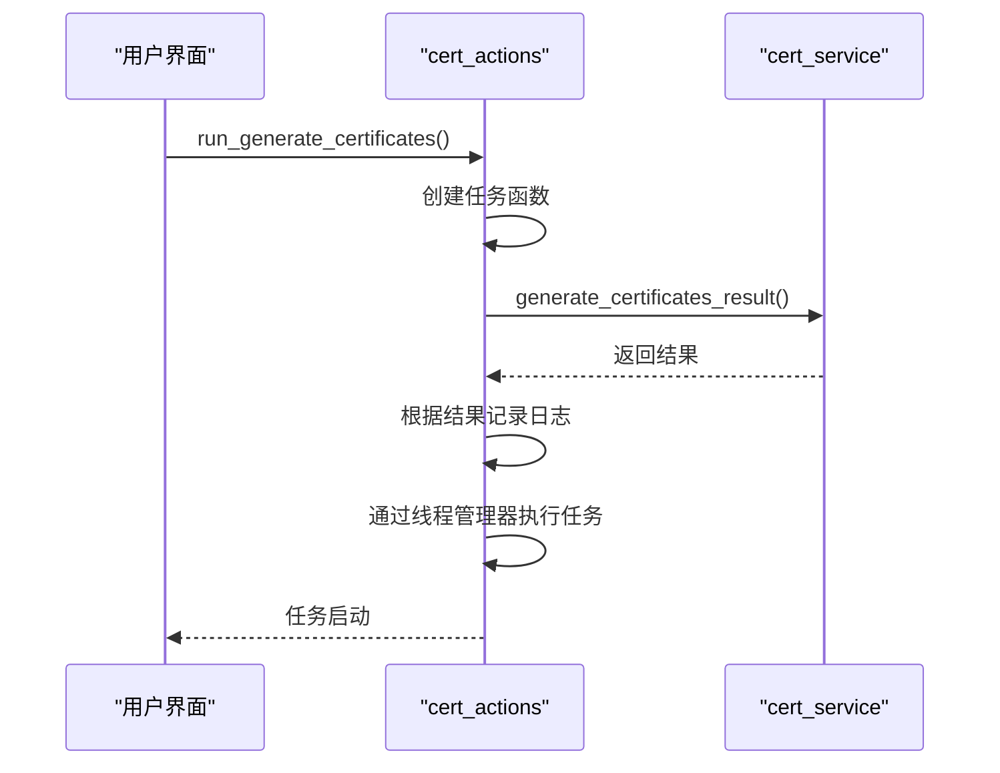

**序列图来源**
- [cert_actions.py](file://modules/actions/cert_actions.py#L9-L66)

#### hosts动作管理器
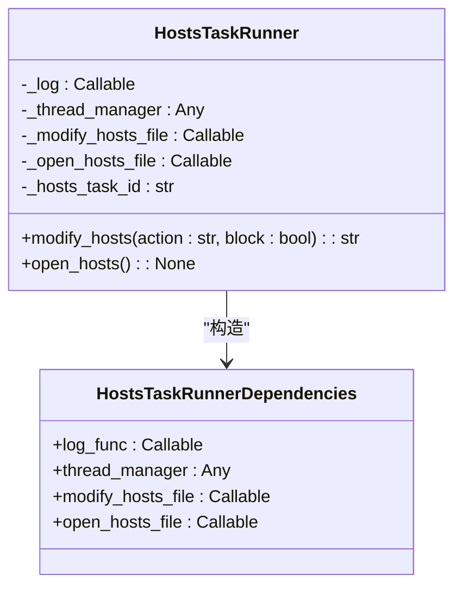

**类图来源**
- [hosts_actions.py](file://modules/actions/hosts_actions.py#L8-L61)

### services模块分析

services模块作为系统的业务逻辑中枢和副作用边界，实现了依赖注入机制和生命周期管理。该模块通过AppContext对象集中管理资源、线程和配置等核心依赖。

#### 应用上下文构建
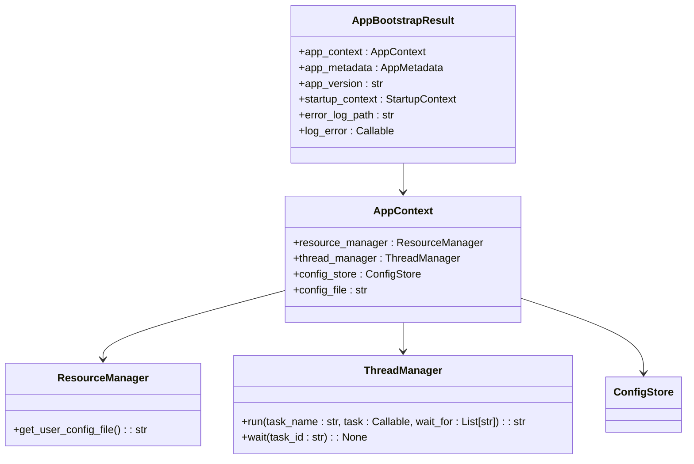

**类图来源**
- [bootstrap.py](file://modules/services/bootstrap.py#L10-L29)
- [app_bootstrap.py](file://modules/services/app_bootstrap.py#L9-L38)

#### 证书服务实现
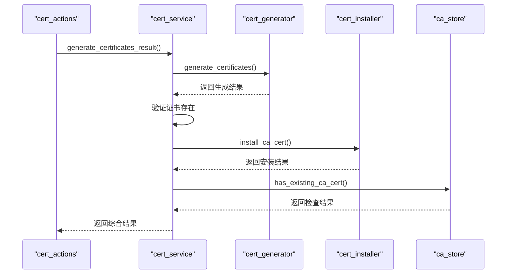

**序列图来源**
- [cert_service.py](file://modules/services/cert_service.py)
- [cert_generator.py](file://modules/cert/cert_generator.py)
- [cert_installer.py](file://modules/cert/cert_installer.py)
- [ca_store.py](file://modules/cert/ca_store.py)

### ui模块分析

ui模块负责构建整个应用程序的用户界面，包括窗口布局、标签页组织和主题适配等功能。该模块采用构建器模式，将复杂的UI构建过程分解为多个可组合的部分。

#### 主窗口构建流程
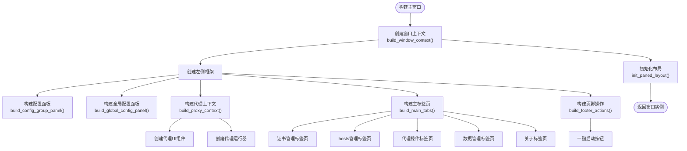

**流程图来源**
- [main_window_builder.py](file://modules/ui/main_window_builder.py#L59-L208)

#### 标签页组织结构
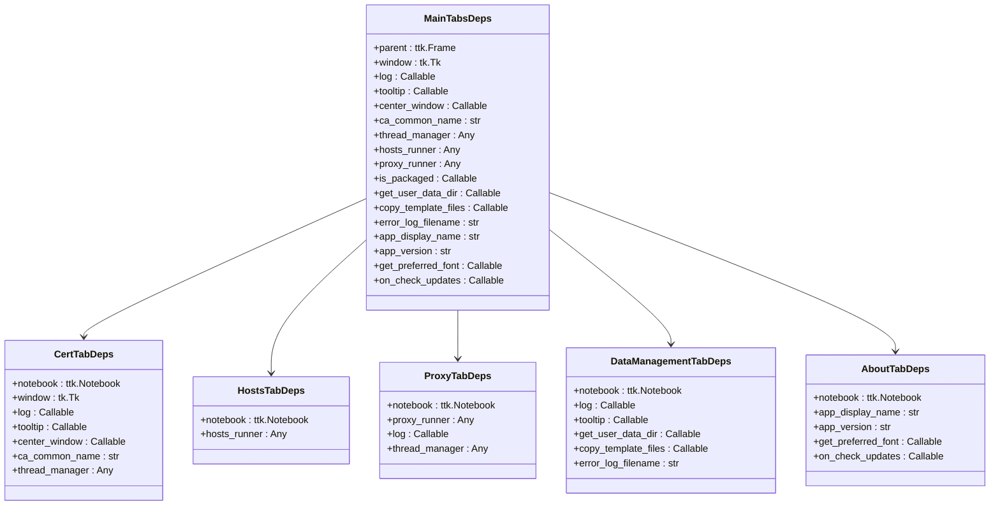

**类图来源**
- [tab_builders.py](file://modules/ui/tab_builders.py#L26-L562)

#### macOS主题适配机制
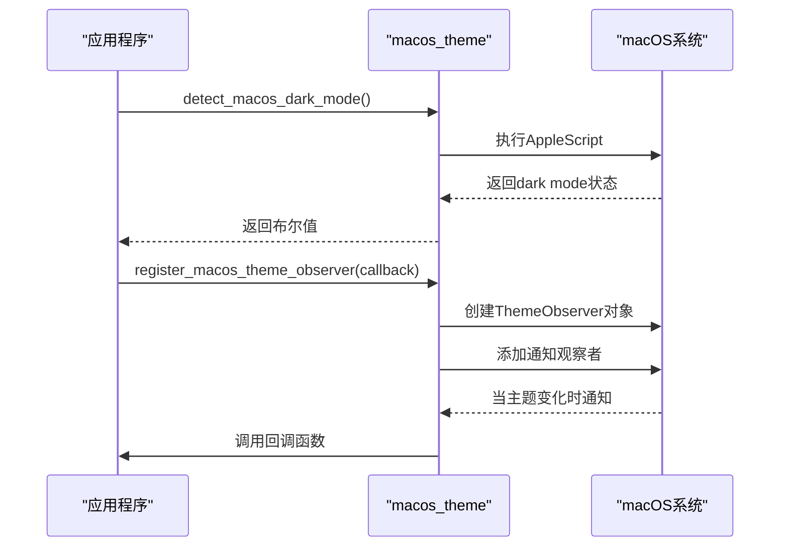

**序列图来源**
- [macos_theme.py](file://modules/ui/macos_theme.py#L30-L94)

### 领域模块分析

#### 证书模块职责
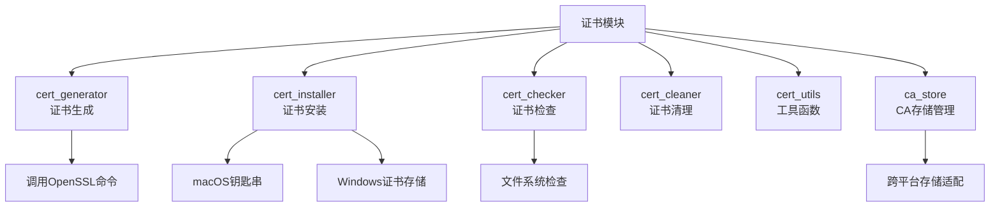

**模块来源**
- [cert/__init__.py](file://modules/cert/__init__.py)
- [cert_generator.py](file://modules/cert/cert_generator.py)
- [cert_installer.py](file://modules/cert/cert_installer.py)

#### hosts模块协作
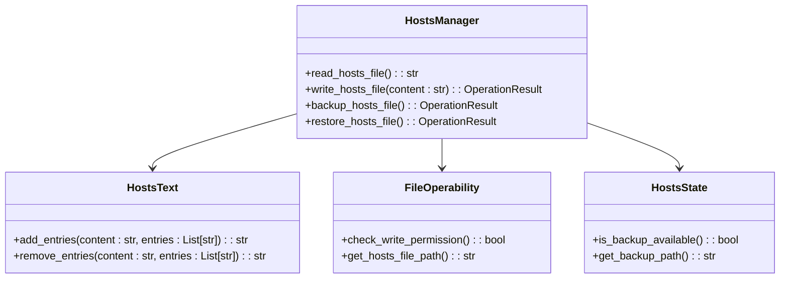

**类图来源**
- [hosts_manager.py](file://modules/hosts/hosts_manager.py)
- [hosts_state.py](file://modules/hosts/hosts_state.py)
- [hosts_text.py](file://modules/hosts/hosts_text.py)
- [file_operability.py](file://modules/hosts/file_operability.py)

#### 代理模块交互
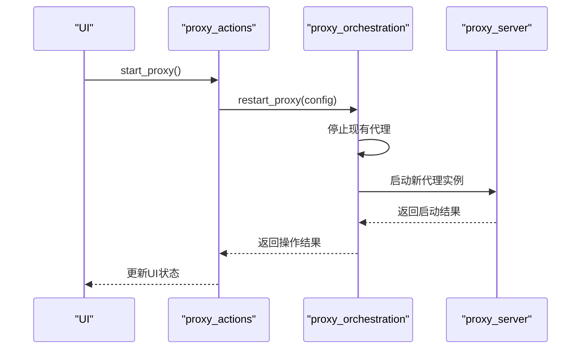

**序列图来源**
- [proxy_actions.py](file://modules/actions/proxy_actions.py)
- [proxy_orchestration.py](file://modules/services/proxy_orchestration.py)
- [proxy_server.py](file://modules/proxy/proxy_server.py)

## 依赖分析

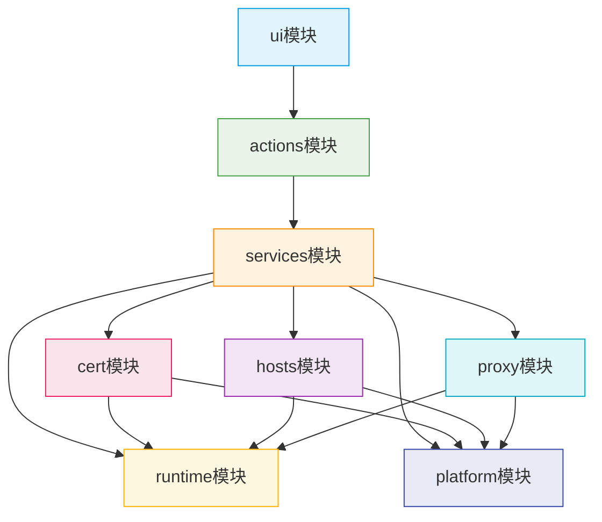

**依赖来源**
- [main_window_builder.py](file://modules/ui/main_window_builder.py)
- [proxy_actions.py](file://modules/actions/proxy_actions.py)
- [app_bootstrap.py](file://modules/services/app_bootstrap.py)

## 性能考虑

系统在性能方面采取了多项优化措施：
- **线程管理**：使用ThreadManager统一管理后台任务，避免创建过多线程
- **资源复用**：ResourceManager集中管理应用资源，实现资源复用
- **惰性加载**：UI组件按需构建，减少启动时的资源消耗
- **异步操作**：耗时操作（如证书生成、网络检查）在后台线程执行，保持UI响应性
- **缓存机制**：对频繁访问的数据（如配置、证书状态）进行缓存

## 故障排除指南

### 常见问题及解决方案

| 问题现象 | 可能原因 | 解决方案 |
|---------|---------|---------|
| 无法生成证书 | 权限不足或OpenSSL未安装 | 以管理员身份运行，确保OpenSSL可用 |
| CA证书安装失败 | 系统安全策略限制 | 检查系统证书存储权限，尝试手动安装 |
| hosts文件修改失败 | 文件被占用或权限不足 | 关闭占用程序，以管理员身份运行 |
| 代理启动失败 | 端口被占用或配置错误 | 检查端口占用情况，验证配置正确性 |
| 界面无响应 | 后台任务阻塞 | 重启应用，检查日志文件 |

**问题来源**
- [runtime/error_codes.py](file://modules/runtime/error_codes.py)
- [logging_service.py](file://modules/services/logging_service.py)

## 结论

本项目采用清晰的分层架构，将UI、动作协调、业务逻辑和领域实现分离，提高了代码的可维护性和可扩展性。actions模块作为UI与业务逻辑的桥梁，有效协调了跨服务调用；services模块作为业务逻辑中枢，提供了统一的依赖注入和生命周期管理；ui模块采用构建器模式，实现了灵活的界面构建；各领域模块职责明确，协作良好。建议在扩展新功能时遵循现有架构模式，保持代码风格一致。