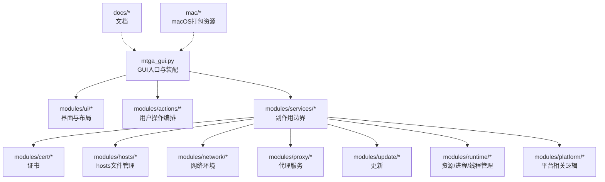
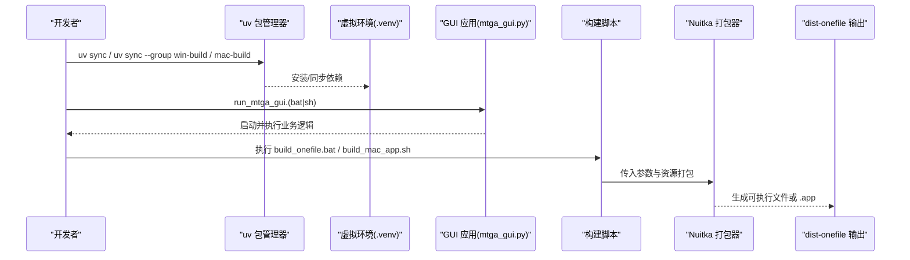
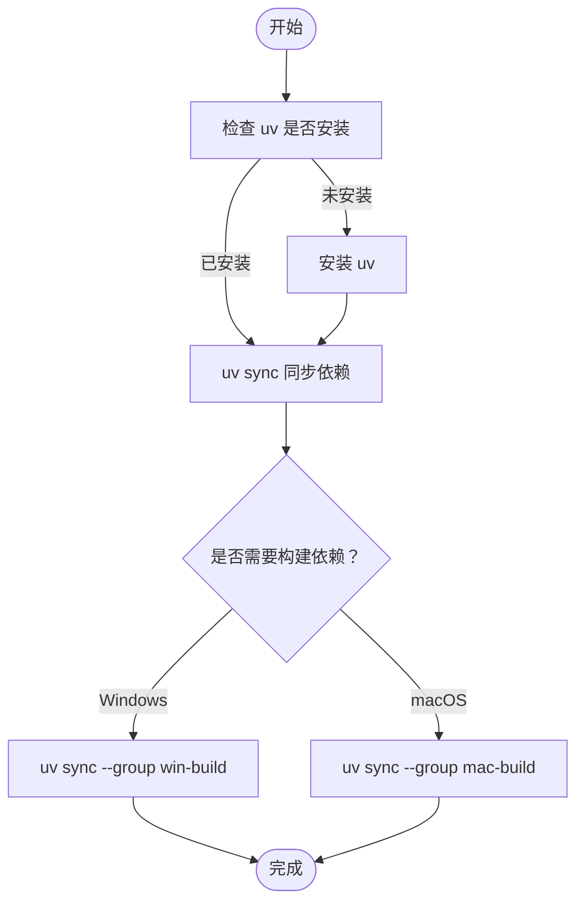
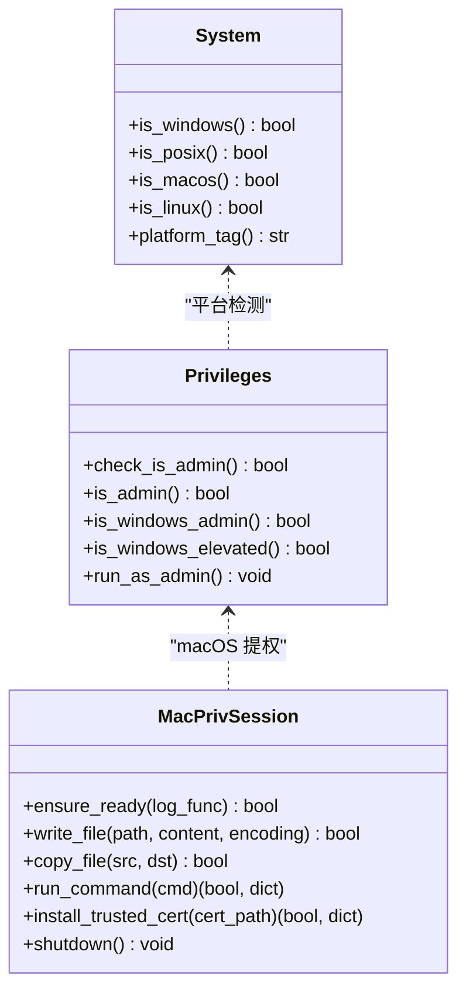
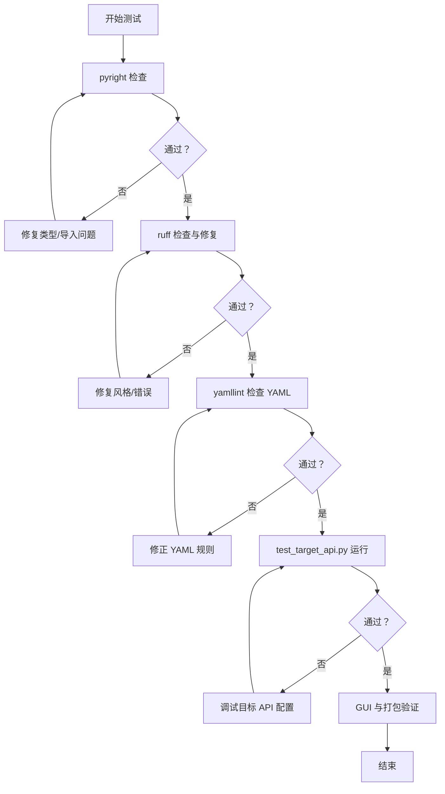
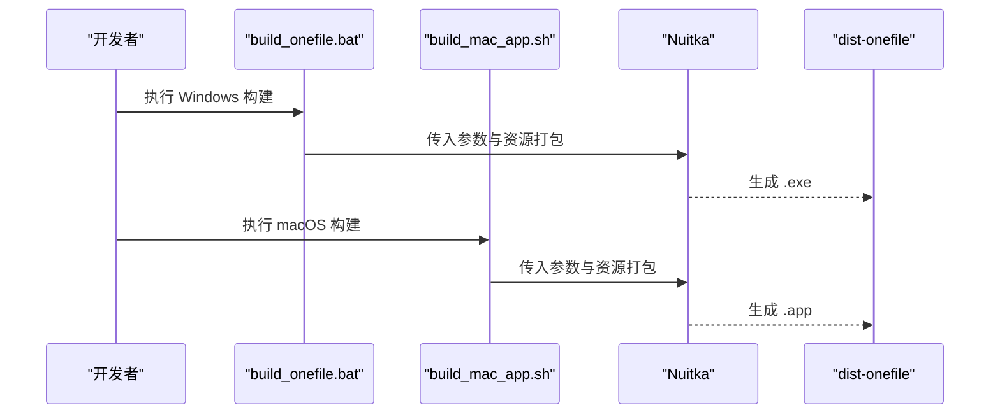
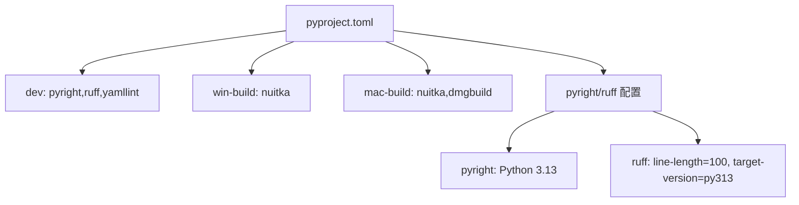

# 贡献指南

<cite>
**本文引用的文件**
- [AGENTS.md](file://AGENTS.md)
- [CLAUDE.md](file://CLAUDE.md)
- [pyproject.toml](file://pyproject.toml)
- [.yamllint](file://.yamllint)
- [README.md](file://README.md)
- [build_onefile.bat](file://build_onefile.bat)
- [build_mac_app.sh](file://build_mac_app.sh)
- [test_target_api.py](file://test_target_api.py)
- [run_mtga_gui.bat](file://run_mtga_gui.bat)
- [run_mtga_gui.sh](file://run_mtga_gui.sh)
- [modules/platform/system.py](file://modules/platform/system.py)
- [modules/platform/privileges.py](file://modules/platform/privileges.py)
- [modules/platform/macos_privileged_helper.py](file://modules/platform/macos_privileged_helper.py)
</cite>

## 目录
1. [引言](#引言)
2. [项目结构](#项目结构)
3. [核心组件](#核心组件)
4. [架构总览](#架构总览)
5. [详细组件分析](#详细组件分析)
6. [依赖关系分析](#依赖关系分析)
7. [性能考量](#性能考量)
8. [故障排查指南](#故障排查指南)
9. [结论](#结论)
10. [附录](#附录)

## 引言
本指南面向代码贡献者，基于仓库内的开发约定与技术规范，提供统一的开发流程、代码风格、测试策略、构建与打包、安全策略与提交规范，帮助贡献者高效、安全地参与项目开发。

## 项目结构
仓库采用模块化分层组织，核心入口为 GUI 应用程序，围绕 UI、动作编排、服务层、领域模块与运行时/平台层展开。文档与打包资源分别置于 docs 与 mac 等目录，便于维护与发布。

**章节来源**
- [AGENTS.md](file://AGENTS.md#L3-L6)
- [CLAUDE.md](file://CLAUDE.md#L17-L37)

## 核心组件
- 技术栈与版本
  - Python 3.13（项目要求与工具链一致）
  - 依赖管理：uv（包管理器）
  - 构建工具：Nuitka（Windows/macOS）
  - 静态检查：pyright、ruff
  - YAML 检查：yamllint
- 开发命令与工作流
  - 使用 uv 管理虚拟环境与依赖同步
  - 构建依赖分组：win-build、mac-build
  - 运行 GUI：run_mtga_gui.bat（Windows）、run_mtga_gui.sh（macOS）
  - 打包：build_onefile.bat（Windows 单文件）、build_mac_app.sh（macOS 应用包）
  - API 兼容性测试：test_target_api.py
- 代码风格与命名
  - PEP 8 命名：函数 snake_case、类 CamelCase、常量全大写
  - 四空格缩进
  - 平台相关逻辑保护：通过模块化与条件判断隔离平台差异
- 提交与 PR 规范
  - 提交类型：type(scope): summary（如 feat(mac):、ci(workflow):、docs:）
  - PR 要求：用户影响说明、测试验证、必要截图
  - 安全敏感变更：证书、代理路由、entitlements 等需标注并描述缓解措施
- 安全政策
  - 禁止提交 CA 私钥、用户证书与用户数据产物
  - 示例配置应遮蔽令牌，避免硬编码敏感信息

**章节来源**
- [pyproject.toml](file://pyproject.toml#L10-L20)
- [AGENTS.md](file://AGENTS.md#L17-L35)
- [CLAUDE.md](file://CLAUDE.md#L42-L53)

## 架构总览
下图展示开发环境、依赖管理、构建与打包的关键流程，以及平台权限与证书安装的交互。

**图表来源**
- [run_mtga_gui.bat](file://run_mtga_gui.bat#L66-L94)
- [run_mtga_gui.sh](file://run_mtga_gui.sh#L112-L149)
- [build_onefile.bat](file://build_onefile.bat#L95-L128)
- [build_mac_app.sh](file://build_mac_app.sh#L87-L118)

**章节来源**
- [CLAUDE.md](file://CLAUDE.md#L41-L53)
- [AGENTS.md](file://AGENTS.md#L8-L15)

## 详细组件分析

### 开发环境搭建与依赖管理
- uv 包管理器
  - 安装与使用：uv sync 安装运行时依赖；uv sync --group win-build 或 mac-build 安装构建依赖
  - 缓存控制：在任何 uv 命令前设置 UV_CACHE_DIR="$PWD/.uv_cache"，确保缓存路径可控
- 虚拟环境与 Python 版本
  - 项目要求 Python >= 3.13，启动器脚本会自动安装并创建 .venv
- 平台相关依赖
  - Windows：Visual Studio 2022 + C++ 构建工具
  - macOS：Xcode Command Line Tools + Nuitka

**图表来源**
- [run_mtga_gui.bat](file://run_mtga_gui.bat#L23-L94)
- [run_mtga_gui.sh](file://run_mtga_gui.sh#L47-L149)
- [pyproject.toml](file://pyproject.toml#L42-L54)

**章节来源**
- [AGENTS.md](file://AGENTS.md#L8-L14)
- [CLAUDE.md](file://CLAUDE.md#L41-L53)

### 代码风格与平台保护机制
- 代码风格
  - Python 3.13，PEP 8 命名与四空格缩进
  - 导入位于文件顶部，保持模块导入清晰
- 平台相关逻辑保护
  - 通过 modules/platform 下的模块隔离平台差异
  - system.py 提供平台检测
  - privileges.py 提供跨平台权限检测与提升
  - macos_privileged_helper.py 提供 macOS 持久化提权辅助，避免在主线程中直接执行高权限操作

**图表来源**
- [modules/platform/system.py](file://modules/platform/system.py#L7-L30)
- [modules/platform/privileges.py](file://modules/platform/privileges.py#L65-L103)
- [modules/platform/macos_privileged_helper.py](file://modules/platform/macos_privileged_helper.py#L52-L178)

**章节来源**
- [AGENTS.md](file://AGENTS.md#L17-L20)
- [modules/platform/system.py](file://modules/platform/system.py#L7-L30)
- [modules/platform/privileges.py](file://modules/platform/privileges.py#L65-L103)
- [modules/platform/macos_privileged_helper.py](file://modules/platform/macos_privileged_helper.py#L52-L178)

### 测试策略
- 静态检查
  - pyright：类型检查，目标 Python 3.13
  - ruff：PEP 8 风格与错误检查，自动修复
- YAML 检查
  - yamllint：行长度、缩进、尾随空格等规则
- API 兼容性测试
  - test_target_api.py：验证目标 API 的 chat/completions 端点连通性与响应格式
- GUI 与打包验证
  - 在修改的操作系统上运行 GUI 相关测试
  - 发布前验证生成的 .exe/.app 的打包资源、TLS 证书与 hosts 修改仍可生效

**图表来源**
- [AGENTS.md](file://AGENTS.md#L12-L25)
- [pyproject.toml](file://pyproject.toml#L56-L75)
- [.yamllint](file://.yamllint#L3-L18)
- [test_target_api.py](file://test_target_api.py#L15-L62)

**章节来源**
- [AGENTS.md](file://AGENTS.md#L12-L25)
- [pyproject.toml](file://pyproject.toml#L56-L75)
- [.yamllint](file://.yamllint#L3-L18)
- [test_target_api.py](file://test_target_api.py#L15-L62)

### 构建与打包命令
- Windows 单文件版本
  - build_onefile.bat：使用 Nuitka 构建单文件可执行文件，包含证书与资源，自动请求管理员权限
  - 依赖：Visual Studio 2022 + C++ 构建工具
  - 输出：dist-onefile/MTGA_GUI-v{版本号}-x64.exe
- macOS 应用包
  - build_mac_app.sh：使用 Nuitka standalone + macos-create-app-bundle，输出 .app
  - 依赖：Xcode Command Line Tools + Nuitka
  - 输出：dist-onefile/MTGA_GUI-v{版本号}-{架构}.app
- 启动器脚本
  - run_mtga_gui.bat / run_mtga_gui.sh：自动安装 uv、创建/同步 .venv、设置 OpenSSL 路径并运行 GUI

**图表来源**
- [build_onefile.bat](file://build_onefile.bat#L95-L128)
- [build_mac_app.sh](file://build_mac_app.sh#L87-L118)

**章节来源**
- [AGENTS.md](file://AGENTS.md#L14-L15)
- [CLAUDE.md](file://CLAUDE.md#L111-L154)
- [build_onefile.bat](file://build_onefile.bat#L1-L212)
- [build_mac_app.sh](file://build_mac_app.sh#L1-L180)

### 提交规范与 PR 要求
- 提交规范
  - type(scope): summary（如 feat(mac):、ci(workflow):、docs:）
  - 每个提交聚焦单一主题，正式发布前不要提交生成的二进制文件
- PR 要求
  - 说明用户影响、列出手动/自动测试、关联相关问题
  - GUI 或安装流程更新时附截图
- 安全敏感变更
  - 涉及证书处理、代理路由、entitlements 等需标注并描述缓解措施

**章节来源**
- [AGENTS.md](file://AGENTS.md#L27-L31)

### 安全政策与敏感文件
- 禁止提交
  - CA 私钥、用户证书、用户数据产物（~/.mtga/）
- 配置与示例
  - 示例配置应放在 docs/ 并遮蔽令牌
  - 鼓励通过代理设置映射模型，避免硬编码 ID
- 变更同步
  - 变更端口或沙箱 entitlements 时，同步更新 shell 启动脚本与 mac/entitlements.plist

**章节来源**
- [AGENTS.md](file://AGENTS.md#L32-L35)

## 依赖关系分析
- 语言与工具
  - Python 3.13、uv、Nuitka、pyright、ruff、yamllint
- 依赖分组
  - dev：pyright、ruff、yamllint
  - win-build：Nuitka（Windows）
  - mac-build：Nuitka、dmgbuild（macOS）
- 路径与资源
  - 资源路径管理与打包一致性由 modules/runtime 负责（参考 CLAUDE.md 中的资源管理说明）

**图表来源**
- [pyproject.toml](file://pyproject.toml#L42-L75)

**章节来源**
- [pyproject.toml](file://pyproject.toml#L42-L75)

## 性能考量
- 构建性能
  - Nuitka 构建耗时较长，建议在 CI 中缓存 .uv_cache 与 .venv
  - Windows 构建需 Visual Studio 工具链，确保已安装以避免重复下载
- 运行时性能
  - GUI 与代理线程化运行，避免多进程问题
  - 资源路径智能管理，减少打包后路径问题

[本节为通用建议，不直接分析具体文件]

## 故障排查指南
- 端口冲突
  - 检查 443 端口是否被其他服务占用（如浏览器、VPN）
- 证书信任
  - 确认 CA 证书已正确安装到系统信任存储
- 权限不足
  - 确保以管理员权限运行（监听 443 端口）
- 依赖缺失
  - 使用 uv sync 重新安装依赖
- macOS “包已损坏”
  - 使用 Sentinel 或移除扩展属性 com.apple.quarantine

**章节来源**
- [CLAUDE.md](file://CLAUDE.md#L255-L267)
- [README.md](file://README.md#L143-L156)

## 结论
本指南整合了仓库内的开发约定与技术规范，明确了技术栈、代码风格、测试策略、构建与打包流程、安全政策与提交规范。遵循上述规范可显著提升协作效率与代码质量，降低集成与发布风险。

## 附录
- 常用命令速查
  - uv sync / uv sync --group win-build / mac-build
  - uv run python test_target_api.py
  - ./build_mac_app.sh / build_onefile.bat
  - ./run_mtga_gui.sh / run_mtga_gui.bat

[本节为汇总，不直接分析具体文件]