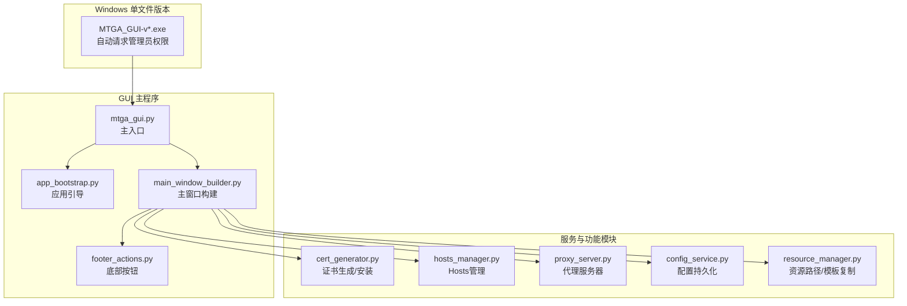
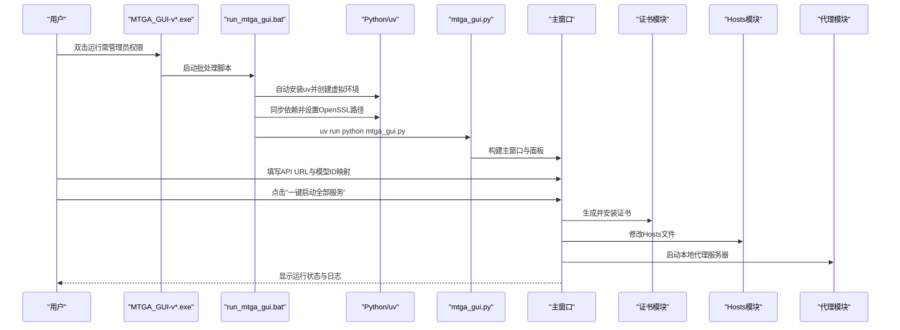
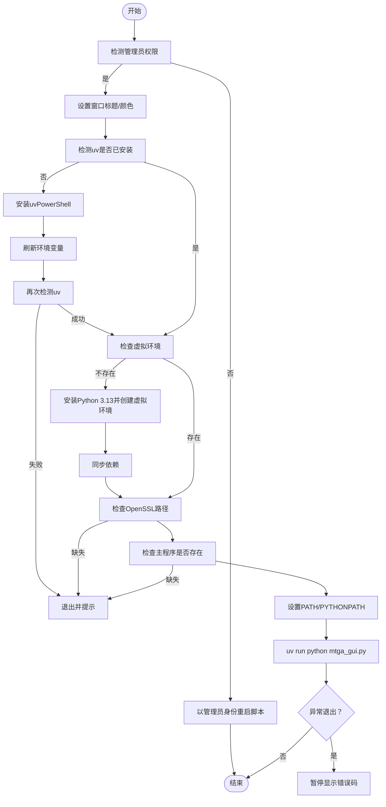
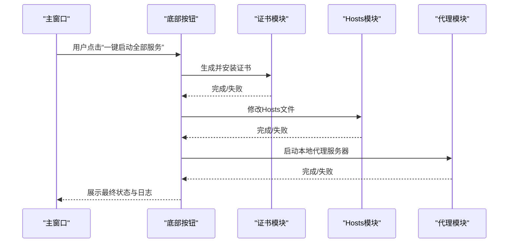
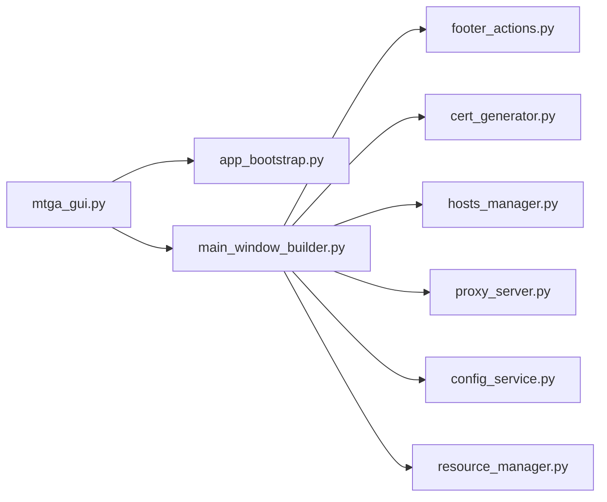

# Windows 快速入门

<cite>
**本文引用的文件列表**
- [run_mtga_gui.bat](file://run_mtga_gui.bat)
- [mtga_gui.py](file://mtga_gui.py)
- [README.md](file://README.md)
- [docs/Windows_Onefile_Build.md](file://docs/Windows_Onefile_Build.md)
- [modules/services/app_bootstrap.py](file://modules/services/app_bootstrap.py)
- [modules/ui/main_window_builder.py](file://modules/ui/main_window_builder.py)
- [modules/ui/footer_actions.py](file://modules/ui/footer_actions.py)
- [modules/cert/cert_generator.py](file://modules/cert/cert_generator.py)
- [modules/hosts/hosts_manager.py](file://modules/hosts/hosts_manager.py)
- [modules/proxy/proxy_server.py](file://modules/proxy/proxy_server.py)
- [modules/services/config_service.py](file://modules/services/config_service.py)
- [modules/runtime/resource_manager.py](file://modules/runtime/resource_manager.py)
</cite>

## 目录
1. [简介](#简介)
2. [项目结构](#项目结构)
3. [核心组件](#核心组件)
4. [架构总览](#架构总览)
5. [详细组件解析](#详细组件解析)
6. [依赖关系分析](#依赖关系分析)
7. [性能与稳定性建议](#性能与稳定性建议)
8. [故障排查指南](#故障排查指南)
9. [结论](#结论)
10. [附录](#附录)

## 简介
本指南面向Windows用户，提供从下载到首次运行的全流程操作说明。您将学会：
- 从GitHub Releases下载单文件可执行程序并以管理员权限运行
- 使用run_mtga_gui.bat自动化流程：自动检测/安装uv、创建Python虚拟环境、同步依赖、设置OpenSSL路径、启动主程序
- 在图形界面中正确填写API URL（仅需域名）与模型ID映射规则
- 使用“一键启动全部服务”按钮，理解其背后证书生成安装、Hosts文件修改、代理服务器启动三步操作
- 首次运行时处理防火墙权限请求，了解配置持久化机制

## 项目结构
该项目采用模块化分层设计，核心入口为GUI主程序，通过服务层协调证书、Hosts、代理等子系统。Windows单文件版本通过Nuitka打包，具备自动请求管理员权限与用户数据持久化能力。

图表来源
- [mtga_gui.py](file://mtga_gui.py#L1-L145)
- [modules/services/app_bootstrap.py](file://modules/services/app_bootstrap.py#L1-L38)
- [modules/ui/main_window_builder.py](file://modules/ui/main_window_builder.py#L1-L208)
- [modules/ui/footer_actions.py](file://modules/ui/footer_actions.py#L1-L23)
- [modules/cert/cert_generator.py](file://modules/cert/cert_generator.py#L1-L446)
- [modules/hosts/hosts_manager.py](file://modules/hosts/hosts_manager.py#L1-L492)
- [modules/proxy/proxy_server.py](file://modules/proxy/proxy_server.py#L1-L65)
- [modules/services/config_service.py](file://modules/services/config_service.py#L1-L81)
- [modules/runtime/resource_manager.py](file://modules/runtime/resource_manager.py#L1-L294)

章节来源
- [README.md](file://README.md#L63-L82)
- [docs/Windows_Onefile_Build.md](file://docs/Windows_Onefile_Build.md#L1-L172)

## 核心组件
- 单文件可执行程序（Windows）：自动请求管理员权限，支持用户数据持久化，首次运行需解压资源。
- GUI主程序：负责初始化应用上下文、构建主窗口、绑定事件与动作。
- 证书模块：封装OpenSSL命令调用，生成CA与服务器证书，支持PKCS#8私钥转换。
- Hosts模块：跨平台管理Hosts文件，支持备份、原子写入、权限处理与回退策略。
- 代理模块：封装代理应用层与运行时，负责启动/停止本地HTTPS代理。
- 配置服务：以YAML持久化配置组、当前索引、模型ID映射与认证密钥。
- 资源管理：在打包环境下定位程序资源与用户数据目录，复制模板文件。

章节来源
- [docs/Windows_Onefile_Build.md](file://docs/Windows_Onefile_Build.md#L77-L95)
- [modules/services/config_service.py](file://modules/services/config_service.py#L10-L81)
- [modules/runtime/resource_manager.py](file://modules/runtime/resource_manager.py#L201-L294)

## 架构总览
下图展示了Windows用户从下载到启动的端到端流程，以及GUI“一键启动全部服务”的内部执行顺序。

图表来源
- [run_mtga_gui.bat](file://run_mtga_gui.bat#L1-L132)
- [mtga_gui.py](file://mtga_gui.py#L114-L145)
- [modules/ui/main_window_builder.py](file://modules/ui/main_window_builder.py#L59-L208)
- [modules/ui/footer_actions.py](file://modules/ui/footer_actions.py#L14-L23)
- [modules/cert/cert_generator.py](file://modules/cert/cert_generator.py#L386-L446)
- [modules/hosts/hosts_manager.py](file://modules/hosts/hosts_manager.py#L459-L492)
- [modules/proxy/proxy_server.py](file://modules/proxy/proxy_server.py#L35-L65)

## 详细组件解析

### Windows下载与首次运行
- 从GitHub Releases下载最新版本的单文件可执行程序（文件名为“MTGA_GUI-v{版本号}-x64.exe”）。
- 双击运行，系统会自动请求管理员权限；若未提权，请右键以管理员身份运行。
- 首次运行可能需要允许Windows Defender防火墙放行程序（出现提示时勾选“允许”）。
- 单文件版本会将用户数据持久化到用户目录，配置与证书自动保存。

章节来源
- [README.md](file://README.md#L63-L82)
- [docs/Windows_Onefile_Build.md](file://docs/Windows_Onefile_Build.md#L7-L15)

### run_mtga_gui.bat 自动化流程详解
该批处理脚本负责：
- 自动检测并提权（若无管理员权限则自动重启自身）
- 自动安装uv（通过PowerShell安装器）
- 检测Python 3.13与uv虚拟环境，不存在则创建并同步依赖
- 检查OpenSSL路径并设置PATH
- 设置PYTHONPATH并切换到脚本目录
- 使用uv运行主程序mtga_gui.py

图表来源
- [run_mtga_gui.bat](file://run_mtga_gui.bat#L1-L132)

章节来源
- [run_mtga_gui.bat](file://run_mtga_gui.bat#L1-L132)

### 图形界面配置与“一键启动全部服务”
- API URL：仅填写域名（可选端口），无需包含路由部分。例如：https://your-api.example.com。
- 模型ID映射：可将自定义模型名映射到内置多模态模型名，以启用多模态能力。
- “一键启动全部服务”按钮：点击后依次执行以下三步操作（均在后台线程中执行，避免阻塞UI）：
  1) 生成并安装证书（调用证书模块）
  2) 修改Hosts文件（调用Hosts模块）
  3) 启动本地代理服务器（调用代理模块）

图表来源
- [modules/ui/footer_actions.py](file://modules/ui/footer_actions.py#L14-L23)
- [modules/ui/main_window_builder.py](file://modules/ui/main_window_builder.py#L184-L189)
- [modules/cert/cert_generator.py](file://modules/cert/cert_generator.py#L386-L446)
- [modules/hosts/hosts_manager.py](file://modules/hosts/hosts_manager.py#L459-L492)
- [modules/proxy/proxy_server.py](file://modules/proxy/proxy_server.py#L35-L65)

章节来源
- [README.md](file://README.md#L67-L77)
- [modules/ui/main_window_builder.py](file://modules/ui/main_window_builder.py#L59-L208)

### 配置持久化机制
- 单文件版本使用用户数据目录存储配置与证书，路径随平台而定：
  - Windows：%APPDATA%\MTGA\
- 存储内容包括：配置文件（mtga_config.yaml）、CA证书与私钥、Hosts备份、数据备份等。
- 配置服务提供YAML读写接口，支持保存配置组、当前索引、模型ID映射与认证密钥。

章节来源
- [docs/Windows_Onefile_Build.md](file://docs/Windows_Onefile_Build.md#L77-L95)
- [modules/services/config_service.py](file://modules/services/config_service.py#L14-L81)
- [modules/runtime/resource_manager.py](file://modules/runtime/resource_manager.py#L32-L44)

### 关键UI元素与功能说明
- API URL输入框：仅填写域名（可选端口），无需路由。
- 模型ID映射区域：用于将自定义模型名映射到内置多模态模型名。
- “一键启动全部服务”按钮：触发证书生成安装、Hosts修改、代理启动三步流程。
- 主窗口日志区：显示各步骤的执行状态与错误信息，便于排障。

章节来源
- [README.md](file://README.md#L67-L77)
- [modules/ui/main_window_builder.py](file://modules/ui/main_window_builder.py#L93-L116)

## 依赖关系分析
GUI主程序通过服务引导构建应用上下文，主窗口构建器注入各功能模块依赖，底部按钮绑定“一键启动全部服务”的执行器。

图表来源
- [mtga_gui.py](file://mtga_gui.py#L70-L82)
- [modules/services/app_bootstrap.py](file://modules/services/app_bootstrap.py#L19-L37)
- [modules/ui/main_window_builder.py](file://modules/ui/main_window_builder.py#L59-L208)
- [modules/ui/footer_actions.py](file://modules/ui/footer_actions.py#L8-L22)

章节来源
- [modules/services/app_bootstrap.py](file://modules/services/app_bootstrap.py#L1-L38)
- [modules/ui/main_window_builder.py](file://modules/ui/main_window_builder.py#L1-L208)

## 性能与稳定性建议
- 首次运行单文件版本可能因解压资源而较慢，后续运行会更快。
- 代理服务器默认监听443端口，确保无其他程序占用（如IIS、浏览器等）。
- 若遇到证书相关错误，检查CA证书是否已安装到“受信任的根证书颁发机构”存储。
- 配置持久化可避免每次重复填写，建议在完成后备份用户数据目录。

章节来源
- [docs/Windows_Onefile_Build.md](file://docs/Windows_Onefile_Build.md#L128-L136)
- [README.md](file://README.md#L262-L266)

## 故障排查指南
- 首次运行被Windows Defender拦截：允许防火墙放行。
- “一键启动全部服务”失败：
  - 检查管理员权限是否已提升（证书安装与Hosts修改需要管理员）
  - 查看主窗口日志中的具体错误信息
  - 确认OpenSSL路径存在且可执行
- 端口冲突导致代理启动失败：检查443端口占用情况，关闭占用进程或调整监听端口（不推荐）
- 证书问题：确认CA证书已安装到系统信任存储，服务器证书与私钥存在且非空

章节来源
- [README.md](file://README.md#L79-L82)
- [modules/cert/cert_generator.py](file://modules/cert/cert_generator.py#L406-L416)
- [modules/hosts/hosts_manager.py](file://modules/hosts/hosts_manager.py#L248-L261)

## 结论
通过本指南，Windows用户可以顺利完成从下载、运行到首次配置的全过程。单文件版本简化了分发与部署，GUI提供了直观的配置入口与一键启动能力。遇到问题时，结合日志与本指南的排障建议，通常可快速定位并解决问题。

## 附录
- 单文件版本特性与用户数据持久化详情参见：docs/Windows_Onefile_Build.md
- 快速开始与图形界面操作说明参见：README.md