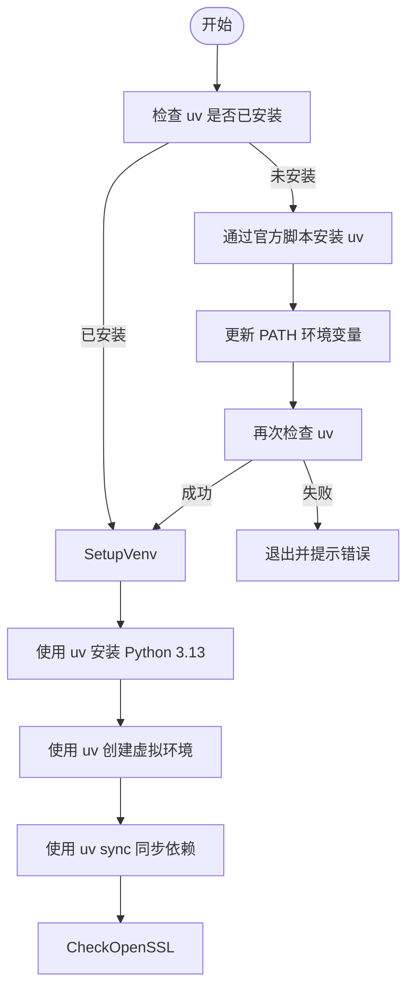
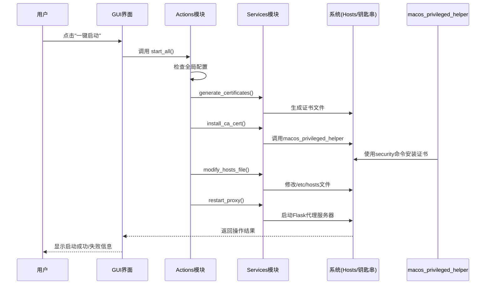

# macOS 快速入门

<cite>
**本文档引用的文件**
- [run_mtga_gui.sh](file://run_mtga_gui.sh)
- [README.md](file://README.md)
- [README_DMG.md](file://docs/README_DMG.md)
- [README_macOS_cli.md](file://docs/README_macOS_cli.md)
- [mtga_gui.py](file://mtga_gui.py)
- [create_mac_app.sh](file://mac/create_mac_app.sh)
- [Info.plist](file://mac/Info.plist)
- [macos_privileged_helper.py](file://modules/platform/macos_privileged_helper.py)
- [cert_actions.py](file://modules/actions/cert_actions.py)
- [proxy_actions.py](file://modules/actions/proxy_actions.py)
- [main_window_builder.py](file://modules/ui/main_window_builder.py)
- [pyproject.toml](file://pyproject.toml)
</cite>

## 目录
1. [macOS 用户（应用程序安装）](#macos-用户应用程序安装)
2. [解决“包已损坏”问题](#解决包已损坏问题)
3. [启动脚本工作机制](#启动脚本工作机制)
4. [GUI 一键启动流程](#gui-一键启动流程)
5. [故障排除](#故障排除)

## macOS 用户（应用程序安装）

### 安装方式
macOS 用户可以通过下载 DMG 安装包来安装 MTGA GUI 应用程序。安装过程简单直观，遵循标准的 macOS 应用程序安装流程。

1. 从 [GitHub Releases](https://github.com/BiFangKNT/mtga/releases) 下载最新版本的 `MTGA_GUI-v{版本号}-aarch64.dmg` 文件。
2. 双击下载的 DMG 文件，系统会自动将其挂载为一个虚拟磁盘，并在访达（Finder）中打开。
3. 在打开的安装窗口中，将 `MTGA_GUI.app` 图标拖拽到 `Applications`（应用程序）文件夹图标上，完成安装。
4. 安装完成后，您可以通过启动台（Launchpad）或直接在 `Applications` 文件夹中找到 `MTGA_GUI.app` 并双击启动。

**Section sources**
- [README.md](file://README.md#L84-L91)
- [README_DMG.md](file://docs/README_DMG.md#L113-L117)

### 使用方法
安装完成后，即可启动应用程序进行配置和使用。

1. 首次启动 `MTGA_GUI.app` 时，系统可能会弹出安全提示，需要在“系统设置” -> “隐私与安全性”中允许运行。
2. 在打开的图形界面中，您需要填写以下关键信息：
   - **API URL**：输入您的 API 服务地址，例如 `https://your-api.example.com`。请注意，只需填写域名和端口号（如果需要），不需要包含后面的路由路径。
   - **模型映射**：如果希望启用多模态等高级功能，可以将目标模型的名称映射到内置的多模态模型名上。
3. 配置完成后，点击界面中的“一键启动全部服务”按钮。
4. 程序将自动执行一系列操作，包括生成并安装 SSL 证书、修改系统 Hosts 文件以及启动本地代理服务器。
5. **重要**：在证书安装步骤完成后，系统会自动打开“钥匙串访问”（Keychain Access）应用。您需要手动找到名为 `MTGA_CA` 的证书，并将其设置为“始终信任”，以确保代理的 SSL 证书能被系统和浏览器正确验证。
6. 完成上述步骤后，请参考 Trae IDE 的配置指南，将 IDE 的模型请求指向本地代理。

**Section sources**
- [README.md](file://README.md#L94-L107)

## 解决“包已损坏”问题

在 macOS 上首次尝试运行从互联网下载的应用程序时，系统可能会弹出““MTGA_GUI.app”已损坏，无法打开。你应该将它移到废纸篓。”的警告。这并非程序真的损坏，而是 macOS 的 Gatekeeper 安全机制在阻止未经验证的应用程序运行。以下是两种有效的解决方案。

### 图形化解决方案
使用 Sentinel 工具可以图形化地解决此问题，操作简单，适合不熟悉命令行的用户。

1. 从 [Sentinel Releases](https://github.com/alienator88/Sentinel/releases/latest) 下载 `Sentinel.dmg` 文件。
2. 双击 `Sentinel.dmg` 文件，将 `Sentinel.app` 拖拽到 `Applications` 文件夹中进行安装。
3. 从启动台或 `Applications` 文件夹启动 `Sentinel.app`。
4. 将您下载的 `MTGA_GUI.app` 拖拽到 `Sentinel.app` 界面的左侧窗口中。
5. Sentinel 会自动处理 `MTGA_GUI.app` 的安全属性，并在处理完成后自动启动该应用程序。

### CLI 解决方案
通过终端命令行工具，您可以直接移除导致此问题的隔离属性。

1. 打开“终端”（Terminal）应用程序。
2. 执行以下命令，移除 `MTGA_GUI.app` 的隔离属性。请确保将 `<应用完整路径>` 替换为您的实际路径，例如 `/Applications/MTGA_GUI.app`。
   ```zsh
   xattr -d com.apple.quarantine <应用完整路径>
   ```
3. 命令执行成功后，您就可以正常双击启动 `MTGA_GUI.app` 了。

**Section sources**
- [README.md](file://README.md#L114-L142)

## 启动脚本工作机制

`run_mtga_gui.sh` 是一个为 macOS 系统设计的 Bash 启动脚本，它负责自动化处理应用程序运行所需的所有依赖和环境配置。其核心工作机制如下：

### 1. 依赖管理与环境准备
脚本首先会检查并自动安装 `uv` 包管理器。`uv` 是一个现代化的 Python 包管理工具，用于高效地管理项目依赖。


**Diagram sources**
- [run_mtga_gui.sh](file://run_mtga_gui.sh#L47-L147)

### 2. 虚拟环境与依赖同步
脚本会创建一个独立的 Python 虚拟环境（位于项目根目录下的 `.venv` 文件夹），以避免与系统或其他项目的 Python 环境产生冲突。它使用 `uv` 自动安装 `pyproject.toml` 文件中定义的所有依赖项，确保运行环境的纯净和一致。

### 3. OpenSSL 与 Tkinter 兼容性处理
为了确保代理服务器的稳定运行，脚本会优先检查系统是否已安装 OpenSSL。如果未找到，会提示用户通过 Homebrew 安装 (`brew install openssl`)。此外，脚本会智能地设置 `TCL_LIBRARY` 和 `TK_LIBRARY` 环境变量，指向正确的 Tcl/Tk 库路径，从而解决在某些环境下使用 `tkinter` 图形库时可能出现的兼容性问题。

### 4. 权限提升
程序在执行某些关键操作（如修改 `/etc/hosts` 文件和安装系统证书）时需要管理员权限。`run_mtga_gui.sh` 脚本会在启动主程序前，通过 `sudo` 命令请求用户输入管理员密码，以获取必要的权限。

**Section sources**
- [run_mtga_gui.sh](file://run_mtga_gui.sh)
- [README_macOS_cli.md](file://docs/README_macOS_cli.md)
- [pyproject.toml](file://pyproject.toml)

## GUI 一键启动流程

当用户在图形界面中点击“一键启动全部服务”按钮时，后台会触发一个精心编排的自动化流程，该流程由多个模块协同完成。

### 流程概述


**Diagram sources**
- [proxy_actions.py](file://modules/actions/proxy_actions.py#L69-L128)
- [cert_actions.py](file://modules/actions/cert_actions.py)
- [macos_privileged_helper.py](file://modules/platform/macos_privileged_helper.py)

### 详细步骤
1.  **生成证书**：调用 `cert_service.generate_certificates_result` 服务，根据配置生成自签名的 CA 证书和服务器证书。
2.  **安装 CA 证书**：调用 `cert_service.install_ca_cert_result` 服务。此服务会通过 `macos_privileged_helper` 模块与一个以 root 权限运行的辅助进程通信，使用 `security add-trusted-cert` 命令将 CA 证书安装到系统的“系统钥匙串”中。
3.  **修改 Hosts 文件**：调用 `hosts_service` 模块，将 `api.openai.com` 等域名指向 `127.0.0.1`。此操作同样需要管理员权限，由 `macos_privileged_helper` 完成。
4.  **启动代理服务器**：最后，调用 `proxy_service` 模块，使用 Flask 框架启动一个本地 HTTPS 代理服务器。该服务器会监听 443 端口，接收来自 IDE 的请求，并将其转发到用户配置的真实 API 服务地址。

**Section sources**
- [proxy_actions.py](file://modules/actions/proxy_actions.py)
- [cert_actions.py](file://modules/actions/cert_actions.py)
- [macos_privileged_helper.py](file://modules/platform/macos_privileged_helper.py)
- [main_window_builder.py](file://modules/ui/main_window_builder.py)

## 故障排除

### 端口冲突
如果程序启动失败，首先检查 443 端口是否被其他程序占用。在终端执行 `netstat -lnp tcp | grep :443` 命令。如果发现有进程在监听该端口，请关闭该进程（如某些 VPN 软件或 Web 服务器）。

### 证书信任问题
即使证书已安装，如果未在“钥匙串访问”中手动设置为“始终信任”，浏览器和 IDE 仍会报告 SSL 证书错误。请务必完成此手动步骤。

### hosts 文件修改失败
如果修改 hosts 文件失败，请确保 `macos_privileged_helper` 能够正确请求到管理员权限。检查终端输出的错误日志，通常位于用户数据目录下的日志文件中。

**Section sources**
- [README.md](file://README.md#L143-L157)
- [macos_privileged_helper.py](file://modules/platform/macos_privileged_helper.py)