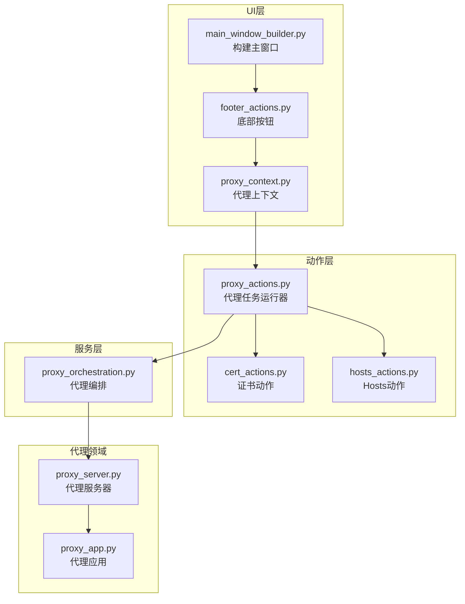
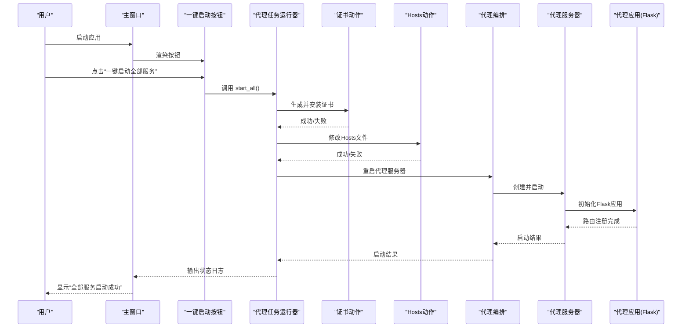
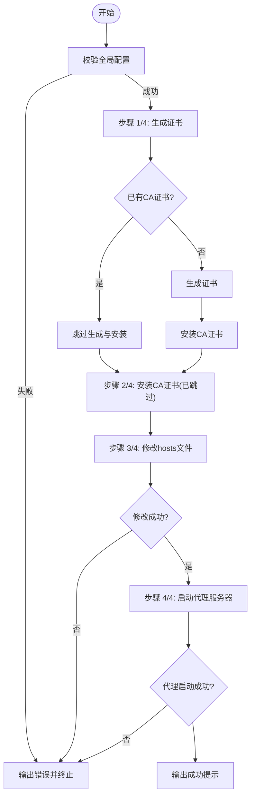
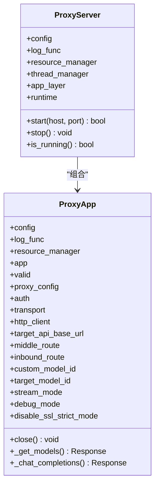
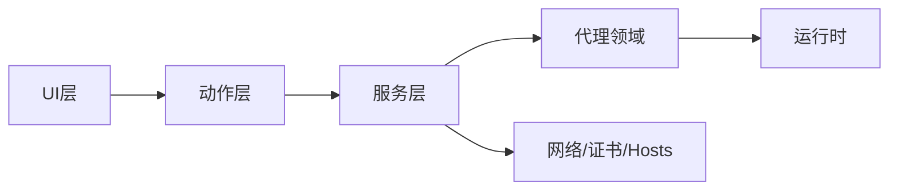

# 基础使用示例

<cite>
**本文档引用的文件**
- [README.md](file://README.md)
- [main_window_builder.py](file://modules/ui/main_window_builder.py)
- [footer_actions.py](file://modules/ui/footer_actions.py)
- [proxy_context.py](file://modules/ui/proxy_context.py)
- [proxy_actions.py](file://modules/actions/proxy_actions.py)
- [cert_actions.py](file://modules/actions/cert_actions.py)
- [hosts_actions.py](file://modules/actions/hosts_actions.py)
- [proxy_orchestration.py](file://modules/services/proxy_orchestration.py)
- [proxy_server.py](file://modules/proxy/proxy_server.py)
- [proxy_app.py](file://modules/proxy/proxy_app.py)
- [test_target_api.py](file://test_target_api.py)
</cite>

## 目录
1. [简介](#简介)
2. [项目结构](#项目结构)
3. [核心组件](#核心组件)
4. [架构总览](#架构总览)
5. [详细组件分析](#详细组件分析)
6. [依赖关系分析](#依赖关系分析)
7. [性能考虑](#性能考虑)
8. [故障排除指南](#故障排除指南)
9. [结论](#结论)
10. [附录](#附录)

## 简介
本示例面向首次使用者，提供从启动应用到在IDE中成功调用模型的完整流程说明。用户只需在主窗口输入目标API地址与自定义模型ID，点击“一键启动全部服务”，系统将自动完成证书生成与安装、Hosts文件修改、Flask代理服务器启动等步骤。随后在Trae IDE中配置OpenAI服务商、自定义模型类型与相同模型ID，即可验证请求被本地代理正确转发至目标API并返回响应。

## 项目结构
该项目采用分层架构，UI层通过动作层（actions）编排服务层（services），服务层再驱动领域模块（cert/hosts/network/proxy）完成具体任务；平台相关逻辑位于platform模块。

图表来源
- [main_window_builder.py](file://modules/ui/main_window_builder.py#L187-L189)
- [footer_actions.py](file://modules/ui/footer_actions.py#L14-L22)
- [proxy_context.py](file://modules/ui/proxy_context.py#L62-L77)
- [proxy_actions.py](file://modules/actions/proxy_actions.py#L69-L128)
- [proxy_orchestration.py](file://modules/services/proxy_orchestration.py#L70-L106)
- [proxy_server.py](file://modules/proxy/proxy_server.py#L14-L54)
- [proxy_app.py](file://modules/proxy/proxy_app.py#L18-L65)

章节来源
- [README.md](file://README.md#L283-L291)
- [main_window_builder.py](file://modules/ui/main_window_builder.py#L59-L207)
- [proxy_context.py](file://modules/ui/proxy_context.py#L38-L83)

## 核心组件
- 主窗口与按钮：主窗口构建器负责组装UI组件，底部按钮绑定“一键启动全部服务”的回调。
- 代理任务运行器：封装证书、Hosts、代理服务器的顺序启动流程。
- 代理编排服务：负责全局配置校验、代理实例启停、网络环境检查与端口占用检测。
- 代理服务器与应用：将Flask应用与运行时分离，实现TLS终止与上游转发。
- 代理应用：实现模型列表与聊天补全的路由、鉴权、请求体改写与响应流式处理。

章节来源
- [main_window_builder.py](file://modules/ui/main_window_builder.py#L184-L189)
- [proxy_actions.py](file://modules/actions/proxy_actions.py#L69-L128)
- [proxy_orchestration.py](file://modules/services/proxy_orchestration.py#L36-L106)
- [proxy_server.py](file://modules/proxy/proxy_server.py#L14-L54)
- [proxy_app.py](file://modules/proxy/proxy_app.py#L18-L65)

## 架构总览
下图展示了从用户点击按钮到代理服务器启动并对外提供服务的关键交互路径。

图表来源
- [footer_actions.py](file://modules/ui/footer_actions.py#L14-L22)
- [proxy_actions.py](file://modules/actions/proxy_actions.py#L69-L128)
- [cert_actions.py](file://modules/actions/cert_actions.py#L9-L27)
- [hosts_actions.py](file://modules/actions/hosts_actions.py#L23-L48)
- [proxy_orchestration.py](file://modules/services/proxy_orchestration.py#L70-L106)
- [proxy_server.py](file://modules/proxy/proxy_server.py#L35-L47)
- [proxy_app.py](file://modules/proxy/proxy_app.py#L96-L112)

## 详细组件分析

### 主窗口与按钮绑定
- 主窗口构建器在底部区域创建“一键启动全部服务”按钮，并将其回调绑定到代理任务运行器的start_all方法。
- 该按钮是触发完整启动流程的入口。

章节来源
- [main_window_builder.py](file://modules/ui/main_window_builder.py#L184-L189)
- [footer_actions.py](file://modules/ui/footer_actions.py#L14-L22)

### 代理任务运行器（顺序启动）
- start_all方法按步骤执行：证书生成与安装、Hosts文件修改、代理服务器重启。
- 每一步都会输出状态日志，若任一步失败则终止后续流程并输出错误信息。
- 代理服务器启动成功后输出“全部服务启动成功”。

图表来源
- [proxy_actions.py](file://modules/actions/proxy_actions.py#L69-L128)

章节来源
- [proxy_actions.py](file://modules/actions/proxy_actions.py#L69-L128)

### 证书动作
- 提供生成、安装、清理CA证书的异步任务封装，统一输出日志与错误信息。

章节来源
- [cert_actions.py](file://modules/actions/cert_actions.py#L9-L66)

### Hosts动作
- 提供修改、移除、备份、还原Hosts文件的异步任务封装，支持打开Hosts文件。

章节来源
- [hosts_actions.py](file://modules/actions/hosts_actions.py#L8-L61)

### 代理编排服务
- 负责全局配置校验、构建代理配置、重启代理实例、停止代理实例、网络环境检查与端口占用检测。
- 启动前检查443端口占用，若被占用则拒绝启动并提示释放端口。

章节来源
- [proxy_orchestration.py](file://modules/services/proxy_orchestration.py#L36-L200)

### 代理服务器与应用
- 代理服务器将领域逻辑（ProxyApp）与运行时（ProxyRuntime）解耦，负责装配与启动。
- 代理应用注册模型列表与聊天补全路由，实现鉴权、请求体改写、上游转发与响应流式处理。

图表来源
- [proxy_server.py](file://modules/proxy/proxy_server.py#L14-L54)
- [proxy_app.py](file://modules/proxy/proxy_app.py#L18-L65)

章节来源
- [proxy_server.py](file://modules/proxy/proxy_server.py#L14-L54)
- [proxy_app.py](file://modules/proxy/proxy_app.py#L18-L65)

### 请求转发核心逻辑（关键代码片段路径）
- 模型列表路由：返回映射后的自定义模型信息。
- 聊天补全路由：解析请求、替换模型ID、强制流模式、构建上游请求头、转发到目标API、处理流式与非流式响应。

章节来源
- [proxy_app.py](file://modules/proxy/proxy_app.py#L114-L162)
- [proxy_app.py](file://modules/proxy/proxy_app.py#L164-L458)

## 依赖关系分析
- UI层依赖动作层提供的任务运行器与动作函数。
- 动作层依赖服务层提供的编排与工具函数。
- 服务层依赖代理领域模块（ProxyServer/ProxyApp）与网络/证书/Hosts等模块。
- 代理应用依赖认证、传输与资源管理模块。

图表来源
- [README.md](file://README.md#L283-L291)
- [main_window_builder.py](file://modules/ui/main_window_builder.py#L10-L27)
- [proxy_context.py](file://modules/ui/proxy_context.py#L38-L83)
- [proxy_orchestration.py](file://modules/services/proxy_orchestration.py#L7-L11)

章节来源
- [README.md](file://README.md#L283-L291)
- [main_window_builder.py](file://modules/ui/main_window_builder.py#L10-L27)
- [proxy_context.py](file://modules/ui/proxy_context.py#L38-L83)

## 性能考虑
- 代理应用在调试模式下会输出详细的请求头与响应体，便于排查但会增加日志开销。
- 流式响应处理会逐块转发上游事件，注意网络抖动与下游断开的场景。
- 代理服务器监听443端口，需确保无其他进程占用。

## 故障排除指南
- 端口占用：若443被占用，代理启动会失败。请释放占用进程或调整监听端口。
- 证书问题：确认CA证书已安装到系统受信任的根证书颁发机构。
- Hosts修改：确认Hosts中包含指向127.0.0.1的api.openai.com条目且未被注释。
- 鉴权失败：确认MTGA鉴权Key与请求中的Authorization一致。

章节来源
- [proxy_orchestration.py](file://modules/services/proxy_orchestration.py#L163-L165)
- [README.md](file://README.md#L143-L156)

## 结论
通过“一键启动全部服务”，系统自动化完成证书、Hosts与代理服务器的初始化，使用户能够在Trae IDE中以OpenAI格式对接自定义模型。代理应用负责将请求正确转发至目标API并返回响应，配合调试日志可快速定位问题。

## 附录

### 基础使用示例流程
- 启动应用：双击GUI可执行文件（Windows）或启动DMG中的应用（macOS）。
- 输入配置：在主窗口输入目标API地址（如 https://your-api.example.com）与自定义模型ID（如 my-local-model）。
- 点击按钮：点击“一键启动全部服务”，系统依次执行：
  - 证书生成与安装
  - Hosts文件修改指向127.0.0.1
  - 启动Flask代理服务器
- 状态提示：成功后输出“全部服务启动成功”。
- IDE配置：打开Trae IDE，添加模型界面选择OpenAI服务商，模型类型选“自定义”，填入相同的模型ID，API密钥可填任意sk-前缀字符串。
- 验证流程：在IDE中发送请求，观察本地代理日志显示请求被正确转发至目标API并返回响应。

章节来源
- [README.md](file://README.md#L63-L82)
- [README.md](file://README.md#L93-L112)
- [proxy_actions.py](file://modules/actions/proxy_actions.py#L82-L126)

### 关键代码片段路径
- 代理应用模型列表路由：[proxy_app.py](file://modules/proxy/proxy_app.py#L114-L162)
- 代理应用聊天补全路由与转发逻辑：[proxy_app.py](file://modules/proxy/proxy_app.py#L164-L458)

### 目标API测试脚本
- 提供独立脚本用于直接调用目标API，便于验证上游服务可用性与参数配置。

章节来源
- [test_target_api.py](file://test_target_api.py#L15-L65)