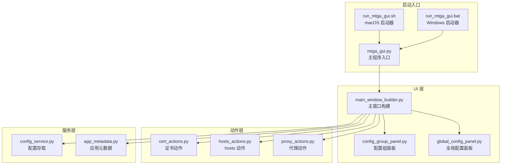
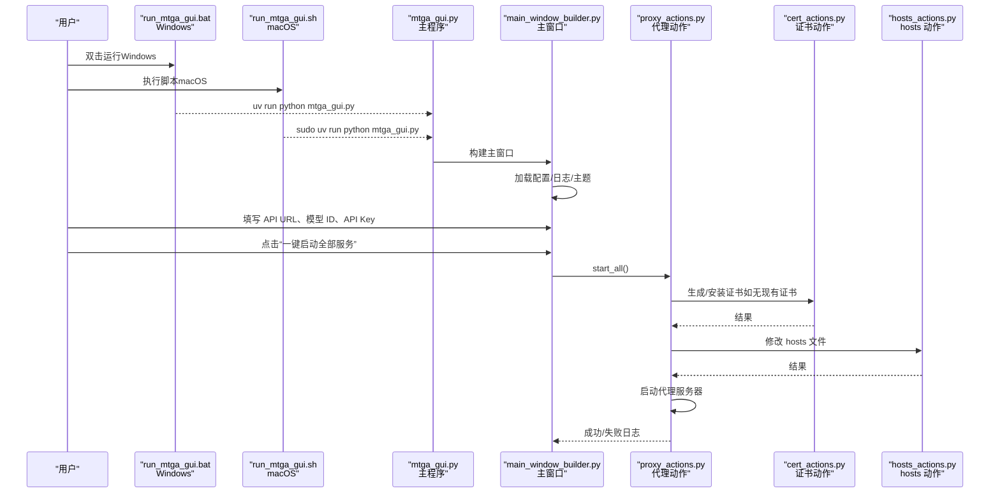
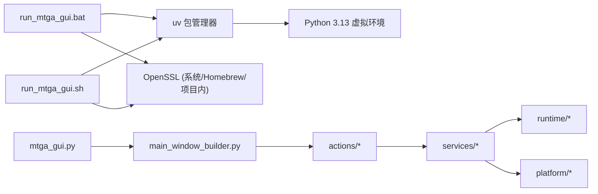

# 快速入门指南

<cite>
**本文引用的文件**
- [README.md](file://README.md)
- [run_mtga_gui.bat](file://run_mtga_gui.bat)
- [run_mtga_gui.sh](file://run_mtga_gui.sh)
- [mtga_gui.py](file://mtga_gui.py)
- [docs/README_macOS_cli.md](file://docs/README_macOS_cli.md)
- [modules/ui/main_window_builder.py](file://modules/ui/main_window_builder.py)
- [modules/actions/cert_actions.py](file://modules/actions/cert_actions.py)
- [modules/actions/hosts_actions.py](file://modules/actions/hosts_actions.py)
- [modules/actions/proxy_actions.py](file://modules/actions/proxy_actions.py)
- [modules/services/config_service.py](file://modules/services/config_service.py)
- [modules/ui/config_group_panel.py](file://modules/ui/config_group_panel.py)
- [modules/ui/global_config_panel.py](file://modules/ui/global_config_panel.py)
- [modules/services/app_metadata.py](file://modules/services/app_metadata.py)
- [pyproject.toml](file://pyproject.toml)
</cite>

## 目录
1. [简介](#简介)
2. [项目结构](#项目结构)
3. [核心组件](#核心组件)
4. [架构总览](#架构总览)
5. [详细组件解析](#详细组件解析)
6. [依赖关系分析](#依赖关系分析)
7. [性能与稳定性建议](#性能与稳定性建议)
8. [故障排查指南](#故障排查指南)
9. [结论](#结论)
10. [附录](#附录)

## 简介
本指南面向首次使用 MTGA GUI 的用户，覆盖从下载到首次运行的全流程，分别给出 Windows 与 macOS 的操作步骤，包括：
- 通过 run_mtga_gui.bat/.sh 脚本启动应用
- 图形界面初次启动时的配置流程
- API 地址设置方法
- 一键启动代理服务的操作路径
- 所需先决条件（操作系统版本、Python 运行时或打包版本、权限授权提示）
- 配置保存与自动恢复机制
- 在 IDE 中完成端点配置
- 安全注意事项（证书安装的必要性与系统权限请求的合理性）

## 项目结构
本项目采用模块化分层架构，UI 层通过 actions 与 services 编排底层功能（证书、hosts、网络、代理等），并由 runtime/platform 层处理平台差异与资源管理。启动入口位于顶层脚本与主程序入口。

图表来源
- [run_mtga_gui.bat](file://run_mtga_gui.bat#L1-L132)
- [run_mtga_gui.sh](file://run_mtga_gui.sh#L1-L250)
- [mtga_gui.py](file://mtga_gui.py#L1-L145)
- [modules/ui/main_window_builder.py](file://modules/ui/main_window_builder.py#L1-L208)
- [modules/ui/config_group_panel.py](file://modules/ui/config_group_panel.py#L1-L514)
- [modules/ui/global_config_panel.py](file://modules/ui/global_config_panel.py#L1-L88)
- [modules/actions/cert_actions.py](file://modules/actions/cert_actions.py#L1-L66)
- [modules/actions/hosts_actions.py](file://modules/actions/hosts_actions.py#L1-L61)
- [modules/actions/proxy_actions.py](file://modules/actions/proxy_actions.py#L1-L129)
- [modules/services/config_service.py](file://modules/services/config_service.py#L1-L81)
- [modules/services/app_metadata.py](file://modules/services/app_metadata.py#L1-L22)

章节来源
- [README.md](file://README.md#L61-L113)
- [pyproject.toml](file://pyproject.toml#L1-L85)

## 核心组件
- 启动器（Windows/macOS）：负责环境准备、依赖安装、虚拟环境管理、OpenSSL 检测与主程序启动。
- 主程序入口：初始化环境、构建 UI、注入上下文与依赖。
- UI 面板：配置组面板（多组 API 地址/模型/密钥）、全局配置面板（映射模型 ID、MTGA 鉴权 Key）。
- 动作层：封装证书生成/安装、hosts 修改/打开、代理启动/停止/一键启动。
- 服务层：配置存取（YAML）、应用元数据（显示名、CA 名称、日志文件名等）。

章节来源
- [run_mtga_gui.bat](file://run_mtga_gui.bat#L1-L132)
- [run_mtga_gui.sh](file://run_mtga_gui.sh#L1-L250)
- [mtga_gui.py](file://mtga_gui.py#L1-L145)
- [modules/ui/main_window_builder.py](file://modules/ui/main_window_builder.py#L1-L208)
- [modules/ui/config_group_panel.py](file://modules/ui/config_group_panel.py#L1-L514)
- [modules/ui/global_config_panel.py](file://modules/ui/global_config_panel.py#L1-L88)
- [modules/actions/cert_actions.py](file://modules/actions/cert_actions.py#L1-L66)
- [modules/actions/hosts_actions.py](file://modules/actions/hosts_actions.py#L1-L61)
- [modules/actions/proxy_actions.py](file://modules/actions/proxy_actions.py#L1-L129)
- [modules/services/config_service.py](file://modules/services/config_service.py#L1-L81)
- [modules/services/app_metadata.py](file://modules/services/app_metadata.py#L1-L22)

## 架构总览
下面的序列图展示了从脚本启动到图形界面首次运行的关键流程，以及一键启动代理服务的调用链。

图表来源
- [run_mtga_gui.bat](file://run_mtga_gui.bat#L112-L123)
- [run_mtga_gui.sh](file://run_mtga_gui.sh#L236-L246)
- [mtga_gui.py](file://mtga_gui.py#L114-L145)
- [modules/ui/main_window_builder.py](file://modules/ui/main_window_builder.py#L59-L207)
- [modules/actions/proxy_actions.py](file://modules/actions/proxy_actions.py#L69-L128)
- [modules/actions/cert_actions.py](file://modules/actions/cert_actions.py#L9-L44)
- [modules/actions/hosts_actions.py](file://modules/actions/hosts_actions.py#L23-L47)

## 详细组件解析

### Windows 快速开始（GUI 一键启动）
- 下载与运行
  - 从发布页下载最新版本的 Windows 可执行文件，双击运行，首次运行需要管理员权限。
  - 若提示 UAC，点击“是”以提升权限。
- 初次配置
  - 在图形界面中填写：
    - API URL：仅需域名（端口可选，无需路由），例如：https://your-api.example.com
    - 实际模型 ID：与你目标 API 的模型名一致
    - API Key：与目标 API 对应的密钥
  - 如需启用多模态能力，可在映射模型 ID 与实际模型 ID 之间建立映射（参见项目文档中的图片说明）。
- 一键启动代理服务
  - 点击“一键启动全部服务”，程序将自动完成：
    - 生成并安装证书
    - 修改 hosts 文件
    - 启动代理服务器
- IDE 配置
  - 在 Trae IDE 中添加自定义模型，服务商选择 OpenAI，模型选择“自定义模型”，模型 ID 填写你在脚本中定义的 CUSTOM_MODEL_ID。
  - API 密钥可按需填写，代理会透传 Authorization 头。

章节来源
- [README.md](file://README.md#L63-L82)

### macOS 快速开始（应用程序安装）
- 安装方式
  - 从发布页下载 DMG 文件，双击挂载后将 MTGA_GUI.app 拖入 Applications。
  - 首次运行可能需要在系统偏好设置中允许运行。
- 使用方法
  - 启动 MTGA_GUI.app，填写：
    - API URL：例如 https://your-api.example.com
    - 如需多模态，建立映射模型 ID 与实际模型 ID 的映射
  - 点击“一键启动全部服务”，程序将：
    - 生成并安装 SSL 证书到系统钥匙串
    - 修改 /etc/hosts（需要管理员权限）
  - 需要在钥匙串中信任生成的证书（默认名称为 MTGA_CA）。
  - 启动代理服务器。
- IDE 配置
  - 在 Trae IDE 中添加自定义模型，服务商 OpenAI，模型自定义，模型 ID 填写脚本中的 CUSTOM_MODEL_ID，API 密钥可按需填写。

章节来源
- [README.md](file://README.md#L84-L112)

### 通过脚本启动（开发者/非打包版本）
- Windows
  - 环境准备：Windows 10+、管理员权限、Python 3.10+、Git
  - 生成自签名证书：在 ca 目录执行生成脚本，生成 ca.crt/ca.key 与 api.openai.com.crt/api.openai.com.key
  - 让 Windows 信任你的 CA 证书：安装到“受信任的根证书颁发机构”
  - 修改 hosts：将 api.openai.com 指向 127.0.0.1
  - 运行本地代理服务器：安装依赖后，以管理员身份运行 trae_proxy.py
  - IDE 配置：在 Trae 中添加自定义模型，服务商 OpenAI，模型自定义，模型 ID 填写脚本中的 CUSTOM_MODEL_ID
- macOS
  - 参考 macOS CLI 文档，脚本会自动处理 uv、Python、OpenSSL、虚拟环境与主程序启动，运行时会提示输入管理员密码以修改网络设置。

章节来源
- [README.md](file://README.md#L160-L272)
- [docs/README_macOS_cli.md](file://docs/README_macOS_cli.md#L1-L147)

### 图形界面关键按钮与功能说明
- 安装证书
  - 功能：生成并安装 CA 证书到系统信任存储（Windows：受信任的根证书颁发机构；macOS：系统钥匙串）
  - 适用场景：首次运行或证书缺失时
- 修改 Hosts
  - 功能：将 api.openai.com 指向 127.0.0.1，使 Trae 的请求被本地代理捕获
  - 适用场景：首次运行或 hosts 未正确配置时
- 启动代理
  - 功能：启动本地代理服务器，转发请求到目标 API
  - 适用场景：已配置好证书与 hosts
- 一键启动全部服务
  - 功能：按顺序执行“生成证书/安装证书/修改 hosts/启动代理”
  - 适用场景：首次运行或需要重置环境

章节来源
- [modules/actions/cert_actions.py](file://modules/actions/cert_actions.py#L9-L44)
- [modules/actions/hosts_actions.py](file://modules/actions/hosts_actions.py#L23-L47)
- [modules/actions/proxy_actions.py](file://modules/actions/proxy_actions.py#L69-L128)
- [README.md](file://README.md#L67-L77)

### API 地址设置方法
- 在“代理服务器配置组”中新增或编辑配置组：
  - API URL：仅域名（端口可选），无需路由
  - 实际模型 ID：与目标 API 的模型名一致
  - API Key：与目标 API 对应的密钥
- 在“全局配置”中设置：
  - 映射模型 ID：对应 Trae 端填写的模型名（自定义）
  - MTGA 鉴权 Key：作为 MTGA 代理服务的全局密钥（自定义）

章节来源
- [modules/ui/config_group_panel.py](file://modules/ui/config_group_panel.py#L207-L392)
- [modules/ui/global_config_panel.py](file://modules/ui/global_config_panel.py#L52-L76)
- [README.md](file://README.md#L68-L71)

### 配置保存与自动恢复机制
- 配置文件位置：使用 YAML 存储，包含配置组列表、当前选中索引、映射模型 ID、MTGA 鉴权 Key
- 自动保存：当选择配置组或保存全局配置时，立即写入文件
- 自动恢复：启动时加载配置组与全局配置，确保上次设置可用

章节来源
- [modules/services/config_service.py](file://modules/services/config_service.py#L14-L80)

### 在 IDE 中完成端点配置
- 在 Trae IDE 中：
  - 服务商：OpenAI
  - 模型：自定义模型
  - 模型 ID：填写脚本中定义的 CUSTOM_MODEL_ID
  - API 密钥：可按需填写，代理会透传 Authorization 头

章节来源
- [README.md](file://README.md#L246-L260)

### 安全注意事项
- 证书安装的必要性：TLS 终止与代理转发需要有效的 CA 证书，否则会出现 SSL/TLS 错误
- 系统权限请求的合理性：修改 hosts 与监听 443 端口需要管理员权限，这是必要的网络拦截行为
- 证书信任：Windows 需要安装到“受信任的根证书颁发机构”，macOS 需要在钥匙串中信任 MTGA_CA

章节来源
- [README.md](file://README.md#L199-L211)
- [README.md](file://README.md#L109-L111)

## 依赖关系分析
- 启动器依赖 uv 与 Python 3.13 虚拟环境，macOS 优先使用系统或 Homebrew OpenSSL，Windows 使用项目内 OpenSSL
- 主程序入口通过模块化依赖注入 UI、动作与服务层
- UI 通过动作层调用证书、hosts、代理服务，动作层再委托服务层执行具体任务

图表来源
- [run_mtga_gui.bat](file://run_mtga_gui.bat#L23-L102)
- [run_mtga_gui.sh](file://run_mtga_gui.sh#L47-L167)
- [mtga_gui.py](file://mtga_gui.py#L37-L81)
- [pyproject.toml](file://pyproject.toml#L22-L37)

章节来源
- [pyproject.toml](file://pyproject.toml#L1-L85)

## 性能与稳定性建议
- 首次运行可能需要较长时间（下载与安装依赖），请耐心等待
- 确保网络连接稳定，避免中途断网导致依赖安装失败
- 避免其他程序占用 443 端口（如浏览器、VPN 等），否则代理启动会失败
- 在 macOS 上，如遇“包已损坏”提示，可通过图形化或 CLI 方案处理

章节来源
- [docs/README_macOS_cli.md](file://docs/README_macOS_cli.md#L128-L134)
- [README.md](file://README.md#L143-L156)

## 故障排查指南
- 证书问题
  - Windows：确认 CA 证书已安装到“受信任的根证书颁发机构”
  - macOS：在钥匙串中信任 MTGA_CA
- hosts 问题
  - 确认 hosts 中包含 127.0.0.1 api.openai.com 且未被注释
  - 端口 443 被占用时，停止占用进程或修改监听端口（复杂度较高）
- 权限问题
  - Windows：以管理员身份运行
  - macOS：运行脚本时输入管理员密码
- 端口冲突
  - 使用系统工具检查 443 端口占用情况，关闭占用进程

章节来源
- [README.md](file://README.md#L143-L156)
- [README.md](file://README.md#L223-L266)

## 结论
通过本指南，你可以在 Windows 与 macOS 上完成 MTGA GUI 的首次运行，掌握从脚本启动、图形界面配置到一键启动代理服务的完整流程。请务必重视证书安装与系统权限请求的安全性，并根据 IDE 提示完成端点配置。如遇问题，可参考故障排查章节或查阅项目文档的后续深入章节。

## 附录
- 术语说明
  - API URL：目标 API 的基础地址（仅域名与端口）
  - 实际模型 ID：与目标 API 的模型名一致
  - 映射模型 ID：用于 Trae 端识别的模型名（自定义）
  - MTGA 鉴权 Key：作为 MTGA 代理服务的全局密钥（自定义）
- 相关文件
  - 启动器与主程序入口：run_mtga_gui.bat、run_mtga_gui.sh、mtga_gui.py
  - UI 面板：config_group_panel.py、global_config_panel.py、main_window_builder.py
  - 动作层：cert_actions.py、hosts_actions.py、proxy_actions.py
  - 服务层：config_service.py、app_metadata.py
  - 依赖声明：pyproject.toml