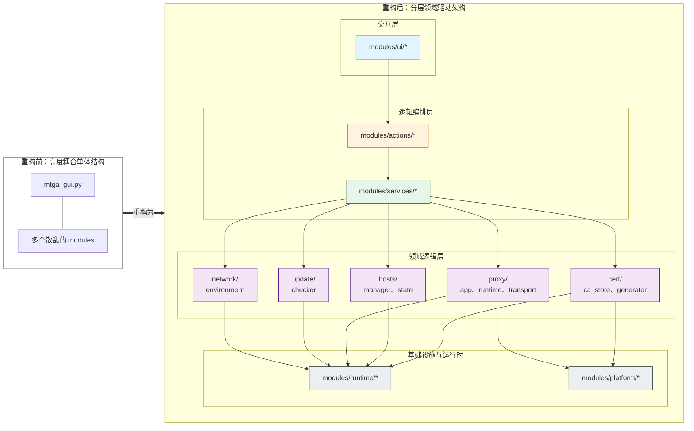
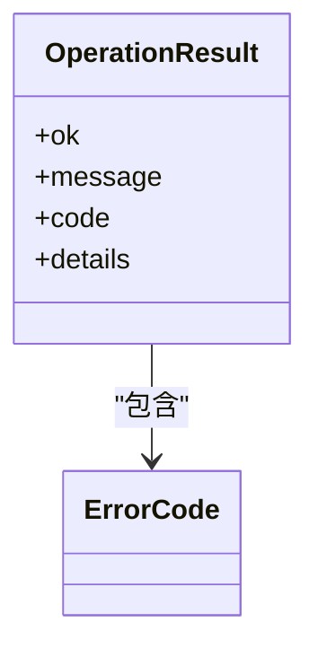

# 分层架构

<cite>
**本文档中引用的文件**   
- [ARCHITECTURE.md](file://docs/ARCHITECTURE.md)
- [cert_actions.py](file://modules/actions/cert_actions.py)
- [cert_service.py](file://modules/services/cert_service.py)
- [cert_generator.py](file://modules/cert/cert_generator.py)
- [main_window_builder.py](file://modules/ui/main_window_builder.py)
- [error_codes.py](file://modules/runtime/error_codes.py)
- [mtga_gui.py](file://mtga_gui.py)
- [__init__.py](file://modules/__init__.py)
- [actions/__init__.py](file://modules/actions/__init__.py)
- [services/__init__.py](file://modules/services/__init__.py)
- [ui/__init__.py](file://modules/ui/__init__.py)
- [cert/__init__.py](file://modules/cert/__init__.py)
- [hosts/__init__.py](file://modules/hosts/__init__.py)
- [proxy/__init__.py](file://modules/proxy/__init__.py)
- [runtime/__init__.py](file://modules/runtime/__init__.py)
- [platform/__init__.py](file://modules/platform/__init__.py)
</cite>

## 目录
1. [简介](#简介)
2. [分层架构设计](#分层架构设计)
3. [各层职责划分](#各层职责划分)
4. [依赖方向约束](#依赖方向约束)
5. [UI层设计原则](#ui层设计原则)
6. [跨平台兼容性与扩展性](#跨平台兼容性与扩展性)
7. [错误处理机制](#错误处理机制)
8. [架构优势总结](#架构优势总结)

## 简介

ModelRelay项目采用严格的分层架构设计，旨在实现关注点分离和提升代码可维护性。该架构通过明确定义各层的职责和依赖方向，确保系统组件之间的松耦合。项目遵循"UI -> actions -> services -> 领域模块 -> runtime/platform"的单向依赖原则，有效避免了模块间的循环依赖和紧耦合问题。

**Section sources**
- [ARCHITECTURE.md](file://docs/ARCHITECTURE.md#L1-L250)
- [README.md](file://README.md#L283-L291)

## 分层架构设计

ModelRelay的分层架构将系统划分为五个主要层次：UI层、Actions层、Services层、领域模块层和基础设施层。这种分层模式确保了每个层次只关注特定的职责范围，同时通过严格的依赖规则维持架构的清晰性。

**Diagram sources **
- [ARCHITECTURE.md](file://docs/ARCHITECTURE.md#L16-L82)

**Section sources**
- [ARCHITECTURE.md](file://docs/ARCHITECTURE.md#L1-L82)

## 各层职责划分

### UI层

UI层负责用户界面的构建和展示，包括窗口布局、控件创建和用户交互响应。该层不包含任何业务逻辑，仅通过预定义的接口与上层Actions进行通信。UI层的主要职责包括界面元素的初始化、用户输入的捕获和界面状态的更新。

**Section sources**
- [ui/__init__.py](file://modules/ui/__init__.py#L1-L4)
- [main_window_builder.py](file://modules/ui/main_window_builder.py#L1-L208)

### Actions层

Actions层作为UI层与Services层之间的桥梁，负责编排和调度具体的业务操作。该层处理UI事件，调用相应的服务方法，并管理异步任务的执行。Actions层还负责将服务层返回的结果转换为UI可理解的格式，并更新界面状态。

**Section sources**
- [actions/__init__.py](file://modules/actions/__init__.py#L1-L4)
- [cert_actions.py](file://modules/actions/cert_actions.py#L1-L66)

### Services层

Services层包含与UI解耦的业务逻辑，定义了系统的副作用边界。该层负责协调多个领域模块的操作，实现复杂的业务流程。Services层提供稳定的接口供Actions层调用，同时封装了底层领域模块的实现细节，为上层提供了抽象的服务接口。

**Section sources**
- [services/__init__.py](file://modules/services/__init__.py#L1-L4)
- [cert_service.py](file://modules/services/cert_service.py#L1-L38)

### 领域模块层

领域模块层包含系统的核心业务逻辑，分为cert、hosts、proxy、network和update等模块。每个领域模块专注于特定的业务领域，如证书管理、主机文件操作、代理服务等。这些模块实现了具体的业务规则和数据处理逻辑，是系统功能的核心组成部分。

**Section sources**
- [cert/__init__.py](file://modules/cert/__init__.py#L1-L3)
- [hosts/__init__.py](file://modules/hosts/__init__.py#L1-L3)
- [proxy/__init__.py](file://modules/proxy/__init__.py#L1-L3)

### 基础设施层

基础设施层包含运行时支持和平台相关逻辑，分为runtime和platform两个子层。runtime层提供通用的运行时服务，如资源管理、进程控制和错误处理。platform层则封装了操作系统特定的功能，如权限管理、系统调用等，确保上层代码的跨平台兼容性。

**Section sources**
- [runtime/__init__.py](file://modules/runtime/__init__.py#L1-L3)
- [platform/__init__.py](file://modules/platform/__init__.py#L1-L3)

## 依赖方向约束

本架构严格遵循单向依赖原则，即上层可以调用下层，但下层绝不能反向依赖上层。这种依赖方向的严格约束确保了系统的可维护性和可测试性。

### 依赖规则

- UI层只能通过Actions层与业务逻辑交互，不得直接import领域模块
- Actions层负责编排Services层的操作，作为逻辑编排层
- Services层定义副作用边界，协调领域模块的调用
- 领域模块层依赖runtime和platform基础设施
- 平台相关逻辑必须放在modules/platform或显式的平台子模块中

### 违反约束的后果

违反依赖约束将导致严重的架构问题：
- **紧耦合**：各组件之间形成复杂的依赖关系，难以独立修改和测试
- **可维护性下降**：一处修改可能引发多处连锁反应，增加维护成本
- **测试困难**：无法对单个组件进行隔离测试，需要复杂的测试环境
- **复用性降低**：组件被特定上下文绑定，难以在其他场景中复用

**Section sources**
- [ARCHITECTURE.md](file://docs/ARCHITECTURE.md#L8-L13)
- [README.md](file://README.md#L287-L290)

## UI层设计原则

UI层的设计遵循严格的原则，确保界面逻辑与业务逻辑的完全分离：

### 仅通过Actions和服务接口交互

UI层不直接引用领域模块，所有业务操作都通过Actions层提供的接口进行。这种设计确保了UI层的纯粹性，使其只关注用户界面的展示和交互，而不涉及任何业务规则的实现。

### 依赖注入模式

通过依赖注入的方式，将服务和动作的实例传递给UI组件。这种方式不仅提高了代码的可测试性，还使得组件之间的依赖关系更加清晰和可控。

### 关注点分离

UI层严格区分了界面构建、事件处理和状态管理三个关注点。界面构建负责创建和布局控件，事件处理负责响应用户操作，状态管理负责维护界面的当前状态。

**Section sources**
- [main_window_builder.py](file://modules/ui/main_window_builder.py#L1-L208)
- [ARCHITECTURE.md](file://docs/ARCHITECTURE.md#L10-L11)

## 跨平台兼容性与扩展性

### 跨平台兼容性

通过将平台相关逻辑隔离在platform模块中，系统实现了良好的跨平台兼容性。无论是Windows还是macOS，上层代码都可以通过统一的接口访问平台特定功能，而无需关心底层实现的差异。

### 未来功能扩展

分层架构为系统的功能扩展提供了坚实的基础：
- **新增领域模块**：可以轻松添加新的业务领域，如数据库管理、文件同步等
- **替换实现**：可以在不影响上层的情况下，替换特定模块的实现
- **功能增强**：可以在不改变接口的情况下，增强现有功能的实现

这种架构设计使得系统能够灵活应对未来的需求变化，支持持续的功能演进。

**Section sources**
- [platform/__init__.py](file://modules/platform/__init__.py#L1-L3)
- [ARCHITECTURE.md](file://docs/ARCHITECTURE.md#L12-L13)

## 错误处理机制

系统采用统一的错误处理机制，确保错误信息的一致性和可追溯性。

### OperationResult模式

在service/action边界使用OperationResult对象传递操作结果。该对象包含以下字段：
- `ok`：布尔值，表示操作是否成功
- `message`：人类可读的结果摘要
- `code`：ErrorCode枚举值，用于程序化处理
- `details`：结构化的上下文载荷

### 错误码定义

系统定义了标准化的错误码，避免语义漂移。核心错误码包括：
- `NETWORK_ERROR`：网络相关错误
- `REMOTE_ERROR`：远程服务错误
- `CONFIG_INVALID`：配置无效
- `PERMISSION_DENIED`：权限不足
- `PORT_IN_USE`：端口被占用

**Diagram sources **
- [ARCHITECTURE.md](file://docs/ARCHITECTURE.md#L204-L209)
- [error_codes.py](file://modules/runtime/error_codes.py#L1-L20)

**Section sources**
- [ARCHITECTURE.md](file://docs/ARCHITECTURE.md#L202-L236)
- [error_codes.py](file://modules/runtime/error_codes.py#L1-L20)

## 架构优势总结

ModelRelay的分层架构设计带来了显著的优势：

### 关注点分离

通过明确的层次划分，每个组件只关注特定的职责范围，降低了系统的整体复杂性。

### 可维护性提升

单向依赖和清晰的接口定义使得代码更易于理解和维护，减少了修改带来的副作用。

### 可测试性增强

各层之间的松耦合使得单元测试和集成测试更加容易实施，提高了代码质量。

### 扩展性良好

模块化的设计支持系统的持续演进，新功能可以无缝集成到现有架构中。

### 跨平台支持

平台相关逻辑的隔离确保了系统在不同操作系统上的兼容性和一致性。

**Section sources**
- [ARCHITECTURE.md](file://docs/ARCHITECTURE.md#L1-L250)
- [README.md](file://README.md#L283-L291)