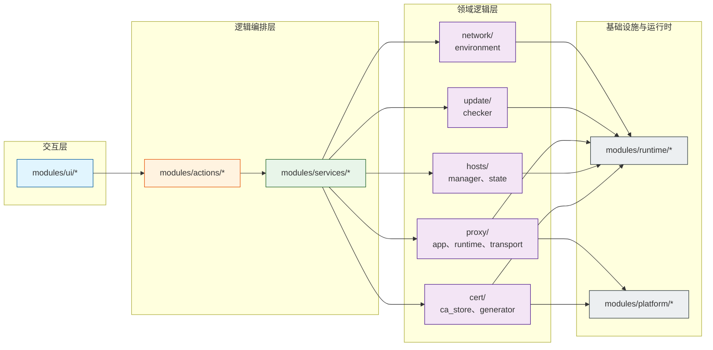
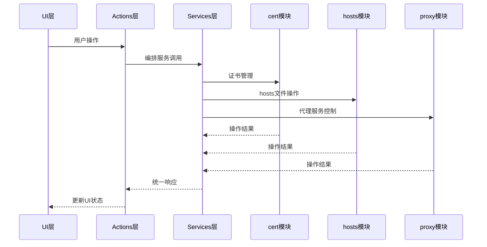
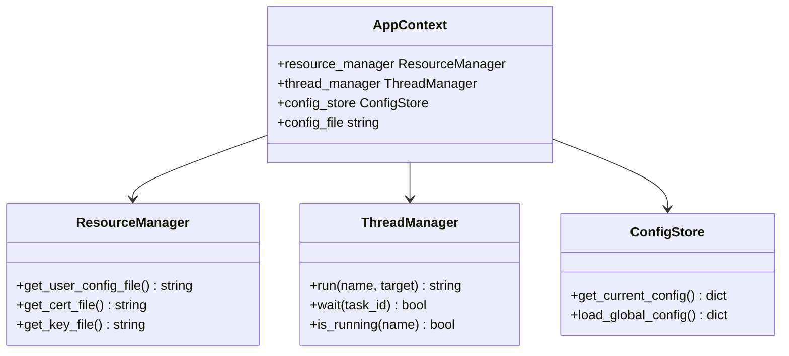
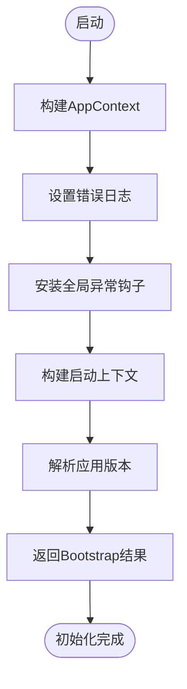
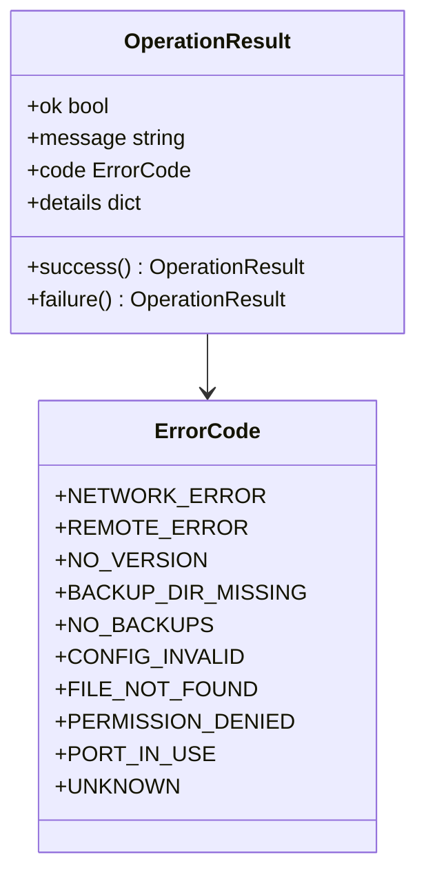
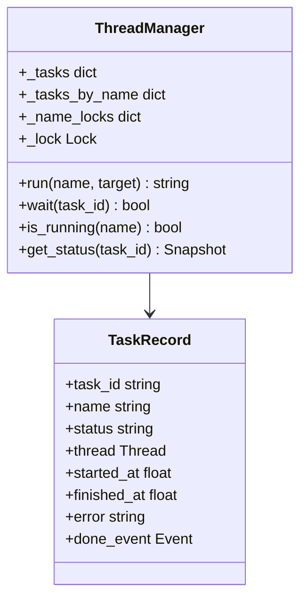

# 技术架构

<cite>
**本文档引用的文件**   
- [ARCHITECTURE.md](file://docs/ARCHITECTURE.md)
- [app_bootstrap.py](file://modules/services/app_bootstrap.py)
- [bootstrap.py](file://modules/services/bootstrap.py)
- [operation_result.py](file://modules/runtime/operation_result.py)
- [mtga_gui.py](file://mtga_gui.py)
- [main_window_builder.py](file://modules/ui/main_window_builder.py)
- [cert_actions.py](file://modules/actions/cert_actions.py)
- [proxy_ui_coordinator.py](file://modules/actions/proxy_ui_coordinator.py)
- [ca_store.py](file://modules/cert/ca_store.py)
- [hosts_manager.py](file://modules/hosts/hosts_manager.py)
- [proxy_runtime.py](file://modules/proxy/proxy_runtime.py)
- [proxy_app.py](file://modules/proxy/proxy_app.py)
</cite>

## 目录
1. [系统上下文与分层架构](#系统上下文与分层架构)
2. [组件交互与数据流](#组件交互与数据流)
3. AppContext 全局状态管理器
4. Bootstrap 引导流程
5. OperationResult 统一结果封装
6. 依赖倒置与服务抽象
7. 单例模式与线程安全
8. 设计决策分析

## 系统上下文与分层架构

**图示来源**
- [ARCHITECTURE.md](file://docs/ARCHITECTURE.md)

该架构遵循严格的分层设计原则，确保各层之间的依赖关系清晰且单向。UI层仅通过Actions和Services层访问业务能力，不直接导入领域模块，从而实现了关注点分离和模块化。

## 组件交互与数据流

**图示来源**
- [main_window_builder.py](file://modules/ui/main_window_builder.py)
- [cert_actions.py](file://modules/actions/cert_actions.py)
- [proxy_ui_coordinator.py](file://modules/actions/proxy_ui_coordinator.py)

数据流和控制流从UI层开始，经由Actions层编排，通过Services层的副作用边界，最终到达具体的领域模块。这种设计确保了UI层的纯粹性，使其仅负责用户交互，而将所有业务逻辑和系统操作委托给下层处理。

**Section sources**
- [ARCHITECTURE.md](file://docs/ARCHITECTURE.md)
- [main_window_builder.py](file://modules/ui/main_window_builder.py)

## AppContext 全局状态管理器

AppContext是应用的核心状态容器，采用单例模式实现，贯穿整个应用生命周期。它封装了应用运行所需的关键基础设施服务，包括资源管理器、线程管理器和配置存储。

**图示来源**
- [bootstrap.py](file://modules/services/bootstrap.py)
- [operation_result.py](file://modules/runtime/operation_result.py)

AppContext通过`build_app_context()`函数创建，确保了全局状态的一致性和唯一性。所有需要访问这些基础设施服务的组件都通过依赖注入获得AppContext实例，而不是直接创建或访问全局变量。

**Section sources**
- [bootstrap.py](file://modules/services/bootstrap.py)
- [app_bootstrap.py](file://modules/services/app_bootstrap.py)

## Bootstrap 引导流程

应用的引导流程是一个精心编排的初始化序列，确保所有依赖项在应用启动前正确就绪。该流程由`build_app_bootstrap()`函数驱动，执行以下关键步骤：

1. **构建应用上下文**：创建AppContext实例，初始化所有基础设施服务
2. **设置错误日志**：配置错误日志记录，确保异常可追踪
3. **安装全局异常钩子**：捕获未处理的异常，防止应用崩溃
4. **构建启动上下文**：执行环境预检，收集系统状态报告
5. **解析应用版本**：确定当前应用版本信息

**图示来源**
- [app_bootstrap.py](file://modules/services/app_bootstrap.py)
- [startup_context.py](file://modules/services/startup_context.py)

引导流程的输出是`AppBootstrapResult`对象，它包含了应用运行所需的所有初始化信息，这些信息随后被注入到UI层，作为构建主窗口的依赖项。

**Section sources**
- [app_bootstrap.py](file://modules/services/app_bootstrap.py)
- [startup_context.py](file://modules/services/startup_context.py)

## OperationResult 统一结果封装

OperationResult是应用的统一结果封装模式，用于标准化所有服务和操作的返回值。该模式极大地简化了错误处理，使调用方能够以一致的方式处理成功和失败情况。

**图示来源**
- [operation_result.py](file://modules/runtime/operation_result.py)
- [ca_store.py](file://modules/cert/ca_store.py)

OperationResult包含四个关键字段：
- `ok`：布尔值，指示操作是否成功
- `message`：人类可读的结果摘要
- `code`：ErrorCode枚举值，提供标准化的错误分类
- `details`：结构化的上下文载荷，包含错误详情

这种封装模式在service/action边界使用，确保了错误语义的一致性，避免了错误信息的漂移。

**Section sources**
- [operation_result.py](file://modules/runtime/operation_result.py)
- [cert_service.py](file://modules/services/cert_service.py)

## 依赖倒置与服务抽象

应用严格遵循依赖倒置原则，高层模块（如UI）依赖于抽象的服务接口，而不是具体的实现。这种设计通过依赖注入实现，确保了模块间的松耦合。

在`main_window_builder.py`中，主窗口的构建函数`build_main_window(deps: MainWindowDeps)`接受一个包含所有依赖项的`MainWindowDeps`数据类。这些依赖项包括：
- 服务函数引用（如`modify_hosts_file`, `generate_certificates`）
- 状态管理器（如`thread_manager`, `config_store`）
- 回调函数（如`log_error`, `check_environment`）

这种依赖注入模式使得UI层完全不知道具体实现细节，只知道它需要哪些抽象能力。具体的实现由Services层提供，并在应用启动时注入到UI层。

**Section sources**
- [main_window_builder.py](file://modules/ui/main_window_builder.py)
- [proxy_ui_coordinator.py](file://modules/actions/proxy_ui_coordinator.py)

## 单例模式与线程安全

应用在多个关键组件中使用了单例模式，确保全局状态的一致性和资源的高效利用。最典型的例子是`ThreadManager`，它集中管理所有后台线程任务。

`ThreadManager`通过内部锁机制确保线程安全，提供了以下关键功能：
- `run()`：启动后台任务，返回任务ID
- `wait()`：等待指定任务完成
- `is_running()`：检查任务是否仍在运行
- `get_status()`：查询任务状态

**图示来源**
- [thread_manager.py](file://modules/runtime/thread_manager.py)
- [proxy_runtime.py](file://modules/proxy/proxy_runtime.py)

`ThreadManager`的单例实例通过AppContext全局共享，确保了所有模块使用同一个线程管理器，避免了线程资源的重复创建和状态混乱。

**Section sources**
- [thread_manager.py](file://modules/runtime/thread_manager.py)
- [proxy_runtime.py](file://modules/proxy/proxy_runtime.py)

## 设计决策分析

### 为何采用tkinter而非现代前端框架

根据`ARCHITECTURE.md`中的设计思想，选择tkinter主要基于以下考虑：
1. **轻量级和原生集成**：tkinter是Python标准库的一部分，无需额外依赖，能够与系统深度集成
2. **跨平台一致性**：在Windows、macOS和Linux上提供一致的用户体验
3. **启动速度快**：相比Electron等框架，启动时间几乎可以忽略不计
4. **资源占用低**：内存和CPU占用远低于基于浏览器的解决方案
5. **简化分发**：可以轻松打包为单文件可执行程序，降低用户使用门槛

### 为何选择本地代理而非API网关模式

选择本地代理模式而非API网关模式的主要原因包括：
1. **隐私保护**：所有流量都在本地处理，不经过第三方服务器，确保用户数据安全
2. **性能优化**：本地代理减少了网络跳数，降低了延迟
3. **离线能力**：即使在没有互联网连接的情况下，代理服务也能正常运行
4. **简化架构**：避免了复杂的分布式系统运维，降低了开发和维护成本
5. **直接控制**：能够精确控制证书、hosts文件和网络流量，提供更可靠的代理服务

这些设计决策共同构成了ModelRelay的核心竞争力，使其成为一个轻量、安全、高效的本地代理解决方案。

**Section sources**
- [ARCHITECTURE.md](file://docs/ARCHITECTURE.md)
- [mtga_gui.py](file://mtga_gui.py)