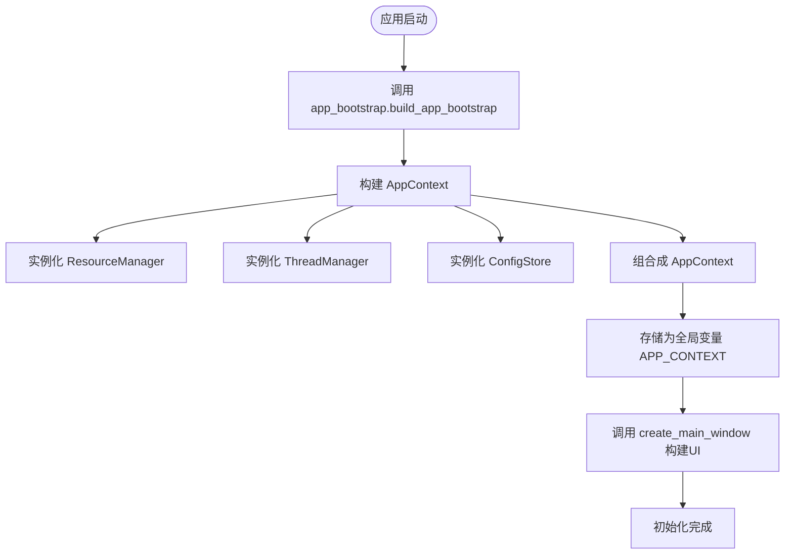
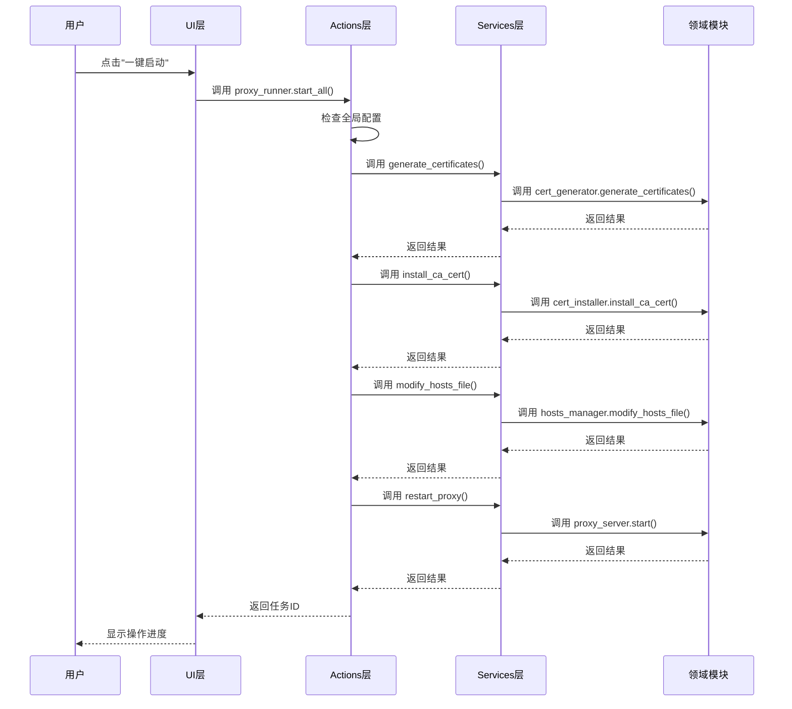
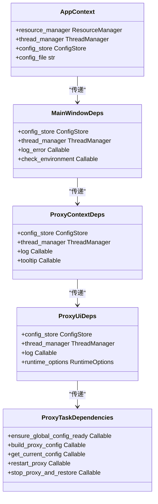
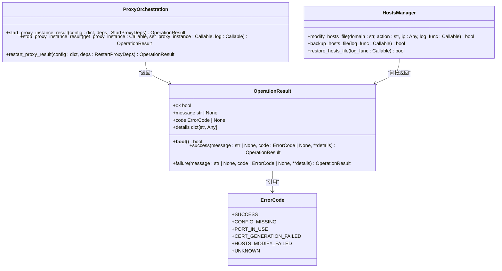

# 数据流与控制流

<cite>
**本文档引用的文件**  
- [mtga_gui.py](file://mtga_gui.py)
- [modules/actions/proxy_actions.py](file://modules/actions/proxy_actions.py)
- [modules/services/app_bootstrap.py](file://modules/services/app_bootstrap.py)
- [modules/services/bootstrap.py](file://modules/services/bootstrap.py)
- [modules/services/proxy_orchestration.py](file://modules/services/proxy_orchestration.py)
- [modules/ui/main_window_builder.py](file://modules/ui/main_window_builder.py)
- [modules/ui/proxy_context.py](file://modules/ui/proxy_context.py)
- [modules/proxy/proxy_server.py](file://modules/proxy/proxy_server.py)
- [modules/hosts/hosts_manager.py](file://modules/hosts/hosts_manager.py)
- [modules/cert/cert_generator.py](file://modules/cert/cert_generator.py)
- [modules/runtime/operation_result.py](file://modules/runtime/operation_result.py)
- [modules/runtime/resource_manager.py](file://modules/runtime/resource_manager.py)
</cite>

## 目录
1. [应用初始化与数据准备](#应用初始化与数据准备)  
2. [用户操作事件流](#用户操作事件流)  
3. [AppContext上下文传递机制](#appcontext上下文传递机制)  
4. [典型请求数据流向](#典型请求数据流向)  
5. [OperationResult关键中间对象](#operationresult关键中间对象)

## 应用初始化与数据准备

ModelRelay应用的初始化流程始于`mtga_gui.py`文件的执行。该流程通过`create_main_window`函数和`bootstrap`机制完成应用上下文的构建与数据准备。

在`mtga_gui.py`中，首先通过`app_bootstrap.build_app_bootstrap`函数构建应用启动上下文。该函数接收项目根目录和获取用户数据目录的函数作为参数，返回一个包含`AppContext`、应用元数据、版本信息等的`AppBootstrapResult`对象。`AppContext`是贯穿整个应用的核心上下文对象，封装了资源管理器、线程管理器和配置存储等关键组件。

`AppContext`的创建由`modules/services/bootstrap.py`中的`build_app_context`函数完成。该函数实例化`ResourceManager`、`ThreadManager`和`ConfigStore`，并将它们组合成不可变的`AppContext`数据类。`ResourceManager`负责管理程序资源目录和用户数据目录，确保在开发环境和打包环境中都能正确访问资源文件。

初始化流程中，`mtga_gui.py`将`BOOTSTRAP.app_context`赋值给`APP_CONTEXT`全局变量，使其在后续的UI构建和业务逻辑中可被访问。同时，`resource_manager`和`thread_manager`也被提取为全局变量，便于在应用各层之间传递。



**图示来源**  
- [mtga_gui.py](file://mtga_gui.py#L70-L82)
- [modules/services/app_bootstrap.py](file://modules/services/app_bootstrap.py#L19-L38)
- [modules/services/bootstrap.py](file://modules/services/bootstrap.py#L18-L29)

**本节来源**  
- [mtga_gui.py](file://mtga_gui.py#L70-L82)
- [modules/services/app_bootstrap.py](file://modules/services/app_bootstrap.py#L19-L38)

## 用户操作事件流

当用户在UI界面上执行操作（如点击"启动代理"按钮）时，事件通过清晰的层次结构从UI层传递到Actions层，再由Actions调用Services进行业务逻辑处理。

在`modules/ui/main_window_builder.py`中，`build_main_window`函数构建主窗口界面。该函数接收`MainWindowDeps`依赖对象，其中包含了从`AppContext`传递下来的各种服务和工具。当用户点击"一键启动"按钮时，事件触发`footer_actions.build_footer_actions`中绑定的`proxy_runner.start_all`方法。

`proxy_runner`是`modules/actions/proxy_actions.py`中定义的`ProxyTaskRunner`类的实例。该类的`start_all`方法作为Actions层的核心，协调多个业务操作。它首先检查全局配置是否就绪，然后按顺序执行证书生成、CA证书安装、hosts文件修改和代理服务器启动等操作。

每个操作都通过`deps`参数调用相应的服务函数。例如，`self._deps.generate_certificates`调用证书生成服务，`self._deps.install_ca_cert`调用CA证书安装服务，`self._deps.modify_hosts_file`调用hosts文件修改服务，最后`self._deps.restart_proxy`调用代理服务器重启服务。



**图示来源**  
- [modules/ui/main_window_builder.py](file://modules/ui/main_window_builder.py#L184-L189)
- [modules/actions/proxy_actions.py](file://modules/actions/proxy_actions.py#L69-L129)
- [modules/services/proxy_orchestration.py](file://modules/services/proxy_orchestration.py#L94-L107)

**本节来源**  
- [modules/ui/main_window_builder.py](file://modules/ui/main_window_builder.py#L184-L189)
- [modules/actions/proxy_actions.py](file://modules/actions/proxy_actions.py#L69-L129)

## AppContext上下文传递机制

`AppContext`是ModelRelay架构中的核心全局上下文对象，负责在各层之间传递配置、资源管理器和线程管理器。该对象通过依赖注入的方式，从应用初始化阶段开始，逐层向下传递。

在`mtga_gui.py`中，`BOOTSTRAP.app_context`被提取为`APP_CONTEXT`全局变量。当调用`create_main_window`时，`APP_CONTEXT`作为`main_window_deps.build_main_window_deps`的输入参数之一，被封装到`MainWindowDepsInputs`中。

在`modules/ui/main_window_builder.py`中，`build_main_window`函数接收`MainWindowDeps`对象，其中包含了`app_context`字段。该函数进一步将`app_context.config_store`和`app_context.thread_manager`传递给各个UI组件的构建函数。例如，在构建`proxy_context`时，`app_context.config_store`和`app_context.thread_manager`被作为依赖项传递。

`proxy_context.build_proxy_context`函数接收`ProxyContextDeps`对象，其中包含了`config_store`和`thread_manager`。该函数创建`ProxyUiCoordinator`实例时，将这些依赖项传递给其构造函数。`ProxyUiCoordinator`又将这些依赖项传递给`ProxyTaskRunner`，从而实现了`AppContext`中关键组件的逐层传递。

这种依赖注入模式确保了各层组件之间的松耦合，同时保证了配置、资源和线程管理的一致性。`AppContext`的不可变性（通过`dataclass(frozen=True)`实现）也确保了上下文对象在传递过程中的安全性。



**图示来源**  
- [modules/services/bootstrap.py](file://modules/services/bootstrap.py#L11-L16)
- [modules/ui/main_window_builder.py](file://modules/ui/main_window_builder.py#L31-L57)
- [modules/ui/proxy_context.py](file://modules/ui/proxy_context.py#L14-L28)
- [modules/actions/proxy_ui_coordinator.py](file://modules/actions/proxy_ui_coordinator.py#L10-L25)

**本节来源**  
- [modules/services/bootstrap.py](file://modules/services/bootstrap.py#L11-L16)
- [modules/ui/main_window_builder.py](file://modules/ui/main_window_builder.py#L31-L57)
- [modules/ui/proxy_context.py](file://modules/ui/proxy_context.py#L14-L28)

## 典型请求数据流向

以"一键启动代理"操作为例，分析从用户点击按钮到代理服务器成功启动的完整数据流向。该流程涉及UI层、Actions层、Services层和领域模块的协同工作。

当用户点击"一键启动"按钮时，UI层的`footer_actions.build_footer_actions`触发`proxy_runner.start_all`方法。该方法在`modules/actions/proxy_actions.py`中定义，作为Actions层的协调者，按顺序调用多个服务。

首先，`start_all`方法调用`self._deps.ensure_global_config_ready()`检查全局配置是否完整。如果配置缺失，操作立即终止。然后，方法进入证书处理阶段：调用`self._deps.has_existing_ca_cert()`检查系统是否已存在CA证书，如果不存在，则调用`self._deps.generate_certificates()`生成证书，并调用`self._deps.install_ca_cert()`安装CA证书。

接下来，方法调用`self._deps.modify_hosts_file()`修改hosts文件。该调用最终会执行`modules/hosts/hosts_manager.py`中的`modify_hosts_file`函数，添加或更新指定域名的IP映射。如果修改失败，操作终止。

最后，方法调用`self._deps.restart_proxy()`重启代理服务器。该调用会触发`modules/services/proxy_orchestration.py`中的`restart_proxy`函数，该函数先停止可能存在的旧代理实例，然后调用`start_proxy_instance`启动新实例。`start_proxy_instance`会创建`ProxyServer`对象并调用其`start`方法。

`ProxyServer`位于`modules/proxy/proxy_server.py`，是领域模块的入口。它负责装配`ProxyApp`（领域逻辑）和`ProxyRuntime`（运行时）。当`start`方法被调用时，`ProxyServer`验证配置有效性，然后委托`ProxyRuntime`启动Flask服务器。

```mermaid
flowchart TD
A[用户点击"一键启动"] --> B[调用 proxy_runner.start_all]
B --> C{检查全局配置}
C --> |配置完整| D[检查现有CA证书]
C --> |配置缺失| E[终止操作]
D --> |存在| F[跳过证书生成]
D --> |不存在| G[生成CA证书]
G --> H[安装CA证书]
H --> I[修改hosts文件]
F --> I
I --> |修改成功| J[重启代理服务器]
I --> |修改失败| K[终止操作]
J --> L[停止旧代理实例]
L --> M[启动新代理实例]
M --> N[创建ProxyServer]
N --> O[验证配置]
O --> |有效| P[启动Flask服务器]
O --> |无效| Q[返回失败]
P --> R[代理启动成功]
```

**图示来源**  
- [modules/actions/proxy_actions.py](file://modules/actions/proxy_actions.py#L69-L129)
- [modules/services/proxy_orchestration.py](file://modules/services/proxy_orchestration.py#L70-L107)
- [modules/proxy/proxy_server.py](file://modules/proxy/proxy_server.py#L35-L47)
- [modules/hosts/hosts_manager.py](file://modules/hosts/hosts_manager.py#L459-L492)

**本节来源**  
- [modules/actions/proxy_actions.py](file://modules/actions/proxy_actions.py#L69-L129)
- [modules/services/proxy_orchestration.py](file://modules/services/proxy_orchestration.py#L70-L107)

## OperationResult关键中间对象

`OperationResult`是ModelRelay中用于表示操作结果的关键中间对象，定义在`modules/runtime/operation_result.py`中。该对象采用不可变数据类实现，包含操作状态、消息、错误码和详细信息等字段。

`OperationResult`类包含四个主要字段：`ok`（布尔值，表示操作是否成功）、`message`（可选字符串，描述操作结果）、`code`（可选`ErrorCode`枚举值，表示错误类型）和`details`（字典，包含额外的详细信息）。该类提供了`success`和`failure`两个类方法，用于创建成功和失败的结果实例。

在业务逻辑中，`OperationResult`被广泛用于服务层和领域模块之间的通信。例如，`modules/hosts/hosts_manager.py`中的`modify_hosts_file`函数返回`bool`值，而`modules/services/proxy_orchestration.py`中的`start_proxy_instance_result`函数返回`OperationResult`对象。这种设计使得调用方可以获取更丰富的操作结果信息。

`OperationResult`的`__bool__`方法被重载，使得可以像布尔值一样使用该对象。这使得在条件判断中可以直接使用`if result:`来检查操作是否成功，提高了代码的可读性。

在错误处理方面，`OperationResult`与`modules/runtime/error_codes.py`中的`ErrorCode`枚举配合使用。当操作失败时，可以返回包含具体错误码的结果，便于调用方进行针对性的错误处理。例如，端口被占用时返回`ErrorCode.PORT_IN_USE`，配置缺失时返回`ErrorCode.CONFIG_MISSING`。



**图示来源**  
- [modules/runtime/operation_result.py](file://modules/runtime/operation_result.py#L9-L38)
- [modules/services/proxy_orchestration.py](file://modules/services/proxy_orchestration.py#L110-L184)
- [modules/hosts/hosts_manager.py](file://modules/hosts/hosts_manager.py#L459-L492)

**本节来源**  
- [modules/runtime/operation_result.py](file://modules/runtime/operation_result.py#L9-L38)
- [modules/services/proxy_orchestration.py](file://modules/services/proxy_orchestration.py#L110-L184)