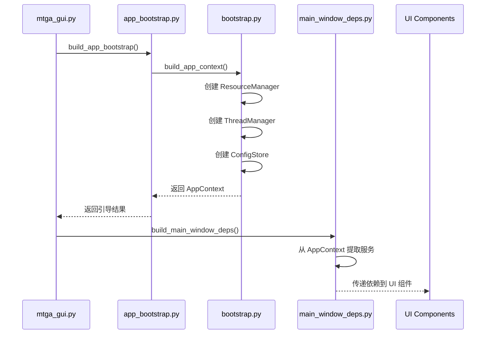
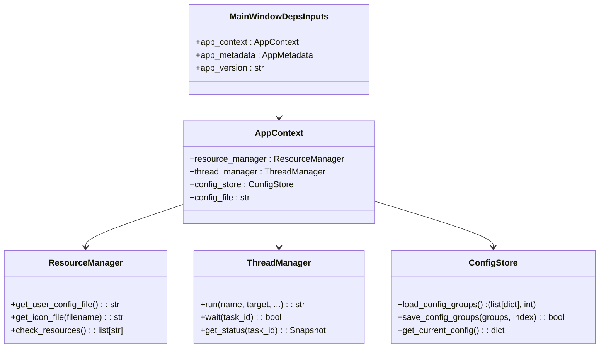
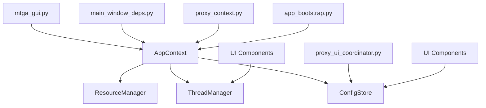

# AppContext 全局状态管理

<cite>
**本文档引用的文件**
- [bootstrap.py](file://modules/services/bootstrap.py)
- [mtga_gui.py](file://mtga_gui.py)
- [resource_manager.py](file://modules/runtime/resource_manager.py)
- [thread_manager.py](file://modules/runtime/thread_manager.py)
- [config_service.py](file://modules/services/config_service.py)
- [main_window_deps.py](file://modules/ui/main_window_deps.py)
- [app_bootstrap.py](file://modules/services/app_bootstrap.py)
- [proxy_context.py](file://modules/ui/proxy_context.py)
- [proxy_ui_coordinator.py](file://modules/actions/proxy_ui_coordinator.py)
</cite>

## 目录
1. [简介](#简介)
2. [AppContext 数据结构](#appcontext-数据结构)
3. [构建过程与依赖注入](#构建过程与依赖注入)
4. [核心服务组件](#核心服务组件)
5. [在UI组件中的传递与使用](#在ui组件中的传递与使用)
6. [架构优势与设计模式](#架构优势与设计模式)
7. [依赖关系图](#依赖关系图)

## 简介
AppContext 是 ModelRelay 架构中的核心不可变数据类，作为全局依赖容器在应用生命周期内安全地共享 ResourceManager、ThreadManager 和 ConfigStore 等核心服务实例。该设计模式避免了全局变量的滥用，提升了代码的可测试性，并确保了资源管理的一致性。通过 `bootstrap.py` 中的 `build_app_context()` 函数实现构建过程与依赖注入机制，并通过 `mtga_gui.py` 中的实际引用展示其在 UI 和其他组件间的传递，实现了松耦合的设计架构。

## AppContext 数据结构
AppContext 是一个使用 `@dataclass(frozen=True)` 装饰的不可变数据类，确保了其在应用生命周期内的状态一致性。它包含以下核心属性：

- **resource_manager**: `ResourceManager` 实例，用于管理程序资源和用户数据路径
- **thread_manager**: `ThreadManager` 实例，用于集中管理后台线程任务
- **config_store**: `ConfigStore` 实例，用于持久化存储和访问配置数据
- **config_file**: 配置文件的路径字符串

由于其不可变性（frozen=True），一旦 AppContext 被创建，其所有属性都不能被修改，这保证了全局状态的一致性和线程安全性。

**Section sources**
- [bootstrap.py](file://modules/services/bootstrap.py#L10-L16)

## 构建过程与依赖注入
AppContext 的构建过程由 `bootstrap.py` 文件中的 `build_app_context()` 函数负责。该函数遵循依赖注入原则，按顺序创建并组合各个核心服务实例，最终返回一个完整的 AppContext 对象。

构建过程如下：
1. 首先创建 `ResourceManager` 实例，用于处理资源路径管理
2. 创建 `ThreadManager` 实例，用于后台任务调度
3. 通过 `resource_manager.get_user_config_file()` 获取用户配置文件路径
4. 使用配置文件路径创建 `ConfigStore` 实例
5. 将所有创建的实例和配置文件路径注入到 AppContext 的构造函数中

这种构建方式将依赖的创建与使用分离，使得组件之间的耦合度降低，同时也便于在测试时替换依赖。

**Section sources**
- [bootstrap.py](file://modules/services/bootstrap.py#L18-L28)

## 核心服务组件
AppContext 封装了三个核心服务组件，每个组件都有明确的职责：

### ResourceManager
ResourceManager 负责管理应用的资源路径，包括程序资源目录和用户数据目录。它能够智能地检测当前是否在打包环境中运行，并相应地确定资源路径。此外，它还负责将配置模板文件复制到用户数据目录，确保应用的正常运行。

**Section sources**
- [resource_manager.py](file://modules/runtime/resource_manager.py#L201-L294)

### ThreadManager
ThreadManager 是一个统一的后台线程管理器，用于跟踪和调度 GUI 中的所有异步任务。它通过 `TaskRecord` 类来记录每个任务的运行状态（如 pending、running、finished、failed），并提供线程安全的访问接口。这避免了后台任务的重复创建和状态混乱，为 UI 提供了可靠的异步任务管理。

**Section sources**
- [thread_manager.py](file://modules/runtime/thread_manager.py#L42-L169)

### ConfigStore
ConfigStore 是一个不可变的配置存储类，负责加载和保存应用的配置数据。它使用 YAML 格式进行持久化存储，支持配置组的管理。通过将配置文件路径作为构造参数注入，ConfigStore 能够灵活地适应不同的部署环境。

**Section sources**
- [config_service.py](file://modules/services/config_service.py#L11-L81)

## 在UI组件中的传递与使用
AppContext 通过 `mtga_gui.py` 文件中的 `app_bootstrap.build_app_bootstrap()` 函数被创建，并作为依赖传递给 UI 组件，实现了松耦合的设计。

在 `mtga_gui.py` 中：
1. 首先调用 `build_app_bootstrap()` 创建包含 AppContext 的引导结果
2. 从引导结果中提取 `APP_CONTEXT`
3. 在创建主窗口时，将 `APP_CONTEXT` 作为参数传递给 `main_window_deps.build_main_window_deps()`

在 UI 组件中，AppContext 的各个服务被解构并传递给不同的功能模块：
- `resource_manager` 用于获取图标文件路径
- `thread_manager` 用于调度后台任务
- `config_store` 用于读取和保存配置

这种传递方式确保了 UI 组件不需要直接创建或管理这些核心服务，而是通过依赖注入获得，提高了代码的可维护性和可测试性。

**Diagram sources**
- [mtga_gui.py](file://mtga_gui.py#L70-L74)
- [app_bootstrap.py](file://modules/services/app_bootstrap.py#L19-L37)
- [bootstrap.py](file://modules/services/bootstrap.py#L18-L28)
- [main_window_deps.py](file://modules/ui/main_window_deps.py#L30-L57)

**Section sources**
- [mtga_gui.py](file://mtga_gui.py#L70-L109)
- [main_window_deps.py](file://modules/ui/main_window_deps.py#L30-L57)

## 架构优势与设计模式
AppContext 模式带来了多项架构优势：

### 避免全局变量滥用
通过将所有全局状态封装在 AppContext 中，避免了传统全局变量的滥用。所有组件通过依赖注入获得所需服务，而不是直接访问全局变量，这使得代码的依赖关系更加清晰。

### 提升代码可测试性
由于 AppContext 的不可变性和依赖注入机制，可以在测试时轻松地创建包含模拟（mock）服务的 AppContext，从而隔离被测组件的外部依赖。

### 确保资源管理一致性
AppContext 确保了在整个应用生命周期内，所有组件使用的是同一组核心服务实例，避免了资源的重复创建和状态不一致的问题。

### 松耦合设计
UI 组件和其他功能模块不需要知道核心服务的具体创建细节，只需要通过 AppContext 获得所需的服务。这种设计实现了组件间的松耦合，提高了代码的可维护性。

**Diagram sources**
- [bootstrap.py](file://modules/services/bootstrap.py#L10-L16)
- [resource_manager.py](file://modules/runtime/resource_manager.py#L201-L294)
- [thread_manager.py](file://modules/runtime/thread_manager.py#L42-L169)
- [config_service.py](file://modules/services/config_service.py#L11-L81)
- [main_window_deps.py](file://modules/ui/main_window_deps.py#L21-L28)

**Section sources**
- [bootstrap.py](file://modules/services/bootstrap.py#L10-L28)
- [main_window_deps.py](file://modules/ui/main_window_deps.py#L21-L28)

## 依赖关系图
以下图表展示了 AppContext 在整个架构中的依赖关系：

**Diagram sources**
- [bootstrap.py](file://modules/services/bootstrap.py#L10-L28)
- [mtga_gui.py](file://mtga_gui.py#L70-L74)
- [main_window_deps.py](file://modules/ui/main_window_deps.py#L30-L57)
- [proxy_context.py](file://modules/ui/proxy_context.py#L14-L28)
- [proxy_ui_coordinator.py](file://modules/actions/proxy_ui_coordinator.py#L13-L23)
- [app_bootstrap.py](file://modules/services/app_bootstrap.py#L19-L37)