# Bootstrap 依赖注入与初始化

<cite>
**本文档引用文件**  
- [mtga_gui.py](file://mtga_gui.py)
- [modules/services/app_bootstrap.py](file://modules/services/app_bootstrap.py)
- [modules/services/bootstrap.py](file://modules/services/bootstrap.py)
- [modules/services/startup_context.py](file://modules/services/startup_context.py)
- [modules/services/app_metadata.py](file://modules/services/app_metadata.py)
- [modules/services/app_version.py](file://modules/services/app_version.py)
- [modules/services/logging_service.py](file://modules/services/logging_service.py)
- [modules/services/startup_checks.py](file://modules/services/startup_checks.py)
- [modules/runtime/resource_manager.py](file://modules/runtime/resource_manager.py)
- [modules/runtime/thread_manager.py](file://modules/runtime/thread_manager.py)
- [modules/services/config_service.py](file://modules/services/config_service.py)
- [modules/ui/main_window_deps.py](file://modules/ui/main_window_deps.py)
- [modules/ui/main_window_builder.py](file://modules/ui/main_window_builder.py)
</cite>

## 目录
1. [引言](#引言)
2. [Bootstrap 机制概览](#bootstrap-机制概览)
3. [核心初始化对象解析](#核心初始化对象解析)
4. [build_app_bootstrap 函数执行流程](#build_app_bootstrap-函数执行流程)
5. [启动上下文构建与环境检查](#启动上下文构建与环境检查)
6. [AppContext 依赖注入体系](#appcontext-依赖注入体系)
7. [Bootstrap 在 GUI 启动中的作用](#bootstrap-在-gui-启动中的作用)
8. [关注点分离设计原则](#关注点分离设计原则)
9. [错误处理与日志机制](#错误处理与日志机制)
10. [总结](#总结)

## 引言

Bootstrap 机制是本应用启动过程中的核心初始化框架，负责协调项目根路径、用户数据目录等关键参数，逐步构建应用运行所需的上下文环境。该机制通过 `build_app_bootstrap()` 函数实现依赖注入与初始化，将复杂的启动逻辑从主入口移出，显著提升了代码的可维护性与可调试性。本文档将深入解析 Bootstrap 机制如何构建 `AppContext`、`AppMetadata`、`StartupContext` 等初始化对象，并阐述其在 `mtga_gui.py` 启动流程中的关键作用。

## Bootstrap 机制概览

Bootstrap 机制采用分层初始化策略，通过一系列服务模块协同工作，确保应用在启动阶段能够正确配置运行环境。该机制的核心是 `build_app_bootstrap()` 函数，它作为应用装配的起点，协调多个初始化步骤，包括配置加载、环境检查和依赖实例化。

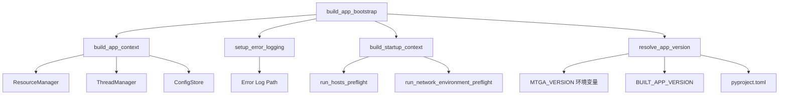

**图示来源**
- [modules/services/app_bootstrap.py](file://modules/services/app_bootstrap.py#L19-L37)
- [modules/services/bootstrap.py](file://modules/services/bootstrap.py#L18-L28)
- [modules/services/startup_context.py](file://modules/services/startup_context.py#L30-L34)
- [modules/services/app_version.py](file://modules/services/app_version.py#L12-L52)

## 核心初始化对象解析

Bootstrap 机制构建了多个核心初始化对象，这些对象共同构成了应用的运行时上下文。

### AppBootstrapResult 数据结构

`AppBootstrapResult` 是 `build_app_bootstrap()` 函数的返回值，封装了所有初始化完成的上下文对象：

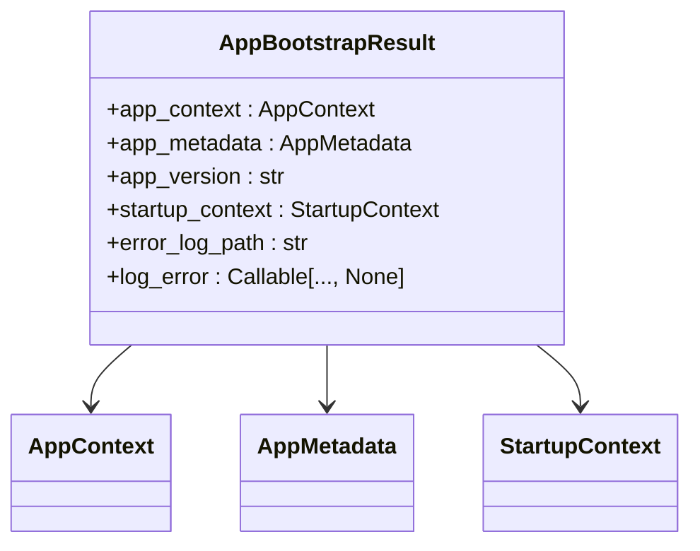

**图示来源**
- [modules/services/app_bootstrap.py](file://modules/services/app_bootstrap.py#L9-L17)

### AppContext 对象

`AppContext` 是应用的核心上下文，包含运行时所需的关键服务实例：

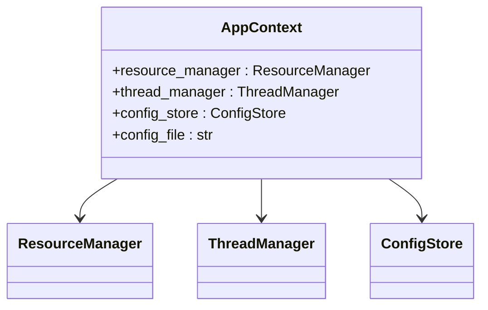

**图示来源**
- [modules/services/bootstrap.py](file://modules/services/bootstrap.py#L11-L15)

### StartupContext 对象

`StartupContext` 包含启动时的环境检查结果：

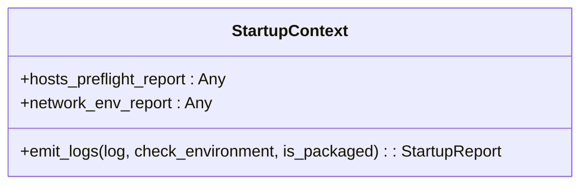

**图示来源**
- [modules/services/startup_context.py](file://modules/services/startup_context.py#L10-L13)

## build_app_bootstrap 函数执行流程

`build_app_bootstrap()` 函数是整个初始化过程的协调者，它按照特定顺序执行多个初始化步骤。

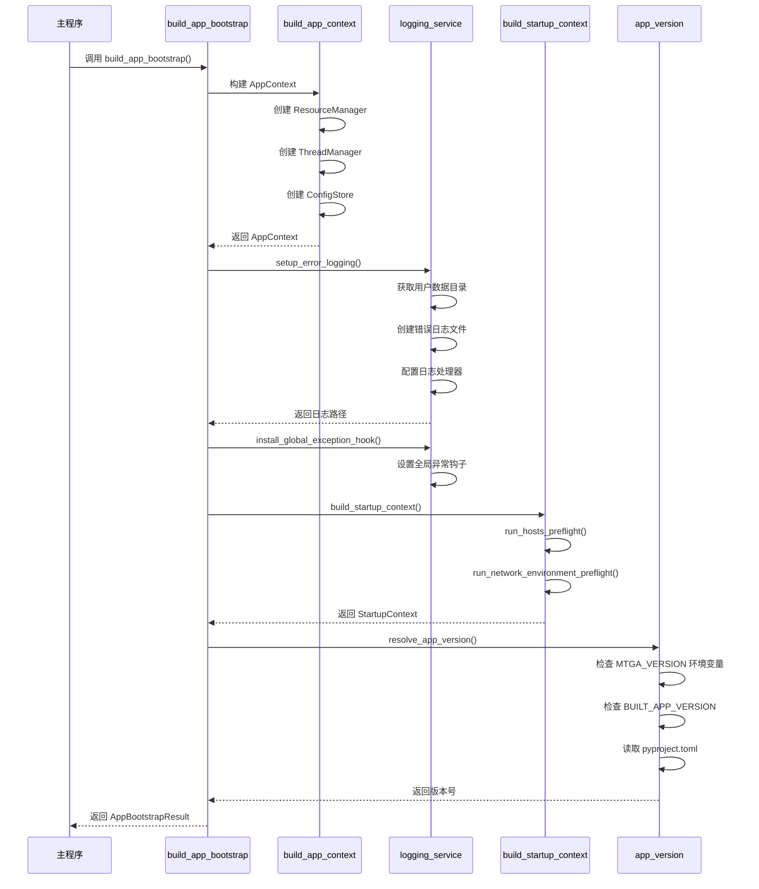

**图示来源**
- [modules/services/app_bootstrap.py](file://modules/services/app_bootstrap.py#L19-L37)

## 启动上下文构建与环境检查

启动上下文的构建过程包含对系统环境的预检，确保应用能够在当前环境中正常运行。

### Hosts 文件预检

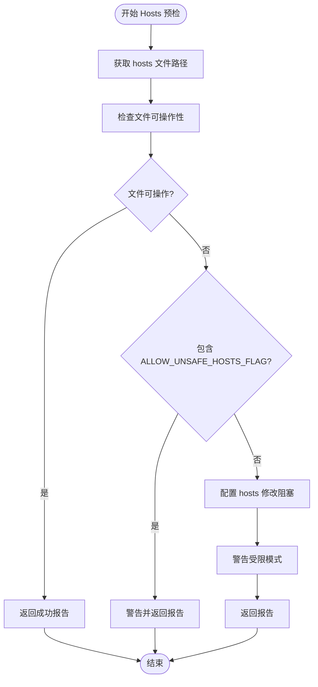

**图示来源**
- [modules/services/startup_checks.py](file://modules/services/startup_checks.py#L25-L54)

### 网络环境预检

网络环境预检主要检查是否存在显式代理配置，这可能会影响 hosts 导流的效果。

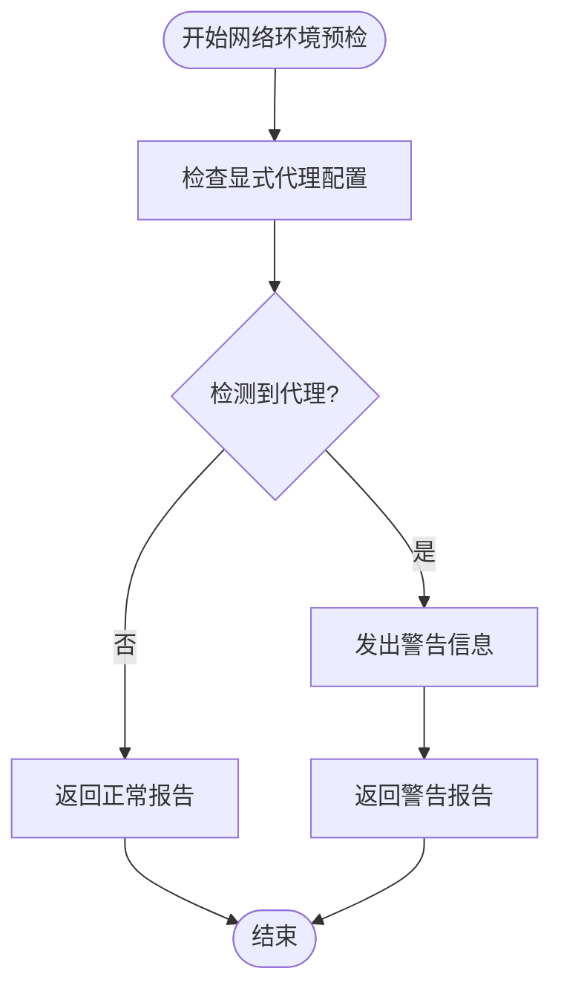

**图示来源**
- [modules/services/startup_checks.py](file://modules/services/startup_checks.py#L57-L64)

## AppContext 依赖注入体系

AppContext 采用依赖注入模式，将核心服务实例集中管理，便于在应用各处使用。

### 资源管理器 (ResourceManager)

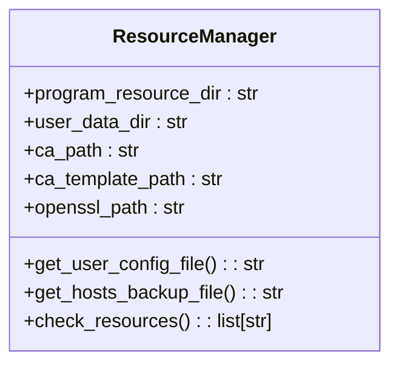

**图示来源**
- [modules/runtime/resource_manager.py](file://modules/runtime/resource_manager.py#L201-L293)

### 线程管理器 (ThreadManager)

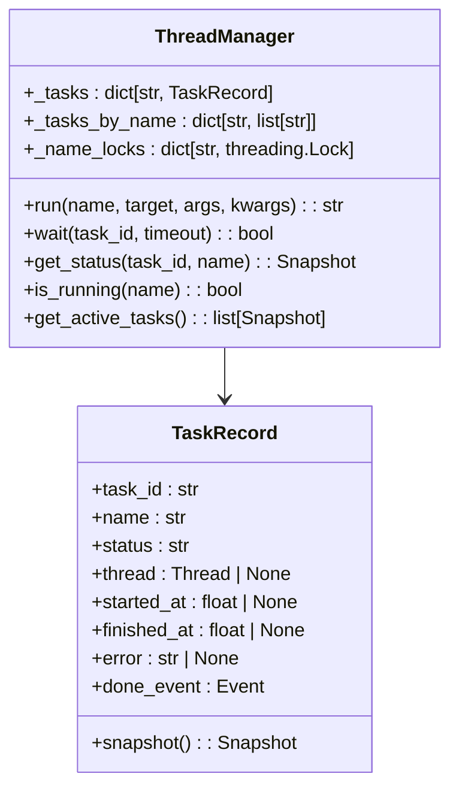

**图示来源**
- [modules/runtime/thread_manager.py](file://modules/runtime/thread_manager.py#L42-L169)

### 配置存储 (ConfigStore)

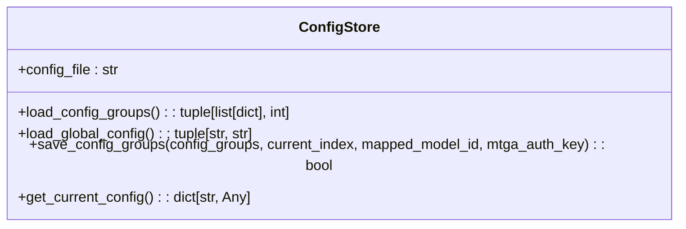

**图示来源**
- [modules/services/config_service.py](file://modules/services/config_service.py#L11-L80)

## Bootstrap 在 GUI 启动中的作用

在 `mtga_gui.py` 中，Bootstrap 机制作为应用装配的起点，实现了从初始化到 GUI 创建的平滑过渡。

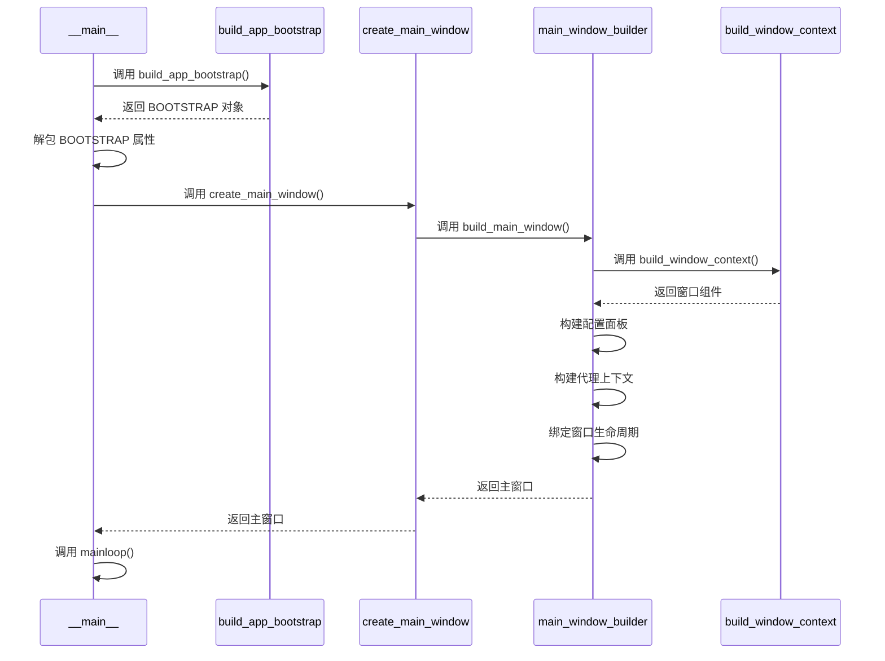

**图示来源**
- [mtga_gui.py](file://mtga_gui.py#L70-L144)
- [modules/ui/main_window_builder.py](file://modules/ui/main_window_builder.py#L59-L207)

## 关注点分离设计原则

Bootstrap 机制充分体现了关注点分离（Separation of Concerns）的设计原则，将复杂的初始化逻辑分解为独立的、可管理的组件。

### 分层架构设计

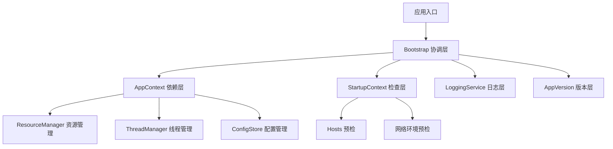

**图示来源**
- [modules/services/app_bootstrap.py](file://modules/services/app_bootstrap.py)
- [modules/services/bootstrap.py](file://modules/services/bootstrap.py)
- [modules/services/startup_context.py](file://modules/services/startup_context.py)

### 依赖注入优势

通过依赖注入，Bootstrap 机制实现了以下优势：
- **解耦**：各组件之间通过接口交互，降低耦合度
- **可测试性**：可以轻松替换依赖进行单元测试
- **可维护性**：修改一个组件不影响其他组件
- **可扩展性**：可以方便地添加新的服务

## 错误处理与日志机制

Bootstrap 机制内置了完善的错误处理与日志记录功能，确保应用在出现问题时能够提供足够的诊断信息。

### 全局异常钩子

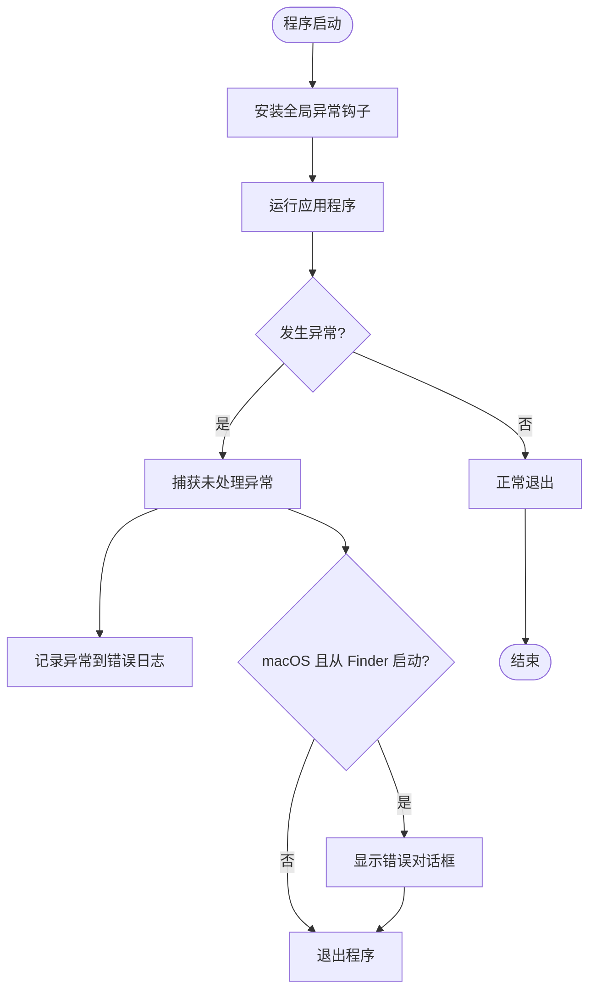

**图示来源**
- [modules/services/logging_service.py](file://modules/services/logging_service.py#L48-L57)
- [mtga_gui.py](file://mtga_gui.py#L126-L140)

### 错误日志配置

错误日志配置过程确保了错误信息能够被持久化记录：

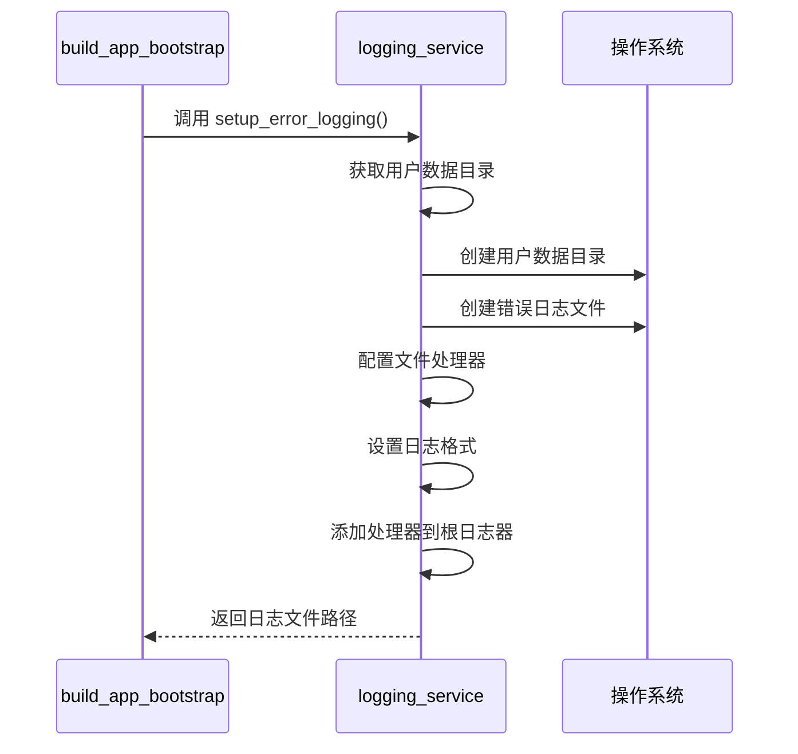

**图示来源**
- [modules/services/logging_service.py](file://modules/services/logging_service.py#L10-L40)

## 总结

Bootstrap 机制作为应用启动过程的核心，通过 `build_app_bootstrap()` 函数协调项目根路径、用户数据目录等参数，逐步构建了 `AppContext`、`AppMetadata`、`StartupContext` 等关键初始化对象。该机制在 `mtga_gui.py` 中作为应用装配的起点，实现了配置加载、环境检查和依赖实例化的有序执行。

通过遵循关注点分离原则，Bootstrap 机制将复杂的初始化逻辑从主入口移出，显著提升了代码的可维护性与可调试性。其采用的依赖注入模式使得各组件之间解耦，便于测试和扩展。同时，内置的错误处理与日志机制确保了应用在出现问题时能够提供足够的诊断信息。

这种设计模式不仅提高了代码质量，还为未来的功能扩展和维护提供了坚实的基础，是本应用架构中的关键组成部分。