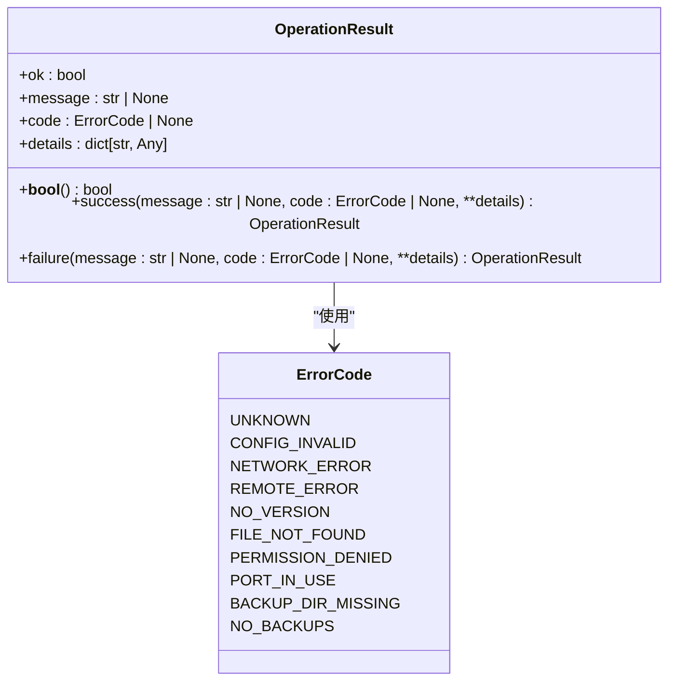
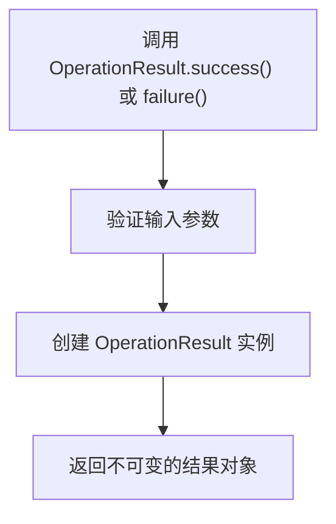
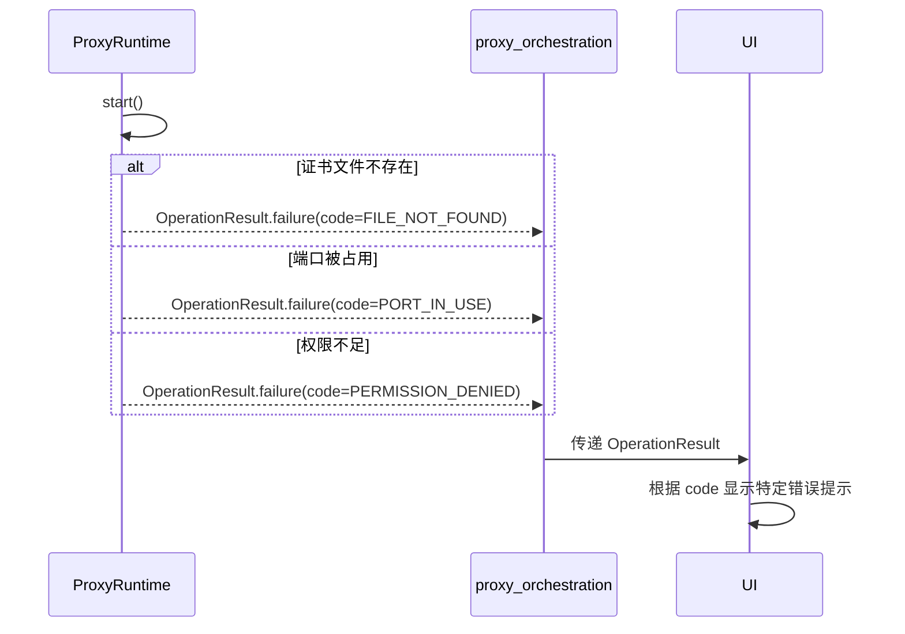

# OperationResult 模式

<cite>
**本文档引用的文件**
- [operation_result.py](file://modules/runtime/operation_result.py)
- [error_codes.py](file://modules/runtime/error_codes.py)
- [ARCHITECTURE.md](file://docs/ARCHITECTURE.md)
- [cert_service.py](file://modules/services/cert_service.py)
- [hosts_service.py](file://modules/services/hosts_service.py)
- [proxy_orchestration.py](file://modules/services/proxy_orchestration.py)
- [result_messages.py](file://modules/runtime/result_messages.py)
- [ca_store.py](file://modules/cert/ca_store.py)
- [proxy_runtime.py](file://modules/proxy/proxy_runtime.py)
- [update_service.py](file://modules/services/update_service.py)
</cite>

## 目录
1. [引言](#引言)
2. [核心设计](#核心设计)
3. [实现细节](#实现细节)
4. [使用模式](#使用模式)
5. [错误处理协同机制](#错误处理协同机制)
6. [服务边界最佳实践](#服务边界最佳实践)
7. [优势分析](#优势分析)
8. [结论](#结论)

## 引言
OperationResult 模式是 ModelRelay 架构中的核心错误处理与结果传递机制。该模式通过一个不可变的数据类，统一封装了操作的成功或失败状态，实现了跨 UI、actions、services 和领域模块的标准化结果传递。此文档将系统性地分析该模式的设计与实现，阐述其在提升代码可读性、简化条件判断和传递结构化错误详情方面的核心作用。

## 核心设计
OperationResult 模式的设计遵循了不可变性、清晰性和可扩展性的原则。它被定义为一个冻结（frozen）的 dataclass，确保了实例一旦创建其状态就不可更改，从而避免了副作用和状态污染。

该模式的核心字段包括：
- **ok**: 布尔值，直接表示操作是否成功。
- **message**: 字符串，提供人类可读的操作摘要。
- **code**: ErrorCode 枚举值，为错误提供机器可读的、语义明确的分类。
- **details**: 字典，用于携带任何与操作相关的结构化上下文信息。

这种设计使得调用者可以轻松地通过 `if result.ok:` 进行条件判断，同时又能获取丰富的错误信息，而无需解析异常或复杂的返回结构。



**Diagram sources**
- [operation_result.py](file://modules/runtime/operation_result.py#L9-L40)
- [error_codes.py](file://modules/runtime/error_codes.py#L6-L17)
- [ARCHITECTURE.md](file://docs/ARCHITECTURE.md#L157-L163)

**Section sources**
- [operation_result.py](file://modules/runtime/operation_result.py#L1-L40)
- [error_codes.py](file://modules/runtime/error_codes.py#L1-L20)

## 实现细节
OperationResult 的实现利用了 Python 的 dataclass 特性，通过 `@dataclass(frozen=True)` 确保了不可变性。`__bool__` 方法的重载允许实例在布尔上下文中直接使用，极大地简化了成功/失败的判断逻辑。

该类提供了两个关键的类方法工厂：
- **success()**: 创建一个表示成功的 OperationResult 实例。
- **failure()**: 创建一个表示失败的 OperationResult 实例。

这两个工厂方法是创建 OperationResult 实例的唯一推荐方式，它们封装了构造逻辑，使得代码更加简洁和一致。



**Diagram sources**
- [operation_result.py](file://modules/runtime/operation_result.py#L19-L37)

**Section sources**
- [operation_result.py](file://modules/runtime/operation_result.py#L1-L40)

## 使用模式
OperationResult 模式在 ModelRelay 的各个层级中被广泛采用，尤其是在 services 和 actions 层。

在 **services** 层，每个业务操作都返回一个 OperationResult。例如，在 `cert_service.py` 中，`generate_certificates_result` 函数根据底层操作的布尔返回值，决定返回 `OperationResult.success()` 还是 `OperationResult.failure()`。

```python
# 示例：services 层的使用
def generate_certificates_result(...) -> OperationResult:
    if generate_certificates(...):
        return OperationResult.success()
    return OperationResult.failure("生成证书失败")
```

在 **actions** 层，代码会消费这些结果。例如，在 `cert_actions.py` 中，`run_generate_certificates` 任务会检查 `result.ok`，并根据结果调用 `log_func` 输出成功或失败的消息。这里还结合了 `result_messages.py` 中的 `describe_result` 函数，该函数会优先使用 `result.message`，如果为空则根据 `result.code` 查找预定义的中文错误消息，实现了错误信息的本地化和降级。

```python
# 示例：actions 层的使用
result = cert_service.generate_certificates_result(...)
if result.ok:
    log_func("✅ 证书生成完成")
else:
    message = describe_result(result, "证书生成失败")
    log_func(f"❌ {message}")
```

**Section sources**
- [cert_service.py](file://modules/services/cert_service.py#L10-L17)
- [cert_actions.py](file://modules/actions/cert_actions.py#L9-L26)
- [result_messages.py](file://modules/runtime/result_messages.py#L20-L25)

## 错误处理协同机制
OperationResult 模式与 ErrorCode 枚举紧密协同，构成了一个强大的错误处理体系。根据 `ARCHITECTURE.md` 中的指导，`OperationResult` 失败时应尽量填写 `ErrorCode`，以避免语义漂移。

ErrorCode 是一个继承自 `StrEnum` 的字符串枚举，它定义了应用中所有可能的错误类型，如 `NETWORK_ERROR`、`PERMISSION_DENIED` 等。当一个操作失败时，它不仅返回一个失败结果，还附带一个精确的错误码。

这种协同机制在 `proxy_runtime.py` 中体现得淋漓尽致。在 `ProxyRuntime.start()` 方法中，不同的异常被捕获并映射到特定的 ErrorCode：
- `PermissionError` 映射到 `ErrorCode.PERMISSION_DENIED`
- `OSError`（端口占用）映射到 `ErrorCode.PORT_IN_USE`
- 其他意外错误映射到 `ErrorCode.UNKNOWN`

这使得上层调用者（如 `proxy_orchestration.py` 中的 `start_proxy_instance_result`）可以基于 `result.code` 进行更精细化的错误处理或用户提示，而不是仅仅依赖模糊的错误消息。



**Diagram sources**
- [proxy_runtime.py](file://modules/proxy/proxy_runtime.py#L66-L170)
- [proxy_orchestration.py](file://modules/services/proxy_orchestration.py#L153-L184)
- [ARCHITECTURE.md](file://docs/ARCHITECTURE.md#L203-L236)

**Section sources**
- [proxy_runtime.py](file://modules/proxy/proxy_runtime.py#L1-L218)
- [proxy_orchestration.py](file://modules/services/proxy_orchestration.py#L1-L200)
- [error_codes.py](file://modules/runtime/error_codes.py#L1-L20)

## 服务边界最佳实践
根据 `ARCHITECTURE.md` 的分层约束，`OperationResult` 主要在 service 和 action 的边界处使用。这是该模式的最佳实践场景。

- **领域模块**（如 cert, hosts, proxy）：这些模块的内部函数可能返回布尔值或抛出异常，但它们不直接返回 `OperationResult`。
- **services 层**：这是 `OperationResult` 的主要创建点。services 层调用领域模块，并将底层的返回值或异常“翻译”成带有 `code` 和 `message` 的 `OperationResult`。
- **actions 层**：这是 `OperationResult` 的主要消费点。actions 层调用 services，并根据 `OperationResult` 的状态更新 UI 或执行后续逻辑。
- **UI 层**：UI 层不直接与领域模块交互，它只通过 actions 层获取 `OperationResult`，并据此更新界面。

这种模式确保了错误处理逻辑的集中化和标准化。例如，在 `hosts_service.py` 中，`modify_hosts_file_result` 函数将 `modify_hosts_file` 的布尔返回值包装成 `OperationResult`。这使得 UI 层无需关心 `modify_hosts_file` 的具体实现，只需处理统一的 `OperationResult` 接口。

**Section sources**
- [ARCHITECTURE.md](file://docs/ARCHITECTURE.md#L3-L82)
- [hosts_service.py](file://modules/services/hosts_service.py#L31-L40)
- [ca_store.py](file://modules/cert/ca_store.py#L14-L41)

## 优势分析
OperationResult 模式为 ModelRelay 带来了显著的优势：

1.  **提升代码可读性**：`if result.ok:` 比 `try...except` 或检查 `None` 更加直观和易于理解。
2.  **简化条件判断**：消除了复杂的异常处理层级，使业务逻辑更加线性。
3.  **支持结构化错误详情**：`details` 字段可以携带任何上下文信息（如 `returncode`, `stderr`），便于调试和高级错误处理。
4.  **实现错误语义化**：通过 `ErrorCode`，错误不再是模糊的字符串，而是具有明确含义的枚举值，便于程序分析和国际化。
5.  **促进分层解耦**：清晰地定义了服务边界，使得各层之间的契约更加明确。

## 结论
OperationResult 模式是 ModelRelay 架构中一个精心设计的核心组件。它通过一个简单而强大的不可变数据类，成功地统一了整个应用的结果传递和错误处理机制。该模式与 ErrorCode 枚举的协同，以及在服务边界处的最佳实践，共同构建了一个健壮、清晰且易于维护的软件系统。它不仅是技术实现，更是一种倡导清晰契约和良好分层的设计哲学的体现。