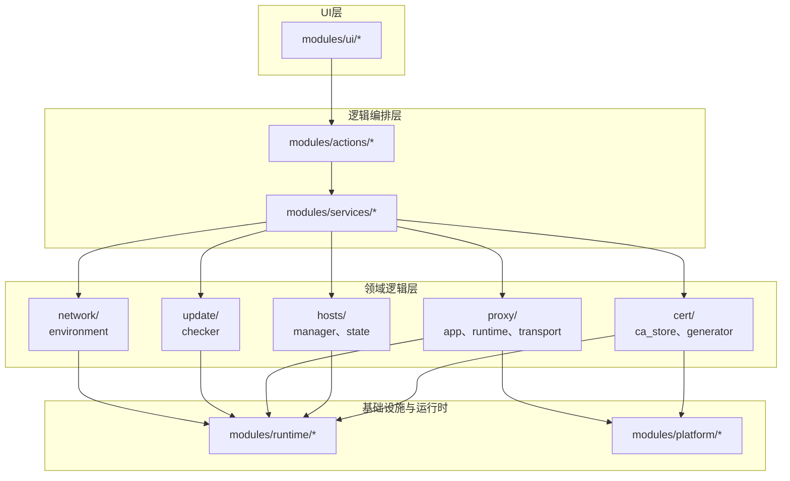
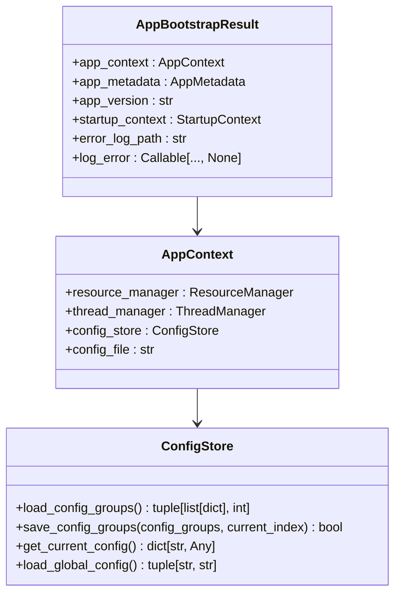

# 依赖倒置原则实现

<cite>
**本文档引用的文件**  
- [mtga_gui.py](file://archive/mtga_gui.py)
- [bootstrap.py](file://modules/services/bootstrap.py)
- [app_bootstrap.py](file://modules/services/app_bootstrap.py)
- [config_service.py](file://modules/services/config_service.py)
- [privilege_service.py](file://modules/services/privilege_service.py)
- [hosts_service.py](file://modules/services/hosts_service.py)
- [cert_service.py](file://modules/services/cert_service.py)
- [ARCHITECTURE.md](file://docs/ARCHITECTURE.md)
- [main_window_deps.py](file://modules/ui/main_window_deps.py)
- [platform/privileges.py](file://modules/platform/privileges.py)
- [hosts_manager.py](file://modules/hosts/hosts_manager.py)
- [cert_generator.py](file://modules/cert/cert_generator.py)
</cite>

## 目录
1. [引言](#引言)
2. [项目结构分析](#项目结构分析)
3. [服务层与依赖倒置原则](#服务层与依赖倒置原则)
4. [架构分层与依赖约束](#架构分层与依赖约束)
5. [服务接口抽象与实现分离](#服务接口抽象与实现分离)
6. [控制反转与依赖注入](#控制反转与依赖注入)
7. [具体服务实现分析](#具体服务实现分析)
8. [UI层与服务层交互](#ui层与服务层交互)
9. [依赖倒置的优势](#依赖倒置的优势)
10. [结论](#结论)

## 引言

ModelRelay项目通过精心设计的服务层（services layer）实现了依赖倒置原则（Dependency Inversion Principle, DIP），这是面向对象设计五大原则（SOLID）中的最后一个原则。依赖倒置原则的核心思想是：高层模块不应该依赖于低层模块，二者都应该依赖于抽象；抽象不应该依赖于细节，细节应该依赖于抽象。本文将详细阐述ModelRelay如何通过服务层实现这一原则，解释高层模块（如UI）如何通过抽象服务接口与低层模块交互，而非直接依赖其实现。

## 项目结构分析

ModelRelay项目的目录结构清晰地反映了其分层架构设计。项目根目录下包含多个模块化子目录，其中`modules/`目录是核心业务逻辑的存放位置。`modules/`目录下进一步划分为多个子模块，包括`ui`（用户界面）、`services`（服务层）、`cert`（证书管理）、`hosts`（hosts文件管理）、`proxy`（代理服务）、`platform`（平台相关逻辑）等。这种组织方式使得代码职责分明，便于维护和扩展。



**图源**  
- [ARCHITECTURE.md](file://docs/ARCHITECTURE.md#L38-L82)

**本节来源**  
- [ARCHITECTURE.md](file://docs/ARCHITECTURE.md#L1-L250)

## 服务层与依赖倒置原则

服务层是ModelRelay项目实现依赖倒置原则的核心。根据`docs/ARCHITECTURE.md`中的描述，服务层（services）定义了副作用边界，是高层模块与低层模块之间的桥梁。高层模块（如UI）通过调用服务层提供的抽象接口来完成业务功能，而不需要关心底层的具体实现细节。

服务层的设计遵循了“面向接口编程”的原则。例如，`ConfigStore`类提供了配置管理的抽象接口，包括`load_config_groups`、`save_config_groups`、`get_current_config`等方法。UI层通过依赖`ConfigStore`这个抽象，而不是直接操作配置文件的读写逻辑，从而实现了与具体文件操作的解耦。



**图源**  
- [config_service.py](file://modules/services/config_service.py#L11-L81)
- [bootstrap.py](file://modules/services/bootstrap.py#L11-L28)
- [app_bootstrap.py](file://modules/services/app_bootstrap.py#L9-L37)

**本节来源**  
- [config_service.py](file://modules/services/config_service.py#L1-L81)
- [bootstrap.py](file://modules/services/bootstrap.py#L1-L29)
- [app_bootstrap.py](file://modules/services/app_bootstrap.py#L1-L38)

## 架构分层与依赖约束

ModelRelay项目的架构分层严格遵循了单向依赖原则，即依赖关系只能从上层指向下层，不能反向依赖。`docs/ARCHITECTURE.md`中明确指出了分层结构和依赖约束：

- **UI层**：负责用户界面展示和用户交互，位于最上层。
- **逻辑编排层**：包含`actions`和`services`模块，负责业务逻辑的编排和协调。
- **领域逻辑层**：包含`cert`、`hosts`、`proxy`等模块，实现具体的业务功能。
- **基础设施与运行时**：包含`runtime`和`platform`模块，提供基础支持。

关键的依赖约束是：**UI不得直接import领域模块**。这意味着UI层不能直接调用`cert`、`hosts`等模块中的函数，而必须通过`services`层提供的抽象接口进行交互。这一约束确保了UI层与具体实现的解耦，是依赖倒置原则的具体体现。


**图源**  
- [ARCHITECTURE.md](file://docs/ARCHITECTURE.md#L5-L7)

**本节来源**  
- [ARCHITECTURE.md](file://docs/ARCHITECTURE.md#L1-L250)

## 服务接口抽象与实现分离

ModelRelay项目通过服务接口的抽象与实现分离，完美地实现了依赖倒置原则。以`privilege_service.py`为例，该文件仅导入了`platform/privileges.py`中的`check_is_admin`和`run_as_admin`函数，并通过`__all__`导出，形成了一个清晰的抽象接口。

```python
from modules.platform.privileges import check_is_admin, run_as_admin
__all__ = ["check_is_admin", "run_as_admin"]
```

UI层或其他高层模块只需要导入`services.privilege_service`，就可以使用`check_is_admin`和`run_as_admin`功能，而完全不需要知道这些功能在Windows、macOS或Linux上的具体实现差异。`platform/privileges.py`文件中包含了针对不同操作系统的具体实现，如`is_windows_admin`、`is_windows_elevated`等，这些细节对上层是完全透明的。

这种设计使得系统具有极高的可维护性和可扩展性。如果需要支持新的操作系统，只需在`platform`模块中添加相应的实现，而无需修改`services`层或UI层的任何代码。

**本节来源**  
- [privilege_service.py](file://modules/services/privilege_service.py#L1-L6)
- [platform/privileges.py](file://modules/platform/privileges.py#L1-L113)

## 控制反转与依赖注入

ModelRelay项目通过`bootstrap.py`和`app_bootstrap.py`实现了控制反转（Inversion of Control, IoC）和依赖注入（Dependency Injection, DI）。`bootstrap.py`中的`build_app_context`函数负责创建和组装所有服务实例，并将它们注入到`AppContext`数据类中。

```python
def build_app_context() -> AppContext:
    resource_manager = ResourceManager()
    thread_manager = ThreadManager()
    config_file = resource_manager.get_user_config_file()
    config_store = ConfigStore(config_file)
    return AppContext(
        resource_manager=resource_manager,
        thread_manager=thread_manager,
        config_store=config_store,
        config_file=config_file,
    )
```

`app_bootstrap.py`中的`build_app_bootstrap`函数进一步调用`build_app_context`，并组装出`AppBootstrapResult`，其中包含了`app_context`、`app_metadata`、`app_version`等所有启动所需的信息。这种设计将对象的创建和依赖关系的管理从具体的业务逻辑中剥离出来，交由专门的“启动器”来完成，实现了控制反转。

UI层通过接收`AppBootstrapResult`或`AppContext`，获得了所有需要的服务实例，而不需要自己去创建或查找它们。这正是依赖注入的体现，它使得代码更加模块化，更易于测试。

**本节来源**  
- [bootstrap.py](file://modules/services/bootstrap.py#L18-L28)
- [app_bootstrap.py](file://modules/services/app_bootstrap.py#L19-L37)

## 具体服务实现分析

### 配置服务（ConfigService）

`ConfigStore`类是配置服务的核心，它封装了对YAML配置文件的读写操作。该类提供了`load_config_groups`、`save_config_groups`、`get_current_config`等方法，为上层提供了统一的配置访问接口。通过将文件路径、编码、异常处理等细节封装在服务内部，上层模块可以专注于业务逻辑，而无需关心配置持久化的具体实现。

### 主机服务（HostsService）

`hosts_service.py`文件定义了`modify_hosts_file_result`、`backup_hosts_file_result`等函数，这些函数返回`OperationResult`对象，用于表示操作的成功或失败。这些函数内部调用了`hosts_manager.py`中的具体实现，但对外暴露的是一个统一的、基于结果对象的接口。这种设计使得UI层可以方便地处理成功和失败的情况，而不需要直接处理复杂的文件操作异常。

### 证书服务（CertService）

`cert_service.py`文件提供了`generate_certificates_result`、`install_ca_cert_result`等函数，这些函数同样返回`OperationResult`对象。它们内部调用了`cert_generator.py`和`cert_installer.py`中的具体实现，但对外隐藏了使用OpenSSL生成证书、在不同操作系统上安装证书的复杂性。UI层只需调用这些服务函数，并根据返回的`OperationResult`更新界面状态即可。

**本节来源**  
- [config_service.py](file://modules/services/config_service.py#L1-L81)
- [hosts_service.py](file://modules/services/hosts_service.py#L1-L60)
- [cert_service.py](file://modules/services/cert_service.py#L1-L38)
- [hosts_manager.py](file://modules/hosts/hosts_manager.py#L1-L492)
- [cert_generator.py](file://modules/cert/cert_generator.py#L1-L446)

## UI层与服务层交互

`mtga_gui.py`作为UI入口，通过`main_window_deps.py`中的`build_main_window_deps`函数接收来自服务层的依赖注入。该函数接收`MainWindowDepsInputs`，其中包含了`app_context`等关键对象，并从中提取出`config_store`、`modify_hosts_file`、`generate_certificates`等服务实例，构建出`MainWindowDeps`。

```python
def build_main_window_deps(inputs: MainWindowDepsInputs) -> MainWindowDeps:
    return MainWindowDeps(
        config_store=inputs.app_context.config_store,
        modify_hosts_file=hosts_service.modify_hosts_file_result,
        generate_certificates=cert_service.generate_certificates,
        # ... 其他依赖
    )
```

UI组件在初始化时，会接收`MainWindowDeps`对象，并使用其中的服务实例来响应用户操作。例如，当用户点击“生成证书”按钮时，UI会调用`deps.generate_certificates()`，而不会直接调用`cert_generator.generate_certificates()`。这种间接调用的方式，确保了UI层与具体实现的彻底解耦。

**本节来源**  
- [mtga_gui.py](file://archive/mtga_gui.py#L1-L800)
- [main_window_deps.py](file://modules/ui/main_window_deps.py#L30-L57)

## 依赖倒置的优势

通过在服务层实现依赖倒置原则，ModelRelay项目获得了诸多优势：

1.  **解耦与灵活性**：UI层与具体实现完全解耦，使得更换底层实现（如使用不同的证书生成库或不同的配置存储格式）变得非常容易，只需修改服务层的实现，而无需改动UI代码。
2.  **可测试性**：由于依赖是通过接口注入的，因此在单元测试中可以轻松地使用模拟对象（mocks）或桩对象（stubs）来替代真实的服务，从而隔离测试目标，提高测试的效率和可靠性。
3.  **可维护性**：代码结构清晰，职责分明。当需要修复bug或添加新功能时，开发者可以快速定位到相关的服务模块，而不会被复杂的依赖关系所困扰。
4.  **支持模块独立开发**：不同的开发人员可以并行开发UI和底层服务，只要双方约定好服务接口，就可以独立进行，最后通过依赖注入进行集成。
5.  **打破循环依赖**：通过引入抽象层，有效地打破了高层模块与低层模块之间可能存在的循环依赖，使得系统架构更加健壮。

## 结论

ModelRelay项目通过精心设计的服务层，成功地实现了依赖倒置原则。通过定义清晰的服务接口，将高层模块（UI）与低层模块（cert、hosts、platform）解耦，使得系统架构更加灵活、可维护和可测试。`ARCHITECTURE.md`中的分层图清晰地展示了这一设计思想，而`mtga_gui.py`对服务的导入和`bootstrap.py`中服务实例的注入，则是控制反转和依赖注入的实际应用。这种架构设计为ModelRelay的长期发展和扩展奠定了坚实的基础。