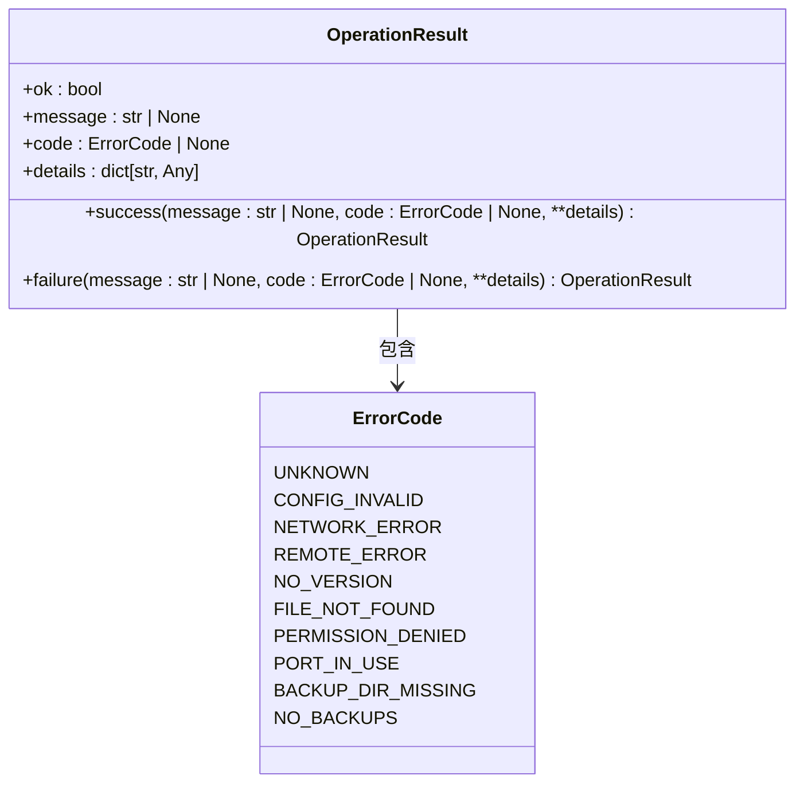
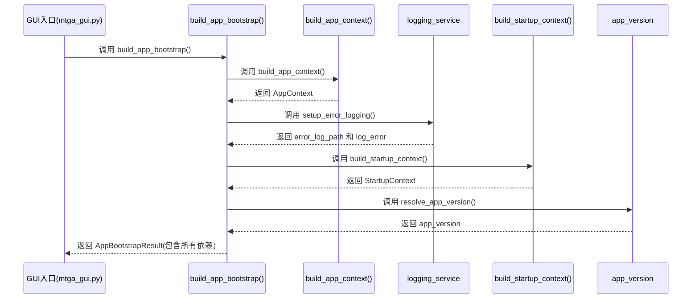
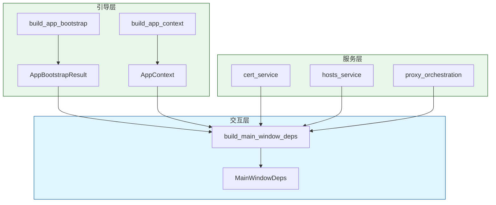

# 核心设计模式

<cite>
**本文档引用的文件**
- [operation_result.py](file://modules/runtime/operation_result.py)
- [error_codes.py](file://modules/runtime/error_codes.py)
- [result_messages.py](file://modules/runtime/result_messages.py)
- [bootstrap.py](file://modules/services/bootstrap.py)
- [app_bootstrap.py](file://modules/services/app_bootstrap.py)
- [startup_context.py](file://modules/services/startup_context.py)
- [main_window_deps.py](file://modules/ui/main_window_deps.py)
- [cert_service.py](file://modules/services/cert_service.py)
- [hosts_service.py](file://modules/services/hosts_service.py)
- [proxy_orchestration.py](file://modules/services/proxy_orchestration.py)
- [ARCHITECTURE.md](file://docs/ARCHITECTURE.md)
</cite>

## 目录
1. [引言](#引言)
2. [OperationResult 模式：统一操作结果封装](#operationresult-模式统一操作结果封装)
3. [AppContext：全局状态与资源容器](#appcontext全局状态与资源容器)
4. [Bootstrap 引导机制：依赖注入与初始化协调](#bootstrap-引导机制依赖注入与初始化协调)
5. [依赖倒置原则：通过服务层实现解耦](#依赖倒置原则通过服务层实现解耦)
6. [架构整合：设计模式的协同效应](#架构整合设计模式的协同效应)
7. [结论](#结论)

## 引言
ModelRelay 项目采用了一系列精心设计的架构模式，以提升代码的可测试性、可维护性和可扩展性。本文件系统性地文档化其核心设计模式，重点分析 `OperationResult` 如何统一处理操作状态，`AppContext` 如何作为全局状态容器，`Bootstrap` 过程如何协调依赖注入，以及服务层如何通过依赖倒置实现模块解耦。这些模式共同构成了一个清晰、健壮且易于演进的分层架构。

## OperationResult 模式：统一操作结果封装

`OperationResult` 模式是 ModelRelay 中跨层通信的核心，它提供了一种类型安全且信息丰富的方式来封装任何操作（成功或失败）的结果。该模式通过 `modules/runtime/operation_result.py` 中的 `OperationResult` 数据类实现。

该模式的关键优势在于它将传统的异常处理与返回值结合，避免了在业务逻辑中频繁使用 `try-catch` 块，从而简化了错误处理流程。每个 `OperationResult` 实例包含四个核心字段：
- **ok**: 布尔值，明确指示操作是否成功。
- **message**: 字符串，提供人类可读的操作摘要或错误信息。
- **code**: `ErrorCode` 枚举值，为错误提供机器可读的、标准化的分类。
- **details**: 字典，用于携带与操作相关的任意结构化数据。

通过提供 `success()` 和 `failure()` 两个类方法，该模式鼓励开发者以声明式的方式创建结果对象。例如，一个服务函数无需抛出异常，而是直接返回 `OperationResult.failure("打开 hosts 文件失败", code=ErrorCode.FILE_NOT_FOUND)`。这种约定使得调用方可以统一地检查 `.ok` 属性来决定后续流程，极大地提高了代码的可预测性和健壮性。

**图示来源**
- [operation_result.py](file://modules/runtime/operation_result.py#L9-L40)
- [error_codes.py](file://modules/runtime/error_codes.py#L6-L19)

此外，`modules/runtime/result_messages.py` 模块利用 `OperationResult` 的 `code` 字段，实现了错误消息的集中管理和本地化。通过 `describe_result()` 函数，系统可以根据错误码自动映射到预定义的中文错误消息，确保了用户界面反馈的一致性。

**本节来源**
- [operation_result.py](file://modules/runtime/operation_result.py#L1-L41)
- [error_codes.py](file://modules/runtime/error_codes.py#L1-L20)
- [result_messages.py](file://modules/runtime/result_messages.py#L1-L29)

## AppContext：全局状态与资源容器

`AppContext` 是 ModelRelay 应用生命周期中的核心状态容器，扮演着“应用上下文”的角色。它在 `modules/services/bootstrap.py` 中被定义为一个不可变的 `dataclass`，其主要职责是安全地聚合和共享在整个应用运行期间所需的全局资源和服务实例。

`AppContext` 的设计遵循了依赖注入（DI）和单一职责原则。它不包含任何业务逻辑，而仅仅是一个数据载体，封装了以下关键组件：
- **resource_manager**: 负责管理程序资源（如配置文件、证书、图标）的路径和访问。
- **thread_manager**: 用于协调后台线程的创建和生命周期，确保线程安全。
- **config_store**: 应用配置的存储和访问接口。
- **config_file**: 用户配置文件的路径。

通过将这些资源集中在一个不可变的上下文中，`AppContext` 消除了全局变量的使用，避免了状态污染和竞态条件。任何需要访问这些资源的组件（如 UI 或服务）都可以通过依赖注入的方式获得 `AppContext` 实例，从而以一种受控且可预测的方式访问共享状态。这不仅提高了代码的可测试性（可以轻松地为测试注入模拟的 `AppContext`），也增强了模块间的解耦。

**本节来源**
- [bootstrap.py](file://modules/services/bootstrap.py#L1-L29)

## Bootstrap 引导机制：依赖注入与初始化协调

ModelRelay 的启动过程通过一个名为 `Bootstrap` 的引导机制进行协调，该机制确保了所有核心组件在应用启动时被正确地初始化和组装。这一过程主要由 `modules/services/app_bootstrap.py` 中的 `build_app_bootstrap()` 函数驱动。

`build_app_bootstrap()` 函数是一个典型的依赖注入协调器。它不直接创建所有对象，而是按正确的顺序调用各个初始化函数，并将它们的输出组装成一个最终的 `AppBootstrapResult` 对象。这个结果对象包含了应用启动所需的所有核心依赖：
- **app_context**: 由 `build_app_context()` 创建的全局资源容器。
- **app_metadata**: 应用的元数据（如名称、版本文件名）。
- **app_version**: 解析出的应用版本号。
- **startup_context**: 包含启动时环境检查报告的上下文。
- **error_log_path** 和 **log_error**: 错误日志系统的路径和记录函数。

这个引导过程的关键在于它将复杂的初始化逻辑集中在一个地方，使得启动流程清晰、可维护。`mtga_gui.py` 入口点只需调用 `build_app_bootstrap()`，即可获得一个完全初始化的、包含所有必要依赖的“启动包”。这遵循了“好莱坞原则”（不要调用我们，我们会调用你），高层模块（UI）无需关心底层服务如何构建，只需接收最终的依赖集合。

**图示来源**
- [app_bootstrap.py](file://modules/services/app_bootstrap.py#L19-L37)
- [bootstrap.py](file://modules/services/bootstrap.py#L18-L28)
- [startup_context.py](file://modules/services/startup_context.py#L30-L34)

**本节来源**
- [app_bootstrap.py](file://modules/services/app_bootstrap.py#L1-L38)
- [bootstrap.py](file://modules/services/bootstrap.py#L1-L29)
- [startup_context.py](file://modules/services/startup_context.py#L1-L35)

## 依赖倒置原则：通过服务层实现解耦

ModelRelay 严格遵循依赖倒置原则（DIP），这是其分层架构得以成功的关键。根据 `docs/ARCHITECTURE.md` 中的定义，项目的依赖关系是单向且受控的：`UI -> actions -> services -> 领域模块`。

服务层（`modules/services`）是实现这一原则的核心。它定义了高层模块（如 UI）所需的所有业务能力的抽象接口。例如，`cert_service.py` 并不直接实现证书生成逻辑，而是提供了一个 `generate_certificates_result()` 函数，该函数封装了来自 `modules/cert` 领域模块的具体实现。UI 层或动作层（actions）只需调用 `cert_service.generate_certificates_result()`，而无需知道证书是如何通过 `cert_generator.py` 生成的。

这种设计带来了显著的好处：
1.  **解耦**: UI 层与具体的领域实现（如文件操作、网络请求）完全解耦。即使底层实现发生重大变化（例如，从文件系统切换到数据库存储），只要服务接口保持不变，UI 层就无需修改。
2.  **可测试性**: 可以轻松地为服务层编写单元测试。测试时，可以注入模拟的领域模块实现，以验证服务逻辑的正确性，而无需执行真实的 I/O 操作。
3.  **可维护性**: 业务逻辑被清晰地分隔在不同的层中。修复一个 bug 或添加一个新功能时，开发者可以快速定位到相关的服务或领域模块，而不会影响到其他部分。

例如，`proxy_orchestration.py` 服务协调了代理服务器的启动、停止和重启。它依赖于 `StartProxyDeps` 和 `RestartProxyDeps` 这样的依赖注入数据类，这些类定义了所需的功能（如 `log`, `set_proxy_instance`, `modify_hosts_file`）的抽象，而不是具体的实现类。这使得 `proxy_orchestration` 的逻辑非常纯粹，只关注“做什么”，而将“如何做”委托给注入的依赖。

**本节来源**
- [cert_service.py](file://modules/services/cert_service.py#L1-L38)
- [hosts_service.py](file://modules/services/hosts_service.py#L1-L60)
- [proxy_orchestration.py](file://modules/services/proxy_orchestration.py#L1-L200)
- [ARCHITECTURE.md](file://docs/ARCHITECTURE.md#L1-L250)

## 架构整合：设计模式的协同效应

ModelRelay 的核心设计模式并非孤立存在，而是相互协作，共同构建了一个健壮的架构。`Bootstrap` 过程首先创建 `AppContext`，并将它与其他核心依赖（如日志函数、启动上下文）一起打包成 `AppBootstrapResult`。这个结果对象随后被传递给 UI 层的装配函数 `build_main_window_deps()`。

`build_main_window_deps()` 函数（位于 `modules/ui/main_window_deps.py`）是依赖注入的另一个关键节点。它接收 `MainWindowDepsInputs`，其中就包含了 `AppContext` 和 `AppBootstrapResult` 中的其他依赖。然后，它从 `AppContext` 中提取出 `resource_manager`、`thread_manager` 和 `config_store`，并将它们与来自服务层的函数引用（如 `modify_hosts_file`、`install_ca_cert`、`update_service`）一起，组装成一个专供 UI 组件使用的 `MainWindowDeps` 对象。

在这个最终的依赖对象中，我们可以看到所有设计模式的融合：
- **AppContext** 提供了底层资源。
- **OperationResult** 模式被所有服务函数（如 `modify_hosts_file_result`）所采用，确保 UI 能以统一的方式处理结果。
- **服务层** 提供了业务能力的抽象，UI 通过这些函数引用与应用逻辑交互，而无需了解其实现细节。

这种分层和依赖注入的架构，使得 ModelRelay 的代码高度模块化、可测试且易于维护。任何一层的修改都尽可能地被限制在该层内部，从而降低了引入回归错误的风险。

**图示来源**
- [app_bootstrap.py](file://modules/services/app_bootstrap.py#L19-L37)
- [bootstrap.py](file://modules/services/bootstrap.py#L18-L28)
- [main_window_deps.py](file://modules/ui/main_window_deps.py#L30-L57)

**本节来源**
- [main_window_deps.py](file://modules/ui/main_window_deps.py#L1-L58)
- [app_bootstrap.py](file://modules/services/app_bootstrap.py#L1-L38)
- [bootstrap.py](file://modules/services/bootstrap.py#L1-L29)

## 结论
ModelRelay 通过精心应用 `OperationResult`、`AppContext`、`Bootstrap` 引导和依赖倒置等核心设计模式，成功构建了一个清晰、健壮且可维护的软件架构。`OperationResult` 统一了错误处理，`AppContext` 安全地管理了全局状态，`Bootstrap` 协调了复杂的初始化过程，而服务层则通过依赖倒置实现了模块间的松耦合。这些模式的协同作用，不仅提升了代码的可测试性和可扩展性，也为未来的功能演进奠定了坚实的基础。`ARCHITECTURE.md` 中的分层图清晰地展示了这种设计的成果，即一个从 UI 到基础设施的、单向依赖的、职责分明的系统。