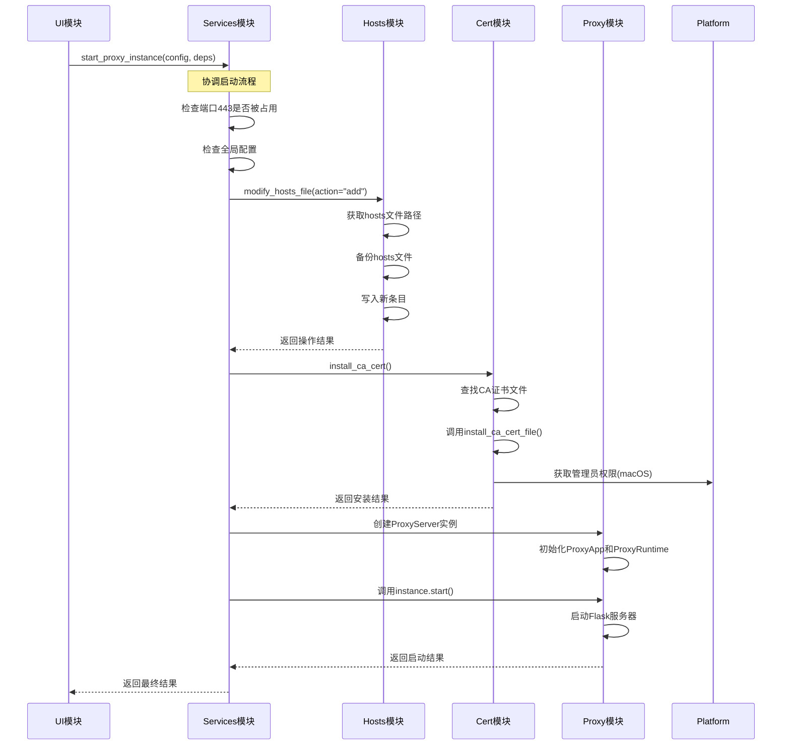

# 模块职责划分

<cite>
**本文档引用的文件**
- [modules\__init__.py](file://modules\__init__.py)
- [modules\cert\__init__.py](file://modules\cert\__init__.py)
- [modules\cert\ca_store.py](file://modules\cert\ca_store.py)
- [modules\cert\cert_generator.py](file://modules\cert\cert_generator.py)
- [modules\cert\cert_installer.py](file://modules\cert\cert_installer.py)
- [modules\hosts\__init__.py](file://modules\hosts\__init__.py)
- [modules\hosts\hosts_manager.py](file://modules\hosts\hosts_manager.py)
- [modules\proxy\__init__.py](file://modules\proxy\__init__.py)
- [modules\proxy\proxy_server.py](file://modules\proxy\proxy_server.py)
- [modules\proxy\proxy_app.py](file://modules\proxy\proxy_app.py)
- [modules\services\__init__.py](file://modules\services\__init__.py)
- [modules\services\proxy_orchestration.py](file://modules\services\proxy_orchestration.py)
- [modules\ui\__init__.py](file://modules\ui\__init__.py)
- [modules\ui\main_window_builder.py](file://modules\ui\main_window_builder.py)
- [modules\runtime\__init__.py](file://modules\runtime\__init__.py)
- [modules\platform\__init__.py](file://modules\platform\__init__.py)
</cite>

## 目录
1. [引言](#引言)
2. [核心模块职责与协作](#核心模块职责与协作)
3. [模块间通信契约](#模块间通信契约)
4. [调用链示例：启动代理](#调用链示例：启动代理)
5. [结论](#结论)

## 引言
ModelRelay 是一个用于拦截和转发 API 请求的桌面应用程序，其核心功能包括生成和安装 CA 证书、修改系统 hosts 文件以及运行 HTTPS 代理服务。本项目采用分层架构，将不同的职责划分为独立的模块，以确保代码的可维护性和可扩展性。本文档旨在详细说明 `cert`、`hosts`、`proxy`、`services`、`ui`、`runtime` 和 `platform` 这七个核心模块的职责边界、协作方式以及它们对外暴露的公共接口。通过分析代码结构，我们将阐述模块间如何通过明确定义的服务契约进行通信，而非直接依赖实现细节。

## 核心模块职责与协作

### cert 模块：CA 证书生成与安装
`cert` 模块负责处理与 CA 证书相关的所有操作，包括生成、检查、安装和清除。该模块的设计遵循单一职责原则，将复杂的 OpenSSL 命令行操作封装起来，为上层模块提供简洁的函数接口。

- **职责**：
  - **生成证书**：`cert_generator.py` 提供了 `generate_certificates` 函数，用于一键生成 CA 证书和服务器证书。它会调用 OpenSSL 命令，并处理配置文件和临时文件。
  - **检查与安装**：`ca_store.py` 提供了跨平台的证书检查和安装功能。`check_ca_cert` 函数可以检查系统信任存储中是否存在指定的 CA 证书，而 `install_ca_cert_file` 函数则负责将证书文件安装到系统中，支持 Windows、macOS 和 Linux 三种操作系统。
  - **封装与协调**：`cert_installer.py` 作为更高层的封装，提供了 `install_ca_cert_result` 和 `install_ca_cert` 函数。它会查找项目目录下可能的 CA 证书文件，并调用 `ca_store` 模块进行安装，简化了上层调用的复杂性。

- **公共接口**：
  - `generate_certificates(domain, ca_common_name, log_func) -> bool`：生成指定域名的服务器证书和 CA 证书。
  - `install_ca_cert(log_func) -> bool`：在当前系统上安装 CA 证书。
  - `check_ca_cert(ca_common_name, log_func) -> OperationResult`：检查系统中是否已安装指定的 CA 证书。

- **协作**：
  - `cert` 模块依赖 `runtime` 模块获取资源路径和执行命令。
  - `cert` 模块依赖 `platform` 模块来判断操作系统类型和获取管理员权限（在 macOS 上）。
  - `services` 和 `ui` 模块通过调用其公共接口来完成证书相关的业务流程。

**模块来源**
- [modules\cert\__init__.py](file://modules\cert\__init__.py)
- [modules\cert\ca_store.py](file://modules\cert\ca_store.py)
- [modules\cert\cert_generator.py](file://modules\cert\cert_generator.py)
- [modules\cert\cert_installer.py](file://modules\cert\cert_installer.py)

### hosts 模块：Hosts 文件读写
`hosts` 模块负责管理操作系统的 hosts 文件，提供备份、修改、还原和打开等操作。由于修改 hosts 文件通常需要管理员权限，该模块实现了复杂的权限处理和错误回退机制。

- **职责**：
  - **文件操作**：`hosts_manager.py` 是核心文件，提供了 `modify_hosts_file`、`backup_hosts_file`、`restore_hosts_file` 等函数，用于执行具体的文件操作。
  - **权限处理**：对于需要管理员权限的操作（如写入 hosts 文件），该模块会通过 `platform` 模块获取 macOS 上的特权会话，或在 Windows 上提示用户以管理员身份运行。
  - **编码检测**：`detect_file_encoding` 函数能够自动检测 hosts 文件的编码，确保读写时不会出现乱码。
  - **原子性与回退**：模块设计了 `guard_hosts_modify` 机制来防止并发修改，并在主写入路径失败时，回退到追加写入模式以保证操作的最终成功。

- **公共接口**：
  - `modify_hosts_file(domain, action, ip, log_func) -> bool`：根据指定的操作类型（add/remove/backup/restore）修改 hosts 文件。
  - `open_hosts_file(log_func) -> bool`：在默认文本编辑器中打开 hosts 文件。

- **协作**：
  - `hosts` 模块依赖 `platform` 模块来处理操作系统特定的权限和文件操作。
  - `hosts` 模块依赖 `runtime` 模块的 `ResourceManager` 来获取备份文件的存储路径。
  - `services` 和 `ui` 模块通过调用其公共接口来管理 hosts 文件。

**模块来源**
- [modules\hosts\__init__.py](file://modules\hosts\__init__.py)
- [modules\hosts\hosts_manager.py](file://modules\hosts\hosts_manager.py)

### proxy 模块：HTTPS 代理服务
`proxy` 模块是应用程序的核心，负责实现一个 HTTPS 代理服务器，拦截客户端请求，转发到目标 API，并将响应返回给客户端。该模块采用了分层设计，将业务逻辑与运行时分离。

- **职责**：
  - **领域逻辑**：`proxy_app.py` 中的 `ProxyApp` 类负责处理 HTTP 请求的业务逻辑。它使用 Flask 框架创建路由，处理 `/models` 和 `/chat/completions` 等请求，进行模型映射、身份验证和请求转发。
  - **运行时管理**：`proxy_server.py` 中的 `ProxyServer` 类负责装配 `ProxyApp` 和 `ProxyRuntime`，并提供 `start`、`stop` 和 `is_running` 等生命周期管理方法。`ProxyRuntime` 负责实际的服务器启动和停止。
  - **请求转发**：`proxy_transport.py` 负责与上游 API 服务器进行通信，处理流式响应（SSE）的解析和规范化。

- **公共接口**：
  - `ProxyServer(config, log_func, thread_manager) -> ProxyServer`：代理服务器的构造函数。
  - `ProxyServer.start(host, port) -> bool`：启动代理服务器。
  - `ProxyServer.stop() -> None`：停止代理服务器。
  - `ProxyServer.is_running() -> bool`：检查代理服务器是否正在运行。

- **协作**：
  - `proxy` 模块依赖 `runtime` 模块的 `ThreadManager` 来管理服务器线程。
  - `proxy` 模块依赖 `runtime` 模块的 `ResourceManager` 来获取证书和密钥文件的路径。
  - `services` 模块通过创建和管理 `ProxyServer` 实例来控制代理服务的启停。

**模块来源**
- [modules\proxy\__init__.py](file://modules\proxy\__init__.py)
- [modules\proxy\proxy_server.py](file://modules\proxy\proxy_server.py)
- [modules\proxy\proxy_app.py](file://modules\proxy\proxy_app.py)

### services 模块：业务流程协调
`services` 模块是连接 UI 和底层功能模块的桥梁，负责协调复杂的业务流程。它不直接实现具体功能，而是组合调用 `cert`、`hosts`、`proxy` 等模块的接口，完成一个完整的业务目标。

- **职责**：
  - **流程编排**：`proxy_orchestration.py` 是关键文件，它定义了 `start_proxy_instance`、`stop_proxy_instance` 和 `restart_proxy` 等函数，用于协调启动代理所需的所有步骤。
  - **依赖注入**：该模块大量使用 `dataclass` 来定义依赖项（如 `StartProxyDeps`），实现了清晰的依赖关系声明，使得代码更易于测试和维护。
  - **状态检查**：在启动代理前，会检查端口占用情况、全局配置是否完整，并根据需要修改 hosts 文件。

- **公共接口**：
  - `start_proxy_instance(config, deps, success_message, hosts_modified) -> bool`：启动代理实例，协调证书、hosts 和 proxy 模块。
  - `stop_proxy_instance(get_proxy_instance, set_proxy_instance, log, reason) -> bool`：停止代理实例。

- **协作**：
  - `services` 模块是 `ui` 模块的主要依赖。UI 层通过传入具体的依赖项（如 `modify_hosts_file` 函数）来调用 `services` 模块的函数。
  - `services` 模块直接调用 `cert`、`hosts` 和 `proxy` 模块的公共接口。

**模块来源**
- [modules\services\__init__.py](file://modules\services\__init__.py)
- [modules\services\proxy_orchestration.py](file://modules\services\proxy_orchestration.py)

### ui 模块：图形界面构建
`ui` 模块负责构建应用程序的图形用户界面（GUI），使用 Tkinter 作为 GUI 框架。它将用户操作转化为对 `services` 模块的调用。

- **职责**：
  - **界面构建**：`main_window_builder.py` 负责构建主窗口，包括配置面板、代理控制面板和页脚操作按钮。
  - **事件处理**：当用户点击“启动代理”按钮时，UI 会触发相应的事件处理函数。
  - **依赖注入**：`main_window_builder.py` 接收一个 `MainWindowDeps` 对象，其中包含了所有下层模块的函数引用（如 `generate_certificates`, `install_ca_cert`, `modify_hosts_file` 等），并将其传递给各个子组件。

- **公共接口**：
  - `build_main_window(deps) -> tk.Tk | None`：构建并返回主窗口对象。

- **协作**：
  - `ui` 模块是整个调用链的起点。它持有对 `services`、`cert`、`hosts` 等模块的引用。
  - `ui` 模块不直接调用底层模块，而是通过 `services` 模块来协调业务流程，这保证了 UI 与复杂业务逻辑的解耦。

**模块来源**
- [modules\ui\__init__.py](file://modules\ui\__init__.py)
- [modules\ui\main_window_builder.py](file://modules\ui\main_window_builder.py)

### runtime 模块：公共资源管理
`runtime` 模块提供应用程序运行时所需的公共资源和工具，是其他模块的基础支撑。

- **职责**：
  - **资源管理**：`resource_manager.py` 负责管理应用程序的资源路径，如 CA 证书目录、配置文件路径等。
  - **进程与线程**：`process_utils.py` 和 `thread_manager.py` 提供了执行外部命令和管理线程的工具。
  - **结果封装**：`operation_result.py` 定义了 `OperationResult` 类，用于封装操作的成功或失败状态及附加信息，是模块间通信的标准返回格式。

- **公共接口**：
  - `ResourceManager()`：资源管理器实例。
  - `OperationResult.success() / OperationResult.failure()`：创建成功或失败的结果对象。

- **协作**：
  - 几乎所有其他模块都依赖 `runtime` 模块来获取资源、执行命令或返回操作结果。

**模块来源**
- [modules\runtime\__init__.py](file://modules\runtime\__init__.py)

### platform 模块：操作系统特定操作
`platform` 模块处理与操作系统相关的特定操作，为上层模块提供统一的跨平台接口。

- **职责**：
  - **权限管理**：`privileges.py` 提供了检查和获取管理员权限的函数。
  - **系统信息**：`system.py` 提供了判断操作系统类型（Windows, macOS, Linux）的函数。
  - **特权操作**：`macos_privileged_helper.py` 允许在 macOS 上以管理员权限执行文件操作和命令。

- **公共接口**：
  - `is_admin()`, `run_as_admin()`：检查和请求管理员权限。
  - `is_windows()`, `is_macos()`：判断操作系统类型。

- **协作**：
  - `cert` 和 `hosts` 模块在需要管理员权限时，会调用 `platform` 模块的相应函数。

**模块来源**
- [modules\platform\__init__.py](file://modules\platform\__init__.py)

## 模块间通信契约

ModelRelay 项目通过明确定义的函数接口和数据结构来实现模块间的通信，避免了直接的实现细节依赖。这种契约式设计主要体现在以下几个方面：

1.  **函数接口契约**：每个模块都通过 `__all__` 变量或文档明确其公共 API。例如，`cert` 模块对外只暴露 `install_ca_cert` 这样的高层函数，而隐藏了 `ca_store` 和 `cert_generator` 的具体实现。`services` 模块通过 `StartProxyDeps` 数据类，清晰地声明了其依赖的函数列表，如 `modify_hosts_file` 和 `set_proxy_instance`，这些函数的具体实现由调用者（通常是 `ui` 模块）提供。

2.  **数据传输对象（DTO）**：模块间传递的数据被封装成特定的类。最典型的是 `OperationResult`，它由 `runtime` 模块定义，被 `cert`、`hosts`、`services` 等模块广泛使用。它包含 `ok`（布尔值）、`message`（字符串）和 `code`（错误码）等字段，为调用者提供了一致的、可预测的返回结果，而无需关心内部错误的具体类型。

3.  **依赖注入（DI）**：`services` 和 `ui` 模块大量使用依赖注入。`ui` 模块在构建 `MainWindowDeps` 时，将 `cert`、`hosts` 等模块的函数作为参数传入。`services` 模块的 `StartProxyDeps` 同样接收函数作为依赖。这种方式使得模块间的耦合度降到最低，任何一个模块的实现都可以被替换，只要它遵循相同的接口契约。

4.  **分层架构**：项目遵循清晰的分层：`ui` -> `services` -> (`cert`, `hosts`, `proxy`) -> `runtime`/`platform`。上层模块只能调用下层模块的公共接口，不能反向调用。例如，`proxy` 模块不会去调用 `ui` 模块的任何函数。这种单向依赖确保了架构的稳定性。

## 调用链示例：启动代理

以下是从用户点击“启动代理”按钮到最终启动 Flask 服务器的完整调用链，展示了各模块如何通过服务契约进行协作：

**调用链说明**：

1.  **UI 触发**：用户在 GUI 上点击“启动代理”按钮，`ui` 模块的 `footer_actions` 或 `proxy_ui` 组件调用 `services` 模块的 `start_proxy_instance` 函数，并传入配置和依赖项。
2.  **Services 协调**：`services` 模块的 `start_proxy_instance_result` 函数首先进行环境检查（端口占用）。
3.  **Hosts 模块介入**：如果 hosts 文件尚未修改，`services` 模块会调用 `deps.modify_hosts_file`（该函数引用来自 `hosts` 模块的 `modify_hosts_file`），将目标域名指向本地。
4.  **Cert 模块介入**：`services` 模块调用 `deps.install_ca_cert`（该函数引用来自 `cert` 模块的 `install_ca_cert`），确保 CA 证书已安装到系统信任库。
5.  **Proxy 模块启动**：`services` 模块创建 `ProxyServer` 实例，并调用其 `start` 方法。
6.  **Proxy 内部执行**：`ProxyServer` 调用 `ProxyRuntime` 的 `start` 方法，最终启动 Flask 应用，监听 443 端口。

**图示来源**
- [modules\ui\main_window_builder.py](file://modules\ui\main_window_builder.py)
- [modules\services\proxy_orchestration.py](file://modules\services\proxy_orchestration.py)
- [modules\hosts\hosts_manager.py](file://modules\hosts\hosts_manager.py)
- [modules\cert\cert_installer.py](file://modules\cert\cert_installer.py)
- [modules\proxy\proxy_server.py](file://modules\proxy\proxy_server.py)

## 结论
ModelRelay 项目通过清晰的模块划分和严格的通信契约，构建了一个结构良好、易于维护的应用程序。`cert`、`hosts`、`proxy` 模块各自负责独立的技术领域，`services` 模块作为业务流程的协调者，`ui` 模块专注于用户交互，而 `runtime` 和 `platform` 模块则提供了基础支撑。模块间通过函数接口、`OperationResult` 数据对象和依赖注入进行通信，有效地解耦了组件，使得系统的扩展和测试变得更加容易。从“启动代理”的调用链示例可以看出，这种设计模式能够将复杂的操作分解为一系列有序、可验证的步骤，确保了业务流程的可靠执行。