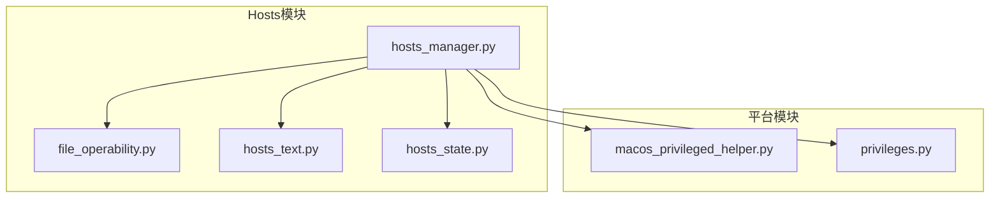
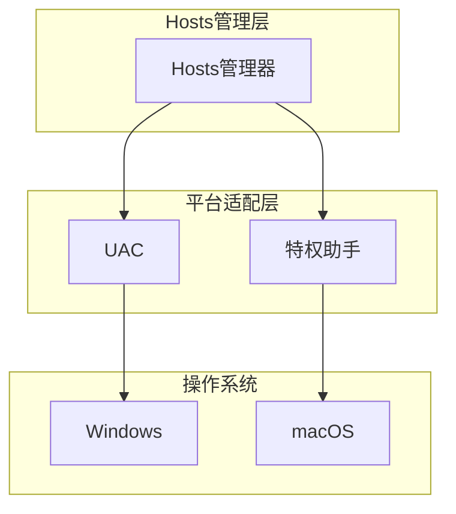
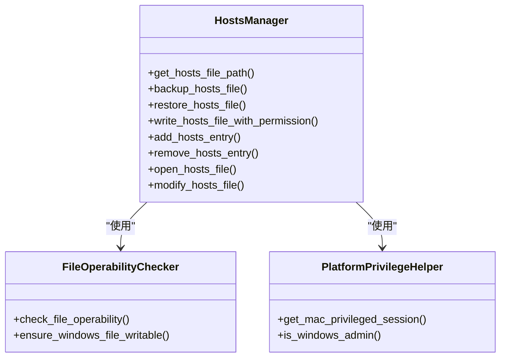
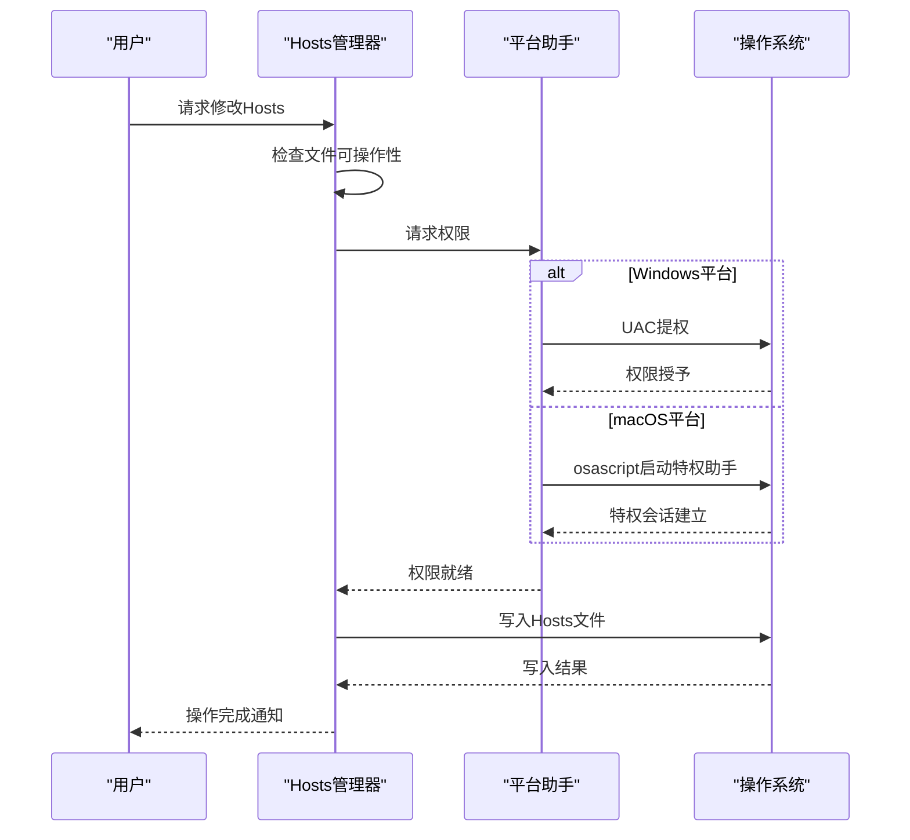
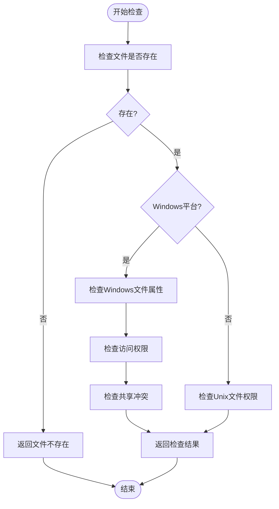
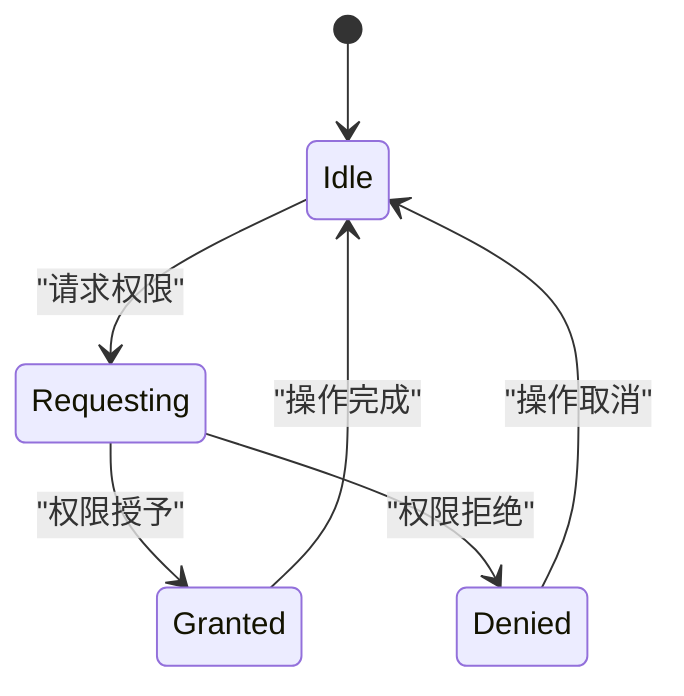
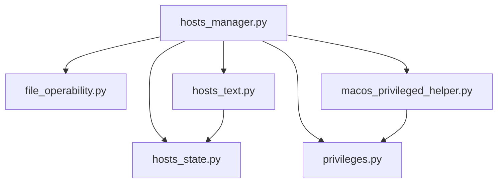

# Hosts文件问题排查

<cite>
**本文档引用的文件**   
- [hosts_manager.py](file://modules/hosts/hosts_manager.py)
- [file_operability.py](file://modules/hosts/file_operability.py)
- [macos_privileged_helper.py](file://modules/platform/macos_privileged_helper.py)
- [privileges.py](file://modules/platform/privileges.py)
- [hosts_text.py](file://modules/hosts/hosts_text.py)
- [hosts_state.py](file://modules/hosts/hosts_state.py)
- [hosts_actions.py](file://modules/actions/hosts_actions.py)
- [hosts_service.py](file://modules/services/hosts_service.py)
- [error_codes.py](file://modules/runtime/error_codes.py)
- [result_messages.py](file://modules/runtime/result_messages.py)
</cite>

## 目录
1. [简介](#简介)
2. [项目结构](#项目结构)
3. [核心组件](#核心组件)
4. [架构概述](#架构概述)
5. [详细组件分析](#详细组件分析)
6. [依赖分析](#依赖分析)
7. [性能考虑](#性能考虑)
8. [故障排除指南](#故障排除指南)
9. [结论](#结论)

## 简介
本文档详细阐述了Hosts文件相关问题的排查方案，重点解决Hosts条目未生效、写入权限被拒等问题。基于`hosts_manager.py`的文件操作逻辑，解释Hosts文件修改的正确流程和权限要求。针对`HOSTS_WRITE_PERMISSION_DENIED`等错误，提供Windows以管理员身份运行、macOS使用特权助手的解决方案。指导用户手动验证Hosts文件内容是否包含正确的映射条目（如api.openai.com指向127.0.0.1），并说明DNS缓存刷新方法。包含文件锁定检测、备份机制验证和多行重复条目清理等实用技巧，确保Hosts修改持久有效。提供跨平台Hosts文件路径和编辑工具建议，提升用户排查效率。

## 项目结构
项目结构中与Hosts文件管理相关的模块主要位于`modules/hosts`目录下，包括`hosts_manager.py`、`file_operability.py`、`hosts_text.py`和`hosts_state.py`。平台相关的权限处理位于`modules/platform`目录下的`macos_privileged_helper.py`和`privileges.py`。这些模块协同工作，实现跨平台的Hosts文件管理功能。

**图示来源**
- [hosts_manager.py](file://modules/hosts/hosts_manager.py#L1-L492)
- [file_operability.py](file://modules/hosts/file_operability.py#L1-L211)
- [macos_privileged_helper.py](file://modules/platform/macos_privileged_helper.py#L1-L487)
- [privileges.py](file://modules/platform/privileges.py#L1-L113)

**本节来源**
- [hosts_manager.py](file://modules/hosts/hosts_manager.py#L1-L492)
- [file_operability.py](file://modules/hosts/file_operability.py#L1-L211)
- [macos_privileged_helper.py](file://modules/platform/macos_privileged_helper.py#L1-L487)
- [privileges.py](file://modules/platform/privileges.py#L1-L113)

## 核心组件
核心组件包括Hosts文件管理器、文件可操作性检查器、跨平台权限处理模块和Hosts文本处理器。`hosts_manager.py`是主要的管理模块，负责Hosts文件的备份、修改、还原等操作。`file_operability.py`提供文件可操作性检查功能，`macos_privileged_helper.py`处理macOS平台的特权操作，`privileges.py`提供Windows平台的权限检查功能。

**本节来源**
- [hosts_manager.py](file://modules/hosts/hosts_manager.py#L1-L492)
- [file_operability.py](file://modules/hosts/file_operability.py#L1-L211)
- [macos_privileged_helper.py](file://modules/platform/macos_privileged_helper.py#L1-L487)
- [privileges.py](file://modules/platform/privileges.py#L1-L113)

## 架构概述
系统采用分层架构，上层为Hosts管理模块，中层为平台适配模块，底层为操作系统。Hosts管理模块通过平台适配模块与操作系统交互，实现跨平台的Hosts文件管理功能。在Windows平台上，通过UAC（用户账户控制）请求管理员权限；在macOS平台上，通过osascript启动特权助手进程。

**图示来源**
- [hosts_manager.py](file://modules/hosts/hosts_manager.py#L1-L492)
- [macos_privileged_helper.py](file://modules/platform/macos_privileged_helper.py#L1-L487)
- [privileges.py](file://modules/platform/privileges.py#L1-L113)

## 详细组件分析

### Hosts管理器分析
Hosts管理器负责Hosts文件的完整生命周期管理，包括添加、删除、备份和还原操作。它通过`write_hosts_file_with_permission`函数处理跨平台的权限问题，在macOS上使用特权助手，在Windows上检查管理员权限。

#### 类图

**图示来源**
- [hosts_manager.py](file://modules/hosts/hosts_manager.py#L1-L492)
- [file_operability.py](file://modules/hosts/file_operability.py#L1-L211)
- [macos_privileged_helper.py](file://modules/platform/macos_privileged_helper.py#L1-L487)

#### 操作流程序列图

**图示来源**
- [hosts_manager.py](file://modules/hosts/hosts_manager.py#L1-L492)
- [macos_privileged_helper.py](file://modules/platform/macos_privileged_helper.py#L1-L487)
- [privileges.py](file://modules/platform/privileges.py#L1-L113)

**本节来源**
- [hosts_manager.py](file://modules/hosts/hosts_manager.py#L1-L492)
- [file_operability.py](file://modules/hosts/file_operability.py#L1-L211)
- [macos_privileged_helper.py](file://modules/platform/macos_privileged_helper.py#L1-L487)
- [privileges.py](file://modules/platform/privileges.py#L1-L113)

### 文件可操作性检查分析
文件可操作性检查模块负责在写入Hosts文件前进行预检，确保文件可写。在Windows上，它检查文件属性、权限和共享状态；在其他平台上，使用标准的文件访问检查。

#### 流程图

**图示来源**
- [file_operability.py](file://modules/hosts/file_operability.py#L1-L211)

**本节来源**
- [file_operability.py](file://modules/hosts/file_operability.py#L1-L211)

### 跨平台权限处理分析
跨平台权限处理模块为不同操作系统提供统一的权限管理接口。在Windows上使用UAC，在macOS上使用特权助手进程，在Linux上建议使用sudo。

#### 状态图

**图示来源**
- [macos_privileged_helper.py](file://modules/platform/macos_privileged_helper.py#L1-L487)
- [privileges.py](file://modules/platform/privileges.py#L1-L113)

**本节来源**
- [macos_privileged_helper.py](file://modules/platform/macos_privileged_helper.py#L1-L487)
- [privileges.py](file://modules/platform/privileges.py#L1-L113)

## 依赖分析
Hosts管理模块依赖于多个子模块和平台特定的权限处理模块。主要依赖关系包括：`hosts_manager.py`依赖`file_operability.py`进行文件可操作性检查，依赖`macos_privileged_helper.py`处理macOS特权操作，依赖`privileges.py`检查Windows管理员权限。

**图示来源**
- [hosts_manager.py](file://modules/hosts/hosts_manager.py#L1-L492)
- [file_operability.py](file://modules/hosts/file_operability.py#L1-L211)
- [macos_privileged_helper.py](file://modules/platform/macos_privileged_helper.py#L1-L487)
- [privileges.py](file://modules/platform/privileges.py#L1-L113)

**本节来源**
- [hosts_manager.py](file://modules/hosts/hosts_manager.py#L1-L492)
- [file_operability.py](file://modules/hosts/file_operability.py#L1-L211)
- [macos_privileged_helper.py](file://modules/platform/macos_privileged_helper.py#L1-L487)
- [privileges.py](file://modules/platform/privileges.py#L1-L113)

## 性能考虑
Hosts文件操作的性能主要受文件系统I/O和权限检查的影响。系统通过以下方式优化性能：
1. 使用原子性写入操作减少文件系统操作次数
2. 缓存权限会话避免重复的权限请求
3. 预检文件可操作性避免不必要的操作
4. 使用适当的文件编码检测减少I/O错误

## 故障排除指南
当遇到Hosts文件修改问题时，可以按照以下步骤进行排查：

1. **检查权限**：确保程序以管理员权限运行。在Windows上右键选择"以管理员身份运行"，在macOS上系统会自动请求权限。
2. **验证文件路径**：确认Hosts文件路径正确。Windows默认路径为`C:\Windows\System32\drivers\etc\hosts`，macOS和Linux为`/etc/hosts`。
3. **检查文件锁定**：确保没有其他程序锁定Hosts文件。可以重启系统后立即尝试修改。
4. **验证内容**：手动检查Hosts文件是否包含正确的映射条目，如`127.0.0.1 api.openai.com`。
5. **刷新DNS缓存**：修改Hosts文件后，需要刷新DNS缓存使更改生效。Windows使用`ipconfig /flushdns`，macOS使用`sudo dscacheutil -flushcache`。
6. **检查备份**：系统会自动备份Hosts文件，可以在用户数据目录找到备份文件。
7. **清理重复条目**：系统会自动检测并清理重复的Hosts条目，确保配置的唯一性。

**本节来源**
- [hosts_manager.py](file://modules/hosts/hosts_manager.py#L1-L492)
- [file_operability.py](file://modules/hosts/file_operability.py#L1-L211)
- [macos_privileged_helper.py](file://modules/platform/macos_privileged_helper.py#L1-L487)
- [privileges.py](file://modules/platform/privileges.py#L1-L113)

## 结论
本文档详细介绍了Hosts文件管理系统的架构和实现细节，提供了完整的故障排除方案。通过理解系统的权限处理机制和操作流程，用户可以有效解决Hosts文件相关的各种问题。系统设计考虑了跨平台兼容性和安全性，确保Hosts文件修改的可靠性和持久性。