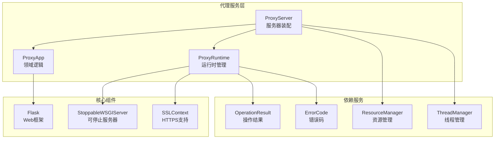
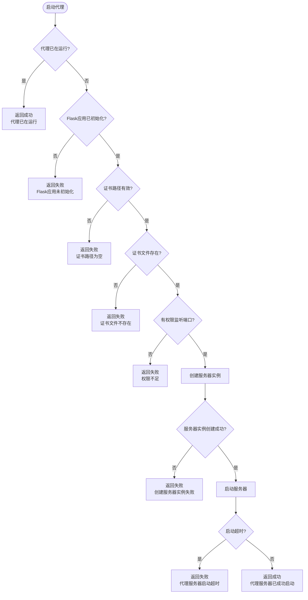
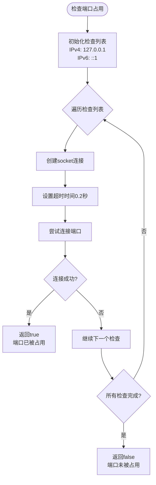
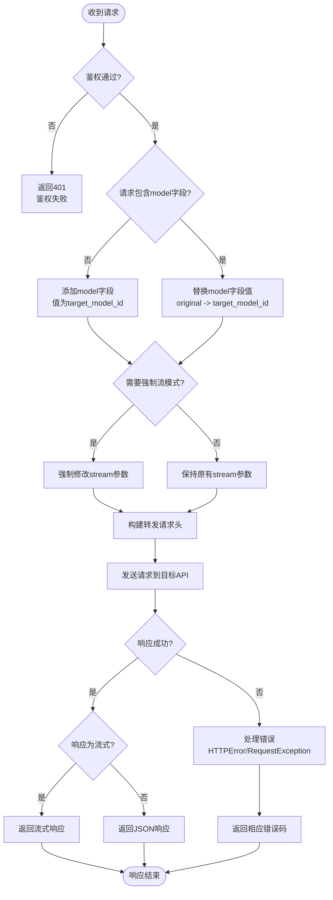
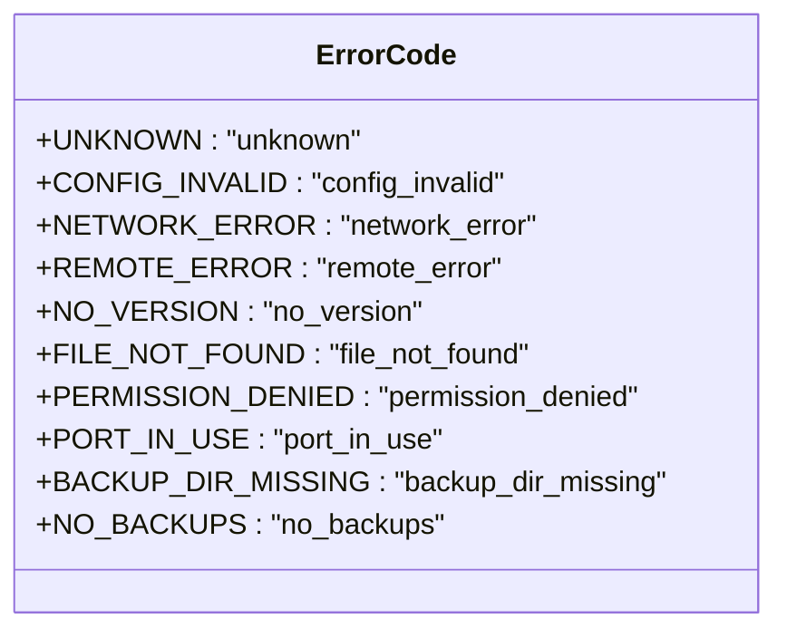
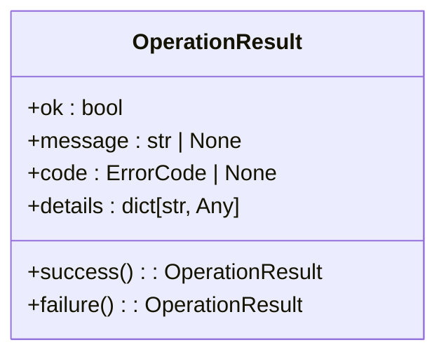
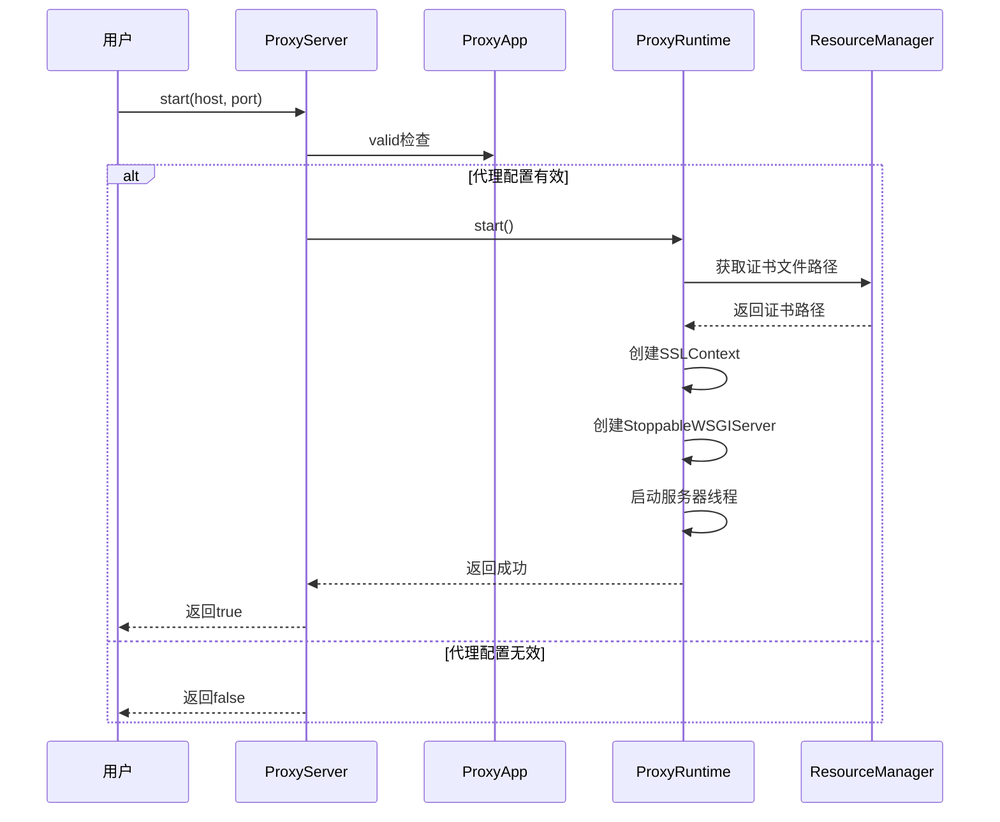
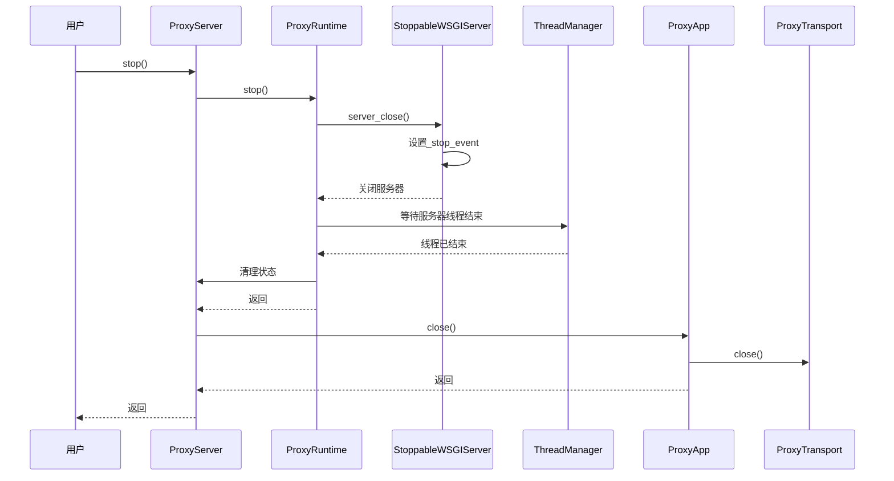
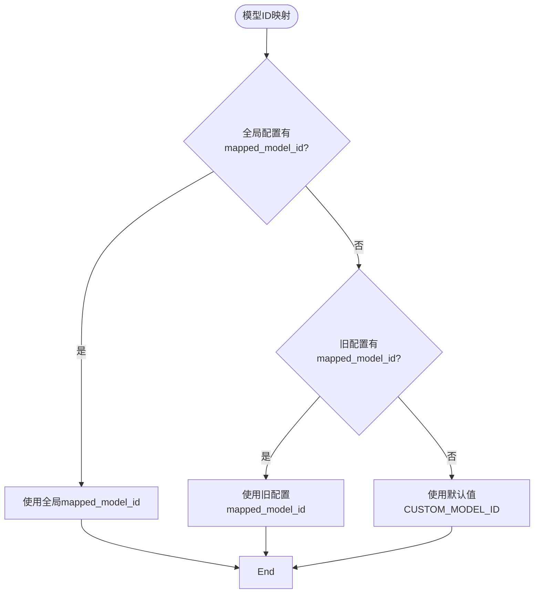
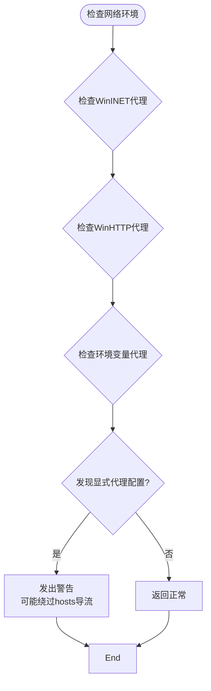

# 代理服务问题排查

<cite>
**本文档引用文件**  
- [proxy_server.py](file://modules/proxy/proxy_server.py)
- [proxy_runtime.py](file://modules/proxy/proxy_runtime.py)
- [proxy_app.py](file://modules/proxy/proxy_app.py)
- [error_codes.py](file://modules/runtime/error_codes.py)
- [operation_result.py](file://modules/runtime/operation_result.py)
- [proxy_config.py](file://modules/proxy/proxy_config.py)
- [network_utils.py](file://modules/network/network_utils.py)
- [network_environment.py](file://modules/network/network_environment.py)
- [proxy_actions.py](file://modules/actions/proxy_actions.py)
- [proxy_orchestration.py](file://modules/services/proxy_orchestration.py)
- [proxy_state.py](file://modules/services/proxy_state.py)
</cite>

## 目录
1. [简介](#简介)
2. [代理服务架构](#代理服务架构)
3. [代理启动失败排查](#代理启动失败排查)
4. [端口占用问题处理](#端口占用问题处理)
5. [请求转发异常分析](#请求转发异常分析)
6. [错误码详解](#错误码详解)
7. [代理服务生命周期管理](#代理服务生命周期管理)
8. [调试与监控手段](#调试与监控手段)
9. [高级配置与兼容性](#高级配置与兼容性)
10. [结论](#结论)

## 简介
本文档旨在为ModelRelay项目中的代理服务提供全面的问题排查指南。文档重点解决代理启动失败、端口占用和请求转发异常等常见问题，基于`proxy_server.py`的Flask服务实现，详细解释PROXY_PORT_IN_USE、NETWORK_ERROR等错误码的触发条件和应对策略。

文档指导用户检查指定端口（默认443）是否被其他进程占用，并提供端口修改配置方法。同时说明代理服务生命周期管理机制，包括启动、运行时状态监控和优雅关闭。涵盖请求日志查看、HTTPS解密验证和模型ID映射规则检查等调试手段。

此外，文档提供使用netstat/lsof命令检测端口占用、防火墙规则配置和代理链兼容性测试的高级指导，确保本地代理稳定运行。

## 代理服务架构



**图示来源**  
- [proxy_server.py](file://modules/proxy/proxy_server.py#L14-L64)
- [proxy_app.py](file://modules/proxy/proxy_app.py#L18-L461)
- [proxy_runtime.py](file://modules/proxy/proxy_runtime.py#L46-L217)

**本节来源**  
- [proxy_server.py](file://modules/proxy/proxy_server.py#L1-L64)
- [proxy_app.py](file://modules/proxy/proxy_app.py#L1-L461)
- [proxy_runtime.py](file://modules/proxy/proxy_runtime.py#L1-L217)

## 代理启动失败排查

代理服务启动失败可能由多种原因引起，主要包括证书问题、配置错误和权限不足等。根据代码分析，`ProxyRuntime`类的`start`方法是代理启动的核心逻辑。

当代理启动时，系统会依次检查以下条件：
1. 代理服务器是否已在运行
2. Flask应用是否已初始化
3. 证书文件路径是否有效
4. 证书文件是否存在
5. 是否有足够的权限监听指定端口

如果任何检查失败，代理将无法启动，并返回相应的错误信息。例如，当证书路径为空时，系统会记录"证书路径为空"的日志，并返回`CONFIG_INVALID`错误码。



**图示来源**  
- [proxy_runtime.py](file://modules/proxy/proxy_runtime.py#L66-L170)

**本节来源**  
- [proxy_runtime.py](file://modules/proxy/proxy_runtime.py#L66-L170)
- [proxy_server.py](file://modules/proxy/proxy_server.py#L35-L47)

## 端口占用问题处理

端口占用是代理服务启动失败的常见原因之一。系统默认监听443端口，如果该端口已被其他进程占用，代理将无法启动。

### 端口占用检测

`network_utils.py`模块提供了`is_port_in_use`函数，用于检测指定端口是否被占用。该函数通过创建socket连接来检查端口状态：



**图示来源**  
- [network_utils.py](file://modules/network/network_utils.py#L6-L19)

### 端口占用解决方案

当检测到端口占用时，用户可以采取以下措施：

1. **查找占用进程**：使用系统命令查找占用端口的进程
   - Windows: `netstat -ano | findstr :443`
   - Linux/macOS: `lsof -i :443` 或 `netstat -tlnp | grep :443`

2. **终止占用进程**：根据进程ID终止占用端口的进程
   - Windows: `taskkill /PID <进程ID> /F`
   - Linux/macOS: `kill -9 <进程ID>`

3. **修改代理端口**：在配置文件中修改代理监听端口

4. **重启系统**：作为最后手段，重启系统以释放所有端口

### 预防性检查

`proxy_orchestration.py`模块在启动代理前会进行端口占用检查：

```python
if is_port_in_use(443):
    deps.log("⚠️ 端口 443 已被其他进程占用，代理服务器未启动。请释放该端口后重试。")
    return OperationResult.failure("端口已被占用", code=ErrorCode.PORT_IN_USE)
```

这种预防性检查可以避免代理启动失败，并向用户提供明确的错误信息。

**本节来源**  
- [network_utils.py](file://modules/network/network_utils.py#L6-L19)
- [proxy_orchestration.py](file://modules/services/proxy_orchestration.py#L163-L165)

## 请求转发异常分析

请求转发异常可能由多种因素引起，包括网络连接问题、目标API错误和请求处理逻辑问题。`ProxyApp`类负责处理请求转发的核心逻辑。

### 请求处理流程



**图示来源**  
- [proxy_app.py](file://modules/proxy/proxy_app.py#L164-L458)

### 常见异常及处理

1. **HTTP错误**：当目标API返回HTTP错误时，系统会捕获`HTTPError`异常，并返回相应的状态码和错误信息。

2. **连接错误**：当无法连接到目标API时，系统会捕获`RequestException`异常，并返回503服务不可用错误。

3. **JSON解析错误**：当请求体不是有效的JSON格式时，系统会返回400错误，并提示"Invalid JSON or Content-Type"。

4. **流式响应处理**：系统会正确处理流式响应，并在连接中断时进行适当的清理。

### 调试模式

当启用调试模式时，系统会记录详细的请求和响应信息，包括请求头、请求体和响应体，这有助于排查请求转发异常。

**本节来源**  
- [proxy_app.py](file://modules/proxy/proxy_app.py#L164-L458)
- [proxy_config.py](file://modules/proxy/proxy_config.py#L21-L22)

## 错误码详解

系统定义了一套完整的错误码体系，用于标识不同类型的错误。这些错误码在`error_codes.py`文件中定义，并在各个组件中使用。

### 错误码定义



**图示来源**  
- [error_codes.py](file://modules/runtime/error_codes.py#L6-L16)

### 主要错误码说明

#### PROXY_PORT_IN_USE (port_in_use)
- **触发条件**：指定端口已被其他进程占用
- **应对策略**：
  1. 使用`netstat`或`lsof`命令查找占用端口的进程
  2. 终止占用进程或修改代理监听端口
  3. 检查是否有其他实例的代理服务正在运行

#### NETWORK_ERROR (network_error)
- **触发条件**：网络连接出现问题，无法连接到目标API
- **应对策略**：
  1. 检查网络连接是否正常
  2. 验证目标API地址是否正确
  3. 检查防火墙设置是否阻止了连接
  4. 确认代理链配置是否正确

#### CONFIG_INVALID (config_invalid)
- **触发条件**：配置文件无效或缺少必要字段
- **应对策略**：
  1. 检查配置文件格式是否正确（YAML）
  2. 确认必要字段（如api_url）已正确设置
  3. 验证证书文件路径是否正确

#### PERMISSION_DENIED (permission_denied)
- **触发条件**：没有足够的权限监听指定端口（通常为1024以下的端口）
- **应对策略**：
  1. 以管理员身份运行程序
  2. 修改代理监听端口为1024以上的端口
  3. 配置系统权限以允许普通用户监听指定端口

#### FILE_NOT_FOUND (file_not_found)
- **触发条件**：证书文件或其他必要文件不存在
- **应对策略**：
  1. 检查证书文件是否已生成
  2. 验证文件路径配置是否正确
  3. 重新生成证书文件

### 错误处理机制

系统使用`OperationResult`类来封装操作结果，包含成功状态、消息、错误码和详细信息：



**图示来源**  
- [operation_result.py](file://modules/runtime/operation_result.py#L10-L37)

**本节来源**  
- [error_codes.py](file://modules/runtime/error_codes.py#L6-L16)
- [operation_result.py](file://modules/runtime/operation_result.py#L10-L37)
- [proxy_runtime.py](file://modules/proxy/proxy_runtime.py#L162-L167)

## 代理服务生命周期管理

代理服务的生命周期管理包括启动、运行时监控和优雅关闭三个主要阶段。`ProxyServer`和`ProxyRuntime`类协同工作，确保服务的稳定运行。

### 启动流程

代理服务的启动流程如下：



**图示来源**  
- [proxy_server.py](file://modules/proxy/proxy_server.py#L35-L47)
- [proxy_runtime.py](file://modules/proxy/proxy_runtime.py#L66-L170)

### 运行时状态监控

系统提供了`is_running`方法来检查代理服务的运行状态：

```python
def is_running(self) -> bool:
    return self.runtime.is_running()
```

此方法通过检查`ProxyRuntime`内部状态来确定服务是否正在运行。

### 优雅关闭

代理服务的关闭流程设计为优雅关闭，确保所有资源被正确释放：



**图示来源**  
- [proxy_server.py](file://modules/proxy/proxy_server.py#L49-L52)
- [proxy_runtime.py](file://modules/proxy/proxy_runtime.py#L172-L214)

### 状态管理

`RuntimeState`类用于管理代理运行时的状态：

```python
@dataclass
class RuntimeState:
    server: StoppableWSGIServer | None = None
    server_thread: threading.Thread | None = None
    server_task_id: str | None = None
    running: bool = False
```

这个状态对象跟踪服务器实例、线程、任务ID和运行状态，确保状态的一致性。

**本节来源**  
- [proxy_server.py](file://modules/proxy/proxy_server.py#L49-L52)
- [proxy_runtime.py](file://modules/proxy/proxy_runtime.py#L38-L43)
- [proxy_runtime.py](file://modules/proxy/proxy_runtime.py#L172-L214)

## 调试与监控手段

有效的调试和监控手段对于排查代理服务问题至关重要。系统提供了多种调试工具和监控方法。

### 日志查看

系统通过`log_func`参数接收日志函数，所有关键操作都会记录日志：

- 代理启动和停止
- 请求处理过程
- 错误信息
- 状态变化

启用调试模式后，系统会记录更详细的请求和响应信息，包括请求头、请求体和响应体。

### HTTPS解密验证

代理服务使用自签名证书进行HTTPS解密，用户需要确保：

1. CA证书已正确安装到系统信任库
2. 浏览器或客户端信任该CA证书
3. 证书文件（.crt和.key）存在且可读

### 模型ID映射规则检查

系统通过以下规则处理模型ID映射：



**图示来源**  
- [proxy_config.py](file://modules/proxy/proxy_config.py#L38-L41)

### 请求日志分析

当启用调试模式时，系统会记录详细的请求日志，包括：

- 请求时间戳
- 请求ID
- 请求头
- 请求体
- 上游响应状态码
- 上游响应头
- 完整响应体

这些日志信息对于分析请求转发异常非常有帮助。

### 状态监控

系统提供了多种方式监控代理服务状态：

1. `is_running()`方法：检查代理是否正在运行
2. 日志输出：实时查看代理状态变化
3. 系统命令：使用`netstat`或`lsof`检查端口监听状态

**本节来源**  
- [proxy_app.py](file://modules/proxy/proxy_app.py#L82-L83)
- [proxy_config.py](file://modules/proxy/proxy_config.py#L38-L41)
- [proxy_app.py](file://modules/proxy/proxy_app.py#L179-L195)

## 高级配置与兼容性

为了确保代理服务在各种环境下稳定运行，需要考虑高级配置和兼容性问题。

### 网络环境检查

`network_environment.py`模块提供了`check_network_environment`函数，用于检测可能影响代理工作的网络配置：



**图示来源**  
- [network_environment.py](file://modules/network/network_environment.py#L165-L253)

该检查会检测以下代理配置：
- WinINET代理（系统代理）
- WinHTTP代理
- PAC自动配置
- 环境变量代理（HTTP_PROXY, HTTPS_PROXY, ALL_PROXY）

当检测到显式代理配置时，系统会发出警告，因为这些配置可能导致应用优先走代理，从而绕过hosts文件的导流规则。

### 防火墙规则配置

为了确保代理服务正常工作，需要正确配置防火墙规则：

1. **入站规则**：允许指定端口（默认443）的入站连接
2. **出站规则**：允许代理服务连接到目标API
3. **应用程序规则**：允许代理程序通过防火墙

### 代理链兼容性测试

在复杂的网络环境中，代理服务可能需要与其他代理协同工作。为了确保兼容性，建议进行以下测试：

1. **直接连接测试**：不使用其他代理，直接测试代理服务
2. **代理链测试**：在其他代理之后使用本代理，测试是否正常工作
3. **TUN/VPN模式测试**：如果使用TUN/VPN模式的代理，测试兼容性

### 端口修改配置

虽然系统默认监听443端口，但用户可以通过修改代码或配置来使用其他端口。需要注意的是，1024以下的端口通常需要管理员权限。

**本节来源**  
- [network_environment.py](file://modules/network/network_environment.py#L165-L253)
- [proxy_runtime.py](file://modules/proxy/proxy_runtime.py#L35-L47)

## 结论

本文档全面介绍了ModelRelay项目中代理服务的问题排查方法。通过理解代理服务的架构、启动流程、错误处理机制和调试手段，用户可以有效解决代理启动失败、端口占用和请求转发异常等问题。

关键要点包括：
- 理解`ProxyServer`、`ProxyApp`和`ProxyRuntime`的职责分离
- 掌握`PORT_IN_USE`、`NETWORK_ERROR`等错误码的触发条件和应对策略
- 学会使用`netstat`和`lsof`命令检测端口占用
- 了解代理服务的生命周期管理机制
- 掌握调试模式下的日志分析方法
- 注意网络环境中的代理配置可能影响hosts导流

通过遵循本文档的指导，用户可以确保本地代理服务的稳定运行，并快速定位和解决可能出现的问题。