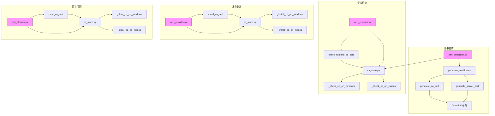
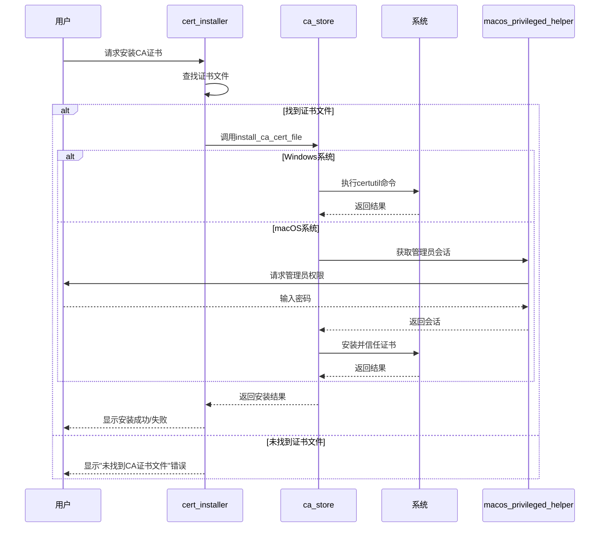
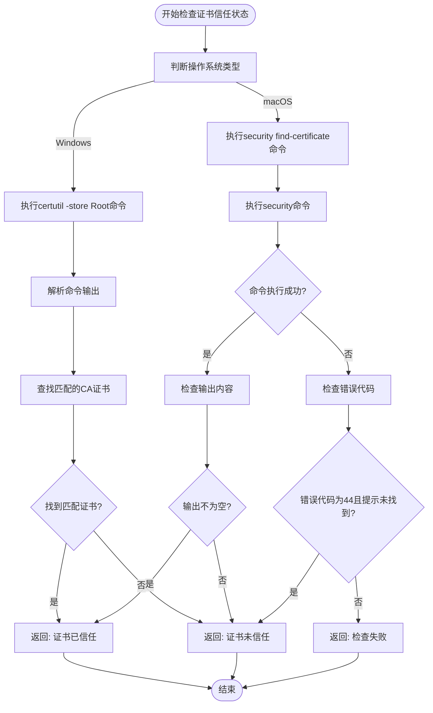
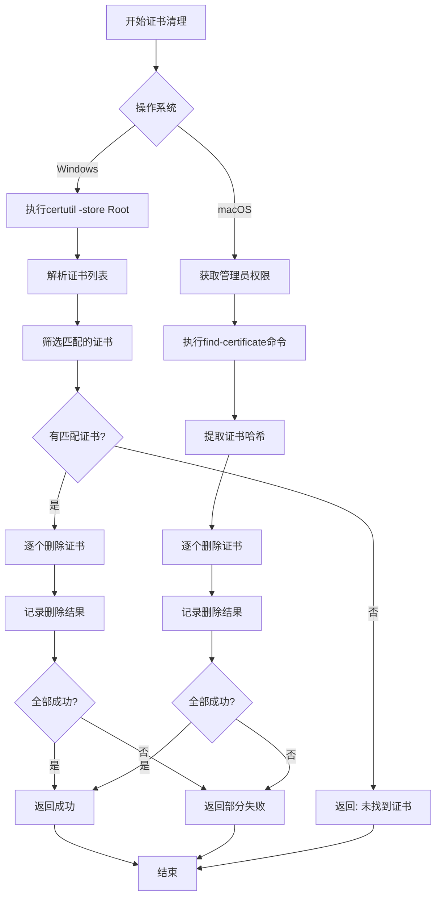
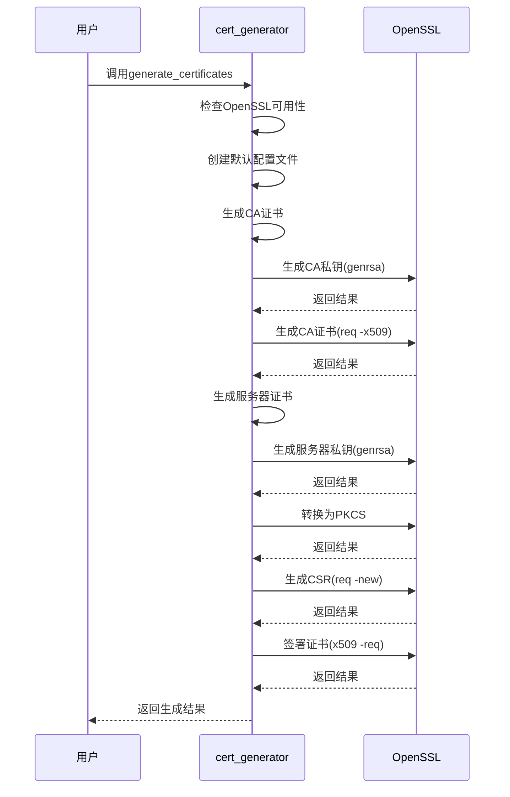
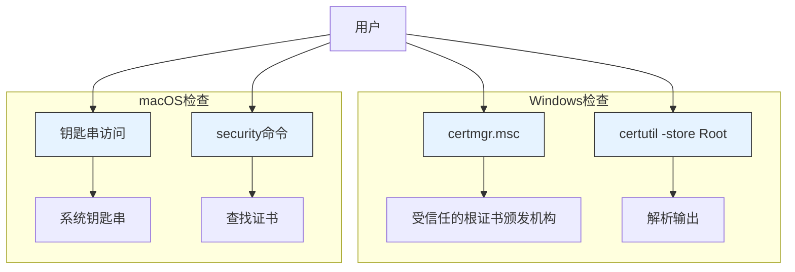
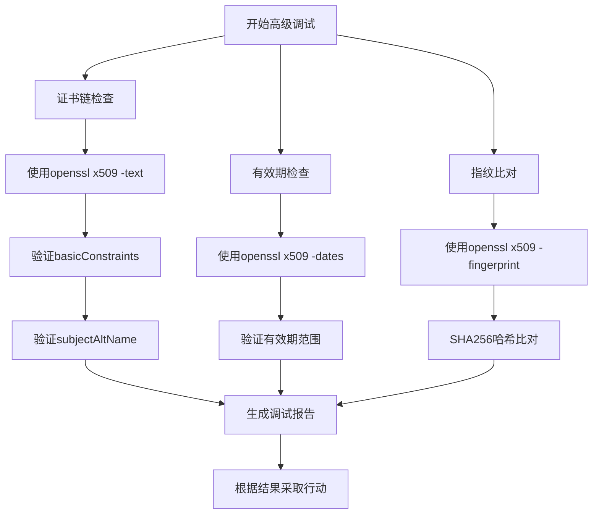

# 证书问题排查

<cite>
**本文档引用的文件**
- [cert_checker.py](file://modules/cert/cert_checker.py)
- [cert_cleaner.py](file://modules/cert/cert_cleaner.py)
- [cert_generator.py](file://modules/cert/cert_generator.py)
- [cert_installer.py](file://modules/cert/cert_installer.py)
- [ca_store.py](file://modules/cert/ca_store.py)
- [cert_utils.py](file://modules/cert/cert_utils.py)
- [cert_actions.py](file://modules/actions/cert_actions.py)
- [cert_service.py](file://modules/services/cert_service.py)
- [operation_result.py](file://modules/runtime/operation_result.py)
- [error_codes.py](file://modules/runtime/error_codes.py)
- [result_messages.py](file://modules/runtime/result_messages.py)
- [macos_privileged_helper.py](file://modules/platform/macos_privileged_helper.py)
- [v3_ca.cnf](file://ca/v3_ca.cnf)
- [openssl.cnf](file://ca/openssl.cnf)
- [genca.sh](file://ca/genca.sh)
</cite>

## 目录
1. [简介](#简介)
2. [证书生成与验证架构](#证书生成与验证架构)
3. [常见证书错误及解决方案](#常见证书错误及解决方案)
4. [证书清理与重新生成](#证书清理与重新生成)
5. [跨平台证书存储检查](#跨平台证书存储检查)
6. [高级调试技巧](#高级调试技巧)
7. [结论](#结论)

## 简介
本指南旨在为用户提供全面的证书问题故障排查解决方案，重点解决CA证书生成、安装和信任问题。基于项目中的`cert_checker.py`证书校验逻辑，详细解释如何验证本地证书是否已正确生成并被系统信任。涵盖常见错误如CERT_INSTALL_FAILED、CERT_NOT_TRUSTED等，说明其可能原因（权限不足、证书存储位置错误、系统安全策略限制）及解决方案。指导用户使用`cert_cleaner.py`进行证书清理，并重新生成和安装证书。提供Windows和macOS平台下手动检查证书存储的方法，包括使用系统密钥链访问工具和命令行openssl验证。包含证书链完整性检查、有效期验证和指纹比对等高级调试技巧，帮助用户定位证书不被信任的根本原因。

## 证书生成与验证架构



**图表来源**
- [cert_generator.py](file://modules/cert/cert_generator.py#L386-L445)
- [cert_checker.py](file://modules/cert/cert_checker.py#L11-L21)
- [cert_installer.py](file://modules/cert/cert_installer.py#L15-L47)
- [cert_cleaner.py](file://modules/cert/cert_cleaner.py#L12-L19)
- [ca_store.py](file://modules/cert/ca_store.py#L14-L53)

**本节来源**
- [cert_generator.py](file://modules/cert/cert_generator.py#L1-L446)
- [cert_checker.py](file://modules/cert/cert_checker.py#L1-L25)
- [cert_installer.py](file://modules/cert/cert_installer.py#L1-L51)
- [cert_cleaner.py](file://modules/cert/cert_cleaner.py#L1-L23)
- [ca_store.py](file://modules/cert/ca_store.py#L1-L304)

## 常见证书错误及解决方案

### CERT_INSTALL_FAILED 错误
当证书安装失败时，系统会返回`CERT_INSTALL_FAILED`错误。根据代码分析，此错误可能由以下原因引起：

1. **权限不足**：在macOS系统上安装证书需要管理员权限。系统通过`macos_privileged_helper.py`模块请求管理员权限，如果用户拒绝授权或权限获取失败，将导致安装失败。

2. **证书文件不存在**：`cert_installer.py`模块在安装前会检查CA证书文件是否存在。它会按顺序检查以下路径：
   - `ca.crt`
   - `rootCA.crt`
   - `ca.cer`
   - `rootCA.cer`

3. **系统安全策略限制**：某些系统安全设置可能会阻止证书的安装。

**解决方案**：
- 确保以管理员身份运行程序
- 检查证书文件是否存在于正确位置
- 在macOS上，确保用户在弹出的权限请求对话框中输入正确的管理员密码



**图表来源**
- [cert_installer.py](file://modules/cert/cert_installer.py#L15-L51)
- [ca_store.py](file://modules/cert/ca_store.py#L28-L41)
- [macos_privileged_helper.py](file://modules/platform/macos_privileged_helper.py#L48-L357)

**本节来源**
- [cert_installer.py](file://modules/cert/cert_installer.py#L1-L51)
- [ca_store.py](file://modules/cert/ca_store.py#L1-L304)
- [macos_privileged_helper.py](file://modules/platform/macos_privileged_helper.py#L1-L487)

### CERT_NOT_TRUSTED 错误
证书不被信任的错误通常发生在证书已安装但未被系统正确信任的情况下。根据`ca_store.py`中的检查逻辑，系统通过以下方式验证证书的信任状态：

**Windows系统**：
- 使用`certutil -store Root`命令列出受信任的根证书颁发机构存储中的所有证书
- 解析输出并查找与指定CA Common Name匹配的证书
- 如果找到匹配项，则认为证书已被信任

**macOS系统**：
- 使用`security find-certificate`命令在系统钥匙串中查找证书
- 指定`/Library/Keychains/System.keychain`路径确保检查系统级信任存储
- 如果找到匹配的证书，则认为证书已被信任

可能的原因包括：
1. 证书被安装到用户钥匙串而非系统钥匙串
2. 证书的信任设置不正确（未设置为"始终信任"）
3. 证书链不完整



**图表来源**
- [ca_store.py](file://modules/cert/ca_store.py#L55-L117)
- [cert_utils.py](file://modules/cert/cert_utils.py#L20-L53)

**本节来源**
- [ca_store.py](file://modules/cert/ca_store.py#L1-L304)
- [cert_utils.py](file://modules/cert/cert_utils.py#L1-L72)

## 证书清理与重新生成

### 证书清理流程
当需要清理现有证书时，系统使用`cert_cleaner.py`模块执行清理操作。清理过程如下：

**Windows系统**：
1. 使用`certutil -store Root`命令列出所有受信任的根证书
2. 解析输出并筛选出与指定CA Common Name匹配的证书
3. 对每个匹配的证书，使用`certutil -delstore Root <thumbprint>`命令删除
4. 处理删除过程中的任何失败情况

**macOS系统**：
1. 获取管理员权限会话
2. 使用`security find-certificate`命令查找所有匹配的证书
3. 提取每个证书的SHA-1哈希值
4. 使用`sudo security delete-certificate`命令删除每个证书



**图表来源**
- [cert_cleaner.py](file://modules/cert/cert_cleaner.py#L12-L22)
- [ca_store.py](file://modules/cert/ca_store.py#L44-L300)

**本节来源**
- [cert_cleaner.py](file://modules/cert/cert_cleaner.py#L1-L23)
- [ca_store.py](file://modules/cert/ca_store.py#L1-L304)

### 证书重新生成
清理旧证书后，可以重新生成新的证书。`cert_generator.py`模块提供了完整的证书生成功能：

1. **创建配置文件**：如果不存在，创建必要的OpenSSL配置文件
2. **生成CA证书**：
   - 生成2048位RSA私钥
   - 使用v3_ca扩展生成自签名CA证书，有效期100年
3. **生成服务器证书**：
   - 生成服务器私钥
   - 转换为PKCS#8格式
   - 生成证书签名请求(CSR)
   - 使用CA证书签署服务器证书



**图表来源**
- [cert_generator.py](file://modules/cert/cert_generator.py#L125-L445)
- [v3_ca.cnf](file://ca/v3_ca.cnf#L1-L7)
- [openssl.cnf](file://ca/openssl.cnf#L1-L24)

**本节来源**
- [cert_generator.py](file://modules/cert/cert_generator.py#L1-L446)

## 跨平台证书存储检查

### Windows平台检查方法
在Windows系统上，可以通过以下方法手动检查证书存储：

1. **使用证书管理器**：
   - 按Win+R，输入`certmgr.msc`
   - 导航到"受信任的根证书颁发机构" -> "证书"
   - 查找名为"MTGA_CA"的证书

2. **使用命令行**：
   ```cmd
   certutil -store Root
   ```
   此命令会列出所有受信任的根证书，可以查找与CA Common Name匹配的证书。

### macOS平台检查方法
在macOS系统上，可以通过以下方法手动检查证书存储：

1. **使用钥匙串访问**：
   - 打开"应用程序" -> "实用工具" -> "钥匙串访问"
   - 在左侧选择"系统"钥匙串
   - 在搜索框中输入CA Common Name（如"MTGA_CA"）
   - 检查证书是否存在且被正确信任

2. **使用命令行**：
   ```bash
   security find-certificate -a -c "MTGA_CA" -Z /Library/Keychains/System.keychain
   ```
   此命令会查找系统钥匙串中所有名为"MTGA_CA"的证书，并显示其详细信息。



**图表来源**
- [ca_store.py](file://modules/cert/ca_store.py#L55-L117)
- [ca_store.py](file://modules/cert/ca_store.py#L120-L178)

**本节来源**
- [ca_store.py](file://modules/cert/ca_store.py#L1-L304)

## 高级调试技巧

### 证书链完整性检查
确保证书链完整是解决信任问题的关键。可以使用以下命令检查证书链：

```bash
# 检查CA证书
openssl x509 -in ca.crt -text -noout

# 检查服务器证书
openssl x509 -in api.openai.com.crt -text -noout

# 验证证书链
openssl verify -CAfile ca.crt api.openai.com.crt
```

关键检查点：
- CA证书的`basicConstraints`应包含`CA:TRUE`
- 服务器证书的`basicConstraints`应包含`CA:FALSE`
- 证书的`subjectAltName`应包含正确的域名

### 有效期验证
检查证书的有效期是否在合理范围内：

```bash
# 查看证书有效期
openssl x509 -in ca.crt -dates -noout
```

预期输出应显示合理的有效期，CA证书通常设置为长期有效（如100年），而服务器证书通常为1年。

### 指纹比对
通过比对证书指纹来验证证书的完整性：

```bash
# 计算CA证书指纹
openssl x509 -in ca.crt -fingerprint -sha256 -noout

# 计算服务器证书指纹
openssl x509 -in api.openai.com.crt -fingerprint -sha256 -noout
```

可以在不同系统或设备间比对指纹，确保使用的证书完全一致。



**图表来源**
- [cert_generator.py](file://modules/cert/cert_generator.py#L84-L90)
- [cert_generator.py](file://modules/cert/cert_generator.py#L96-L104)

**本节来源**
- [cert_generator.py](file://modules/cert/cert_generator.py#L1-L446)
- [v3_ca.cnf](file://ca/v3_ca.cnf#L1-L7)
- [api.openai.com.cnf](file://ca/api.openai.com.cnf#L1-L5)

## 结论
本指南详细介绍了证书问题的排查方法，涵盖了从证书生成、安装、检查到清理的完整生命周期。通过理解`cert_checker.py`中的校验逻辑，用户可以有效地诊断和解决CA证书相关的各种问题。关键要点包括：

1. **权限管理**：在macOS上安装和清理证书需要管理员权限，系统通过`macos_privileged_helper.py`模块处理权限提升。
2. **跨平台差异**：Windows和macOS使用不同的工具和命令来管理证书，理解这些差异对于故障排查至关重要。
3. **错误处理**：系统使用`OperationResult`类统一处理操作结果，提供详细的错误信息和代码。
4. **调试工具**：利用OpenSSL命令行工具进行高级调试，可以深入分析证书的各个属性。

通过遵循本指南中的步骤，用户应该能够解决大多数证书相关的问题，并确保代理系统能够正常工作。